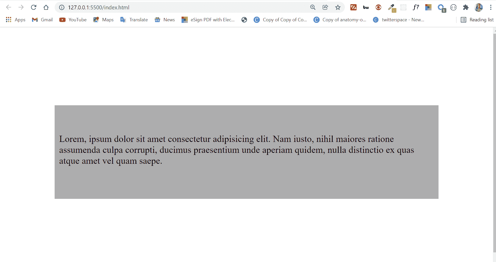
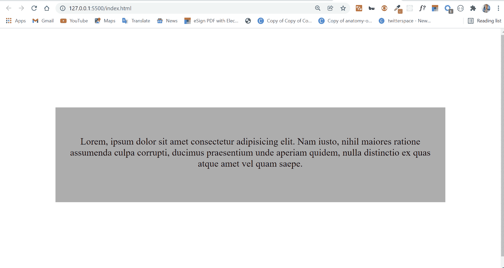
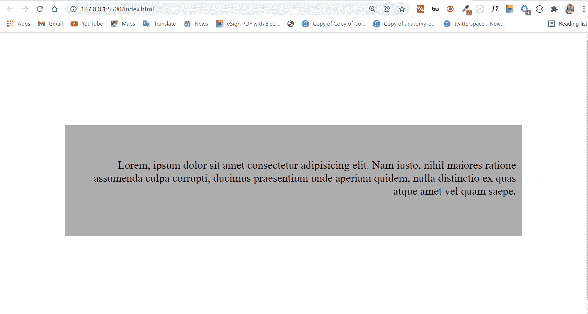
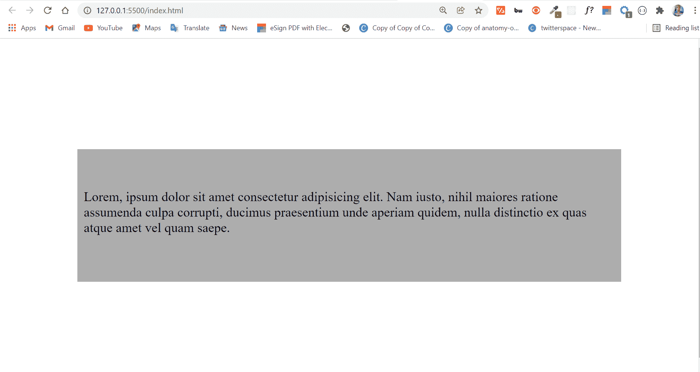
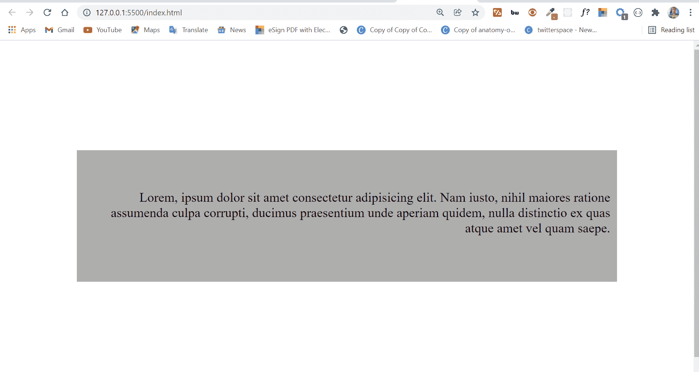
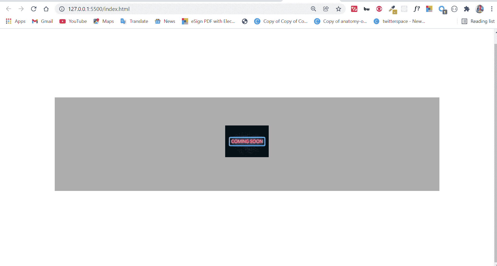

# CSS 文本对齐–居中、两端对齐、右对齐的文本样式示例

> 原文：<https://www.freecodecamp.org/news/css-text-align-centered-justified-right-aligned-text-style-example/>

我们使用 CSS `text-align`属性来对齐块级元素中的内容。

块级元素的例子有段落(`<p>...</p>`)、div(`<div>...</div>`)、小节(`<section>...</section>`)、文章(`<article>...</article>`)等等。

这种对齐只影响水平轴。因此,`text-align`属性不同于我们用来设置元素垂直对齐的`vertical-align`属性。

## 目录

*   [基本语法](#basicsyntax)
*   [属性`text-align`的值](#valuesofthetextalignproperty)
*   [的`left`值](#theleftvalue)
*   [的`center`值](#thecentervalue)
*   [的`right`值](#therightvalue)
*   [的`justify`值](#thejustifyvalue)
*   [的`inherit`值](#theinheritvalue)
*   [结论](#conclusion)

## 基本语法

下面是`text-align`属性的基本语法:

```
block-level-element {
      text-align: value;
    } 
```

现在我们来看看它可以用来帮助你在页面上定位的不同值。

## `text-align`属性的值

`text-align`属性接受`left`、`center`、`right`、`justify`和`inherit`作为值。

我们将逐一查看这些值。

在我深入研究这些值以及它们在浏览器中的样子之前，先看看下面的 CSS。我设置这些样式是为了提高可视性，这样您可以更好地看到事物:

```
 body {
      display: flex;
      align-items: center;
      justify-content: center;
      height: 100vh;
    }

    div {
      background-color: #adadad;
      width: 40rem;
      height: 4rem;
      padding: 3rem 0.5rem;
    } 
```

### `left`值

`text-align`属性的`left`值是默认值。因此，默认情况下，块级元素中的每个内容都是靠左对齐的。

```
 div {
      text-align: left;
    } 
```



如果您希望块级元素内的内容靠左对齐，您不需要为它分配一个值为`left`的`text-align`。如果你这样做，你只是在复制已经默认的东西。

### `center`值

使用中心值时，会在左侧和右侧创建空格，因此，所有内容都会被推到中心。

如果您想将块级元素内的内容居中对齐，那么`center`值是您的最佳选择。

```
 div {
      text-align: center;
    } 
```



### `right`值

将值`right`赋给`text-align`属性会将块级元素内的内容推到右边。

```
 div {
      text-align: right;
    } 
```



### `justify`值

`text-align`属性的`justify`值在块级元素(框)的左右边缘排列内容。如果最后一行不是一个完整的行，那么它就不去管它。在下图中更容易看出这是如何工作的:

```
 div {
      text-align: justify;
    } 
```


### `inherit`值

`text-align`属性的`inherit`值的行为正如其名称所暗示的那样。文本对齐值设置为`inherit`的元素继承其直接父元素的`text-align`值。

```
 div {
      text-align: inherit;
    } 
```



在这种情况下，我们的`div`继承了正文的文本对齐值——默认为`left`。

如果`body`的`text-align`值被设置为`right`，并且`div`的值被左继承，`div`内的文本向右对齐。

```
 body {
      text-align: right;
    }

    div {
      text-align: inherit;
    } 
```



## 结论

在本文中，您了解了 CSS `text-align`属性及其值。

我们在这里看到的例子中的值只包含文本，所以您可能想知道这些值是否也适用于图像。是的，他们有。

下图是文本对齐设置为居中的 div 内部的图像:

```
 <div>
      
</div> 
```

```
 div {
      text-align: center;
    } 
```



感谢您的阅读。