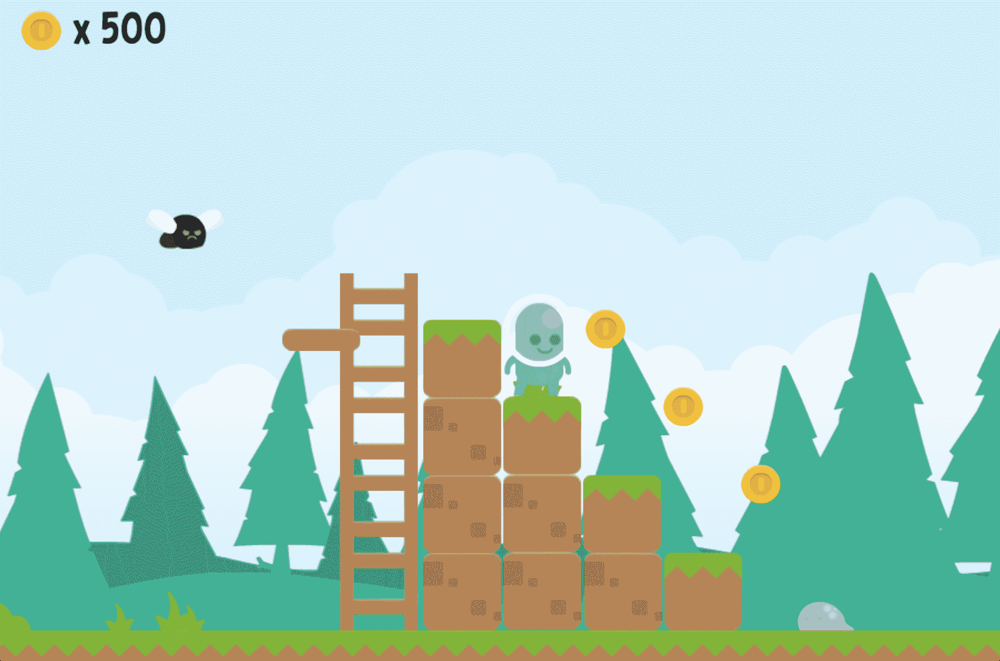

# 用 GDevelop 创建一个平台游戏

> 原文：<https://www.freecodecamp.org/news/create-a-platformer-game-with-gdevelop/>

创建自己的游戏比以往任何时候都容易！GDevelop 是一个对初学者友好的游戏引擎，它可以帮助你用很少的代码甚至不用代码来创建 2D 游戏。

我们刚刚在 freeCodeCamp.org YouTube 频道上发布了一门课程，将教你如何使用 GDevelop 创建 2D 游戏。

韦斯利和马克斯开发了这个课程。两人都是游戏开发者和课程创作者。他们是 GDevelop 团队的。

在不到一个小时的时间里，你将会学到足够的知识来开始创建你自己的游戏。

[点击此处，尝试使用 GDevelop](https://games.gdevelop-app.com/game-798e7afe-03c9-4492-8974-28c6076eb896/index.html) 创建的简单游戏。

Game created using GDevelop.

以下是本课程涵盖的主题:

*   总平面
*   对象类型
*   事件系统
*   跳跃启动
*   变量
*   表达式生成器
*   扩展ˌ扩张
*   再造小行星
*   导出游戏

观看以下全部课程或在 freeCodeCamp.org YouTube 频道观看(1 小时观看)。

[https://www.youtube.com/embed/iHF5fwsqu4I?feature=oembed](https://www.youtube.com/embed/iHF5fwsqu4I?feature=oembed)