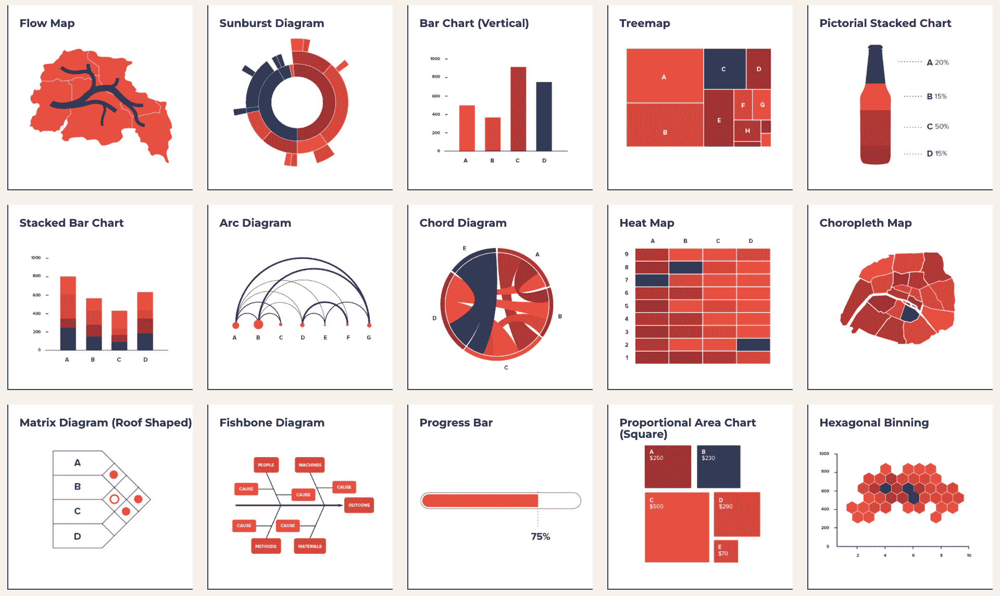
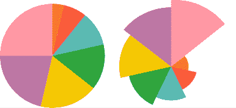

# 如何少考虑数据可视化

> 原文：<https://www.freecodecamp.org/news/data-viz-from-thought-to-chart/>

在你的母语中，你没有意识到思想和言语之间的转换。你想好你想说什么，然后说出来。从思想到语言的路径感觉是直接的。这是一个即时的 1:1 映射。

然而，当谈到数据可视化时，在您的图表想法到屏幕上的实际图形之间，通常有许多有意识的转换阶段。

考虑这些常见的翻译示例:

*   支持假设的数据集需要转换，然后才能以图表形式显示。
*   你脑海中的图表图像必须转化为 Excel 中的下拉菜单和复选框。
*   你感觉自己在一个由函数签名和 API 组成的心智数据库中滚动(我怎么再用 Matplotlib 做一个饼状图？).还好你收藏了文档，但是...

有没有一种方法可以让我们少考虑制作图表的过程？有没有我们可以遵循的启发法，让数据可视化感觉更像在说我们的第一语言？

由于已故的利兰·威尔金森的开创性工作，这些问题的答案是*是的*。

1999 年，Leland 写了《图形的语法》一书，这本书不仅介绍了一种新的图表推理方式，还提供了我们编写强大的高级数据可视化程序所需的数学基础。

利兰永远改变了我们对数据可视化的看法。

[https://www.youtube.com/embed/1X93Sum_SyM?feature=oembed](https://www.youtube.com/embed/1X93Sum_SyM?feature=oembed)

An introduction to The Grammar of Graphics

在本文中，我将通过例子展示如何使用图形语法的概念实现数据可视化。目标是提供一种结构化的、可重用的思维方式，支持从脑海中的图表到屏幕上的图表。

另外，我提供一个 [**本笔记本**](https://deepnote.com/project/Intro-to-Altair-challenges-with-code-oiylaVDoSXu1a75xovuFRw/%2Fintro_to_altair.ipynb/#00013-e392a6f0-9399-4e81-884d-de75fcd01cc1) 在 [Deepnote](http://deepnote.com/) 里面包含 30 个挑战，难度递增，帮助你测试你新的数据可视化知识。笔记本在云中运行，因此可以立即使用(不需要安装或设置)。

## 比较可视化范例

当考虑数据可视化时，考虑以下范例，特别是它们如何影响**数据探索**。

为了举例，假设您想要在 X-Y 平面上绘制三个类别的点(即彩色散点图)。

命令式视觉化指定*应该如何*做某事。例如，从实例化一个空白画布开始。使用一个 *for 循环*语句循环遍历一个将类别映射到颜色的列表。每次迭代都在画布上绘制，根据映射选择正确的数据。设置轴标签和图例位置。

这里有一个使用[M](https://matplotlib.org/)atplotlib 的命令式可视化的例子:

[https://embed.deepnote.com/b1f93d15-b954-486c-8dd0-098f619c912d/dc93c85d-ec8d-4e37-aee7-44bbdf56c95a/1278ef92-dadd-40d6-848b-da7cfe1451f7?height=557.9857788085938](https://embed.deepnote.com/b1f93d15-b954-486c-8dd0-098f619c912d/dc93c85d-ec8d-4e37-aee7-44bbdf56c95a/1278ef92-dadd-40d6-848b-da7cfe1451f7?height=557.9857788085938)

**声明性可视化**指定*应该做什么*。例如，告诉程序你想用 X-Y 点表示两个数量列。第三个类别列将用于编码颜色。

这里有一个使用 [牛郎星](https://altair-viz.github.io/)的声明性可视化的例子:

[https://embed.deepnote.com/b1f93d15-b954-486c-8dd0-098f619c912d/dc93c85d-ec8d-4e37-aee7-44bbdf56c95a/a8bd3657-5e74-4415-aaef-df05c61e7b3d?height=491.960205078125](https://embed.deepnote.com/b1f93d15-b954-486c-8dd0-098f619c912d/dc93c85d-ec8d-4e37-aee7-44bbdf56c95a/a8bd3657-5e74-4415-aaef-df05c61e7b3d?height=491.960205078125)

正如您在上面看到的，两个例子都以相似的方式表示数据。然而，实现这一目标的途径却大不相同。

命令式范式是低级的。它以冗长为代价提供了对图表的细粒度控制。请注意，许多细节必须手动指定(例如，图例位置、轴标签等)。

相反，声明性范式是高级的。它不需要太多的信息来生成一个图表(注意，合理的缺省值是由底层程序选择的，而不是必须用代码显式编写)。

这可能是以对画布上的每个细节拥有最终控制权为代价的。但是一个好的图形语法的实现可以为许多用例产生多种多样的图表。高级的、声明性的可视化库允许用户用更少的编程步骤从想法到图表。

正如您将在下一节中看到的，好处不仅仅是减少代码行。它们延伸到我们开始思考视觉化的方式。

> **声明式可视化**让你思考**数据和关系**，而不是附带的细节。杰克·范德普拉斯(T5)来源

## 为什么应该避免图表的分类

图表分类法是一种根据功能和外观将图表组织成组的方法。乍看之下，它们似乎很有帮助，但图表分类法可能是阴险的。他们将图表组合在一起的方式是不一致的，尽管乍一看这并不明显。

换句话说，这种对图表进行分组的方法并不遵循一套明确定义的逻辑(数学)规则。我将解释**为什么这很重要**，但是首先，让我提供两个图表分类法失败的典型例子。



Chart taxonomy ([source](https://datavizproject.com/))

> ...我开始意识到这些图表分类法不仅无用，而且有害。–利兰·威尔金森([来源](https://www.slideshare.net/0xdata/leland-wilkinson-h2oai-the-grammar-of-graphics-and-the-future-of-big-data-visualization-h2o-world-2019-nyc)

根据图表分类法，以下两个图表被视为*不同的*:


然而，这两个图表实际上相似之处多于不同之处。左图使用笛卡尔坐标，上图使用极坐标。这是唯一的区别。

我们来看相反的问题。根据图表分类法，以下两个图表被视为*相似*:



然而，仔细观察，这些图表在表示数据的方式上一点也不相似。左图使用角度来表示数据中的数量。相反，右边的图表使用线段的长度来表示数据，同时保持角度不变。

### 为什么这很重要？

想象一个可视化程序，它使用自己的图表分类法来映射到 GUI 菜单和/或函数调用上。对于每种任意定义的图表类型，程序都必须有相应的菜单/函数(例如，饼图函数、条形图函数、直方图函数等等)。

当然，这些功能中的一些可以组合起来，但是问题出在细节上(也就是说，哪些规则决定了是否给图表赋予它们自己的功能？).正如威尔金森指出的那样，这样的计划最终将变得不一致和臃肿。

另一方面，如果我们遵循图形方法的语法，它为数据可视化的推理提供了严格的数学规则，我们可能最终会得到内部更加一致且不那么臃肿的库和 GUI。这使得它们更容易使用和维护。

例如，看看这两个图表及其相关代码:

[https://embed.deepnote.com/b1f93d15-b954-486c-8dd0-098f619c912d/dc93c85d-ec8d-4e37-aee7-44bbdf56c95a/a8bd3657-5e74-4415-aaef-df05c61e7b3d?height=491.960205078125](https://embed.deepnote.com/b1f93d15-b954-486c-8dd0-098f619c912d/dc93c85d-ec8d-4e37-aee7-44bbdf56c95a/a8bd3657-5e74-4415-aaef-df05c61e7b3d?height=491.960205078125)

[https://embed.deepnote.com/b1f93d15-b954-486c-8dd0-098f619c912d/dc93c85d-ec8d-4e37-aee7-44bbdf56c95a/936d014c-42cf-4b40-aa23-915bdc10032f?height=491.960205078125](https://embed.deepnote.com/b1f93d15-b954-486c-8dd0-098f619c912d/dc93c85d-ec8d-4e37-aee7-44bbdf56c95a/936d014c-42cf-4b40-aa23-915bdc10032f?height=491.960205078125)

这两个图表基于相同的基础数据。尽管这些图表有非常不同的视觉外观(一个是散点图，一个是聚合条形图)，但它们是用非常相似的代码生成的。

注意，API 不受映射到一组函数调用的图表分类法的控制。因此，如果实现得好，基于语法的方法可以实现一致且易于记忆的 API。

例如，对于 Altair 中的许多统计图，通常只需要记住**两个语句**就可以将思想转化为图表。

我想要哪种几何形状？

条形、圆形、直线、弧形等...

我想如何表示数据中的列？

颜色、形状、大小、位置等...

使用上面的散点图示例，您可以说:

> 我想用一个**圆**作为我的几何形状
> T3**我想用 **X 轴上的**花瓣长度、**Y 轴上的**花瓣宽度、**和物种作为**颜色**

如果您将相关代码与这些语句进行比较，您可以看到它们自然地相互映射，不需要在思想、代码和图表之间进行太多的转换。

```
alt.Chart(df).mark_circle().encode(
    x='petalLength',
    y='petalWidth',
    color='species'
)
```

## 行动呼吁

基于语法的可视化不是万能的。但是一旦你学会以这种方式思考，制作图表会感觉更像是在说一种语言。

你在脑海中看到的图形可以在屏幕上显示出来，而不必先经过几个翻译阶段，最终的代码看起来与你用文字描述图表的方式非常不同。

一旦图形的语法成为你全部技能的一部分，你不仅在数据探索方面会更快，而且你对数据可视化的推理也会改变，变得更加高效和一致。

这不仅仅是学习一种新工具，而是改变我们对数据可视化的看法。毕竟，从一句名言引申出一个观点:

> 一种不影响你思考编程方式的语言是不值得了解的。艾伦·J·佩利

为了让你开始这种新的思维方式，我准备了[](https://deepnote.com/project/Intro-to-Altair-challenges-with-code-oiylaVDoSXu1a75xovuFRw/%2Fintro_to_altair.ipynb)****[笔记本](https://deepnote.com/project/Intro-to-Altair-challenges-with-code-oiylaVDoSXu1a75xovuFRw/%2Fintro_to_altair.ipynb)** 中的 [Deepnote](http://deepnote.com/) 。笔记本在云中运行，因此可以立即使用(无需安装或设置)。**

**你会发现 30 个图形挑战语法，难度越来越大，等着你。祝你好运！**

**[封面图片来源](https://altair-viz.github.io/)。**