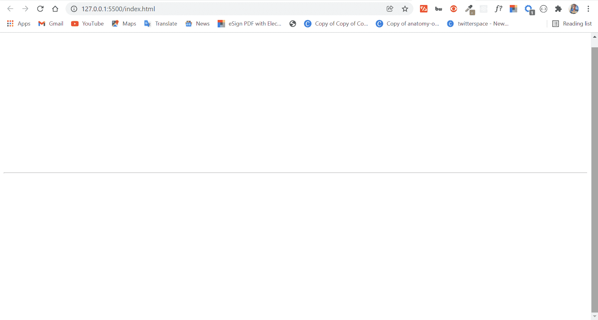
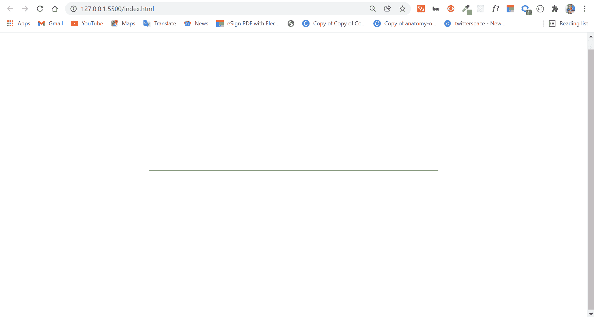
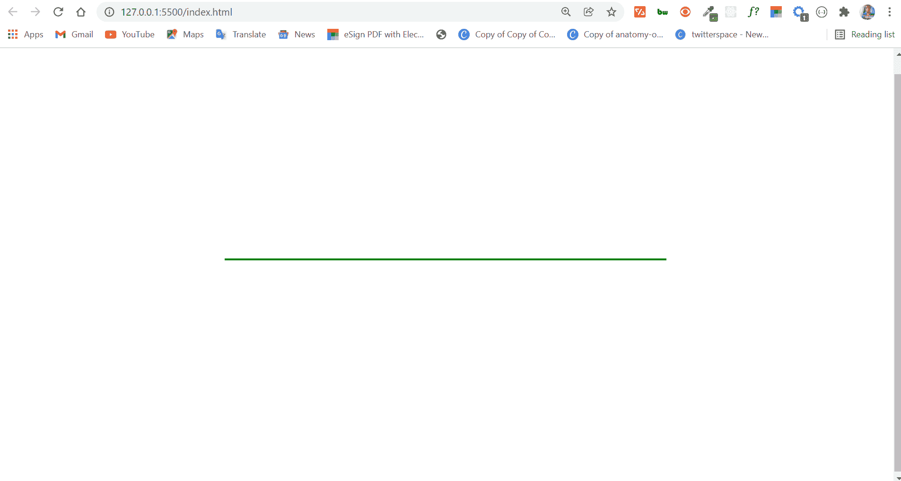
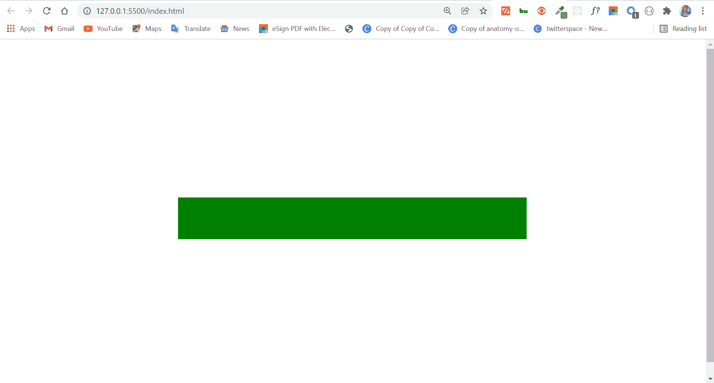
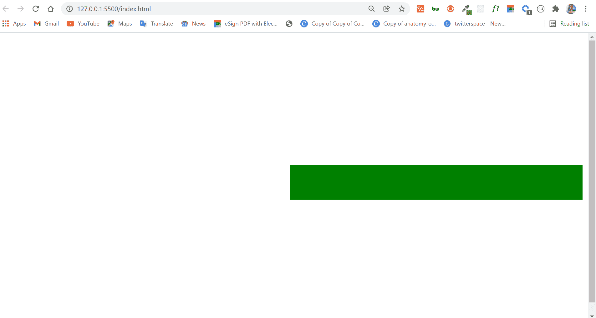

# HTML 水平线–HR 标签示例

> 原文：<https://www.freecodecamp.org/news/html-horizontal-line-hr-tag-example/>

您可以使用 HTML `<hr>`标签来分隔页面上的不同主题。

当我们想要在一个 HTML 页面上创建一个主题分隔或单独的项目时，我们经常使用这个标签。

在本文中，您将学习如何在 HTML 代码中使用这个标签。

## 目录

*   [基本语法](#basicsyntax)
*   [标签`<hr />`的属性](#attributesofhrtag)
*   [宽度属性](#thewidthattribute)
*   [颜色属性](#thecolorattribute)
*   [大小属性](#thesizeattribute)
*   [对齐属性](#thealignattribute)
*   [结论](#conclusion)

## 基本语法

`<hr>`标签是一个空元素。这意味着它只有一个开始标签，`<hr>`。

从 HTML5 开始，我们现在需要在空元素的标签上附加一个斜杠。所以，你应该把它变成`<hr />`，而不是只有`<hr>`。

在浏览器中，`<hr />`标签显示为一条水平线，比如:


## `<hr />`标签的属性

`<hr />`标签接受诸如`width`、`color`、`size`和`align`的属性。

在向您展示各个属性的外观和工作方式之前，我将使用以下 CSS 代码将正文中的所有内容设置为居中:

```
body {
      display: flex;
      align-items: center;
      justify-content: center;
      height: 100vh;
    } 
```

### 宽度属性

`width`属性用于指定`<hr />`标签的宽度。它以像素或百分比作为值。

```
<hr width="50%" /> 
```



### 颜色属性

`color`属性用于指定`<hr />`标签的颜色。

```
 <hr width="50%" color="green" /> 
```

如果我们为`<hr />`标签设置了绿色:


### 大小属性

您可以使用`size`属性定义`<hr />`标签的高度。该值必须以像素为单位设置。

```
<hr width="50%" color="green" size="50px" /> 
```

一个`50px`的身高看起来像下面的截图:


### 对齐属性

`align`属性用于设置`<hr />`标签的对齐方式。它需要`left`、`center`和`right`值。

默认为左对齐–这意味着如果没有设置对齐方式，`<hr />`标签会自动向左对齐。

```
 <hr width="50%" color="green" size="50px" align="right" /> 
```

为`<hr />`标签设置`right`的对齐方式如下:


## 结论

本文向您展示了`<hr />`标签的样子、用途以及它接受的属性。

由于`<hr />`标签在浏览器中显示为水平线，您可能会考虑用它来画线。

但是您不应该这样做，因为水平规则看起来只是表象上的，而不是语义上的。相反，你应该视情况用`div`或`span`画线。

如果你觉得这篇文章有帮助，分享给你的朋友和家人。