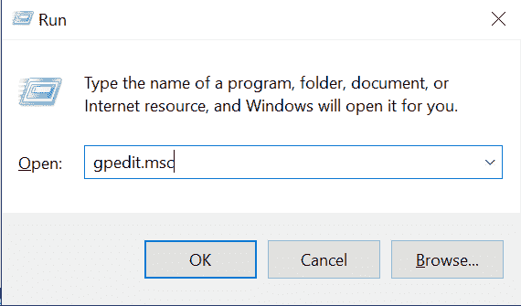

# 管理员已阻止您运行此应用程序-如何在 Windows 10 PC 上修复

> 原文：<https://www.freecodecamp.org/news/an-administrator-has-blocked-you-from-running-this-app-how-to-fix-on-a-windows-10-pc/>

有时，当您决定在 Windows 10 PC 上打开应用程序或文件或安装或打开程序时，您可能会收到错误消息“管理员已阻止您运行此应用程序”。

您会收到此错误，因为 Windows 10 通过 Windows Defender 和用户帐户控制(UAC)针对恶意软件进行了优化。

但有时，这种保护过于敏感。因此，在某些情况下，即使当您试图运行受信任的应用程序或打开受信任的文件时，也会出现错误。

希望今天是你在 Windows 10 电脑上看到这个错误弹出的最后一天。因为在这篇文章中，我将向你展示 5 种方法来修复它，这样你就可以开始使用你的电脑而不用担心出错。

**PS** :如果你在运行一个受信任的应用程序或试图打开一个受信任的文件时遇到这个错误，本文提供的解决方案就是为你准备的。如果你不信任这款应用，只有在你准备好冒险的情况下才使用任何解决方案。

## 目录

*   [暂时禁用您的防病毒程序](#solution1temporarilydisableyourantivirusprogram)
*   [禁用 Windows Smartscreen 功能](#solution2disablethewindowssmartscreenfeature)
*   [解锁文件](#solution3unblockthefile)
*   [在命令提示符下运行应用程序](#solution4runtheappwiththecommandprompt)
*   [对组策略进行更改](#solution5makechangestothegrouppolicy)
*   [结论](#conclusion)

## 解决方案 1:暂时禁用您的防病毒程序

如果您收到“管理员已阻止您运行此应用程序”错误，这可能是因为您的防病毒应用程序。

因此，禁用反病毒应用程序可以提供一个解决方案。

无论您使用内置的 Windows Defender 还是第三方防病毒程序，下面的步骤将有助于禁用它。

**第一步**:按键盘上的`ALT` + `SHIFT` + `ESC`，打开任务管理器。

**第二步**:切换到启动页签。

**第三步**:在列表中找到你的杀毒程序，点击右键，选择“禁用”。

如果你没有在启动标签中找到你的杀毒程序，那么检查进程标签。

## 解决方案 2:禁用 Windows Smartscreen 功能

Windows Smartscreen 是一项反恶意软件功能，可与 Windows Defender 配合使用来阻止恶意软件。

有时，即使您使用的是受信任的应用程序，也会触发此错误。

要禁用 Smartscreen，请执行以下步骤:

**第一步**:按键盘上的`WIN` + `S`，搜索“smartscreen”，然后点击“App &浏览器控制”搜索结果。

**步骤 2** :打开“基于信誉的防护设置”链接。

**第三步**:关闭“潜在有害应用拦截”下的切换。

## 解决方案 3:取消阻止文件

如果您在打开文件时遇到错误，这个解决方案非常适合您。

**步骤 1** :右键点击文件，选择属性。

**步骤 2** :在常规选项卡中，勾选“安全”下的“解除阻止”。

**第三步**:点击应用，然后点击确定。

## 解决方案 4:使用命令提示符运行应用程序

命令提示符允许您运行应用程序并绕过管理员检查。

因此，如果您使用命令提示符运行触发错误的应用程序，就可以避免出现此错误。

以下步骤显示了如何使用命令提示符运行任何应用程序:

**步骤 1** :找到触发错误的 app，点击右键，选择打开文件位置。

**第二步**:右键点击文件，选择属性。

**第三步**:在常规选项卡中，复制位置下的文本。先不要关闭属性窗口。

**第四步**:点击开始，搜索“cmd”，然后在右边选择以管理员身份运行。

**第五步**:在命令提示符下，粘贴你在第三步复制的文本，然后最小化命令提示符。

**第五步**:回到第一步打开的属性，复制文件名。

**第六步**:最大化命令提示符，在第四步粘贴的文本前面键入" "(斜线)，粘贴文件名，如下图截图所示。

**第七步**:点击`ENTER`最终启动应用。

## 解决方案 5:更改组策略

使用组策略，您可以进行在计算机上其他地方不容易找到的更改。

可以在用户帐户控制(UAC)上进行这些更改之一，以允许应用程序逃避管理员检查。

要进行更改以消除错误，请按照以下步骤操作:

**第一步**:按键盘上的`WIN` + `R`打开跑步对话框。

**第二步**:在运行对话框中，输入“gpedit.msc”并点击键盘上的`ENTER`。

**步骤 3** :在计算机配置下，展开 Windows 设置、安全设置、本地策略。

**第四步**:点击安全选项。不要试图展开它，只要点击它。

**第五步**:导航到底部，双击“用户账户控制:以管理员审批模式运行所有管理员”。

**第六步**:选择禁用，点击应用，然后点击确定。

## 结论

本文向您展示了 5 种不同的方法来修复“管理员阻止您运行此应用程序”错误。

此错误信息只是出现错误的三种方式之一。

如果你以“你的系统管理员阻止了这个程序组策略、GPO、Regedit”的形式得到它，那么[解决方案 5](#solution5makechangestothegrouppolicy) 适合你。

如果你得到的是“你的系统管理员已经阻止了这个程序 uTorrent，Avast，AVG”的形式，那么[解决方案 1](#solution1temporarilydisableyourantivirusprogram) 就是为你准备的。

简而言之，您只需要找出错误的来源，然后选择适合您情况的解决方案。

如果你觉得这篇文章有帮助，可以考虑与你的朋友和家人分享。

感谢您的阅读。