# 如何在 Windows 中使用 GUI 和 CLI 删除磁盘或存储设备

> 原文：<https://www.freecodecamp.org/news/how-to-format-storage-disk-in-windows-gui-cli/>

删除或格式化磁盘或存储设备是大多数计算机用户的常见任务。

如果您使用 Windows 操作系统，通常会使用任何 Windows 操作系统内置的 GUI 磁盘管理应用程序来完成。

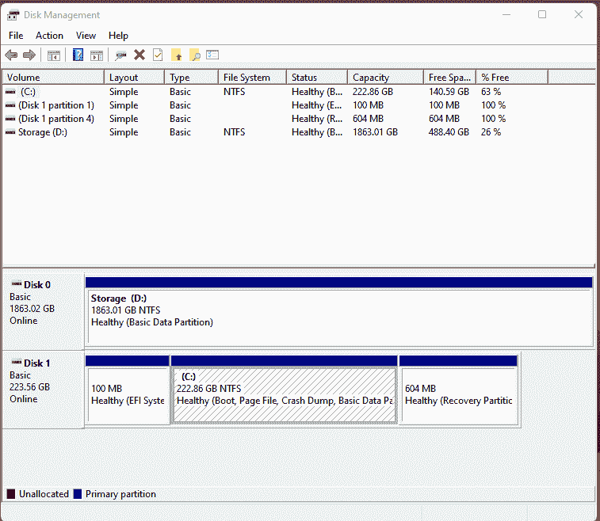

Disk Management (GUI)

有时，您可能很难使用 GUI 应用程序删除磁盘，因此您需要使用 CLI(命令提示符)来删除磁盘。

在本文中，我将向您介绍使用 GUI 方法和 CLI 方法直接从 Windows 操作系统本身删除任何类型的存储设备的磁盘的过程。我将用我的一个 32GB 的硬盘作为实验品。

**重要提示:**在删除磁盘或存储设备之前，请首先确保您已将所有数据复制到另一个驱动器/存储设备。

My guinea pig

## 如何使用 GUI(图形用户界面)方法格式化或删除磁盘

首先，打开磁盘管理。你可以通过多种方式做到这一点，但我在这里只向你展示两种方式。

点击任务栏中的搜索图标，输入`Disk Management`。点击`Create and format hard disk partitions`。

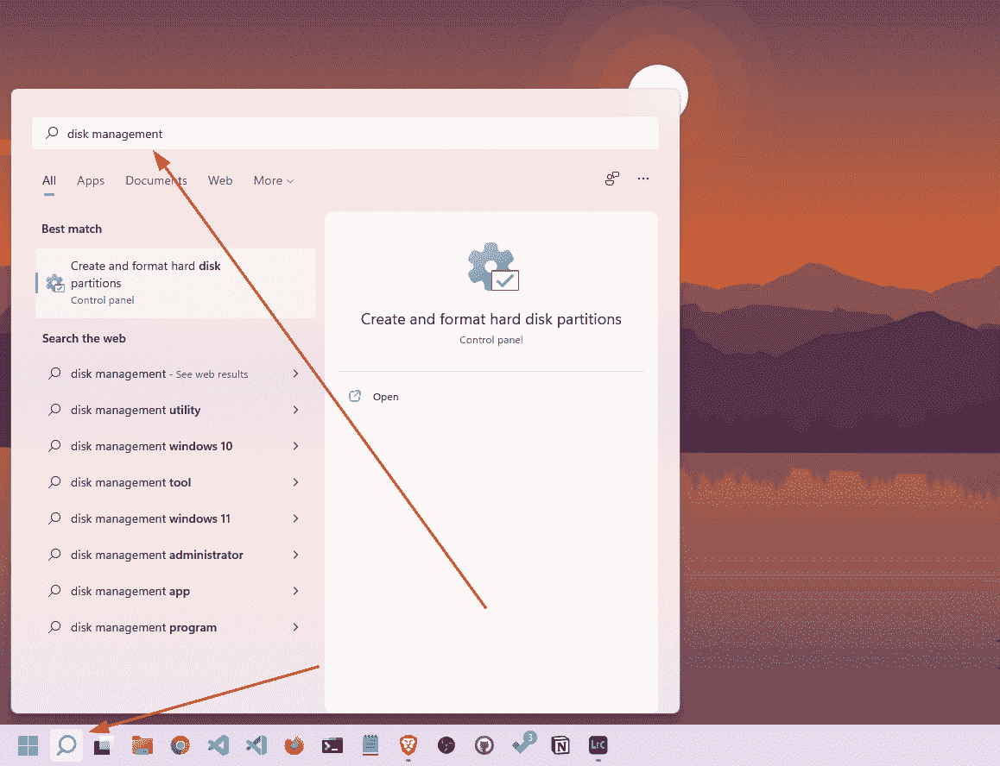

Search result for Disk Management

或者，您可以打开控制面板并搜索`Disk Management`。你会在`Windows Tools`下得到`Create and format hard disk partitions`。点击那个。

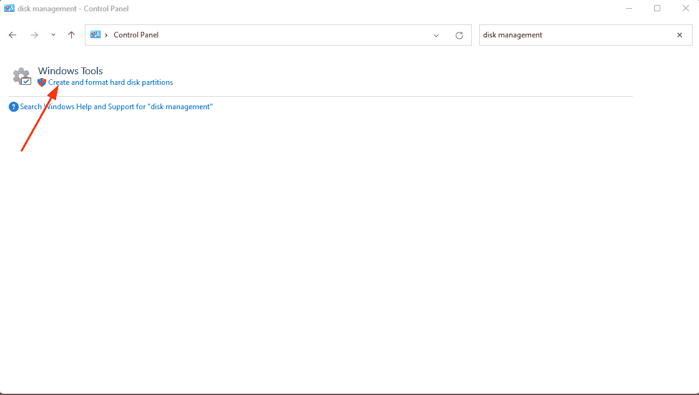

Search result for Disk Management in the Control Panel

`Disk Management`工具将打开并显示所有存储设备及其分区。这里的第三个选项—**磁盘 2**—是我们的试验品(32GB Pendrive)。

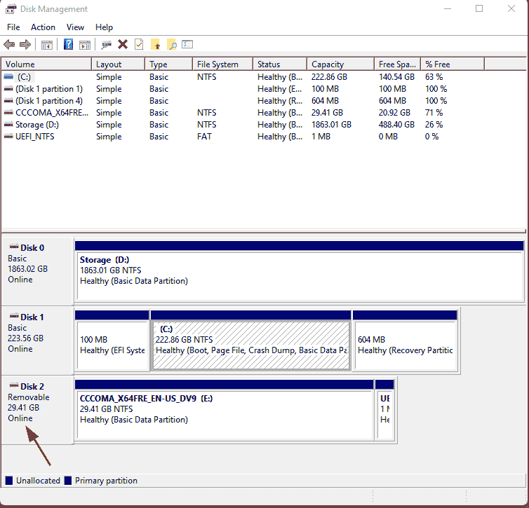

Our guinea pig in the Disk Management

假设你要删除**磁盘 2** 的第一个分区。然后，您需要遵循以下步骤:

首先，右键单击要删除的分区。然后点击`Delete Volume...`。

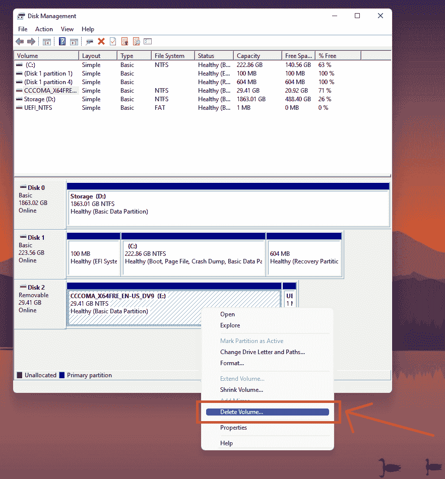

Click on Delete Volume...

确保您之前已经复制了整个磁盘/存储器中的所有内容。如果您已经完成了，只需点击`Yes`。

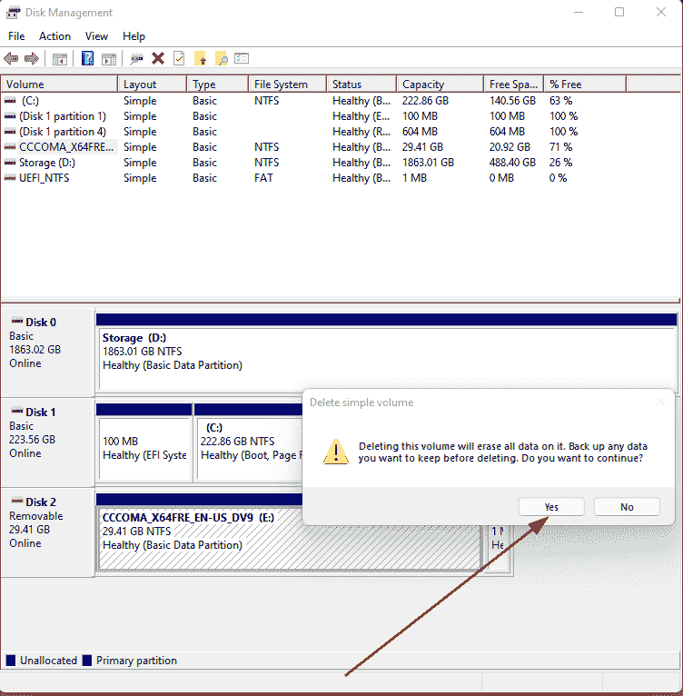

Prompt windows before deleting a partition or storage

可能会出现另一个提示窗口，说明它当前正在使用中。确保没有其他任务或应用程序正在使用该驱动器/分区。然后只需点击`Yes`。

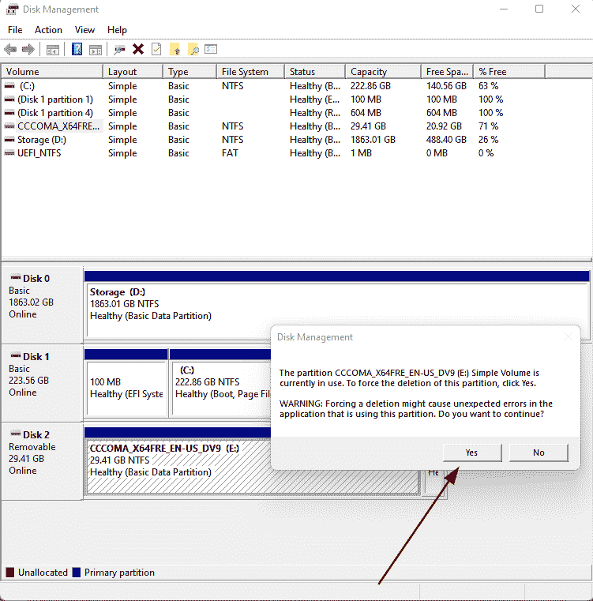

Another prompt

现在，您将看到该分区已被分配。

After deleting a partition of Disk 2

这样，你可以删除任何分区。稍后，您可以从中创建一个新分区，或者用其他现有分区扩展该分区。

要完全删除存储/磁盘，您必须手动删除它拥有的所有分区，如下所示:

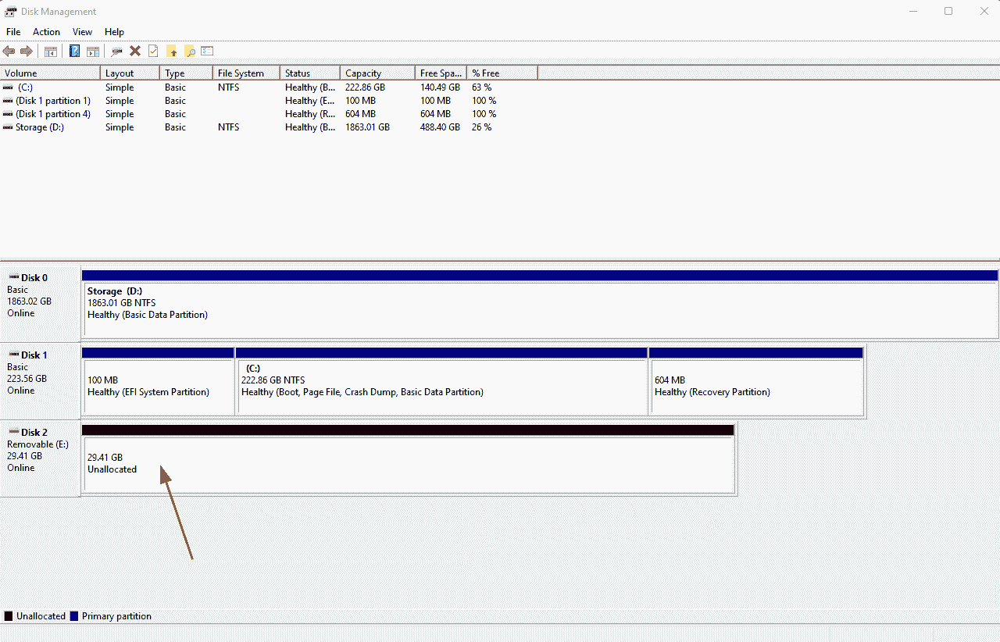

After deleting all of the partitions of Disk 2

此后，您会看到整个存储/磁盘都已变为未分配状态。然后，如果你想创建一个新的分区，只需右击**未分配的**框并点击`New Simple Volume...`。

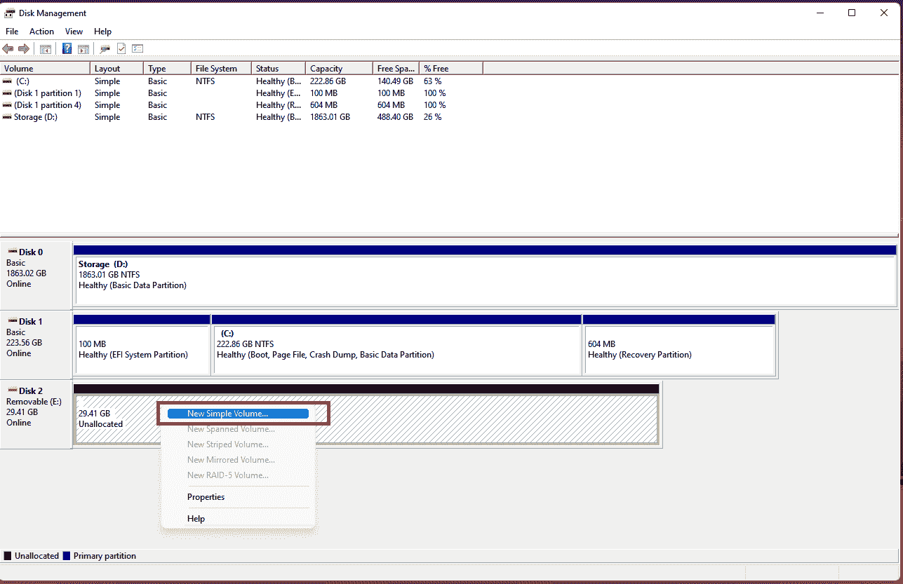

Creating a new volume

点击向导上的`Next`。

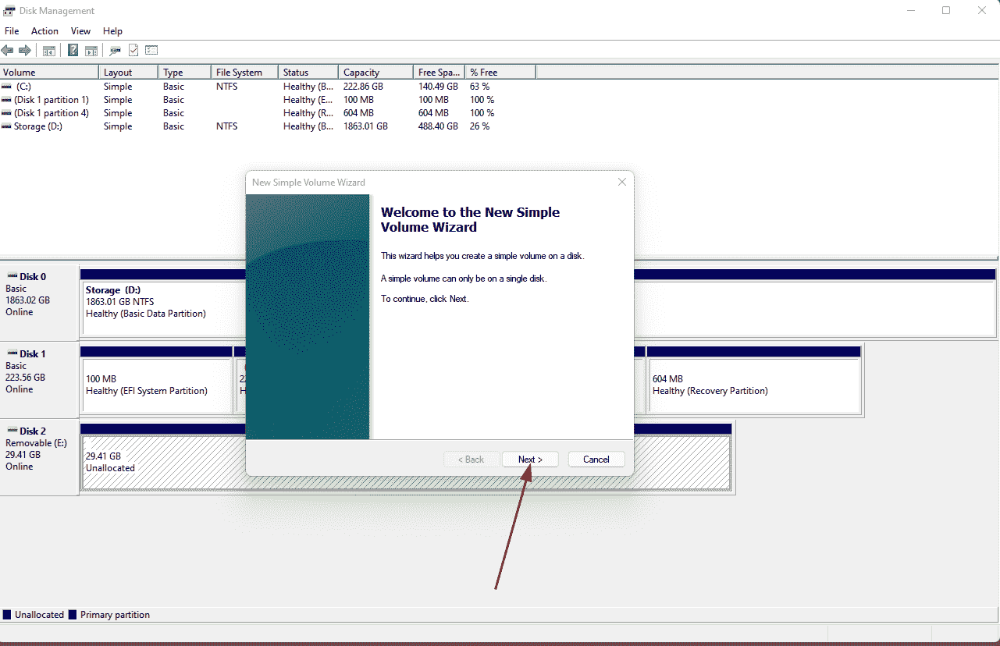

选择您想要的卷大小，然后点击`Next`。如果您想要整个卷的大小，那么只需让盒子保持原样。

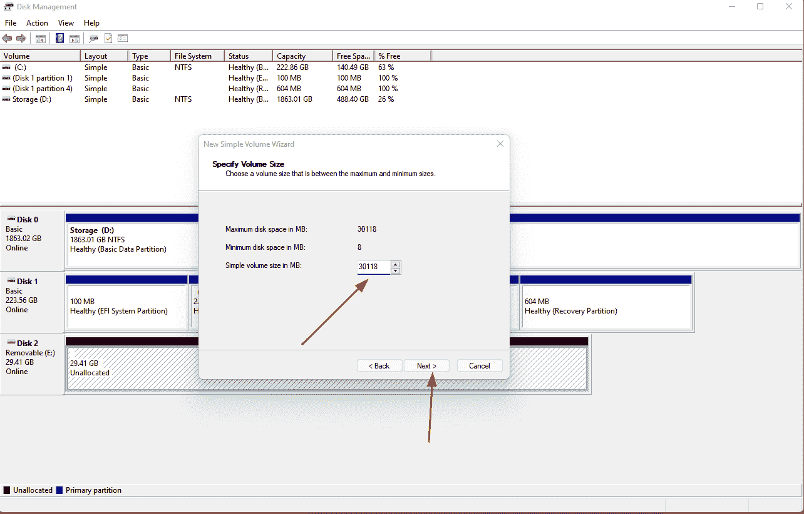

Volume size

选择您想要的驱动器号，并再次单击`Next`按钮。

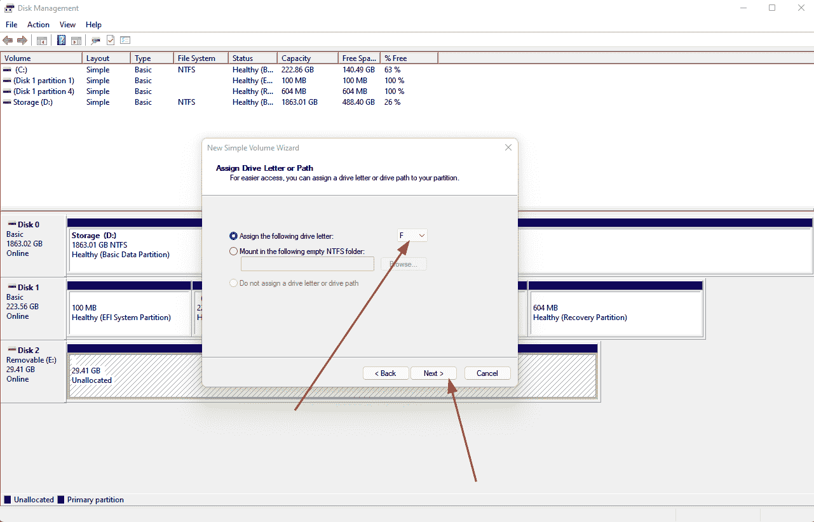

Selecting the Drive Letter

选择文件系统和卷标。如果您不想在这里弄乱任何东西，请将分配单元的大小保持为`Default`。此外，如果你想要一个快速格式，那么保持勾选`Perform a quick format`旁边的框。点击`Next`按钮。

**关于文件系统的一些附加信息**:如果你想同时在 Windows、Linux 和 Mac 上工作，那么选择 FAT32。请记住，FAT32 不支持单个文件超过 4GB。

要同时在 Windows 和 Linux 上工作，同时避免每个文件 4GB 的限制，NTFS 是一个不错的选择。

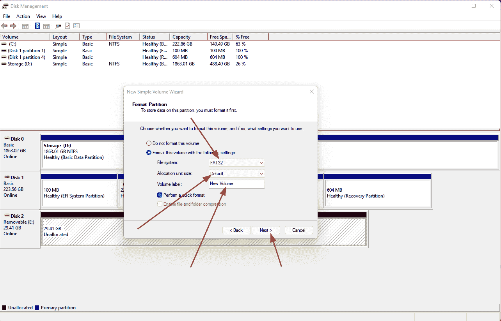

点击`Finish`即可完成。

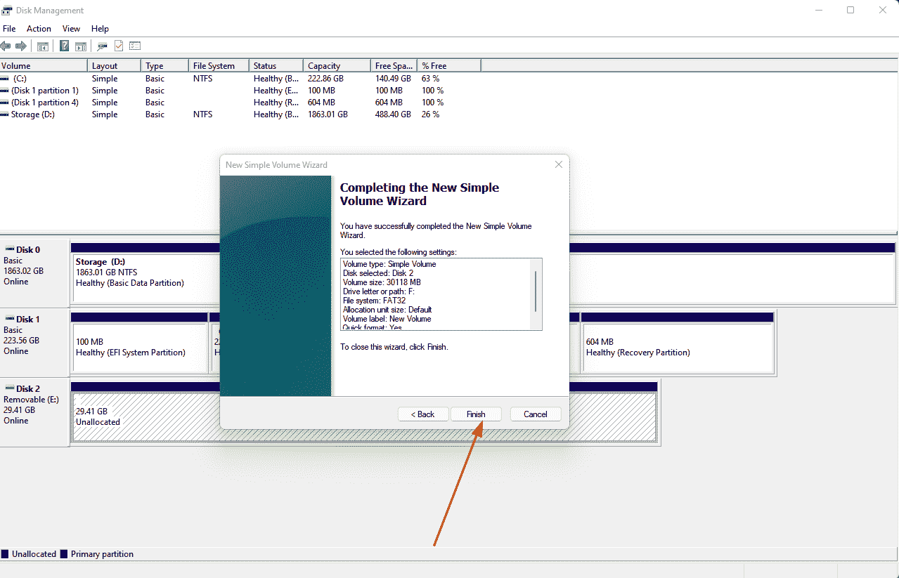

Finishing the task

现在，您已经看到了如何通过 GUI 删除磁盘/存储。现在我将讨论最激动人心的部分——CLI 方式！

## 如何使用 CLI(命令行界面)方法删除磁盘/存储

首先，打开命令提示符或 **CMD** 。你可以通过搜索下图中的名字来做到这一点。**确保点击`Run as administrator`。**

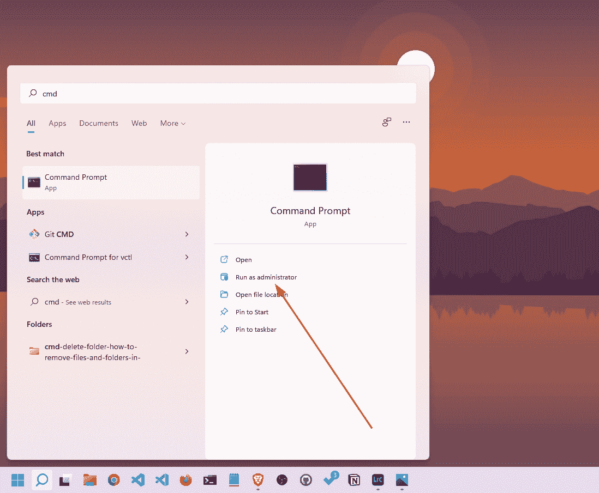

Opening the CMD

或者，您可以使用运行窗口打开 CMD。只需按下`Win` + `R`键。键入`cmd`并按回车键。

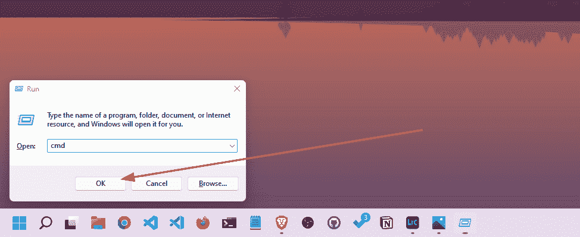

Open the CMD using Run

打开 CMD 后，我们需要打开 DiskPart。根据谷歌的说法，这是 Diskpart 的定义:

> diskpart 命令解释器帮助您管理计算机的驱动器(磁盘、分区、卷或虚拟硬盘)。

要打开 DiskPart，请键入命令`diskpart`并按键盘上的 Enter 键。

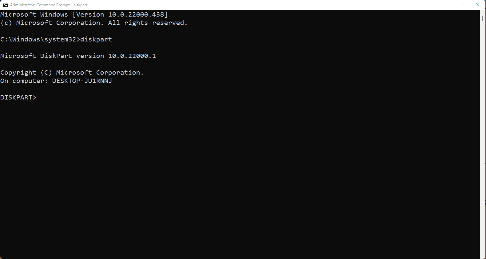

Open the DiskPart

现在，我们需要检查可用的磁盘。为此，键入命令`list disk`。它将显示我们计算机中的所有驱动器。

list disk

您可以看到，我的工作站现在有 3 个磁盘或存储设备。那些被分类为`Disk 0`、`Disk 1`和`Disk 2`。

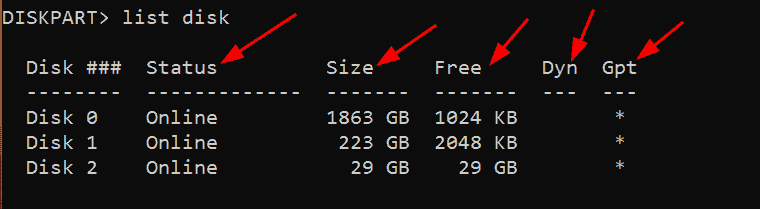

Disk Status

您还可以看到其他统计信息，如磁盘的**状态**，磁盘的**大小**，它们有多少**空闲空间**，磁盘是否已变为**动态**，以及分区表(对我来说，它是 GPT 或 GUID 分区表，表示为`Gpt`)。

请记住，如果您的磁盘在 MBR 上，那么您在接下来的过程中不会遇到任何问题。如果你的磁盘和我一样在 GPT，那么你会得到一个错误，但不用担心！我将展示如何解决这个错误并完成剩下的任务。

在这里，由于我仍然使用 32GB 的 Pendrive 作为我的试验品，`Disk 2`是我的目标磁盘。

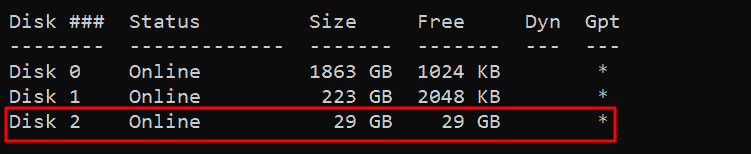

Target Disk

因此，我只需选择目标磁盘(我要删除的磁盘)。

要选择磁盘，您需要键入命令`select disk 2`。然后简单地按下回车键。

您需要在此处键入要删除的磁盘号。比如，如果你的目标磁盘是`3`，那么你需要使用命令`select disk 3`。

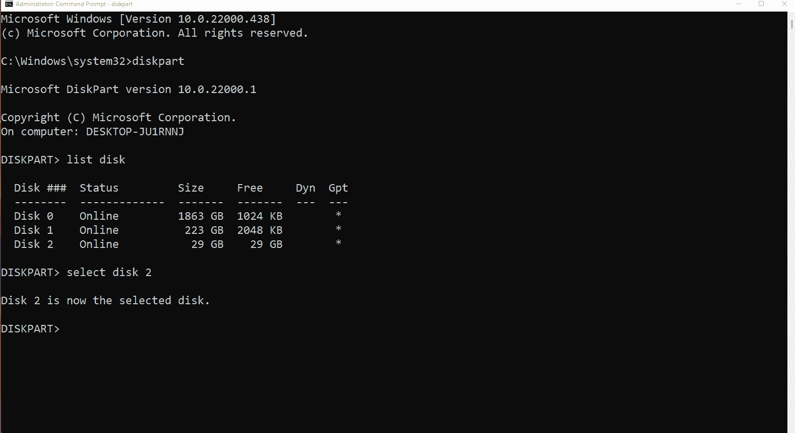

Selecting the target disk

已经选择了目标磁盘！

现在，您需要删除整个磁盘。为此，只需输入命令`clean`。这将删除目标磁盘上的所有分区。

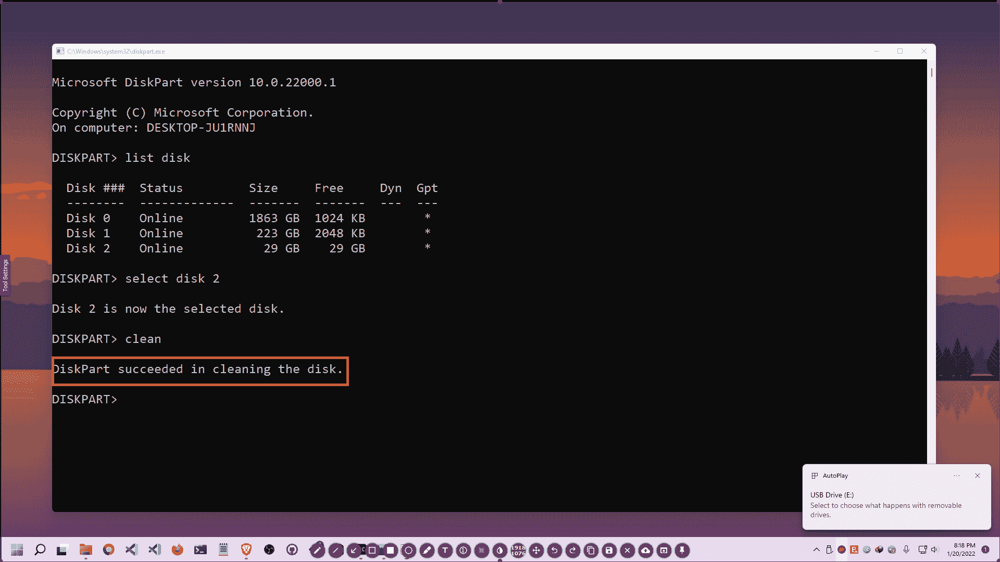

Cleaning the disk

您将得到 DiskPart 已成功清理目标磁盘的确认。

请记住，我们还不能使用驱动器。

要创建主分区，请键入命令`create partition primary`并按回车键。

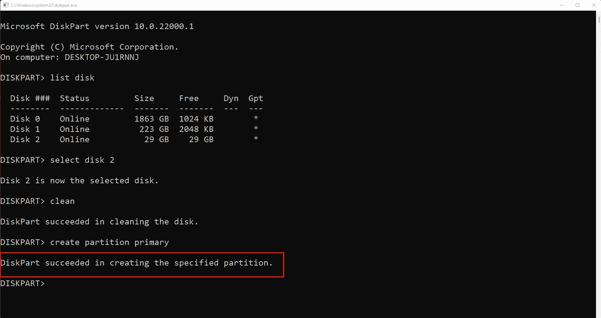

Creating primary partition

我们将得到一个确认，表明它已经成功创建了指定的分区。

现在我们需要激活分区。首先，我们需要选择分区。因为我们只创建了一个分区，所以我们只有`Partition 1`。因此，我将使用命令`select partition 1`选择第一个分区，并按回车键。

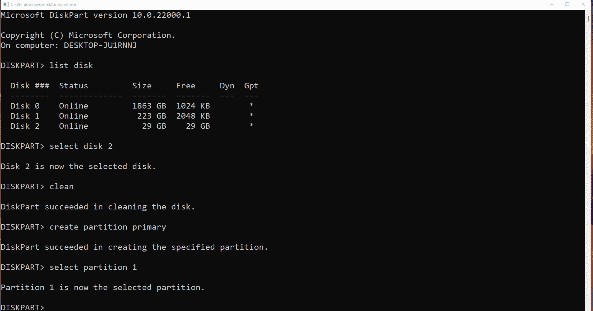

Selecting the partition

现在我们需要激活分区。为此，键入命令`active`并按回车键。只有当您的磁盘也像我一样位于 GPT 分区表上时，您才会收到标记的错误。

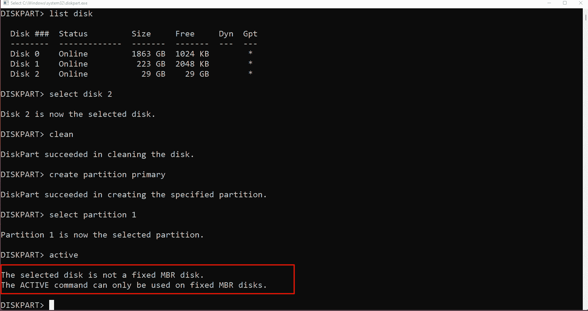

这是因为`active`命令不适用于 GPT 磁盘。我们可以简单地将整个磁盘转换成 MBR，然后应用`active`命令。

如果你的磁盘在 MBR 上，那么你不会得到错误信息。如果在这一步中没有收到错误消息，您可以跳过接下来的几个步骤。

要将磁盘转换为 MBR，首先我们需要清理(删除所有分区)磁盘。所以键入`clean`并按回车键。

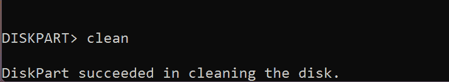

Clean command

现在，要将分区表从 MBR 转换到 GPT，键入`convert MBR`并按回车键。

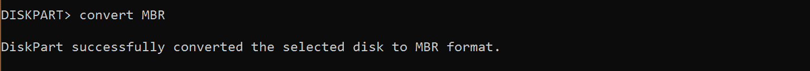

Converting to MBR

要创建一个主分区，输入命令并按 Enter `create partition primary`。

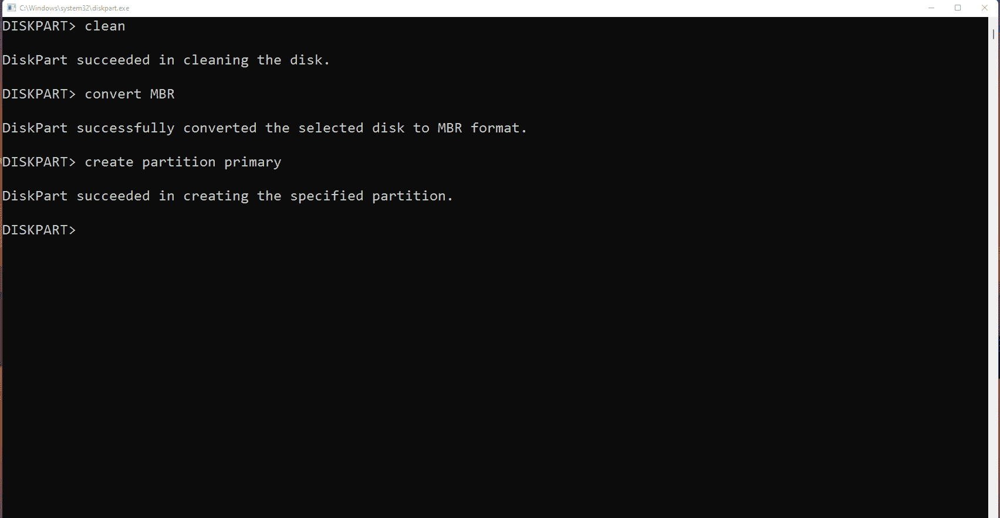

Creating primary partition

现在通过输入命令`select partition 1`选择分区，并按回车键。

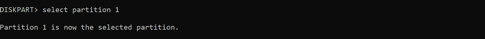

Selecting the partition

现在您需要激活该分区。只需输入`active`并按回车键。

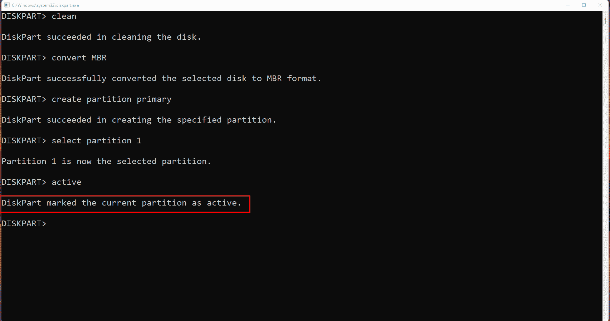

Making the partition active

好的**如果您没有得到错误，这是您将重新开始**的地方。

现在我们需要格式化分区。假设我想让 **NTFS** 文件系统格式化磁盘。我也可以在这里加一个标签。

键入命令`format fs=NTFS label=my_guinea_pig quick`并按 Enter 键。这里的`fs`表示文件系统，`quick`表示我想要快速格式化。

您可以添加任何想要的标签，但请确保标签名称中的多个单词之间不要留有任何空格(如果需要，可以使用下划线)。

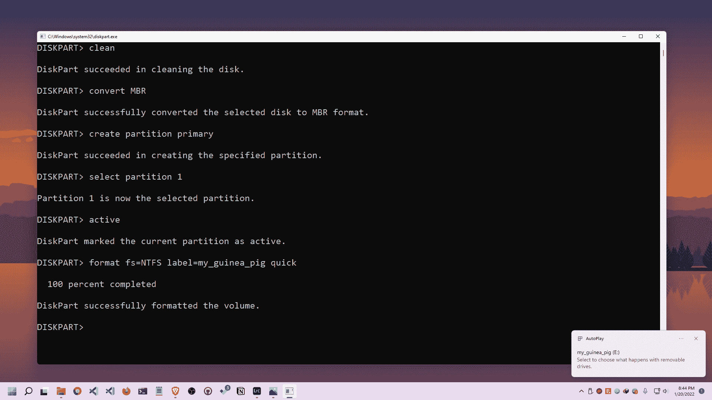

Quick formatting the disk

现在我们完成了，我们也可以关闭 **CMD** 了。只需键入`exit`并按回车键。

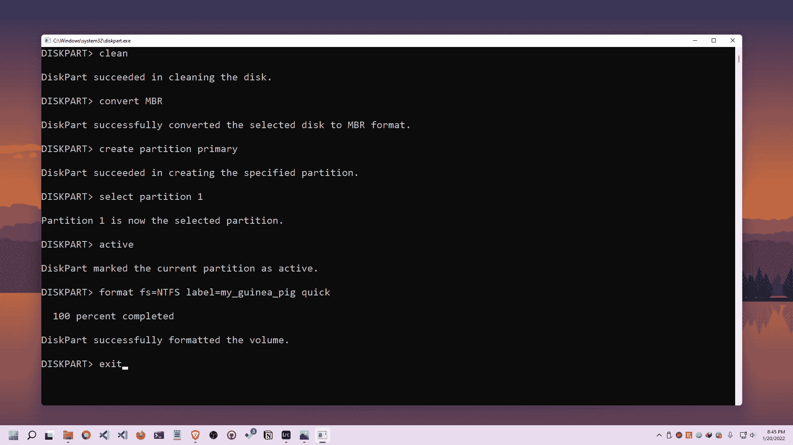

Exiting the CMD

现在，如果我使用我的文件浏览器检查 USB 驱动器，我会看到我的驱动器完全按照我想要的方式格式化。

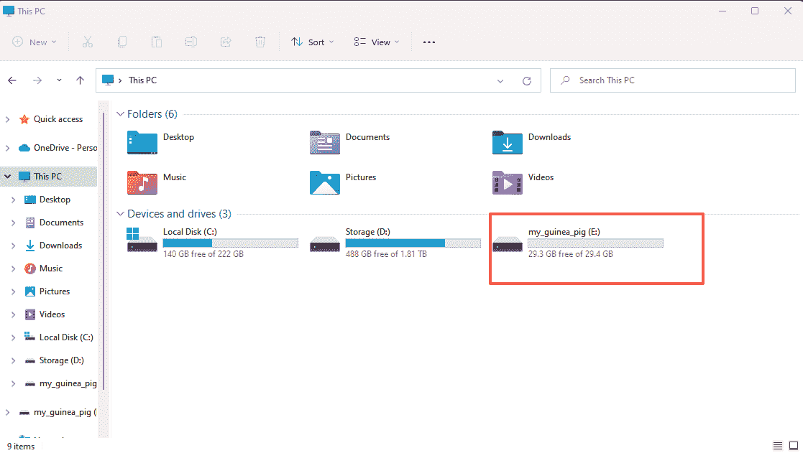

Task has been finished

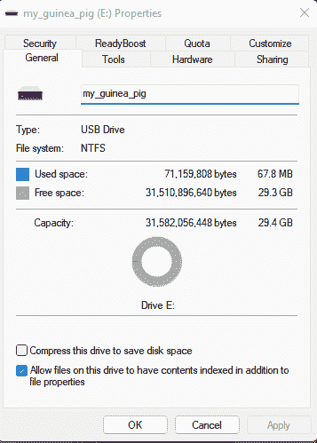

Disk Properties

现在，您已经知道如何通过 CLI 删除和重新格式化磁盘/存储。

## 结论

非常感谢您抽出宝贵的时间来阅读整篇文章。虽然我在我的 YouTube 频道上发布了许多编程和软件相关的内容，但我计划开设另一个 YouTube 频道，只定期发布英文内容。

如果你对开源项目感兴趣，那么你也可以在 GitHub 上关注我，因为我在这个平台上非常活跃。

如果你想与我讨论，或者如果你想与我联系，那么我也可以在 [Twitter](https://twitter.com/Fahim_FBA) 和 [LinkedIn](https://www.linkedin.com/in/fahimfba/) 上找到我。你也可以查看我的网站 https://fahimbinamin.com/[和查看我在](https://fahimbinamin.com/) [Polywork](https://www.polywork.com/fahimbinamin) 上的精彩片段。

再次感谢！