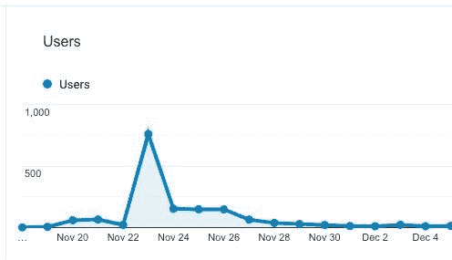
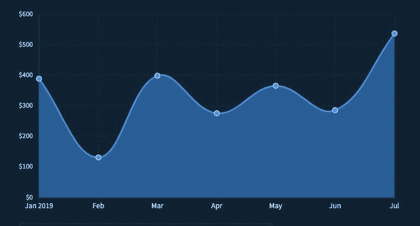
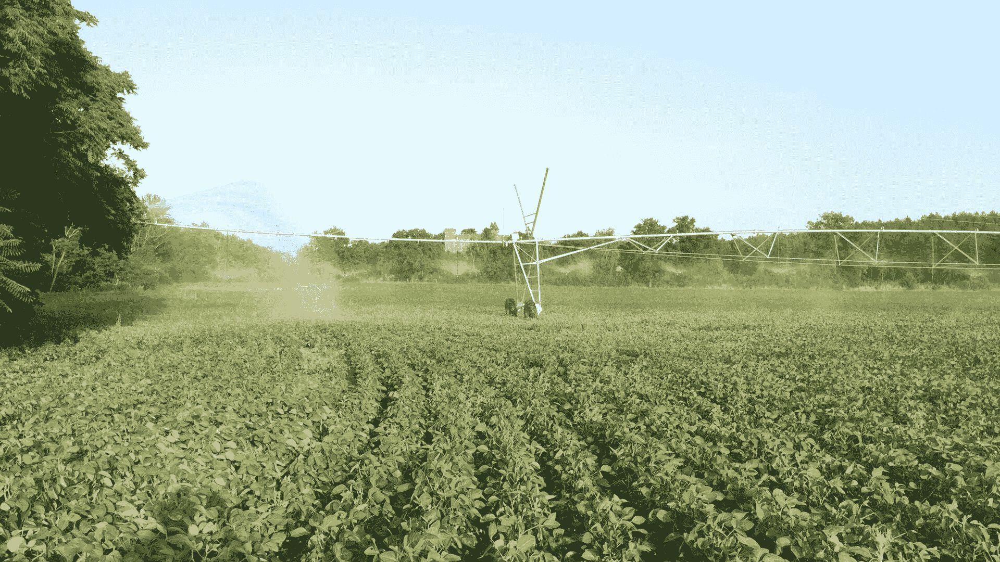
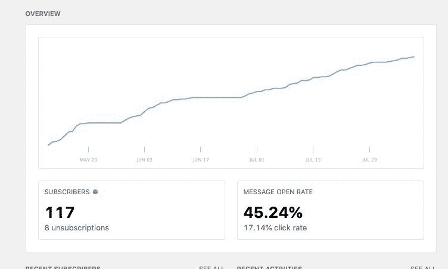
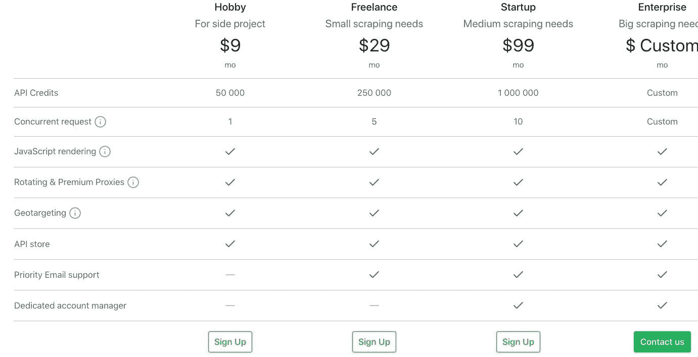
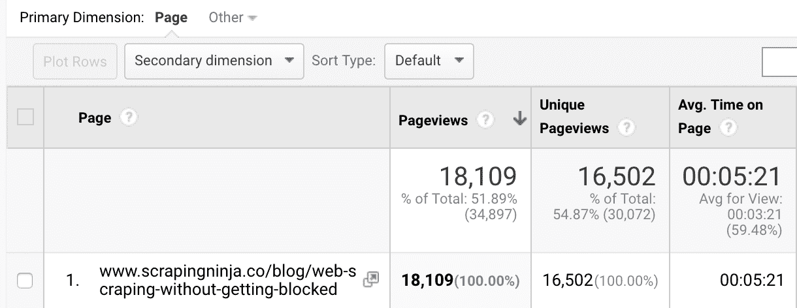
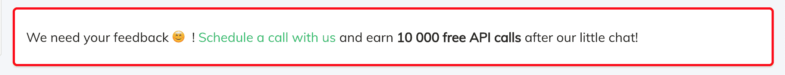

# 一年前，我辞去了全职工作，开始了独立黑客之路。这是我学到的。

> 原文：<https://www.freecodecamp.org/news/12-months-3-products-some-mrr-and-one-irrigation-pivot/>

我和我的搭档凯文已经工作和谈论不同的副业项目/创业超过 5 年了。两年前，我们向公众发布了我们的第一款产品，但一年前，我们决定全职走独立黑客之路。在这篇文章中，我将解释我们的旅程，我们的背景，以及我们是如何在多次失败的尝试后做到的。

这篇文章不是关于我们在两天内推出的神奇产品，我们在夏威夷一周工作 4 小时，一个月内注册了 10000 人，达到了 20000 美元的 MRR。这篇文章更多的是关于我们在独立黑客世界的第一年中的小赢和小输，以及我们希望在开始之前就知道的事情。

这篇文章是关于 3 个产品:一个灌溉枢纽，一个创业枢纽，当然，还有一些 MRR。

(免责声明:ScrapingBee 最初是作为 ScrapingNinja 推出的，但由于一些版权问题，我们不得不迅速更名。我们将在以后的博客文章中讨论它。)

## 背景

当我们都作为软件开发人员受雇于不同的创业公司时，事情就开始了。我们有很多想法，我们喜欢做一些有趣的小项目。

凯文和我在工作中做了大量的网络搜集工作。凯文在一家名为 Fiduceo 的金融科技初创公司工作，该公司被一家法国大银行收购，他们从事银行账户整合，就像美国的[Mint.com](http://mint.com/)一样。他带领一个小团队处理网络抓取代码和基础设施。

我在美国工作，然后回到法国，在法国最大的房地产数据提供商工作，担任数据工程师。我的部分工作是从网上寻找、收集、提取和加载新的数据集。

所以我们都有网络抓取和大规模数据的经验。

## 我们的第一个项目:ShopToList

我们取得的第一个“小成功”是 Shoptolist.com，这是一个 B2C 网站/浏览器扩展，它是一个通用的意愿列表，如果看到任何价格下降，就会向你发送警报。这真的只是一个有趣的兼职项目，从来没有打算更多。

它让我们尝试许多不同的事情，并发现获得真的真的真的真的很难。我们通过在节俭/时尚子网站上提交我们的产品，很快就拥有了 1000 名用户。我们对此非常高兴，因为这只是一个实验。

每天我们都有一个脚本来抓取我们数据库中的每个产品以更新其价格，并且我们会发送一封电子邮件以防价格下跌。电子邮件中的链接是附属链接，所以如果用户最终购买了产品，我们会抽取一小部分。

理论上，这种模式非常有效，但实际情况是这样的:

*   在发送的 1000 封电子邮件中，大约 20-30%被打开
*   2%的人会点击打折商品的链接
*   在这 2 %中，有 5-10%的人购买了产品

我们赚取的百分比非常小，取决于利基它是 0.5-5%，所以这种商业模式只适用于数百万用户。

这就是我们碰壁的地方，我们没能实现可持续增长。我们测试了很多东西，内容营销、加盟、一些付费广告，但我们就是无法创造增长。因为这只是一个小小的附带项目，只花了我们 2 周的时间就完成了，所以我们没意见。

对我们来说，这是一次非常好的体验，因为这是我们真正交付给真实用户的第一个项目，我们学到了很多东西。

通过深入数据库，我们注意到一些用户在 ShopToList 中保存了数千种产品。这似乎很奇怪，除非他们是疯狂冲动的买家，大多数用户平均保存了 20 件产品…

所以经过一点“调查”，我们发现这些用户是电子商务所有者，他们在“监视”他们的竞争对手…

## 我们的第一个支点:定价机器人

我们假设这些人这样做是为了在竞争对手的产品改变价格时收到提醒。网上有许多解决方案允许人们这样做，但 ShopToList 允许他们免费监控数千种产品，而其他解决方案相当昂贵。

我们做了一个小的市场调查，发现有许多工具可以用来监控你的竞争对手的产品，但是，所有这些工具要么很难使用，要么很贵。

因为我们觉得我们可以做得更好，定价机器人的想法诞生了。我辞职了，我们俩都决定全力以赴。旁门左道的时代结束了？。

我们制作了一个登录页面，解释我们的价值主张，没有什么花哨的东西，但足够清晰和漂亮，让人们可以信任我们。我们得到了 60 个来自不同领域的不同电子商务所有者的注册。

虽然在技术上具有挑战性，但由于 ShopToList，提取电子商务产品数据是我们知道如何做的事情，因此建立 MVP 非常快。

我们于 2018 年 11 月在 ProductHunt 上推出了我们的测试版，并取得了巨大的成功，随后是一场大崩溃，这是经典的 ****创业低谷期。****

ProductHunt launch

你必须上传一个包含产品目录的 CSV 文件，并为每个产品匹配一个竞争对手的产品 URL。这对于几十个产品来说是可以的，但人们的在线商店中通常有数百或数千个产品。

因此，根据这些反馈，我们创建了一些与 Shopify 和 Woocommerce 等流行电子商务平台的集成，让人们只需点击一下就可以导入他们的目录。

我们的激活量 ****增加了两倍？，**** 我们对事情的进展非常满意。不过，有一点需要注意的是，直到现在这个产品还是完全免费的，我们也没有向人们要钱。

此时此刻，我们有几个让 use 很开心的数字:

*   我们花了 0 美元就成功注册了大约 200 个
*   20 名用户似乎使用了该产品，并完全建立了他们的帐户

什么会出错呢？

我们决定关闭测试版，并开始要求我们的用户用经典的 SaaS 模式为我们的软件付费，有三个计划，根据数量每月 29 美元/99 美元/299 美元。

第一天很神奇，因为在发送了宣布测试结束的邮件几秒钟后，我们就有了第一个 29 美元套餐的客户？

不久之后，我们还设法注册了一个 299 美元的账户，但对他来说，我们必须手动设置他的账户，并手动匹配 10 个网站上的 1000 种产品。时间很长，但我们觉得这是值得的。我们错了！就在续约之前，他告诉我们 PricingBot 非常好，但对他来说不够有用。我们感到悲伤和愤怒，主要是对我们自己，但决定向前迈进，继续下去。

看起来我们走在一条好的道路上，我们只需要全力以赴进行营销。这就是我们所做的。内容营销，冷外联，加盟，SEO 你说吧！

但是在深入这个之前，让我们再来谈谈我们的激活

## 错误 1:糟糕的度量导致糟糕的结论，糟糕的结论导致糟糕的决策(用尤达的声音)

当我们第一次决定监控我们的激活率时，我们假设一个用户在做两件事时被激活:

*   添加至少一个他的产品，(或链接他的商店与我们的内置集成)
*   至少添加一个竞争对手的产品

因此，根据这个定义，我们有大约 10%的用户是“激活的”。考虑到当时我们的大多数用户来自 ProductHunt，而且众所周知，猎人很容易注册他们不打算使用的产品，因此我们对这些数字感到满意。

但是我们错了。

这个定义意味着拥有一个拥有 4000 种产品的 Shopify 商店，并且只添加了一个竞争对手的产品的人被激活了。这太傻了。从自己的 4000 种产品目录中只添加一种竞争对手产品的人不会使用 PricingBot 来进行价格监控，当然也不会为此付费。我们经历了惨痛的教训。

因为在我们有了第一个付费客户后不久，没有人跟进，真的没有人。起初，我们不明白。然后很明显:在 200 个注册用户中，我们有 20 个活跃用户，在 20 个活跃用户中，我们有 1 个付费用户，所以唯一的解决办法就是增加注册。

这是另一个错误。

## 错误 2:认为我们唯一的问题是收购

我们认为我们只需要更多的用户，并进行全面营销。因为我们不太了解电子商务社区，所以起步时有些困难。但我们最终设法写了一些内容，分享到相关的脸书/Reddit/LinkedIn 群组上，带来了一些线索。

我们也做了一些付费广告和冷接触，但它悲惨地失败了。

一个月后，我们需要看到明显的事实:我们没有走在正确的道路上。

我们的潜在客户使用了该产品，但没有得到回报，即使我们带来的所有潜在客户都得到回报，这也是不可持续的。

在这一点上，我们最终决定更好地理解为什么用户不更多地使用我们的产品，通过反馈请求和大量的分析洞察，我们发现了两件事:

*   对于我们的大多数用户来说，PricingBot 是一个不错的选择，但是不值得为它付费
*   我们的大多数用户不想做设置，因为这太繁琐了，但他们也不想付钱让我们帮他们做。

接下来，我们改进了整个入职流程，并尽可能多地尝试自动化。但是它仍然不起作用。

作为一个电子商务所有者，当你想要监控你的竞争对手时，你首先必须将你的产品与你的竞争对手联系起来——这是困难的部分。仅这一部分就意味着每 100 件你想匹配的产品需要大约 1 小时的工作。对于一个独自处理 10k 产品目录的电子商务所有者来说，这实在是太多时间了。

## 恐惧、不确定和怀疑

为了帮助您理解我们当时的感受，让我简单回顾一下时间表:

*   2018 年 1 月:？我们推出 ShopToList
*   2018 年 7 月:？我辞职了，我们决定建立一个定价机器人
*   2018 年 10 月:？经过一个繁忙的夏天和一个月的代码，我们推出了测试版的 MVP
*   2019 年 1 月:？第一个付款客户
*   2019 年 2 月至 3 月:收购、产品开发

回到 2019 年 5 月，我们有点碰壁。我们所做的一切都不奏效，很难保持动力。唯一的一线希望是，我们设法在谷歌上排名很好，所以我们每天都有大约 3 个新的注册，没有任何收购。

但我们还是没能让他们付出代价。我们仍然没有设法让他们配置他们的帐户。

这段时间很艰难，因为充满了消极。我和我的共同创始人都知道我们没有前进。虽然这没有降低我们的工作关系，但肯定降低了我们的工作效率。

我们都觉得，无论我们做什么，我们都无法推动任何有意义的、可以促进我们业务发展的事情。

我们改进了产品很多，设法收集了一些注册，但这还不够。这是我们的收入情况。

## 一个农业支点要建，一个创业支点要做

2019 年 6 月中旬事情看起来并不乐观，我们只有 3 个月的时间来推出一项成功的业务。我们都同意在 2018 年给自己一年时间来推出可行的东西，一年时间来实现“[拉面盈利](http://www.paulgraham.com/ramenprofitable.html)”？。

六月初我们进行了一次长谈，我们都同意我们需要后退一步。我们目前有三种选择:

1.  继续定价，但希望奇迹发生，我们能在 3 个月内穿越 4k MRR
2.  离开公司，开始走自己的路
3.  建造别的东西

第一点很难，因为我们都厌倦了这个产品。我们做的一切似乎都没用，也不起作用。第二点需要解决，但尽管这并不成功，我们觉得合作真的很好(在人的方面)。放弃就太可惜了。

但我们选择了第三个选项，我们都对会谈的结果感到非常高兴，并且充满了活力。我们只需要一件事:选择我们要建造的东西。

我们也决定做一些我们早就应该做的事情，我们把商店卖给了零售商。多亏了 1kprojects.com，整笔交易在不到一个月的时间内完成了，这给我们公司的银行账户带来了一些受欢迎的资金。

与此同时，我的岳父，一位法国南部的农民打来电话，因为他需要帮助组装一个灌溉枢轴。六月的热浪本该很难熬(猜猜怎么着，的确如此)，而且这是一项紧急任务。我们都认为这是一个休息的好机会，站在我们这一边思考未来的产品，然后带着满满的想法和动力回来。

这有点讽刺，因为这个支点资助了我们的支点。

**免责声明:如果您需要购买灌溉枢纽*，我*强烈建议您去谷枢纽看看(PS:此贴不以任何方式得到谷的赞助)**

## 报废蜜蜂

两个星期后，我们都发现自己有一个产品创意的子弹列表，有些好，有些坏，有些疯狂，有些无聊，有些令人兴奋，好吧，你明白了。两份名单都各不相同。然而，我们很快就同意了一个想法，因为它确实与众不同。让我解释一下。

在做 Shoptolist 和 Pricingbot 的时候，以及在我们之前的工作经验中，我们总是需要为我们的网络抓取基础设施做三件事:

*   将网站转换成结构化的 API，
*   大规模运行无头浏览器，
*   和管理代理池。

当您从许多不同的网站提取数据时，您总是不得不处理大量使用 Javascript 的网站/单页应用程序，除了运行无头浏览器来呈现所有这些 Javascript，您没有其他选择。

运行 Chrome 这样的无头浏览器真的很痛苦，因为在你的桌面上发生的同样的事情(高内存使用率，糟糕的编码单页应用程序占用你 100%的 CPU)也会在你的服务器上发生。所以当你不知道自己在做什么的时候，自己去做不仅痛苦而且非常昂贵。

当进行大规模的网络抓取时，出于不同的原因，你经常需要使用代理。你用你的机器人访问的网站可能会根据你的位置显示不同的信息，例如，在欧元区用欧元标价，在美国用美元标价。

与代理人打交道也很痛苦。有很多销售劣质代理的可疑公司，所以你要么运行你自己的代理，要么测试几十家代理公司，以确保你的代理池始终运行。

我们过去常常使用效率不高或者极其昂贵的 API 来解决所有这些问题。这些是我们在项目中多次解决的问题，所以我们考虑将其打包成 API，并利用我们的经验来制作各种 web 抓取 API。

这一次，我们决定把事情做好，尽量避免犯我们在创建[废料桶](https://www.scrapingbee.com/)时犯的错误。

## 避免的错误#1:创造一个你不会使用的产品

PricingBot 最大的问题之一是找到我们的潜在用户在线聚集的地方。他们关注什么群体，他们看什么博客，他们听什么有影响的人。原因很简单，除了一些自由职业者的工作之外，我从未在电子商务行业工作过，整个行业对我们来说都是未知的。

有了 ScrapingBee，我们将成为自己的用户，这改变了一切。我知道这个建议并不新鲜，但通常这个建议是为了打造更好的产品。当然，成为你自己的用户之一可以让你开发出更好的产品。

但对我们来说，改变游戏规则的事实是，成为我们自己的用户意味着我们确切地知道在哪里找到和如何到达潜在的线索。

Kevin 和我也有自己的博客运行了相当长一段时间，去年我写了一本关于 Java 网络抓取的书。这直接转化为每月 2 万的访问量，我们可以利用它来推广 ScrapingBee。

而且成功了。在大约 2 个月的时间里，我们达到了 150 个测试注册，是我们定价机器人测试人数的 4 倍。

## 避免的错误#2:花钱太多

在开发 PricingBot 时，我们在无用的基础设施、API 和软件上花了很多钱，却没有达到产品与市场的契合度。

在我们推出“以旧换新”之前，多亏了网店甩卖和我的农业技能，我们才拿回了我们的钱，但这一次，我们对如何花钱更加小心了。

我知道花几千美元启动一个项目并不是很多钱，但我们不愿意花更多的钱。所以我们决定要小心对待如何用它来报废蜜蜂。

我们基本上通过只寻找像 [Secret](https://www.joinsecret.com/) 这样的交易(❤ AWS 信用)来降低成本，这些交易基本上给你 6 个月的大量 SaaS 或巨大的折扣。

我们决定利用现有资源做更多的事情，到目前为止我们并不后悔。

我将在以后的博文中更多地谈论我们使用的产品和工具，这篇博文已经够长了。

## ？发射？避免的错误#3:从第一天起就不要钱

PricingBot 有一点不太好，那就是几个月来，我们开发了一个免费使用的产品。我知道这是一个典型的错误，但这还不是最糟糕的。最糟糕的是，我们知道这是一个错误。在过去的 4 年里，我们阅读了大量关于创业的书籍、采访和博客文章，每个人似乎都同意越早要钱越好。

但是说起来容易做起来难，我们在建造定价博的时候不敢要钱。我们只是不认为有人会为一个未完成的产品买单。

我们是为了废品而做的。ScrapingBee 的定价仍然是基于 API 调用量/功能的经典三计划 SaaS，起价为每月 9 美元/29 美元/99 美元和企业计划。

我们先“试运行”了我们的邮件列表，并获得了第一批小额付费客户。同样，我们在机器人定价上也有过同样的经历，但这次不同了。通过 PricingBot，我们很难找到每一个付费客户，我们给他们发了无数的电子邮件，他们花了很长时间才最终付款。

有了 ScrapingBee 就不一样了。我们的前两个客户从来没有和我们谈过。

然后我们开始写博客，得到了大量的线索，还有一些付费客户，包括一个大企业计划，正如你在下面的 MRR 图表中看到的。

然后一切都很快，凯文和我都写了关于编程的博客，创建关于网络抓取的有见地的内容对我们来说不是问题，我们知道如何以及在哪里推广它。

我们写的一个特别的内容，一个[网页抓取指南](https://www.scrapingninja.co/blog/web-scraping-without-getting-blocked)完全超出了我们的预期。

仅这篇文章就意味着在两个月内，我们的访问量是 PricingBot 一年的三倍。这个帖子不仅带来了流量，还带来了真正的顾客。这也让我们签署了第一个大企业计划，使我们能够达到并跨越 1000 美元 MRR。

## 今后

当然，现在说 [ScrapingBee](https://www.scrapingninja.co/) 会不会成功还为时过早。

由于我们第一篇博客文章的成功，这种大企业客户可能只是一种异常现象，不会在未来重现。也许会的。但有一件事是肯定的，有了 ScrapingBee，事情看起来会好得多。

我们有很多来自用户和潜在客户的参与，从试用到付费客户的转化率接近 5%。

我们也喜欢与我们的潜在客户(❤️·祖姆)交谈，我们觉得 ScrapingBee 对他们来说是一个必须拥有的东西，而不是一个“很好拥有”的东西。(小提示:我们为接受与我们进行 15 分钟简短对话的用户提供 10，0 00 个免费 API 积分，这已经允许我们与真人进行 50 次关于 ScrapingBee 的真实对话)

In-app message to incentivize users to schedule a call with us.

未来几个月，一个巨大的挑战将是找到有利可图和可扩展的收购渠道。我们希望内容营销将继续工作，它将改善我们的搜索引擎优化，以获得有机交通。写一篇好的内容可能还不够，我们真的需要发现其他的获取渠道。

另一个大挑战是区分 API 商店中特性的优先级。这意味着弄清楚用户**需要什么，而不是盲目地实现他们想要的，并希望在实现该功能之前设法让他们付费。**

**我们仍然不知道我们想用 PricingBot 做什么，我们认真考虑过出售它，但有点害怕所有相关的文书工作(使用 ShopToList 要容易得多，因为 ShopToList 没有带来任何收入，所以没有银行账户、Stripe 账户等……)**

**在能够说我们建立了一个可持续和盈利的企业之前，我们还有很多要学习和证明的东西，但在我们的生活中，我们第一次感到这是可以做到的，时间会告诉我们是否正确。**

**我真的希望你喜欢我们的小故事，并且在这个过程中你学到了一些有趣的东西。我们计划至少每三个月发一次这样的帖子，请告诉我你是否想看下一篇；).**