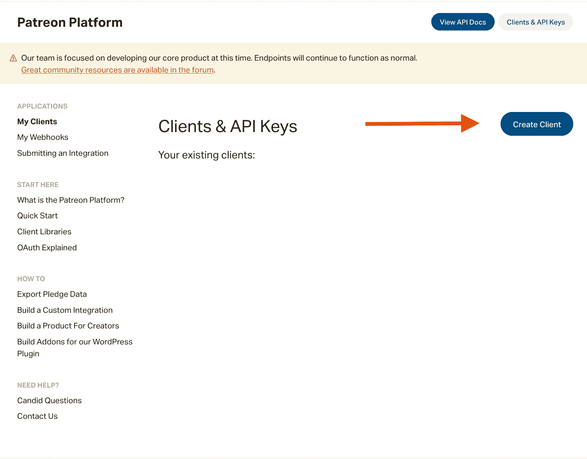
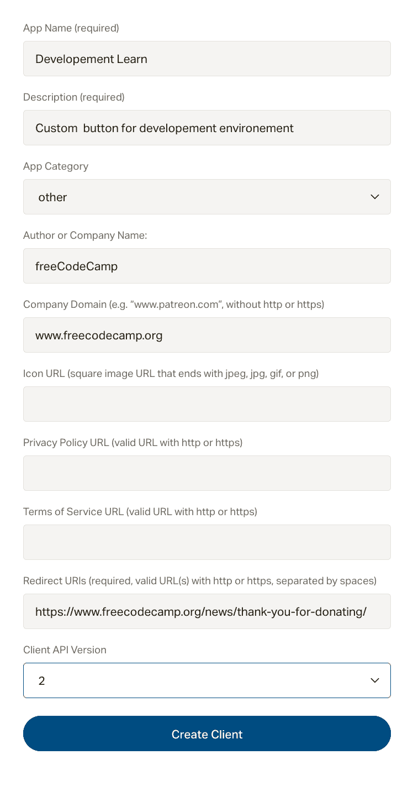
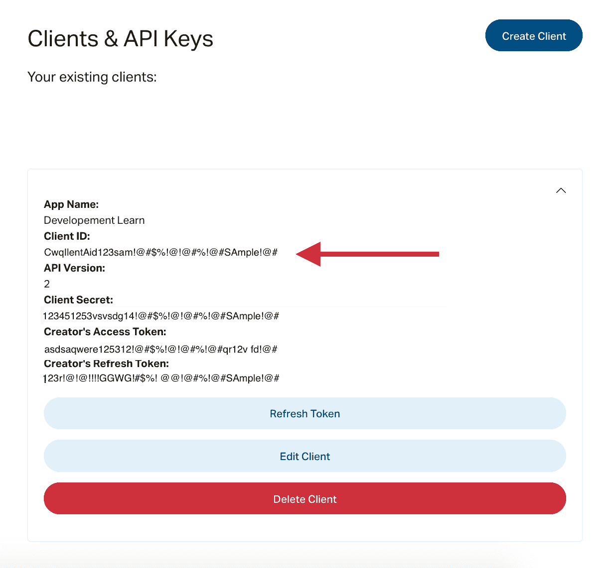
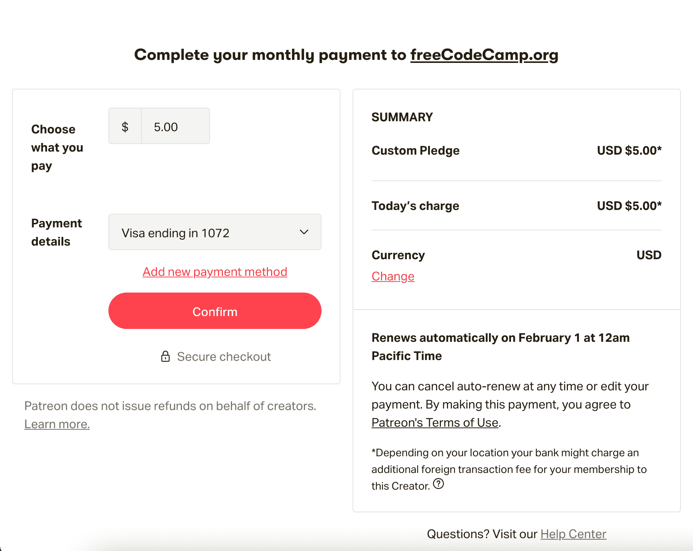

# 如何创建自定义按钮

> 原文：<https://www.freecodecamp.org/news/how-to-create-a-custom-patreon-button/>

Patreon 是一个面向创作者的订阅管理系统。虽然它提供了一个默认的按钮片段，但您可以创建一个包含您喜欢的设计和行动号召的自定义按钮，以提高您的点击率。

在本文中，您将学习如何创建一个简单的自定义 Patreon 链接按钮，将用户带到您的首选层的支付流。

## 如何设置您的帐户

### 第一步:

要开始设置，您需要一个 Patreon 帐户。如果您没有帐户，请创建一个帐户或登录您的帐户。

### 第二步:

访问您帐户的[注册门户](https://www.patreon.com/portal/registration/register-clients)。在**客户端& API 键下，**点击**创建客户端**按钮。



Patreon client registration portal

### 第三步:

点击按钮后，会出现一个模态。填写与您的网站相关的信息，并确保在**重定向 URIs** 字段中输入完整的 URI(包括结尾/)。然后，点击**创建客户端**按钮。



Patreon client registration form

### 第四步:

在**您的现有客户下，**您将看到您新创建的客户。单击新客户端的下拉图标。

最后，复制客户端 ID，因为您将在接下来的步骤中需要它。



Registered client information

## 自定义按钮的代码

下面是一个函数，它接受一个帐户 id、首选金额或等级(以美分为单位)和一个重定向 URI，并返回一个到 Patreon 的结账流程的链接。

在您的代码中使用下面的函数，添加一个定制的日志/消息，并设置

```
const PatreonButton = (clientId, amount, redirectURI) => {
  const clientId = `&client_id=${patreonClientId}`;
  const pledgeLevel = `$&min_cents=${amount}`;
  const v2Params = "&scope=identity%20identity[email]";
  const redirectUri = `&redirect_uri=${redirectURI}`;
  const href = `https://www.patreon.com/oauth2/become-patron?response_type=code${pledgeLevel}${clientId}${redirectUri}${v2Params}`;
  return (
    <a
      className="patreon-button link-button"
      data-patreon-widget-type="become-patron-button"
      href={href}
      rel="noreferrer"
      target="_blank"
    >
      /* 
      <svg
        id="patreon-logo"
        viewBox="10 0 2560 356"

        xmlnsXlink="http://www.w3.org/1999/xlink"
      >
        <g>
          <path d="M1536.54 72.449v76.933h128.24v61.473h-128.24v74.51h128.24v62.921h-206.64V9.529h206.64v62.92h-128.24M2070.82 178.907c0-55.652-37.76-107.434-99.21-107.434-61.95 0-99.21 51.782-99.21 107.434s37.26 107.435 99.21 107.435c61.45 0 99.21-51.783 99.21-107.435zm-278.77 0c0-92.916 66.79-178.093 179.56-178.093 112.26 0 179.05 85.177 179.05 178.093 0 92.916-66.79 178.093-179.05 178.093-112.77 0-179.56-85.177-179.56-178.093zM186.32 131.97c0-31.46-21.299-58.563-54.206-58.563H78.398v117.109h53.716c32.907 0 54.206-27.086 54.206-58.546zM0 9.529h141.788c75.016 0 123.417 56.628 123.417 122.441s-48.401 122.423-123.417 122.423h-63.39v93.893H0V9.529zM492.17 106.314l-41.621 139.382h82.266L492.17 106.314zm73.081 241.972-13.054-41.134H431.69l-13.072 41.134h-83.73L455.882 9.529h72.105l122.442 338.757h-85.178zM782.055 77.277H705.61V9.529h231.793v67.748h-76.951v271.009h-78.397V77.277M2485.08 230.202V9.529h77.91v338.757h-81.78l-121.97-217.78v217.78h-78.4V9.529h81.78l122.46 220.673M1245.68 131.97c0-31.46-21.3-58.563-54.21-58.563h-53.72v117.109h53.72c32.91 0 54.21-27.086 54.21-58.546zM1059.36 9.529h142.29c75 0 123.4 56.628 123.4 122.441 0 47.425-25.17 89.517-67.28 109.369l67.77 106.947h-90.98l-60.03-93.893h-36.78v93.893h-78.39V9.529z" />
        </g>
      </svg> */
    </a>
  );
}; 
```

您可以随意取消嵌套 SVG 元素的注释，并将其用作按钮的插图或插入您自己的插图。以下是一些风格来调整你的按钮亮暗模式。

```
a.patreon-button {
  border-radius: 5px;
  background-color: #ff424d;
  min-height: 42px;
  border: none;
  display: grid;
  place-items: center;
}
a.patreon-button svg {
  max-height: 12px;
  fill: white;
}
a.patreon-button:active,
a.patreon-button:active:focus,
a.patreon-button:hover {
  background-color: #e13d47;
}

.dark-palette a.patreon-button {
  background-color: white;
}

.dark-palette a.patreon-button svg {
  fill: #ff424d;
}
.dark-palette a.patreon-button:active,
.dark-palette a.patreon-button:active:focus,
.dark-palette a.patreon-button:hover {
  background-color: #efefef;
}
```

这就是了。一个自定义按钮，将用户带到 Patreon 上您想要的层。

在 freeCodeCamp，我们使用 [TypeScript](https://github.com/freeCodeCamp/freeCodeCamp/blob/56a60700b7e999548262e3827b80d09fdf201ad2/client/src/components/Donation/patreon-button.tsx) 为我们的[捐赠页面](https://www.freecodecamp.org/donate/)实现了相同的按钮。


Custom Patreon button on freeCodeCamp's donate page

点击该按钮会将已登录的 Patreon 用户直接带到结账页面。



Patreon checkout page

## 接下来的步骤

如果您想将您的平台与 Patreon 同步，您可以向按钮添加元数据，并通过 webhook 接收它们。

或者，如果您希望创建一个完整的集成，那么可以使用各种开源集成作为模板。具体问题请参考 Patreon 活跃的[开发者社区](https://www.patreondevelopers.com/)。

最后，如果你喜欢读这篇文章，别忘了在 twitter 上关注我，获取更多的文章和教程。

快乐编码。