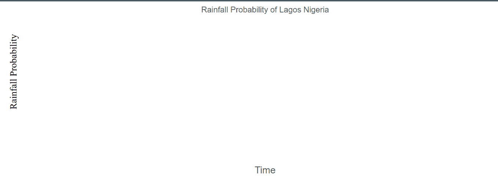
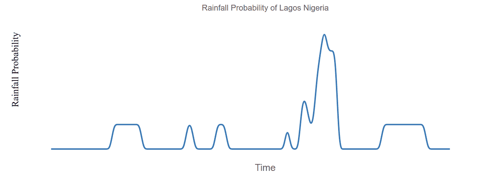
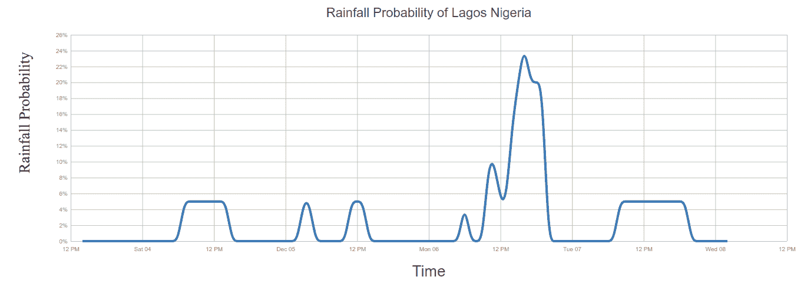

# 如何用 D3.js 可视化天气数据

> 原文：<https://www.freecodecamp.org/news/visualize-weather-data-with-d3js/>

如果你知道明天要下雨，你会做什么计划？

当计划你的个人和日常商业活动时，这可能是一个关键的问题。

例如，我有一个朋友在尼日利亚拉各斯经营一家基于应用程序的洗衣店。他非常依赖阳光，有时会下雨，或者根本没有阳光。那些日子，生意很不好。

但如果他知道第二天或 6 小时后会下雨呢？这将有助于他提前做好计划，防止订单延误。但是他能从哪里得到这样的信息呢？

这就是 Tomorrow.io [天气 API](https://www.tomorrow.io/weather-api/) 的用武之地。weather API 为我们实时提供准确快速的天气数据，如降水概率、降雨量、温度、风速等。

这些信息对各行各业的企业都非常有用，比如交通、农业，还有我朋友的洗衣店。

此外，来自该 API 的天气数据可以很容易地集成到您的项目或您正在使用的任何程序中。最好的部分——免费版本的 API 本身非常强大，所以这就是我们今天要用的。

在本文中，我们将使用 Tomorrow.io 天气 API 和 [D3.js](https://d3js.org/) 在折线图上预测和可视化特定位置的降水概率。像这样的服务可以让我的朋友知道一周中的哪几天可能会下雨。

## 项目要求

本教程还需要继续什么？需要 JavaScript 和 D3.js 的基础知识。

如果想在进一步深入之前刷新一下记忆，我建议看一本[D3 . js](https://www.freecodecamp.org/news/d3js-tutorial-data-visualization-for-beginners/)初学者指南。

## 入门指南

首先创建一个 HTML 文件，将最新的`d3.js`库添加到 HTML 文件中。同样，创建一个空的`svg`元素，如下所示:

```
<!DOCTYPE html>
<html lang="en">
  <head>
    <meta charset="UTF-8" />
    <meta http-equiv="X-UA-Compatible" content="IE=edge" />
    <meta name="viewport" content="width=device-width, initial-scale=1.0" />
    <title>Tomorrow.io Rainfall probability</title>
    <script src="https://d3js.org/d3.v7.min.js"></script>
  </head>
  <body>
    <svg></svg>
  </body>
  <script src="index.js"></script>
</html>
```

## 如何设置页边距

在某些时候，我们的可视化将需要一些空间(空白)。设立**保证金约定**是`d3.js`的约定。

为此，您需要定义四边的边距，创建一个`index.js`文件，并添加以下内容:

`const margin = { left: 120, right: 30, top: 60, bottom: 30 }`

现在，让我们设置 SVG 元素的宽度和视图框。这将有助于使其反应灵敏。

```
const width = document.querySelector("body").clientWidth,
  height = 500;

const svg = d3.select("svg").attr("viewBox", [0, 0, width, height]);
```

## 如何定义尺度

d3.scale 函数接受数据作为输入，并返回以像素为单位的视觉值。d3.scale 需要设置一个**域**和一个**范围。**领域为我们试图可视化表示的数据设置了一个限制。

如上所述，我们需要设置刻度的范围。获取数据后，我们将设置`domain`:

```
const x_scale = d3.scaleTime().range([margin.left, width - margin.right]);
const y_scale = d3.scaleLinear().range([height - margin.bottom - margin.top, margin.top]);
```

## 如何添加标题和标签

接下来，我们需要给可视化添加一个标题和标签。这有助于向用户解释我们的图表。

编辑您的`script.js`并添加以下代码:

```
// labels
const x_label = "Time";
const y_label = "Rainfall Probability";
const location_name = "Lagos Nigeria";

// add title
svg
  .append("text")
  .attr("class", "svg_title")
  .attr("x", (width - margin.right + margin.left) / 2)
  .attr("y", margin.top / 2)
  .attr("text-anchor", "middle")
  .style("font-size", "22px")
  .text(`${y_label} of ${location_name}`);
// add y label
svg
  .append("text")
  .attr("text-ancho", "middle")
  .attr(
    "transform",
    `translate(${margin.left - 70}, ${
      (height - margin.top - margin.bottom + 180) / 2
    }) rotate(-90)`
  )
  .style("font-size", "26px")
  .text(y_label);
// add x label
svg
  .append("text")
  .attr("class", "svg_title")
  .attr("x", (width - margin.right + margin.left) / 2)
  .attr("y", height - margin.bottom - margin.top + 60)
  .attr("text-anchor", "middle")
  .style("font-size", "26px")
  .text(x_label);
```

使用上面添加的标题和标签，预览如下所示:



## 如何创建折线图

这里，我们需要做的第一件事是为我们的图表生成[路径](https://sharkcoder.com/data-visualization/d3-line-chart)。D3.js 提供了一个`.line()`方法，几乎可以为您生成线条路径。让我们添加行生成器:

```
const start_time = (d) => new Date(d.startTime);
const temperature = (d) => +d.values.precipitationProbability;

const line_generator = d3.line()
  .x((d) => x_scale(start_time(d)))
  .y((d) => y_scale(temperature(d)))
  .curve(d3.curveBasis);
```

现在我们已经定义了我们的线生成器，让我们继续获取我们的数据。

## 如何从 Tomorrow.io 天气 API 获取数据

D3 为我们提供了一个从 API 或本地文件获取 JSON 数据的`.json()`方法。

在使用 Tomorrow.io weather API 获取数据之前，您需要一个秘密访问令牌。要得到这个代币，你需要做的就是用 [Tomorrow.io](https://www.tomorrow.io/) 创建一个账户。是的，就是这么简单。

一旦您创建了您的帐户，请继续登录。然后，在您的[仪表板](https://app.tomorrow.io/development/keys)上，您应该看到您的 API 秘密令牌:


添加以下代码以获取数据:

```
const lat = 6.465422; // latitude of Lagos, Nigeria
const long = 3.406448; // Longitude of Lagos, Nigeria

const api_key = "your-api-key-here";

const url = `https://api.tomorrow.io/v4/timelines?location=${lat},${long}&fields=snowAccumulation,precipitationProbability,precipitationType&timesteps=1h&units=metric&apikey=${api_key}`;

d3.json(url).then(({ data }) => {
  const d = data.timelines[0].intervals;
  console.log(d)
});
```

下面是从该获取中返回的 JSON 数据的一个示例:

```
{
  "data": {
    "timelines": [
      {
        "timestep": "1h",
        "startTime": "2021-12-03T13:00:00Z",
        "endTime": "2021-12-08T01:00:00Z",
        "intervals": [
          {
            "startTime": "2021-12-03T13:00:00Z",
            "values": {
              "snowAccumulation": 0,
              "precipitationProbability": 0,
              "precipitationType": 0
            }
          },
          // 108 more data
        ]
      }
    ]
  }
}
```

现在我们已经获取了数据，让我们生成折线图:

```
d3.json(url).then(({ data }) => {
  const d = data.timelines[0].intervals;

// set the domain 
  x_scale.domain(d3.extent(d, start_time)).nice(ticks);
  y_scale.domain(d3.extent(d, temperature)).nice(ticks);
  // add the line path
  svg
    .append("path")
    .attr("fill", "none")
    .attr("stroke", "steelblue")
    .attr("stroke-width", 4)
    .attr("d", line_generator(d)); // generate the path
});
```

上面的代码给了我们一个基本的图表:



## 如何添加轴

即使有了上面的折线图，你也很难确切知道哪一天或哪一个小时降雨的可能性最大。

我们可以通过添加时间和降雨概率(百分比)轴来解决这个问题。

首先，定义标尺正下方的轴:

```
const ticks = 10;
const x_axis = d3.axisBottom()
  .scale(x_scale)
  .tickPadding(10)
  .ticks(ticks)
  .tickSize(-height + margin.top * 2 + margin.bottom);
const y_axis = d3.axisLeft()
  .scale(y_scale)
  .tickPadding(5)
  .ticks(ticks, ".1")
  .tickSize(-width + margin.left + margin.right);

// format our ticks to get accurate %
y_axis.tickFormat((d) => {
  if (!Number.isInteger(d)) {
    d = decimalFormatter(d);
  }
  return d + "%";
});
```

最后，让我们在 SVG 元素上添加轴:

```
// append x axis
  svg
    .append("g")
    .attr("transform", `translate(0,${height - margin.bottom - margin.top})`)
    .call(x_axis);

  // add y axis
  svg
    .append("g")
    .attr("transform", `translate(${margin.left},0)`)
    .call(y_axis);
```

添加轴后，我们的折线图现在看起来像这样:



那就好多了！你现在可以知道哪一天和哪一个小时降雨的可能性最大。

此示例的完整代码和演示位于 Codepen:

[https://codepen.io/Spruce_khalifa/embed/preview/vYeNKRg?default-tabs=js%2Cresult&height=300&host=https%3A%2F%2Fcodepen.io&slug-hash=vYeNKRg](https://codepen.io/Spruce_khalifa/embed/preview/vYeNKRg?default-tabs=js%2Cresult&height=300&host=https%3A%2F%2Fcodepen.io&slug-hash=vYeNKRg)

[Source](https://codepen.io/Spruce_khalifa/pen/vYeNKRg)

## 结论

借助 D3.js 与 Tomorrow.io weather API 的结合，我们可以创建可视化效果，帮助用户解决影响其业务的天气相关问题。

我希望这篇教程对你有所帮助。

编码快乐！

Reza Shayestehpour 在 Unsplash 上拍摄的封面照片