# 网络开发项目——如何用 HTML、CSS 和 JavaScript 制作一个登陆页面

> 原文：<https://www.freecodecamp.org/news/how-to-make-a-landing-page-with-html-css-and-javascript/>

为你的网站设计一个好的登陆页面是很重要的。它可以帮助推动客户到你的网站，在那里他们会找到你的产品和服务，并希望采取行动。

在这篇基于文本的教程中，我将带您了解如何用普通的 HTML、CSS 和 JavaScript 制作拳击电视频道的登录页面。

我们虚构的电视频道名字叫 JabTV，制作登陆页的目的是为了收集邮件。

本教程结束时，您将能够:

*   一份有针对性的汉堡菜单
*   明暗主题切换器
*   灯箱图像画廊
*   滚动到顶部按钮
*   最重要的是，一个响应迅速的网页

这些好处并没有结束。我相信作为一个初学者，在完成本教程后，你也能提高你的 CSS 水平。

请跟随我，从这个 [GitHub repo](https://github.com/Ksound22/JabTV-Landing-Page/tree/starter)
获取启动文件，也看看现场演示，这样您就可以熟悉我们正在构建的东西。

## 目录

*   [项目文件夹结构](#theprojectfolderstructure)
*   [基本的 HTML 样板文件](#thebasichtmlboilerplate)
*   [如何制作导航条](#howtomakethenavbar)
*   [如何设计导航条的样式](#howtostylethenavbar)
*   [如何制作英雄版块](#howtomaketheherosection)
*   [如何设计英雄部分](#howtostyletheherosection)
*   [如何制作“关于”部分](#howtomaketheaboutsection)
*   [如何制作 Lightbox 图库](#howtomakethelightboximagegallery)
*   [如何设计 Lightbox 图片库](#howtostylethelightboximagegallery)
*   [如何打造利益相关者板块](#howtomakethestakeholderssection)
*   [如何设计利益相关者部分](#howtostylethestakeholderssection)
*   [如何制作邮件订阅板块](#howtostylethestakeholderssection)
*   [如何设计电子邮件订阅部分的样式](#howtostyletheemailsubscriptionsection)
*   [如何制作页脚](#howtomakethefooter)
*   [如何制作滚动到顶部按钮](#howtomakethescrolltotopbutton)
*   [如何制作明暗主题切换器](#howtomakethedarkandlightthemeswitcher)
*   [如何设计明暗主题切换器](#howtostylethedarkandlightthemeswitcher)
*   [如何让登陆页面反应灵敏](#howtomakethelandingpageresponsive)
*   [如何为登陆页面制作汉堡菜单](#howtomakeahamburgermenuforthelandingpage)
*   [结论](#conclusion)

## 项目文件夹结构

文件夹结构遵循许多前端开发人员使用的惯例。

HTML 和自述文件以及自述文件的截图在根目录下。CSS 文件、JavaScript 文件、图标和图像位于 assets 文件夹中各自的子文件夹中。

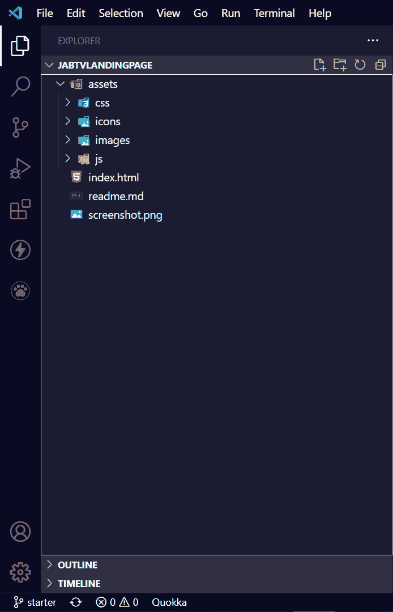

## 基本的 HTML 样板

基本的 HTML 样板文件如下所示:

```
<!DOCTYPE html>
<html lang="en">
  <head>
    <meta charset="UTF-8" />
    <meta http-equiv="X-UA-Compatible" content="IE=edge" />
    <meta name="viewport" content="width=device-width, initial-scale=1.0" />

    <!-- Web page CSS -->
    <link rel="stylesheet" href="assets/css/styles.css" />

    <!-- Simple lightbox CSS -->
    <link rel="stylesheet" href="assets/css/simple-lightbox.min.css" />

    <!-- Favicons -->
    <link
      rel="apple-touch-icon"
      sizes="180x180"
      href="assets/icons/apple-touch-icon.png"
    />
    <link
      rel="icon"
      type="image/png"
      sizes="32x32"
      href="assets/icons/favicon-32x32.png"
    />
    <link
      rel="icon"
      type="image/png"
      sizes="16x16"
      href="assets/icons/favicon-16x16.png"
    />

    <title>JabTV Landing Page</title>
  </head>
  <body>
    <!-- Navbar -->

    <!-- Dark/light theme switcher -->

    <!-- Bars -->

    <!-- Hero section -->

    <!-- About section -->

    <!-- Lightbox image gallery -->

    <!-- Jab TV Stakeholders -->

    <!-- Email subscription -->

    <!-- Social icons -->

    <!-- Scroll to top button -->

    <!-- Web page script -->
    <script src="assets/js/app.js"></script>

    <!-- Ion icons CDN -->
    <script
      type="module"
      src="https://unpkg.com/ionicons@5.5.2/dist/ionicons/ionicons.esm.js"
    ></script>

    <!-- Simple lightbox -->
    <script src="assets/js/simple-lightbox.min.js"></script>
    <script>
      // Simple lightbox initializer
    </script>
  </body>
</html> 
```

我们将一部分一部分地对登陆页面进行编码，这样就不会太复杂而难以理解。

## 如何制作导航条

导航栏的左边有一个徽标，右边有导航菜单项。稍后，我们将在徽标和导航项目之间放置明暗主题切换器，但让我们先关注徽标和菜单项。

对于徽标，我不会使用图像，而是将文本和表情符号放在一个 span 标签中，这样我就可以用不同的方式来设计它们。

徽标的 HTML 如下所示:

```
<nav>
      <a href="#" class="logo">
        <h1>
          <span class="jab">Jab</span><span class="tv">TV</span
          ><span class="fist">&#x1F44A;</span>
        </h1>
      </a>
</nav> 
```

这是“刺拳”和“电视”两个词的组合，还有一个打拳表情符号。

导航菜单项是放在无序列表标签中的普通链接，如下面的代码片段所示:

```
<ul>
        <li class="nav-item">
          <a href="#about" class="nav-link" id="nav-link">About</a>
        </li>
        <li class="nav-item">
          <a href="#stars" class="nav-link" id="nav-link">Boxing Stars</a>
        </li>
        <li class="nav-item">
          <a href="#stakeholders" class="nav-link" id="nav-link"
            >stakeholders</a
          >
        </li>
        <li class="nav-item">
          <a href="#sub" class="nav-link" id="nav-link">Subscribe</a>
        </li>
</ul> 
```

此外，我们需要一些酒吧的移动菜单。这些条在桌面上是隐藏的，在手机上是可见的。

为此，我将使用原始 HTML 和 CSS 制作的栏，而不是图标。这些条将是放置在一个具有类`hamburger`的容器 div 中的 span 标签。

```
<div class="hamburger" id="hamburger">
    <span class="bar"></span>
    <span class="bar"></span>
    <span class="bar"></span>
</div> 
```

浏览器中的导航菜单现在看起来是这样的:
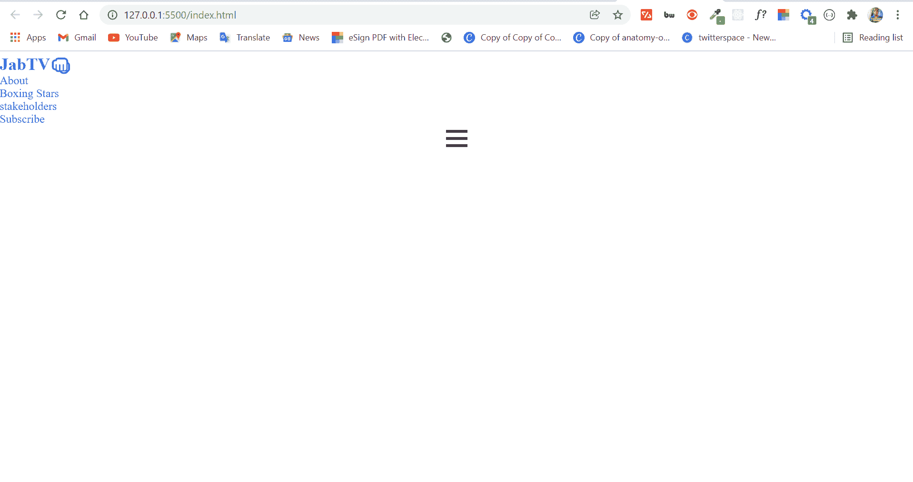

### 如何设计导航条的样式

导航条在这一点上看起来很丑，所以我们需要设计它的样式。我们需要设计 logo 的样式，让它看起来像一个，我们将使用 Flexbox 并排放置 logo 和菜单项。

对于整个网页，我将使用 Roboto 字体。我还声明了一些 CSS 变量和一些不太复杂的重置。

```
@import url("https://fonts.googleapis.com/css2?family=Roboto:ital,wght@0,400;0,900;1,700&display=swap");

/* CSS Variables */
:root {
  --normal-font: 400;
  --bold-font: 600;
  --bolder-font: 900;
  --primary-color: #0652dd;
  --secondary-color: #ea2027;
  --line-height: 1.7rem;
  --transition: 0.4s ease-in;
}

/* Smooth scroll effect */
html {
  scroll-behavior: smooth;
}

/* Resets */
* {
  margin: 0;
  padding: 0;
  box-sizing: border-box;
  transition: var(--transition);
}

 body {
  font-family: "Roboto", sans-serf;
}

ul li {
  list-style-type: none;
}

a {
  text-decoration: none;
  color: var(--primary-color);
}

a:hover {
  color: var(--secondary-color);
} 
```

在上面的 CSS 代码片段中，我删除了浏览器分配给所有元素的默认边距和填充，并将框大小设置为 border-box。这样，填充和边距设置将更有针对性。

我还设置了一个转换(在变量中声明)，这样你就可以在网站上看到每个转换。

所有链接在外观上都是蓝色的，在悬停时是红色的，与主要颜色和次要颜色相关。

为了设计 logo，我将第一个`<span>`设为红色，第二个`<span>`设为蓝色，第三个`.fist`设为红色。红色和蓝色在 CSS 变量中分别被设置为第二颜色和第一颜色。

红蓝两色是业余拳击和其他格斗运动中常用的颜色，这也是我选择它们作为网站的原因。

```
.fist {
  color: var(--secondary-color);
}

.jab {
  color: var(--primary-color);
}

.tv {
  color: var(--secondary-color);
} 
```

到目前为止，navbar 看起来是这样的:
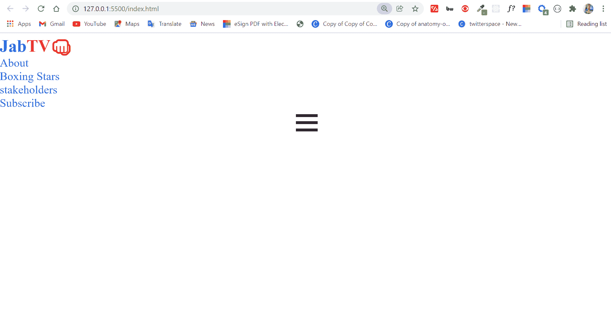

为了并排放置徽标和菜单项，我将使用 Flexbox。我还将隐藏条形，因为我们只在移动设备上需要它们。

```
nav {
  background: #fff;
  display: flex;
  justify-content: space-between;
  align-items: center;
  padding: 1rem 1.5rem;
  box-shadow: 2px 3px 2px #f1f1f1;
} 
```

我应用了一个方框阴影来确保用户知道导航条的终止位置。

我还打算让导航条有粘性，这样每当用户向下滚动时，它总是停留在顶部。这有助于创造良好的用户体验。

我将使用 4 行 CSS 代码:

```
 position: sticky;
  top: 0;
  left: 0;
  z-index: 1; 
```

为了隐藏条形，我将把目标放在`.hambuger`类上，并显示 none:

```
.hamburger {
  display: none;
} 
```

导航栏看起来好多了:
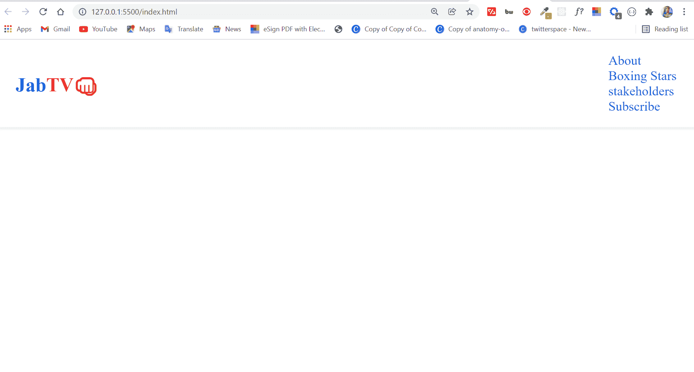

但是 logo 要大一点。我们还需要确保菜单项是并排的，而不是一个在另一个的上面，所以 Flexbox 在这里将再次发挥作用。

```
.logo {
  font-size: 2rem;
  font-weight: 500;
}

ul {
  display: flex;
  justify-content: space-between;
  align-items: center;
}

.nav-item {
  margin-left: 2rem;
}

.nav-link {
  font-weight: var(--bold-font);
} 
```

现在来看看导航栏:
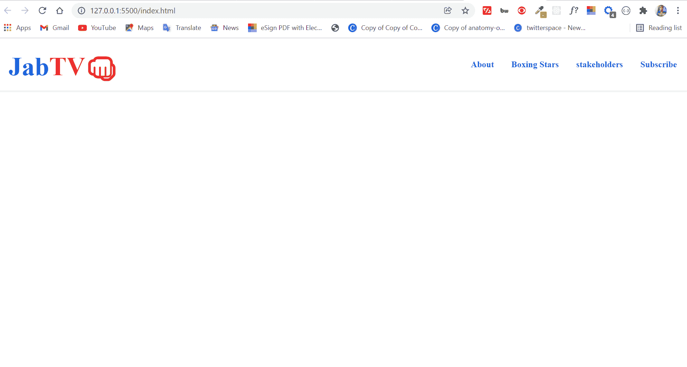

没有比这更好的了！

请注意，该标志不是一个图像。这意味着你可以随时用 CSS 更新它。

## 如何制作英雄版块

英雄部分将包含 JabTV 的简短描述、行动号召(CTA)按钮和一台用 CSS art 制作的老派电视。我们将制作带有`iframe`标签的电视，以便可以在其中显示视频。

我们将放在`iframe`中的视频是拳击大师穆罕默德·阿里的。

简而言之，这就是我们努力的方向:
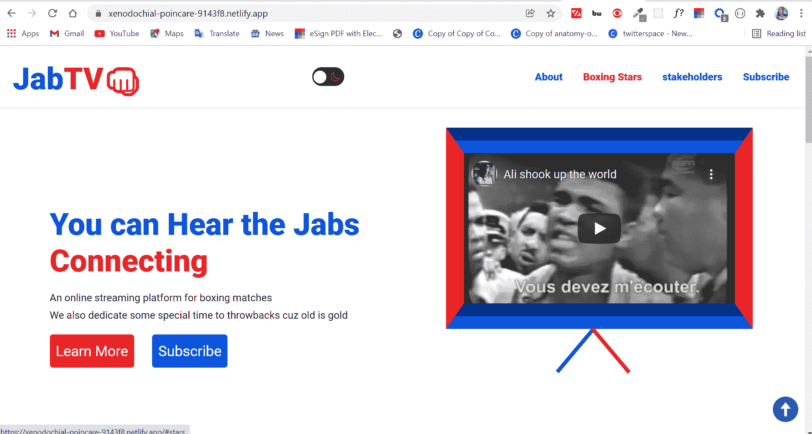

英雄部分的 HTML 在下面的代码片段中:

```
 <section class="hero">
      <div class="intro-text">
        <h1>
          <span class="hear"> You can Hear the Jabs </span> <br />
          <span class="connecting"> Connecting</span>
        </h1>
        <p>
          An online streaming platform for boxing matches <br />
          We also dedicate some special time to throwbacks cuz old is gold
        </p>
        <a class="btn red" href="#">Learn More</a>
        <a class="btn blue" href="#">Subscribe</a>
      </div>
      <div class="i-frame">
        <iframe
          width="560"
          height="315"
          src="https://www.youtube.com/embed/sUmM_PFpsvQ"
          title="YouTube video player"
          frameborder="10"
          allow="accelerometer; autoplay; clipboard-write; encrypted-media; gyroscope; picture-in-picture"
        ></iframe>
        <div class="stand-1"></div>
        <div class="stand-2"></div>
      </div>
    </section> 
```

有了上面的 HTML，这就是我们在浏览器里有的:
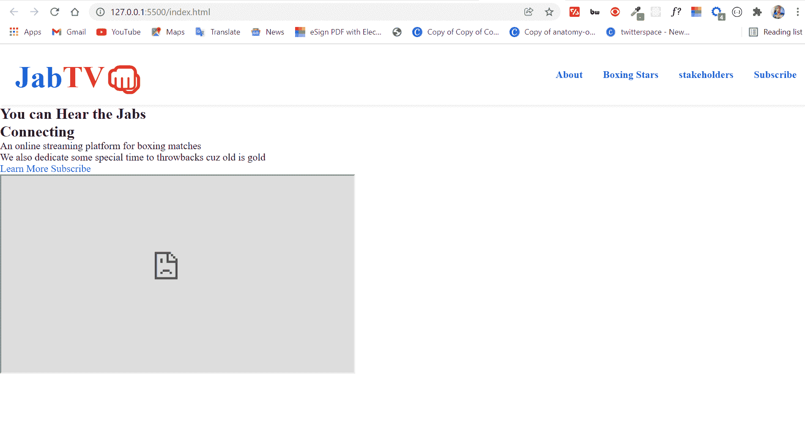

### 如何设计英雄部分的样式

为了让文字和电视并排，我们需要 Flexbox。

```
display: flex;
  align-items: center;
  justify-content: space-between;
  gap: 1.9rem;
  max-width: 1100px;
  margin: 2rem auto -6rem;
} 
```

除了与 Flexbox 对齐之外，我还给了这个部分一个最大宽度`1100px`,这样用户就不必一直看到最末端才能看到这个部分的内容——这有利于用户体验。

我在顶部应用了页边距`2rem`，在左右两边应用了自动，在底部应用了`-6rem`来居中该部分的所有内容。

到目前为止，我们在浏览器中有这样的:
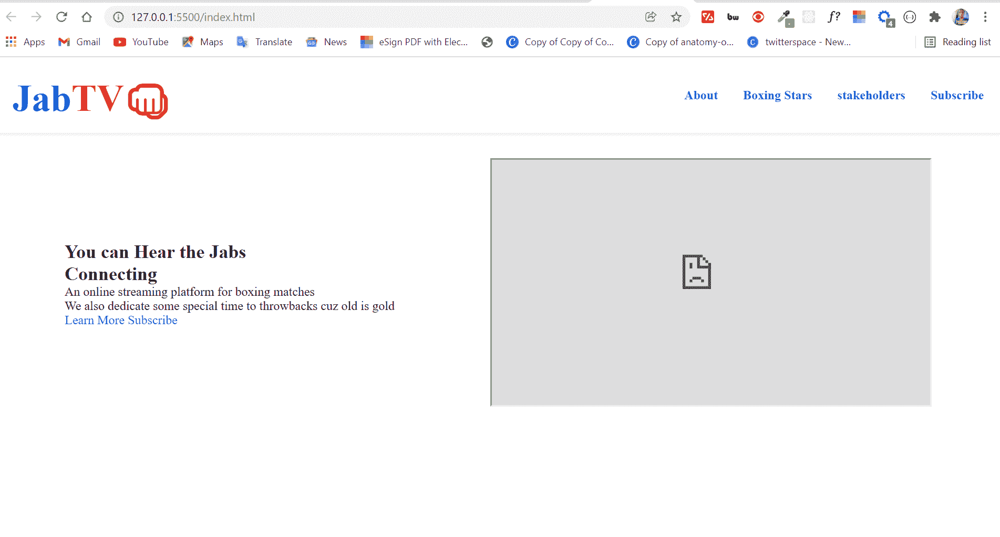

为了设计 hero 部分的`h1`文本的样式，我将它们放在各自的`span`标签中，这样我就可以设计不同的样式。

因此，我将使用 span 标记的 class 属性来定位文本:

```
.intro-text h1 {
  font-size: 3rem;
  margin-bottom: 1rem;
}

.intro-text h3 {
  margin-bottom: 0.5rem;
}

.hero p {
  line-height: var(--line-height);
}

.hear {
  color: var(--primary-color);
}

.connecting {
  color: var(--secondary-color);
} 
```

请记住，该部分有两个按钮，因此我为它们定义了一个基本样式:

```
.btn {
  margin-top: 1rem;
  display: inline-block;
  padding: 0.8rem 0.6rem;
  border: none;
  font-size: 1.4rem;
  border-radius: 5px;
  color: #fff;
}

.red {
  background-color: var(--secondary-color);
  margin-right: 1.5rem;
}

.red:hover {
  background-color: #f1262d;
  color: #fff;
}

.blue {
  background-color: var(--primary-color);
}

.blue:hover {
  background-color: #095cf7;
  color: #fff;
} 
```

截面正在成形:
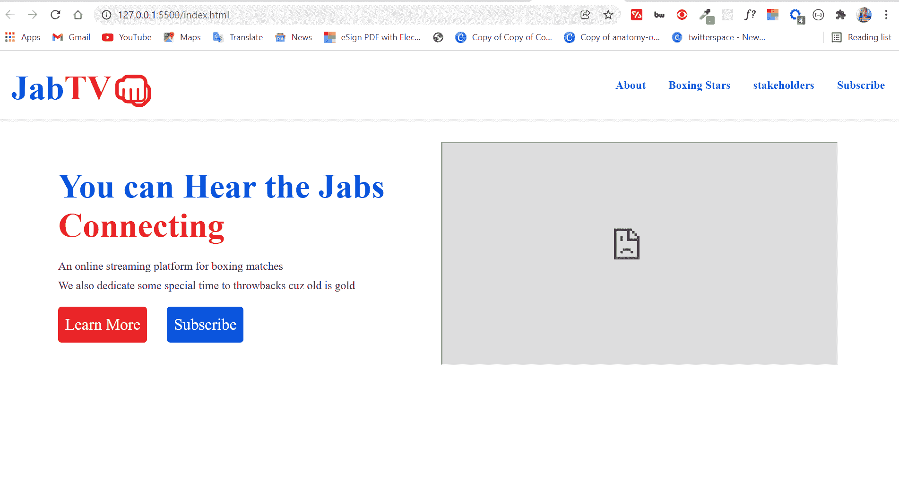

接下来，我们需要让`iframe`看起来像一台电视。属性将帮助我们完成这项工作。

在 HTML 中，记得我有两个标签，分别是类别`stand-1`和`stand-2`。我将通过使用`transform`属性来制作带有 2 个`div`标签的老式学校电视支架——该属性有助于旋转或倾斜元素。

```
iframe {
  max-width: 30rem;
  border-top: 40px groove var(--primary-color);
  border-bottom: 40px groove var(--primary-color);
  border-right: 28px solid var(--secondary-color);
  border-left: 28px solid var(--secondary-color);
}

.stand-1 {
  height: 90px;
  width: 6px;
  background-color: var(--primary-color);
  transform: rotate(40deg);
  position: relative;
  top: -16px;
  left: 200px;
}
.stand-2 {
  height: 90px;
  width: 6px;
  background-color: var(--secondary-color);
  transform: rotate(-40deg);
  position: relative;
  top: -105px;
  left: 255px;
} 
```

为了能够四处移动看台，我使用了`position`属性并将其设置为`relative`，这随后帮助我将`left`和`top`属性分配给看台。

英雄部分现在已经完全成型:
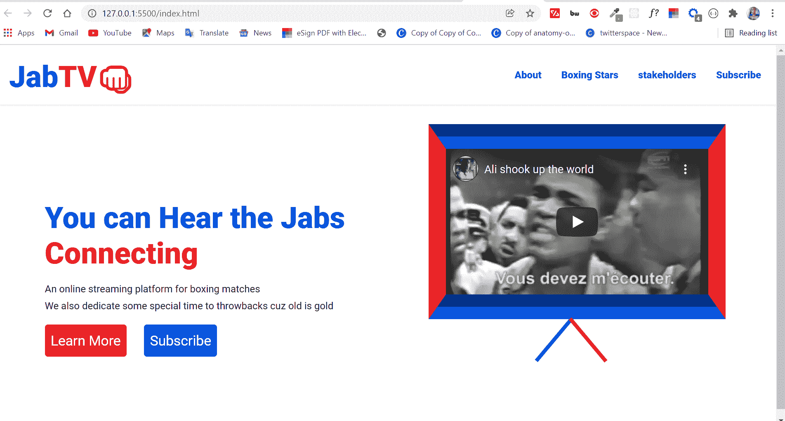

## 如何制作“关于”部分

“关于”部分将顾名思义，尽可能简要地详细介绍 JabTV 的内容。该部分将包含文本和背景图像。

这一部分的 HTML 并不复杂:

```
 <section class="about" id="about">
      <h3>Watch the Jabs</h3>
      <p>
        Our primary objective is to bring live boxing matches to fans all around
        the world
      </p>

      <h3>Its not About the Fights Alone!</h3>
      <p>
        We also air documentaries specially made for the greats, lifestyle of
        boxers, news, and more.
      </p>
</section> 
```

如果您想知道为什么没有`img`标签，那是因为我计划引入带有 CSS `background`属性的背景图像。

`background`属性是以下内容的简写:

*   `background-color`
*   `background-image`
*   `background-position`
*   `background-cover`
*   `background-repeat`
*   `background-origin`
*   `background-clip`
*   和`background-attachment`

只会应用您指定的内容，因此您可以随时跳过任何属性。

除了背景属性之外，我还将使用 Flexbox 来对齐 HTML 中的文本，这样它们在背景图像上看起来会更好。

这是我如何将位置属性与 Flexbox 结合使用的:

```
.about {
  position: relative;
  background: url("../images/jab-transformed.png") no-repeat top center/cover;
  height: 600px;
  display: flex;
  align-items: center;
  justify-content: center;
  flex-direction: column;
  gap: 1.5rem;
  margin: 2rem 0;
} 
```

这是到目前为止该部分在浏览器中的样子:
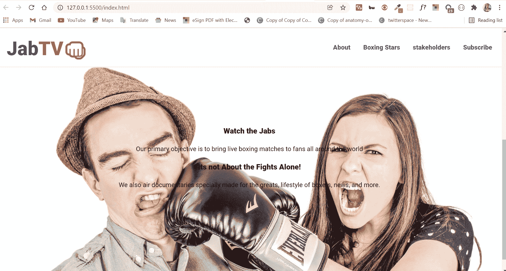

为了使文本看起来可读性更好，我使用了更多的 CSS:

```
.about h3 {
  font-size: 3em;
  margin-bottom: -20px;
}

.about p {
  font-size: 1.5em;
}

.about h3 {
  text-shadow: 2px 2px 2px #333;
}

.about p {
  text-shadow: 2px 2px 2px #333;
  font-size: 1.8rem;
} 
```

请注意，我对文本应用了文本阴影，因为它们显示在图像上。为了更好的可访问性，您应该在每个项目中都这样做。

“关于”部分现在看起来好多了:
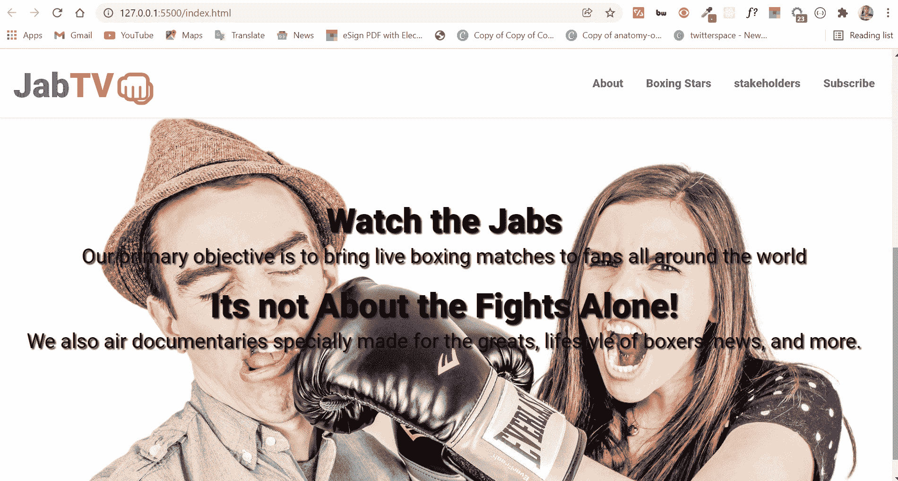

## 如何制作灯箱图像画廊

对于 lightbox 图片库，我不会从头开始，否则，这个教程将会变得难以忍受的长。我将使用一个插件称为简单的灯箱，和 CSS 网格的图像对齐。

要使用这个简单的 lightbox 插件，你必须从他们的网站上下载。我们所需要的是缩小的 CSS 和 JavaScript 文件。

当您提取下载的 zip 文件时，将缩小的 css 和 JavaScript 文件复制并粘贴到 assets 中的 js 和 CSS 子文件夹，并适当地链接它们，就像我在 starter `HTML`中所做的那样。

要使 lightbox 工作，您必须在一个``标签中的图像周围包裹一个锚标签(`<a>`)。

anchor 标签的`href`也必须与图像源相关联，并且它们都必须放在一个包含 div 的标签中，您需要为该标签分配一个 class 属性。

这个类属性将用于用 JavaScript 初始化图库。别担心，JavaScript 不会很复杂。画廊将展出我认为最伟大的拳击明星。

简单 lightbox 图像库的 HTML 在下面的代码片段中:

```
<section class="stars" id="stars">
      <div class="stars-gallery">
        <a href="assets/images/boda--femi.jpg" class="big">
          
        </a>

        <a href="assets/images/tyson-fury.jpg" class="big">
          
        </a>

        <a href="assets/images/iron-mike.webp.jpg" class="big">
          
        </a>

        <a href="assets/images/ali.jpg" class="big">
          
        </a>

        <a href="assets/images/wilder.jpg" class="big"
          >
        </a>

        <a href="assets/images/big-george.jpg" class="big">
          
        </a>
      </div>
</section> 
```

要使图库在查看图像时工作并平滑滚动，您必须用一行 JavaScript 初始化它:

```
<script>
     var lightbox = new SimpleLightbox(".stars-gallery a");
</script> 
```

我们的灯箱图库现在正在工作:
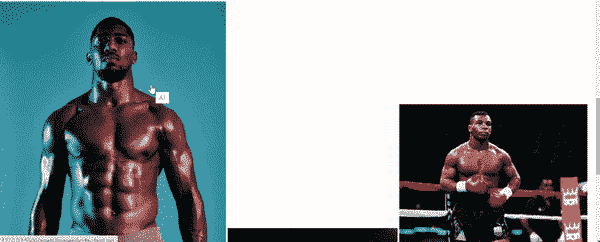

### 如何设计 Lightbox 图库的样式

这些图像排列得很差，所以我们需要用 CSS 网格来排列它们:

```
.stars-gallery {
  display: grid;
  grid-template-columns: repeat(5, 1fr);
} 
```

在上面的 CSS 代码片段中，我用一个类`stars-gallery`指向了`div`，并给了它一个网格显示，所以我们可以在`div`内的元素上使用 CSS 的其他属性。

我用 `grid-template-columns: repeat(5, 1fr);`定义了我需要的列，这将把图像限制在 5 列中。

到目前为止，画廊是这样的:
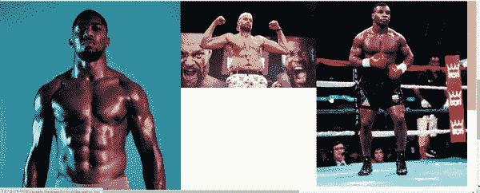

仍然需要做更多的工作，因为有一个空白，其中一个图像是不可见的。

我将所有图像的高度和宽度设置为 100%，这样它们都可以被看到:

```
.stars-gallery img,
.stars-gallery a {
  width: 100%;
  height: 100%;
} 
```

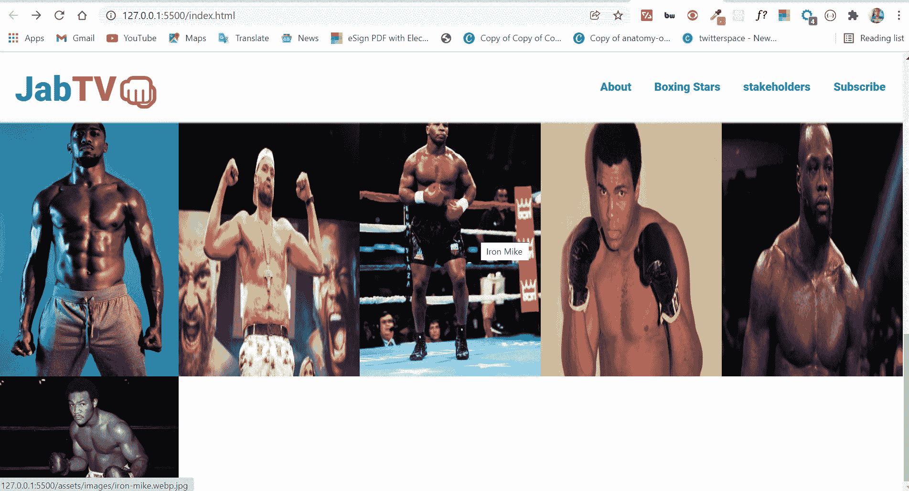

接下来，我将瞄准第一个图像，并为其定义网格行和列:

```
.stars-gallery a:first-child {
  grid-row: 1/3;
  grid-column: 1/3;
} 
```

使用定义的网格行和列，第一个图像将在水平方向占据前 2 行，在垂直方向占据前 2 列。

我还将第二个图像作为目标，并为它定义一个网格列:

```
.stars-gallery a:nth-child(2) {
  grid-column: 3/5;
} 
```

我们的图库现在布置得很好，工作正常:
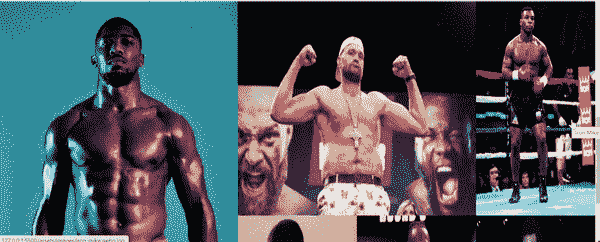

## 如何制作利益相关者部分

利益相关者部分包括负责运营 JabTV 的人员。

这一部分的 HTML 在下面的代码片段中:

```
<section class="people" id="stakeholders">
      <div class="stakeholders">
        <div class="persons">
          <div class="person-1">
            
            <p class="name">John Doe</p>
            <p class="role">Founder</p>
          </div>
          <div class="person-2">
            
            <p class="name">Jane Doe</p>
            <p class="role">MD</p>
          </div>
          <div class="person-3">
            
            <p class="name">John Doe JNR</p>
            <p class="role">Head Analyst</p>
          </div>
        </div>
      </div>
</section> 
```

这是该部分的外观:
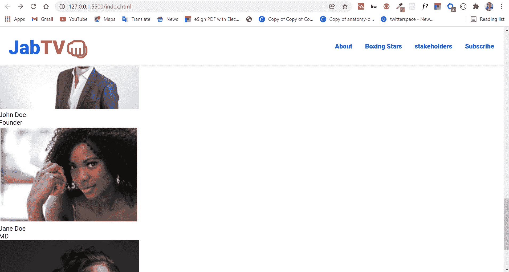

但这不是我们想要的，所以我们要做一些造型。

### 如何设计利益相关者部分的样式

我将使用 CSS 网格来布局利益相关者的图像、姓名和角色。如果你愿意，你可以使用 Flexbox。但在此之前，我将对该部分做一点调整:

```
 .people {
  margin-top: 2rem;
  padding: 1rem 0;
}

.stakeholders {
  margin: 2rem auto;
  max-width: 1100px;
}

.stakeholders img {
  border-radius: 0.6rem;
} 
```

在上面的代码片段中，我将该部分向下推了一点，上边距为 2。我瞄准了`.people`类来做这件事。

我做的下一件事是针对`.stakeholders`类，我在顶部和底部给它分配了一个边距`2rem`。我还用`auto`把它左右居中。

再次针对`.stakeholders`类，我也给了这个部分 1100px 的最大宽度，所以在左右两边都创建了空格。这确保了用户在看到东西之前不会看向最左边和最右边。

这让事情看起来好一点:
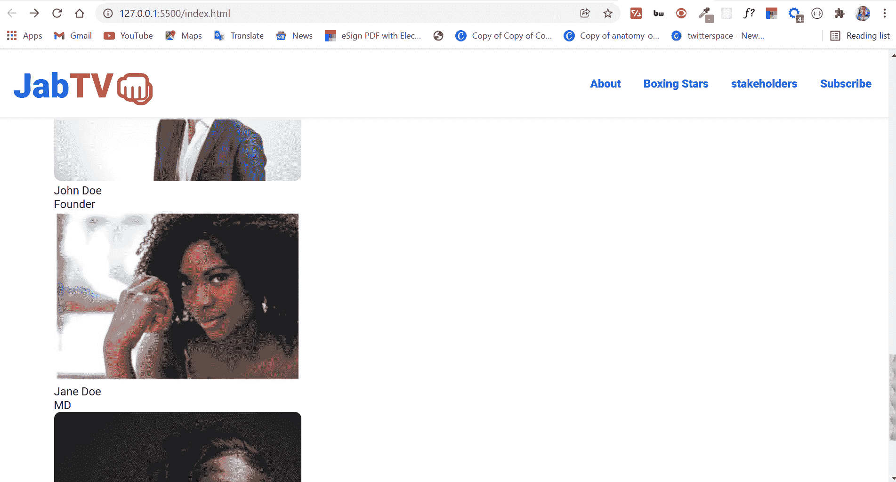

为了最终用 CSS 网格布局图像和文本，我做了如下工作:

```
.persons {
  display: grid;
  grid-template-columns: repeat(3, 1fr);
  place-items: center;
  gap: 1rem;
} 
```

因为在一个`div`中有 3 个图像:

*   我为该部分定义了 3 列
*   使用`place-items`将所有内容水平和垂直对齐到中心
*   在带有`gap`属性的`div`标签中添加了`1rem`的空格

现在除了文字之外一切看起来都不错:
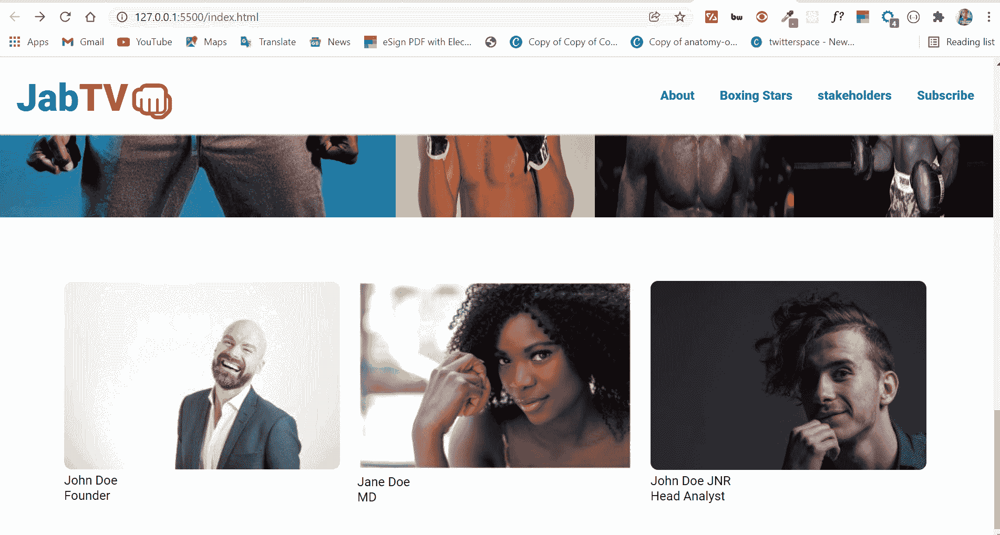

为了让文本看起来更好，我将使用`.name`和`.role`类来定位它，并将其居中对齐，然后在必要的地方为其指定颜色和字体:

```
.name {
  color: var(--primary-color);
  text-align: center;
}

.role {
  color: var(--secondary-color);
  text-align: center;
  font-size: 0.8rem;
} 
```

这个部分现在看起来足够好了:
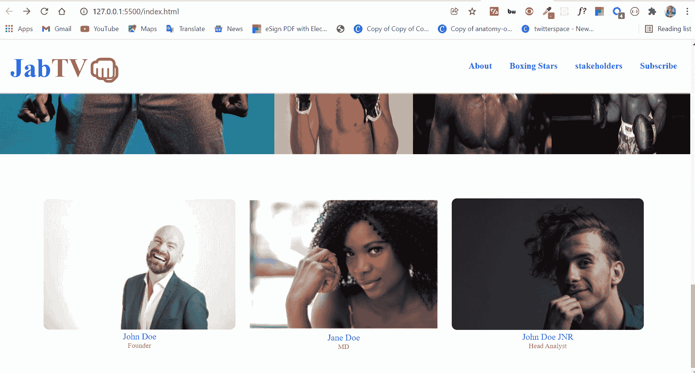

## 如何制作电子邮件订阅部分

电子邮件订阅部分将尽可能简短。我不会在这里做任何收集电子邮件的整合。

为此，如果你想简单地收集邮件，可以使用 formspree。不过，最好使用 Mailchimp 或 Convertkit 之类的服务，这样你就可以对你收集的电子邮件做些什么了。

这一部分的 HTML 只有 12 行:

```
<section class="sub" id="sub">
      <h3>Subscribe to our newsletter for updates</h3>
      <form action="#">
        <input
          type="email"
          name="email"
          id="email-sub"
          class="email-sub"
          required
        />
        <input
          type="submit"
          value="Subscribe"
          id="submit-btn"
          class="submit-btn"
        />
      </form>
</section> 
```

如您所见，我在表单中有一个电子邮件输入和一个提交按钮。
该部分在浏览器中看起来不算太差:
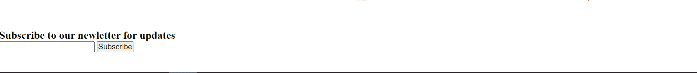

### 如何设计电子邮件订阅部分的样式

我们需要将`h3`和`form`居中对齐，并使订阅按钮看起来不错。

这是我如何将`h3`和表格对齐到中心的:

```
.sub {
  margin-top: 2rem;
}

.sub h3 {
  text-align: center;
}

form {
  text-align: center;
  margin: 0.4rem 2rem;
} 
```

请注意，我还将该部分推至底部，并留有一点空白`2rem`。

为了将表单推离`h3`，我在顶部和底部给了它一个`0.4rem`的边距，在左右两边给了 2 个`rem`。

表单现在看起来好多了:
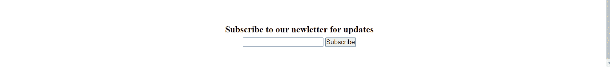

下一步我们应该做的是让输入区域和订阅按钮看起来更好。我将一个类`.email-sub`附加到输入区域，所以我将用这个类来定位它，并应用一些样式:

```
.email-sub {
  padding: 0.2rem;
  border: 1px solid var(--primary-color);
  border-radius: 4px;
}

.email-sub:focus {
  border: 1px solid var(--secondary-color);
  outline: none;
} 
```

下面是上面的 CSS 对输入区域的影响:

*   为了获得更好的间距，我给了输入 0.2 毫米的填充
*   我给它(输入)一个 1px 的蓝色实线边框
*   我用 4px 的边界半径将输入的角变圆
*   当聚焦时，也就是当你试图输入时，我把边框颜色改成了网站的第二颜色
*   最后，我将轮廓设置为 none，以消除在输入区域输入时显示的难看的轮廓。

我用下面的 CSS 让订阅按钮看起来更好:

```
.submit-btn {
  background-color: var(--primary-color);
  color: #fff;
  padding: 0.3rem;
  margin: 0 0.5rem;
  border: none;
  border-radius: 2px;
  cursor: pointer;
}

.submit-btn:hover {
  background-color: #095cf7;
} 
```

订阅部分现在看起来真的很酷:
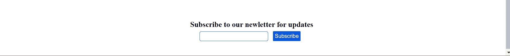

我还将在该部分包含一些社交图标。对于图标，我将使用离子图标。

图标将被包裹在锚标记中，因此它们可以继承 CSS 重置中为链接设置的样式。

```
<section class="social">
      <h3>Connect with us on Social Media</h3>
      <div class="socicons">
        <a href="#"> <ion-icon name="logo-twitter"></ion-icon> </a>
        <a href="#"> <ion-icon name="logo-instagram"></ion-icon> </a>
        <a href="#"> <ion-icon name="logo-facebook"></ion-icon> </a>
      </div>
</section> 
```

社交图标的 CSS 并不复杂:

```
.social {
  text-align: center;
  margin: 2rem;
}

.socicons {
  font-size: 1.3rem;
} 
```

这是邮件订阅部分最终的样子:
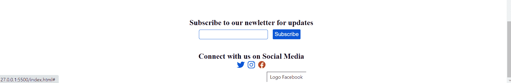

要了解更多关于 Ionic icons 的信息，请查看 GitHub 上该项目的自述文件。

## 如何制作页脚

页脚的 HTML 是一行代码:

```
<footer>&copy;2020\. All Rights Reserved</footer> 
```

如果你想知道`&copy;`是什么，那是你经常在网站页脚看到的字符实体。

CSS 全部在 6 行中完成:

```
footer {
  border-top: 1px solid #f1f1f1;
  box-shadow: 0px -2px 3px #f1f1f1;
  text-align: center;
  padding: 2rem;
} 
```

我在页脚应用了一个`border-top`和`box-shadow`,这样它的上部就可以和导航条相关联了。

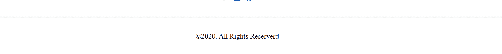

## 如何制作滚动到顶部按钮

为了更好的用户体验，让我们实现一个滚动到顶部的按钮。点击后，无论用户在哪里，该按钮都会将用户带到页面的顶部。

“滚动到顶部”按钮的 HTML 在下面的代码片段中:

```
<i class="scroll-up" id="scroll-up"
     ></i> 
```

我们将使用类属性来设置按钮的样式，并在 JavaScript 文件中使用 id 来选择它。这就是我们在 CSS 和 JavaScript 中的做法。

为了让按钮在任何地方都可见，看起来也不错，我打算给它一个固定的位置，增加宽度和高度。我还会给它一个指针光标，这样用户就知道当他们把光标放在上面时会发生什么。

```
.scroll-up {
  position: fixed;
  right: 0.5%;
  bottom: 3%;
  cursor: pointer;
}

.up-arrow {
  width: 3rem;
  height: 3rem;
} 
```

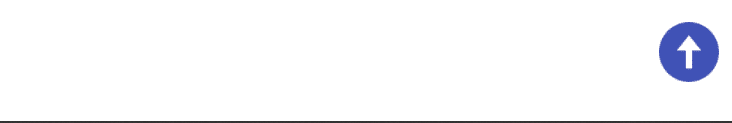

为了最终实现滚动到顶部的功能，我们将编写 7 行 JavaScript 代码:

```
const scrollUp = document.querySelector("#scroll-up");

scrollUp.addEventListener("click", () => {
  window.scrollTo({
    top: 0,
    left: 0,
    behavior: "smooth",
  });
}); 
```

**脚本在做什么？**

在第一行中，我通过将按钮赋给一个名为`scrollUp`的变量来选择它。

我使用了`querySelector()`方法，因为据说这样更快。也可以用`getElementById`。

为了获得用户在按钮上的点击动作，我使用了 DOM(文档对象模型)的一个重要特性 eventListener。

在`eventListener()`函数中，我引入了一个名为`scrollTo`的窗口对象方法，它有助于移动到网页上的任何地方。

要告诉 scrollTo 方法滚动到哪里，您必须根据具体情况为它分配一个属性 top 和 left 或 top 和 bottom。所以我把它的左上角赋值为 0。

我做的最后一件事是将 behavior 属性设置为一个字符串“smooth ”,这样当按钮被单击时，事情会平滑地显示出来。

我们的滚动到顶部按钮现在工作正常:
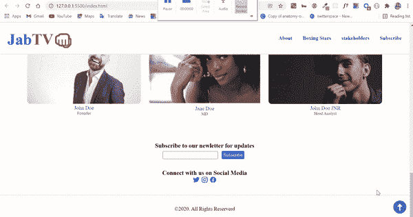

我们现在有一个完整的网站！但是让我们更进一步，添加一个明暗主题切换器，因为现在很多人喜欢在黑暗模式下使用网站。

## 如何制作明暗主题切换器

为了使黑暗主题切换器在登陆页面的任何地方都可以访问，我将把它放在我们的粘性导航栏中。

我将使用:

*   一个包含主题开关类的 div 来存放所有东西
*   一种输入类型的复选框，用于在暗模式和亮模式之间切换
*   放置月亮(黑暗模式)和太阳(光明模式)两个图标的标签
*   一个 div，标签内有一个 switcher 类，创建一个类似球的形状。当用户切换到亮或暗模式时，该形状将覆盖一个图标

我是这样把以上几点转换成 HTML 代码的:

```
<div class="theme-switch">
    <input type="checkbox" class="checkbox" id="checkbox" />
    <label for="checkbox" class="label">
       <ion-icon name="partly-sunny-outline" class="sun"></ion-icon>
       <ion-icon name="moon-outline" class="moon"></ion-icon>
       <div class="switcher"></div>
    </label>
</div> 
```

这是它在浏览器中的样子:
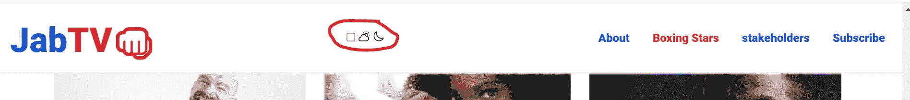

### 如何设计明暗主题切换器的风格

我要做的第一件事是使复选框不可见，并将其置于绝对位置。

我们需要这样做，因为我们需要的是一个复选框的功能，可以在亮暗模式之间切换——但我们不需要让它对用户可见。

```
.checkbox {
  opacity: 0;
  position: absolute;
} 
```

接下来，我将相对定位标签，用 Flexbox 将所有内容居中，并给它一个深色背景。有了这个和其他一些小的风格，黑暗主题切换器将更加明显。

```
.label {
  width: 50px;
  height: 29px;
  background-color: #111;
  display: flex;
  align-items: center;
  justify-content: space-between;
  border-radius: 30px;
  padding: 6px;
  position: relative;
} 
```

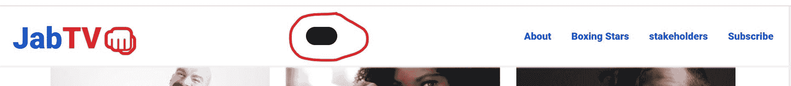

你现在看到的只是一个黑暗的背景。别担心。一切都会变得清晰可见。

还记得有一个`switcher`类的`div`吗？让我们把它弄得又白又圆，看起来真的像一个球。我们也将它定位为绝对的，因为它在相对定位的标签内。

```
.switcher {
  background-color: #fff;
  position: absolute;
  top: 5px;
  left: 2px;
  height: 20px;
  width: 20px;
  border-radius: 50%;
} 
```

定义宽度、高度和 50%的边界半径就是你如何在 CSS 中制作任何圆形的东西。

我们的深色主题切换器正在成形，但是让我们给图标适当的颜色，太阳的红色和月亮的黄色，让它们看得见。

```
.moon {
  color: #ffa502;
}

.sun {
  color: #ff4757;
} 
```

最后，为了能够左右移动球，我们需要在我们的复选框上使用:checked 伪类，并用 switcher 类定位球，然后使用 transform 属性通过设置一个以像素为单位的图形来移动它:

```
.checkbox:checked + .label .switcher {
  transform: translateX(24px);
} 
```

我们的球正在移动，图标正确显示:
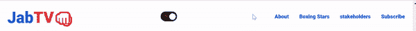

我们现在需要做的是使用 JavaScript 在亮暗模式之间切换，并为暗模式设置颜色。

你可以在下面的代码片段中找到深色主题的颜色设置:

```
body.dark {
  background-color: #1e272e;
}

body.dark .bar {
  background-color: #fff;
}

body.dark p {
  color: #fff;
}

body.dark h3 {
  color: #fff;
}

body.dark nav {
  background-color: #1e272e;
  box-shadow: 2px 3px 2px #111010;
}

body.dark ul {
  background-color: #1e272e;
}

body.dark .name {
  color: var(--primary-color);
}

body.dark .role {
  color: var(--secondary-color);
}

body.dark footer {
  color: #fff;
  border-top: 1px solid #111010;
  box-shadow: 0px -2px 3px #111010;
} 
```

下面是我如何使用 JavaScript 通过使用复选框上的 change event 和 DOM 的`toggle()`方法来切换`body.dark`类:

```
const checkbox = document.querySelector("#checkbox");

checkbox.addEventListener("change", () => {
  // Toggle website theme
  document.body.classList.toggle("dark");
}); 
```

注意，我选择了 id 为`#checkbox`的复选框，并将其赋给了一个`checkbox`变量。尽量总是对 JavaScript 使用 id，对 CSS 使用类，这样就不会混淆。

用户可以在我们的登陆页面切换亮暗模式:
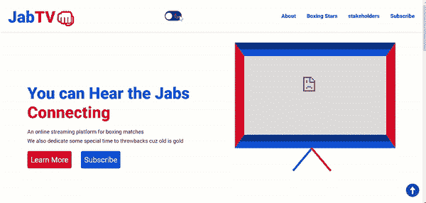

## 如何让登陆页面响应迅速

登录页面还没有响应，所以我们应该解决这个问题。

为了使登录页面具有响应性，我们需要在媒体查询中为较小的设备制作一个汉堡包菜单。我们还将再次使用 Flexbox 和 Grid 来将各个部分堆叠在一起。

### 如何为登陆页面制作汉堡菜单

对于汉堡菜单，我要做的第一件事是让条形在屏幕宽度小于 768 像素的设备上可见。

我还将为这些条设置一个指针光标，这样用户就知道当他们将鼠标悬停在上面时可以点击。

```
@media screen and (max-width: 768px) {
  .hamburger {
    display: block;
    cursor: pointer;
  } 
```

接下来，我将通过定位包含导航菜单项的无序列表，将导航菜单项的伸缩方向更改为 column，这样它们就会一个在另一个之上。

我还会给列表一个白色背景，将列表中的每一项居中对齐，并使列表项固定，left 属性设置为 100%，这样它就会被带出视口(不可见)。

```
ul {
    background-color: #fff;
    flex-direction: column;
    position: fixed;
    left: 100%;
    top: 5rem;
    width: 100%;
    text-align: center;
  } 
```

到目前为止，这是我们在浏览器中的:
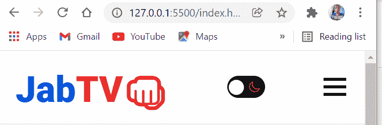

为了使导航项可见，我将把 active 类属性附加到包含它们的无序列表中，并将`left`设置为`0`。当用户点击工具条时，这个类将被 JavaScript 切换。

```
ul.active {
    left: 0;
} 
```

导航项目的间距变得很小:
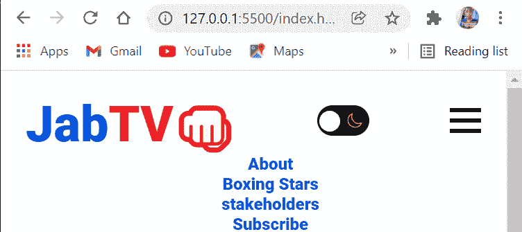

为了确保导航菜单项间距合适，我将用`.nav-item`类来定位它们，并给它们一些边距:

```
.nav-item {
    margin: 2rem 0;
  } 
```

上面的 CSS 代码片段在顶部和底部给了每个导航菜单项 2 的边距，在左侧和右侧给了 0 的边距，所以它们看起来像这样:
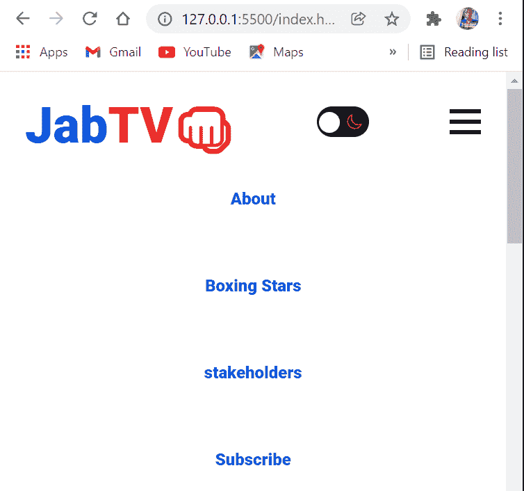

还有一件事要对条形做——我们需要确保当它们被点击时变成 X 形状，当再次被点击时又变回条形。

为此，我们将在汉堡包菜单上附加一个 active 类，然后旋转条形。请记住，这个活动类将由 JavaScript 切换。

```
.hamburger.active .bar:nth-child(2) {
    opacity: 0;
  }

  .hamburger.active .bar:nth-child(1) {
    transform: translateY(10px) rotate(45deg);
  }

  .hamburger.active .bar:nth-child(3) {
    transform: translateY(-10px) rotate(-45deg);
  } 
```

为了进行切换，我们需要一些 JavaScript:

```
const hamburger = document.querySelector("#hamburger");
const navMenu = document.querySelector("ul");

function openMenu() {
  hamburger.classList.toggle("active");
  navMenu.classList.toggle("active");
} 
```

以下是我在 JavaScript 中所做的:

*   我选择了 id 为 hamburger 的条，以及元素为(`ul`)的无序列表
*   我编写了一个名为`openMenu`的函数来获取汉堡菜单和无序列表的类列表，然后使用`toggle()`方法引入活动类。

我们的导航菜单项现在可以来回切换，并根据需要改变形状:
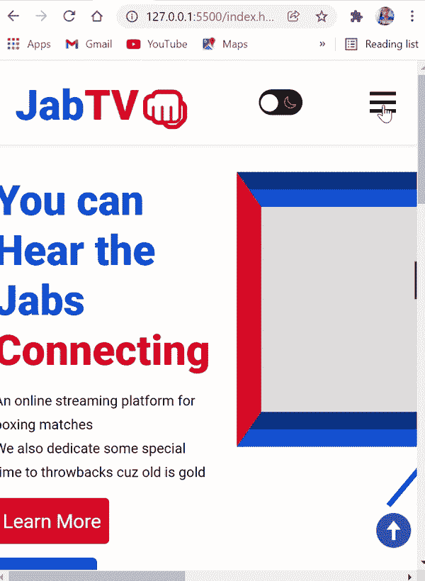

但是有一个问题。单击菜单项时，菜单项不会被隐藏。为了更好的用户体验，我们需要做到这一点。

为此，我们再次需要一些 JavaScript。我们将:

*   使用 querySelectorAll()通过定位其 id 来选择所有导航项目
*   使用 forEach()数组方法监听每个导航菜单项上的单击事件
*   写一个函数来移除`.active`类——这将最终把导航菜单返回到它的初始状态。

```
const navLink = document.querySelectorAll("#nav-link");

navLink.forEach((n) => n.addEventListener("click", closeMenu));
function closeMenu() {
  hamburger.classList.remove("active");
  navMenu.classList.remove("active");
} 
```

我们的手机菜单现在一切正常:
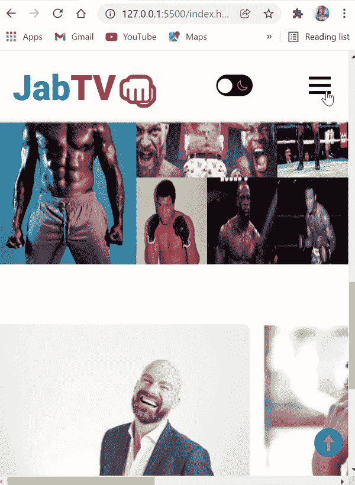

如果你注意到了，网站的其他部分在移动设备上看起来并不好。甚至还有一个烦人的水平滚动条。这不是 1998 年而是 2022 年！
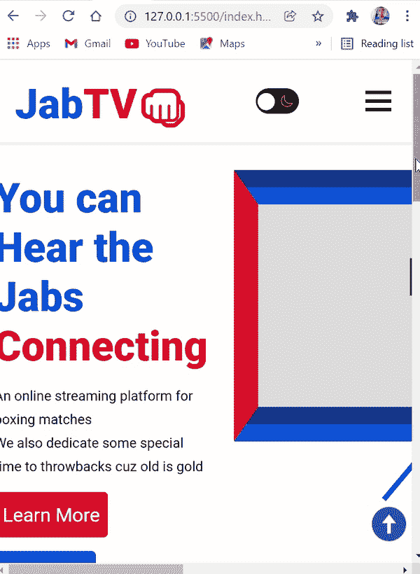

将以下样式添加到媒体查询中可以解决这个问题:

```
 .logo {
    font-size: 1.5rem;
  }

 .hero {
    flex-direction: column;
    max-width: 500px;
  }

  .intro-text h1 {
    font-size: 2.3rem;
  }

  .btn {
    padding: 0.5rem;
    font-size: 1.2rem;
  }

  iframe {
    max-width: 26rem;
  }

  .stand-1 {
    left: 170px;
  }
  .stand-2 {
    left: 225px;
  }

  .about {
    text-align: center;
  }

  .persons {
    grid-template-columns: repeat(1, 1fr);
  } 
} 
```

有了上面的 CSS，我缩小了尺寸，在需要的地方把方向改成了列，这样各部分就可以一个叠一个了，并且让电视柜正确的对齐。
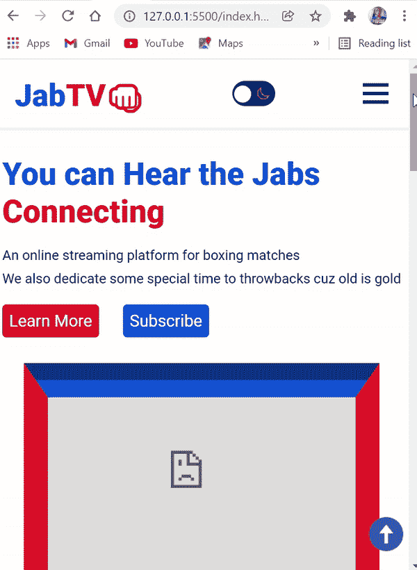

看看更小的手机上的登陆页面，我们真的可以做得更好:
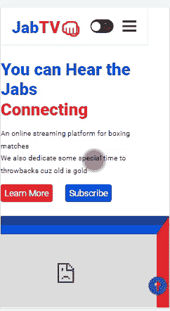

为了使登录页面在更小的手机上响应，我将在屏幕宽度为 420px 及以下的移动设备上集成一些更改:

```
@media screen and (max-width: 420px) {
  .hero {
    max-width: 330px;
  }

  .intro-text h1 {
    font-size: 2rem;
  }

  iframe {
    max-width: 330px;
  }

  .stand-1 {
    left: 140px;
  }
  .stand-2 {
    left: 195px;
  }
} 
```

我们现在有了一个完全响应的登录页面:
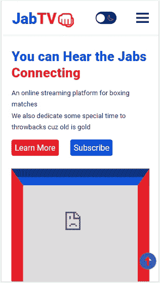。

从这个 [Github repo](https://github.com/Ksound22/JabTV-Landing-Page/tree/master) 中抓取完成的登陆页面代码副本。

## 结论

在本详细教程中，您已经学习了如何制作:

*   完全响应的网站
*   黑暗主题切换器
*   汉堡菜单
*   灯箱图像库
*   滚动到顶部按钮。

这些都是您可以随时集成到新的或现有项目中的功能，所以在您需要的任何时候都可以随时回到本文。

如果你觉得这篇基于文本的教程很有帮助，可以通过发推特表示感谢或将链接粘贴到你的社交媒体平台上来分享它。

感谢您的阅读！