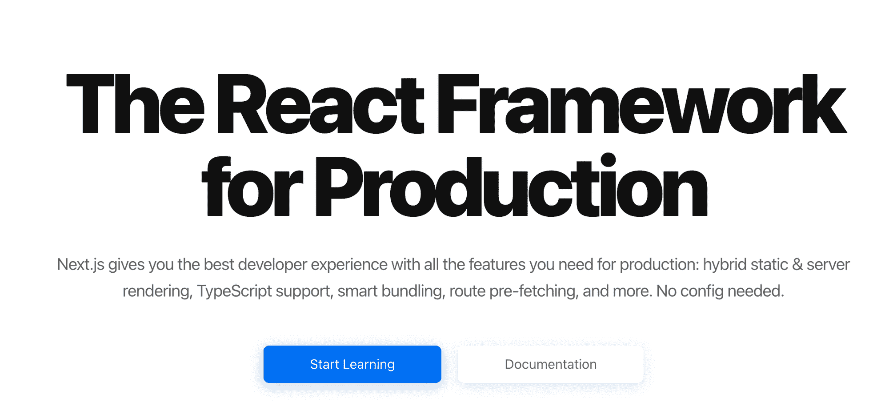
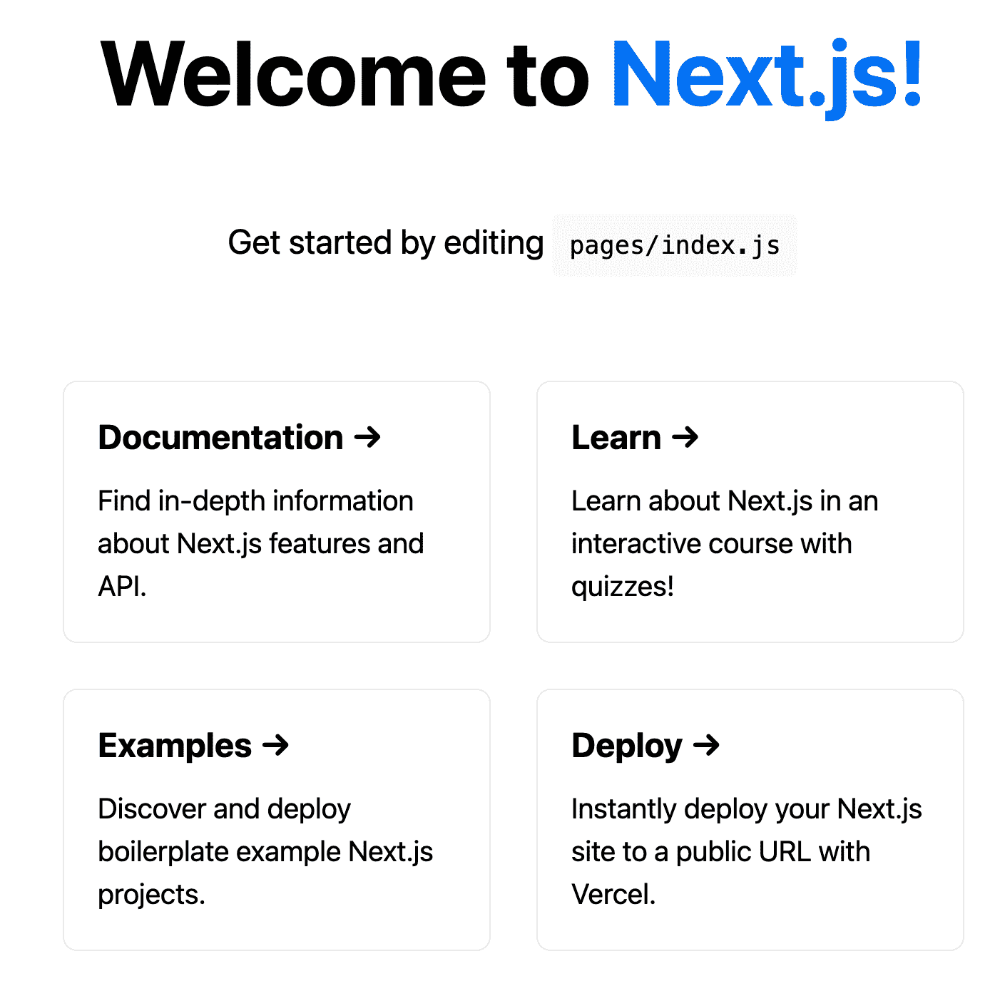
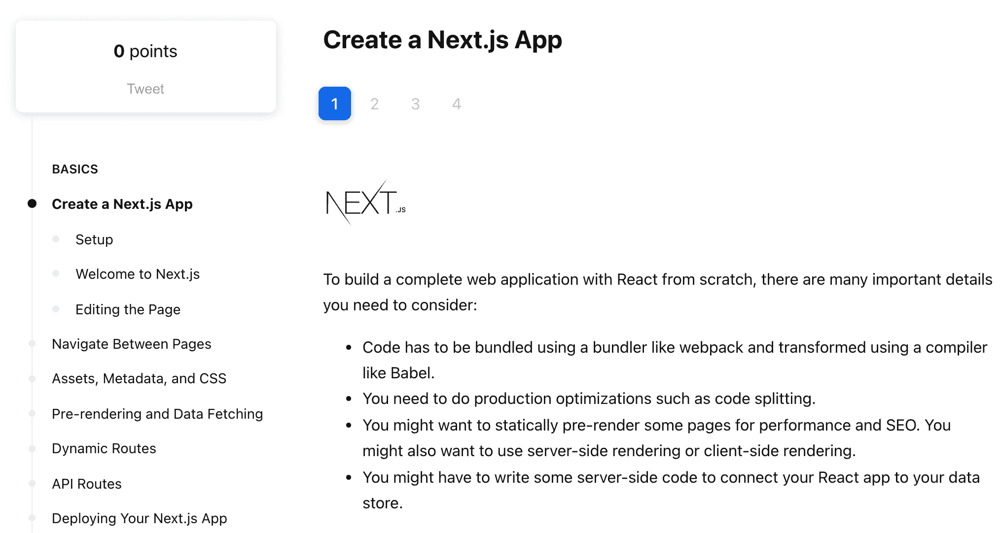

# 开始使用 next . js——您的项目需要的 React 库

> 原文：<https://www.freecodecamp.org/news/nextjs-tutorial/>

我撰写本指南是为了给你一个实用的概述，也许是你将用来构建 90%的项目的最重要的 React 库:Next.js。

本教程的目标是让你尽可能容易地开始使用 Next.js。

这不是关于 Next 的完整指南，但它将为您提供您需要了解的一切:

*   什么是 Next.js(以及为什么您应该开始在 React 项目中使用它)
*   如何使用 Next.js 执行基本任务
*   以及 Next.js 将如何帮助您更快地构建总体上更好的 React 应用程序

让我们开始吧！

> 我已经帮助了 100 多人从完全的初学者到受雇的 React 开发人员。想做同样的事吗？查看 [****The React 训练营****](https://reactbootcamp.com/) 。

## 目录

*   [next . js 是什么？](#what-is-next-js)
*   [next . js 给了你什么特性](#what-features-next-js-gives-you)
*   [next . js 没有的功能有哪些](#what-features-next-js-doesn-t-have)
*   [如何创建 Next.js App](#how-to-create-a-next-js-app)
*   [Next.js 脚本](#next-js-scripts)
*   [添加 TypeScript 到 Next.js](#add-typescript-to-next-js)
*   [页面和路线](#pages-and-routes)
*   [链接和导航](#links-and-navigation)
*   [next . js 中的 SEO](#seo-in-next-js)
*   [API 路线](#api-routes)
*   [请求数据客户端](#request-data-client-side)
*   [请求数据服务器端](#request-data-server-side)
*   [GetServerSideProps](#getserversideprops)
*   [GetStaticProps](#getstaticprops)
*   [下一步去哪里学. js](#where-to-learn-next-js)

## Next.js 是什么？

毫无疑问，任何 React 开发人员学习和改进他们自己的项目的最终工具是 **Next.js** 。



The NextJS.org Homepage

无论我是在建立一个像博客一样的具有交互性的静态网站，还是一个像社交媒体应用程序一样的高度动态的全栈项目，*我几乎总是在寻找下一个*。

你使用 Next 的第一个原因是，正如标题所说，因为它是一个 **React 框架**。

可以把它想象成一种“内置电池”的方式来构建 React 应用程序，它给你带来了 Create React App 等工具的简单性，并结合了一套其他超级强大的功能。

尽管是一个框架，Next.js 保留了一些非个人化的 React 哲学。Next 为您提供了改进整体开发体验的特性，但并没有限制您可以选择的选项数量。

事实上，考虑到 Next 让 React 应用成为可能，我认为它真的扩大了你可用的选项数量，如果你需要的话。

通过查看位于[nextjs.org/examples](https://nextjs.org/examples)的 100 个 Next.js 项目示例，你可以更全面地了解 Next.js 应用程序的能力:


Next.js Examples

在那里，您可以找到如何创建以下 Next (React)应用程序的示例:

*   使用 Markdown / MDX 或 Wordpress 的博客
*   使用 Shopify 的电子商务应用程序
*   使用 Contentful 或 Sanity 等内容管理系统的网站
*   带有 GraphQL 和身份验证的全栈项目

还有更多！一定要查看完整的列表，激发你的想象力。

## Next.js 给了你什么特性

下面是 Next 给你的 React 项目的清单。

简而言之，它在一个`next`依赖项中提供了一整套包的功能。

Next.js 给你:

*   基于页面的路由(通过将组件放入/pages 来创建页面)
*   内置路由器(无需安装 React 路由器)
*   API 路由(使用/pages/api 中的 Node.js 编写后端代码)
*   用于开发/生产的超快速构建(即时查看保存的更改)
*   图像和字体优化
*   内置的 ESLint 和 TypeScript 支持
*   +吨以上(全部在 [Next.js 文档](https://nextjs.org/docs/)中概述)

## Next.js 没有的功能有哪些

此外，还有许多 Next.js 没有提供的基本功能。

例如，在 Next 中没有内置的方法来执行以下操作:

*   认证(我推荐使用包 Next-Auth)
*   测试(我推荐使用剧作家或赛普拉斯进行 E2E 测试)
*   状态管理(我推荐 Zustand 或者 Redux 工具包)

[文档本身](https://nextjs.org/docs/authentication)涵盖了这些缺点，但需要注意的是，虽然 Next.js 为您提供了大量的**，但它不会单独涵盖每个应用用例**。

## Next.js Speedrun💨

我将向您展示 Next.js 的亮点，让您了解该框架如何为您提供让您更高效的默认设置。

## 如何创建 Next.js 应用程序

如果您安装了 NPM，请使用以下命令启动任何新的下一个项目:

```
npx create-next-app my-next-project
```

`create-next-app`是一个类似 Create React App 的包，但是针对 Next.js 项目。

简而言之，它为我们提供了一个安装了所有依赖项(分别是`next`、`react`和`react-dom`)的下一个项目，外加一些虚拟页面和样式。

## Next.js 脚本

您目前会发现在您的`package.json`文件中列出了四个主要脚本:

```
"scripts": {
  "dev": "next dev",
  "build": "next build",
  "start": "next start",
  "lint": "next lint"
}
```

*   `dev`–在 localhost:3000 上运行开发服务器
*   `build`–创建一个已构建好的应用程序以备部署
*   `start`–启动您构建的下一个应用程序(必须先运行`next build`
*   如果你写的代码需要修改，将使用开发依赖 ESLint“lint”你的下一个项目来警告你

要在开发中运行您的下一个项目，请确保您在您的项目文件夹(my-next-project)中，并运行开发脚本:

```
npm run dev
```

当您的项目在 localhost:3000 上启动并运行后，导航到那里，您应该会看到一个默认的应用程序:



Index page of Create-Next-App project

## 将 TypeScript 添加到 Next.js

想加 TypeScript？再简单不过了:

```
# run 'touch' to create an empty config file
# Next will auto-populate it

touch tsconfig.json 

# then you'll be prompted to run the command:
npm install -D typescript @types/react @types/node

# now you can use TypeScript everywhere ✨
```

## 页面和路线

想在你的应用程序中添加“关于”页面吗？

只需将组件放入/pages/about.js(。tsx 如果你使用的是 TypeScript):

```
// No React import needed up here! 😳

export default function About() {
  return <div>About</div>
}
```

而且很管用！

这是一个很大的优势，因为我们不再需要安装像 React Router 这样的库，它需要诸如 Router 和 Route 组件等样板文件。

如果您想要动态页面，它们在同一个文件夹中，但是有不同的 slugs(比如博客文章)，Next 允许我们通过将文件名放在括号中来呈现相同的页面组件。

例如，为了根据特定的 slug 显示博客文章，我们可以在 pages 中放置一个“blog”文件夹，文件名为:[slug]。js:

```
import { useRouter } from 'next/router'

// if we navigate to localhost:3000/blog/123...
export default function BlogPost() {
  const router = useRouter()
  const { slug } = router.query

  return <p>Post: {slug}</p> // ...you'll see "Post: 123"
}
```

Next 方便地公开了一个`useRouter` React 钩子，使得访问关于应用位置或历史的信息变得非常容易。

在本例中，它允许我们从`router.query`获取查询参数(动态值)。属性名`slug`与我们给文件的动态名`[slug].js`相匹配。

> 注意:由于使用具有动态名称的嵌套文件夹，您可以有多个查询参数。如/blog/[topic]/[slug].js .从[slug]内部。js，我们可以访问`topic`和`slug`查询参数。

## 链接和导航

就像 Next 包括 routes 和 routing 一样，这个框架也从`next/link`中给了我们一个有用的`Link`组件。

如果您来自 React Router，这可能看起来有点不寻常，因为它需要将传统的锚标记链接作为子链接，并将 href 作为道具传递。

如果我们想要链接到主页(/)和博客路径(即/blog/123)，我们将在/pages/about.js 中包含以下内容:

```
import Link from "next/link";

export default function About() {
  return (
    <div>
      <h1>About Me</h1>

      <div>
        <Link href="/">
          <a>Home</a>
        </Link>
        <Link href="/blog/123">
          <a>My Blog Post</a>
        </Link>
      </div>
    </div>
  );
} 
```

`href`是`Link`组件唯一需要的属性，数据也可以作为对象传递给它:

```
import Link from "next/link";

export default function About() {
  return (
    <div>
      <h1>About Me</h1>

      <div>
        <Link href={{ pathname: "/about" }}>
          <a>Home</a>
        </Link>
        <Link
          href={{
            pathname: "/blog/[slug]",
            query: { slug: "123" },
          }}
        >
          <a>My Blog Post</a>
        </Link>
      </div>
    </div>
  );
} 
```

也可以使用`useRouter`钩子来改变路线，主要是使用`.push()`方法以编程方式推送到不同的路线。

这是一个登录页面的虚拟示例，用户提供他们的电子邮件进行登录，然后被推送到“/verify-email”路径。

```
export default function Login() {
  const router = useRouter()

  function onSubmit(event) {
    event.preventDefault();
    const email = event.target.elements.email.value;  
    await sendLoginEmail(email);    
    // push user to /verify-email page
    router.push('/verify-email');
  }

  return (
    <div>
      <h1>Log in here</h1>

      <form onSubmit={onSubmit}>
        <input name="email" placeholder="Your email address" />
        <button type="submit">Submit</button>
      </form>
    </div>
  );
}
```

## Next.js 中的 SEO

web 应用程序中的页面不仅需要 HTML 主体中的数据，还需要 meta (head)标记。

在 Create React 应用程序中，这需要安装一个名为 React Helmet 的外部依赖项。

接下来，我们可以使用`next/head`中的`Head`组件方便地将元数据添加到我们的网页中，以显示在搜索结果中，并嵌入:

```
import Link from "next/link";
import Head from "next/head";

export default function About() {
  return (
    <div>
      <Head>
      	<title>About | My Cool Site</title>
        <meta name="description" content="You really need to read this website because it's made with Next.js" />
      </Head>

      <h1>About Me</h1>
      <div>
        <Link href="/">
          <a>Home</a>
        </Link>
        <Link href="/blog/123">
          <a>My Blog Post</a>
        </Link>
      </div>
    </div>
  );
}
```

> 注意:Head 组件应该包含在任何页面组件中，通常就在开始标记中。您可以创建一个可重用的 Head 组件，它通过 props 接受动态值。

## API 路线

您的项目需要后端/ API 吗？没问题。

关于 Next 的一个游戏规则改变者是，它如何通过让您能够使用一个称为 **API routes** 的功能编写服务器代码，来提供一个用于创建全栈 React 应用程序的一体化解决方案。

要编写您的后端，请在/pages 中添加一个名为“api”的文件夹来创建您自己的 API，这些 API 最终将作为单独的无服务器函数来执行。

如果我们想从/api/about 中获取 about 页面的数据，我们应该在/pages/api 中包含一个名为 about.js 的页面:

```
// syntax is very similar to the "Express" Node.js framework

// here we are responding to every request with an OK (200) code and sending JSON data back (our name)

export default function handler(req, res) {
  res.status(200).json({ name: "Reed Barger" });
} 
```

## 请求数据客户端

现在我们有了一个 API 路由，我们如何使用它呢？

我们如何从 API 路由中请求数据，并在客户端页面中使用这些数据？

传统的方法是使用`useEffect`和`useState`请求它:

```
import Link from "next/link";
import { useEffect, useState } from "react";

export default function About() {
  const [data, setData] = useState(null);
  const [isLoading, setLoading] = useState(false);

  useEffect(() => {
    setLoading(true);
    fetch("api/about")
      .then((res) => res.json())
      .then((data) => {
        setData(data);
        setLoading(false);
      });
  }, []);

  if (isLoading) return <p>Loading...</p>;
  if (!data) return <p>No about data</p>;

  return (
    <div>
      <h1>My name is: {data.name}</h1>
    </div>
  );
}
```

这种方法可行，但是需要大量样板代码。最重要的是，它没有最好的用户体验。

虽然这是一个基本的例子，但是如果我们需要获取必要的动态信息并显示在页面中，我们总是会在每次页面访问时向用户显示“正在加载”的文本。

获取数据并在将来访问时捕获数据的一种改进方法是使用 SWR 库，它也是由 Next 的开发者开发的。

它为我们提供了一个方便的钩子`useSWR`,可以更容易地获取数据，处理加载和错误状态，如果没有任何变化，还可以缓存数据供将来访问。如果它已经更改，请在后台获取数据，同时从缓存中显示过时的数据。

> 注意:这个钩子是以这个“缓存失效”策略命名的:“失效时重新验证”

下面是使用 SWR 提出的相同请求:

```
import useSWR from "swr";

const fetcher = (...args) => fetch(...args).then((res) => res.json())

export default function About() {
  const { data, error } = useSWR("/api/about", fetcher)

  if (error) return <div>Error fetching data</div>
  if (!data) return <div>Loading...</div>

  return (
    <div>
      <h1>{data.name}</h1>
    </div>
  )
}
```

## 请求数据服务器端

在 Next 中，有什么更好的获取数据的方法来改善用户体验和整体 SEO 呢？

有两个函数可以直接包含在页面文件中，允许我们从服务器获取数据:

> 是的，这些函数与我们的 React 组件在同一个文件中，但是它们的代码与我们的 React 客户端是分开捆绑的。

1.  `getServerSideProps`
2.  `getStaticProps`

## GetServerSideProps

`getServerSideProps`运行在每一次页面访问中。因此，它对于包含动态数据或每次都需要执行请求的页面非常有用，比如获取经过身份验证的用户数据。

```
export default function About({ name }) {
  return (
    <div>
      <h1>My name is: {name}</h1>
    </div>
  );
}

export function getServerSideProps() {
  return {
    props: { name: "Reed Barger" },
  };
}
```

该函数正如其名称所述——它让我们从服务器发送数据，并将其注入到页面组件的 props 中。

这个特性的伟大之处在于，它允许我们的 React 客户端立即显示数据，没有延迟，而且不需要处理任何加载或错误状态。

如果我们想从服务器获取数据，我们可以通过使用关键字`async`使`getServerSideProps`异步来实现。

```
export default function About({ name }) {
  return (
    <div>
      <h1>My name is: {name}</h1>
    </div>
  );
}

export async function getServerSideProps() {
  const data = await fetch("https://randomuser.me/api").then((res) =>
    res.json()
  );

  return {
    props: { name: data.results[0].name.first },
  };
}
```

在这里，我们动态地从[随机用户 api](https://randomuser.me) 获取数据，并且我们的数据在每次刷新页面时都会改变。

## GetStaticProps

让我们将我们的`getServerSideProps`函数重命名为`getStaticProps`。

同样，该函数如其名所示。是吗？

`getStaticProps`是一个更适合变化不太频繁的静态页面的函数。该函数执行我们的服务器代码，并在服务器上发出 GET 请求，但它只在我们的项目构建时执行一次。

然而，当您在开发中运行应用程序时，它似乎会在我们每次像`getServerSideProps`一样刷新页面时请求数据。

需要注意的是`getStaticProps` *只在开发*期间对每个页面访问发出请求。

如果您运行`yarn build`，然后使用`yarn start`运行生产构建或 React 项目，您将会看到，无论我们刷新多少次，我们都会获得相同的名称——在项目构建时而不是运行时请求的名称。


Sample result requested from getStaticProps

此时您可能会问:*“这两个函数为什么要使用 API 路由呢？”*

重要的是要意识到这样一个事实，即`getServerSideProps`和`getStaticProps`都只能执行 GET 请求。API 路由可以处理任何类型的读取和更新数据的请求(即当与数据库等数据层结合时)

## 下一步去哪里学. js

我们在这里讨论的只是对 Next 的皮毛，但是您已经获得了在今天的 React 项目中开始使用 Next 所需的一切。

如果你想要更深入的技术指导，官方网站有一个关于如何从头开始学习 Next.js 的互动课程。



The (free) Next.js Learn Course

如果你准备好采取“下一步”并想从头开始构建全面的 React 应用程序，请查看 React boot camp[**。**](https://reactbootcamp.com)

既然你对学习 React 很认真，我已经整理了一个完整的终极资源，让你成为 React 专业人士，准备好:

*   从开始到部署，构建令人惊叹的生产就绪型应用
*   从基本概念到最新功能，深刻理解 React
*   *成为炙手可热的开发者，拥有 6 位数的薪水*

*如果你对这些感兴趣，请点击这里查看 React 训练营:*

*[](http://bit.ly/join-react-bootcamp) 
*打开时点击此处通知**