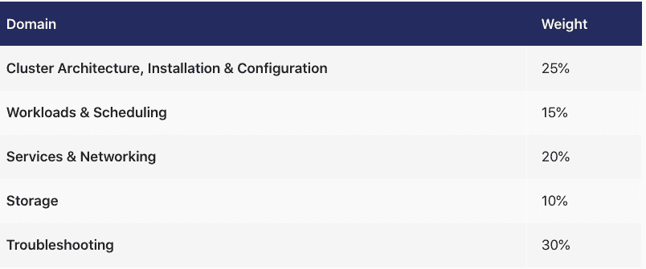
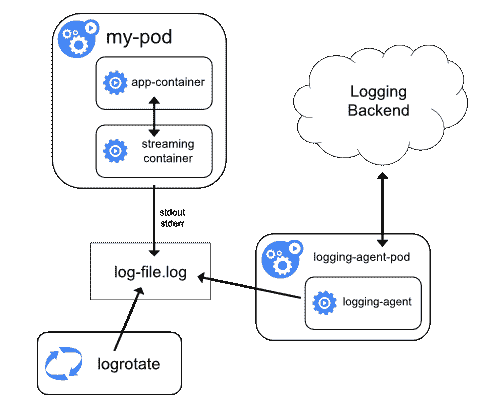
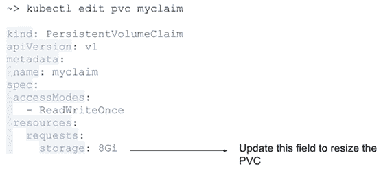

# 认证 Kubernetes 管理员学习指南-准备 CKA 考试

> 原文：<https://www.freecodecamp.org/news/certified-kubernetes-administrator-study-guide-cka/>

Kubernetes 是一个容器编排平台，帮助您大规模管理容器。

我最近通过了认证 Kubernetes 管理员考试，我想与您分享我的学习经验和资源。

## 你应该获得 Kubernetes 认证吗？

科技行业对认证的重要性有不同的看法。有些人认为你拥有的证书并不重要——这都是关于你的现实世界知识。

但不是每个人都有机会参与现实世界的项目。和认证问题都是基于真实场景的。因此，如果你没有机会在实践中与 Kubernetes 一起工作，你可以从这个考试中学习，并将你的知识应用到实际项目中。

另一方面，如果你已经在使用 Kubernetes，参加考试是测试你的知识和学习更多关于它的内部工作的绝好机会。

例如，你可能已经和 AWS 一起工作了一段时间，但是你没有接触过 AWS 成本核算，或者没有遵循最佳实践。该认证涵盖 Kubernetes 的各个方面，因此您将了解如何降低成本或遵循最佳实践。

在本学习指南中，我不会详细解释 Kubernetes 架构或 Kubernetes 对象(Pods、部署、服务、配置、秘密等等)。如果你想深入了解这些话题，这里有一些有用的 Kubernetes 学习资源:

*   [3 小时学会 Kubernetes](https://www.freecodecamp.org/news/learn-kubernetes-in-under-3-hours-a-detailed-guide-to-orchestrating-containers-114ff420e882/)
*   [【立方手册】](https://www.freecodecamp.org/news/the-kubernetes-handbook/)

## 什么是认证库伯纳斯管理员？

CKA 是云本地计算基金会(CNCF)的产品。它启动了与 Linux 基金会的认证合作。CNCFcf 提供的其他认证包括:

*   Kubernetes 和 Cloud Native Associate(朝鲜中央通讯社)
*   认证 Kubernetes 应用程序开发人员(CKAD)
*   认证 Kubernetes 安全专家(CKS)

根据 CNCF 基金会的说法，

> “认证 Kubernetes 管理员(CKA)项目的目的是保证 cka 拥有履行 Kubernetes 管理员职责的技能、知识和能力。”

我们将在本学习指南中介绍以下内容:

*   考试详情
*   考试技巧
*   考试模块
*   集群架构、安装和配置
*   工作量和日程安排
*   服务和网络
*   储存；储备
*   解决纷争

好吧，我们开始吧。

## 认证 Kubernetes 管理员考试详情

这里有一些帮助你开始准备和计划考试的信息。

首先，请记住这是一个在线监考考试，这意味着你可以在家里或办公室参加考试。没有考试中心。

考试费为 375 美元，但 Linux 基金会不时会提供折扣券。保持[观察这个空间](https://training.linuxfoundation.org/promo-inactive/)来找到他们。

CKA 考试是一个基于问题的考试，你可以通过命令行或者写宣言文件来解决这些问题。

这是一个 2 小时的考试，你需要解决 17 个问题。及格分数是 66%。每个问题会有不同的权重，比如 4%、5%、7%、13%等等。

有些问题会有两个部分。如果你只是答对了第一部分，正确部分的分数仍然会加到你的分数中。

CKA 考试是开卷考试。您可以访问以下资源:

*   [https://kubernetes.io/docs/](https://kubernetes.io/docs/)
*   [https://github.com/kubernetes](https://github.com/kubernetes)
*   [https://kubernetes.io/blog/](https://kubernetes.io/blog/)

如果你第一次没有通过，你可以重考一次。

CKA 认证的有效期为三年。

## 认证 Kubernetes 管理员考试提示

为了让你开始，这里有一个方便的 kubectl 小抄，你可以在考试中使用。

您可以为它创建一个别名，这样就不需要键入完整的命令。例如，如果您创建一个类似“alias k=kubectl”的别名，您可以键入“k”而不是“kubectl”。

在考试期间，避免使用 YAML 文件创建 Kubernetes 资源，因为这需要太多时间。相反，使用命令式命令来创建资源。

例如，要创建 pod，请使用以下命令:

```
kubectl run nginx --image=nginx 
```

如果您仍然希望使用 YAML 文件创建资源，请使用模拟运行=客户端。

确保你学习了 curl 和 systemctl 的基础，因为它们会在考试中出现。

最后，大约有 6 或 8 个不同的考试组。确保在解决问题之前切换上下文。上下文切换命令将在每个问题开始时提供。

## 认证 Kubernetes 管理员考试模块

考试分为五个模块:

*   集群架构、安装和配置
*   工作量和日程安排
*   服务和网络
*   储存；储备
*   解决纷争



我们将更详细地了解它们，并在此过程中涵盖一些其他重要的相关信息。

### 被动语态和陈述句

你需要知道命令式和声明式语句的区别，这样你才能决定何时使用它们。

强制性地部署 Kubernetes 资源意味着运行 kubectl 命令，例如，`kubectl run nginx --image=nginx`。声明式部署意味着使用 YAML 编写清单，例如`kubectl apply -f https://k8s.io/examples/pods/pod-nginx-required-affinity.yaml`。

使用命令式方法部署资源有助于考试并节省您的时间。

### 集群架构、安装和配置模块

你可以预期考试中 25%的问题来自这一部分。如果你想在这一部分取得好成绩，一定要彻底复习这些主题。

本模块主要关注身份验证、升级集群版本、备份 Kubernetes 数据以及使用 kubeadm 设置集群。

### 基于角色的访问控制(RBAC)

理解基于角色的访问控制(RBAC)至关重要。RBAC 根据个人的角色限制对计算机或网络的访问。角色包括定义谁可以在 Kubernetes 集群中做什么的策略或规则。

这里有一个关于 [ClusterRole 和 CluserRole 绑定](https://kubernetes.io/docs/reference/access-authn-authz/rbac/)的相关部分，您可以查看一下。

问题示例如下:

> 在开发命名空间中创建一个名为“sa”的新服务帐户。创建一个名为“pod-reader”的集群角色，拥有获取 pod 和列出 pod 的权限。“sa”应该能够获得 pod 和列表 pod。

那么你会如何处理这样的问题呢？

首先，您需要创建一个名为“development”的名称空间，并在开发工作区中创建一个名为“sa”的服务:

```
kubectl create namespace development
kubecrl create serviceaccount sa -n development
kubectl create clusterrole pod-reader --verb=get,list,watch --resource=pods
kubectl create clusterrolebinding pod-reader --clusterrole=pod-reader --serviceaccount=development:sa 
```

您可以使用以下命令测试是否允许 sa 读取 pod:

```
kubectl auth can-i list pods --development target --as system:serviceaccount:development:sa 
```

#### 如何使用 kubeadm 安装和配置 Kubernetes 集群

Kubeadm 自动安装和配置 Kubernetes 组件，如控制管理中心、API 服务器和 KubeDNS。

如果你有时间，我强烈推荐使用 Kelsey Hightower 设计的 [Kubernetes 艰难指南](https://github.com/kelseyhightower/kubernetes-the-hard-way)构建一个 Kubernetes 集群。

如果您没有时间浏览完整的指南，从考试的角度来看，只需学习认证位置和 Kubernetes 配置路径。

#### 如何升级您的 Kubernetes 集群版本

你很可能会遇到这个问题，因为考试大纲中特别提到了这个问题。

以下是将集群版本从 1.22.21 升级到 1.22.22 的步骤。你也可能被要求升级 Kubelet 和 Kube 代理版本。

*   检查 cluster、kubeadm 和 kubelet 的当前版本:

```
kubectl get nodes -o wide
kubeadm version
kubectl version 
```

*   首先升级控制平面节点:

```
apt-get update && apt-get install -y kubeadm=1.2.22-00 
```

*   验证升级计划。使用以下命令查看集群是否可以升级:

```
kubeadm upgrade plan 
```

*   应用升级版本:

```
sudo kubeadm upgrade apply v1.22.0 
```

一旦命令完成，您应该能够看到“升级/成功成功！您的集群已升级到“v1.22.0”。好好享受！”

*   通过将节点标记为不可调度并清除工作负载，为维护节点做好准备:

```
kubectl drain node01 --ignore-daemonsets 
```

*   接下来升级 kubelet 和 kubectl:

```
apt-get update && apt-get install -y kubelet=1.22.0-00 kubectl=1.22.0-00 
```

*   最后，重新启动 kubelet 并检查所需的版本是否已升级:

```
sudo systemctl daemon-reload
sudo systemctl restart kubelet
kubectl get nodes -o wide
kubeadm version
kubectl version 
```

*   通过将节点标记为可调度，使其重新联机:

```
kubectl uncordon node01 
```

#### 如何备份和恢复 ETCD 集群

ETCD 是一个一致的分布式键值存储，它提供了一种可靠的方式来存储分布式系统或机器集群需要访问的数据。

Kubernetes 使用 etcd 来保存所有的配置和数据。你可以把它想象成一个 Kubernetes 的数据库。当您运行“kubectl get pods”时，会从 etcd 中获取结果。考试中提供了认证名称和路径

*   登录到主节点，运行以下命令来备份 etcd:

```
etcdctl snapshot save /tmp/etcd-backup.db  --cacert /etc/kubernetes/pki/etcd/ca.crt --cert /etc/kubernetes/pki/etcd/server.crt --key /etc/kubernetes/pki/etcd/server.key 
```

*   测试您的备份文件:

```
ETCDCTL_API=3 etcdctl --write-out=table snapshot status snapshotdb 
```

*   从备份文件恢复 etcd:

```
ETCDCTL_API=3 etcdctl snapshot restore tmp/etcd-backup.db  --data-dir /var/lib/etcd-backup --cacert /etc/kubernetes/pki/etcd/ca.crt --cert /etc/kubernetes/pki/etcd/server.crt --key /etc/kubernetes/pki/etcd/server.key 
```

### 工作负载和调度模块

在本节中，您将会遇到关于部署 Kubernetes 应用程序、创建 daemonsets、扩展应用程序、配置健康检查、多容器 pod 以及在 pod 中使用配置映射和机密的问题。

**如何部署应用程序并使用服务公开应用程序**

部署应用程序和创建服务的示例问题可能如下所示:

> 创建如下部署:
> Name: nginx
> 通过使用 CluserIP
> 的服务 nginx 公开确保服务& pod 在集群中是可访问的

*   用于创建部署的声明文件:

```
apiVersion: apps/v1
kind: Deployment
metadata:
  name: nginx-deployment
  labels:
    app: nginx
spec:
  replicas: 3
  selector:
    matchLabels:
      app: nginx
  template:
    metadata:
      labels:
        app: nginx
    spec:
      containers:
      - name: nginx
        image: nginx:1.14.2
        ports:
        - containerPort: 80 
```

运行 kubectl get deployments 来检查是否创建了部署。如果部署成功,“就绪”应显示 3/3。就绪显示有多少应用程序副本可供您的用户使用。

如果您需要在集群外部或集群内部公开您的应用程序，您需要创建一个服务。根据您的需要，有不同的选项可用于公开您的应用程序。

*   ClusterIP:公开集群中的应用程序。例如将数据库暴露给后端应用程序。
*   NodePort:使用节点 ip 公开集群外部的应用程序。例如向外界公开你的前端应用程序。
*   负载平衡器:使用负载平衡器将应用程序暴露在集群之外。

使用 ClusterIP(在集群内)公开应用程序的例子怎么样？您可以使用下面的声明文件创建服务:

```
apiVersion: v1
kind: Service
metadata:
  name: nginx-service
spec:
  selector:
    app: nginx
  type: ClusterIP
  ports:
  - protocol: TCP
    port: 80
    targetPort: 8080 
```

可以使用“kubectl get service”来查看服务的 IP 地址。

这里有一个使用 NodePort(在集群之外)公开应用程序的例子。您可以使用下面的声明文件创建服务:

```
apiVersion: v1
kind: Service
metadata:
  name: nginx-service
spec:
  selector:
    app: nginx
  type: NodePort
  ports:
  - protocol: TCP
    port: 80
    targetPort: 8080 
```

您可以使用“kubectl get service”来查看节点的 IP 地址。

另一个示例问题将是这样的:

> 将 pod 安排在标记为 distype=ssd 的节点上

在这里，您可以像这样使用节点选择器:

```
apiVersion: v1
kind: Pod
metadata:
  name: nginx
  labels:
    env: test
spec:
  containers:
  - name: nginx
    image: nginx
  nodeSelector:
    disktype: ssd 
```

#### 如何扩展和更新部署

如果需要在创建部署后对其进行缩放，可以使用下面的命令。

```
kubectl scale deployment/nginx-deployment --replicas=6 
```

您可以使用以下命令更新现有部署的映像:

```
kubectl set image deployment/nginx-deployment nginx=nginx:1.8 
```

#### 如何为您的应用程序配置健康检查

部署应用程序后，您需要确保应用程序成功运行。如果应用程序崩溃，您需要知道如何终止容器并引入新的容器。

健康检查有助于实现这个用例。您可以执行三种不同类型的健康检查:

*   准备就绪探测:Kubernates 使用准备就绪探测来知道容器何时准备好开始接受流量。
*   活跃度探测:Kubernates 使用活跃度探测来检查何时重启容器。一旦应用程序成功部署，如果它在部署过程中崩溃，活动探测器将检测并重启应用程序。
*   启动探测器:Kubernates 使用启动探测器来了解容器应用程序何时启动。

配置活跃度探测器的示例:

```
kubectl apply -f https://k8s.io/examples/pods/probe/exec-liveness.yaml 
```

配置 readines 探头的示例:

```
apiVersion: v1
kind: Pod
metadata:
  labels:
    test: liveness
  name: liveness-exec
spec:
  containers:
  - name: liveness
    image: k8s.gcr.io/busybox
    args:
    - /bin/sh
    - -c
    - touch /tmp/healthy; sleep 30; rm -rf /tmp/healthy; sleep 600
    livenessProbe:
      exec:
        command:
        - cat
        - /tmp/healthy
      initialDelaySeconds: 5
      periodSeconds: 5 
```

#### 多集装箱箱/边车集装箱

多容器 pod 的主要目的是支持主程序的协同定位助手容器。

容器化应用程序的标准日志记录方法是写入标准输出和标准错误流。

可能有这样的用例，在容器崩溃后，您也需要访问这些日志。例如，为 web 页面服务而设计的 NGINX 不适合将日志传送到集中式日志解决方案。

你可以设置一个专门从事原木运输的边车集装箱。sidecar 容器被设计为一个日志代理，它被配置为从应用程序容器中获取日志。



关于这个主题的示例问题将是这样的:

> 使用主容器 NGINX 创建一个 Pod，它将日志输出到共享卷，并配置 sidecar 容器来传输这些日志。验证两个容器都在运行。

```
apiVersion: v1
kind: Pod
metadata:
  name: nginx-server
spec:
  volumes:
    - name: shared-logs
      emptyDir: {}

  containers:
    - name: nginx
      image: nginx
      volumeMounts:
        - name: shared-logs
          mountPath: /var/log/nginx

    - name: sidecar-container
      image: busybox
      command: ["sh","-c","while true; do cat /var/log/nginx/access.log /var/log/nginx/error.log; sleep 30; done"]
      volumeMounts:
        - name: shared-logs
          mountPath: /var/log/nginx 
```

#### 如何配置 pod 以使用配置图

ConfigMaps 以键值格式存储数据。ConfigMaps 的一个可能的用例是将应用程序代码和配置分开。

配置图设计用于存储非机密数据，如环境变量或游戏或应用程序的属性。如果您想存储敏感数据，请使用机密。

配置映射有助于为每个环境(开发、试运行、生产)创建单独的配置文件。

您可以从文件、目录和文字值创建配置映射。pod 可以将配置图作为环境变量、命令行参数或卷中的配置文件来使用。

问题示例如下:

> 创建一个名为 cfg-data 的配置映射，值为 var1=val1，var2=val2，并创建一个带有卷 config-volume 的 busybox pod，它从这个配置映射 cfg-volume 中读取数据，并将其放在路径
> /etc/cfg 中

```
kubectl create configmap cfg-data --from-literal=key1=val1 --from-literal=key2=val2 --from-literal=key3=val3
kubectl create -f https://github.com/nitheesh86/cka/blob/main/deployments-services/configmap.yml 
```

#### 如何配置 pod 以使用密码

Kubernetes 中的秘密可以用来存储敏感数据，如密码和令牌。机密类似于配置映射，但专门用于保存敏感数据。Pods 可以将机密用作环境变量或卷中的文件。

*   关于秘密的示例问题将是这样的:

> 在命名空间数据库中创建一个名为“db-secret”的秘密。密码应该包含 db_user=root 和 pass=1234。将它作为一个环境变量挂载到名为“mysql-db”的 pod 中。

```
kubectl create namespace database
kubectl -n secret create secret generic db-secret --from-literal=username=db_user --from-literal=db_pass=1234 -n database 
```

```
https://github.com/nitheesh86/cka/blob/main/deployments-services/mysql-secret.yml 
```

### 服务和网络模块

在本节中，您将获得有关创建网络策略、创建入口控制器以及通过服务公开应用程序的问题(已在上文中介绍)

#### 如何创建网络策略

在 Kubernetes 中，默认情况下，允许所有 pod 之间的通信。如果您需要隔离 pod，您需要应用网络策略。

关于网络策略的示例问题如下:

仅允许来自生产命名空间的流量:

```
kind: NetworkPolicy
apiVersion: networking.k8s.io/v1
metadata:
  name: allow-traffic-from-namespace
spec:
  podSelector:
    matchLabels:
  ingress:
  - from:
    - namespaceSelector:
        matchLabels:
          purpose: production 
```

此策略将允许流量从生产命名空间流向所有 pod。

#### 如何创建入口资源

入口控制器是一种负载平衡器。它接受来自集群外部的流量，并将余额加载到 pod。我们还可以配置像重定向这样的规则。


*   如何使用 NGINX 入口控制器创建入口:

```
apiVersion: networking.k8s.io/v1
kind: Ingress
metadata:
  name: nginx-ngress
  annotations:
    nginx.ingress.kubernetes.io/rewrite-target: /
spec:
  rules:
  - http:
      paths:
      - path: /example
        pathType: Prefix
        backend:
          service:
            name: nginx-service
            port:
              number: 80 
```

### 存储体

本节将介绍如何创建持久性卷、持久性卷声明以及如何装载到 pod 中。多研究一下持久性和持久性量是有帮助的。

PersistentVolume (PV)是群集中由存储管理员提供的存储，或者是使用 AWSElasticBlockStore、AzureDisk 等存储类动态提供的存储。

PersistentVolumeClaim (PVC)是用户或 Pod 的存储请求。

问题示例如下:

> 创建一个 NGINX Pod 并将 index.html 装载为持久卷。

*   ssh 进入节点，创建一个/mnt/data 目录，然后创建一个 index.html 文件:

```
sudo mkdir /mnt/data
sudo sh -c "echo 'Hello from Kubernetes storage' > /mnt/data/index.htm 
```

*   创建持久卷和持久卷声明:

```
apiVersion: v1
kind: PersistentVolume
metadata:
  name: task-pv-volume
  labels:
    type: local
spec:
  storageClassName: manual
  capacity:
    storage: 10Gi
  accessModes:
    - ReadWriteOnce
  hostPath:
    path: "/mnt/data" 
```

```
apiVersion: v1
kind: PersistentVolumeClaim
metadata:
  name: task-pv-claim
spec:
  storageClassName: manual
  accessModes:
    - ReadWriteOnce
  resources:
    requests:
      storage: 3Gi 
```

*   现在，配置窗格使用 PersistentVolume 声明

```
apiVersion: v1
kind: Pod
metadata:
  name: task-pv-pod
spec:
  volumes:
    - name: task-pv-storage
      persistentVolumeClaim:
        claimName: task-pv-claim
  containers:
    - name: task-pv-container
      image: nginx
      ports:
        - containerPort: 80
          name: "http-server"
      volumeMounts:
        - mountPath: "/usr/share/nginx/html"
          name: task-pv-storage 
```

此外，在考试中，你可能会被要求扩大持久性卷。一些存储类支持调整卷的大小—例如，AWS-EBS、GCE-PD、Azure Disk、Azure File、Glusterfs。

如果存储类未启用，则需要将其设置为“allowVolumeExpansion: true”

用“kubectl get storage classes”获取想要扩展的存储类名。然后编辑 YAML 文件。

```
apiVersion: storage.k8s.io/v1
kind: StorageClass
metadata:
  name: standard
parameters:
  type: pd-standard
provisioner: kubernetes.io/gce-pd
allowVolumeExpansion: true
reclaimPolicy: Delete 
```

*   然后编辑 PVC 以请求更多空间:

```
kubectl edit pvc myclaim and update request parameter 
```



*   PVC 更新后，您需要更换 pod 以使更改生效。您可以通过“kubectl get pvc”来检查新尺寸。我的主张”。

### 故障排除模块

这部分占考试的 30%。您可能会遇到如何排除节点故障的问题。

问题示例如下:

> 群集中的一个工作节点未处于就绪状态。对节点进行故障排除，并使其联机。

要对工作节点进行故障排除，您需要知道哪些组件正在运行。工作者节点由 kubelet 和 kube-proxy 组成。通常，这些服务中的一个会有问题。

首先，检查服务是否正在运行，并尝试重新启动。如果重新启动服务不起作用，请检查日志。

*   var/log/kubelet.log - Kubelet，负责在节点上运行容器
*   /var/log/kube-proxy.log - Kube 代理，负责服务负载平衡

您可以参考以下链接，获取详细的故障排除指南:

[https://kubernetes . io/docs/tasks/debug-application-cluster/debug-cluster/](https://kubernetes.io/docs/tasks/debug-application-cluster/debug-cluster/)

## 如何在考试中验证你的答案

核实你对考试问题的回答是非常重要的。以下是验证你的答案的方法:

### 检查你的豆荚

创建 pod 后，使用命令`kubectl get pod nginx`确保它处于就绪状态。

如果您的 pod 未处于就绪状态，请运行`kubectl desribe pod nginx`查看事件。您还可以通过运行`kubectllogs nginx`来检查 pod 日志。

### 检查部署状态

一旦创建了部署，您就可以通过运行`kubectl get deployments nginx-deployment`来获得部署状态。

如果您的部署处于待定状态，您可以通过运行`kubectl deployment deployment nginx-deployment`来查看事件。

### 验证服务

您可以通过启动带有图像“busybox”的 helper pods 来验证您的服务端点正在工作。

您可以使用命令`kubectl exec --stdin --tty busybox -- /bin/bash`ssh 到 helper pod，然后查询端点 curl [http://ipaddress/](http://ipaddress/) 。

您可以通过运行`kubectl get svc my-service`来获得服务端点。[这里有一个参考](https://kubernetes.io/docs/tasks/debug-application-cluster/get-shell-running-container/)，在这里你可以学习更多关于登录容器的知识。

## 就是这样！

祝你考试学习顺利！希望这个指南能帮助你准备和通过。

这些是我用来研究和撰写本文的主要来源和参考资料:

*   [https://kubrintes . io/](https://kubernetes.io/)
*   [https://www.cncf.io/](https://www.cncf.io/)
*   [https://github.com/ahmetb/kubernetes-network-policy-recipes](https://github.com/ahmetb/kubernetes-network-policy-recipes)
*   [https://www . kata coda . com/courses/kubricks](https://www.katacoda.com/courses/kubernetes)
*   [https://jen ciso . github . io/personal/manage-TLS-certificates-for-kubernetes-users](https://jenciso.github.io/personal/manage-tls-certificates-for-kubernetes-users)

谢谢你的阅读，祝你学习愉快。