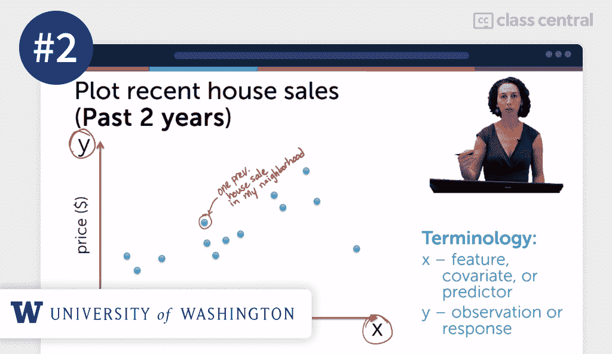
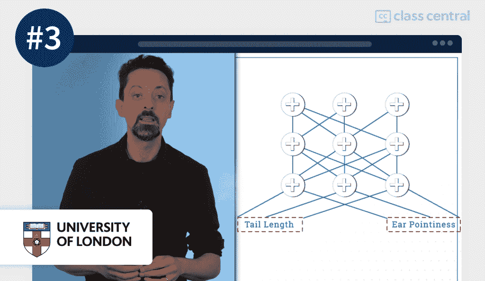
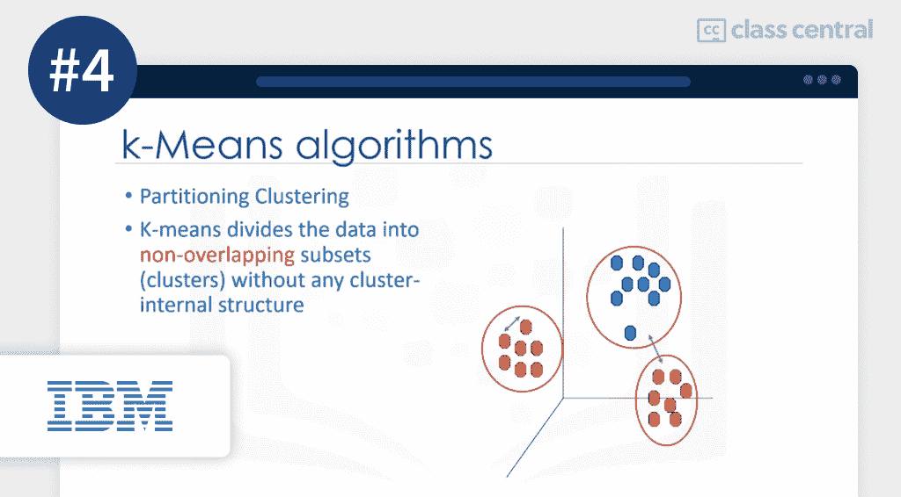
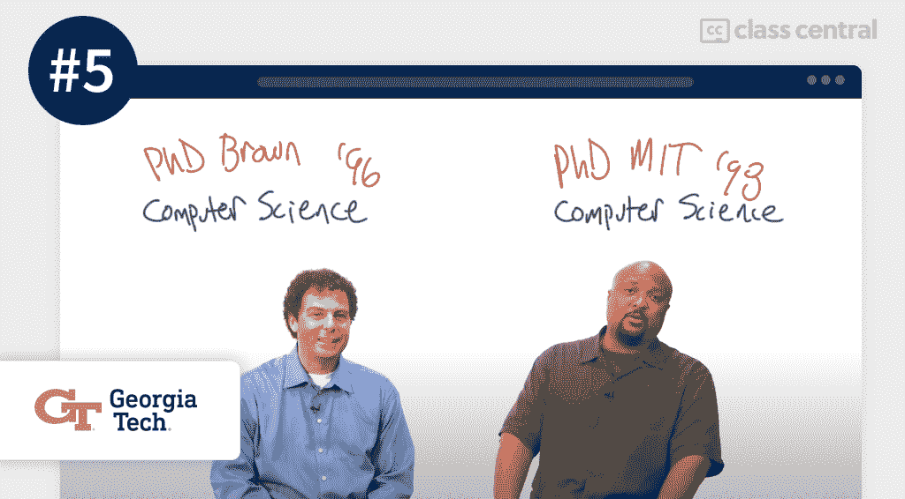
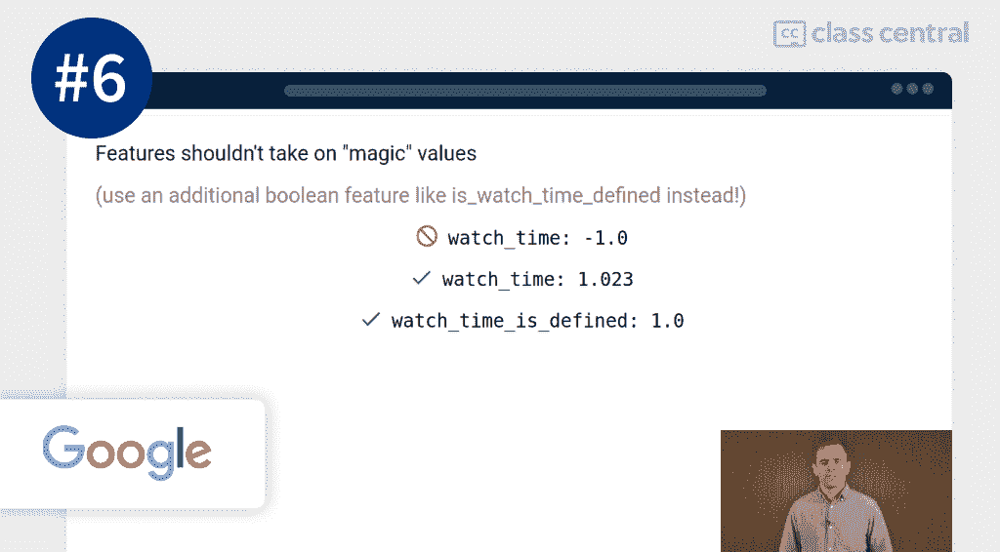
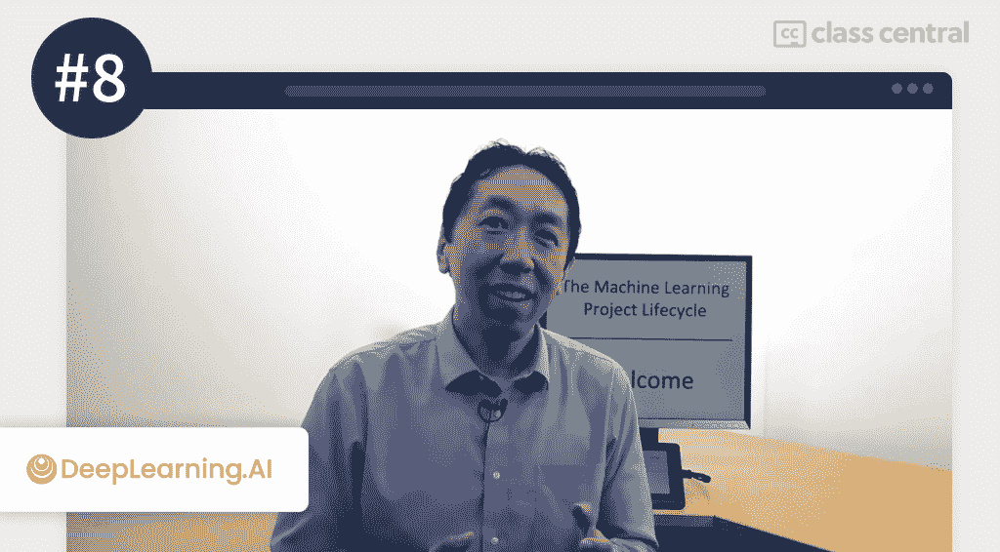
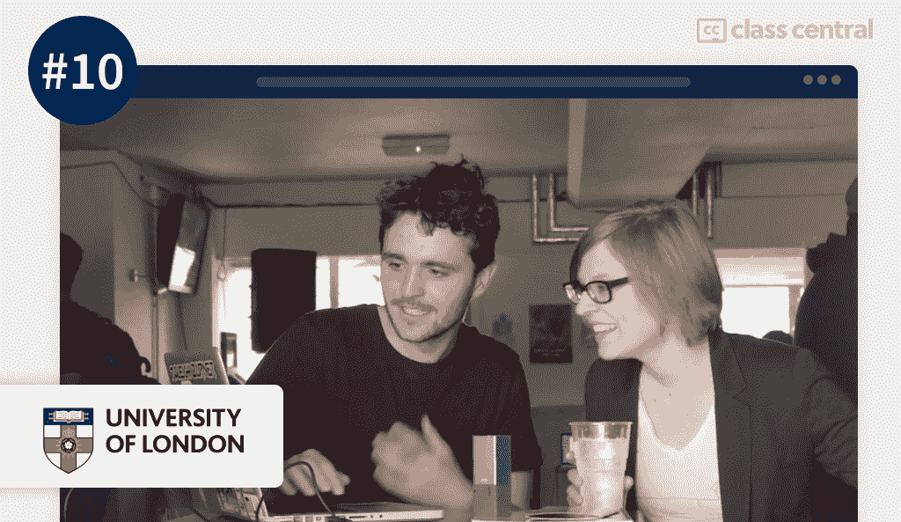

# 2022 年要学的 10 门最佳机器学习课程

> 原文：<https://www.freecodecamp.org/news/best-machine-learning-courses/>

在这篇文章中，我整理了一份网上最好的机器学习课程列表。我按照一个明确的方法建立了这个排名，你可以在下面找到这个方法。

但是如果你想直接得到结果，这里是我的选择:

1.  [机器学习(斯坦福大学)](#1-machine-learning-stanford-university-)
2.  [机器学习基础:案例研究方法(华盛顿大学)](#2-machine-learning-foundations-a-case-study-approach-university-of-washington-)
3.  [全民机器学习(伦敦大学)](#3-machine-learning-for-all-university-of-london-)
4.  [用 Python 进行机器学习(IBM)](#4-machine-learning-with-python-ibm-)
5.  [机器学习(佐治亚理工学院)](#5-machine-learning-georgia-tech-)
6.  [采用 TensorFlow APIs(谷歌)的机器学习速成班](#6-machine-learning-crash-course-with-tensorflow-apis-google-)
7.  [机器学习 A-Z:动手 Python&R In Data Science(Udemy)](#7-machine-learning-a-z-hands-on-python-r-in-data-science)
8.  [生产中的机器学习介绍(DeepLearning。AI)](#8-introduction-to-machine-learning-in-production-deeplearning-ai-)
9.  [用于数据科学和机器学习的 Python 训练营(Udemy)](#9-python-for-data-science-and-machine-learning-bootcamp)
10.  [音乐家和艺术家的机器学习(戈德史密斯)](#10-machine-learning-for-musicians-and-artists-goldsmith-)

## 什么是机器学习？

[机器学习](https://en.wikipedia.org/wiki/Machine_learning)是人工智能的一个子领域，致力于设计能够从数据中学习的算法。它有许多应用，包括商业分析、健康信息学、金融预测和无人驾驶汽车。

2022 年，机器学习技能被广泛需求。在[微软的职业页面](https://careers.microsoft.com/us/en/)上，目前开放的开发者职位中有 21%提到了“机器学习”。在[亚马逊的职业页面](https://www.amazon.jobs/en/job_categories/software-development)，这个数字是 63%。

根据世界经济论坛发布的[未来工作报告](https://www3.weforum.org/docs/WEF_Future_of_Jobs_2020.pdf)，预计到 2025 年，机器学习将成为世界上最受欢迎的技能之一。

## 课程排名方法

为了创建这个排名，我遵循了三个步骤:

**首先是**，我是[课程中心](https://www.classcentral.com/)的开发人员，这是领先的在线课程搜索引擎。

所以我浏览了一下我们 5 万多门课程的目录，做了一个初步选择。我这样做是考虑了评论、评级、注册、书签等因素。

所以这是一个相当客观的步骤:我通过查看定义明确的指标来缩小选择范围。

第二个，我用我作为在线学习者的经验来评估每一个初步选择。

课程评级等指标很少能说明全部情况。我已经完成了[多门 mooc](https://www.classcentral.com/@manoel)，获得了[计算机科学在线学士学位](https://www.classcentral.com/report/open-university-insiders-perspective/)，我还注册了佐治亚理工学院的计算机科学在线硕士学位([omsc](https://omscs.gatech.edu/))。这让我对在线课程有了一些看法，我用它来评估我的每一个初步选择。

所以这是一个相当主观的步骤:我梳理了我的选择，以达到接近最终的选择。

第三个，我扩展了这个选择，将我遇到的其他有价值的资源包括进来。

由于大多数主题都有历史悠久的课程，所以同一主题的更多近期课程可能会被忽略。但有时候，这些很棒。我确保尽可能包括这些。

所以这又是一个相当主观的步骤:我挑选了一些优秀但不太出名的课程。

最终结果是一个独特的课程选择，它结合了十年的课程中心数据和我自己作为在线学习者的经验，试图获得两个世界的最佳效果。到目前为止，我已经花了超过 15 个小时来建立这个列表，我会继续更新它。

## 课程排名统计

以下是关于该课程排名的一些统计数据:

*   这些课程的注册人数总计超过 660 万。
*   排名中最具代表性的课程提供商是 Coursera，共有四门课程。
*   加起来，这些课程在 Class Central 上被书签标记了超过 118，000 次，而[机器学习主题](https://www.classcentral.com/subject/machine-learning)本身被书签标记了超过 195，000 次。
*   排名中最受欢迎的课程本身就有超过 400 万人注册。
*   八门课程是免费或免审核的，两门是付费的。
*   这些课程在 Class Central 上总共收到了 500 多条评论。

事不宜迟，以下是我挑选的最佳机器学习在线课程。

## 1.[机器学习(斯坦福大学)](https://www.classcentral.com/course/machine-learning-835)

Prof. Andrew Ng, instructor of the course

我的第一个最佳机器学习在线课程是斯坦福大学在 Coursera 上提供的名为[机器学习](https://www.classcentral.com/course/machine-learning-835)的课程。

这是开创性的机器学习课程，的确是一门非常特别的课程。由[吴恩达](https://en.wikipedia.org/wiki/Andrew_Ng)教授，是拉开大规模开放在线课程(MOOCs)普及序幕的原创课程之一。

受到该课程成功的鼓舞，吴恩达继续参与创办 Coursera。

### 你会学到什么

这门课程从奠定机器学习的数学基础开始。它从线性代数和一元线性回归的回顾开始，然后移动到多元和逻辑回归。

然后每周从一个主题跳到另一个主题，涵盖各种各样的机器学习技术和模型。其中包括深度学习、支持向量机和主成分分析。

最后，它涉及到实际方面，如如何设计和利用大规模的机器学习项目。

在课程结束时，你将对机器学习、其概念和方法有一个广泛的理解。您将能够实现基本的机器学习算法，如反向传播和 k-means 聚类。

您将有能力处理多类分类和异常检测等任务。您将能够使用 Octave 和 Matlab，通过各种方法完成涉及光学字符识别的实际项目。

### 有一点需要注意

本课程使用 Octave，而不是 Python。这门课程将教你一些概念，而不是当今机器学习中最常用的工具。尽管如此，在我看来，它仍然是机器学习课程的首选，因此是它的首选。

但是，如果你正在寻找一门与机器学习从业者的日常生活更相关的课程，请查看下一个选择。

### 你将如何学习

这门课程分为 11 周。每周需要大约 6 个小时的工作。概念是通过结合视频讲座和阅读来教授的。

在评估方面，每周至少包括一次自动评分的测验。大多数包括几个。大多数星期包括几个小时的编程项目。总共有 8 个。

|  |  |
| --- | --- |
| **机构** | 斯坦福大学 |
| **供应商** | Coursera |
| **讲师** | 吴恩达 |
| **级别** | 混合的 |
| **工作量** | 总共 61 小时 |
| **报名人数** | 4.5 米 |
| **评级** | 4.9 / 5.0 (166K) |
| **证书** | 有报酬的 |

### 有趣的事实

*   该课程于 2011 年 10 月推出，仅在宣布后两个月就有超过 10 万名学员。一门课程有这么多学员，这是前所未有的。
*   该课程拥有 450 万名学习者，已经成为有史以来最受欢迎的在线课程之一，如果不是最受欢迎的话。
*   除了是斯坦福大学的计算机科学教授，吴恩达还是百度的前首席科学家和谷歌大脑的联合创始人。
*   该课程在 Class Central 上积累了超过 68，000 个书签。
*   虽然本课程包含付费证书，但所有课程材料，包括所有作业，都可以免费获取。
*   这门课程的迅速流行促使吴恩达创建了 Coursera，最近又创建了 DeepLearning.AI

如果您对此课程感兴趣，您可以在这里找到[更多关于该课程以及如何注册的信息](https://www.classcentral.com/course/machine-learning-835)。

## 2.[机器学习基础:案例研究方法(华盛顿大学)](https://www.classcentral.com/course/ml-foundations-4352)

Prof. Emily Fox, co-instructor of the course

我的第二个最佳机器学习在线课程是华盛顿大学在 Coursera 上提供的[机器学习基础:案例研究方法](https://www.classcentral.com/course/ml-foundations-4352)。

许多学术机器学习课程喜欢从一个相当抽象的角度来处理这个主题。他们花费大量时间奠定数学基础，并将该学科更具体的方面归结为例子和练习。这门课程完全颠覆了那个脚本。

顾名思义，该课程通过案例研究来处理机器学习，每个案例都有明确的背景和目标。这些案例研究有助于在现实中建立机器学习概念。

你将学习如何用回归来预测房价，而不是学习如何做回归。这并不意味着这门课程掩盖了理论细节。它只是更加务实地对待这个问题。

### 你会学到什么

该课程从机器学习的情境化开始:解释什么是机器学习，回顾它的一些应用，并证明它在未来的重要性。

课程介绍还花时间讲述 Python 基础知识以及 Jupyter 笔记本等工具的基础知识。

然后，课程从一个案例研究转移到另一个案例研究，使用每个案例来说明机器学习的一个特定方面:您使用回归来预测房价，您使用分类来评估用户评论中的情绪，您使用聚类来对相关文章进行分组，您使用深度学习来识别图像中的对象，等等。

如果你喜欢通过例子来学习，本课程中任务和概念之间的清晰映射可能有助于使这个主题更容易被你接受。

本课程结束时，您将了解基本的机器学习任务，如回归、分类和聚类，并且知道何时使用每种技术。

您将知道如何从数据中提取要素，并将其用作模型的输入。您将能够使用定义良好的误差度量来评估您的模型的正确性。你将能够用 Python 实现端到端的机器学习应用。

### 你将如何学习

这门课程分为 6 周。每周大约需要 3 个小时的工作。该课程通过短片和阅读材料的组合来教授。

关于评估，大多数周包括两个练习，大约需要一个小时完成。

### 有一点需要注意

当课程发布时，它使用了 GraphLab，这是一种开源的机器学习工具，由课程联合讲师之一 Carlos Guestrin 教授创办。从那以后，GraphLab 变成了 Turi，现在课程使用 [TuriCreate](https://github.com/apple/turicreate) 进行练习。

然而，这些视频仍然使用 GraphLab，尽管两种工具相似，但这给一些学习者造成了摩擦。所以，如果你选修了这门课，请做好谷歌搜索的准备。

|  |  |
| --- | --- |
| **机构** | 华盛顿大学 |
| **供应商** | Coursera |
| **教官** | 艾米丽·福克斯，卡洛斯·盖斯特林 |
| **级别** | 混合的 |
| **工作量** | 总共 18 小时 |
| **报名人数** | 351K |
| **评级** | 4.6 / 5.0 (12K) |
| **证书** | 有报酬的 |

### 有趣的事实

*   本课程是 Coursera 上四部分[机器学习专业](https://www.classcentral.com/course/machine-learning-18936)的第一部分。
*   艾米丽·福克斯(Emily Fox)在华盛顿大学担任教授时发布了该课程，此后她加入了斯坦福大学统计系。
*   你将在本课程中使用的软件背后的公司 Turi 是由课程联合讲师 Carlos Guestrin 创办的，该公司于 2016 年被苹果公司以 2 亿美元收购。

如果您对此课程感兴趣，您可以在这里找到更多关于该课程以及如何注册的[信息](https://www.classcentral.com/course/machine-learning-835)。

## 3.[全民机器学习(伦敦大学)](https://www.classcentral.com/course/uol-machine-learning-for-all-17124)

Prof. Marco Gillies, instructor of the course

我的第三个最佳机器学习在线课程是伦敦大学在 Coursera 上提供的[全民机器学习](https://www.classcentral.com/course/uol-machine-learning-for-all-17124)。

虽然大多数其他课程要么假设事先有编程知识，要么教你编程基础，但本课程旨在让更多人能够接触到机器学习。它不需要高深的数学知识，也不需要使用编程语言或像 Python 和 TensorFlow 这样的机器学习库。

### 你会学到什么

本课程首先解释什么是人工智能和机器学习，以及这些学科是如何联系在一起的。

它讨论了机器学习的各种现实应用，包括 [AlphaGo](https://en.wikipedia.org/wiki/AlphaGo) ，这是一个能够击败世界上最好的围棋选手的机器学习程序。它解释了数据表示，如何建立一个机器学习项目，以及机器学习的一些机会和伦理考虑。

最后，课程邀请你通过收集数据、训练模型并对其进行测试来实现一个机器学习项目。

课程结束时，你将对机器学习、其各种用途及其对未来的意义有一个大致的了解。

你将熟悉支撑机器学习的最重要的技术概念。您将对构建机器学习模型的过程有一个高层次的掌握，从数据收集到模型评估。

你将准备好应对更高级的机器学习理论课程。

### 你将如何学习

这门课程分为四周。每周需要大约 6 个小时的工作。本课程通过视频讲座和阅读材料的混合形式教授。

关于评估，在大多数周中，你将完成一个小时的签名测验，在一些周中，你还将完成额外的实践练习。

|  |  |
| --- | --- |
| **机构** | 伦敦大学 |
| **供应商** | Coursera |
| **讲师** | 马尔科·吉利斯 |
| **级别** | 新手 |
| **工作量** | 总共 22 小时 |
| **报名人数** | 107K |
| **评级** | 4.7 / 5.0 (2.7K) |
| **证书** | 有报酬的 |

### 有趣的事实

*   课程讲师 Marco Gillies 博士也是 Coursera 上提供的伦敦大学计算机科学在线学士学位课程的教师。
*   这门课程是排名中最平易近人的学术课程:这是一门真正的大学课程，但它被调整为适合广大受众。

如果您对此课程感兴趣，您可以在这里找到[更多关于该课程以及如何注册的信息](https://www.classcentral.com/course/uol-machine-learning-for-all-17124)。

## 4.[用 Python 进行机器学习(IBM)](https://www.classcentral.com/course/machine-learning-with-python-11714)

Explaining k-means clustering 

IBM 在 Coursera 上提供的这门课程通过使用 Python 的实践方法教授机器学习，Python 是当今人工智能事实上的编程语言。

当心，这门课会把数学扔给你。如果你的微积分生疏了，你可能想在选修这门课之前温习一下。

### 你会学到什么

该课程首先涵盖机器学习的基础知识和在医疗保健、银行和电信等领域的应用。它解释了监督学习和非监督学习之间的区别，并介绍了哪种类型的学习适合哪种类型的任务。

每周致力于一个广泛的机器学习任务——回归、聚类和分类——以及可用于实现它们的各种方法，如决策树、支持向量机和 k-means。

到课程结束时，你将会在机器学习的数学基础方面覆盖很多领域。您将熟悉机器学习在从医疗保健到高性能计算等领域的大量应用。

您将能够使用 Python 实现一系列机器学习算法。您将练习使用机器学习库，如 scikit-learn 和 SciPy。

### 你将如何学习

这门课程分为四周。每周需要大约 4 个小时的工作。这门课程主要是通过视频授课。

关于评估，每周都有 10 分钟的练习。

|  |  |
| --- | --- |
| **公司** | 国际商用机器公司 |
| **供应商** | Coursera |
| **教官** | 约瑟夫·桑塔·安杰洛·赛义德·阿加博佐吉 |
| **级别** | 中间的 |
| **工作量** | 总共 22 小时 |
| **报名人数** | 244K |
| **评级** | 4.7 / 5.0 (12K) |
| **证书** | 有报酬的 |

### 有趣的事实

*   课程的合作导师之一 Saeed Aghabozorgi 是一位多产的研究者，他引用了 3300 多篇关于谷歌学术的文章。
*   除了这门课程，IBM 还在 Coursera 上提供了一个包含六门课程的全面的[机器学习专业证书](https://www.classcentral.com/course/ibm-machine-learning-21685)。

如果您对此课程感兴趣，您可以在这里找到[更多关于该课程以及如何注册的信息](https://www.classcentral.com/course/machine-learning-with-python-11714)。

## 5.[机器学习(佐治亚理工学院)](https://www.classcentral.com/course/udacity-machine-learning-1020)

Prof. Michael Littman and Prof. Charles Isbell, co-instructors of the course

该课程由佐治亚理工学院在 Udacity 上提供，也是佐治亚理工学院计算机科学在线硕士([omsc](https://omscs.gatech.edu/))的一部分。

本课程广泛涵盖机器学习，强调广度胜于深度。它倾向于机器学习概念的高级方法，而不是钻研如何实现特定机器学习算法的本质细节。

我认为这门课程的主要优势在于它的教学方法。

该课程由两名教师授课，课程以他们之间的对话形式呈现，其中一名教师扮演学生的角色并提出问题。

交流充满了幽默，这不是许多机器学习课程可以说的。

### 你会学到什么

本课程分为三个广泛的机器学习任务。

首先，它涵盖了监督学习，讨论决策树，回归和分类，以及神经网络。然后，它涵盖了无监督学习，讨论聚类，特征选择和随机化优化。最后，它涵盖了强化学习，讨论马尔可夫决策过程，博弈论和决策。

本课程结束时，你将全面了解监督学习、非监督学习和强化学习，以及它们之间的区别。

您将学习针对这些问题量身定制的方法。您将能够实现解决它们的方法，解释这些方法的结果，并评估它们的正确性。

### 你将如何学习

本课程分为 21 节课，每节课都由视频短片和视频测验组成。

本课程不包括公开的项目。这些只有通过乔治亚理工学院选修该课程的学生才能获得。

|  |  |
| --- | --- |
| **机构** | 佐治亚理工学院 |
| **供应商** | Udacity |
| **教官** | 查尔斯·伊斯贝尔，迈克尔·利特曼 |
| **级别** | 中间的 |
| **工作量** | 总共 40 小时 |
| **证书** | 不 |

### 有趣的事实

*   课程导师查尔斯·伊斯贝尔(Charles Isbell)和迈克尔·利特曼(Michael Littman)录制了迈克尔·杰克逊(Michael Jackson)的惊悚片的机器学习版本。[很朗朗上口](https://www.youtube.com/watch?v=DQWI1kvmwRg)。
*   如果你喜欢本课程的对话式方法，这些讲师还有另一个类似的关于强化学习的课程。

如果您对此课程感兴趣，您可以在这里找到[更多关于该课程以及如何注册的信息](https://www.classcentral.com/course/udacity-machine-learning-1020)。

## 6.[采用 TensorFlow APIs(谷歌)的机器学习速成班](https://www.classcentral.com/course/independent-machine-learning-crash-course-with-tensorflow-apis-10503)

Dr. D. Sculley, co-instructor of the course

这个课程是 Google 在他们的开发者平台上提供的。虽然这个排名中的大多数课程本质上是学术性的，而且相当长，但这一门课程完全符合机器学习实践入门的类别。

它也很实用和灵活，虽然它会邀请一个完全的初学者完整地参加课程，但它会允许那些已经有机器学习经验的人将课程作为复习课程。这个想法从一开始就融入了课程设计。

### 你会学到什么

速成课程从问你关于[你在机器学习](https://developers.google.com/machine-learning/crash-course/prereqs-and-prework)方面的背景开始。根据你的回答，它会引导你找到合适的资源，这样你就可以充分利用你的时间。

假设你是一个完全的初学者，你将从头开始。因此，你的学习路径将涵盖基本的机器学习概念，包括回归，损失函数和梯度下降。

该课程使用了谷歌流行的机器学习库 TensorFlow。因此，通过利用库函数，底层细节将很快被抽象出来。

一些学习者可能会认为这是消极的，因为你可以不理解它是如何工作的。但如果你对快速应用机器学习感兴趣，这个速成课程应该正合你的胃口。

值得注意的是，该课程还介绍了神经网络，这是许多其他简短的机器学习课程宁愿跳过或几乎不触及的主题，因为这是一个值得单独开设课程的主题。

然而，谷歌的速成课程浓缩到足以轻松适应神经网络。但是请记住，它抽象了许多细节，所以如果你追求的是深刻的理解，你可能会更好地接受另一门课程。

### 你将如何学习

速成课程分为三大部分:(1)机器学习概念，(2)机器学习工程，(3)现实世界中的机器学习系统。

每个部分都由谷歌研究人员的视频讲座、阅读材料和自我评估测验组成。

|  |  |
| --- | --- |
| **供应商** | 谷歌 |
| **教官** | D.卡桑德拉·夏·史卡利 |
| **级别** | 新手 |
| **工作量** | 总共 15 个小时 |
| **证书** | 不 |

### 有趣的事实

*   速成班有一系列后续迷你课程，涵盖的主题包括[如何构建机器学习问题](https://developers.google.com/machine-learning/problem-framing)和[如何调试机器学习管道](https://developers.google.com/machine-learning/testing-debugging)。
*   D.课程讲师斯考利是谷歌大脑的工程总监，巧合的是，谷歌大脑是由排名第一的讲师吴恩达共同创建的。

如果您对此课程感兴趣，您可以在这里找到[更多关于该课程以及如何注册的信息](https://www.classcentral.com/course/independent-machine-learning-crash-course-with-tensorflow-apis-10503)。

## 7.[机器学习 A-Z:数据科学中的动手 Python&R](https://www.classcentral.com/course/udemy-machinelearning-23826)

Kirill Eremenko, co-instructor of the course

顾名思义，这个 Udemy 课程是对机器学习的全面而实用的介绍。它慢慢地从数据预处理到模型验证，但是掩盖了一些底层的数学。

如果你想直接进入“做”，这个课程可能是一个很好的选择。

### 你会学到什么

本课程首先介绍各种类型的回归、分类和聚类模型。它讨论了强化学习以及自然语言处理，并涵盖了人工神经网络的基础。

课程使用 Python 和 R 编程语言，以及 TensorFlow 机器学习库。

### 你将如何学习

该课程包括 40 多个小时的视频课程，并穿插实践练习。在使用专门的机器学习库来应用它们解决具体问题之前，您将为每个概念和方法建立一种直觉。

|  |  |
| --- | --- |
| **供应商** | 犹达 |
| **教官** | 哈德林·德庞特韦斯·基里尔·叶列缅科 |
| **级别** | 混合的 |
| **工作量** | 总共 44 小时 |
| **报名人数** | 843K |
| **评级** | 4.5 / 5.0 (154K) |
| **证书** | 有报酬的 |

### 有趣的事实

*   拥有超过 80 万注册学习者的 Machine Learning A-Z 是 Udemy 上最受欢迎的机器学习课程，也是整个平台上最成功的课程之一。
*   两位导师基里尔·叶列缅科和哈德琳·德·庞特维斯共同开设了 80 多门课程，拥有近 350 万名学生。

如果您对此课程感兴趣，您可以在这里找到[更多关于该课程以及如何注册的信息](https://www.classcentral.com/course/udemy-machinelearning-23826)。

## 8.[生产中的机器学习介绍(DeepLearning。AI)](https://www.classcentral.com/course/introduction-to-machine-learning-in-production-43546)

Prof. Andrew Ng, co-instructor of the course

在推出排名第一的机器学习课程并联合创立 Coursera 之后，吴恩达继续创建了另一家公司 DeepLearning.AI

该公司提供各种各样的机器学习和人工智能课程，包括这门课程，它涵盖了如何在生产环境中使用机器学习。

与之前主要面向普通受众(尽管不总是初学者)的课程不同，本课程面向已经对机器学习有扎实理解的学习者。它面向那些希望能够在专业环境中自信地实现端到端机器学习管道的学生。

### 你会学到什么

本课程首先讨论机器学习项目的生命周期，以及如何部署生产就绪的机器学习系统。

然后，本课程解释了选择合适的模型并训练它们的策略，以及在处理有偏差的数据集时要避免的一些陷阱。

最后，本课程将介绍如何处理分类问题，以及如何建立基线来评估模型的性能。

### 你将如何学习

这门课程分为三周。每周大约需要 3 个小时的工作。但是记住，这是一门高级课程，所以它假设你已经有了机器学习的背景。否则，工作量可能会高得多。

和吴恩达的其他课程一样，这门课程包括视频课程和阅读材料。每周结束时都有一些使用 Python 和专业框架和库(如 PyTorch 和 Keras)的实践练习。

|  |  |
| --- | --- |
| **公司** | DeepLearning.AI |
| **供应商** | Coursera |
| **讲师** | 吴恩达 |
| **级别** | 混合的 |
| **工作量** | 总共 10 个小时 |
| **报名人数** | 38K |
| **评级** | 4.8 / 5.0 (1.1K) |
| **证书** | 有报酬的 |

### 有趣的事实

*   这门课程是四门课程的 Coursera [专业化课程中的第一门，致力于 MLOps](https://www.classcentral.com/course/machine-learning-engineering-for-production-mlops-43683) ，面向生产的机器学习工程。
*   深度学习。人工智能在 Coursera 上提供许多课程，从[人工智能基础](https://www.classcentral.com/course/ai-for-everyone-12502)到专门的深度学习主题，如[生成对抗网络](https://www.classcentral.com/course/generative-adversarial-networks-gans-21822)。

如果您对此课程感兴趣，您可以在这里找到[更多关于该课程以及如何注册的信息](https://www.classcentral.com/course/introduction-to-machine-learning-in-production-43546)。

## 9.[用于数据科学和机器学习的 Python 训练营](https://www.classcentral.com/course/udemy-python-for-data-science-and-machine-learnin-23341)

Jose Portilla, instructor of the course

Python 作为机器学习和 AI 事实上的语言(至少目前如此)，往往是机器学习课程的前提。

一些课程在进入真正的机器学习之前先从 Python 复习开始。但是如果你是一个编程新手，简单的复习可能不够。

所以你要么先找一门 Python 课程，要么找一门既教机器学习又教 Python 的课程。这是那道菜。

### 你会学到什么

在课程的第一部分，在设置好开发环境之后，您将进入 Python 速成班。您将学习编程语言的基础以及大量广泛使用的库，如 NumPy、Pandas 和 Matplotlib。

一旦你整合了这些技能，你就可以处理课程的第二部分，这完全是机器学习。

像往常一样，您将从回归开始，并从那里开始，探索从 k-means 聚类到人工神经网络的机器学习模型和系统。

### 你将如何学习

本课程包括超过 25 小时的视频课程，并穿插实践练习。此外，本课程包括许多外部资料的参考资料，供那些想要超越的人参考。

|  |  |
| --- | --- |
| **供应商** | 犹达 |
| **讲师** | 何塞·波尔蒂利亚 |
| **级别** | 混合的 |
| **工作量** | 总共 25 小时 |
| **报名人数** | 509K |
| **评级** | 4.7/5.0(109 千字节) |
| **证书** | 有报酬的 |

### 有趣的事实

*   Udemy 上有超过 260 万名学生，课程导师何塞·波尔蒂利亚是 Udemy 最受欢迎的导师之一。
*   虽然这门课程涵盖了 Python 和机器学习，但如果你想更深入地研究其中的任何一门学科，何塞·波尔蒂利亚还教授专门针对 Python 的课程[和专门针对机器学习的课程](https://www.classcentral.com/course/udemy-complete-python-bootcamp-23623)。

如果您对此课程感兴趣，您可以在这里找到[更多关于该课程以及如何注册的信息](https://www.classcentral.com/course/udemy-python-for-data-science-and-machine-learnin-23341)。

## 10.[音乐家和艺术家的机器学习(戈德史密斯)](https://www.classcentral.com/course/kadenze-machine-learning-for-musicians-and-artists-3768)

Dr. Rebecca Fiebrink, instructor of the course

最后，以高调结束这个排名，我的第十个选择是[面向音乐家和艺术家的机器学习](https://www.classcentral.com/course/kadenze-machine-learning-for-musicians-and-artists-3768)，由伦敦大学的戈德史密斯通过 Kadenze 提供。

这门课程有点非传统:它从艺术的角度来看待机器学习，从音乐到视觉艺术。如果这真的是你想要的那种组合，那么就把它作为我们唯一的首选吧。

### 你会学到什么

在本课程中，您将学习机器学习的基础知识，但您将通过将主题与艺术、运动和声音联系起来来完成。更具体地说，您将学习如何使用机器学习来解释人类运动、音乐和其他实时数据源。

不要担心，本课程还将需要学习更普通但基本的机器学习概念，如回归、分类和分割。它还解决了一些实际的概念，比如如何配置一个端到端的机器学习管道。

### 你将如何学习

本课程分为 7 节课。每节课需要大约 8 个小时的工作。

如果你旁听了课程，你将可以免费使用课程材料，但不能使用作业。如果你订阅的话，你就可以看到作业并在最后获得证书。

本课程使用同伴反馈作业，也就是说你的作业将由其他学生评分，反过来，你也可以给其他学生评分以收回你的分数。

|  |  |
| --- | --- |
| **机构** | 伦敦大学戈德史密斯分校 |
| **供应商** | 卡登泽 |
| **讲师** | 丽贝卡·菲布林克 |
| **级别** | 新手 |
| **工作量** | 总共 50 小时 |
| **证书** | 有报酬的 |

### 有趣的事实

*   该课程在 Class Central 上的评分为 4.8 / 5.0，评分为 80+分，是该平台上评分最高的机器课程之一。
*   这是一门融合了机器学习和艺术的课程……还需要我多说吗！？

如果您对此课程感兴趣，您可以在这里找到[更多关于该课程以及如何注册的信息](https://www.classcentral.com/course/kadenze-machine-learning-for-musicians-and-artists-3768)。