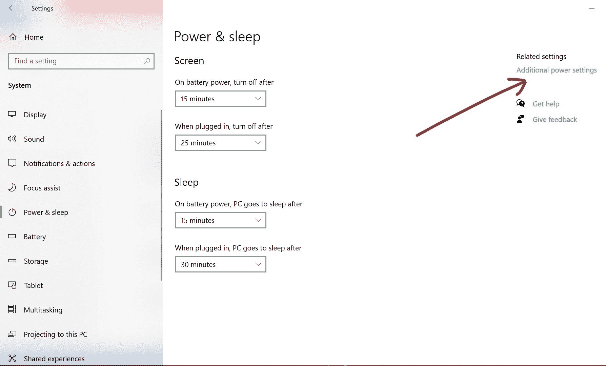
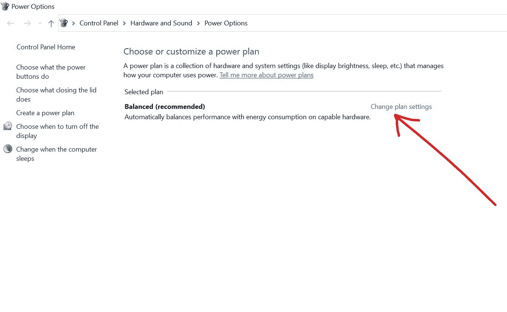
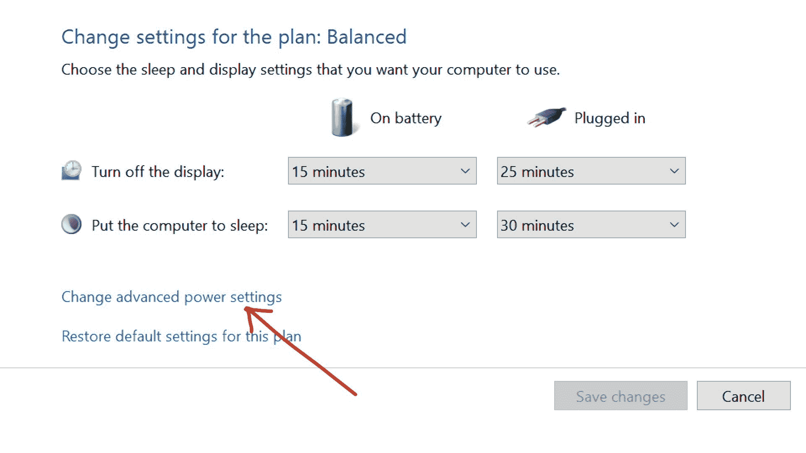
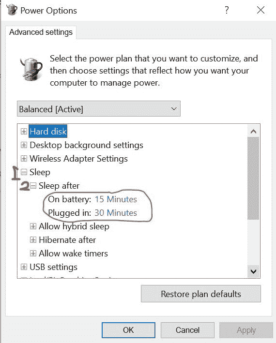

# Windows 10 不会休眠——如何修复 PC 上的休眠

> 原文：<https://www.freecodecamp.org/news/windows-10-is-not-going-to-sleep-how-to-fix-sleeping-on-pc/>

如果你暂时停止工作，并且不准备关闭电脑，Windows 10 睡眠模式是一个很好的选择。

它会关闭计算机的显示器和硬盘，从而降低功耗。

但是你的电脑有时可能会拒绝进入睡眠状态。这可能是由于电源设置中的**外围设备**和**错误造成的。**

如果您目前无法让电脑进入睡眠状态，那么您来对地方了。

在这篇文章中，我将向你展示 4 种让你的电脑再次进入睡眠状态的方法，这样它会消耗更少的能量。

## 如何通过启用睡眠模式修复 Windows 10 PC 不进入睡眠状态

要确保启用睡眠模式，请按照以下步骤操作:

**第一步**:按键盘上的`WIN` + `I`启动设置。

**第二步**:从菜单平铺中选择系统。

第三步:确保你在电源和睡眠标签页。然后在“睡眠”部分，设置电脑在使用电池和接通电源(充电)时进入睡眠状态的时间。

要确认您设置的时间:

选择右侧的附加电源设置。

单击更改计划设置链接。

单击更改高级电源设置。

展开“睡眠”，然后在树形菜单中选择“睡眠时间”。你应该看到你设置的准确时间。

## 如何通过移除外围设备修复 Windows 10 PC 不进入睡眠状态

鼠标、键盘、扫描仪和网络适配器等外围设备可能会干扰电脑电源设置，并阻止其进入睡眠状态。

我以前也遇到过这种情况，也见过身边的人有同样的情况。但我不会建议你禁用这些设备来唤醒你的电脑。

你能做的最好的事情就是当你想让你的电脑进入睡眠状态的时候把这些设备移除，然后当你准备好再次工作的时候把它们插回去。

## 如何通过禁用屏保修复 Windows 10 PC 不进入睡眠状态

屏幕保护程序会干扰您设置的睡眠计时器。所以一个活跃的屏幕保护程序可以防止你的电脑进入睡眠状态。

您可以通过以下步骤禁用屏幕保护程序:

**第一步**:点击开始，搜索“更改屏保”。然后选择“更改屏保”搜索结果。

**第二步**:在“屏保”下拉菜单中选择无。

**第三步**:点击应用，然后点击确定。

## 如何通过禁用混合模式修复 Windows 10 PC 不进入睡眠状态

混合模式是睡眠和休眠的结合。它使你的计算机休眠，但是给你恢复睡眠模式的速度。

如果混合模式打开，它可以阻止你的电脑进入睡眠状态。

要禁用混合模式，请执行以下步骤:

**步骤 1** :点击开始，选择设置。

**第二步**:从菜单平铺中选择系统。

**步骤 3** :切换到电源&睡眠标签，然后选择右上角的附加电源设置。

**步骤 4** :在您当前所在的电源计划下，选择“更改计划设置”。

**第五步**:选择“更改高级电源设置”。

**步骤 6** :展开树形菜单中的“睡眠”和“允许混合睡眠”。

**步骤 7** :关闭混合睡眠电池，插上电源。

**第 8 步**:点击“应用”，然后点击“确定”。

如果你觉得这篇文章有帮助，可以考虑与你的朋友和家人分享。

感谢您的阅读。