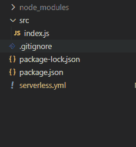

# AWS 无服务器–如何使用 AWS Rekognition 识别图像中的名人

> 原文：<https://www.freecodecamp.org/news/use-aws-rekognition-to-identify-celebrities-in-images/>

在本文中，我们将学习如何使用 AWS Serverless 创建一个应用程序，让我们能够识别名人的图像。我们将使用 AWS Rekognition 进行基于人工智能的识别。

我们将把一个事件附加到 S3 存储桶，以便每当一个文件被上传到存储桶时，它将调用一个 Lambda 函数来处理来自图像的信息，并将它保存到 DynamoDB 表中。

在你使用 DynamoDB 之前，只要确保你在 [AWS DynamoDB 定价](https://devswisdom.com/aws-dynamodb-pricing-and-features/)上查看了这个指南，这样你就只花你想花的钱。

## **技术规格**

我们将使用 Lambda 函数来编码我们的项目逻辑和 AWS Rekognition，用于基于人工智能的名人图像识别。

如果我们从 AWS Rekognition API 获得有效数据，那么我们将把这些数据存储在 DynamoDB 表中。

除了来自 S3 存储桶的资源，所有这些资源都将在 *serverless.yml* 文件中创建。

## ****项目设置****

我们将逐步建立这个项目中我们需要的所有东西。首先我们将浏览一下 *serverless.yml* 文件。要了解更多关于这个文件的信息，请查看[的这个](https://devswisdom.com/use-websockets-with-aws-serverless/)帖子。让我们开始第一步。



在本教程结束时，我们的项目文件夹结构应该是这样的。

### **如何设置**up server less . yml 文件****

我们将把 *serverless.yml* 文件分解成不同的部分，以便于理解。

#### **如何设置**权限和**配置**项目****

```
service: meta-data-serverless

provider:
  name: aws
  runtime: nodejs12.x
  environment:
    DYNAMO_TABLE_NAME: MetaData
    BUCKET_NAME: new-bucket-caps2
  iamRoleStatements:
    - Effect: Allow
      Action:
        - dynamodb:PutItem
        - rekognition:RecognizeCelebrities
        - s3:Get*
        - s3:List*
      Resource: "*"
```

在这个代码块中，我们设置了不同的环境变量和 AWS IAM 权限，它们将被赋予我们的 lambda 函数。因此对于我们的使用，我们需要向 DynamoDB 表中写入一个项目，使用 AWS Rekognition 的 API 对图像进行图像识别，并从 S3 获取文件(以上代码中我们已经完成了所有这些操作)。

请注意，您将需要创建一个新的公共 S3 存储桶，并在此处设置该存储桶的名称来代替作为 BUCKET_NAME 属性的*“new-BUCKET-caps 2*”。要阅读更多关于 IAM 角色的信息，请查看官方 [AWS 文档](https://docs.aws.amazon.com/IAM/latest/UserGuide/introduction.html)。

#### **如何添加一个**λ函数****

```
functions:
  processImg:
    handler: src/index.handler
    events:
      - s3:
          bucket: ${self:provider.environment.BUCKET_NAME}
          event: s3:ObjectCreated:*
          existing: true
```

在 functions 块中，我们定义了一个 lambda 函数，当任何文件上传到 S3 存储桶时都会调用这个函数。

如您所见，我们将一个事件附加到这个 lambda 函数上，它将在这个函数上被调用。`s3:ObjectCreated`是指任何文件上传到 S3 存储桶的事件。

我们还通过将`existing`选项设置为`true`来声明这个 bucket 已经存在。因此，确保在部署项目之前创建这个存储桶。

我们还引用了在上一节中创建的 bucket 名称的环境变量。

#### **如何添加 **DynamoDB 表配置****

```
resources:
  Resources:
    UsersDynamoDbTable:
      Type: AWS::DynamoDB::Table
      DeletionPolicy: Retain
      Properties:
        AttributeDefinitions:
          - AttributeName: id
            AttributeType: S
        KeySchema:
          - AttributeName: id
            KeyType: HASH
        ProvisionedThroughput:
          ReadCapacityUnits: 1
          WriteCapacityUnits: 1
        TableName: ${self:provider.environment.DYNAMO_TABLE_NAME}
```

在这个模块中，我们定义了 DynamoDB 表及其配置。我们想要在 AWS 帐户上创建的任何资源都是在 *serverless.yml* 文件的 resources 块下定义的。这里我们定义了一些东西，比如表属性、键模式，以及我们希望为表提供多少吞吐量。

对于表属性，除了 id 之外，所有其他属性都将被动态添加到表中。我们将使用一个名为 UUID 的模块在代码中生成 id。

### **如何设置**起λ功能****

在创建了 *serverless.yml* 文件之后，现在是时候创建我们在 yml 文件中定义的 lambda 函数了。所以让我们开始吧。

我们将再次看到 lambda 函数的不同部分，这样你可以更好地理解它。

#### 进口

```
const AWS = require("aws-sdk");
const {
    v4: uuidv4
} = require('uuid');
const rekognition = new AWS.Rekognition();
const dynamoDb = new AWS.DynamoDB.DocumentClient();
```

我们正在导入两个包，aws-sdk 和 UUID，来调用 DynamoDB 和 AWS Rekognition 的 API。我们也在初始化它们的实例。

#### ****定义**e**参数****

```
const Bucket = event.Records[0].s3.bucket.name;
const Name = decodeURIComponent(event.Records[0].s3.object.key.replace(/\+/g, " "));

const params = {
    Image: {
        S3Object: {
            Bucket,
            Name
        }
    }
};
```

当我们的 lambda 被 S3 事件调用时，它接收关于上传到 S3 桶的对象的数据。我们只是获得了对象数据，比如它被上传到的存储桶的名称以及文件的名称。

之后，我们将该数据传递给参数对象，我们将传递给 AWS Rekognition API 调用。

#### ****调用 AWS 识别 API****

```
const celebrityData = await rekognition.recognizeCelebrities(params).promise();
if (celebrityData.CelebrityFaces && celebrityData.CelebrityFaces.length) {

    const {
        Name,
        Urls,
        KnownGender,
        Face
    } = celebrityData.CelebrityFaces[0];
    const closelyMatchedEmotion = Face.Emotions.reduce((prev, current) => (prev.Confidence > current.Confidence) ? prev : current)

    const params = {
        TableName: process.env.DYNAMO_TABLE_NAME,
        Item: {
            id: uuidv4(),
            Name,
            readMore: Urls,
            KnownGender,
            closelyMatchedEmotion
        },
        ConditionExpression: "attribute_not_exists(id)"
    };
    await dynamoDb.put(params).promise();
```

最后，我们使用在上一步中声明的参数调用 AWS Rekognition API。在我们从 API 得到响应后，我们检查它是否能够识别名人。

如果它找到了名人数据，那么我们将从已识别的名人数据中获取姓名、性别、图像中的情感等数据。

然后，我们使用之前导入的 UUID 包生成一个 id。我们要做的最后一件事是将这些数据插入 DynamoDB 表中。

注意，要查询保存的带有非键属性的数据，如果不想扫描整个表，就需要创建一个索引。查看这篇文章，了解如何使用 AWS Serverless 创建一个 [DynamoDB 全局二级索引](https://devswisdom.com/dynamodb-global-secondary-index-detailed-guide/)。

## ****结论****

如果你达到了这一步，那么恭喜你！您现在有了一个应用程序，它将从图像中识别名人数据。

你现在可以进入你创建的 S3 桶，上传任何名人图片，然后等待几秒钟，然后检查 DynamoDB 表，查看保存在那里的结果。

您可以通过多种方式增强这个应用程序。例如，您可以添加像 GET 这样的 API 来获取数据，并查看添加到 DynamoDB 表中的数据。也可以用 MongoDB 代替 DynamoDB。要了解这两者之间的更多区别，请查看 [DynamoDB 与 MongoDB](https://devswisdom.com/dynamodb-vs-mongodb-detailed-comparison/) 。

## ****获取源代码****

点击[此处](https://github.com/shivangchauhan7/celebrity-recoknition)获取该应用程序的源代码。

你可以[在我的网站上查看更多类似的文章](https://devswisdom.com/)。