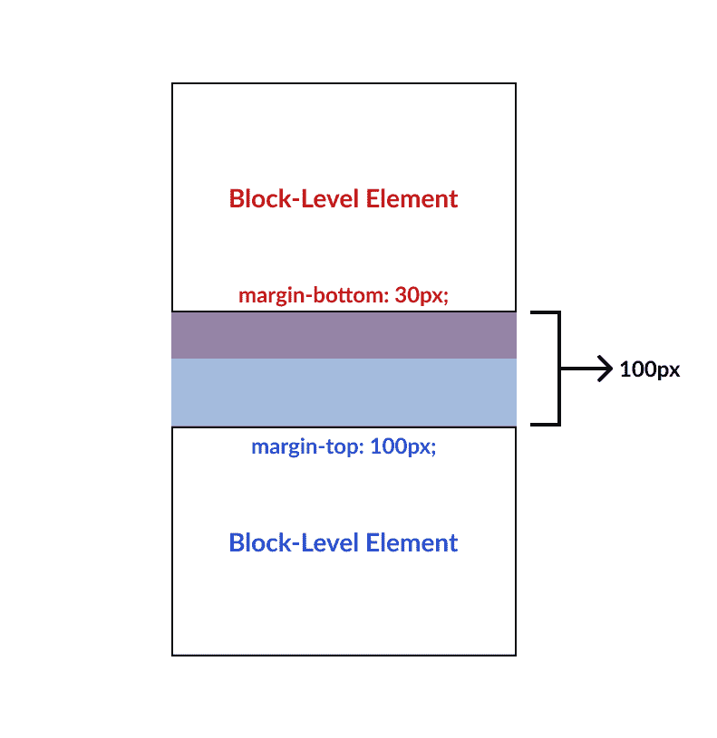
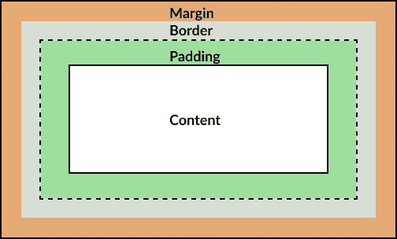

# CSS 中什么是边距塌陷？以及如何避免

> 原文：<https://www.freecodecamp.org/news/what-is-margin-collapse-and-how-to-avoid-it/>

## 什么是保证金崩溃？

当块级元素的垂直相邻边距发生冲突以共享一个通用边距空间时，就会发生边距折叠。这个共享空间的大小由较大的数字余量决定。

你可以把这想象成一场掰手腕比赛，较大的优势将接管并获胜。

重要的是要弄清楚更大的数字意味着什么。

如果 70px 的边距与 90px 的边距发生冲突，则 90px 的边距获胜。如果-70px 的边距与-90px 的边距发生冲突，则-90px 将获胜。

虽然从技术上讲，负数在数学尺度上比正数小，但是如果使用边距折叠，记住数值越大，重要性越高是很有帮助的。

无论度量单位是什么，如像素、rem、em 或百分比，塌陷都是相关的。即使混合使用，这些单位也可以相互计算。

在各种场景中，这种交互会成为问题。例如，如果您正在创建一个可重用的组件，不管放置在什么位置，它周围都应该有一组一致的边距空间。

由于边距可能会与另一个组件相互影响，因此根据组件的放置位置，可能会出现不一致。幸运的是，我们可以采取一些预防措施来避免这种情况。

边距折叠可能会导致布局中出现意外行为。您可能会看到应用的间距似乎与您预期的不匹配。

您可以了解 margin 属性的内部工作原理，以便能够识别何时会发生折叠，而不是通过添加额外的像素直到间距正确来增加边距。



### 边距折叠代码示例

```
<div class="one">Block-Level Element One</div>
<div class="two">Block-level Element Two</div>
```

```
div.one {
    margin-bottom: 30px;
}

div.two {
    margin-top: 100px;
}
```

## 负边距

负的边距值也容易导致边距崩溃。它们就像正边际一样工作，在那里更多的人将接管。

a-30px 余量和 a -100px 碰撞的结果会产生-100px 的余量空间。

### 混合正负边距

当负边距和正边距相互作用时，像素将被加在一起，相互抵消。这是一些数学将会考虑的地方。

例如，边距为-30px 和 10px 将导致共享边距空间为-20px。或者，10px 的边距和 10px 的边距将导致没有边距(-10 + 10 = 0)！

## 如何识别利润崩溃

利润率崩溃有不同的情况。查看下面的比较，以便更好地了解何时会发生利润崩溃。

### 边缘塌陷

*   元素是块级的，比如`div`或者`p`
*   垂直边距将会崩溃
*   折叠仅发生在流布局中，这是默认的布局模式
*   像`<br/>`这样的“看不见的”元素不会阻止利润崩溃

### 没有利润崩溃

*   水平同级元素不会折叠
*   在伸缩、网格或定位布局中没有边距折叠
*   利润率的下降会累积起来，造成兄弟姐妹之间相互影响的多米诺骨牌效应
*   垂直兄弟之间的`<hr/>`元素可以防止折叠

### 如何检查你的利润

浏览器中的 Inspect 功能是一个很好的工具，可以直观地了解您的边距、填充和盒子模型的其他方面。这将有助于您了解页边距是否共享。



The Box Model

## 如何避免利润崩溃

首先，请记住，边距最好用于增加兄弟元素之间的距离，而不是在子元素和父元素之间创建间距。如果您需要增加流布局中的空间，请尽可能先进行填充。

另外，添加边距时要考虑布局模式。请注意您处于哪种布局模式，并在正常流布局中随时注意边距的折叠。

要增加同级之间的间距并避免边距崩溃，请考虑使用 Flexbox 或 Grid 并利用它们的 gap 功能。

还可以考虑使用符合特定设计系统的间距准则的组件库。或者您可以使用已经解决了利润崩溃问题的开源库。你也可以为你团队建立一个设计系统，在这个系统中你可以在你的 UI 中使用一致的边距和填充。

最后，试着培养一种意识，知道利润率何时会下降。现在你对这种行为有了更多的了解，你会开始更频繁地注意到它。

当你的利润崩溃雷达被激活时，使用你可信赖的浏览器检查工具。如果找到它，请将其删除以防止重复使用该样式，因为它可能会被重复使用并在将来导致问题。

### 利润折叠的资源

如果你想更深入地了解利润崩溃，我强烈建议你阅读乔希·w·科莫的《利润崩溃的规则》。

我还推荐他的综合课程[面向 JavaScript 开发人员的 CSS](https://css-for-js.dev/)，如果你想填补你的 CSS 知识中的任何空白，并学习更多关于这类主题的知识。

## 摘要

边距折叠可能是您以前经历过的一种 CSS 行为，并且还没有定义，或者您可能还没有所有可用的工具来避免它。

margin 属性的这个棘手的方面经常会被忽略，并通过预期的行为造成严重破坏。理解这些效果有助于改进您的 UI，减少 CSS 中的错误数量。

编码快乐！