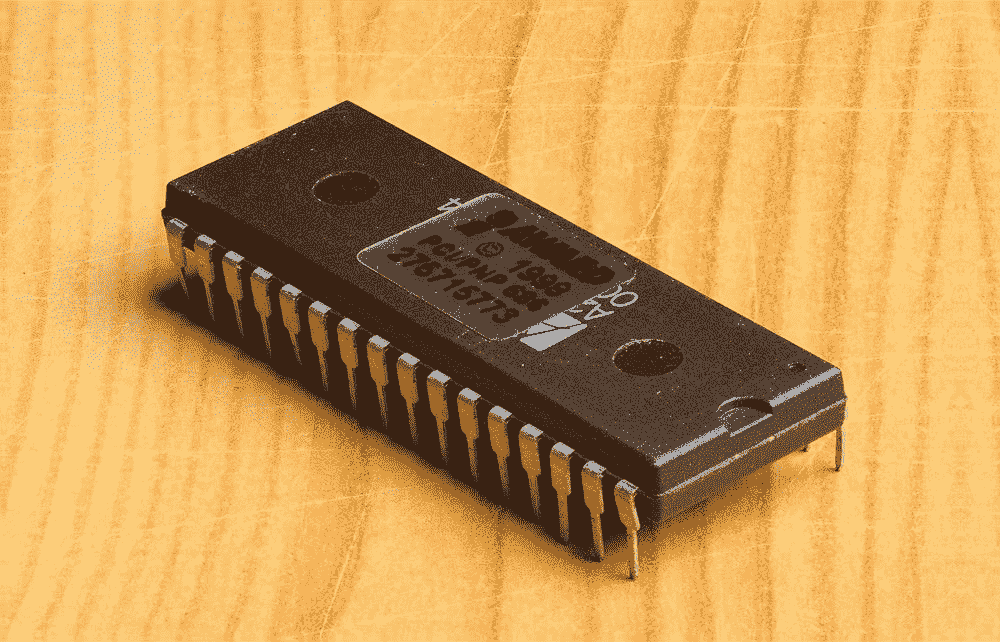
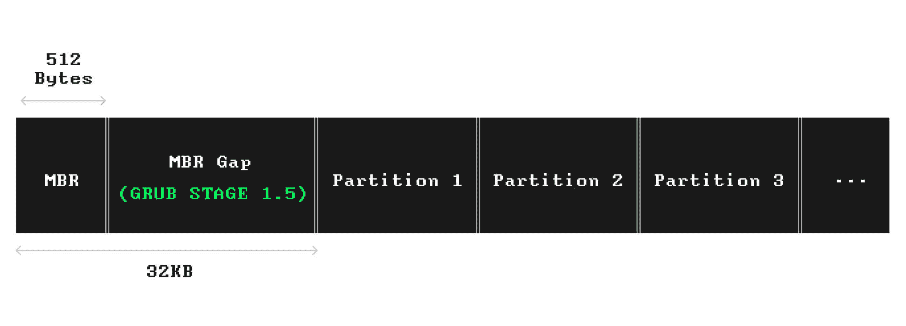
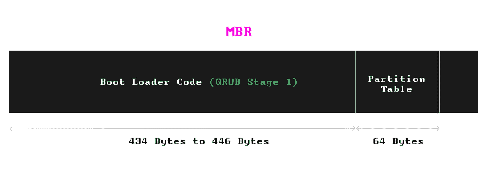
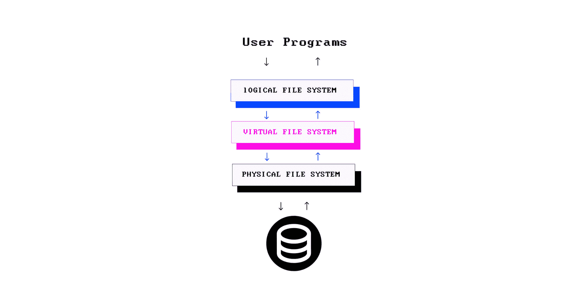
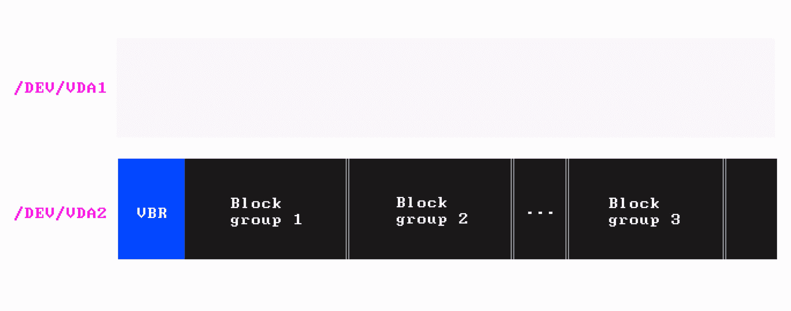
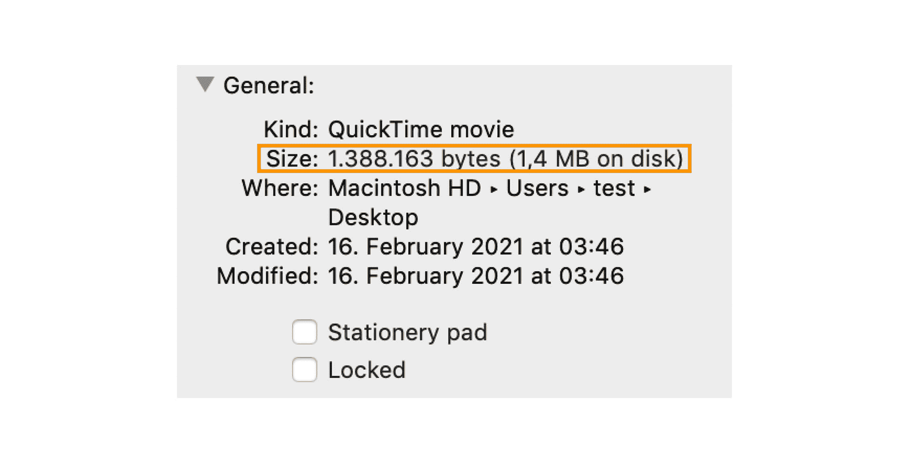
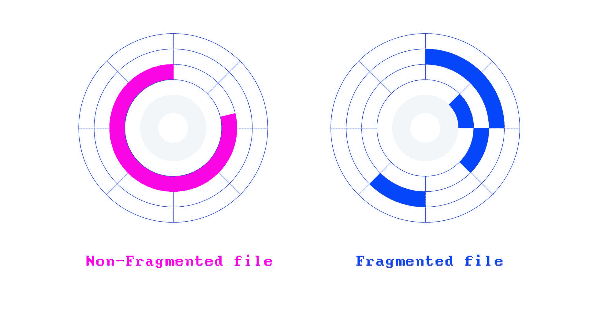

# 什么是文件系统？计算机文件系统的类型及其工作方式–用示例解释

> 原文：<https://www.freecodecamp.org/news/file-systems-architecture-explained/>

用一句话解释文件系统到底是什么有点棘手。

这就是为什么我决定写一篇关于它的文章。这篇文章是对文件系统的一个高层次的概述。但是我也将潜入更低层次的概念，只要它不会变得令人厌烦。:)

## 什么是文件系统？

让我们从一个简单的定义开始:

一个**文件系统**定义了文件如何被**命名为**、**存储为**，以及**从存储设备中检索为**。

每次在计算机或智能设备上打开文件时，操作系统都会在内部使用其文件系统从存储设备加载文件。

或者当您复制、编辑或删除一个文件时，文件系统在幕后处理它。

每当你通过因特网下载文件或访问网页时，也涉及到文件系统。

例如，如果你在 [freeCodeCamp](https://www.freecodecamp.org/) 上访问一个页面，你的浏览器会向 freeCodeCamp 的服务器发送一个 [HTTP](https://www.decodingweb.dev/books/decoding-web-development/http) 请求来获取该页面。如果请求的资源是一个文件，那么它是从文件系统中获取的。

当人们谈论文件系统时，他们可能会根据上下文来指文件系统的不同方面——这就是事情开始变得棘手的地方。

你可能会问自己，到底什么是文件系统？🤯

本指南帮助您理解许多环境中的文件系统。我还将介绍分区和引导！

为了使本指南易于管理，在解释底层概念或控制台命令时，我将把重点放在类 Unix 环境上。

但是，这些概念仍然与其他环境和文件系统相关。

### 您可能会问，为什么我们首先需要文件系统？

如果没有文件系统，存储设备将包含一大块背靠背存储的数据，操作系统将无法区分它们。

文件系统这个术语的名称来自于旧的基于纸张的数据管理系统，在这种系统中，我们将文档作为文件保存并放入目录中。

想象一个房间，到处都是成堆的文件。


没有文件系统的存储设备也是同样的情况，它将是一个无用的电子设备。

但是，文件系统会改变一切:


然而，文件系统不仅仅是簿记功能。

空间管理、元数据、数据加密、文件访问控制和数据完整性也是文件系统的职责。

## 一切都从分区开始

第一次使用之前，存储设备必须经过**分区**和**格式化**。

但是什么是分区呢？

分区是将一个存储设备分割成几个*逻辑区域*，这样它们就可以像单独的存储设备一样单独管理。


我们通常通过操作系统提供的磁盘管理工具进行分区，或者作为系统固件(我会解释什么是固件)提供的命令行工具。

如果需要，存储设备应该至少有一个或多个分区。

我们为什么要将存储设备分割成多个分区呢？

原因是我们不希望将整个存储空间作为一个单元来管理，并且只用于一个目的。

这就像我们如何划分我们的工作空间，以分离(和隔离)会议室、会议室和各种团队。


例如，一个基本的 Linux 安装有三个分区:一个分区专用于操作系统，一个用于用户文件，还有一个可选的交换分区。

当 RAM 空间不足时，交换分区充当 RAM 扩展。

例如，操作系统可能会将一块数据(临时)从 RAM 移动到交换分区，以释放 RAM 上的一些空间。

操作系统不断使用各种[内存管理](https://www.decodingweb.dev/books/processing-fundamentals/operating-systems-and-memory-management)技术来确保每个进程都有足够的内存空间来运行。

Windows 和 Mac 上的文件系统有相似的布局，但它们不使用专用的交换分区；相反，它们设法在安装了操作系统的分区内进行交换。

在一台有多个分区的计算机上，你可以安装几个操作系统，每次都选择不同的操作系统来启动你的系统。

恢复和诊断实用程序也位于专用分区中。

例如，要在恢复模式下启动 MacBook，您需要在重启(或打开)MacBook 后立即按住`Command + R`。通过这样做，您可以指示系统固件使用包含恢复程序的分区进行引导。

然而，分区不仅仅是安装多个操作系统和工具的一种方式；它还帮助我们将重要的系统文件与普通文件分开。

因此，无论你在电脑上安装多少游戏，都不会对操作系统的性能产生任何影响——因为它们位于不同的分区。

回到办公室的例子，将呼叫中心和技术团队放在一个公共区域会损害两个团队的生产力，因为每个团队都有自己的高效要求。

例如，技术团队会喜欢更安静的地方。

有些操作系统，如 Windows，会给分区分配一个驱动器号(A、B、C 或 D)。例如，Windows 上的*主分区*(Windows 安装在其上)被称为 **C** :或**驱动器 C** 。

然而，在类 Unix 操作系统中，分区作为普通目录出现在根目录下——我们将在后面介绍这一点。

在下一节中，我们将深入探讨分区，并了解将改变您对文件系统看法的两个概念:**系统固件**和**引导**。

你准备好了吗？

我们走吧！🏊‍♂️

## 分区方案、系统固件和引导

当对存储设备进行分区时，我们有两种分区方法(或方案🙄)可供选择:

*   **主引导记录(MBR)方案**
*   **GUID 分区表(GPT)方案**

无论您选择哪种分区方案，存储设备上的前几个块总是包含关于您的分区的关键数据。

系统的*固件*使用这些数据结构在一个分区上启动操作系统。

等等，系统固件是什么？你可能会问。

这里有一个解释:

固件是嵌入到电子设备中的低级软件，用于操作该设备，或者引导另一个程序来执行该操作。

固件存在于计算机、外围设备(键盘、鼠标和打印机)甚至家用电器中。

在计算机中，固件为复杂的软件(如操作系统)提供了一个标准接口，以便启动和与硬件组件一起工作。

然而，在像打印机这样简单的系统上，固件就是操作系统。您在打印机上使用的菜单是其固件的界面。

硬件制造商基于两种规范制造固件:

*   **基本输入/输出(BIOS)**
*   **统一可扩展固件接口(UEFI)**

固件——基于 BIOS 或基于 UEFI——驻留在一个*非易失性存储器*上，就像附在主板上的闪存 ROM。



[**BIOS**](https://www.flickr.com/photos/computerhotline/5794340306) By [Thomas Bresson](https://www.flickr.com/photos/computerhotline/), Licensed under **[CC BY 2.0](https://creativecommons.org/licenses/by/2.0/)**

当您按下电脑上的电源按钮时，固件是第一个运行的程序。

固件的任务是启动计算机，运行操作系统，并将整个系统的控制权交给它。

固件还运行预操作系统环境(有网络支持)，如恢复或诊断工具，甚至是运行基于文本的命令的外壳。

在您的 Windows 徽标出现之前，您看到的最初几个屏幕是您的计算机固件的输出，用于验证硬件组件和内存的健康状况。

初始检查通过哔哔声确认(通常在电脑上)，表示一切正常。

## MBR 分区和基于 BIOS 的固件

MBR 分区方案是 BIOS 规范的一部分，由基于 BIOS 的固件使用。

在 MBR 分区的磁盘上，存储设备的第一个扇区包含启动系统的基本数据。

这个扇区称为 MBR。

MBR 包含以下信息:

*   引导加载程序，这是一个简单的程序(在机器代码中),用于启动引导过程的第一阶段
*   一个**分区表**，它包含关于您的分区的信息。

基于 BIOS 的固件引导系统的方式不同于基于 UEFI 的固件。

它是这样工作的:

系统启动后，BIOS 固件启动并将引导加载程序(包含在 MBR 中)加载到内存中。一旦程序在内存中，CPU 就开始执行它。

将引导加载程序和分区表放在预定义的位置，如 MBR，使 BIOS 能够引导系统，而不必处理任何文件。

如果你对 CPU 如何执行驻留在内存中的指令感到好奇，你可以阅读这本初学者友好且有趣的关于 CPU 如何工作的指南。

MBR 中的引导加载程序代码占用 MBR 空间的 434 字节到 446 字节(总共 512b 字节)。此外，64 个字节被分配给分区表，该分区表可以包含关于最多四个分区的信息。

不过，446 字节并不足以容纳太多的代码。也就是说，像 Linux 上的 GRUB 2 这样复杂的引导加载程序将它们的功能分成了几个部分或几个阶段。

被称为*第一阶段引导加载程序*的最小代码段存储在 MBR 中。它通常是一个简单的程序，不需要太多空间。

第一阶段引导加载程序的职责是启动引导过程的下一个(更复杂的)阶段。

紧接着 MBR 之后，在第一个分区开始之前，有一个小空间，大约 1MB，称为 **MBR 间隙**。

如果需要，MBR 间隙可用于放置另一部分引导加载程序。

GRUB 2 之类的引导加载程序使用 MBR 间隙来存储其功能的另一个阶段。GRUB 称之为*阶段 1.5* 引导加载程序，其中包含一个文件系统驱动程序。

Stage 1.5 使 GRUB 的后续阶段能够理解文件的概念，而不是从存储设备加载原始指令(像第一阶段的引导加载程序)。

现在能够处理文件的第二阶段引导加载程序可以加载操作系统的引导加载程序文件来引导相应的操作系统。

这是操作系统的标志淡入的时候...

以下是 MBR 分区存储设备的布局:



如果我们放大 MBR，它的内容会是这样的:



尽管 MBR 简单且得到广泛支持，但它有一些局限性😑。

MBR 的数据结构将分区的数量限制为仅*四个主*分区。

一个常见的解决方法是在主分区旁边制作一个扩展的分区，只要分区总数不超过四个。

一个扩展分区可以分成多个逻辑分区。在不同的操作系统中，创建扩展分区是不同的。在这个快速指南[中，微软解释了在 Windows](https://docs.microsoft.com/en-us/windows-hardware/manufacture/desktop/configure-more-than-four-partitions-on-a-biosmbr-based-hard-disk?view=windows-11) 上应该如何做。

创建分区时，您可以选择主分区和扩展分区。

解决这个问题后，我们将遇到第二个限制。

每个分区的最大容量为 **2TiB** 🙄。

等等，还有更多！

MBR 扇区的内容没有备份😱这意味着如果 MBR 由于意外原因而损坏，我们必须找到一种方法来回收这个无用的硬件。

这就是 GPT 分区的突出之处😎。

## GPT 分区和基于 UEFI 的固件

**GPT** 分区方案比 MBR 更复杂，没有 MBR 的局限性。

例如，只要操作系统允许，您就可以拥有任意多的分区。

每个分区的大小可以是市场上最大的存储设备——实际上要大得多。

GPT 正在逐步取代 MBR，尽管 MBR 仍然在新旧电脑上得到广泛支持。

如前所述，GPT 是 UEFI 规范的一部分，它正在取代旧的 BIOS。

这意味着基于 UEFI 的固件使用 GPT 分区的存储设备来处理引导过程。

许多硬件和操作系统现在支持 UEFI，并使用 GPT 方案对存储设备进行分区。

在 GPT 分区方案中，出于与基于 BIOS 的系统兼容的原因，存储设备的第一个扇区被保留。原因是一些系统可能仍然使用基于 BIOS 的固件，但是具有 GPT 分区的存储设备。

这个扇区被称为**保护 MBR。**(这是第一阶段引导加载程序驻留在 MBR 分区磁盘中的位置)

在这个第一扇区之后，存储 GPT 数据结构，包括 **GPT 头**和**分区条目**。

GPT 条目和 GPT 报头在存储设备的末端备份，因此如果主拷贝损坏，它们可以被恢复。

这个备份称为**辅助 GPT。**

GPT 分区存储设备的布局如下所示:


**[GUID Partition Table Scheme](https://commons.wikimedia.org/wiki/File:GUID_Partition_Table_Scheme.svg)** By [Kbolino](https://en.wikipedia.org/wiki/User:Kbolino), Licensed under **[CC BY-SA 2.5](https://creativecommons.org/licenses/by-sa/2.5/)**

在 GPT，所有引导服务(引导加载程序、引导管理器、操作系统前环境和 shells)都位于一个名为 **EFI 系统分区(ESP)** 的专用分区中，UEFI 固件可以使用该分区。

ESP 甚至有自己的文件系统，是**胖**的特定版本。在 Linux 上，ESP 驻留在`/sys/firmware/efi`路径下。

如果在您的系统上找不到此路径，那么您的固件可能是基于 BIOS 的固件。

要检查它，您可以尝试将目录更改为 ESP 挂载点，如下所示:

```
cd /sys/firmware/efi 
```

基于 UEFI 的固件假设存储设备使用 GPT 进行分区，并在 GPT 分区表中查找 ESP。

一旦找到 EFI 分区，它就会寻找配置好的引导加载程序——通常是一个以`.efi`结尾的文件。

基于 UEFI 的固件从 **NVRAM** (一种非易失性 RAM)获取引导配置。

NVRAM 包含操作系统引导加载程序文件的引导设置和路径。

如果进行相应的配置，UEFI 固件也可以进行 BIOS 风格的引导(从 MBR 磁盘引导系统)。

您可以在 Linux 上使用`parted`命令来查看存储设备使用的分区方案。

```
sudo parted -l 
```

输出应该是这样的:

```
Model: Virtio Block Device (virtblk)
Disk /dev/vda: 172GB
Sector size (logical/physical): 512B/512B
Partition Table: gpt
Disk Flags: 

Number  Start   End     Size    File system  Name  Flags
14      1049kB  5243kB  4194kB                     bios_grub
15      5243kB  116MB   111MB   fat32              msftdata
 1      116MB   172GB   172GB   ext4 
```

根据上面的输出，存储设备的 ID 是`/dev/vda`，容量为 172GB。存储设备基于 GPT 进行分区，并且具有三个分区；第二个和第三个分区分别基于 FAT32 和 EXT4 文件系统进行格式化。

拥有 BIOS GRUB 分区意味着固件仍然是基于 BIOS 的固件。

让我们用如下的`dmidecode`命令来确认:

```
sudo dmidecode -t 0 
```

输出将是:

```
# dmidecode 3.2
Getting SMBIOS data from sysfs.
SMBIOS 2.4 present.

... 
```

✅确认了！

## 格式化分区

当分区完成时，分区应该被格式化。

大多数操作系统都允许您根据一组文件系统格式化一个分区。

例如，如果你在 Windows 上格式化一个分区，你可以在 **FAT32** 、 **NTFS** 和 **exFAT** 文件系统之间进行选择。

格式化包括创建各种**数据结构**和用于管理分区内文件的元数据。

这些数据结构是文件系统的一个方面。

让我们以 NTFS 文件系统为例。

将分区格式化为 NTFS 时，格式化过程会将关键的 NTFS 数据结构和**主文件表(MFT)** 放在分区上。

好了，让我们用关于分区、格式化和引导的新背景知识回到文件系统。

## 它是如何开始的，它是如何进行的

文件系统是一组数据结构、接口、抽象和 API，它们协同工作，以一致的方式管理任何类型的存储设备上的任何类型的文件。

每个操作系统都使用特定的文件系统来管理文件。

早期，微软在 **MS-DOS** 和 **Windows 9x** 家族中使用 **FAT** (FAT12、FAT16 和 FAT32)。

从 Windows **NT 3.1** 开始，微软开发了**新技术文件系统(NTFS)** ，它比 FAT32 有很多优势，比如支持更大的文件、允许更长的文件名、数据加密、访问管理、日志等等。

NTFS 一直是 Window NT 系列(2000、XP、Vista、7、10 等)的默认文件系统。)从此。

但是，NTFS 不适合非 Windows 环境🤷🏻。

例如，你只能在 Mac OS 上**读取**NTFS 格式的存储设备(比如闪存)的内容，但是你不能向其中写入任何东西——除非你[安装一个带写支持的 NTFS 驱动](https://www.howtogeek.com/236055/how-to-write-to-ntfs-drives-on-a-mac/)。

或者你可以只使用 **exFat** 文件系统。

**扩展文件分配表(exFAT)** 是微软在 2006 年创建的 NTFS 的一个轻量级版本。

exFAT 专为高容量可移动设备设计，如外置硬盘、USB 驱动器和存储卡。

exFAT 是**SDXC**T2 卡使用的默认文件系统。

与 NTFS 不同，exFAT 在非 Windows 环境中也支持**读写**，包括 Mac OS——使其成为高容量可移动存储设备的最佳跨平台文件系统。

所以基本上，如果你有一个想在 Windows、Mac 和 Linux 上使用的可移动磁盘，你需要把它格式化成 exFAT。

苹果这些年也开发和使用了各种文件系统，包括
**【HFS】****【HFS+】以及最近的**苹果文件系统(APFS)** 。**

就像 NTFS 一样，APFS 是一个日志文件系统，自 2017 年推出 **OS X 高地**以来一直在使用。

但是 Linux 发行版中的文件系统如何呢？

**扩展文件系统(ext)** 文件系统家族是为 Linux 内核——Linux 操作系统的核心——而创建的。

第一个版本的 **ext** 发布于 1991 年，但不久之后，在 1993 年被**第二个扩展文件系统** ( **ext2)** 所取代。

在 2000 年代，**第三扩展文件系统** ( **ext3)** 和**第四扩展文件系统(ext4)** 是为具有日志功能的 Linux 开发的。

ext4 现在是许多 Linux 发行版的默认文件系统，包括 [Debian](https://en.wikipedia.org/wiki/Debian) 和 [Ubuntu](https://en.wikipedia.org/wiki/Ubuntu) 。

您可以在 Linux 上使用`findmnt`命令列出 ext4 格式的分区:

```
findmnt -lo source,target,fstype,used -t ext4 
```

输出将类似于:

```
SOURCE    TARGET FSTYPE  USED
/dev/vda1 /      ext4    3.6G 
```

## 文件系统的架构

安装在操作系统上的文件系统由三层组成:

*   **物理文件系统**
*   **虚拟文件系统**
*   **逻辑文件系统**

这些层可以作为独立或紧密耦合的抽象来实现。

当人们谈论文件系统时，他们将这些层中的一层或所有三层称为一个单元。

尽管这些层在不同的操作系统中是不同的，但概念是相同的。

物理层是文件系统的具体实现；它负责存储设备上的数据存储和检索以及空间管理(或者确切地说:分区)。

物理文件系统通过[设备驱动](https://www.decodingweb.dev/books/processing-fundamentals/how-a-computer-program-works#device-drivers)与存储硬件交互。

下一层是虚拟文件系统或 VFS。

虚拟文件系统提供了装载在同一操作系统上的各种文件系统的**一致视图**。

那么这是否意味着一个操作系统可以同时使用多个文件系统呢？

答案是肯定的！

可移动存储介质与计算机的文件系统不同是很常见的。

例如，在 Windows(使用 NTFS 作为主要文件系统)上，闪存可能已经格式化为 exFAT 或 FAT32。

也就是说，操作系统应该在计算机程序(文件浏览器和其他处理文件的应用程序)和不同的挂载文件系统(如 NTFS、APFS、ext4、FAT32、exFAT 和 UDF)之间提供一个统一的接口。

例如，当您打开文件资源管理器程序时，您可以从 ext4 文件系统中复制一个图像，并将其粘贴到 exFAT 格式的闪存中——而不必知道文件在幕后被不同地管理。

VFS 在用户(您)和底层文件系统之间提供了一个方便的中间层。

VFS 定义了一个*契约*，所有的物理文件系统都必须实现该契约才能得到该操作系统的支持。

然而，这种一致性并没有内置到文件系统核心中，这意味着文件系统的源代码并不支持每个操作系统的 VFS。

相反，它使用一个**文件系统驱动程序**来遵守每个文件系统的 VFS 规则。驱动程序是使软件能够与另一个软件或硬件通信的程序。

尽管 VFS 负责提供程序和各种文件系统之间的标准接口，但计算机程序并不直接与 VFS 交互。

相反，他们在程序和 VFS 之间使用统一的 API。

你能猜出它是什么吗？

是的，我们说的是**逻辑文件系统**。

逻辑文件系统是文件系统中面向用户的部分，它提供了一个 API，使用户程序能够执行各种文件操作，如`OPEN`、`READ`和`WRITE`，而不必处理任何存储硬件。

另一方面，VFS 在逻辑层(程序与之交互)和各种文件系统的一组物理层之间提供了一座桥梁。



A high-level architecture of the file system layers

### 挂载文件系统意味着什么？

在类 Unix 系统上，VFS 为每个分区或可移动存储设备分配一个**设备 ID** (例如，`dev/disk1s1`)。

然后，它创建一个**虚拟目录树**，并将每个设备的内容作为单独的目录放在该目录树下。

将一个目录分配给一个存储设备(在根目录下)的行为称为**挂载**，分配的目录称为**挂载点**。

也就是说，在类似 Unix 的操作系统上，所有分区和可移动存储设备看起来都像是根目录下的目录。

例如，在 Linux 上，可移动设备(比如存储卡)的挂载点通常在`/media`目录下。

也就是说，一旦一个闪存被连接到系统，因此，*在默认挂载点自动挂载*(在这个例子中是`/media`)，它的内容将在`/media`目录下可用。

但是，有时您需要手动挂载文件系统。

在 Linux 上，它是这样完成的:

```
mount /dev/disk1s1 /media/usb 
```

在上面的命令中，第一个参数是设备 ID ( `/dev/disk1s1`)，第二个参数(`/media/usb`)是挂载点。

请注意，挂载点应该已经作为目录存在。

如果没有，必须先创建它:

```
mkdir -p /media/usb
mount /dev/disk1s1 /media/usb 
```

如果挂载点目录已经包含文件，那么只要设备被挂载，这些文件就会被隐藏。

## 文件元数据

文件元数据是包含关于文件的**数据的数据结构，例如:**

*   文件大小
*   时间戳，如创建日期、最后访问日期和修改日期
*   文件的所有者
*   文件的模式(谁可以对文件做什么)
*   分区上的哪些块被分配给该文件
*   还有更多

但是，元数据不与文件内容一起存储。相反，它存储在磁盘上的不同位置，但与文件相关联。

在类 Unix 系统中，元数据是数据结构的形式，称为 **inode** 。

索引节点由一个称为*索引节点号的唯一编号来标识。*

索引节点与名为*的索引节点表*中的文件相关联。

存储设备上的每个文件都有一个 inode，其中包含关于它的信息，例如它的创建时间、修改时间等。

索引节点还包括分配给文件的块的地址；另一方面，它在存储设备上的确切位置

在 ext4 inode 中，分配的块的地址存储为一组数据结构，称为 **extents** (在 inode 中)。

每个盘区包含分配给该文件的第*个数据块*的地址和该文件已经占用的*个连续数据块*的数量。

每当您在 Linux 上打开一个文件时，它的名称首先被解析为一个 inode 号。

有了索引节点号，文件系统就可以从索引节点表中获取相应的索引节点。

获取 inode 后，文件系统开始从 inode 中注册的数据块合成文件。

您可以在 Linux 上使用带有`-i`参数的`df`命令来查看您的分区中的 inodes(总的、已用的和空闲的):

```
df -i 
```

输出如下所示:

```
udev           4116100    378 4115722    1% /dev
tmpfs          4118422    528 4117894    1% /run
/dev/vda1      6451200 175101 6276099    3% / 
```

如您所见，分区`/dev/vda1`总共有 6，451，200 个索引节点，其中 3%已经被使用(175，101 个索引节点)。

要查看与目录中的文件相关联的 inodes，可以使用带有`-il`参数的`ls`命令。

```
ls -li 
```

输出将是:

```
1303834 -rw-r--r--  1 root www-data  2502 Jul  8  2019 wp-links-opml.php
1303835 -rw-r--r--  1 root www-data  3306 Jul  8  2019 wp-load.php
1303836 -rw-r--r--  1 root www-data 39551 Jul  8  2019 wp-login.php
1303837 -rw-r--r--  1 root www-data  8403 Jul  8  2019 wp-mail.php
1303838 -rw-r--r--  1 root www-data 18962 Jul  8  2019 wp-settings.php 
```

第一列是与每个文件相关联的索引节点号。

分区上的 inodes 数量是在格式化分区时决定的。也就是说，只要有空闲空间和未使用的 inodes，就可以在存储设备上存储文件。

个人 Linux 操作系统不太可能耗尽 inodes。然而，处理大量文件的企业服务(如邮件服务器)必须灵活地管理它们的 inode 配额。

但是，在 NTFS 上，元数据的存储方式不同。

NTFS 将文件信息保存在名为 [**主文件表(MFT)**](https://docs.microsoft.com/en-us/windows/win32/fileio/master-file-table) 的数据结构中。

每个文件在 MFT 中都至少有一个条目，其中包含关于它的所有内容，包括它在存储设备上的位置——类似于 inodes 表。

在大多数操作系统上，您可以通过图形用户界面获取元数据。

例如，当您在 Mac OS 上右键单击一个文件，并选择**获取信息**(Windows 中的属性)，会出现一个窗口，显示关于该文件的信息。该信息从相应文件的元数据中获取。

## 空间管理

存储设备被分成固定大小的块，称为**扇区**。

扇区是存储设备上的最小存储单元，介于 512 字节和 4096 字节之间(高级格式)。

然而，文件系统使用一个高级概念作为存储单元，称为**块。**

块是物理扇区的抽象；每个块通常由多个扇区组成。

根据文件大小，文件系统为每个文件分配一个或多个块。

说到空间管理，文件系统知道分区上每个已用的*和未用的*块，因此它能够为新文件分配空间，或者在需要时获取现有文件。**

**ext4 格式分区中最基本的存储单元是块。但是，为了便于管理，连续块被分组为**块组**。**

**

The layout of a block group within an ext4 partition** 

**每个块组都有自己的数据结构和数据块。**

**以下是块组可以包含的数据结构:**

*   ****超级块:**一个元数据存储库，包含关于整个文件系统的元数据，比如文件系统中的总块数、块组中的总块数、inodes 等等。然而，并不是所有的块组都包含超级块。一定数量的块组存储超级副本作为备份。**
*   ****组描述符:**组描述符还包含每个块组的簿记信息**
*   ****Inode 位图:**每个块组都有自己的 Inode 配额用于存储文件。块位图是一种数据结构，用于标识块组中已使用的*和未使用的*索引节点。`1`表示已使用的，而`0`表示未使用的索引节点对象。****
*   ***块位图:**用于标识块组内已用&未用数据块的数据结构。`1`表示已使用的数据块，而`0`表示未使用的数据块*
*   ***Inode 表:**定义文件及其 Inode 关系的数据结构。存储在该区域中的 inodes 数量与文件系统使用的块大小有关。*
*   ***数据块:**这是块组中存储文件内容的区域。*

*Ext4 文件系统甚至更进一步(与 ext3 相比)，将块组组织成一个更大的组，称为 *flex 块组*。*

*每个块组的数据结构，包括块位图、索引节点位图和索引节点表，被*连接*并存储在每个 flex 块组内的*第一块组*中。*

*将所有数据结构连接在一个块组(第一个)中，可以在每个 flex 块组中的其他块组上释放更多连续的数据块。*

*这些概念可能会令人困惑，但你不必掌握它们的每一点。这只是为了描述文件系统的深度。*

*第一个块组的布局如下所示:*

*

The layout of the first block in an ext4 flex block group* 

*当文件被写入磁盘时，它被写入块组中的一个或多个块。*

*与将文件作为一个单元来组织相比，在块组级别管理文件可以显著提高文件系统的性能。*

### *大小与磁盘上的大小*

*你有没有注意到你的文件浏览器为每个文件显示两种不同的大小:**大小，**和**大小在磁盘上**。*

*

Size and Size on disk* 

*为什么`size`和`size on disk`略有不同？你可能会问。*

*这里有一个解释:*

*我们已经知道，根据文件大小，一个或多个块被分配给一个文件。*

*一个块是可以分配给文件的最小空间。这意味着部分填充的块的剩余空间不能被另一个文件使用。这是规矩！*

*由于文件*的大小不是块*的整数倍，最后一个块可能会被部分使用，而剩余的空间将保持未使用状态——或者用零填充。*

*所以“大小”基本上是实际的文件大小，而“磁盘上的大小”是它所占用的空间，即使它没有使用所有的空间。*

*你可以用 Linux 上的`du`命令自己去看。*

```
*`du -b "some-file.txt"`* 
```

*输出应该是这样的:*

```
*`623 icon-link.svg`* 
```

*并检查磁盘上的大小:*

```
*`du -B 1 "icon-link.svg"`* 
```

*这将导致:*

```
*`4096    icon-link.svg`* 
```

*根据输出，分配的块大约为 4kb，而实际文件大小为 623 字节。这意味着该操作系统上的每个块大小为 4kb。*

### *什么是磁盘碎片？*

*随着时间的推移，新文件被写入磁盘，现有文件变大、缩小或被删除。*

*存储介质的这些频繁变化会在文件之间留下许多小间隙(空白空间)。这些差距是由于文件大小和磁盘上的文件大小不同的原因造成的。有些文件不会填满整个块，而且会浪费很多空间。随着时间的推移，将没有足够的后续块来存储新文件。*

*这时，新文件需要存储为片段。*

***文件碎片**当文件作为碎片存储在存储设备上时，因为文件系统无法找到足够的连续块来存储一行中的整个文件，所以会出现文件碎片。*

*

An example of a fragmented and non-fragmented file* 

*让我们用一个例子来说明。*

*假设您有一个名为`myfile.docx`的 Word 文档。*

*`myfile.docx`最初存储在磁盘上几个连续的块中；假设这些块是这样命名的:`LBA250`、`LBA251`和`LBA252`。*

*现在，如果您向`myfile.docx`添加更多内容并保存它，它将需要在存储介质上占用更多的块。*

*由于`myfile.docx`当前存储在`LBA250`、`LBA251`和`LBA252`中，新内容最好位于`LBA253`中，依此类推——这取决于还需要多少块来容纳新的变化。*

*现在，假设`LBA253`已经被另一个文件占用(可能是另一个文件的第一个块)。在这种情况下，`myfile.docx`的新内容必须存储在磁盘上其他地方的不同块上，例如，`LBA312`和`LBA313`。*

*`myfile.docx`变得支离破碎💔。*

*文件碎片给文件系统带来了负担，因为每次用户程序请求碎片文件时，文件系统都需要从磁盘上的不同位置收集文件的每一部分。*

*这种开销也适用于将文件保存回磁盘。*

*当文件第一次写入磁盘时，也可能会出现碎片，这可能是因为文件太大，分区上没有多少连续的块。*

*随着文件系统老化，碎片是一些操作系统变慢的原因之一。*

### *如今我们应该关心碎片化吗？*

*简短的回答是:不再是了！*

*现代文件系统使用智能算法来尽可能避免(或及早发现)碎片。*

*Ext4 还做一些**预分配，**这涉及到在实际需要之前为文件保留块——确保文件不会因为时间变大而变得支离破碎。*

*在文件的 inode 对象的范围的*长度字段*中定义了*预分配块*的数量。*

*此外，ext4 使用一种叫做**延迟分配**的分配技术。*

*其思想是，在写入过程中，不是一次写入一个数据块，而是将分配请求累积在缓冲区中，并立即写入磁盘。*

*不必在每次写请求时都调用文件系统的*块分配器*，这有助于文件系统在分配可用空间时做出更好的选择。例如，将大文件与小文件分开放置。*

*假设一个小文件位于两个大文件之间。现在，如果这个小文件被删除，它会在两个文件之间留下一个小空间。*

*以这种方式分布文件在数据块之间留下了足够的间隙，这有助于文件系统更容易地管理(和避免)碎片。*

*延迟分配可以主动减少碎片并提高性能。*

## *目录*

*目录(Windows 中的文件夹)是一个特殊的文件，用作一个逻辑容器**来对文件系统中的文件和目录进行分组。***

*在 NTFS 和 Ext4 上，目录和文件的处理方式是一样的。也就是说，目录只是拥有自己的索引节点(在 Ext4 上)或 MFT 条目(在 NTFS 上)的文件。*

*目录的索引节点或 MFT 条目包含关于该目录的信息，以及指向该目录“下面”的文件的条目集合。*

*这些文件实际上并不包含在目录中，但是它们以某种方式与目录相关联，即它们在更高级别上作为目录的子目录出现，例如在文件资源管理器程序中。*

*这些条目被称为**目录条目。**目录条目包含映射到其索引节点/MFT 条目的文件名。*

*除了目录条目之外，还有两个条目。指向目录本身的`.`条目，以及指向该目录的父目录的`..`。*

*在 Linux 上，您可以使用目录中的`ls`来查看目录条目及其相关的 inode 编号:*

```
*`ls -lai`* 
```

*输出应该是这样的:*

```
*`63756 drwxr-xr-x 14 root root   4096 Dec  1 17:24 .
     2 drwxr-xr-x 19 root root   4096 Dec  1 17:06 ..
 81132 drwxr-xr-x  2 root root   4096 Feb 18 06:25 backups
 81020 drwxr-xr-x 14 root root   4096 Dec  2 07:01 cache
 81146 drwxrwxrwt  2 root root   4096 Oct 16 21:43 crash
 80913 drwxr-xr-x 46 root root   4096 Dec  1 22:14 lib

 ...`* 
```

## *命名文件的规则*

*一些文件系统对文件名进行限制。*

*限制可以是文件名的**长度或**文件名区分大小写**。***

*例如，在 NTFS (Windows)和 APFS (Mac)文件系统中，`MyFile`和`myfile`指向同一个文件，而在 ext4 (Linux)中，它们指向不同的文件。*

*为什么这很重要？你可能会问。*

*假设您正在 Windows 机器上创建一个网页。网页包含您公司的徽标，这是一个 PNG 文件，如下所示:*

```
*`<!DOCTYPE html>
<html>
    <head>
        <title>Products - Your Website</title>
    </head>
    <body>
        <!--SOME CONTENT-->
        
        <!--SOME MORE CONTENT-->
    </body>
</html>`* 
```

*如果实际文件名是`Logo.png`(注意大写的 **L** )，当你在你的网络浏览器(在你的 Windows 机器上)上打开你的网页时，你仍然可以看到图像。*

*然而，一旦您将它部署到 Linux 服务器上并实时查看，您将会看到一个破碎的映像。*

*为什么？*

*因为在 Linux (ext4 文件系统)中`logo.png`和`Logo.png`指向两个不同的文件。*

*因此，在 Windows 上开发并部署到 Linux 服务器时，请记住这一点。*

## *文件大小的规则*

*文件系统的一个重要方面是它们支持的最大文件大小。*

*像 **FAT32** (由 MS-DOS +7.1、Windows 9x 家族和闪存使用)这样的旧文件系统不能存储超过 4 GB 的文件，而它的继任者 **NTFS** 允许文件大小高达 **16 EB** (1000 TB)。*

*像 NTFS 一样，exFAT 也允许 16 EB 的文件大小。这使得 exFAT 成为存储大量数据对象(如视频文件)的理想选择。*

*实际上，exFAT 和 NTFS 文件系统对文件大小没有限制。*

*Linux 的 ext4 和苹果的 APFS 分别支持高达 **16 TiB** 和 **8 EiB** 的文件。*

## *文件管理程序*

*如你所知，文件系统的逻辑层提供了一个 API，使用户应用程序能够执行文件操作，如`read`、`write`、`delete`和`execute`操作。*

*不过，文件系统的 API 是一种低级机制，是为计算机程序、运行时环境和 shells 设计的，而不是为日常使用设计的。*

*也就是说，操作系统为您的日常文件管理提供了方便的开箱即用的文件管理实用程序。*

*例如，Windows 上的**文件** **浏览器**，Mac OS 上的**查找器**，Ubuntu 上的 **Nautilus** 都是文件管理程序的例子。*

*这些实用程序在幕后使用逻辑文件系统的 API。*

*除了这些 GUI 工具之外，操作系统也通过命令行界面公开文件系统的 API，比如 Windows 上的命令提示符，Mac 和 Linux 上的终端。*

*这些基于文本的界面帮助用户以文本命令的形式进行各种文件操作——就像我们在前面的例子中所做的那样。*

## *文件访问管理*

*不是每个人都可以删除或修改他们不拥有或无权删除或修改的文件。*

*现代文件系统提供了控制用户对文件的访问和能力的机制。*

*关于用户权限和文件所有权的数据存储在一个数据结构中，在 Windows 上称为访问控制列表(ACL ),在类 Unix 操作系统(Linux 和 Mac OS)上称为访问控制条目(ACE)。*

*此功能在 CLI(命令提示符或终端)中也可用，用户可以从命令行界面更改文件所有权或限制每个文件的权限。*

*例如，文件所有者(在 Linux 或 Mac 上)可以将文件配置为对公众可用，如下所示:*

```
*`chmod 777 myfile.txt`* 
```

*`777`表示每个人都可以在`myfile.txt`上进行每个操作(读、写、执行)。请注意，这只是一个例子，您不应该将文件的权限设置为`777`。*

## *维护数据完整性*

*让我们假设你已经写了一个月的论文了。有一天，你打开文件，做一些修改，然后保存。*

*一旦你保存了文件，你的文字处理程序就向文件系统的 API(逻辑文件系统)发送一个“写”请求。*

*该请求最终被传递到物理层，以将文件存储在几个块上。*

*但是，如果在用新版本替换旧版本的文件时系统崩溃了，该怎么办呢？*

*在较旧的文件系统(如 FAT32 或 ext2)中，数据会被破坏，因为它部分被写入磁盘。*

*现代文件系统不太可能发生这种情况，因为它们使用一种叫做**日志的技术。***

*日志文件系统记录物理层将要发生但尚未发生的每一个操作。*

*主要目的是跟踪尚未提交到文件系统*的物理变化*。*

*日志是磁盘上的一个特殊分配，每次写入尝试首先存储为一个**事务**。*

*一旦数据被物理地放置在存储设备上，更改就被提交到文件系统。*

*在系统故障的情况下，文件系统将检测到未完成的事务并回滚它，就像它从未发生过一样。*

*也就是说，新的内容(正在编写的)可能仍然会丢失，但现有的数据将保持完整。*

*NTFS、APFS 和 ext4(甚至 ext3)等现代文件系统使用日志来避免系统故障时的数据损坏。*

## *数据库文件系统*

*典型的文件系统将文件组织成目录树。*

*要访问一个文件，您需要遍历相应的目录，这样就可以了。*

```
*`cd /music/country/highwayman`* 
```

*然而，在数据库文件系统中，没有路径和目录的概念。*

*数据库文件系统是一个**分面系统**，它根据各种*属性*和*维度*对文件进行分组。*

*例如，MP3 文件可以同时按艺术家、流派、发行年份和专辑列出！*

*数据库文件系统更像是一个高级应用程序，帮助您更轻松、更高效地组织和访问文件。但是，您将无法在此应用程序之外访问 raw 文件。*

*但是，数据库文件系统不能取代典型的文件系统。这只是一个高级抽象，以便在某些系统上更容易管理文件。*

*Mac OS 上的 iTunes 应用程序是数据库文件系统的一个很好的例子。*

## *包扎*

*哇！您坚持到了最后，这意味着您现在对文件系统有了更多的了解。但是我确信这不会是你的文件系统研究的结束。*

*所以，我们能不能用一句话来描述什么是文件系统以及它是如何工作的？*

*我们不能！😁*

*但是，让我们用我在开始时使用的简短描述来结束这篇文章:*

*一个**文件系统**定义了文件如何被**命名为**、**存储为**，以及**从存储设备中检索为**。*

*好吧，我想这是为了这篇文章。如果你注意到缺少了什么或者我做错了什么，请在下面的评论中告诉我。那也会帮助我和其他人！*

*顺便说一下，如果你喜欢像这样的更全面的指南，请访问我的网站 [decodingweb。dev](https://www.decodingweb.dev/) 在 [Twitter](https://twitter.com/lavary_) 上关注我，因为除了 freeCodeCamp，这些都是我用来分享日常发现的渠道。*

*感谢阅读，并享受学习！😃*