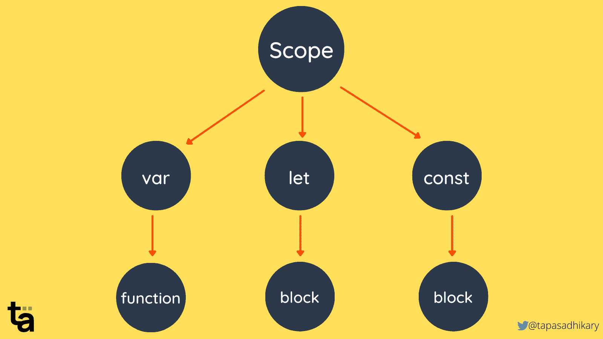
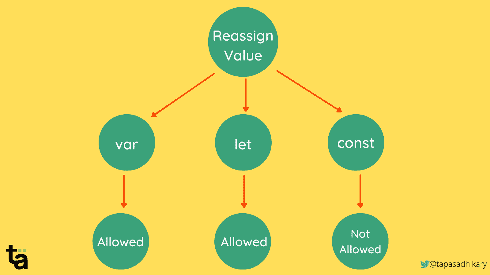
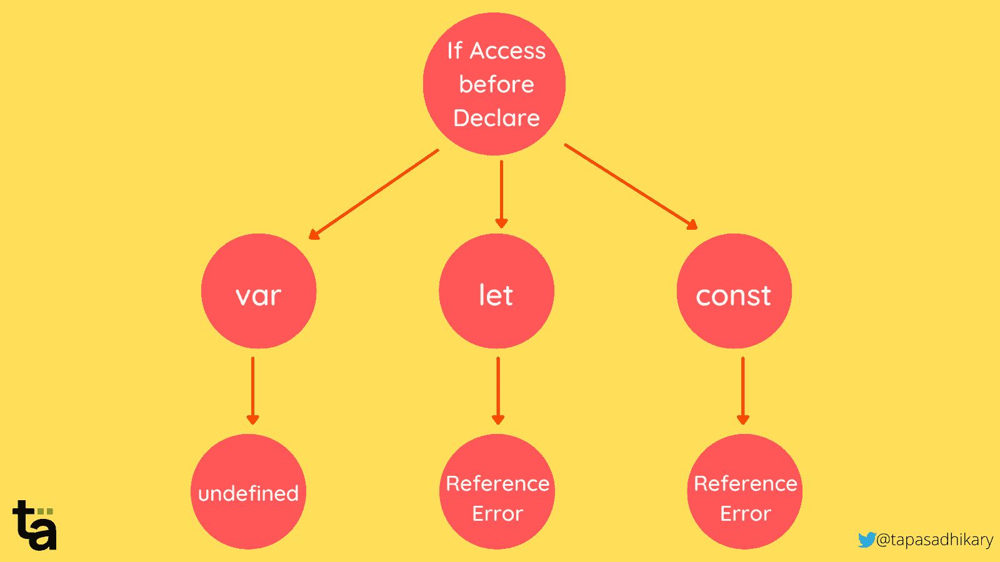

# let、const 和 var 关键字在 JavaScript 中的工作方式

> 原文：<https://www.freecodecamp.org/news/understanding-let-const-and-var-keywords/>

作为一名 JavaScript 初学者，您可能已经学习了如何声明变量和赋值。

在旧的、ES6 之前的 JavaScript 时代，开发人员习惯于使用关键字`var`或者不使用任何关键字来声明变量。但是时代变了！

随着 ES6 (EcmaScript 2015)的出现，JavaScript 的现代时代开始了，这种语言有了两个新的关键字来帮助我们声明变量。这些是`let`和`const`。

在这篇文章中，我们将通过例子了解所有这些关键词(是的，包括`var`)，我们将看到何时使用它们，何时不使用它们。

如果你也喜欢从视频内容中学习，这篇文章也可以在 YouTube 视频教程中找到:🙂

[https://www.youtube.com/embed/ehn_BcusA_c?feature=oembed](https://www.youtube.com/embed/ehn_BcusA_c?feature=oembed)

Btw，这是一个被广泛讨论的话题。那么，为什么又要写呢？这些关键词可能很难学，因为:

1.  许多开发人员试图互换使用它们(尤其是`let`和另外两个)。
2.  有时，您可能会对这些关键字与一个叫做`Scope`的基本 JavaScript 概念之间的关系感到困惑。

因此，本文旨在在三个基本概念的背景下教授这些关键词。我希望你喜欢读它。

## 如何在 JavaScript 中声明变量

在 JavaScript 中，我们可以用三种不同的方式声明变量，如下所示:

```
// Without keywords. It is essentially the same as var 
// and not allowed in 'strict' mode.
name = 'Jack'; 

// Using var
var price = 100;

// Using let
let isPermanent = false; 

// Using const
const PUBLICATION = 'freeCodeCamp' 
```

理解 var、let 和 const 这三个概念是最好的:

*   范围
*   重新分配新值
*   当您在声明变量之前访问它时

这些关键字在这些概念的用法上有所不同。让我们看看怎么做。

## JavaScript 中的变量范围

在 JavaScript 中，我们使用范围作为一种方式来确定在哪里以及是否可以使用变量。变量可能存在于块内、函数内或函数和块外。

那么，什么是街区呢？块(即代码块)是我们用一对花括号({...}).大概是这样的:

```
{
  let name = "alex";
} 
```

另一方面，函数是一堆你想逻辑地放在一起的代码指令。

通常，您使用关键字`function`和一个名称来定义一个函数。请注意，您可以定义一个没有名称的函数，我们称之为`anonymous function`。但为了简单起见，我们不会在今天的文章中讨论这个问题。

这里有一个名为`test`的函数。

```
function test() {
  let name = "alex";
} 
```

块或函数之外的任何东西，我们称之为`Global`。因此，当我们声明变量时，它们可以存在于块内、函数内或块/函数外——也就是说，它们具有全局范围。

主要有三种类型的范围:

*   块范围
*   功能范围
*   全球范围

三个关键词`var`、`let`和`const`围绕这些范围工作。所以让我们来理解事物是如何组合在一起的。

### 如何在块范围内使用 JavaScript 变量

如果你**不想让`{ }`块中声明的变量**在块外被访问，你需要使用`let`或`const`关键字来声明它们。在`{ }`块**内用`var`关键字声明的变量在块外也是**可访问的。所以，要小心。

让我们举个例子:

```
{
    let f_name  = 'Alex';
    const ZIP = 500067;
    var age = 25;
}

console.log(f_name); // Uncaught ReferenceError: f_name is not defined
console.log(ZIP);  // Uncaught ReferenceError: ZIP is not defined
console.log(age);  // 25
```

如您所见，age 变量的值可能会在不知不觉中被覆盖，并最终引入一个 bug。所以，这个故事的寓意是，

> 不要在块内使用`var`关键字(块范围)。总是用`let`和`const`来代替。

### 如何在函数范围内使用 JavaScript 变量

使用这些关键字在函数内部声明的变量在函数外部是**不**可访问的。这就是应用的功能范围。

无论使用 var、let 还是 const，都是如此。在函数内部，它们在管理变量范围方面非常相似。

让我们再举一个例子:

```
// f1() is a function

function f1() {
 let f_name = "Alex";
 const ZIP = 560089;
 var age = 25;   
}

f1();

console.log(f_name); // Uncaught ReferenceError: f_name is not defined
console.log(ZIP);  // Uncaught ReferenceError: ZIP is not defined
console.log(age);  // Uncaught ReferenceError: age is not defined
```

正如您在上面看到的，没有一个变量可以在函数外部访问，甚至是使用`var`声明的`age`也不行。所以，结论是，

> 在函数内部用`var`声明的变量在函数外部是不可访问的。关键字`var`有函数作用域。

### 如何在全局范围内使用 JavaScript 变量

在任何函数和块之外声明的变量都是`global`，并被称为具有`Global Scope`。这意味着您可以从当前 JavaScript 程序的任何部分访问它们。

你可以使用`var`、`let`和`const`来声明全局变量。但是你不应该经常这样做。

```
let f_name = "Alex";
 const ZIP = 560089;
 var age = 25;  

// f1() is a function
function f1() {
  console.log(f_name); // Alex
  console.log(ZIP);  // 560089
  console.log(age);  // 25
}

f1();

console.log(f_name); // Alex
console.log(ZIP);  // 560089
console.log(age);  // 25
```

如你所见，变量随处可见。

因此，要使用`var`、`let`和`const`关键字限制变量的范围，下面是范围内可访问性的顺序，从最低开始:

*   `var`:功能范围级别
*   `let`:闭塞范围级别
*   `const`:闭塞范围级别

下图显示了这三个关键词在不同范围内的思维导图。



让我们继续下一个概念，来理解当我们给一个变量重新赋值时，这三个关键字是如何影响代码的行为的。

## 如何在 JavaScript 中给变量重新赋值

一旦你用`var`或`let`声明了一个变量，你**可以**在你的编程流程中给这个变量重新赋值。如果变量是可访问的，则可以赋值。但是有了`const`，你**根本不能**重新赋值。

```
// Declare variables with initial values
let f_name = "Alex";
const ZIP = 560089;
var age = 25;

// Reassign values
f_name = "Bob"; // the f_name value is 'Bob"
ZIP = 65457; // Uncaught TypeError: Assignment to constant variable.
age = 78; // the age value is 78
```

你必须意识到`const`有一个棘手的部分。当一个对象被声明并用`const`赋值时，你仍然可以改变它的`properties`的值。但是不能将另一个对象值重新赋给同一个变量。这是许多开发人员常犯的错误。

请点击此处查看示例:

```
const blog = {
    'url': 'https://greenroots.info'
}

blog.url = 'https://blog.greenroots.info"; //Allowed

blog = {}; // Uncaught TypeError: Assignment to constant variable.
```

这里有一个思维导图，可以帮助你理解如何对用这三个关键字声明的变量进行重新赋值。



## 在 JavaScript 中声明变量之前访问它会发生什么

作为一个务实的程序员，你不应该试图访问一个没有声明的变量。但是万一发生这种情况，让我们看看变量会如何表现。

当`var`处于非严格模式时，变量将有一个`undefined`值。这意味着一个变量已经被声明但是没有赋值。

在严格模式下，你会得到一个`ReferenceError`变量没有声明。

有了`let`和`const`，如果你试图在声明之前访问一个变量，你总是会得到一个`ReferenceError`。

这里有一个思维导图来帮助你直观地理解它。在思维导图中，`var`被描绘为非严格模式。



就这些，朋友们。你需要考虑这些情况和概念来评估`var`、`let`和`const`的行为。所以，规则是这样的:

*   不要再用`var`了。
*   使用`let`或`const`。
*   多使用`const`。当需要给变量重新赋值时，使用`let`。
*   不要试图在没有声明的情况下访问变量。

## 在结束之前...

这就是`let`、`const`、`var`背后的故事。我希望你觉得这篇文章很有见地，内容丰富。如果你想进一步讨论，我的 DMs 在`Twitter`开放。

我们来连线。我也在这些平台上分享我在 JavaScript、Web 开发和博客方面的学习:

*   [在 Twitter 上关注我](https://twitter.com/tapasadhikary)
*   [订阅我的 YouTube 频道](https://www.youtube.com/tapasadhikary?sub_confirmation=1)
*   [GitHub 上的侧项目](https://github.com/atapas)

我的下一篇文章再见。在那之前，请照顾好自己，保持快乐。