# 2022 年 React 初学者指南

> 原文：<https://www.freecodecamp.org/news/react-beginners-guide/>

因此，您已经准备好开始学习 React，但是您仍然有一些挥之不去的问题，例如:

*   我应该如何创建我的 React 项目？
*   我应该在我的 React 应用程序中添加什么工具？
*   *学习 React 前需要先学习 JavaScript 吗？*
*   我应该在哪里部署我的项目？

如果你正在寻找这些问题(以及更多)的答案，这份简单、全面的指南就是为你准备的。

它将为您提供开始学习和使用 React 所需的一切，而不是拼凑几十个过时的初学者教程。

我们开始吧！

> 我已经帮助了 100 多人从完全的初学者到受雇的 React 开发人员。想做同样的事吗？查看 [**反应训练营**](https://reactbootcamp.com) 。

## 目录

*   要使用 React，我需要在电脑上安装什么？
*   我应该如何创建我的 React 项目？
*   我实际上需要学习哪些 React 概念？
*   我需要学习每个 React 特性吗？
*   在 React 之前，我需要学习 JavaScript 吗？
*   我应该使用什么样的 React 库？
*   我应该在哪里部署我的 React 项目？
*   [应该从哪里学 React？](#where-should-i-learn-react)

## 我需要在电脑上安装什么？

要在您的计算机上构建完整的 React 项目，每个开发人员都需要一些基本工具:

*   [节点/ NPM](https://nodejs.org) (我推荐安装“LTS”版本)
*   一个好的代码编辑器(我推荐 [Visual Studio 代码](https://code.visualstudio.com)
*   Git(在[Git-SCM.com](https://git-scm.com/)安装，并在[Github.com](https://github.com)创建一个免费账户)

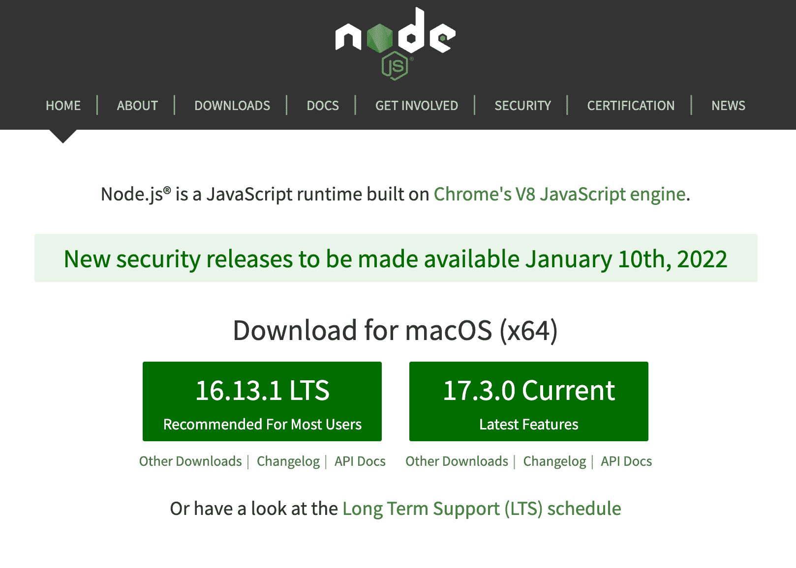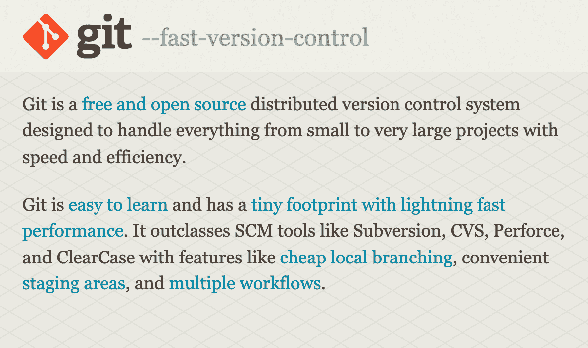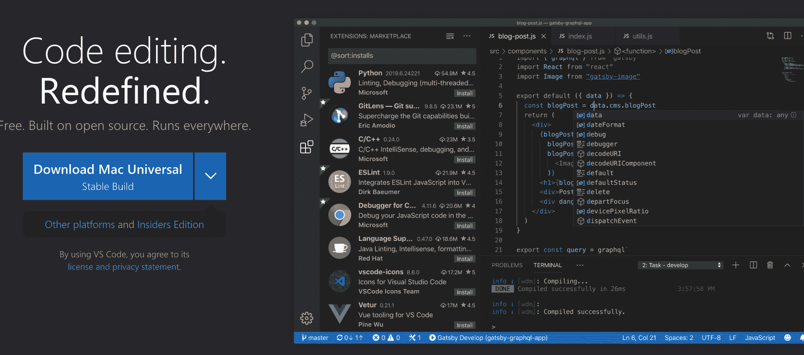

Node, Git, and Visual Studio Code

**节点**被定义为 JavaScript 运行时。当与像 **NPM** (在安装 Node 的同时获得)这样的包管理器结合使用时，它将成为一个强大的工具来轻松管理 React 项目中的库。

如果没有 Node 和 NPM，如果你想在 React 项目中添加一个新的 JavaScript 库(比如 [day.js](https://day.js.org/) ，一个用于格式化日期的库)，你需要手动添加一组`<script>`标签并自己管理它们。

有了 Node 和 NPM(或另一个包管理器，如 Yarn)，我们可以简单地运行一个命令来安装我们喜欢的任何 JavaScript 库。要安装 day.js，我们可以运行:

```
npm install dayjs
```

NPM 会自动获取该库的代码，并将其添加到我们的`node_modules`文件夹✨中

**注意**:创建 React 项目不需要节点/ NPM。但它让你可以使用有用的工具，如 [Create React App](https://create-react-app.dev/) 和 [Next.js](https://nextjs.org) ，让管理 React 应用程序变得更加容易。

一个好的代码编辑器对于能够:

*   轻松管理 React 项目中的所有文件和文件夹
*   提供语法突出显示，以使我们的代码更易于阅读
*   使用集成终端运行命令来开发、测试和构建我们的项目
*   安装扩展以提供额外的有用功能

Visual Studio Code (或 [VSCode](https://code.visualstudio.com) )做了所有这些事情，并且除了完全免费之外，还为 React 开发提供了很好的默认设置。

最后， **Git** 和 **GitHub** 对于保存您对 React 项目所做的更改是必不可少的。Git 为您提供了“版本控制”，这是一个工具的花哨名称，它使您能够保存代码并在必要时恢复过去的保存。

GitHub 也是必不可少的，因为它允许我们远程保存所有代码，也就是说，保存在我们的 GitHub 帐户上。你可以用 Git 保存你的代码和你对它所做的修改，然后把所有这些修改“推”到你的 GitHub 账户。

因此，GitHub 既是我们在 React 项目上所做的所有工作的有用备份，也是其他人查看我们的代码并对其进行更改的重要途径。

## 我应该如何创建我的 React 项目？

如果您正在启动一个新的 React 项目，您将永远不需要创建自己的文件、文件夹和 package.json 文件(您在其中列出了项目的所有库)。

有三个很棒的工具可以帮助您在一个命令中立即生成一个新的 React 项目。

*   创建 React 应用
*   轻快地
*   Next.js

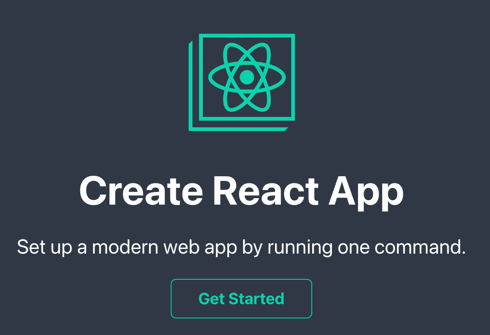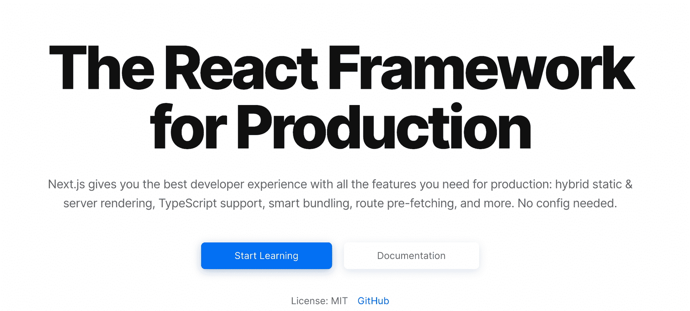

Create React App, Vite, and Next.js

一旦安装了节点/ NPM(参见本文开头)，就可以使用这些工具中的任何一个，通过以下命令创建一个新的 React 项目:

```
# for Create React App
npx create-react-app my-react-app

# for Vite
npm init vite@latest my-react-app --template react 

# for Next.js
npx create
```

**Create React App** 是一种成熟可靠的创建新 React 项目的方法，它为您提供了运行、开发和构建项目以进行部署的基本工具和脚本。

Create React App 使用 Babel 和 Webpack 来传输和捆绑您的代码(简而言之，使其有可能在浏览器中运行)。

此外，它还提供了一些很棒的开发工具，比如 ESLint 来“Lint”您的代码，或者在您编写代码时告诉您代码中的问题。

另一方面，Vite 使用与 Create React 应用不同的捆绑器。它不使用 Webpack，而是使用一个名为 ESBuild 的捆绑器，速度快几个数量级。

简而言之，Vite(法语“快”或“迅速”)是一个更新、更快的创建 React 应用程序的替代方案。

要知道其中一个东西和其他的不一样，也就是 **Next.js** 。

值得一提的是，Next.js 是一个 React *框架*，这意味着它是一种“包含电池”的方式来构建 React 应用程序，并包括大量 React 本身不包含的功能。

我之所以包含 Next.js，是因为它可以说是创建 React 应用程序最快、最简单的方法。一旦你了解了 React 的基础知识，你将会看到 Next 的特性如何让你更快地构建更完整的 React 应用。

但是，如果你想要一个更小的东西，而不需要在你的电脑上创建文件夹、文件和安装依赖项呢？

**注意** : node_modules 文件夹通常包含大约 1000 个文件夹，用于存储项目的依赖关系和对等依赖关系，这些文件夹总共会占用您计算机上数千兆字节的空间！

让 React 项目运转起来的一个很好的方法是在浏览器中进行，有很多免费的服务可以让你立即这样做。⚡️

可以在浏览器中创建 React 项目的两个沙盒服务包括:

*   [CodeSandbox](https://codesandbox.io)
*   [栈闪电](https://stackblitz.com)

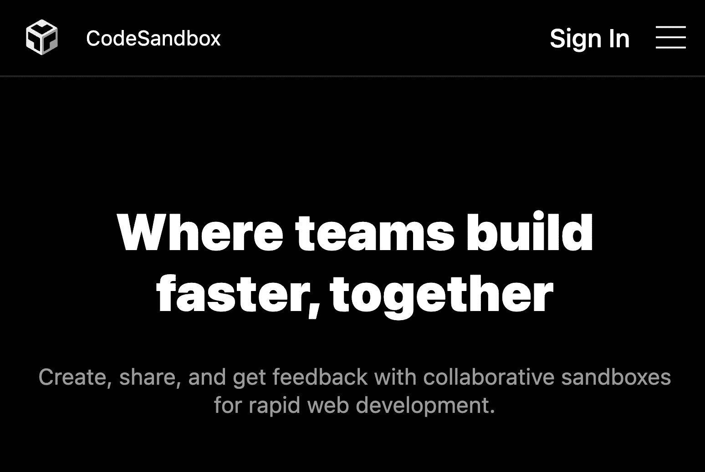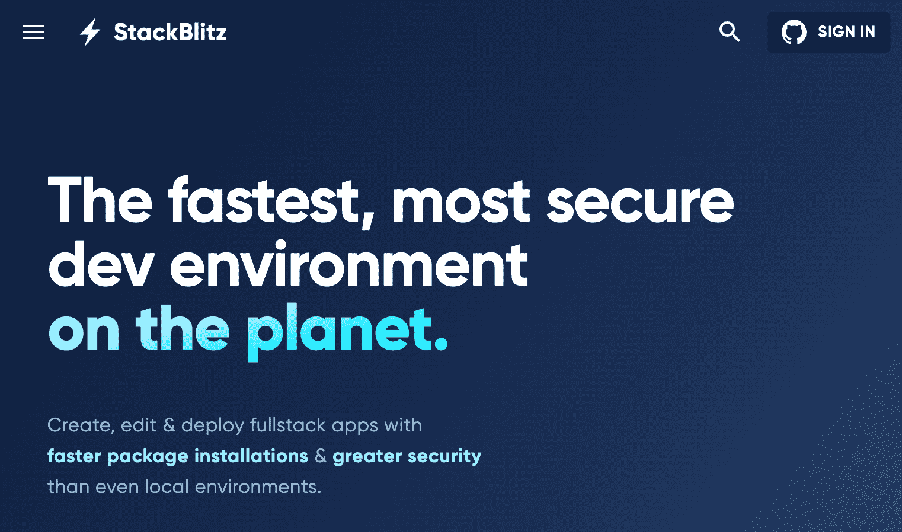

CodeSandbox and StackBlitz

当你跟随一个教程或者如果你想在运行中测试一些代码的时候，这些是很好的选择。

我发现创建一个新的 React 项目的最快方法是转到地址 [react.new](https://react.new) 。没错——您可以在几秒钟内创建一个全新的 React 项目，而无需运行任何命令！

## 我实际上需要学习哪些 React 概念？

React 有大量的新概念，给了我们一种新的方式来思考在 web 上构建应用程序。

如果你没有构建 React 应用的第一手经验，你如何知道你将需要哪些概念和特性？

好的一面是，你不需要全部。事实上，当您开始构建 React 项目时，您会发现 90%的工作都使用相同的特性。

对于每天在 React 工作的人来说，这些包括:

*   JSX
*   组件(特别是功能组件)
*   道具和状态
*   列表、键和事件
*   核心反应钩子，主要有`useState`、`useEffect`
*   反应上下文，包括`useContext`
*   如何编写自定义的 React 钩子

了解 React 的基本工作原理以及创建它是为了解决什么问题也很重要。这些概念包括:

*   渲染和重新渲染(尤其是知道什么会导致重新渲染)
*   纯函数
*   副作用
*   不变

最后，我相信至少熟悉 React 类组件是值得的。有了钩子，我们很大程度上转向使用功能组件。但是，您会遇到类组件，尤其是如果您正在处理一个较旧的代码库。

如果您想要一个全面的列表，我已经在一个方便的备忘单中总结了所有主要的 React 概念，我相信每个开发人员都应该知道。您可以在这里找到它:

[React cheat sheet(+真实世界的例子)](https://www.freecodecamp.org/news/react-cheatsheet-with-real-world-examples/)

## 我需要学习每一个 React 特性/概念/钩子吗？

不，你不知道。把重点放在我在上面问题中提到的主要概念上。

事实上，即使是最专业的开发人员也很少使用许多钩子和 React 特性。仅仅因为它的存在并不意味着你会需要它，你也不需要花同样的时间去学习每一个 React 概念。

例如，我每天都使用 React，用一只手就能数出我需要`useLayoutEffect`钩子(一个更模糊的 React 钩子)的次数。

## React 之前需要学习 JavaScript 吗？

因为 React 从根本上来说是一个 JavaScript 库，它以“只是 JavaScript”而自豪，所以如果你打算学习 React，你最终也需要精通 JavaScript。

在我尝试学习 React 之前，我亲自学习了 JavaScript，我相信它对我帮助很大。尽管其他许多人声称可以从 React 开始，但最终你会被扔进一个充满 JavaScript 的世界。

也就是说，你对 JavaScript 掌握得越好，在 React 中构建东西的能力就越强。你可以同时学习两者，可以说，最终所有的 React 开发人员都还在学习 JavaScript。

简而言之，你可以在不擅长 JavaScript 的情况下开始学习 React，但是，不要认为你可以完全推迟学习 JavaScript。

如果您想确切地知道作为 React 开发人员您将使用哪些 JavaScript 技能，请务必查看这篇文章:

【React 所需的 JavaScript 技能

## 我应该使用什么样的 React 库？

有数千个 React 库可以在您的 React 项目中使用。

React 是一个非个人化的库，而不是一个框架。许多构建项目所需的工具在 React 中根本不可用。

React 没有为编写样式、动画组件、管理全局应用程序状态或创建路线或页面提供自己的解决方案。

要构建任何重要的 React 项目，您需要熟悉各种库，以提供您需要的功能。

我可以写一系列文章，介绍我认为哪些 React 库是最好的，以及为什么，但这是我个人的候选名单:

*   状态管理用 **Zustand** (Redux 用 Redux 工具包还是不错的)
*   对于造型，使用 **TailwindCSS**
*   对于路由，使用 **React 路由器** (React 位置也是有希望的)
*   对于数据获取，使用**反应查询**
*   对于表单，使用**反应钩子表单**

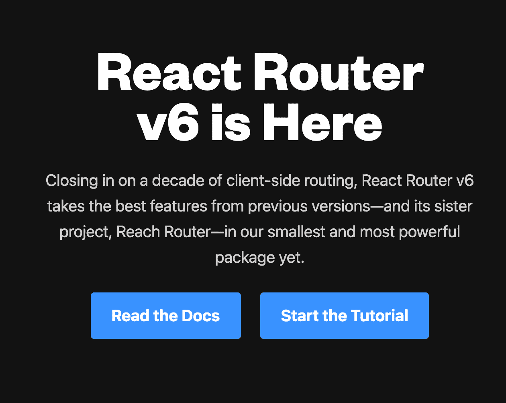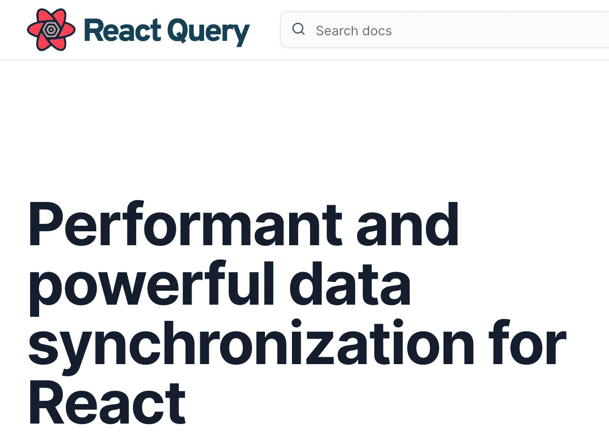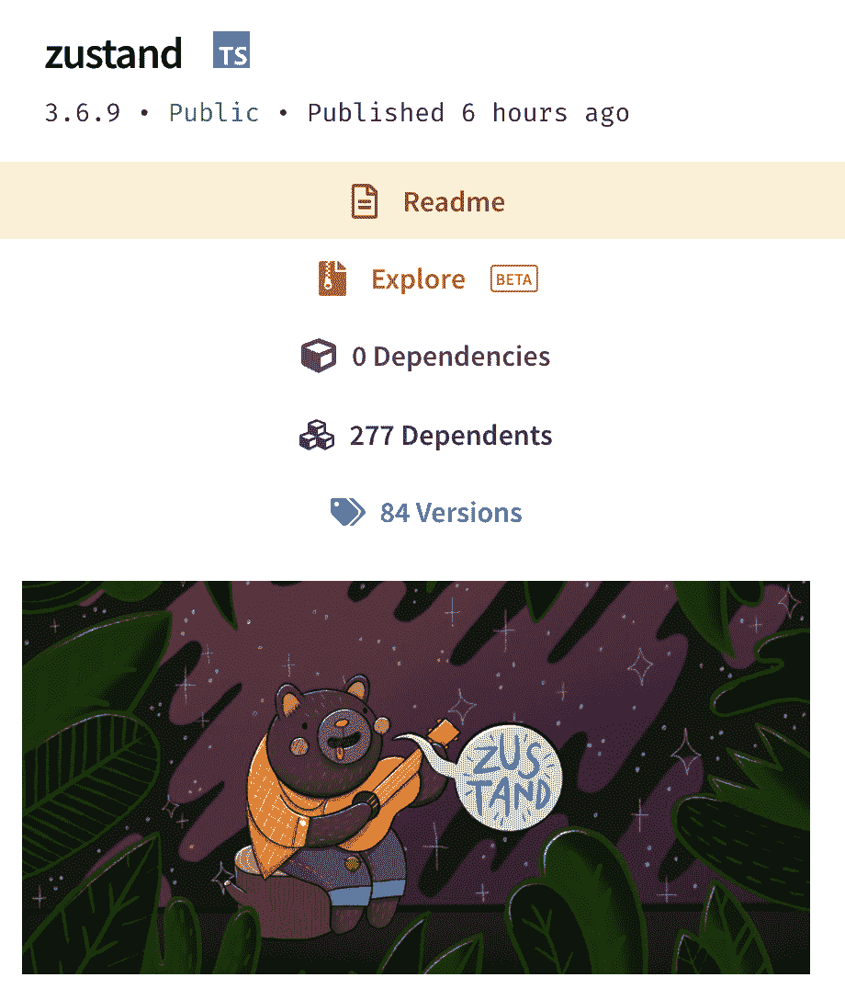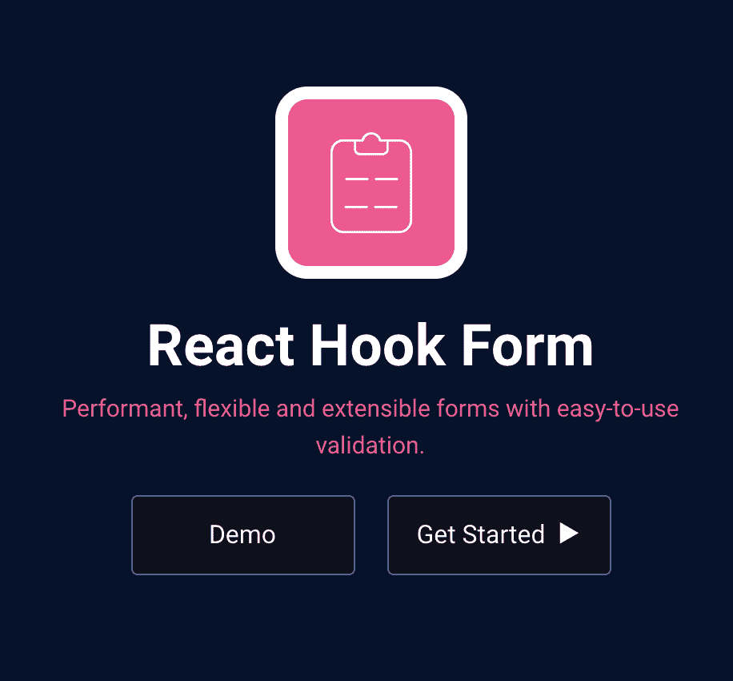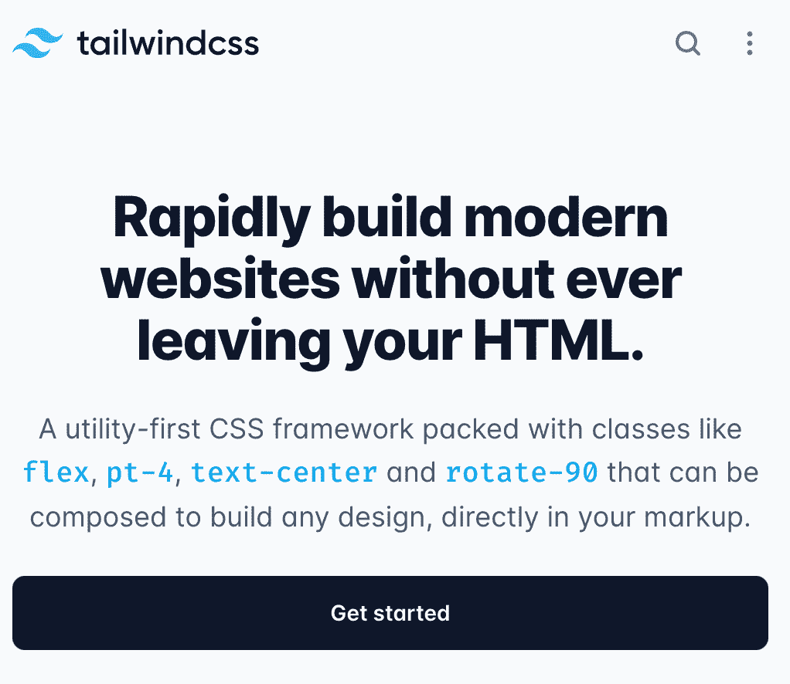

Top 5 React Libraries

如果您想要一份清单，列出大多数 React 项目值得使用的库，请查看这篇文章:

[5 个反应库每个项目都需要](https://www.freecodecamp.org/news/5-react-libraries-every-project-needs/)

## 我应该在哪里部署我的 React 项目？

幸运的是，我对这个问题的回答与其他问题非常相似——有许多部署 React 项目的好方法。

如果您部署的 React 项目是使用 Create React App 工具或构建工具 Vite 创建的，那么您构建的项目将由简单的 HTML、CSS 和 JavaScript 文件组成。

这意味着您的项目可以部署到任何可以托管静态资产的服务，例如:

*   [浪涌](https://surge.sh/)
*   github pages
*   甚至一个 AWS S3 桶也可以托管您的 React 站点

有大量选项可供选择，但我强烈建议您将应用部署到以下任何一种服务:

*   [Netlify](https://netlify.com)
*   [Vercel](https://vercel.com) (best for Next.js)
*   [Cloudflare Pages](https://pages.cloudflare.com)

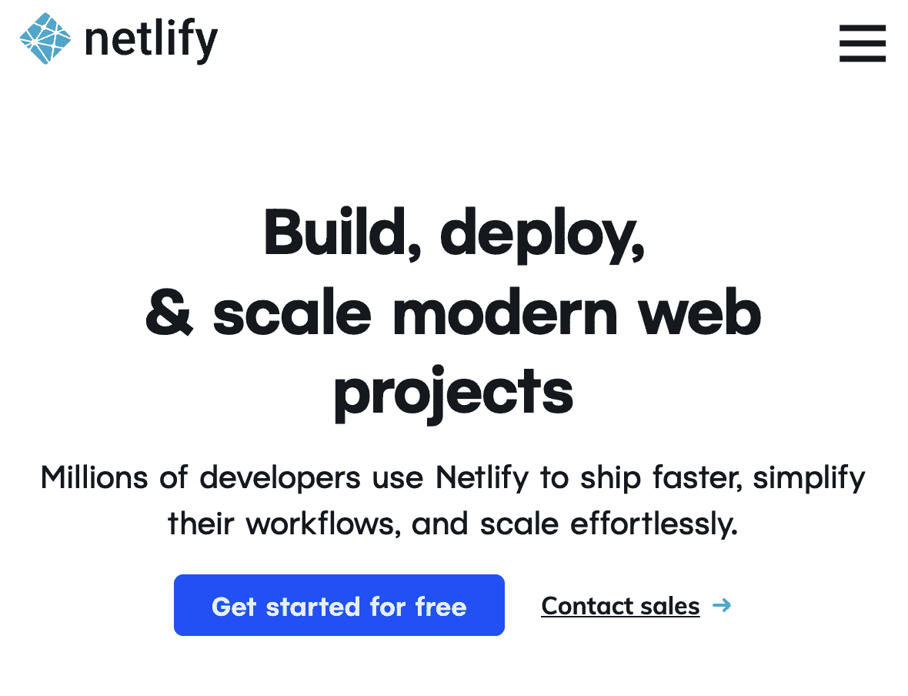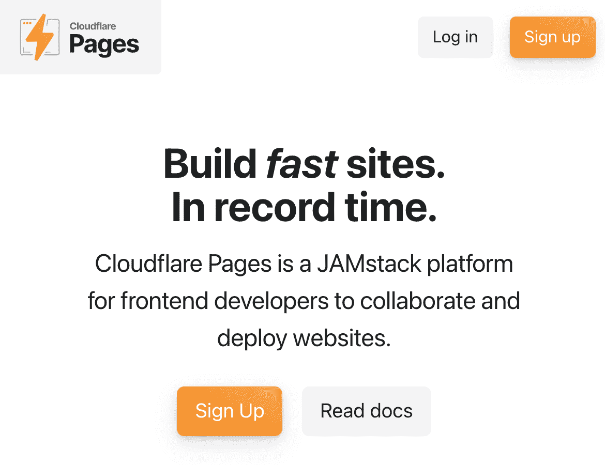

Netlify, Vercel and Cloudflare Pages

我已经广泛使用了所有这些服务来托管我自己的 React 项目，每一个都提供了很好的开发人员体验。

所有这些服务最大的便利在于，你可以立即使用储存在你的 GitHub 账户上的项目，每当你对它们进行新的修改时，你的站点就会根据这些修改进行重建和部署。

值得注意的是，这三种服务都有一个慷慨的免费层，所以你不必支付任何费用就可以在网上获得你的 React 应用。

然而，他们的免费等级有一个警告。Netlify 和 Vercel 都在其免费计划中规定了每月 100GB 的带宽限制。如果你的网站每月的访问者少于 100，000 人，并且不包含大量的重资产，比如大图片和视频，你就不应该担心达到这个限制。

在这三者中，Cloudflare 拥有静态主机提供商中最慷慨的免费计划，带宽不受限制。

如果您对将 React 应用部署到 Cloudflare 页面感兴趣，我已经编写了完整的指南，您可以在此处查看:

[如何使用 Cloudflare 页面自动部署 React 应用](https://www.freecodecamp.org/news/how-to-auto-deploy-your-react-apps-with-cloudflare-pages/)

## 我应该在哪里学习反应？

现在有大量的学习资源。数量如此之多，以至于很难找出哪些是最新的、有用的。

你能做的最好的事情是找到一个有用的教程，并按照它完成，而不是试图一次参加几个。

> "追逐两只兔子的人一只也没抓到."

如果你刚刚开始，看看 freeCodeCamp 的 React 课程就知道了。请务必利用我在每一节分享的所有链接。这两种资源将带你走很长的路。

如果你正在寻找一个一体化的解决方案，从构建 Instagram 等全栈应用程序的最基本步骤开始学习 React，请查看[**React boot camp**](https://reactbootcamp.com)。

React Bootcamp 是我制作的一个全面的视频课程，它将教你从初学者到专业 React 开发人员所需要知道的一切。

[](http://bit.ly/join-react-bootcamp) 
*点击此处获得您的席位*