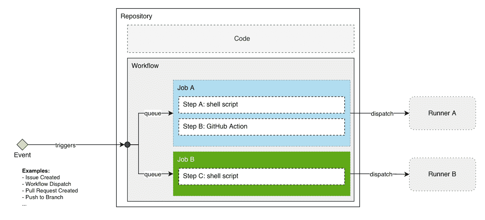
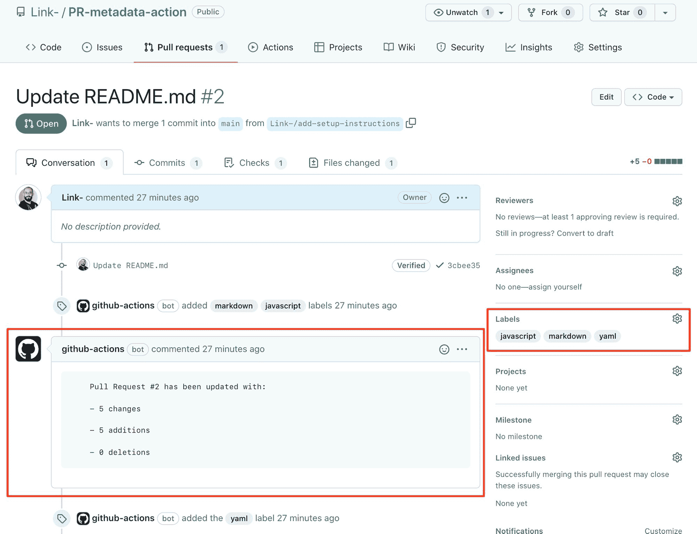
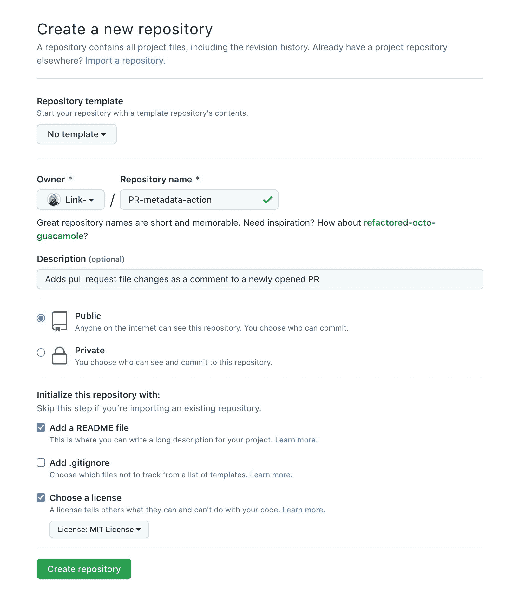
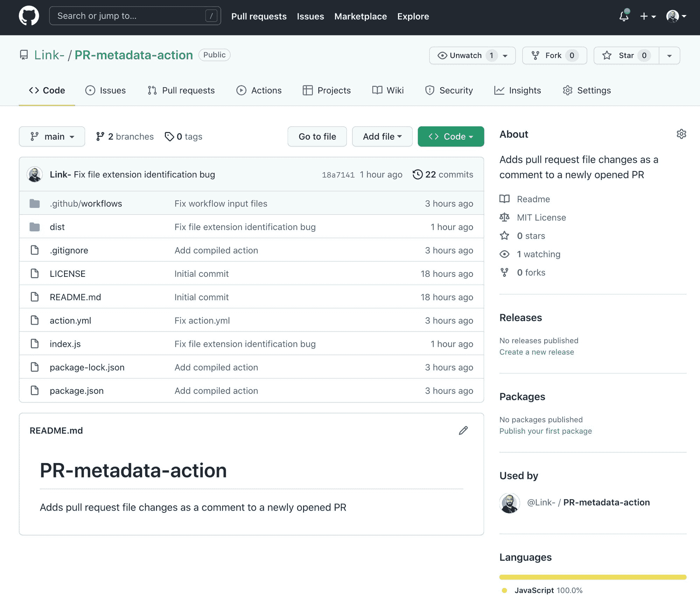
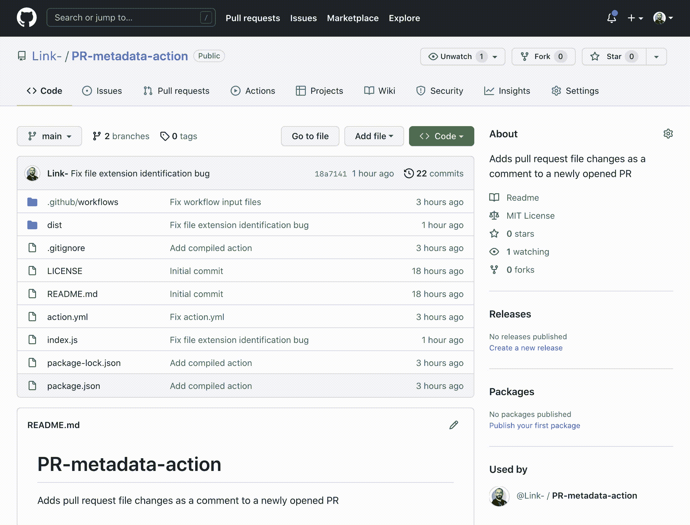

# 如何构建您的第一个 JavaScript GitHub 动作

> 原文：<https://www.freecodecamp.org/news/build-your-first-javascript-github-action/>

我喜欢使用 GitHub Actions。它们易于使用，但功能强大。当我看到人们在使用他们来自动化不同的任务时是多么有创造力时，我特别兴奋。

我希望你也有同样的力量。这就是为什么我要向您展示如何用几个步骤创建您的第一个自定义 JavaScript 动作。

让我们开始吃吧。

## 什么是 GitHub 动作？

首先，我们需要区分“GitHub Actions”和“Action”。前者是产品的名称，后者是自定义代码，您可以将其作为完成任务的一个步骤包含在工作流作业中。

例如，一个动作可以将你的代码发布给一个包管理器，比如 [npm](https://www.npmjs.com/) 或者 [yarn](https://yarnpkg.com/) 。它还可以与短信服务提供商集成，在您的回购中出现紧急问题时向您发出警报。或者它可以在您创建新的拉取请求时打开咖啡机。

你能做的事情是无限的！

## GitHub 动作的组成部分是什么？

在我们开始编写代码之前，理解 GitHub 操作的构建块对我们来说很重要。



让我们从左向右分解这个图表:

1.  **事件**:触发动作的事件。它表示存储库中将触发工作流运行的活动。
2.  **工作流**:这是事件发生时运行的工作流。
3.  **作业**:为完成一项任务而按顺序运行的一组步骤。每个作业都在其自己的运行程序上运行。
4.  **步骤**:一个步骤或者是一个 shell 脚本，或者是一个将在为该步骤所属的作业分配的运行程序上运行的动作。
5.  **Runner**:Runner 是一个虚拟机(或者任何支持操作系统的计算机)，它运行一个任务中的步骤。

这在 GitHub 的大量文档中有很好的解释，你可以在这里阅读更多关于组件[的内容。](https://docs.github.com/en/actions/learn-github-actions/understanding-github-actions#the-components-of-github-actions)

## 我何时需要创建行动？

由于每一步都可以是一个 shell 脚本或一个操作，我们如何决定选择哪个选项呢？

如果您对以下任何一个问题回答“是”，那么您最好创建一个行动:

1.  其他人会从你创造的行为中受益并实际上重用它吗？
2.  是否需要构建无法用 shell 脚本编写的复杂逻辑？
3.  你会使用任何第三方库吗？
4.  需要对第三方服务进行 API 调用吗？
5.  您有能力维护这些代码并发布修复或更新吗？
6.  您需要能够在不同的操作系统上运行此操作吗？
7.  你精通 JavaScript 却不精通 Bash 或 PowerShell 吗？
8.  你想学做一个吗？

## 让我们创造我们的行动

我们将构建一个动作，每当在我们的存储库上打开一个 pull 请求时，该动作将创建一个注释，并根据更改的文件类型添加标签。该注释将包含拉请求中引入的更改的摘要。



### 1.创建一个空的公共知识库

让我们首先创建一个名为`PR-metadata-action`的空 GitHub 存储库。这将是我们用来存储我们的操作的存储库。

它必须是公开的，否则我们将无法在工作流程中使用它。



### 2.在本地克隆存储库并初始化节点项目

转到您希望存储操作存储库的文件夹。然后，让我们在我们的机器上克隆存储库:

```
$ git clone git@github.com:Link-/PR-metadata-action.git
Cloning into 'PR-metadata-action'...
remote: Enumerating objects: 4, done.
remote: Counting objects: 100% (4/4), done.
remote: Compressing objects: 100% (4/4), done.
Receiving objects: 100% (4/4), done.
remote: Total 4 (delta 0), reused 0 (delta 0), pack-reused 0 
```

在我们新创建的存储库文件夹中，让我们初始化一个新的 Node.js 项目:

```
$ cd PR-metadata-action/
$ npm init -y
Wrote to /Users/link-/PR-metadata-action/package.json:

{
  "name": "pr-metadata-action",
  "version": "1.0.0",
  "description": "Adds pull request file changes as a comment to a newly opened PR",
  "main": "index.js",
  "scripts": {
    "test": "echo \"Error: no test specified\" && exit 1"
  },
  "repository": {
    "type": "git",
    "url": "git+https://github.com/Link-/PR-metadata-action.git"
  },
  "keywords": [],
  "author": "",
  "license": "ISC",
  "bugs": {
    "url": "https://github.com/Link-/PR-metadata-action/issues"
  },
  "homepage": "https://github.com/Link-/PR-metadata-action#readme"
} 
```

### 3.创建操作元数据文件

让我们来创造`action.yml`。这个文件非常重要，因为它将定义我们操作的`interface`:

*   **输入**:包含动作在运行时预期使用的数据的参数
*   **输出**:动作完成后设置的数据。这次我们的行动不会有结果。
*   **runs** :指定动作的执行运行时间，在本例中为 node16

阅读更多关于[元数据文件语法](https://docs.github.com/en/actions/creating-actions/metadata-syntax-for-github-actions)的信息。

```
name: 'PR Metadata Action'
description: 'Adds pull request file changes as a comment to a newly opened PR'
inputs:
  owner:
    description: 'The owner of the repository'
    required: true
  repo:
    description: 'The name of the repository'
    required: true
  pr_number:
    description: 'The number of the pull request'
    required: true
  token:
    description: 'The token to use to access the GitHub API'
    required: true
runs:
  using: 'node16'
  main: 'index.js' 
```

### 4.添加操作工具包包

GitHub 已经创建了一个开源软件开发工具包(SDK ),这将使您在创建动作时更加轻松。

我们今天将使用的两个主要产品包是:

*   [@actions/core](https://github.com/actions/toolkit/tree/main/packages/core) :这个包包含动作的核心功能，比如包含当前运行信息的`context`对象，包含动作参数的`inputs`对象，以及包含动作完成后设置的数据的`outputs`对象。

*   [@actions/github](https://github.com/actions/toolkit/tree/main/packages/github) :这个包包含 GitHub API REST 客户端，我们将使用它与 GitHub API 进行交互。

```
$ npm install @actions/core
added 3 packages, and audited 4 packages in 1s

found 0 vulnerabilities

$ npm install @actions/github
added 21 packages, and audited 25 packages in 1s

found 0 vulnerabilities 
```

我们的文件夹结构现在应该是这样的:

```
/Users/link-/PR-metadata-action
├── LICENSE
├── README.md
├── action.yml
├── node_modules
├── package-lock.json
└── package.json

1 directory, 6 files 
```

### 5.写动作

在这个阶段创建一个`.gitignore`文件是很重要的，这样可以避免将不必要的文件推送到存储库中。

我经常使用的一个很棒的工具是:[https://www.toptal.com/developers/gitignore](https://www.toptal.com/developers/gitignore)

我的`.gitignore`文件是:

```
https://www.toptal.com/developers/gitignore/api/visualstudiocode,macos,node 
```

创建一个特定于您的环境和项目的。

我们终于准备好创建我们的`index.js`文件了。这就是我们行动的全部逻辑所在。我们当然可以有一个更复杂的结构，但是现在一个文件就够了。

我已经对下面的所有代码做了注释，这样你就可以一步一步地知道发生了什么。

```
const core = require('@actions/core');
const github = require('@actions/github');

const main = async () => {
  try {
    /**
     * We need to fetch all the inputs that were provided to our action
     * and store them in variables for us to use.
     **/
    const owner = core.getInput('owner', { required: true });
    const repo = core.getInput('repo', { required: true });
    const pr_number = core.getInput('pr_number', { required: true });
    const token = core.getInput('token', { required: true });

    /**
     * Now we need to create an instance of Octokit which will use to call
     * GitHub's REST API endpoints.
     * We will pass the token as an argument to the constructor. This token
     * will be used to authenticate our requests.
     * You can find all the information about how to use Octokit here:
     * https://octokit.github.io/rest.js/v18
     **/
    const octokit = new github.getOctokit(token);

    /**
     * We need to fetch the list of files that were changes in the Pull Request
     * and store them in a variable.
     * We use octokit.paginate() to automatically loop over all the pages of the
     * results.
     * Reference: https://octokit.github.io/rest.js/v18#pulls-list-files
     */
    const { data: changedFiles } = await octokit.rest.pulls.listFiles({
      owner,
      repo,
      pull_number: pr_number,
    });

    /**
     * Contains the sum of all the additions, deletions, and changes
     * in all the files in the Pull Request.
     **/
    let diffData = {
      additions: 0,
      deletions: 0,
      changes: 0
    };

    // Reference for how to use Array.reduce():
    // https://developer.mozilla.org/en-US/docs/Web/JavaScript/Reference/Global_Objects/Array/Reduce
    diffData = changedFiles.reduce((acc, file) => {
      acc.additions += file.additions;
      acc.deletions += file.deletions;
      acc.changes += file.changes;
      return acc;
    }, diffData);

    /**
     * Loop over all the files changed in the PR and add labels according 
     * to files types.
     **/
    for (const file of changedFiles) {
      /**
       * Add labels according to file types.
       */
      const fileExtension = file.filename.split('.').pop();
      switch(fileExtension) {
        case 'md':
          await octokit.rest.issues.addLabels({
            owner,
            repo,
            issue_number: pr_number,
            labels: ['markdown'],
          });
        case 'js':
          await octokit.rest.issues.addLabels({
            owner,
            repo,
            issue_number: pr_number,
            labels: ['javascript'],
          });
        case 'yml':
          await octokit.rest.issues.addLabels({
            owner,
            repo,
            issue_number: pr_number,
            labels: ['yaml'],
          });
        case 'yaml':
          await octokit.rest.issues.addLabels({
            owner,
            repo,
            issue_number: pr_number,
            labels: ['yaml'],
          });
      }
    }

    /**
     * Create a comment on the PR with the information we compiled from the
     * list of changed files.
     */
    await octokit.rest.issues.createComment({
      owner,
      repo,
      issue_number: pr_number,
      body: `
        Pull Request #${pr_number} has been updated with: \n
        - ${diffData.changes} changes \n
        - ${diffData.additions} additions \n
        - ${diffData.deletions} deletions \n
      `
    });

  } catch (error) {
    core.setFailed(error.message);
  }
}

// Call the main function to run the action
main(); 
```

### 6.将我们的行动文件推送到 GitHub

让我们将文件暂存、提交并推送到上游的主分支:

```
$ git status
On branch main
Your branch is up to date with 'origin/main'.

Untracked files:
  (use "git add <file>..." to include in what will be committed)
 .gitignore
 action.yml
 index.js
 package-lock.json
 package.json

nothing added to commit but untracked files present (use "git add" to track) 
```

让我们添加所有要转移的文件:

```
$ git add . 
```

现在我们可以提交我们的更改:

```
$ git commit -m "Add main action structure"
[main 1fc5d18] Add main action structure
 5 files changed, 686 insertions(+)
 create mode 100644 .gitignore
 create mode 100644 action.yml
 create mode 100644 index.js
 create mode 100644 package-lock.json
 create mode 100644 package.json 
```

推动我们的变革:

```
$ git push origin main
Enumerating objects: 8, done.
Counting objects: 100% (8/8), done.
Delta compression using up to 16 threads
Compressing objects: 100% (7/7), done.
Writing objects: 100% (7/7), 5.82 KiB | 5.82 MiB/s, done.
Total 7 (delta 0), reused 0 (delta 0), pack-reused 0
To github.com:Link-/PR-metadata-action.git
   457fee2..1fc5d18  main -> main 
```

### 7.如何测试我们的行动

为了能够测试我们的动作，我们需要创建一个包。如果您在上一步中注意到了，我们没有推送包含我们在构建`index.js`文件时使用的包的`node_modules`文件夹。

没有这些包裹，我们的行动就无法进行！为了解决这个问题，我们可以使用一个叫做 [ncc](https://github.com/vercel/ncc) 的好工具。它将帮助我们创建一个文件，其中包含我们的代码和运行我们的操作所需的所有包。

让我们从安装`ncc`开始:

```
$ npm install @vercel/ncc

added 1 package, and audited 26 packages in 5s

found 0 vulnerabilities 
```

编译我们的 JavaScript 就像运行:

```
$ ncc build index.js -o dist
ncc: Version 0.22.1
ncc: Compiling file index.js
530kB  dist/index.js
530kB  [845ms] - ncc 0.22.1 
```

这将创建一个名为`dist`的新目录，并创建一个名为`index.js`的文件，其中包含我们的代码和运行我们的操作所需的所有包。

现在我们需要确保我们的`action.yml`文件包含正确的`runs`部分。您需要更换:

```
runs:
  using: 'node16'
  main: 'index.js' 
```

使用:

```
runs:
  using: 'node16'
  main: 'dist/index.js' 
```

让我们再一次将我们的更改推向上游(到我们的 GitHub 库)。确保我们的`dist/`文件夹不在`.gitignore`文件中:

```
$ git status
$ git add .
$ git commit -m "Add compiled action"
[main adfc4f0] Add compiled action
 4 files changed, 8505 insertions(+), 3 deletions(-)
 create mode 100644 dist/index.js
$ git push origin main 
```

我们终于准备好创建我们的工作流了！在相同或任何其他存储库中(公共或私有无关紧要)创建新工作流，如下所示:

```
mkdir -p .github/workflows
touch .github/workflows/pr-metadata.yaml 
```

将以下工作流程复制到我们的`pr-metadata.yaml`文件中:

```
name: PR metadata annotation

on: 
  pull_request:
    types: [opened, reopened, synchronize]

jobs:

  annotate-pr:
    runs-on: ubuntu-latest
    name: Annotates pull request with metadata
    steps:
      - name: Annotate PR
        uses: link-/PR-metadata-action@main
        with:
          owner: ${{ github.repository_owner }}
          repo: ${{ github.event.repository.name }}
          pr_number: ${{ github.event.number }}
          token: ${{ secrets.GITHUB_TOKEN }} 
```

完成所有这些步骤后，我们的存储库应该如下所示:



为了让我们测试这个工作流，我们需要在我们的存储库中进行更改，并创建一个拉请求(PR)。我们可以通过直接在 GitHub 上编辑`README.md`文件来做到这一点:



## GitHub 操作最佳实践

最后，我想与您分享一些创建自定义操作的最佳实践:

*   采用单一责任原则。确保你的行动**只做一件事**。这将使你的代码更容易维护和测试。

*   好好考虑你的动作的接口(输入和输出)。减少可选输入的数量，让你的界面简单明了。

*   我们在本教程中没有这样做，但是您需要**验证您的动作输入！**通过验证输入，可以消除大多数安全项目。

*   确保你的**动作是等幂的**，也就是说，如果你在一个序列中多次运行这个动作，结果应该总是一样的。在我们的例子中，动作应该执行并发布一个评论并添加标签，或者它应该优雅地退出。

*   阅读并**遵循[GitHub 文档](https://docs.github.com/en/actions/security-guides/security-hardening-for-github-actions)中记录的安全强化最佳实践**。

*   如果你不能维持它，不要创建新的行动。**在市场中搜索类似的行动，并使用它们代替**。

## 结论

在本教程中，我们创建了一个自定义操作，该操作对拉请求中的更改摘要进行注释，并为被修改的文件类型添加标签。

您应该能够重用这些步骤来创建更复杂的动作，可以做更多的事情！

我正在使用 GitHub Actions 创建一个完整的 DevOps 课程。如果您正在寻找关于如何使用 Actions 进行持续集成、持续交付或 gitOps(以及许多其他主题)的更深入的信息，请关注这些视频:

[https://www.youtube.com/embed/Ftq1yFwPJQ4?feature=oembed](https://www.youtube.com/embed/Ftq1yFwPJQ4?feature=oembed)

编码快乐！