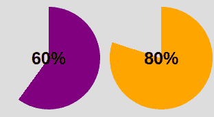
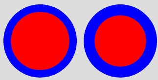
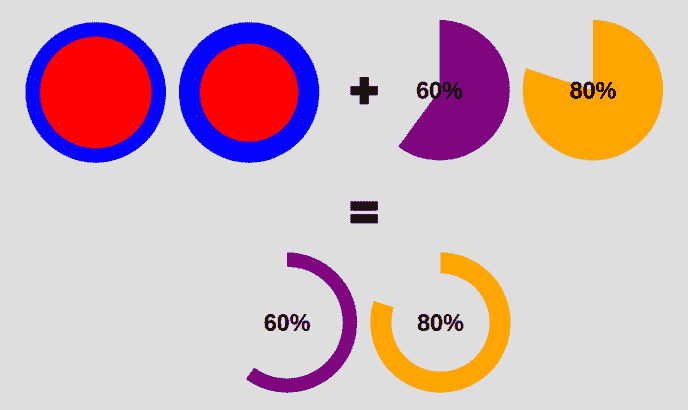
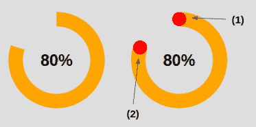
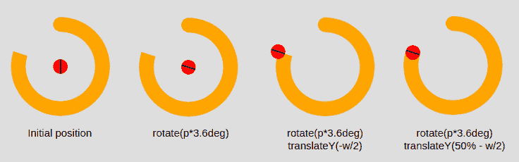

# 如何只用 CSS 创建一个饼图

> 原文：<https://www.freecodecamp.org/news/css-only-pie-chart/>

饼图是显示整体的一部分的常见组件，您可以将它们用于许多不同的目的。

您会发现很多关于构建这样一个组件的文章，但是它们通常要么依赖于 SVG，要么依赖于大量的 HTML 元素。

在这篇文章中，我将向你展示如何使用 CSS 和一个元素创建一个饼状图。

下面是我们正在构建的内容的概述:

<details><summary>Click to see the full code</summary>

```
<div class="pie" style="--p:20"> 20%</div>
<div class="pie" style="--p:40;--c:darkblue;--b:10px"> 40%</div>
<div class="pie no-round" style="--p:60;--c:purple;--b:15px"> 60%</div>
<div class="pie animate no-round" style="--p:80;--c:orange;"> 80%</div>
<div class="pie animate" style="--p:90;--c:lightgreen"> 90%</div> 
```

```
@property --p{
  syntax: '<number>';
  inherits: true;
  initial-value: 1;
}

.pie {
  --p:20;
  --b:22px;
  --c:darkred;
  --w:150px;

  width: var(--w);
  aspect-ratio: 1;
  position: relative;
  display: inline-grid;
  margin: 5px;
  place-content: center;
  font-size: 25px;
  font-weight: bold;
  font-family: sans-serif;
}
.pie:before,
.pie:after {
  content: "";
  position: absolute;
  border-radius: 50%;
}
.pie:before {
  inset: 0;
  background:
    radial-gradient(farthest-side,var(--c) 98%,#0000) top/var(--b) var(--b) no-repeat,
    conic-gradient(var(--c) calc(var(--p)*1%),#0000 0);
  -webkit-mask: radial-gradient(farthest-side,#0000 calc(99% - var(--b)),#000 calc(100% - var(--b)));
          mask: radial-gradient(farthest-side,#0000 calc(99% - var(--b)),#000 calc(100% - var(--b)));
}
.pie:after {
  inset: calc(50% - var(--b)/2);
  background: var(--c);
  transform: rotate(calc(var(--p)*3.6deg)) translateY(calc(50% - var(--w)/2));
}
.animate {
  animation: p 1s .5s both;
}
.no-round:before {
  background-size: 0 0, auto;
}
.no-round:after {
  content: none;
}
@keyframes p{
  from{--p:0}
} 
```</details> 

[https://codepen.io/t_afif/embed/preview/XWaPXZO?default-tabs=css%2Cresult&height=300&host=https%3A%2F%2Fcodepen.io&slug-hash=XWaPXZO](https://codepen.io/t_afif/embed/preview/XWaPXZO?default-tabs=css%2Cresult&height=300&host=https%3A%2F%2Fcodepen.io&slug-hash=XWaPXZO)

CSS-Only Pie Chart

正如你在上面的代码笔中看到的，我们有一个静态的饼状图，一个动态的饼状图，我们也可以有圆形的边缘。所有这一切都只需要一个`<div>`元素。

除此之外，我们可以使用 CSS 变量轻松地调整不同的值，这样我们就不必为更改 CSS 代码而费心。

我知道代码乍一看可能有点难，但是通读下面的解释后，你将能够自信地制作你自己的饼状图。

## 饼图的 HTML 结构

正如我上面提到的，我们有一个单独的`<div>`，在这里我们添加百分比值(饼图的进度)作为主要内容:

```
<div class="pie" style="--p:60;--b:10px;--c:purple;">60%</div>
```

我们还添加 CSS 变量作为内嵌样式。

*   `--p`:该变量应包含一个数字形式的百分比值(不带`%`符号)。应该和内容一样。
*   `--b`:该变量将定义边框的粗细。
*   `--c`:该变量将定义主色。

出于本文和演示的考虑，我使用一个单字符变量来保持代码简短。但是在生产环境中使用代码时，最好考虑更明确的变量。例子:`--percentage`、`--border-thickness`和`--main-color`。

## 饼图的 CSS 设置

我们首先开始设计我们的内容。这部分很简单，代码如下:

```
.pie {
  --w: 150px;
  width: var(--w);
  aspect-ratio: 1;
  display: inline-grid;
  place-content: center;
  margin: 5px;
  font-size: 25px;
  font-weight: bold;
  font-family: sans-serif;
}
```

我将元素定义为`inline-grid`，以便使用`place-content: center`轻松地将内容放在中间。我们使用`aspect-ratio: 1`来确保元素保持方形。我们也可以使用`height: var(--w)`，但是学习和使用一个新的 CSS 属性总是好的。

你可能想知道为什么我使用一个变量来定义宽度，而不是简单地设置`width: 150px`。我需要知道将来使用的宽度值，所以我将它定义为一个变量。

所有剩下的 CSS 都是设计文本样式的基础。你可以随意更新它。

让我们进入有趣的部分——组件的主要形状。为此，我们将使用具有以下样式的伪元素:

```
.pie:before{
  content: "";
  position: absolute;
  border-radius: 50%;
  inset: 0;
  background: conic-gradient(var(--c) calc(var(--p)*1%),#0000 0);
}
```

由于`inset: 0`，具有`position: absolute`的伪元素覆盖了所有区域。是的，这又是一个新的 CSS 属性，它是`top`、`right`、`bottom`和`right`的简写(你可以[在这里](https://developer.mozilla.org/en-US/docs/Web/CSS/inset)了解更多)。

然后我们把它做成一个圆(`border-radius: 50%`)并应用一个`conic-gradient()`。注意我们定义为内嵌样式的 CSS 变量的使用(`--c`表示颜色，`--p`表示百分比)。

到目前为止，这会给我们带来以下结果:



Conic-gradient applied to pseudo-element

我们越来越近了！这个`conic-gradient()`给了我们一个双色渐变。从`0%`到`p%`，主色和剩余部分是透明色(用十六进制值`#0000`定义)。

为了只保留边界部分，我们将使用`mask`隐藏中间部分。这次我们将使用一个`radial-gradient()`:

```
radial-gradient(farthest-side,red calc(99% - var(--b)),blue calc(100% - var(--b)))
```

作为背景应用的上述内容将为我们提供以下信息:



Illustration of the radial-gradient

注意变量`--b`的使用，它定义了边框的厚度(在上面显示为蓝色)。

现在想象红色部分是不可见部分，蓝色部分是可见部分。如果我们对`mask`属性使用相同的渐变，我们将得到如下结果:



Applying mask to the pseudo element

我们有一个包含一个元素和几行 CSS 代码的饼状图。

```
.pie {
  --w:150px;

  width: var(--w);
  aspect-ratio: 1;
  position: relative;
  display: inline-grid;
  place-content: center;
  margin: 5px;
  font-size: 25px;
  font-weight: bold;
  font-family: sans-serif;
}
.pie:before {
  content: "";
  position: absolute;
  border-radius: 50%;
  inset: 0;
  background: conic-gradient(var(--c) calc(var(--p)*1%),#0000 0);
  -webkit-mask:radial-gradient(farthest-side,#0000 calc(99% - var(--b)),#000 calc(100% - var(--b)));
          mask:radial-gradient(farthest-side,#0000 calc(99% - var(--b)),#000 calc(100% - var(--b)));
}
```

和 HTML:

```
<div class="pie" style="--p:60;--b:10px;--c:purple;">60%</div>
```

### 如何添加圆角边缘

为此，我将添加一个额外的梯度层来圆化顶部边缘，并添加一个伪元素来圆化另一个边缘。这里有一个例子来理解这个技巧:



Illustration of the rounded edges

代码为(1)的上边缘为圆形:

```
.pie:before {
  background:
    radial-gradient(farthest-side,var(--c) 98%,#0000) top/var(--b) var(--b) no-repeat,
    conic-gradient(var(--c) calc(var(--p)*1%),#0000 0);
}
```

除了`conic-gradient()`之外，我们还在顶部添加了一个`radial-gradient()`，其大小等于由`--b`定义的边框粗细。

(2)圆化另一边的代码:

```
.pie:after {
  content: "";
  position: absolute;
  border-radius: 50%;
  inset: calc(50% - var(--b)/2);
  background: var(--c);
  transform: rotate(calc(var(--p)*3.6deg)) translateY(calc(50% - var(--w)/2));
}
```

`inset`属性将伪元素的大小设置为等于`--b`。记住这是`top`、`right`、`bottom`和`left`的简写。如果我们有

```
left = right = 50% - b/2
```

这意味着我们从每一侧向中心移动，减去等于`b/2`的偏移量，因此我们最终的宽度等于`2*b/2 = b`。同样的高度逻辑。

现在我们需要正确地放置我们的元素，这就是我们使用 transform 属性的原因。我们的元素最初放置在中心，所以我们需要首先旋转它。有了百分比，我们使用三个的[法则来得到角度:](https://en.wikipedia.org/wiki/Cross-multiplication#Rule_of_three)

```
angle = percentage*360deg/100
```

然后我们进行翻译，这里我们将需要宽度，因为我们必须执行一半宽度的翻译(`w/2`)。

好吧，好吧——你可能会在这些公式中有点迷失。在下面找到一个插图来理解 transform 属性背后的逻辑



Applying the transform property to the pseudo-element

之后，我们用主色`--c`给伪元素上色，就完成了。我们有圆形边缘的饼图。

## 如何制作饼图动画

静态饼图很好，但动画饼图更好！为此，我们将从`0`到定义值的百分比值`--p`制作动画。默认情况下，我们不能动画化 CSS 变量，但是多亏了[新的`@property`功能](https://developer.mozilla.org/en-US/docs/Web/CSS/@property)，现在可以了。

我们注册变量:

```
@property --p{
  syntax: '<number>';
  inherits: true;
  initial-value: 0;
}
```

我们创建一个`keyframes`:

```
@keyframes p {
  from {--p:0}
}
```

注意，我们只需要指定`from`。这样，默认情况下，浏览器将使`to`等于我们定义的值(`<div class="pie" style="--p:60;">60%</div>`)。

最后，我们称之为动画。您可以根据需要定义持续时间/延迟。

```
animation: p 1s .5s both;
```

不幸的是，这种技术没有得到广泛的支持。你可以在基于 Chromium 的浏览器(Chrome 和 Edge)上测试它，但它在 Firefox 和 Safari 上会失败。您可以查看[我能否使用](https://caniuse.com/?search=%40property')来跟踪支持。

在我们结束之前，这里再次是最终工作产品的完整代码和演示。你可以看到我使用了两个类来控制圆角边和动画，这样我们可以根据需要轻松地添加/删除它们。

<details><summary>Click to see the full code</summary>

```
<div class="pie" style="--p:20"> 20%</div>
<div class="pie" style="--p:40;--c:darkblue;--b:10px"> 40%</div>
<div class="pie no-round" style="--p:60;--c:purple;--b:15px"> 60%</div>
<div class="pie animate no-round" style="--p:80;--c:orange;"> 80%</div>
<div class="pie animate" style="--p:90;--c:lightgreen"> 90%</div> 
```

```
@property --p{
  syntax: '<number>';
  inherits: true;
  initial-value: 1;
}

.pie {
  --p:20;
  --b:22px;
  --c:darkred;
  --w:150px;

  width: var(--w);
  aspect-ratio: 1;
  position: relative;
  display: inline-grid;
  margin: 5px;
  place-content: center;
  font-size: 25px;
  font-weight: bold;
  font-family: sans-serif;
}
.pie:before,
.pie:after {
  content: "";
  position: absolute;
  border-radius: 50%;
}
.pie:before {
  inset: 0;
  background:
    radial-gradient(farthest-side,var(--c) 98%,#0000) top/var(--b) var(--b) no-repeat,
    conic-gradient(var(--c) calc(var(--p)*1%),#0000 0);
  -webkit-mask: radial-gradient(farthest-side,#0000 calc(99% - var(--b)),#000 calc(100% - var(--b)));
          mask: radial-gradient(farthest-side,#0000 calc(99% - var(--b)),#000 calc(100% - var(--b)));
}
.pie:after {
  inset: calc(50% - var(--b)/2);
  background: var(--c);
  transform: rotate(calc(var(--p)*3.6deg)) translateY(calc(50% - var(--w)/2));
}
.animate {
  animation: p 1s .5s both;
}
.no-round:before {
  background-size: 0 0, auto;
}
.no-round:after {
  content: none;
}
@keyframes p{
  from{--p:0}
} 
```</details> 

[https://codepen.io/t_afif/embed/preview/XWaPXZO?default-tabs=css%2Cresult&height=300&host=https%3A%2F%2Fcodepen.io&slug-hash=XWaPXZO](https://codepen.io/t_afif/embed/preview/XWaPXZO?default-tabs=css%2Cresult&height=300&host=https%3A%2F%2Fcodepen.io&slug-hash=XWaPXZO)

感谢您的阅读！

更多 CSS 技巧，请关注我的 Twitter。
想支持我？你可以[给我买杯咖啡](https://www.buymeacoffee.com/afif)