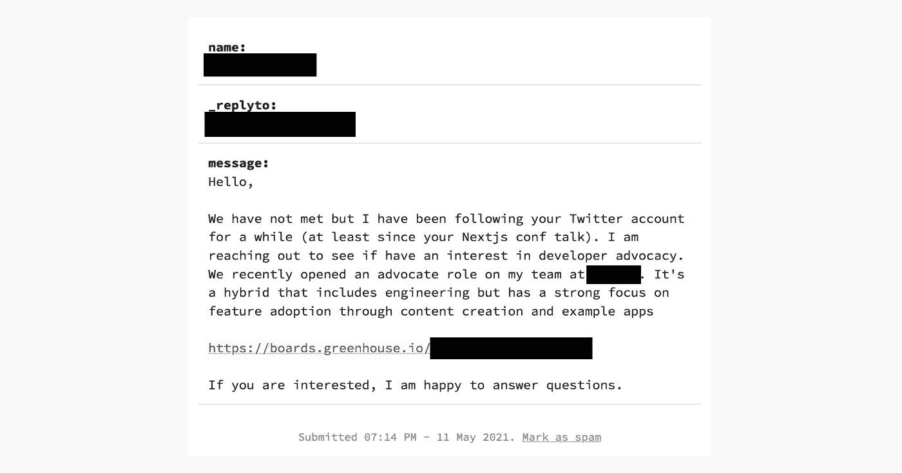
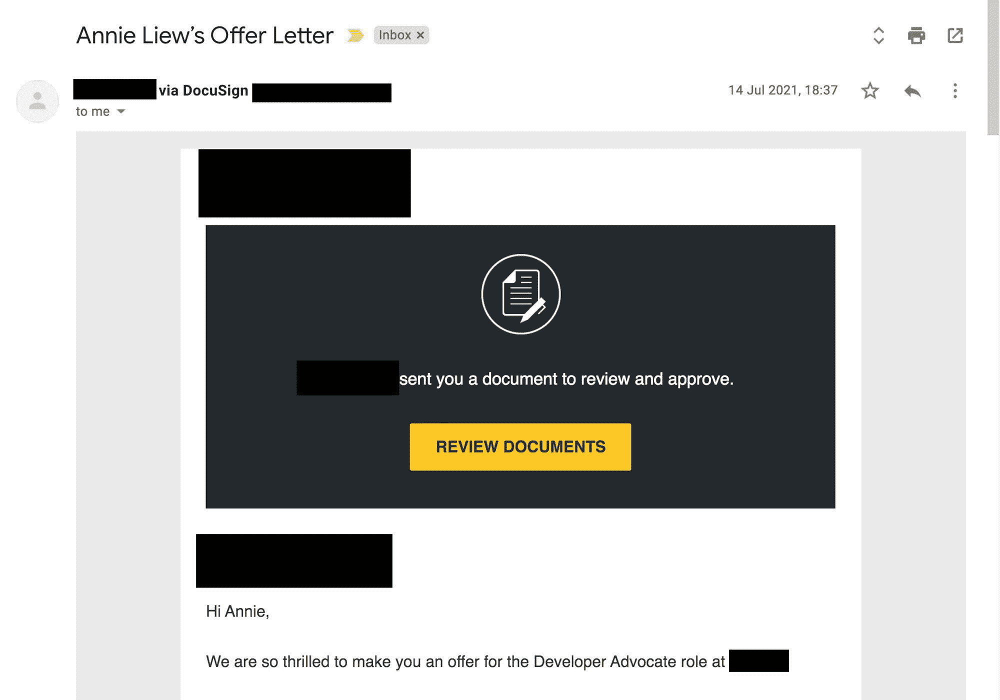
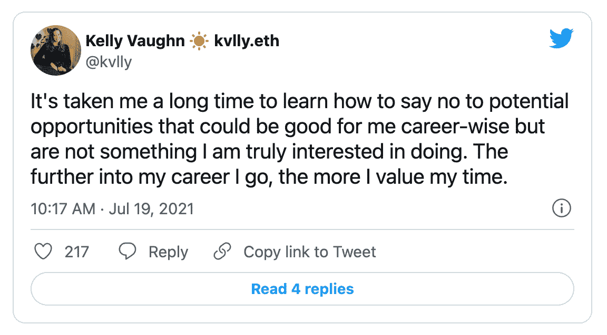
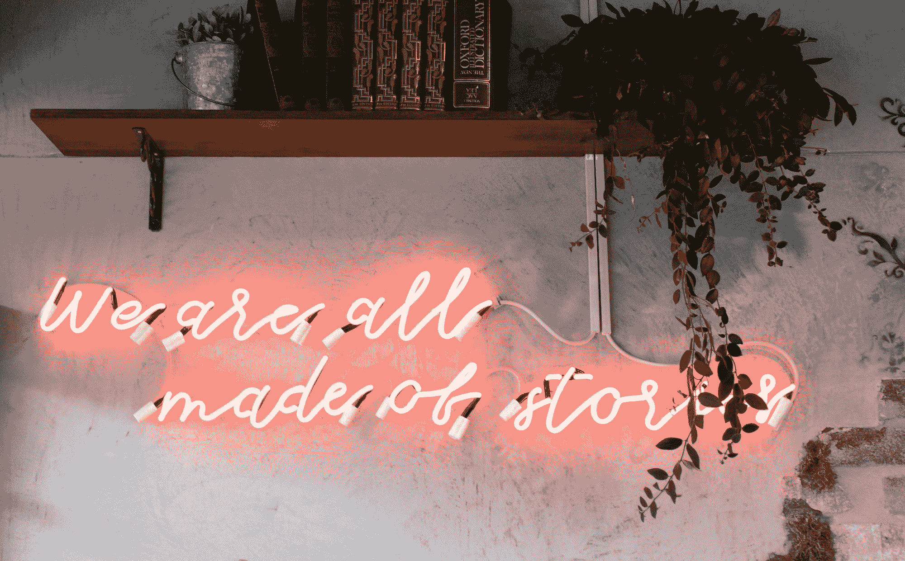

# 为什么我拒绝了大科技公司六位数的薪水，留在一家五人创业公司

> 原文：<https://www.freecodecamp.org/news/why-i-turned-down-a-six-figure-salary-in-big-tech-to-stay-at-a-five-person-startup/>

离开编码训练营两年后，我收到了一份来自世界上最受尊敬的科技公司之一的难以置信的邀请，但我拒绝了。

****从理论上来说，这是梦寐以求的工作。见鬼，这将是我迄今为止一生中做过的最“成人化”的工作。股票，奖金，难以置信的福利，声望，和一个不可思议的全远程团队。****

这绝对会让我的事业飞黄腾达。我简历上的名字将打开通向未来成功的大门、机会和道路。我再也不用担心如何支付账单了。

我花了六次面试和一个带回家的项目才得到这份工作。那我为什么拒绝了呢？

拒绝这样一个角色可不是一个小决定，尤其是考虑到经济上的影响。来自其他人的个人轶事帮助我做了决定，我想分享我的故事和过程，*。*

# 这一切是如何开始的

## 我是谁？

嗨，我是安妮。我是一名澳大利亚多学科设计师，2019 年 7 月从一个[加拿大前端开发训练营](https://junocollege.com/blog/finding-your-passion-people-and-purpose-a-juno-bootcamp-alums-journey-into-tech?source=annie)毕业。我也曾在日本、[做过英语教师，也做过各种各样的随机工作。](https://twitter.com/anniebombanie_/status/1291340012076838913?s=20)

我在 bootcamp 之外的第一份开发工作是在一个小型的 WordPress VIP 代理处，我在那里工作了一年多一点。2020 年 10 月，我跳槽到了 SaaS 的一家 B2B 初创公司 [Pastel](https://www.usepastel.com/) ，成为他们的第一名员工。(我目前是这里的前端工程主管。)2021 年 7 月，我收到了世界上最大、最受欢迎的科技公司之一的邀请。

这是一次疯狂的旅行。

## 那封邮件

现在是 2021 年 5 月。我刚刚收到一封来自一家大型科技公司经理的电子邮件，询问我是否有兴趣在他们不断发展的团队中担任开发人员宣传职位。

我立刻认为他们犯了一个错误。

很明显，他们不是故意给 **我** 发邮件的。在最初的震惊之后，我意识到他们已经花时间在我的网站上填写了表格。慢慢地我明白了，是的，他们*T5*是指我。

此时，我几乎不知道什么是开发人员倡导，但我对此很好奇。他们是通过 Twitter 找到我的，这个角色听起来会涉及很多我已经在兼职做的事情。我是说，谁不想为他们在空闲时间做的事情得到报酬呢，对吗？

然而，我真的很喜欢我的新工作，最初我打算拒绝面试的机会。我把这个消息分享给了一个好朋友，一个我信任的经验丰富的高级工程师。长话短说，他全大写吼我，提醒我， **【一直在采访】** 。

事情就是这样开始的。

## 深入开发人员宣传

在接下来的几个月里，我做了尽职调查，尽我所能研究开发人员宣传/关系。我很想了解这个角色以及它将涉及的内容。我读了很多文章，包括与安吉·琼斯(Angie Jones)的这个非常有用的问答&。

我非常幸运能够通过 Twitter 和我更广泛的关系联系到当前的开发者拥护者。我征求了在这个职位上有多年经验的人的意见。通过电话和信息，他们分享了成长阶梯、薪水、经历、期望和职位的利弊。

我在随意的纸片上草草记下笔记，然后全吸收进去，试图构建一幅全面的画面，描绘出我的日常生活可能会是什么样子，既包括这个角色本身，也包括我在这家特定公司的生活。

## 面试过程

在和我的朋友谈过之后，我做的第一件事就是安排一次和联系过的经理的非正式通话。我对团队努力实现的目标有了很好的印象，并觉得这是一个我可以很好合作的人。

我决定进行正式的第一步，那就是和招聘经理谈话。在这里，我得到了该团队及其当前计划的高级概述。对我来说，这是一个问更多问题的机会，也是一个了解可能与我共事的人的机会。之后，我必须在进一步发展之前签署一份 NDA 协议，所以我不会谈论任何细节。

下一阶段是一个带回家的项目。我有两周的时间为公司的开发团队准备一份演示文稿。我选择了一些技术和概念，将它们融合在一起，并加入我自己独特的观点来教授和宣传这个平台。

为了这次演讲，我从 **学到了很多** ，因为我选择的平台技术之一对我来说是全新的。为了更好地理解它，我不得不深入研究其他几个概念。我不是那种做事半途而废的人，我在全职工作之外花了很多时间做这件事——研究、内容创作和演示练习——并且得到了回报。

演示本身非常精彩，广受好评。令人惊讶的是，我感到很自信，并从中获得了很多乐趣！我没有太多公开演讲的经验，所以这一直是我关心的问题。

在这个阶段，如果我觉得这个角色不适合，我可以选择退出剩下的面试过程。然而，正是在这一点上，我受到了启发— **我真的可以做这个开发者倡议的事情了！**

我决定全力以赴，我的最后四次面试被安排在 7 月初。

## 要约

从 2021 年 5 月 11 日经理第一次伸手，到 2021 年 7 月 14 日我拿到正式的书面 offer，用了两个多月的时间。突然，这个决定成为焦点，我有两个星期的时间来签署或拒绝。

# 我是如何做决定的

## **相信任何一个选择都是双赢的**

我所做的选择将对我未来几年的生活产生巨大影响，这种情况让我压力很大。我失眠了，在为此苦恼的几个星期里，我没有食欲。

然而，在一天结束时，我意识到真的没有一个坏的选择。这完全取决于我想拥有哪些经历。

当面临艰难的选择时，我总是问自己这个问题， **“在我生命的尽头，我会少后悔些什么？”** 这可能看起来有点极端，但老实说，这个问题让我清楚地知道，在地球上有限的时间里，我想做什么。这段时间我想培养什么有意义的经历？

如果我选择留下来，我将能够更深入地钻研软件工程，帮助成长和塑造一家小公司，了解并参与业务和产品增长决策。

一段时间以来，我的职业目标一直是在前端开发方面出类拔萃，同时积累后端和开发运营方面的知识作为补充。我对 Pastel 的公司愿景和方向感到非常兴奋，我知道我想如何为此做出贡献。

在初创公司，事情进展很快。和我的首席技术官一起，我们早就计划好了我在那里的成长轨迹——我将承担的责任，我将做的事情，以及那将会是什么样子。

如果我选择离开，我有机会作为一个来自非传统背景的人，一个有色人种和一个女人，在社区中更加引人注目。这将向其他人发出一个强有力的信息，让他们知道这家大型科技公司雇佣训练营的毕业生和自学者。

随着我对各种工具的了解，我会增加我的技能广度，以便与更广泛的社区分享它们。建立我的人际网络，帮助别人在他们 做的事情上 **做得更好，这将是我工作的一部分。我会变得更擅长演讲，做一些和我在空闲时间已经做过的事情类似的事情，但现在有了一家大公司的支持和正式支持。**

## **了解你的价值观**

几年后你想成为什么样的人，你想做什么？演示结束后，我 **知道** 我可以做好开发者宣传的角色。

多年的设计工作、教学/指导经验、 **和** 多样化的海外生活会给我带来一些特别独特的优势。此外，作为一个外向的人，花时间与人相处对我来说是充满活力的，我喜欢与人交往并看到他们成功。

然而，当我深入思考我的个人价值观时，工作稳定性、地位和对声望的渴望不在其中。这些是新公司提供的一些最大的好处。我渴望新奇，我不厌恶风险，在内心深处，我一直是一个创造者。我想和酷的人一起打造酷的 sh*t，一路上玩得开心。

在一家初创公司——尤其是早期——你每年做的事情都会发生变化。这里有新鲜感。很容易被大数字所左右，但在我的一生中，金钱本身从来都不是一个独特的激励因素。我认为这是创造价值的副作用。

这并不是说我不谈判薪水或寻求改善我的财务状况——我只是将它视为一个更大的整体考虑列表中的一个因素。

回到我的核心价值观帮助我做了决定。

内容创作和创造性工作对我来说并不陌生——我曾作为一名设计师参与多个项目。另一方面，工程是脱离了我的舒适区而不自然地到来。在生活中，选择更难的事情往往对你的成长最有回报。

我还认为这个提议不足以抵消我工程职业资本的损失。如果现在转向开发人员宣传，我将会失去在战壕中反复做开发工作所获得的动力。在这个阶段，我想把重点放在培养技能的深度上，而不是广度上。

我也想到了影响和遗产。在大公司，你对更多的人产生较小的影响。在小公司里，你会对少数人产生更大的影响。没有哪一个比另一个更好，只是不同而已。我在一家初创企业中能够产生的可行影响对我来说非常有意义。

对我来说，这最终归结为一个偶尔教书的从业者，而不是一个偶尔实践的老师。

旁注:在我拒绝这个角色后不久，凯莉·沃恩发了一条微博，引起了强烈的共鸣，让我觉得我做了一个正确的决定。

## 不要让社会影响力影响你的决策

拥有在线观众会带来机会，但成为公众人物也是有代价的。

开发倡导者的角色是一个相当明显的角色，可能需要我在社交媒体上更加活跃。当我第一次在这个平台上变得更加活跃时，我并没有寻求 **“关注我的 Twitter”**，并且担心我可能很难从社交媒体的虚荣指标中理清我的价值感和价值。

不仅如此，我意识到社交媒体对深度工作的干扰性影响——这是我在寻求擅长我的手艺时所重视的。

有一次，当我认真地想我会接受这个角色时，我已经想象过在 Twitter 上分享新闻会是什么样子。我认识的一个人大约在这个时候开始在这家公司工作，他们的个人资料因此完全被夸大了。

最重要的是，我脑海中反复出现的一件事是分享证据，证明大型科技公司*雇佣训练营的毕业生和像我一样的自学者。这感觉就像是一个难以置信的强大信息，让我们走向世界。它可以改变一个人的生活。*

*但是到了最后，我必须做我觉得对的事情。*

## *另一边的草并不总是更绿*

*在与一位在另一家大型科技公司工作的高级开发人员交谈时，我意识到我所拥有的东西非常珍贵。*

*在我们的初创公司，我们几乎没有任何公司政治。Pastel 的团队只有五个人，目前公司层级非常扁平。*

*在一家更大的公司里，许多人都在争夺我目前的职责，并努力引起上级的注意。在另一家公司，重大决策被制定、签署、传递并执行。*

*在这里，我是所有路线图计划和产品方向会议不可或缺的一部分。我有充分的自由来处理和执行用户界面，UX，并提高应用程序的可访问性。我的声音和意见受到信任和重视。*

*第二，找到一位深深投入到你作为工程师的职业成长中的导师，积极为你提供自主权和责任，以及你个人产生共鸣的产品，这不是每天都能找到的。*

*我的 CTO，作为我的专业导师，从八岁起就开始编程。他轻松地通过了计算机科学课程，拒绝了谷歌、脸书和其他公司的面试，专心做自己的事情。*

*没错，几年后，如果我决定离开开发者宣传，我可以很容易地加入另一家创业公司……但现在，我正在从事一项位于设计和开发交叉点的产品，就像我作为一名设计师/开发者的经历一样。粉彩对我说话。这是一个我可以支持的产品，它亲自解决了我自己经历的一个痛点。*

## *做作业*

*如前所述，在努力下定决心的同时，我伸出手与 **很多** 的人交谈。在这个看似重大的职业决策中，我知道会有我没有意识到的盲点和偏见。我想确保我有尽可能多的信息来做出对我来说正确的明智决定。*

*我与许多开发者拥护者交谈，询问他们的工作和日常生活。我和提出报价的公司员工谈过了。我与经历过类似情况的人交谈，询问他们是如何做出各种决定的。我对这个新角色进行了大量的研究，最终，我知道了很多我以前从未注意过的事情。*

*在与一位非常资深的工程师的一次谈话中，有一点值得注意，他曾经是一名开发者拥护者。在这个职位上，他会在会议上发表演讲，有人会怀疑他的经验，因为他现在的头衔里没有“工程师”这个词。*

*举个例子，他是一名白人男性，在那一点上相当资深。这让我思考人们会如何看待我——女性，没有多年的技术经验，也没有计算机科学学位。*

*开发人员宣传在技术领域仍然是一个相当新的角色，不幸的是，人们有时认为宣传人员在技术上不如全职开发人员或工程师。*

*这是不正确的。从事这项工作的人需要具备技术能力，以及除此之外的一系列其他技能。随着时间的推移，我希望这种心态会逐渐改变。*

## *风险缓解*

*就像生活中的所有事情一样，无论你做一件事还是另一件事，都存在某种形式的风险。我认为这些因素降低了我留在创业公司的风险。*

### *还盘*

*在你考虑疯狂的数字之前，必须声明地理位置是一个因素，我住在加拿大，而不是美国。这里有全民医保，工资比你经常在网上看到的美国人的数字要低。*

*美国科技公司有基于地点的工资。坦率地说，虽然我的报价是六位数的加元，当转换成美元时，它将是五位数。这就是生活。如果我一年只赚大约 55000 加元([我的训练营的毕业生的平均工资](https://go.junocollege.com/student-outcomes-report/2020H2))，离开会是一件很容易的事。事实上，Pastel 提出了一个令人信服的还价(这是我协商的)，这减少了两个选项之间的补偿差距。嘿，我完全赞成在你的生活中建立财务安全。

很多创业公司在没有经过市场验证的产品的情况下，依靠投资者的资金。Pastel 是自举式的，以订阅模式运行，在我开始之前就已经盈利，并且正在增长。这降低了公司破产和我失业的财务风险。

此外，虽然我的头衔仍然是一名开发人员，但如果我愿意的话，我可以拿出 30%的时间从事开发人员宣传工作。我觉得这是一种有趣的、经过深思熟虑的方式，让我接触这个世界，超越我的副业。*

### *长期博弈*

*如果这是一个在 A 公司还是 B 公司做工程的直接选择，这个决定可能会更容易。然而，这不是一个简单的公司与创业的决定。这也是我想要的 **类型的职业道路** 的一个决定:软件开发还是开发者辩护。

你完全可以*通过宣传工作打造一份不可思议的事业。我通过我的研究和我在实地看到的那些人知道这一点。**

**但对于工程来说也是如此。考虑到这一点，当我比较这两条职业道路时，老实说，与组织和发表关于发展的演讲相比，我对发展的深度建设更感兴趣。

在他的书[《好到他们不能忽视你:为什么在寻找你热爱的工作时技能胜过激情》](https://www.goodreads.com/book/show/13525945-so-good-they-can-t-ignore-you)中，卡尔·纽波特分享了一个有趣的想法:控制力是你在创作你热爱的工作时可以获得的最强大的特质之一。为了保持这一点，有时你可能不得不对加薪说不。

这里的最终目标是什么？找到你喜欢的工作？或者在简历上写上公司名称？我之前也简单提到过这一点，但值得重申一下:除了工程学，我还想学习如何建立和管理一家企业。在一家初创公司，我在实地塑造公司文化，倡导更好的产品决策，并可能在未来进行招聘。我对公司如何影响世界有更大的发言权。我在这个过程中获得的知识不是小事，对我来说很有价值。我将能够把这些技能、课程和知识带到我的下一个角色中。** 

### **专业网络**

**人们经常通过他们的关系网找到工作，这不是神话。不管是通过朋友的朋友、介绍人还是其他什么，许多工作都是通过关系获得的。如果我对自己生活的这个方面不那么自信，我简历上的公司名称会对我的决定产生更大的影响。事实上，在过去的两年里，我已经慢慢培养了我信任和重视的真正的行业关系。不是为了找工作，只是因为我很好奇他们是谁，以及他们在这个世界上做的无数有趣的事情。**

**是的，这些优秀人才中的一些人在 FAANG 和其他大型科技公司工作，这些公司塑造了我们的世界。时机成熟时，如果我的工作不再面临职业挑战，我会考虑下一步行动。谁知道呢，也许完全的开发者支持会被记录下来。**

## ****听取每个人的建议…并忽略其中的大部分****

**归根结底，你的旅程是你自己的。通常，你比别人对自己的特殊情况有更细致入微的了解。**

**做好你的本职工作，但要跟随你的直觉，决定你的生活如何发展。你的价值观、需求和欲望与他人不同。拥有自己的旅程，不要让别人告诉你该做什么。**

**大约 90%和我交谈过的人都建议我接受这个职位——违背自己的意愿，反其道而行之并不容易。**

**然而，只有你能决定你想成为什么样的人。**

**

Photo by [S O C I A L . C U T](https://unsplash.com/@socialcut?utm_source=unsplash&utm_medium=referral&utm_content=creditCopyText) on [Unsplash](https://unsplash.com/s/photos/inspirational-words?utm_source=unsplash&utm_medium=referral&utm_content=creditCopyText)** 

# ****最终想法****

**最终，这是一个难以置信的机会。但这并不是我 的机会。至少现在不是。现在拒绝并不意味着永远拒绝。通过这个试图弄清楚是去是留的整个过程，当我最终做出决定时， **对我来说感觉很对** 。 ****这是一个非常有意的决定。******

*我非常清楚拒绝这个提议意味着我放弃了什么。在许多方面，它给了我更强的目标感、信心和对我目前选择的道路的能量。*

*拒绝它我会难过吗？当然啦！很难不去。我在整个过程中遇到的人都非常友好和热情。我可以想象和他们一起工作会有多有趣。我很感激有这样的经历和从中得到的教训。*

*这并不容易，但我对越来越擅长工程学感到兴奋*。在 Pastel，事情现在仍然很艰难，但我将在未来一年左右的时间里进行深入的工作，以巩固我正在努力掌握的技能，这将是复合的。**

**在一年或更长的时间里，我将拥有更广更深的知识来建立、发展和塑造一个公司和产品。这让我无比振奋。**

**注意这个空间。**

**我想亲自向所有陪伴我走过这段旅程的人表示最诚挚的感谢。感谢您的支持，感谢您抽出时间与我一起倾听、权衡和考虑各种选择。我非常感激你为我抽出时间。你知道你是谁，我深深地感激你。**