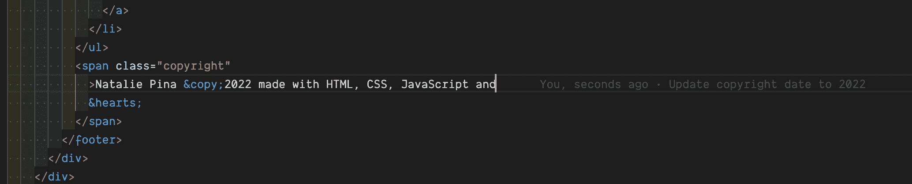

# 如何编写更好的 Git 提交消息——分步指南

> 原文：<https://www.freecodecamp.org/news/how-to-write-better-git-commit-messages/>

当第一次引入 Git 时，开发人员通常会对这个过程感到不舒服。

当遇到 Git commit 消息时，您可能会感到不确定，不确定如何正确地总结您所做的更改以及为什么要做这些更改。但是在你的职业生涯中，越早养成良好的承诺习惯越好。

您是否想过如何改进 Git 提交消息？本指南概述了提升提交信息的步骤，您可以从今天开始实施。

本文假设您已经理解了基本的 Git 工作流。如果没有，我建议通读一下 [Git 手册](https://guides.github.com/introduction/git-handbook/)。

同样重要的是要注意，你应该首先遵循你的团队的惯例。这些提示是基于研究和社区普遍共识的建议。但是在本文结束时，您可能会有一些实现建议，可能对您团队的工作流有所帮助。

> 我认为，当你开始在团队中工作时，git 就进入了一个全新的领域——有这么多很酷的不同流程和方式，人们可以提交代码、共享代码，以及以开源或闭源的方式向你的 repo 添加代码。— [斯科特·托林斯基，Syntax.fm](https://syntax.fm/) 。

## 为什么应该编写更好的提交消息？

我要求你打开一个个人项目或任何相关的存储库，并运行`git log`来查看旧提交消息的列表。我们中的绝大多数浏览过教程或做过快速修复的人会说“是的...我完全不知道 6 个月前我说的‘固定风格’是什么意思。”

也许您在专业环境中遇到过代码，但您不知道它在做什么或意味着什么。您一直被蒙在鼓里，没有代码注释或可追溯的历史，甚至怀疑“如果我删除这一行，这会破坏一切的可能性有多大？”

### 回到未来

通过编写好的提交，您只是在为自己做好未来准备。通过提供这种有用的描述，您可以为自己和/或同事在进行故障诊断时节省大量时间。

花额外的时间写一封深思熟虑的承诺邮件，作为给未来潜在自我的一封信，是非常值得的。在大型项目中，文档对于维护是必不可少的。

协作和沟通在工程团队中至关重要。Git 提交消息就是一个很好的例子。我强烈建议在你的团队中建立一个提交消息的约定，如果你还没有的话。

## 提交消息的剖析

#### 基本:

`git commit -m <message>`

#### 详细:

`git commit -m <title> -m <description>`


## 编写更好的提交消息的 5 个步骤

让我们总结一下建议的准则:

1.  大写和标点:第一个单词大写，不要以标点符号结尾。如果使用常规提交，记得全部使用小写。
2.  语气:在主题行中使用祈使语气。示例—`Add fix for dark mode toggle state`。祈使语气是你发出命令或请求时的语气。
3.  提交类型:指定提交的类型。建议使用一组一致的词语来描述您的变化，这甚至会更有好处。例如:Bugfix、Update、Refactor、Bump 等等。有关更多信息，请参见下面关于常规提交的部分。
4.  长度:第一行最好不要超过 50 个字符，正文应该限制在 72 个字符以内。
5.  内容:要直接，尽量消除这些句子中的填充词和短语(例子:虽然，也许，我认为，有点)。像记者一样思考。

### 如何找到你内心的记者

我从没想过我的新闻辅修会对我未来的软件工程师职业有所帮助，但现在我们来了！记者和作家问自己问题，以确保他们的文章详细、直截了当，并回答读者的所有问题。

写文章的时候，他们看着回答*谁*、*什么*、*哪里*、*什么时候*、*为什么*和*如何。*出于提交目的，回答提交消息的内容和原因是最重要的。

要提出深思熟虑的提交，请考虑以下几点:

*   我为什么要做这些改变？
*   我的改变产生了什么效果？
*   为什么需要改变？
*   关于的变化是什么？

假设读者不理解提交处理的是什么。他们可能无法了解描述变更详细背景的故事。

不要期望代码是不言自明的。这和上面的观点类似。

对于程序员来说，如果你正在更新 CSS 样式之类的东西，这似乎是显而易见的，因为它是可视化的。您可能非常了解为什么当时需要这些更改，但是您不太可能在以后回忆起为什么要做那数百个拉请求。

弄清楚*为什么*做出这样的改变，并注意它是否对功能至关重要。

见下图的不同之处:

1.  `git commit -m 'Add margin'`
2.  `git commit -m 'Add margin to nav items to prevent them from overlapping the logo'`

很明显，哪一个对未来的读者更有用。假装你正在写一篇重要的有新闻价值的文章。给出能够总结发生的事情和重要的事情的标题。然后，以有组织的方式在正文中提供进一步的细节。

在电影制作中，人们经常引用“展示，不要说”的说法，将视觉作为沟通的媒介，而不是口头解释正在发生的事情。

在我们的例子中，“**告诉**，不要[只是]显示”——虽然我们有一些视觉效果，如浏览器，但大多数细节来自于阅读物理代码。

如果你是 VSCode 用户，下载 [Git 怪](https://marketplace.visualstudio.com/items?itemName=waderyan.gitblame)扩展。这是有用的提交消息对未来开发人员有帮助的一个主要例子。

这个插件将列出进行修改的人，修改的日期，以及内嵌注释的提交消息。

想象一下，这对于解决一个 bug 或者回溯所做的更改是多么有用。查看 Git 历史信息的其他荣誉奖有 [Git 历史](https://marketplace.visualstudio.com/items?itemName=donjayamanne.githistory)和 [GitLens](https://marketplace.visualstudio.com/items?itemName=eamodio.gitlens) 。



## 常规提交

既然我们已经介绍了一个好的提交消息的基本提交结构，我想介绍一下传统的提交来帮助提供一些关于创建可靠的提交消息的细节。在 D2iQ，我们使用常规提交，这是工程团队中的一个很好的实践。常规提交是一种格式约定，它提供了一组规则来制定一致的提交消息结构，如下所示:

```
<type>[optional scope]: <description>

[optional body]

[optional footer(s)]
```

提交类型可以包括以下内容:

*   `feat`–随着变化引入了一项新功能
*   出现了一个错误修复
*   `chore`–与修复或功能无关且不修改 src 或测试文件的变更(例如更新依赖关系)
*   `refactor`–既没有修复 bug 也没有增加特性的重构代码
*   `docs`–自述文件或其他降价文件等文档的更新
*   `style`–不影响代码含义的更改，可能与代码格式有关，如空白、缺少分号等。
*   `test`–包括新的或修正以前的测试
*   `perf`–性能提升
*   `ci`–持续集成相关
*   `build`–影响构建系统或外部依赖的变更
*   `revert`–恢复之前的提交

提交类型主题行应该全部小写，并有字符限制，以鼓励简洁的描述。

可选的 commit body 应该用于提供主题行描述的字符限制无法容纳的更多细节。

这也是一个很好的位置，可以利用`BREAKING CHANGE: <description>`来记录提交中重大变更的原因。

页脚也是可选的。我们使用页脚链接 JIRA 故事，该故事将通过这些更改结束，例如:`Closes D2IQ-<JIRA #>`。

#### 完整的传统提交示例

```
fix: fix foo to enable bar

This fixes the broken behavior of the component by doing xyz. 

BREAKING CHANGE
Before this fix foo wasn't enabled at all, behavior changes from <old> to <new>

Closes D2IQ-12345
```

为了确保这些提交约定在开发人员之间保持一致，可以在能够上推更改之前配置提交消息林挺。Commitizen 是一个很棒的工具，可以执行标准，同步语义版本，以及其他有用的特性。

为了有助于采用这些约定，在项目中的贡献文件或自述文件中包含提交指南是很有帮助的。

传统的提交特别适合语义版本化(在[SemVer.org](https://semver.org/)了解更多)，提交类型可以更新适当的版本来发布。你也可以[在这里](https://www.conventionalcommits.org/en/v1.0.0/)阅读更多关于常规提交的内容。

## 提交消息比较

查看下面的消息，看看他们在每个类别中核对了多少建议的准则。

#### 好的

*   `feat: improve performance with lazy load implementation for images`
*   `chore: update npm dependency to latest version`
*   `Fix bug preventing users from submitting the subscribe form`
*   `Update incorrect client phone number within footer body per client request`

#### 严重的

*   `fixed bug on landing page`
*   `Changed style`
*   `oops`
*   `I think I fixed it this time?`
*   空提交消息

## 结论

编写好的提交消息是一项非常有益的技能，可以帮助您与团队沟通和协作。提交作为变更的存档。它们可以成为古老的手稿，帮助我们解读过去，并在未来做出合理的决定。

我们可以遵循现有的一套公认的标准，但是只要您的团队在考虑未来读者的情况下就一个描述性的约定达成一致，无疑将会有长期的好处。

在本文中，我们学习了一些提升提交消息的策略。你认为这些技术如何提高你的提交？

希望你学到了新的东西，感谢阅读！

在 Twitter 上跟我联系 [@ui_natalie](https://twitter.com/ui_natalie) 。