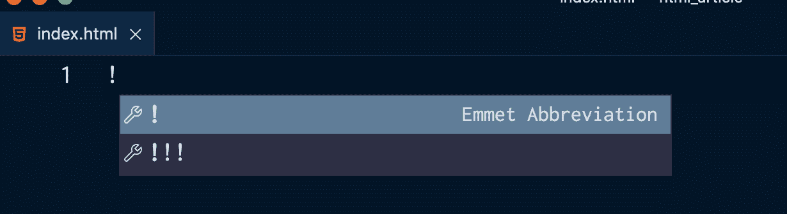
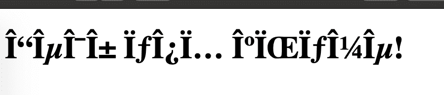
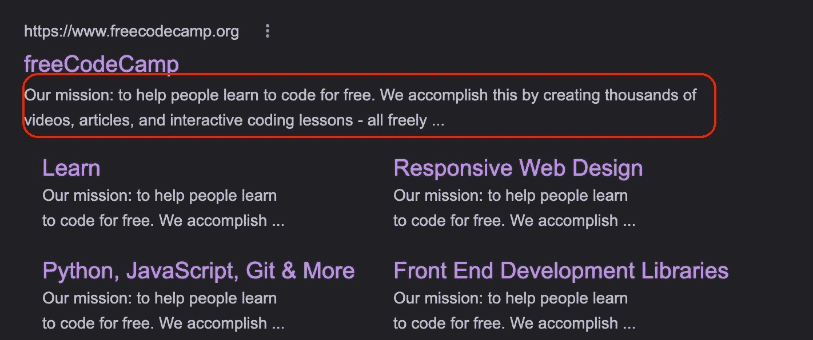

# HTML 中的 Meta 标签–什么是元数据和元描述示例

> 原文：<https://www.freecodecamp.org/news/meta-tag-in-html-what-is-metadata-and-meta-description-example/>

在本文中，您将了解 HTML 中的`meta`标签以及如何使用它们。然后我们将讨论一些最重要的`meta`标签，你需要在每个新的 HTML 项目中包含这些标签。

我们开始吧！

## 如何建立一个 HTML 项目

当建立新的 HTML 项目时，你会发现每次都必须包含相同的几个标签。

这些标签是必不可少的，您将需要它们来使您的 HTML 站点按照最佳实践正常运行。

一些代码编辑器提供快捷方式来自动填写和输入您在每个新的 HTML 项目中使用的标签。这可以节省你大量的时间。

在 [Visual Studio 代码编辑器](https://code.visualstudio.com/download)中，你可以通过以下方式来实现:

1.  确保你已经创建了一个以`.html`结尾的文件——在这里你将编写所有的 HTML 代码。
2.  在空文件内键入一个感叹号，`!`。



3.  点击感叹号，并注明以下是 Emmet 缩写。

Emmet 是一个默认内置于 Visual Studio 代码中的代码编辑器插件，它可以帮助你优化 HTML 工作流程。

然后，您将看到下面的代码已填写完毕:

```
<!DOCTYPE html>
<html lang="en">
<head>
    <meta charset="UTF-8">
    <meta http-equiv="X-UA-Compatible" content="IE=edge">
    <meta name="viewport" content="width=device-width, initial-scale=1.0">
    <title>Document</title>
</head>
<body>

</body>
</html> 
```

当在您选择的浏览器中查看`.html`文件时，您只会看到一个空白页面。

让我们放大到创建的代码的以下部分:

```
<head>
    <meta charset="UTF-8">
    <meta http-equiv="X-UA-Compatible" content="IE=edge">
    <meta name="viewport" content="width=device-width, initial-scale=1.0">
    <title>Document</title>
</head> 
```

这些`meta`标签到底是什么？它们为什么在那里，它们在创建网页时有什么作用？

本文将重点解释`meta`标签的基础知识以及为什么在 HTML 文档中使用它们。

## HTML 中有哪些`meta`标签？

`meta`标签位于 HTML 文档的`head`标签中。

`head`标签用于配置 HTML 文件。

使用`head`标签为网页添加标题，链接到 CSS 样式表，并定义关于 HTML 文档的更多信息。

`meta`标签代表元数据。它们主要用于定义和描述关于数据的数据，并用于向网页内的数据添加额外的信息。

有很多`meta`标签。其中一些有助于提高网站的 SEO(搜索引擎优化),确保网站内容与人们搜索的内容相关。

### 如何定义网站的字符集

`<meta charset="UTF-8">`定义将在站点中使用的字符集。

`UTF-8`代表 8 位 Unicode 转换格式，是 HTML 最新版本 HTML5 使用的标准字符编码。

这一行应该包含在创建的每一个网页中，因为它可以确保世界上每一种语言的每一个字符都能在每一个浏览器中正确显示。

通过使用通用的`UTF-8`作为字符集，来自非拉丁语言的字符将不会被扭曲。

谷歌 Chrome 浏览器已经自动将编码设置为`UTF-8`，所以你在为这款浏览器设计的时候就不用担心这个了。但是你仍然需要在每个 HTML 文件中包含`<meta charset="UTF-8">`，以防其他浏览器不支持这个特性。

例如，看看在 Safari 浏览器中没有添加这一行时会发生什么，我用非拉丁语写了一个标题，比如希腊语:

```
<!DOCTYPE html>
<html lang="en">
<head>
    <meta http-equiv="X-UA-Compatible" content="IE=edge">
    <meta name="viewport" content="width=device-width, initial-scale=1.0">
    <title>Document</title>
</head>
<body>
    <h1>Γεία σου κόσμε!</h1> <!-- Hello world! -->
</body>
</html> 
```



当在浏览器中查看 HTML 文档时，所有字符都变形了。

### 如何让微软的 Internet Explorer 知道使用哪个渲染视图

您使用`http-equiv="X-UA-Compatible" content="IE=edge"` meta 标签来选择和定义网页将在其中被重新命名的 Internet Explorer 版本。

总是选择最新的，也就是`IE=edge`。

微软的浏览器有很多版本。在过去，不同的进步让网页设计者和网页开发者感到头疼，他们致力于确保网站可以在传统浏览器上使用。

这个标签将确保网站不会呈现为旧版本的 Internet Explorer，这往往是错误的。

### 如何调整视口设置

如今，所有的网站在所有的设备上都好看是很重要的，尤其是手机。

因此，您需要在每个 HTML 文件中包含`meta name="viewport" content="width=device-width, initial-scale=1.0"`标签。

`viewport`指的是网站如何在不同的屏幕尺寸上显示，以及用户有多大的可视区域。

每个设备都有不同的视口。例如，移动设备的尺寸较小，台式电脑的尺寸较大。

是确保网站在移动设备上美观的第一步。

它可以防止从移动设备上看到的网站看起来像在笔记本电脑上一样——很小，而且被缩小了很远。

这确保了 HTML 将适应设备屏幕的宽度。

`initial-scale=1.0`设置网页缩放的方式，并设置浏览器首次加载页面时的初始缩放。

## 添加到 HTML 项目中的附加`meta`标签

### 如何添加网页描述

为你的页面使用元描述标签有助于搜索引擎找出你的网站，并将其与其他网站进行比较。它主要用于 SEO(搜索引擎优化)目的。

meta description 标签用于简单明了地解释你的网站是关于什么的。

元描述标签可能看起来像这样:

```
 <meta name="description" content="Our mission: to help people learn to code for free. We accomplish this by creating thousands of videos, articles, and interactive coding lessons - all freely available to the public."> 
```

使用`name`和`content`属性，传递给`content`的文本值显示在搜索结果中:



#### 写网站描述时要考虑的事情

*   确保你的网站描述简短，不超过 160 个字符。
*   包括有用的关键词和关键短语，人们在搜索你的网站提供的服务时会经常用到。
*   解释清楚你的网站是做什么的，以及它背后的使命。重要的是要让别人明白是什么让你与众不同，以及你提供的价值。
*   与你的品牌的声音和语气保持一致。
*   最重要的是，坚持描述你的网站实际提供的内容。不要试图欺骗你的读者，只是为了在搜索和排名中显得更高。

### 如何添加网站作者的名字

另一个有用的元素是作者的名字。

这可能如下所示:

```
<meta name="author" content="Quincy Larson"> 
```

了解页面的作者可能会有所帮助。

这些信息分享了谁创建和建立了网站，谁创作了内容，或者版权属于谁。

## 结论

总而言之，所有 HTML 文档至少需要包括以下三个`meta`标签:

*   `<meta charset="UTF-8">`，指定字符集。
*   `<meta name="description>"`，添加对网站以及网站向读者/客户提供的服务的清晰描述。
*   这是网站在各种屏幕设备上可用的第一步。

要了解更多关于 HTML 和 CSS 的知识，请查看 freeCodeCamp 的[响应式网页设计认证](https://www.freecodecamp.org/learn/2022/responsive-web-design/)，在这里，您可以通过互动的方式学习，同时构建有趣的项目。

感谢阅读和快乐编码！