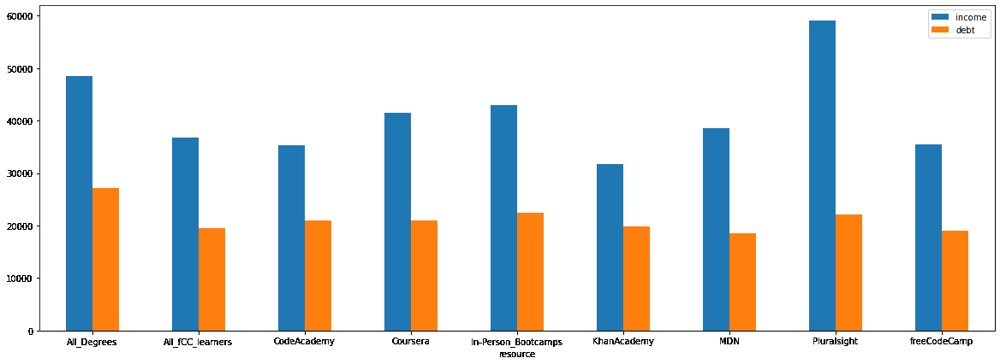
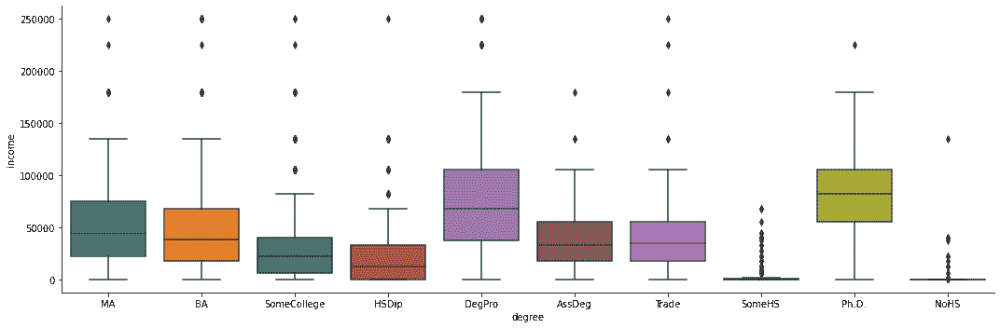
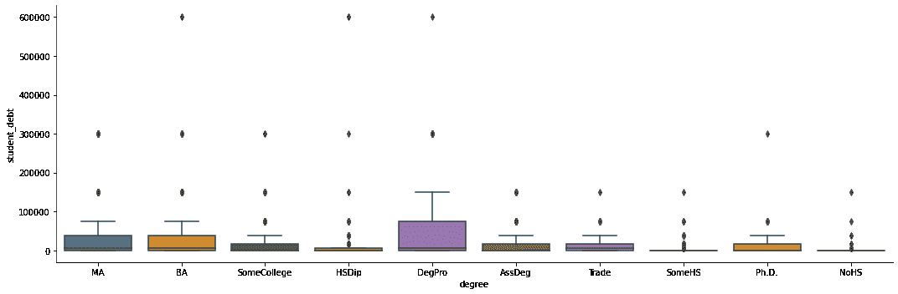

# 软件开发培训的类型——选择最佳 IT 职业培训资源的新数据

> 原文：<https://www.freecodecamp.org/news/types-of-software-development-training-new-data-for-choosing-the-best-it-career-training-resource/>

很久很久以前，准确地说是 2021 年 11 月下旬，我写了“[IT 职业培训工具功效的数据分析”](https://www.freecodecamp.org/news/types-of-software-development-training/)来帮助完成做出明智职业教育选择的艰难任务。

信不信由你，已经有了一些重要的更新。

那篇文章首先介绍了一些强大的数据工具，用于评估在美国个别大学入学可能带来的经济后果。

这些工具旨在让我们深入了解贷款完成率和贷款违约率。以及哪些项目最有可能带来财务上的成功，或者至少最终带来足够的就业收入来支付你的学费。剧透:不是所有的都能让你达到目的。

那个部门没有什么变化，所以在这个话题上我没什么可说的了。

但文章的后半部分重点分析了来自 [2018 freeCodeCamp 新编码器调查](https://www.kaggle.com/freecodecamp/freecodecamp-2018-new-coder-survey-of-30k-devs)的数据。那次调查让我们探索了加入编码训练营、在线学习资源，当然还有免费代码营的一些真实成本和好处。

我们特别关注了 3 万名受访者中许多人报告的收入和未偿还学生债务。昂贵的训练营意味着更高的薪水吗？营利性的在线培训平台怎么样？大学学历保证收入更高吗？

## 2021 年 freeCodeCamp 新编码器调查

然而此后 [2021 版调查结果](https://www.freecodecamp.org/news/2021-new-coder-survey-18000-people-share-how-theyre-learning-to-code/)出来了。新问题并没有完全遵循 2018 年使用的格式。

例如，受访者不是按国家而是按地区分类的。因此，我们将与整个北美合作，而不是只关注我们这些学习者。收入以括号(即 40，000 美元至 49，999 美元)表示，而不是实际数字。

为了简单起见，我将括号转换为平均值(意思是，“40，000 美元到 49，999 美元”变成了 45，000 美元)，所以它们是近似值。

和以前一样，调查得出的数字只是数字。仅仅因为普通的 freeCodeCamp 学习者在某个特定的资源上经历了或多或少的成功并不意味着每个人都会这样。

仅仅因为调查中的普通大学毕业生背负着大量的学生债务——事实上是他们年收入的 59%——并不意味着这就是你将要面对的。

当然，相关性并不等同于因果关系。仅仅因为一种资源的消费者比另一种资源的消费者收入高，并不意味着是这种资源造成了差异。可能有一些我们没有考虑到的重要因素。

尽管如此，这些数字还是很有用的，如果我们在制定计划时忽视它们，那就太愚蠢了。

## 训练营与在线学习平台

根据我们对 2018 年调查的分析，现场训练营表现不佳，像 Pluralsight 和 Coursera 这样的在线学习工具被证明更具成本效益，而免费代码训练营自然提供了惊人的价值。

这种情况改变了吗？Pluralsight 在 2018 年取得的令人难以置信的成绩(Pluralsight 学习者的平均收入为 52，895 美元，比 BA 毕业生高出约 10%)只是侥幸吗？

以下是使用 2021 年调查数据得出的结果:

Income (in blue) VS Debt (in orange)

如你所见，蓝色条代表来自特定资源的收入，而橙色显示美国债务。幸运的是，所有被包括在内的资源的平均使用者一年赚的比他们的平均债务还多。

所有亲身参加训练营的学生都报告说，他们的学生债务水平(22，476 美元)仅次于大学毕业生(“所有学位”)。然而，他们的收入甚至比不上大学毕业生(41972 美元对 48576 美元)。这算是“表现不佳”吗？我不能说。

你可以很容易地看到，最高的学生贷款债务是所有学位课程的毕业生。考虑到大学学费和生活费，这正是我们所期望的。同样可以预见的是，我们已经看到大学毕业生的收入也更高了。

正如我在上一篇文章中所披露的，我为 [Pluralsight](https://pluralsight.pxf.io/P0x6) 制作课程，所以我在这里有一点个人兴趣。因此，当我告诉你我认为他们的课程库是多么有效时，我会原谅你的嘲笑。

但是旧的结果显然不是偶然的。现在，Pluralsight 学习者的平均年收入超过 59，000 美元——比 2018 年增长 9%——并且只有 22，180 美元的学生债务。

## 按教育程度显示收入和债务结果

要很好地了解我们的自由代码营受访者的收入经历可能会很棘手。事实证明，有一些异常者，意味着每个类别中的少数人比他们的大多数同龄人挣得更多(或负债更多)。

我可以手动删除大部分或所有的离群值，并专注于结果的主体，但这有可能人为地扭曲剩余的数据。对我来说，这也包含了太多的工作。

因此，我将使用箱线图来可视化数据。箱线图的优点是离群值仍然可见，但事实上它们由远高于或低于主流“盒子”的点表示，这意味着它们与其余数据的关系是显而易见的。

在上面按教育水平显示收入的图中，中值收入由方框中间的线表示，方框本身包含了数据集的中间 50%，而“胡须”是不包括离群值的最小值和最大值*。*

正如你所看到的，拥有专业学位和博士学位的人收入最高，而没有高中文凭或贸易证书的人收入最低。没什么好惊讶的。

让我们用同样的箱线图方法来观察学生的债务负担:

还是那句话，没什么令人震惊的。大学毕业生持有最多的学生债务。

这个拥有高中文凭和 60 万美元学生债务的单身异类很有趣。我怀疑有人在某个时候点错了选项。这证明了箱形图对于这种可视化是多么有用。

事实上，总的来说，我们得到的收入/债务结果是相当可预测的，这证实了调查给了我们相当好的数据。这至少会让我们之前的观点更可靠一点。

请随意查看用于生成这些见解和可视化的原始 Python 代码。