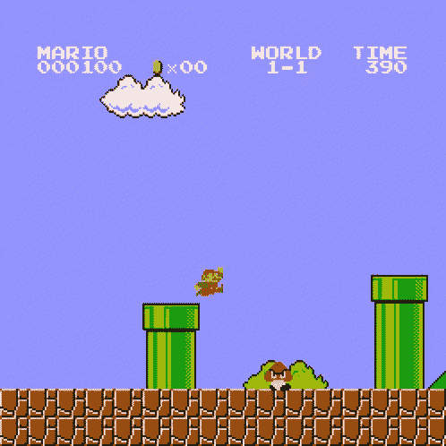

# 如何用 Java 编写 2D 游戏引擎

> 原文：<https://www.freecodecamp.org/news/code-a-2d-game-engine-using-java/>

如果你真的想了解游戏开发，可以考虑自己编码游戏引擎。

我们刚刚在 freeCodeCamp.org YouTube 频道上发布了一个 25 小时的课程，教你如何用 Java 编写自己的 2D 游戏引擎。

您将使用游戏引擎创建一个超级马里奥克隆体，但该引擎也可用于创建其他游戏。

以下是综合课程中的所有部分:

*   用 LWJGL 设置窗口
*   使用 GLFW 添加事件侦听器
*   创建场景管理器和增量时间变量
*   OpenGL 图形编程的工作原理
*   绘制第一个正方形
*   正则表达式和着色器抽象
*   游戏相机 OpenGL
*   GLSL 着色器
*   LWJGL3 中的纹理加载
*   实体组件系统
*   LWJGL3 中的批量渲染
*   LWJGL3 中的资源管理
*   纹理批处理
*   Spritesheets
*   渲染中的脏标志
*   Alpha 混合和 Z 轴索引
*   集成 ImGui
*   ImGui 字体和场景集成
*   使用 Gson 进行序列化
*   使用 Gson 进行反序列化
*   向关卡编辑器显示变量
*   将屏幕坐标转换为世界坐标
*   拖放级别编辑器
*   调试绘图功能
*   对齐网格工具
*   调试绘图框和圆形
*   opengl 中的帧缓冲区
*   Java LWJGL 中的 ImGui 停靠
*   添加游戏视口
*   游戏视窗 C 的鼠标屏幕坐标
*   像素完美鼠标拾取
*   启用鼠标拾取和代码维护
*   带 Lerp 的编辑器摄像机控件
*   编码小发明
*   平移和缩放 Gizmo
*   属性面板
*   将 JBox2D 集成到我们的引擎中
*   事件系统和 Box2D 物理学
*   添加引擎运行时(播放/停止按钮
*   重构和物理学
*   字体渲染
*   开始场景层次和 ImGui 升级
*   场景面板拖放(ImGui)
*   更多的错误修复
*   2D 动画公司
*   使用 OpenAL 的声音
*   改进编辑器
*   如何使用 Box2D 物理
*   碉堡碰撞器和玩家控制器
*   可变长度跳跃
*   电源供应器
*   古姆巴·艾
*   马里奥管道和编辑器改进
*   游戏摄像头和网格线
*   马里奥海龟 AI
*   给马里奥添加旗杆
*   火球和错误修复
*   最后一集和分发你的游戏

观看 freeCodeCamp.org YouTube 频道的全部课程(25 小时观看)。

[https://www.youtube.com/embed/025QFeZfeyM?feature=oembed](https://www.youtube.com/embed/025QFeZfeyM?feature=oembed)