# Git 是如何工作的

> 原文：<https://www.freecodecamp.org/news/git-under-the-hood/>

作为开发人员，我们都使用某种形式的版本控制系统，最流行的是 Git。

我们很多人都在使用 Git，但是很少有人知道它到底是如何工作的。我们通常只是将它与 GUI 客户端或内置于我们的 ide 和代码编辑器中的客户端一起使用。我们中的一些人(包括我自己)甚至不知道如何使用终端来导航它。

这可能对您的项目不利，因为您可能会遇到一些问题，如果没有完全理解 Git 在后端是如何工作的，您就不知道如何解决这些问题。

在这篇文章中，我将分享一些 Git 的幕后工作方式，以及在使用它时你应该知道的一些事情。

这篇文章的灵感来自于我参加的一个名为 Git 协作编码的课程，该课程教你如何使用 Git 与项目中的合作伙伴和团队成员协作。

好吧，我们开始吧。

注意:本文不是使用 Git 的详细指南。相反，它旨在让您了解使用 Git 时幕后发生的事情。

如果你想要 Git 和 GitHub 的基本介绍，[这里有一个很好的初学者友好指南](https://www.freecodecamp.org/news/git-and-github-for-beginners/)。

## 什么是 Git 它是如何工作的？

Git 是一个分布式版本控制系统，帮助开发人员跟踪他们项目中的变更。把它想象成你的项目从开始到结束的整个时间线。

当您创建一个新项目并使用`git init`初始化 Git 存储库时，它会创建一个名为`.git`的隐藏文件夹，其中包含一堆其他文件和文件夹。这些文件和文件夹包含 Git 引用特定目录所需的所有内容。

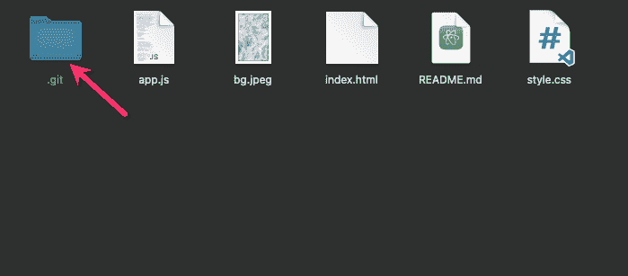

The .git folder

初始化存储库后，Git 开始跟踪该目录中的所有文件和文件夹，除了那些您在`.gitignore`文件中明确告诉它不要跟踪的文件和文件夹。`.gitignore`文件是一个隐藏文件，让您列出所有不想让 Git 跟踪的文件和文件夹。Git 永远不会在您的项目中引用这些文件和文件夹。

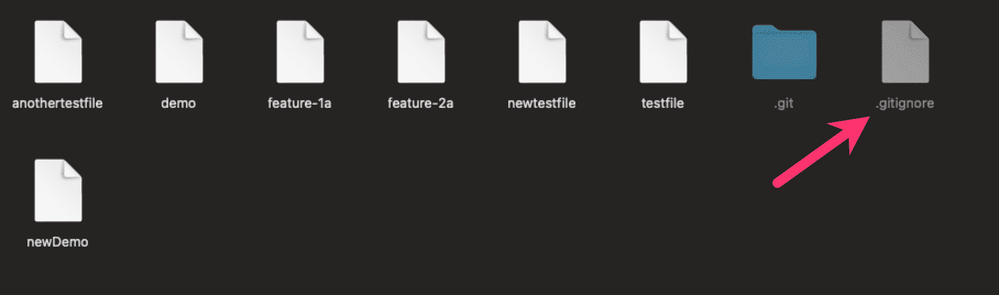

The .gitignore file

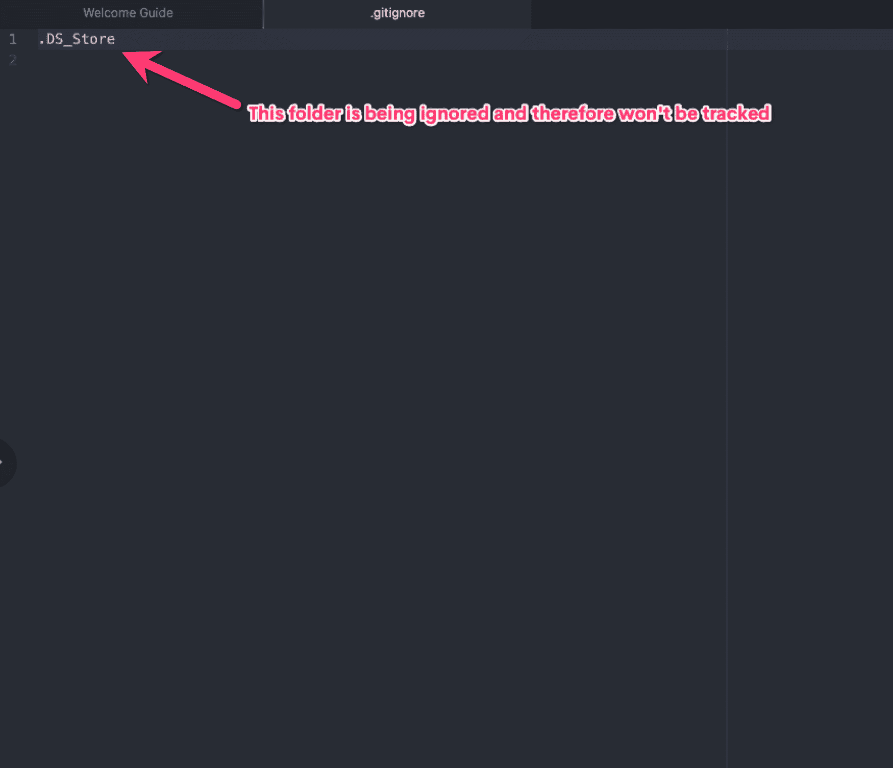

Inside the .gitignore file

当您使用 git 时，您的文件保存在 Git 的三种状态之一:

*   修改状态——这是指在文件中添加、删除或更改内容。Git 已经注意到了这个变化，但是你之前没有通知 Git 这个变化。
*   Staged 状态——这是您通知 Git 更改并告诉 Git 注意该更改的时候。通常称为“暂存区”，此阶段中的文件称为暂存文件。即使在转移文件后，您也可以修改文件，这使您可以同时看到处于已修改状态和已转移状态的文件。提交后，转移后所做的修改将不会出现。
*   提交状态——这是 Git 保存修改后的更改的时候。

您可以使用命令`git status`来查看您的文件当前所处的状态。

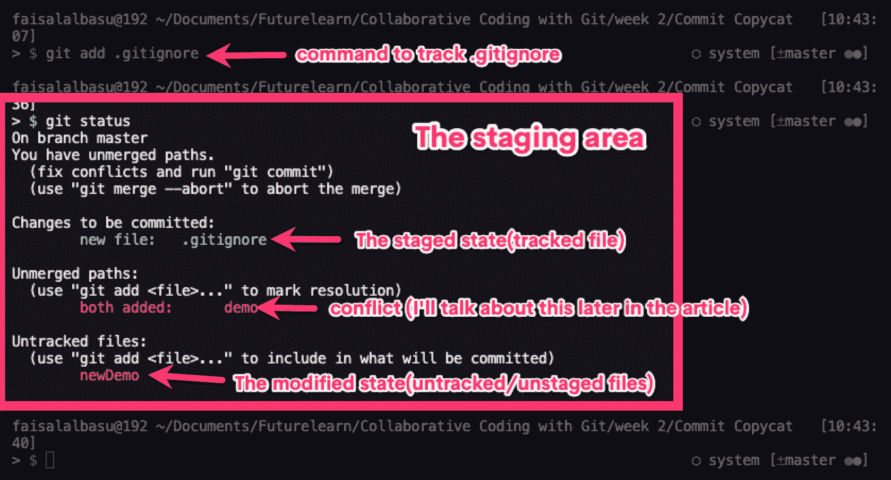

当您提交一些代码时，Git 会对您的代码的特定版本进行快照，您可以在以后的阶段引用它。

所以你可以说 Git 是一个引用你的项目的数据库。该数据库是使用三种类型的对象构建的:

*   提交包含每个提交的元数据，例如消息和作者，
*   包含对文件名、文件内容以及有时其他树的引用的变化树，
*   和表示文件中保存的实际数据的 blob。

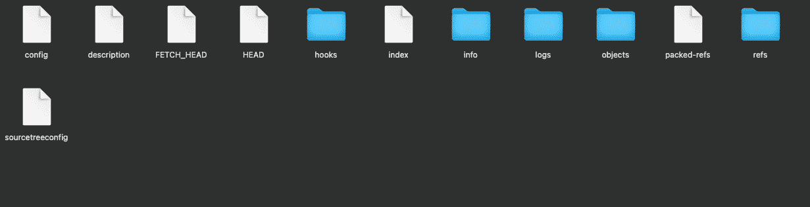

Contents inside the .git folder

注意:在。git 文件夹在某些情况下在 macOS 中是隐藏的，所以你必须在系统设置中启用隐藏文件才能看到它。

### Git 如何跟踪你的文件

当使用 Git 时，有许多移动的部分，有时我们使用几个不同的文件。

为了让 Git 跟踪所有这些文件，它创建了一种称为安全散列算法(SHA)的东西，这是一系列加密散列函数，并将其分配给每次提交。这样可以更容易地识别重复文件，并为它们提供与原始文件相同的标识符，从而节省存储空间。

使用 SHA，我们可以引用 Git 中的任何东西，比如查看提交并返回到提交，或者只是标记提交。

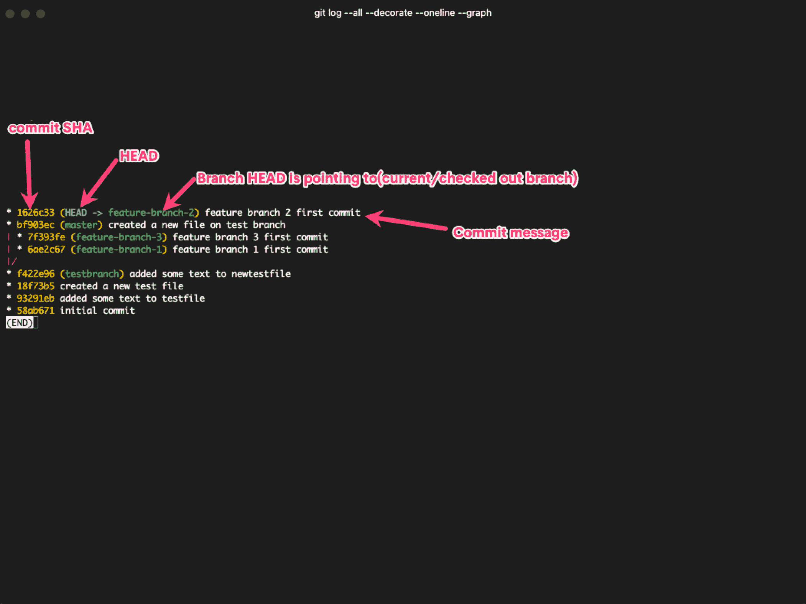

A terminal graph of a Git tree

除了初始提交之外，每个提交都有一个父提交，当您开始一个项目时，您的头指向主分支或主要分支上的最新提交。

这都是使用分配给提交的 SHA 号来维护的。创建分支时，它会创建文件的单独副本。当您切换分支时，HEAD 将其指针更改为您切换到的分支上的最新提交。

被删除的分支被称为处于分离头或无头状态。如果我们有唯一的散列，我们可以访问它们，但是没有指向它们的头-所以如果我们没有它们的散列，就没有办法访问它们。

我们还可以通过将它们作为单独的分支签出来保持对它们的访问。

当使用 Git 时，我们经常为不同的任务创建不同的分支，比如开发新特性或修复 bug。使用`git branch`命令创建分支。

```
git branch [branch name] 
```

当我们从一个分支切换到另一个分支时，Git 不再能够访问前一个分支中的任何提交。因此，如果我们想要恢复到另一个分支中的提交，我们必须切换到那个分支，或者将我们当前的分支基于我们想要使用的另一个分支。

我一会儿会谈到重定基，但首先，我想谈谈合并和合并冲突。

### 什么是 Git 合并，它是如何工作的？

当您为项目中正在进行的工作创建一个分支时，如果您搞砸了某些事情，您通常不希望您的其余工作受到影响。因此，当您完成该任务时，您会希望将其添加到您的主项目中。

最常见的方法是通过**将分支合并**到项目的主分支中。

有 3 种类型的合并:快速前进合并、三向合并和我在上面简单提到过的重定基础。

快速合并，顾名思义，是一种快速简单的方法来合并您的分支并继续您的项目。它不需要任何额外的工作，你很少会遇到合并冲突。

这是因为它所做的只是将其头部从主分支的当前提交移动到被合并的分支的最新提交。这就像及时推进你的项目。

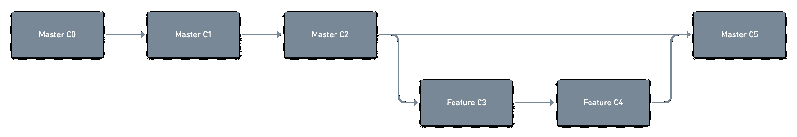

Fast-Forward Merge

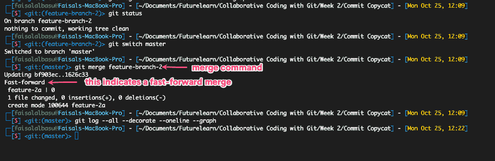

Fast-Forward Merge in action

另一方面，三向合并需要更多的工作，因为您要处理三次提交。

当您试图合并到的分支位于您试图合并的分支之前时，会发生三向合并。例如，您创建了一个分支来修复一个 bug，而与此同时，一个同事正在处理主分支。在您完成消除 bug 之前，一个新的提交已经被添加到主分支中。

Git 将无法顺利地将您的分支集成到主分支中，因为主分支现在位于您的分支所指向的提交之前。

因此，它必须为它创建一个单独的提交，并将您的提交、主分支上的新提交以及它们都指向的提交(因为它们都有相同的祖先提交)合并为一个提交，以便将它们合并为一个新提交。

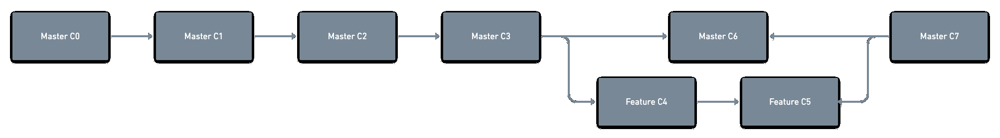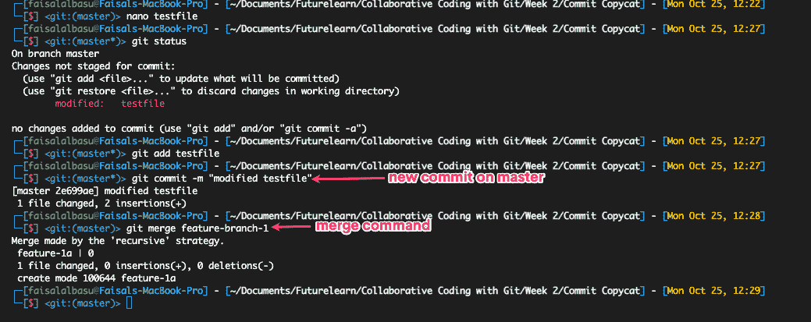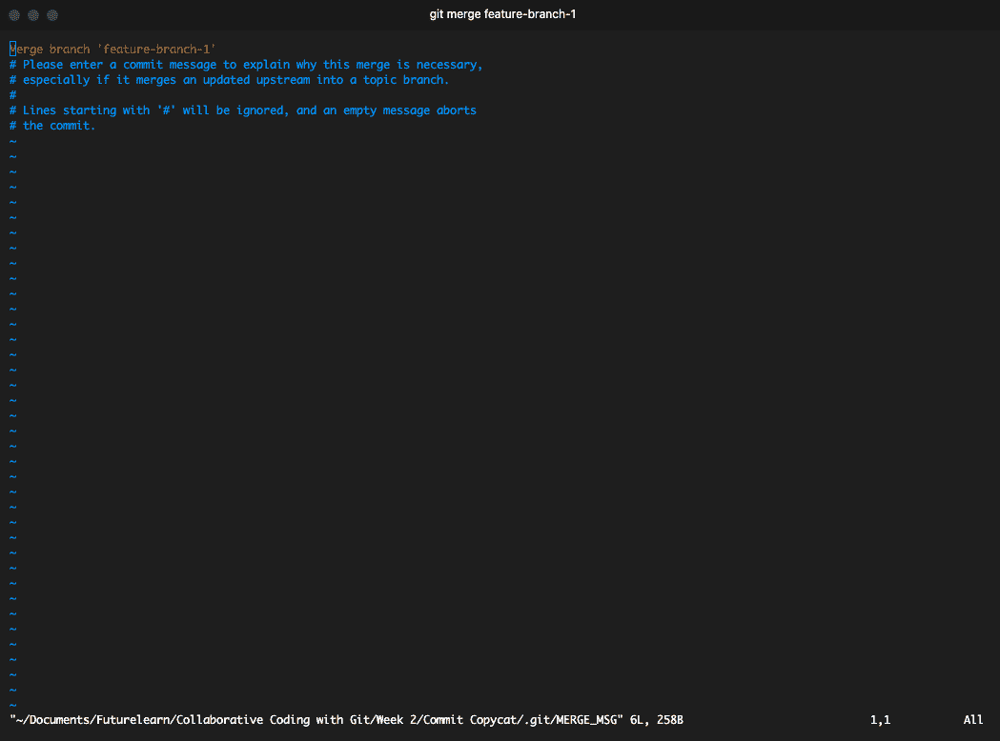

Prompt to create third commit for the 3-way merge

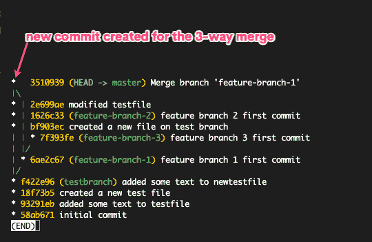

3-way Merge successful

最后一种方法是重定基础，将整个特征分支转移到主分支上。

merge 没有的一个缺点是丢失了项目历史。当您将一个分支合并到另一个分支时，您仍然可以访问该分支，直到将其删除。但是当你改变一个分支的基础时，你就失去了对该分支历史的访问权。这是好是坏取决于你，(你的团队)，和你的项目。

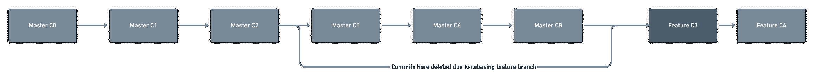

Rebasing concept

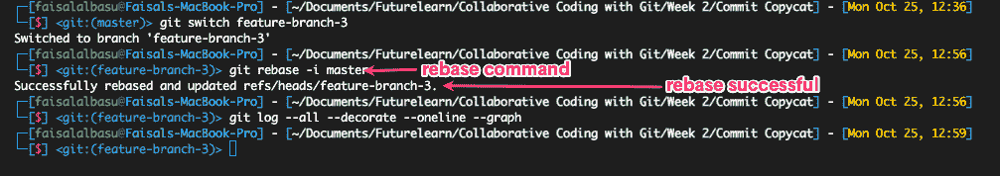

Prompt to pick a commit to use for the rebasing

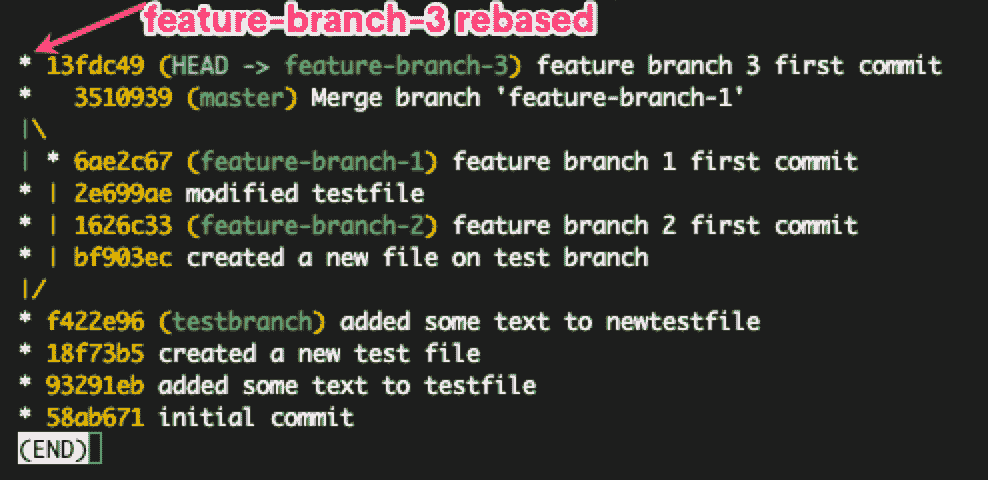

Feature-branch-3 rebased

随着项目中所有的合并和重定基础，您一定会遇到合并冲突。

当您在不同分支上对文件的相同位置进行更改时，会发生合并冲突。例如，您对您正在处理的功能分支的第 10 行进行了更改，而另一个人也对主分支的同一行进行了更改。

在这一点上，Git 不知道应该进行哪一个更改，所以它抛出一个合并冲突，并拒绝合并或重定基础，直到您手动解决该冲突。

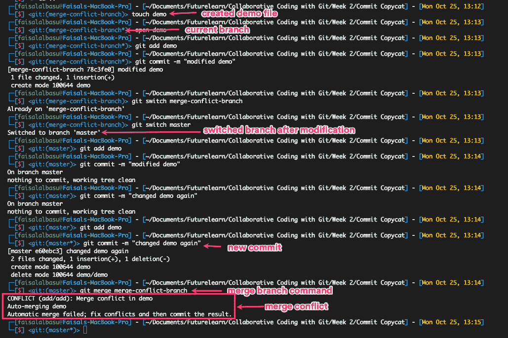

当合并冲突发生时，Git 会暂停合并，等待您解决冲突并继续合并。您可以运行一个`git status`命令来查看哪些文件被合并，哪些没有被合并。

您可以使用 Git 的冲突解决标记来解决冲突，当您打开存在冲突的文件时，这些标记如下所示:

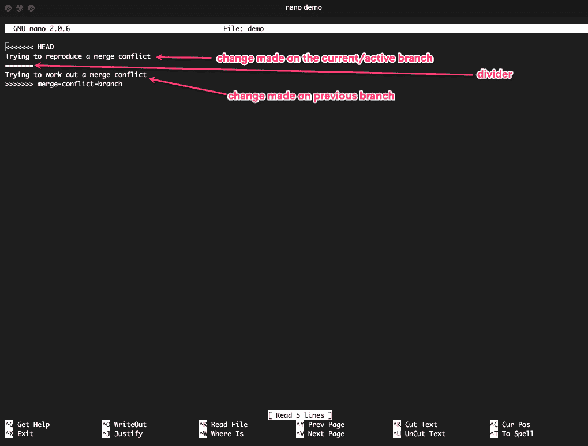

上面的版本是你当前签出的版本，这就是为什么它的头指向它。下面的版本是您试图合并的分支。

为了解决冲突，你必须决定你想留下哪个版本，你想删除哪个版本，或者你必须自己手动合并内容。选择之后，您可以继续您的合并。

## 如何在 Git 中保存未提交的更改

前面，我谈到了 Git 的 3 种状态，即修改、暂存和提交。

有时候，我们希望快速切换分支，而不保存我们对当前分支所做的更改。这可能是为了快速修复或只是检查东西，我们还没有完成当前分支的工作。我们可以通过储存来实现。

### Git 中的存储是如何工作的

Stashing 允许您保存所有未提交的工作，并将它们保存为未完成的更改，即使您在单独的分支上，也可以在以后重新应用这些更改。

要隐藏你的文件，你可以使用命令`git stash`。这将所有未提交的更改保存在一个堆栈中，并留给您一个干净的分支。要查看您的存储，您可以使用命令`git stash list`。不过，它不能保存未被追踪的文件。

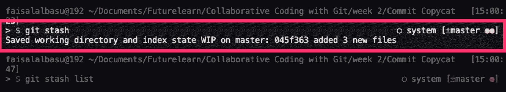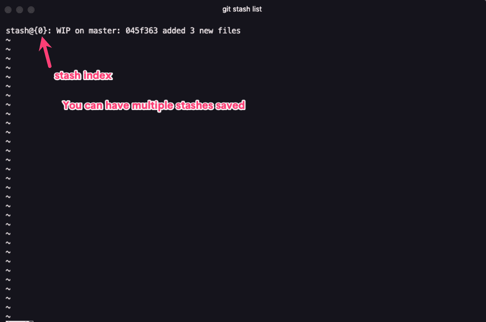

Stash List

当您准备好应用您隐藏的更改时，只需运行命令`git stash apply`，它就会应用这些更改。

如果您有多个隐藏，您可以通过指定您想要应用的隐藏来指定应用哪个隐藏(例如`stash@{0}`)。如果没有指定想要应用的存储，Git 会自动应用最近的存储更改。

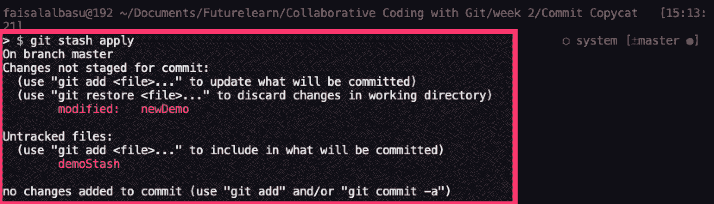

Stash Applied

## 如何撤销 Git 中的更改

当在任何类型的项目中工作时，不管我们有多小心或者我们的系统有多高效，总会有不可避免地搞砸的时候。这可能是人为或计算机错误。

通常，当使用传统的应用程序和文字处理器时，我们只需点击撤销按钮或快捷键 cntrl/cmd + z，就可以回到原来的位置。但是当使用 Git 时，我们没有这种奢侈，所以我们必须经历更多的步骤来修复/撤销这些错误。

有几种方法可以用来修复/撤销这些错误，所以让我们一个一个地来看看。

### 检验

Checkout 主要用于切换分支，但也可以用于指向特定的提交。您可以通过在 checkout 命令后指定您的提交 SHA 编号来实现这一点。

```
git checkout [commit SHA]
```

这使你处于一种超然的状态，你可以在不影响你的任何分支的情况下对它进行临时的或实验性的改变。

在成功检查您的提交之后，您可以将它转换成一个单独的分支。

```
git checkout -b [name of your new branch]
or
git switch -c [name of your new branch]
```

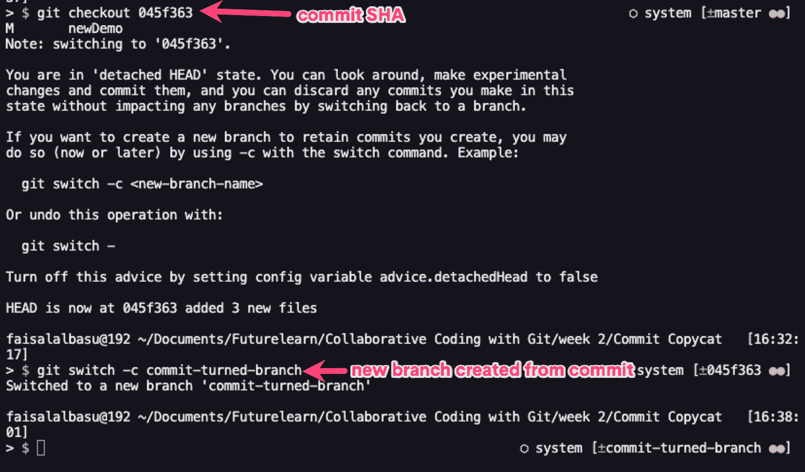

Undoing changes with 'checkout'

但是请记住，使用 checkout 可能会导致您之前的分支丢失，因为它处于分离的 HEAD 状态。

### 归还

这是修复回购错误最直接的方式。顾名思义，Revert 通过在有错误的提交之前添加一个提交(但没有错误)来逆转错误。把它想象成同时在时间中来回穿梭。

这里有一个例子:你有两个提交，名为“初始提交”和“设置开发环境”。工作时，您注意到您在第二次提交时出错，想要返回到“初始提交”。

当您调用`git revert`关键字时，它会创建第三次提交，这与第二次提交之前的回购完全相同。使用 Git revert，您将需要传递一个提交引用，并且类似于三向合并，您需要为正在创建的新提交传递一个提交消息。

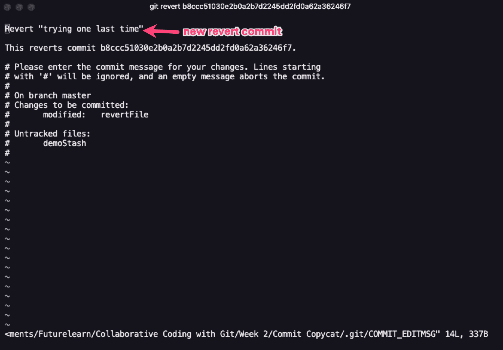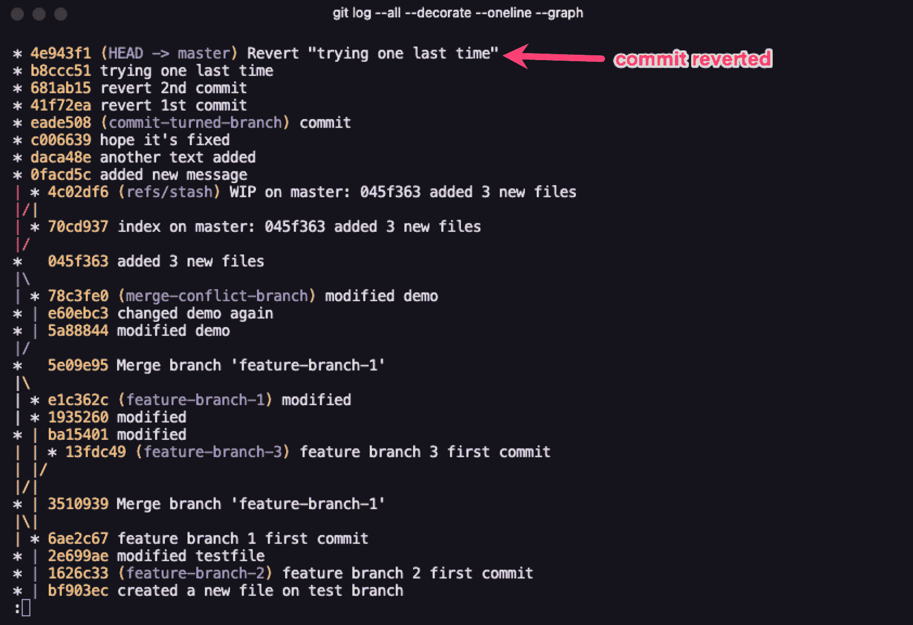

### 重置

这是 Git 中最复杂、最通用、也是最危险的撤销更改的方式。通常建议不要在共享存储库中使用 reset，因为这会导致项目的巨大损失。好了，现在我们来看看 reset 是做什么的，它和其他方法有什么不同。

Git 重置有三个选项。根据您使用的不同，它可能会改变提交历史记录、提交历史记录和登台索引，或者提交历史记录、登台索引和工作目录。

第一个是`git reset --soft`,只改变提交历史。这样，您将需要使用它的 ID 来指定想要返回哪个提交。

```
git reset --soft [commit ID]
```

这将删除您要返回的提交之后的所有提交。

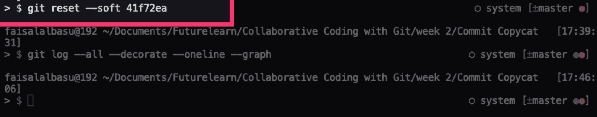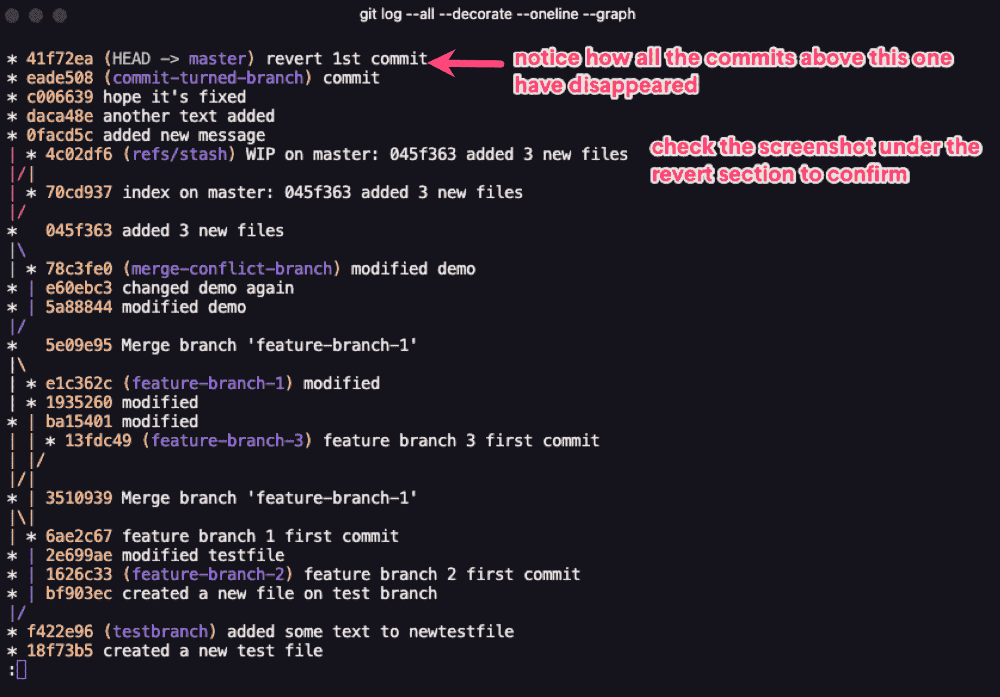

第二个`git reset --mixed`是`git reset`调用的默认行为。它会改变提交历史记录和分段索引。因此，如果您在暂存区中有任何文件，它会将这些文件取消暂存，如果指定了提交 ID，它会返回到该提交，删除其后的所有提交。

```
//Both do the same thing
git reset [commit ID]
git reset --mixed [commit ID]
```

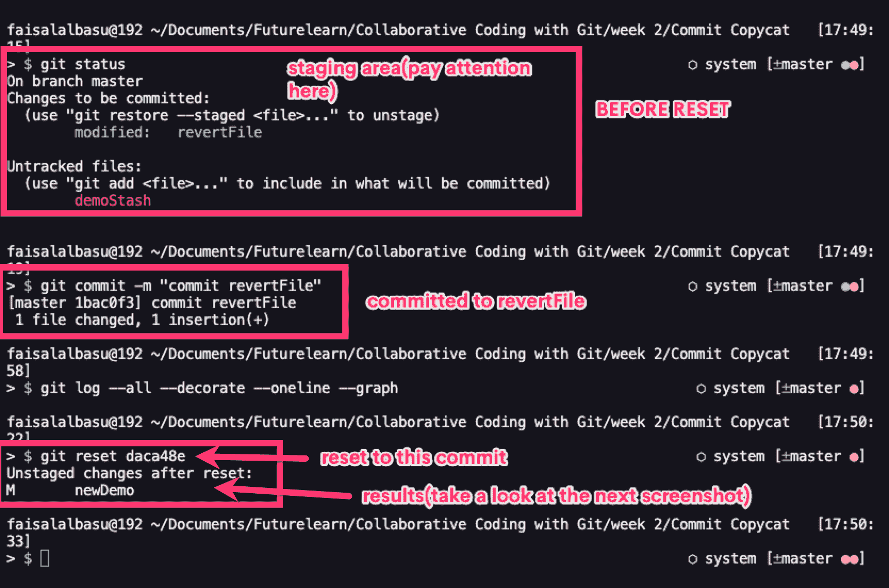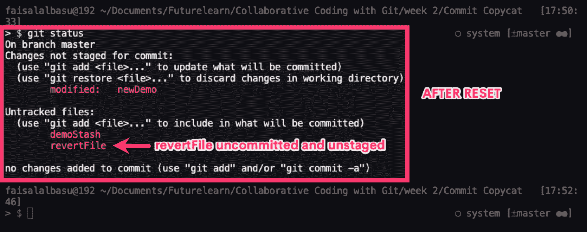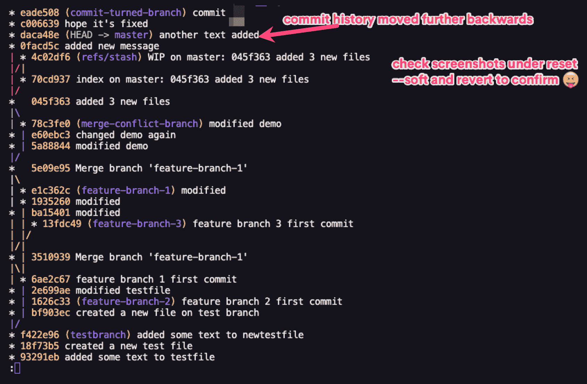

最后一种也是最危险的一种，只能作为最后手段使用，那就是`git reset --hard`选项。这将改变提交历史、分段索引和工作目录。

因此，它首先返回到由提交 ID 指定的提交，取消暂存所有文件，并删除工作目录中所做的所有更改。这意味着如果你修改了任何文件，或者添加了更多的文件，它会从工作目录中删除所有的修改和添加。

您可以理解为什么不建议使用这个命令，除非您别无选择。

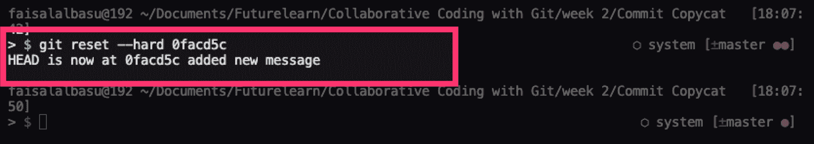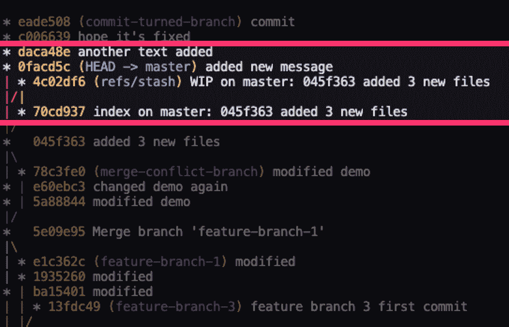

修复或撤销错误最安全的方法是使用`git revert`命令。这是因为它不会改变您的提交历史，但会在有错误的提交之前创建一个新的提交。这样，如果需要的话，您仍然可以返回到带有错误的提交。

## 包扎

我希望这篇文章能让您对使用 Git 时发生的事情有一个清晰的了解。希望您现在已经熟悉了使用 Git 时应该知道的最重要的部分。

如果你想更深入地使用 Git，我的博客里有一篇文章,里面有一些学习 Git 的最佳资源。

如果你已经到了这一步，感谢阅读，我是[费萨尔](https://www.freecodecamp.org/news/p/e2f11707-3a1c-4a8e-9520-8c443204353b/links.albasfaisal.com)。你可以在推特、Instagram 和 YouTube 上了解我。请随意连接这些平台。