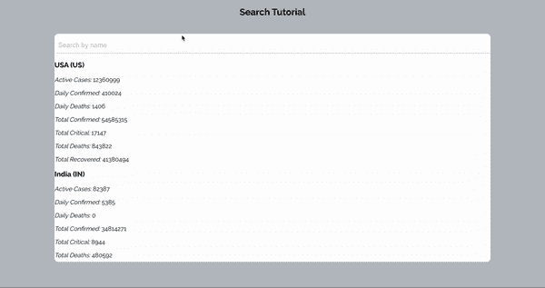
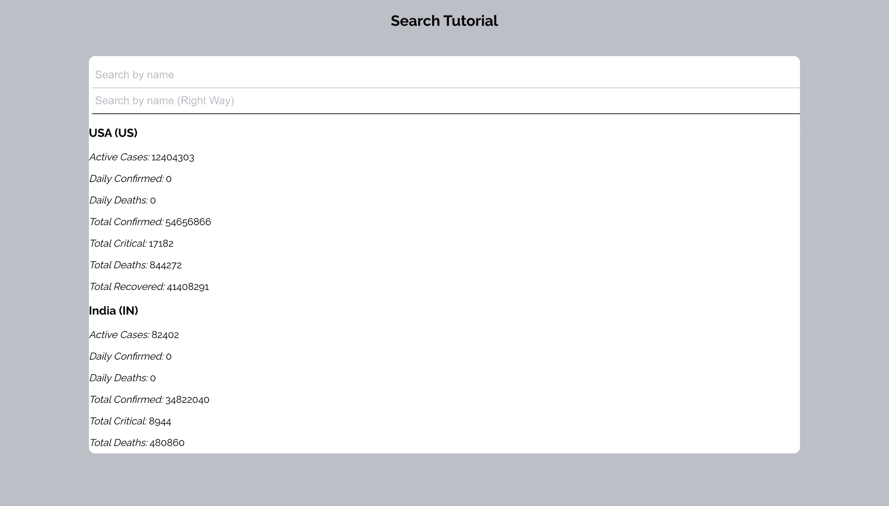
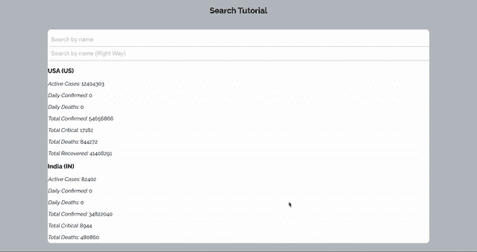

# 如何向前端应用程序添加搜索功能

> 原文：<https://www.freecodecamp.org/news/how-to-add-search-to-frontend-app/>

作为一名软件开发人员，你的工作的一部分就是为那些使用你的网站或产品的人提供最好的用户体验。

建立一个有用而有效的搜索功能是你可以做到这一点的方法之一。因此，如果你正在寻找在网站前端构建搜索功能的正确方法，那你就来对地方了。

前段时间我觉得搜索功能得建在后端，从前端调用。

但是随着我继续构建应用程序，我了解到有时候，你可能不得不在没有*搜索*端点的公共端点中搜索数据。其他时候，前端搜索可能是必要的，以提高网站的速度和用户体验。

本教程将首先介绍我们许多人都采用的设置搜索的“错误方法”。然后我们会学习一种更好的方法。所以跟着我，让我带你一起走。

### 先决条件

如果您对以下方面有基本的了解，那么学习本教程会很容易:

*   [JavaScript](https://developer.mozilla.org/en-US/docs/Learn/JavaScript/First_steps/What_is_JavaScript)
*   [反应](https://reactjs.org/)

## 启动项目

如果你想和我一起编码，我已经做了一个小应用程序给你一个开端。只需克隆[这个库](https://github.com/EBEREGIT/search-tutorial/tree/starter-code)。感兴趣的分支是**起始码分支。**

按照 [ReadMe](https://github.com/EBEREGIT/search-tutorial/blob/starter-code/README.md) 文件中的说明设置项目，您应该看到以下屏幕:


Starter Project Screen

在你现在的项目中，我们从 [coronatracker](https://api.coronatracker.com/) 提供的`src/context/hatchways.js`文件中获取每个国家的新冠肺炎更新。

在我们的`src/App.js`文件中，我们显示了我们得到的结果。一个*搜索*输入框位于结果列表上方。对于这些结果中的每一个，都会呈现出`src/components/Country.js`文件。

当用户在输入框中输入内容时，会调用`filterCountryByName`函数来搜索我们之前收集的国家。这个函数被构建在`src/Helpers/HatchHelper.js`文件中。

所有样式都在`src/styles/App.scss`文件中。

现在，您应该能够在项目中导航并找到自己的路。让我们从你不应该如何构建你的搜索功能开始。

## 如何不构建搜索功能

我们将关注于`src/Helpers/HatchHelper.js`文件来构建搜索功能。

我们已经有了下面的代码:

```
// search countries by name
const filterCountryByName = (name, countries, setResults) => {
  // clear search result if the search field is empty
  if (name === "") {
    setResults([]);
  }

  // discontinue if there is no search yet
  if (name === null || name === "" || countries === []) return;
};
```

接下来，我们需要清空之前的搜索数组，这样我们就不会向其中添加新的搜索结果。这只是以防万一，我们已经做了一个搜索，并希望做另一个。

```
 // empty the previous search array if any
    const searchResult = [];
```

为了一致起见，将*搜索字符串*转换为小写。这将使搜索不区分大小写。

```
const data = name.toLowerCase();
```

现在，像这样循环通过**个国家**:

```
 // loop through all countries
  for (const country of countries) {

  }
```

接下来，收集每个国家的名称，并使其小写，以确保搜索不区分大小写，如下所示:

```
 const countryName = country.countryName.toLowerCase();
```

在下面，检查搜索字符串是否匹配国家名称中的一个字符(`[...countryName].includes(data)`)、国家名称中的一个单词(`countryName.split(" ").includes(data)`)或完整的国家名称(`countryName === data`)，并收集国家详细信息，如下所示:

```
 // check if the search word or character matches
    if (
      [...countryName].includes(data) ||
      countryName === data ||
      countryName.split(" ").includes(data)
    ) {
      searchResult.push(country);
    }
```

循环完成后，用下面的代码行更新搜索结果:

```
setResults(searchResult);
```

`filterCountryByName`函数现在看起来像这样:

```
// search countries by name
const filterCountryByName = (name, countries, setResults) => {
  // clear search result if the search field is empty
  if (name === "") {
    setResults([]);
  }

  // discontinue if there is no search yet
  if (name === null || name === "" || countries === []) return;

  // empty the previous search array if any
  const searchResult = [];
  const data = name.toLowerCase();

  // loop through all countries
  for (const country of countries) {
    const countryName = country.countryName.toLowerCase();

    // check if the search word or character matches
    if (
      [...countryName].includes(data) ||
      countryName === data ||
      countryName.split(" ").includes(data)
    ) {
      searchResult.push(country);
    }
  }

  setResults(searchResult);
};
```

将`src/App.js` 文件中的**主**元素替换为以下代码，以确保搜索过程中的正确反馈:

```
<main>
    {filterByNameResults && filterByNameResults.length
    ? filterByNameResults.map((country) => (
    <Country country={country} />
    ))
    : filterByName && !filterByNameResults.length
    ? "No Result Found!"
    : hatchLoading === "processing"
    ? "Fetching Data..."
    : hatchLoading === "found" && hatches && hatches.length
    ? hatches.map((country) => <Country country={country} />)
    : "No country Found! Check your Internet Connection!"}
</main>
```

### 如何测试你的搜索功能

现在让我们进行搜索，看看我们会得到什么:



Testing How to Make Frontend Search the Wrong Way

下面是对搜索函数进行编码的[错误方式的代码。](https://github.com/EBEREGIT/search-tutorial/tree/wrong-way)

### 上面的搜索方法有什么问题？

您会注意到，搜索字符串必须满足我们为返回结果指定的 3 个条件中的至少一个。

那么，对于一个不确定拼写但知道国家名称中包含的几个字符的用户来说呢？

你有没有注意到用户会花更多的时间来搜索某些单词，因为这些单词必须完全输入才能匹配？

**想想这个**:ITA——应该可以返回意大利，NIGER 应该可以返回尼日尔和尼日利亚，等等。

因此，虽然我们的搜索工作，这些问题使其难以使用，并对用户体验产生负面影响。这现在把我们带到了创建这个搜索功能的正确方法。

## 如何以正确的方式构建搜索功能

我们需要在当前搜索下创建另一个搜索。

首先设置 2 个初始状态来保存这个新搜索的**搜索字符串**和**搜索结果**，如下所示:

```
 const [searchString, setSearchString] = useState("");
  const [searchResult, setSearchResult] = useState([]);
```

接下来，在第一个输入框的正下方制作另一个输入框，如下所示:

```
 {/* search by name the right way*/}
          <input
            name="searchString"
            value={searchString}
            placeholder="Search by name (Right Way)"
            onChange={(e) => setSearchString(e.target.value)}
            onKeyUp={(e) =>
              searchCountryByName(
                e.target.value,
                hatches,
                setSearchResult
              )
            }
          />
```

转到`src/Helpers/HatchHelper.js`文件，在**`filterCountryByName`** 函数下面创建***函数:***

```
*`// search countries by name the right way
const searchCountryByName = (
  searchString,
  countries,
  setSearchResult
) => {

};`*
```

***将它包括在导出中，如下所示:***

```
*`export { filterCountryByName, searchCountryByName };`*
```

***您现在可以将它导入到`src/App.js`文件中，如下所示:***

```
*`import { filterCountryByName, searchCountryByName } from "./Helpers/HatchHelper";`*
```

***现在你应该有了第二个输入框，它还没有做任何事情:***

***

Screen showing a *second input box that doesn’t do anything just yet**** 

#### ***闪烁出功能***

***我们现在将按照我们的期望构建函数。***

***首先添加以下代码行:***

```
 *`// clear search result if the search field is empty
    if (searchString === "") {
      setSearchResult([]);
    }

    // discontinue if there is no search yet
    if (searchString === null || searchString === "" || countries === []) return;`*
```

***接下来，清空先前的搜索数组，如果有的话，如下所示:***

```
*`// empty the previous search array if any
  setSearchResult([]);`*
```

***然后创建一个变量来保存搜索结果:***

```
*`let results = [];`*
```

***为搜索字符串创建正则表达式模式，如下所示:***

```
 *`// create a regular expression pattern for the search string
  const pattern = new RegExp(searchString, "gi");`*
```

> ***在上面的代码中，我们说我们想要使用这个 **searchString** 做一些事情。在使用它时，我们希望它不区分大小写，并且希望得到所有可能的结果。你可以在这里了解更多关于[正则表达式的知识。](https://developer.mozilla.org/en-US/docs/Web/JavaScript/Reference/Global_Objects/RegExp)***

***现在循环遍历各个国家，收集每个国家的名称，如下所示:***

```
 *`// loop through all countries
  for (const country of countries) {
    const countryName = country.countryName;

  }`*
```

***仍然在循环中，测试正则表达式模式是否与我们刚刚收集的 **`countryName`** 匹配。如果是**真**，那么将国家详细信息添加到**结果** 数组中，如下所示:***

```
*`// check if the search word or character matches
if (pattern.test(countryName)) {
    results.push(country);
}`*
```

***最后，使用以下代码更新搜索结果:***

```
*`setSearchResult(results)`*
```

***`searchCountryByName`函数现在看起来像这样:***

```
*`// search countries by name the right way
const searchCountryByName = (
  searchString,
  countries,
  setSearchResult
) => {
  // clear search result if the search field is empty
  if (searchString === "") {
    setSearchResult([]);
  }

  // discontinue if there is no search yet
  if (searchString === null || searchString === "" || countries === []) return;

  // empty the previous search array if any
  setSearchResult([]);
  let results = [];

  // create a regular expression pattern for the search string
  const pattern = new RegExp(searchString, "gi");

  // loop through all countries
  for (const country of countries) {
    const countryName = country.countryName;

    // check if the search word or character matches
    if (pattern.test(countryName)) {
      results.push(country);
    }
  }

  setSearchResult(results)
};`*
```

***返回到`src/App.js`文件，用以下代码替换主元素:***

```
 *`<main>
          {filterByNameResults && filterByNameResults.length
            ? filterByNameResults.map((country) => (
                <Country country={country} />
              ))
            : filterByName && !filterByNameResults.length
            ? "No Result Found!"
            : searchResult && searchResult.length
            ? searchResult.map((country) => <Country country={country} />)
            : searchString && !searchResult.length
            ? "No Result Found!"
            : hatchLoading === "processing"
            ? "Fetching Data..."
            : hatchLoading === "found" && hatches && hatches.length
            ? hatches.map((country) => <Country country={country} />)
            : "No country Found! Check your Internet Connection!"}
        </main>`*
```

***现在，第二个搜索框的结果包括在上面。***

### ***测试你的搜索功能(正确的方法)***

***

Testing How to Make Frontend Search the Right Way*** 

***瓦拉！您刚刚学习了在前端创建搜索的正确方法。😊***

***下面是构建搜索函数的[正确方法的代码。](https://github.com/EBEREGIT/search-tutorial/tree/right-way)***

## ***如何优化您的搜索功能***

***我们真的结束了。所以如果你很忙的话可以跳过这个，但是如果你想改进你的搜索功能的话只需要花一点时间。***

***你会注意到，当你以错误的方式进行搜索并且不刷新页面时，你将会被错误方式的结果所困扰。当第二个搜索框用于正确的方式时，会更好地获得新鲜的结果。***

***为了实现这一点，我们需要清除每一次搜索的所有结果——无论是错误的方式还是正确的方式。让我们执行以下操作:***

***在`src/App.js`中，将第一个搜索框的 *onkey* 事件替换为以下 *:****

```
 *`onKeyUp={(e) =>
              filterCountryByName(
                e.target.value,
                hatches,
                setFilterByNameResults,
                setSearchString,
                setSearchResult
              )
            }`*
```

***将第二个搜索框的 *onkey* 事件替换为以下 *:****

```
 *`onKeyUp={(e) =>
              searchCountryByName(
                e.target.value,
                hatches,
                setSearchResult,
                setFilterByName,
                setFilterByNameResults
              )
            }`*
```

***在`src/Helpers/HatchHelper.js`文件中，添加我们刚刚传递到 **`filterCountryByName`** 中的 2 个参数，如下所示:***

```
*`// search countries by name
const filterCountryByName = (
  name,
  countries,
  setResults,
  setSearchString,
  setSearchResult
) => {...}`*
```

***接下来，在清除初始搜索结果之前，清除其他搜索字段和结果，如下所示:***

```
 *`// clear the other search field and results if any
  setSearchString("");
  setSearchResult([]);`*
```

***现在对 **`searchCountryByName`** 函数做同样的操作。***

#### ***完成后，您应该会得到以下结果:***

***

Our application after we have optimised the functionality*** 

***厉害！👍🏾👍🏾👍🏾***

***这是优化代码。***

## ***结论***

***这是一次令人敬畏的经历，因为我们看到了许多人所犯的错误，以及如何通过创建搜索功能来纠正这些错误，从而为用户提供最佳体验。***

***我相信代码可以改进得更多。所以我鼓励大家再看一下代码，看看如何能做得更好。***

***所有代码都是[这里](https://github.com/EBEREGIT/search-tutorial)。感谢阅读！***