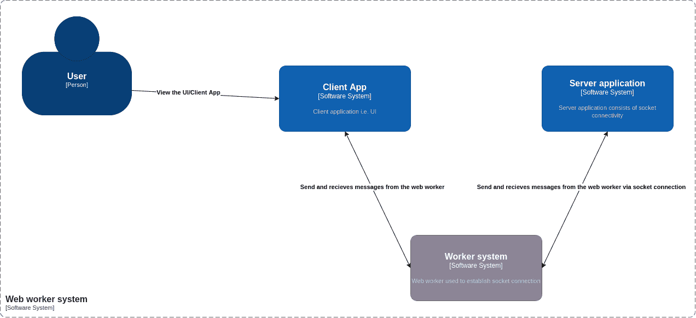
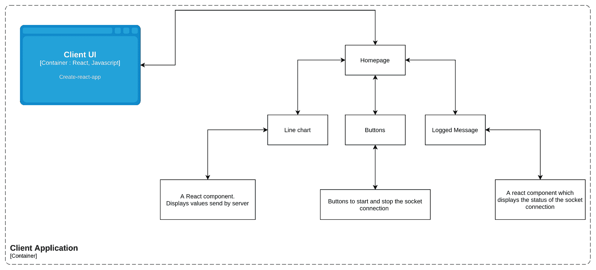
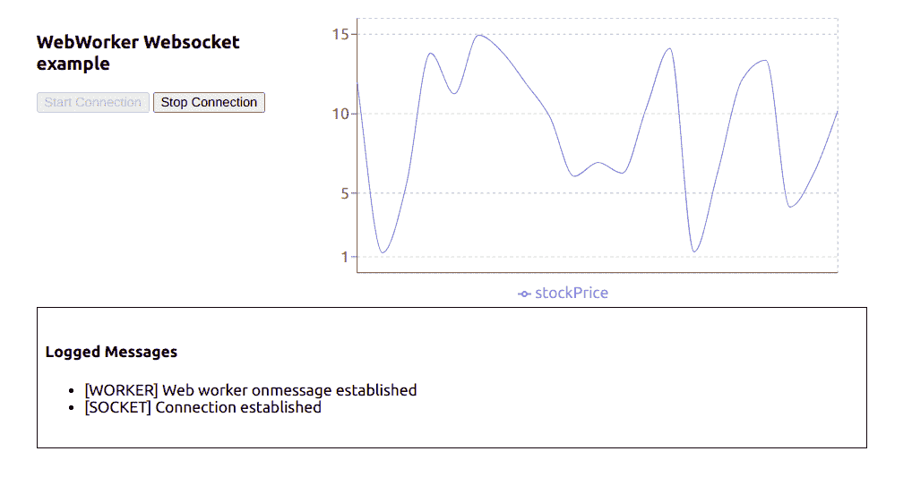
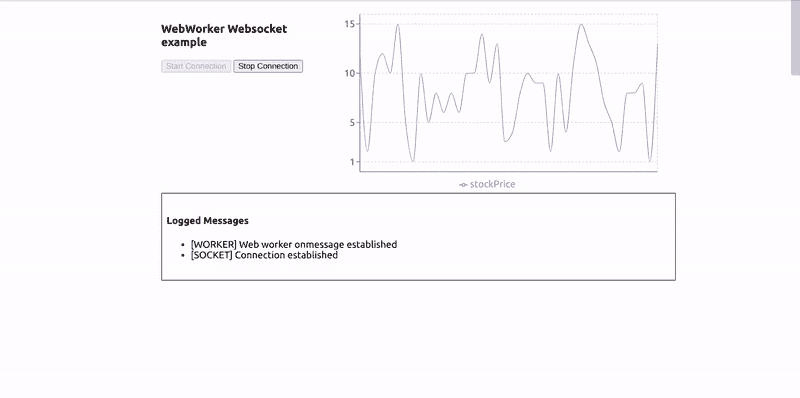

# 网络工作者如何用 JavaScript 工作——一个 JS 实例

> 原文：<https://www.freecodecamp.org/news/how-webworkers-work-in-javascript-with-example/>

在本文中，我将通过一个例子向您展示 web workers 如何借助 WebSockets 在 JavaScript 中工作。

我认为用实际的用例工作是有帮助的，因为当你能把它们与现实生活联系起来时，理解这些概念就简单多了。

因此，在本指南中，您将学习 JavaScript 中的 web workers，您将获得对 WebSockets 的简要介绍，并且您将看到如何以正确的方式管理 Sockets。

这篇文章是非常面向应用/实践的，所以我建议您在阅读过程中尝试一下这个例子，以便更好地理解。

让我们开始吧。

## 目录

*   [先决条件](#prerequisites)
*   [JavaScript 中的 web workers 是什么？](#what-are-web-workers-in-javascript)
*   [web sockets 简介](#brief-introduction-to-web-sockets)
*   [用例描述](#use-case-description)
*   [项目结构](#project-structure)
*   [客户端和服务器架构](#client-and-server-application)
*   [工人系统](#worker-system)
*   [UI 和套接字之间通过 web worker 进行通信](#communication-between-the-ui-and-the-socket-via-web-worker)
*   [总结](#summary)

## 先决条件

在开始阅读本文之前，您应该对以下主题有一个基本的了解:

*   类图:我们将用它们来展示我们的例子。以下是一些资源，您可以利用它们来了解更多信息:
    *   [类图](https://drawio-app.com/uml-class-diagrams-in-draw-io/)
    *   [UML 图教程](https://www.freecodecamp.org/news/uml-diagrams-full-course/)
*   [上下文图和容器图](https://www.notion.so/JS-Classes-a-boon-to-the-society-6360d1a702fe49da9b7ba98b0e03fe37)
*   [反应](https://reactjs.org/)
*   Web 套接字
    *   [插座介绍](https://javascript.info/websocket)
    *   【JavaScript 如何工作:深入研究 WebSockets 和 HTTP/2 与 SSE +如何选择正确的路径
*   [范围和上下文的区别](https://blog.kevinchisholm.com/javascript/difference-between-scope-and-context/)
*   [全局对象](https://developer.mozilla.org/en-US/docs/Glossary/Global_object)

## JavaScript 中的 web workers 是什么？

web worker 是浏览器功能的一部分。真正的操作系统线程可以在当前页面的后台生成，以便执行复杂的资源密集型任务。

假设您要从服务器获取一些大数据，或者需要在 UI 上完成一些复杂的呈现。如果你直接在你的网页上这样做，那么这个页面可能会变得更简洁，并且会影响用户界面。

为了减轻这种情况，你可以简单地创建一个线程——即 web worker——让 web worker 来处理复杂的事情。

您可以用一种非常简单的方式与 web worker 通信，这种方式可以用来在 worker 和 UI 之间来回传输数据。

网络工作者的常见例子有:

*   显示实时数据(如股票价格、实时活跃用户等)的仪表板页面
*   从服务器获取大文件
*   自动保存功能

您可以使用以下语法创建 web worker:

```
const worker = new Worker("<worker_file>.js");
```

`Worker`是一个 API 接口，让你在后台创建一个线程。我们需要传递一个参数，那就是一个`<worker_file>.js`文件。这指定了 API 需要执行的工人文件。

**注意**:一旦发起`Worker`调用，就会创建一个线程。该线程只与它的创建者通信，即创建该线程的文件。

一个工人可以被多个消费者/脚本共享或使用。这些人被称为共享工作者。共享工作器的语法与上面提到的工作器非常相似。

```
const worker = new SharedWorker("<worker_file>.js");
```

你可以在本指南中了解更多关于`SharedWorker`的信息。

### 网络工作者的历史

Web workers 在不同的上下文中执行，也就是说，它们不在诸如窗口上下文之类的全局范围中执行。Web 工作者有自己专用的工作者上下文，称为`DedicatedWorkerGlobalScope`。

但是，在某些情况下，您不能使用 web workers。例如，您不能使用它们来操作 DOM 或窗口对象的属性。这是因为工作线程没有访问窗口对象的权限。

网络工作者也可以产生新的网络工作者。Web 工作者使用某些方法与他们的创建者交流，比如`postMessage`、`onmessage`和`onerror`。我们将在本文后面的小节中仔细研究这些方法。

## Web 套接字简介

web 套接字是使用 web 套接字协议在两方/实体之间发生的一种通信。它实际上提供了一种以持久方式在两个连接的实体之间进行通信的方法。

您可以创建一个简单的 web 套接字，如下所示:

```
const socket = new WebSocket("ws://example.com");
```

在这里，我们创建了一个简单的套接字连接。您会注意到我们已经向`WebSocket`构造函数传递了一个参数。此参数是应该建立连接的 URL。

您可以通过参考先决条件中的 **Websockets** 链接来阅读更多关于 web sockets 的内容。

## 用例描述

**注意:**在这篇博文中绘制的上下文、容器和类图并没有准确地遵循这些图的确切约定。它们在这里是近似的，以便你能理解基本概念。

在我们开始之前，我建议阅读 C4 模型、容器图和上下文图。您可以在先决条件部分找到关于它们的参考资料。

在本文中，我们将考虑以下用例:通过套接字协议使用 web workers 进行数据传输。

我们将构建一个 web 应用程序，它将每 1.5 秒在一个折线图上绘制数据。web 应用程序将通过 web workers 从套接字连接接收数据。下面是我们用例的上下文图:



Container Diagram

从上图中可以看出，我们的用例有 4 个主要组成部分:

1.  个人:将要使用我们的应用程序的用户
2.  软件系统:客户端应用程序——这是我们应用程序的 UI。它由 DOM 元素和一个 web worker 组成。
3.  软件系统:工作者系统–这是一个驻留在客户端应用程序中的工作者文件。它负责创建一个工作线程并建立套接字连接。
4.  软件系统:服务器应用程序——这是一个简单的 JavaScript 文件，可以由`node`执行来创建一个套接字服务器。它由帮助从套接字连接读取消息的代码组成。

现在我们已经理解了用例，让我们深入每个模块，看看整个应用程序是如何工作的。

## **项目**结构

请通过这个[链接](https://github.com/keyurparalkar/webworker_examples)获得我为本文开发的项目的完整代码。

我们的项目分为两个文件夹。第一个是由服务器代码组成的服务器文件夹。第二个是客户端文件夹，由客户端 UI 组成，它是一个 React 应用程序和 web worker 代码。

以下是目录结构:

```
├── client
│   ├── package.json
│   ├── package-lock.json
│   ├── public
│   │   ├── favicon.ico
│   │   ├── index.html
│   │   ├── logo192.png
│   │   ├── logo512.png
│   │   ├── manifest.json
│   │   └── robots.txt
│   ├── README.md
│   ├── src
│   │   ├── App.css
│   │   ├── App.jsx
│   │   ├── components
│   │   │   ├── LineChartSocket.jsx
│   │   │   └── Logger.jsx
│   │   ├── index.css
│   │   ├── index.js
│   │   ├── pages
│   │   │   └── Homepage.jsx
│   │   ├── wdyr.js
│   │   └── workers
│   │       └── main.worker.js
│   └── yarn.lock
└── server
    ├── package.json
    ├── package-lock.json
    └── server.mjs
```

要运行应用程序，首先需要启动套接字服务器。一次执行一个命令来启动套接字服务器(假设您在父目录中):

```
cd server
node server.mjs
```

然后通过运行以下命令启动客户端应用程序(假设您在父目录中):

```
cd client
yarn run start
```

打开`http://localhost:3000`启动网络应用。

## 客户端和服务器应用程序

客户端应用是一个简单的 React 应用，即 [CRA app](https://create-react-app.dev/) ，由一个主页组成。该主页由以下元素组成:

*   两个按钮:`start connection`和`stop connection`，根据需要帮助启动和停止插座连接。
*   这个组件将绘制我们定期从套接字接收的数据。
*   这是一个简单的 React 组件，它将显示我们的 web 套接字的连接状态。

下面是我们的客户端应用程序的容器图。



Container Diagram: Client Application

下面是用户界面的外观:



Actual UI

要签出客户端 UI 的代码，请转到客户端文件夹。这是一个常规的 create-react-app，除了我已经删除了一些我们在这个项目中不需要的样板代码。

`App.jsx`实际上是启动代码。如果您检查一下，我们已经在其中调用了`<Homepage />`组件。

现在我们来看看`Homepage`组件。

```
const Homepage = () => {
  const [worker, setWorker] = useState(null);
  const [res, setRes] = useState([]);
  const [log, setLog] = useState([]);
  const [buttonState, setButtonState] = useState(false);

  const hanldeStartConnection = () => {
    // Send the message to the worker [postMessage]
    worker.postMessage({
      connectionStatus: "init",
    });
  };

  const handleStopConnection = () => {
    worker.postMessage({
      connectionStatus: "stop",
    });
  };

	//UseEffect1
  useEffect(() => {
    const myWorker = new Worker(
      new URL("../workers/main.worker.js", import.meta.url)
    ); //NEW SYNTAX
    setWorker(myWorker);

    return () => {
      myWorker.terminate();
    };
  }, []);

	//UseEffect2
  useEffect(() => {
    if (worker) {
      worker.onmessage = function (e) {
        if (typeof e.data === "string") {
          if(e.data.includes("[")){
            setLog((preLogs) => [...preLogs, e.data]);
          } else {
            setRes((prevRes) => [...prevRes, { stockPrice: e.data }]);
          }
        }

        if (typeof e.data === "object") {
          setButtonState(e.data.disableStartButton);
        }
      };
    }
  }, [worker]);

  return (
    <>
      <div className="stats">
        <div className="control-panel">
          <h3>WebWorker Websocket example</h3>
          <button
            id="start-connection"
            onClick={hanldeStartConnection}
            disabled={!worker || buttonState}
          >
            Start Connection
          </button>
          &nbsp;
          <button
            id="stop-connection"
            onClick={handleStopConnection}
            disabled={!buttonState}
          >
            Stop Connection
          </button>
        </div>
        <LineChartComponent data={res} />
      </div>
      <Logger logs={log}/>
    </>
  );
};
```

如您所见，这只是一个呈现两个按钮的常规功能组件——一个折线图和一个定制组件`Logger`。

现在我们知道了主页组件的外观，让我们深入了解 web worker 线程实际上是如何创建的。在上面的组件中，你可以看到使用了两个`useEffect`钩子。

第一个用于创建新的工作线程。这是一个简单的调用，用一个新的操作符调用`Worker`构造函数，正如我们在本文前面部分看到的。

但是这里有一些不同:我们向 worker 构造函数传递了一个 URL 对象，而不是在字符串中传递 worker 文件的路径。

```
const myWorker = new Worker(new URL("../workers/main.worker.js", import.meta.url));
```

你可以在这里阅读更多关于这个语法的内容。

如果您尝试像下面这样导入此 web worker，那么我们的 create-react-app 将无法正确加载/捆绑它，因此您将会得到一个错误，因为它在捆绑期间没有找到 worker 文件:

```
const myWorker = new Worker("../workers/main.worker.js");
```

接下来，我们也不希望我们的应用程序在刷新后运行工作线程，或者不希望在刷新页面时产生多个线程。为了减轻这种情况，我们将在同一个 useEffect 中返回一个回调。当组件卸载时，我们使用这个回调来执行清理。在这种情况下，我们将终止工作线程。

我们使用`useEffect2`来处理从 worker 收到的消息。

Web workers 有一个名为`onmessage`的内置属性，它帮助接收 worker 线程发送的任何消息。`onmessage`是工人接口的事件处理程序。每当消息事件被触发时，它就会被触发。每当执行`postMessage`处理程序时，通常都会触发这个消息事件(我们将在后面的章节中对此进行更深入的探讨)。

因此，为了向工作线程发送消息，我们创建了两个处理程序。第一个是`handleStartConnection`，第二个是`handleStopConnection`。它们都使用工人接口的`postMessage`方法将消息发送到工人线程。

我们将在下一节讨论消息`{connectionStatus: init}`。

您可以在以下参考资料中了解更多关于`onmessage`和`postMessage`的内部工作原理:

*   [Onmessage](https://developer.mozilla.org/en-US/docs/Web/API/Worker/onmessage)
*   [邮件信息](https://developer.mozilla.org/en-US/docs/Web/API/DedicatedWorkerGlobalScope/postMessage)

既然我们现在对我们的客户端代码是如何工作的有了一个基本的了解，那么让我们继续学习上面的上下文图中的 **Worker 系统。**

## 工人制度

要理解本节中的代码，请确保您浏览了文件`src/workers/main.worker.js`。

为了帮助您理解这里发生的事情，我们将代码分成三个部分:

1.  一个`self.onmessage`段
2.  如何使用`socketManagement()`功能管理套接字连接
3.  为什么我们需要顶部的`socketInstance`变量

### `self.onmessage`如何工作

每当您创建一个 web worker 应用程序时，您通常会编写一个 worker 文件来处理您希望 worker 执行的所有复杂场景。这一切都发生在`main.worker.js`文件中。这个文件是我们的工人文件。

在上面的部分中，我们看到我们在`useEffect`中创建了一个新的 worker 线程。一旦我们创建了线程，我们还将两个处理程序分别附加到了`start`和`stop`连接按钮上。

`start connection`按钮将执行`postMessage`方法，并显示消息:`{connectionStatus: init}`。这触发了消息事件，由于消息事件被触发，所有的消息事件都被`onmessage`属性捕获。

在我们的`main.worker.js`文件中，我们为这个`onmessage`属性附加了一个处理程序:

```
self.onmessage = function (e) {
  const workerData = e.data;
  postMessage("[WORKER] Web worker onmessage established");
  switch (workerData.connectionStatus) {
    case "init":
      socketInstance = createSocketInstance();
      socketManagement();
      break;

    case "stop":
      socketInstance.close();
      break;

    default:
      socketManagement();
  }
}
```

因此，每当客户端触发任何消息事件时，它都会在这个事件处理程序中被捕获。

我们从客户端发送的消息`{connectionStatus: init}`在事件`e`中被接收。基于 connectionStatus 的值，我们使用 switch case 来处理逻辑。

**注意:**我们添加了这个开关案例，因为我们需要隔离我们不想一直执行的代码的某个部分(我们将在后面的部分中研究这个问题)。

### 如何使用`socketManagement()`功能管理套接字连接

我将创建和管理套接字连接的逻辑转移到一个单独的函数中有一些原因。为了更好地理解我的观点，下面是一些代码:

```
function socketManagement() {
  if (socketInstance) {
    socketInstance.onopen = function (e) {
      console.log("[open] Connection established");
      postMessage("[SOCKET] Connection established");
      socketInstance.send(JSON.stringify({ socketStatus: true }));
      postMessage({ disableStartButton: true });
    };

    socketInstance.onmessage = function (event) {
      console.log(`[message] Data received from server: ${event.data}`);
      postMessage( event.data);
    };

    socketInstance.onclose = function (event) {
      if (event.wasClean) {
        console.log(`[close] Connection closed cleanly, code=${event.code}`);
        postMessage(`[SOCKET] Connection closed cleanly, code=${event.code}`);
      } else {
        // e.g. server process killed or network down
        // event.code is usually 1006 in this case
        console.log('[close] Connection died');
        postMessage('[SOCKET] Connection died');
      }
      postMessage({ disableStartButton: false });
    };

    socketInstance.onerror = function (error) {
      console.log(`[error] ${error.message}`);
      postMessage(`[SOCKET] ${error.message}`);
      socketInstance.close();
    };
  }
}
```

这是一个帮助您管理套接字连接的函数:

*   为了接收来自 socket 服务器的消息，我们有一个`onmessage`属性，它被分配了一个事件处理程序。
*   每当套接字连接打开时，您都可以执行某些操作。为此，我们将`onopen`属性分配给一个事件处理程序。
*   如果发生任何错误，或者当我们关闭连接时，我们使用套接字的`onerror`和`onclose`属性。

为了创建套接字连接，有一个单独的函数:

```
function createSocketInstance() {
  let socket = new WebSocket("ws://localhost:8080");

  return socket;
} 
```

现在，所有这些函数都在一个开关案例中被调用，如下面的`main.worker.js`文件:

```
self.onmessage = function (e) {
  const workerData = e.data;
  postMessage("[WORKER] Web worker onmessage established");
  switch (workerData.connectionStatus) {
    case "init":
      socketInstance = createSocketInstance();
      socketManagement();
      break;

    case "stop":
      socketInstance.close();
      break;

    default:
      socketManagement();
  }
}
```

因此，根据客户端 UI 发送给工作人员的消息，将执行适当的功能。根据上面的代码，应该触发哪个特定函数的消息是不言自明的。

现在考虑一个场景，我们将所有代码放在`self.onmessage`中。

```
self.onmessage = function(e){
    console.log("Worker object present ", e);
    postMessage({isLoading: true, data: null});

    let socket = new WebSocket("ws://localhost:8080");

		socket.onopen = function(e) {
		  console.log("[open] Connection established");
		  console.log("Sending to server");
		  socket.send("My name is John");
		};

		socket.onmessage = function(event) {
		  console.log(`[message] Data received from server: ${event.data}`);
		};

		socket.onclose = function(event) {
		  if (event.wasClean) {
		    console.log(`[close] Connection closed cleanly, code=${event.code} reason=${event.reason}`);
		  } else {
		    // e.g. server process killed or network down
		    // event.code is usually 1006 in this case
		    console.log('[close] Connection died');
		  }
		};

			socket.onerror = function(error) {
			  console.log(`[error] ${error.message}`);
			};
}
```

这将导致以下问题:

1.  在客户端 UI 发出的每个`postMessage`调用中，都会有一个新的套接字实例。
2.  很难关闭套接字连接。

由于这些原因，所有的套接字管理代码都写在函数`socketManagement`中，并使用一个开关盒来满足。

### 为什么我们需要顶部的`socketInstance`变量

我们确实需要在顶部有一个`socketInstance`变量，因为这将存储之前创建的套接字实例。这是一种安全的做法，因为没有人可以从外部访问这个变量，因为`main.worker.js`是一个完全独立的模块。

## 通过 web worker 在 UI 和套接字之间进行通信

现在我们已经了解了代码的哪一部分负责哪一部分，我们将看看如何通过 webworkers 建立套接字连接。我们还将看到如何通过 socket server 在 UI 上显示折线图。


End-to-end flow of the application

**注意:**图中故意没有显示一些调用，因为这会使图变得混乱。请确保在参考此图时也参考了代码。

现在，让我们首先了解当您点击 UI 上的`start connection`按钮时会发生什么:

1.  这里需要注意的一点是，一旦组件被挂载，我们的 web worker 线程就会被创建，当组件被卸载时，它就会被删除/终止。
2.  一旦点击`start connection`按钮，就用`{connectionStatus: init}`发出`postMessage`呼叫
3.  正在监听所有消息事件的 web worker 的`onmessage`事件处理程序知道它已经收到了作为 init 的 *connectionStatus。*匹配案例，即`main.worker.js`的开关案例。然后它调用`createSocketInstance()`，后者在 URL: `ws://localhost:8080`返回一个新的套接字连接
4.  在这之后，调用一个`socketManagement()`函数来检查套接字是否被创建，然后执行一些操作。
5.  在这个流程中，由于 socket 连接刚刚建立，因此 socketInstance 的`onpen`事件处理程序被执行。
6.  这将向套接字服务器发送一条`{socketStatus: true}`消息。这也将通过`postMessage({ disableStartButton: true})`向客户端 UI 发回一条消息，告诉客户端 UI 禁用开始按钮。
7.  每当建立套接字连接时，就会调用服务器套接字的`on('connection', ()=>{})`。所以在步骤 3 中，这个函数在服务器端被调用。
8.  每当消息被发送到套接字时，套接字的`on('message', () => {})`被调用。所以在第 6 步，这个函数在服务器端被调用。这将检查`socketStatus`是否为真，然后它将开始通过 web workers 每 1.5 秒向客户端 UI 发送一个随机整数。

现在我们已经了解了连接是如何建立的，让我们继续了解套接字服务器如何将数据发送到客户端 UI:

1.  如上所述，套接字服务器接收到发送数据的消息，即每 1.5 秒一个随机数。
2.  这个数据是在 web worker 端使用`onmessage`处理程序接收的。
3.  然后，这个处理程序调用`postMessage`函数，并将数据发送到 UI。
4.  收到数据后，它将数据作为一个`stockPrice`对象添加到一个数组中。
5.  这充当我们的折线图组件的数据源，并且每 1.5 秒更新一次。

现在我们已经了解了连接是如何建立的，让我们继续了解套接字服务器如何将数据发送到客户端 UI:

1.  如上所述，socket 服务器每 1.5 秒接收一次发送数据的消息，这是一个随机数。
2.  使用套接字的`onmessage`处理程序在 web worker 端接收这些数据。
3.  然后，这个处理程序调用 web worker 的`postMessage`函数，并将这些数据发送到 UI。
4.  通过`useEffect2`接收数据后，它将数据作为一个`stockPrice`对象添加到一个数组中。
5.  这充当我们的折线图组件的数据源，并且每 1.5 秒更新一次。

**注意:**我们使用 recharts 来绘制折线图。你可以在[官方网站](https://recharts.org/en-US/)找到更多相关信息。

下面是我们的应用程序实际运行的样子:



Working Example

## 摘要

所以这是对什么是 web workers 以及如何使用它们来解决复杂问题和创建更好的 ui 的快速介绍。您可以在项目中使用 web workers 来处理复杂的 UI 场景。

如果您想要优化您的员工，请阅读以下库:

*   [comlink](https://www.npmjs.com/package/comlink)
*   [thread.js](https://threads.js.org/)

感谢您的阅读！

在 [twitter](https://twitter.com/keurplkar) 、 [github](http://github.com/keyurparalkar) 和 [linkedIn](https://www.linkedin.com/in/keyur-paralkar-494415107/) 上关注我。