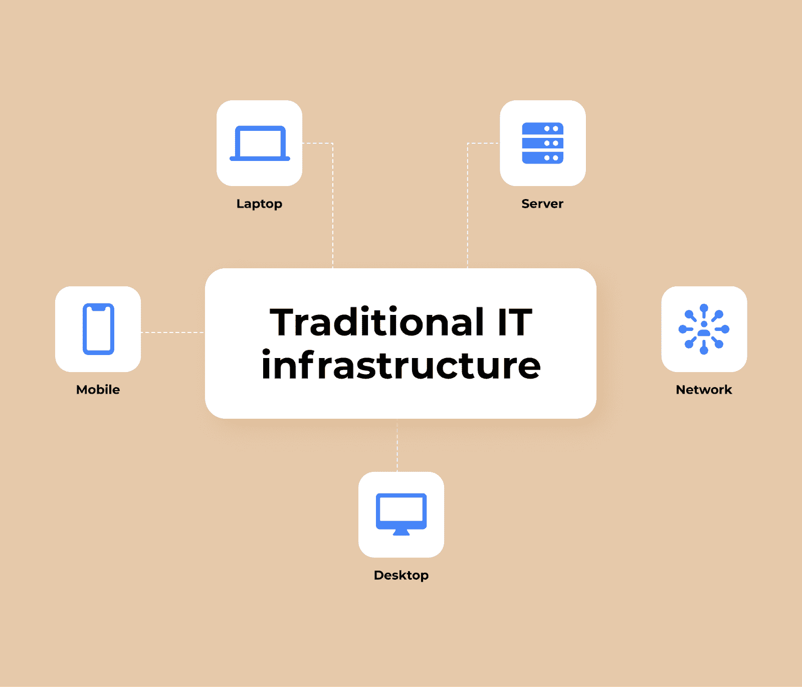
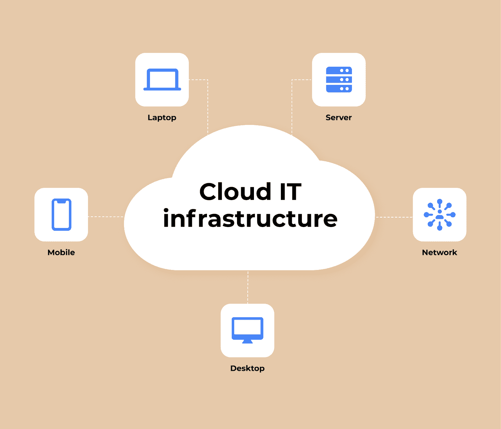
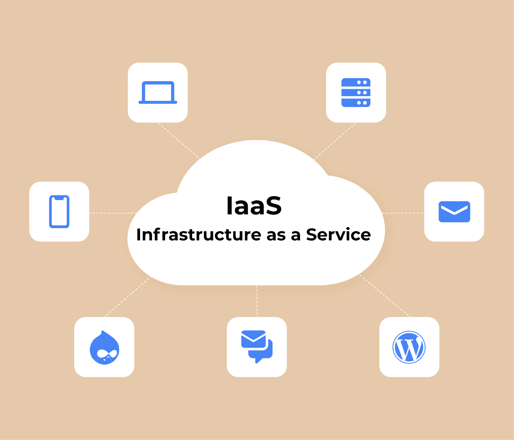

# 什么是 IT 基础设施？初学者指南

> 原文：<https://www.freecodecamp.org/news/what-is-it-infrastructure/>

很难想象一个企业连一些基本的 It 基础设施都没有就能运营。

连接在一起的数字解决方案和硬件有助于提高公司的生产力。良好的基础设施改善了内部流程和不同部门之间的沟通。

IT 基础设施基于旨在管理内部业务生态系统或提供业务外部服务的各种组件。基础设施组织得越好、越周到，企业就越能获利和扩张。

在本文中，我们将更详细地讨论 IT 基础架构由什么组成，什么类型的基础架构最受欢迎，以及如何管理 IT 基础架构以提高效率。

所以，事不宜迟，我们开始吧。

## IT 基础架构的组件

您无法从零开始构建 IT 基础架构。整个生态系统由软件解决方案、各种硬件和网络连接组成，它们同时协同工作，相互补充。

整个想法是改善不同设备之间的通信，无论是台式电脑、平板电脑、扫描仪、各种服务器还是云存储。

那么，让我们仔细看看 IT 基础架构的主要组件:

### 五金器具

硬件是指帮助您组织基础设施的物理组件和设备。他们是它的基础。硬件是指:

*   台式电脑
*   笔记本电脑
*   平板电脑、智能手机和其他移动设备
*   服务器和数据中心
*   互联网集线器和路由器

### 软件

软件可以包括各种程序和应用程序，企业使用这些程序和应用程序来运行、提供服务、操作内部管道等等。此外，可以将各种操作系统分配给软件，所有程序和应用程序都安装在该软件上。

因此，软件部分包括:

*   内容管理系统
*   客户关系管理
*   企业资源规划
*   操作系统
*   网络服务器
*   用于内部工作的定制软件

### 网络

网络允许您将设备组合成一个网络，并将它们连接到互联网。该连接由安全防火墙保护，保护其免受恶意软件和破坏。网络包括以下组件:

*   服务器
*   数据中心
*   中心
*   路由器
*   开关

## IT 基础设施的类型

我们上面讨论的一切都是我们都习惯的标准 IT 基础设施的一部分。这种结构可以在各种规模的企业中找到，并且完全从企业内部进行管理。

简单来说，该公司有自己的服务器或数据中心，所有其他装有自己软件的设备都连接到这些服务器或数据中心。

这种方法允许公司完全控制其基础架构的状态，管理、改进它，等等。不足为奇的是，对许多人来说，这种类型的基础设施似乎是唯一正确的。

然而，还有第二种类型的基础设施——基于云的基础设施——它越来越受欢迎，因为它比传统的基础设施设置有许多优势。让我们更详细地谈谈这两种类型，这样你就可以有一个完整的画面。

### 传统基础设施

传统基础设施的主要组件是硬件和软件。例如，这可以是各种服务器和台式机。所有设备都位于一个屋檐下，便于访问必要的信息和计算能力。

这种基础设施需要部署地点有大量空闲空间，以及设备本身的功率。因此，开发和安装这种类型的基础设施会更加昂贵。

此外，这种系统需要不断的监控、维护和更新，以满足不断变化的市场现实。

这意味着，除了在设备上的花费，您还将在基础设施管理团队上花费资金，该团队将监控其状况、解决问题并及时进行诊断和升级。

该选项是最安全的数据存储解决方案，因为它允许您完全管理企业内的所有数据和软件。

#### 传统基础设施的优势

*   与该系统一起，您将获得一个完全参与基础架构管理的专门团队。
*   在更新基础设施的同时，您还需要更新软件，这可以让您始终处于新技术解决方案的前沿。
*   你有能力使用各种类型的软件。

### 基于云的基础设施

由于云基础设施的灵活性，现在越来越多的企业使用云基础设施。那么它与标准基础设施的主要区别是什么呢？

主要区别在于，您没有支持办公室基础设施的设备。所有服务器、软件解决方案和数据存储都位于云中。

因此，您不必在硬件和数据中心上花费大量资金，这些硬件和数据中心可以为您的设施处理内部 IT 基础架构。相反，你可以找到一个云服务提供商，并租用你需要的云存储空间，将你的所有内部管道转移到其中(包括有价值的数据、应用程序等等)。

此外，您可以在一个基于云的软件上找到您的 IT 基础架构。因此，您的企业将从[云应用开发](https://www.cleveroad.com/blog/cloud-application-development)中获得以下优势:

*   所有数据都将存储在云中。但如果有需要，用户可以将它存储在他们的设备上，以便离线访问。
*   员工可以在任何设备上随时随地使用这种应用程序。

现在，我们来谈谈基于云的 IT 基础架构的主要优势。

### 基于云的 IT 基础设施的优势

#### 极大的灵活性和可扩展性

如果你的公司想要快速发展，灵活性和可伸缩性是很重要的。而сloud 结构对存储空间没有限制，对计算需求有更大的马力。

除此之外，如果需要，可以更容易地扩展整个结构，增加或减少服务器的数量。

#### 自动化能力

通过将云技术引入您的企业，您将摆脱与设备管理和安全问题相关的难题。

所有这些操作都外包给一家供应商，该供应商为您提供基于云的结构，而您可以专注于业务的其他重要方面。

#### 性价比很高

您可能会惊讶于云 IT 基础架构的经济性。这主要是因为你只为你使用的特定服务付费。您不需要在设备、管理、升级和供应商正在处理的其他方面花钱。

## 什么是 IT 基础设施管理？

IT 基础架构是一种复杂的机制，需要特殊的管理方法。为了使它更容易，有三个管理领域你应该知道。

### IT 运营管理

IT 运营管理完全是关于帮助保持基础架构运行的工具和流程。主要思想是通过广泛的功能，如网络资产发现、操作分析、数据收集等，最大限度地提高基础设施的可靠性和效率。

ServiceNow 开发的解决方案在这个领域非常受欢迎。它包括一套开发的复杂模块，即:

*   用于收集有关发现结构的信息的模块
*   事件管理模块
*   作战情报模块
*   日常 IT 流程的自动化模块
*   服务拓扑构建模块
*   云资源管理模块

ITOM 工具实时跟踪您的 IT 基础设施的健康状况。例如，时代华纳利用这一机会简化了事件管理。

### IT 服务管理

这种方法与前一种方法有些不同，因为它的主要目标是将负责各种 IT 服务的设计、创建、交付、支持和生命周期管理的所有操作结合起来。这些操作的核心是帮助大型企业中的特定用户优化部署特定的 IT 解决方案。

对于 ITSM 来说，购买 FreshService 非常划算，因为它是一个 ITIL 就绪的云服务支持平台。该工具可以为各种类型和规模的企业提供各种规模的 ITSM 支持。

它的主要功能是移动应用程序的存在、事件根本原因的分析功能，以及问题、项目和配置的管理。

### IT 资产管理

最后一种类型负责允许您管理基础设施生命周期的操作，从硬件到软件解决方案。该方法的主要目标是优化支持成本、控制基础架构本身以及基础架构中使用的软件的许可协议。

两个 ServiceNow 应用程序 Discovery 和 Mapping Service 可以帮助完成这些任务。

前者自动发现和识别新资产(例如，连接到公司网络的服务器)，并将有关它们的信息输入到一个特殊的数据库中。同时，第二个解决方案定义了服务和构建这些服务的基础设施元素之间的关系。因此，所有 IT 部门和公司流程变得更加透明。

## 什么是基础架构即服务，它对企业有什么好处？

基础架构即服务是当今企业创建基础架构的最终方式。主要思想是，提供云功能的供应商也参与设备和网络的管理，而业务本身通过单独的 API 获得访问。

以这种方式组织基础架构的主要优势是:

*   你为你使用的东西付费。您有权选择企业所需的运营和服务，最终支票将只包含这些服务的成本。
*   全球支出很少，因为付款是每月一次的小额分期付款。
*   高级别的安全措施。供应商投入大量资金和技术手段来确保其客户基础设施的最大安全性。
*   对基础设施的访问极其简单，可以从任何具有互联网连接的设备上进行。

## 包装东西

当今的 IT 基础设施是任何现代企业的支柱，无论其规模或行业如何。整合到一个系统中的技术使企业能够实现流程自动化，改善内部和外部渠道，并创造新的绩效记录。

但是，如果没有一个良好的 IT 基础设施，就不可能获得竞争优势，因此，您可能会陷入竞争对手的阴影中。

这就是为什么您应该考虑组织您自己的 IT 基础架构，或者将您现有的基础架构升级到更高级的云解决方案，这将促进您的业务并改善所有运营方面。