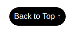

# 如何只用 CSS 制作一个动画的返回顶部按钮

> 原文：<https://www.freecodecamp.org/news/css-only-back-to-top-button/>

网站上有一个“返回页首”按钮是很重要的。它允许用户轻松地滚动回页面顶部。

大多数网站依靠 JavaScript 根据滚动量来切换按钮的可见性。在这篇文章中，我将向你展示如何只用 CSS 创建这样的效果。

我们将探讨两种效果——“滑动”和“褪色”效果。

## 如何制作一个滑动回到顶部按钮

以下是我们在这一部分所构建内容的概述:

<details><summary>Click to see the full code</summary>

```
<body>
  <div>
    <!-- your content goes here  -->
  </div>
  <a href="#" class="top">Back to Top &#8593;</a>
</body> 
```

```
body {
  display: grid;
  grid-template-columns: auto 0px; 
}

.top {
  --offset: 50px; 

  position: sticky;
  bottom: 20px;      
  margin-right: 10px; 
  place-self: end;
  margin-top: calc(100vh + var(--offset));

  /* visual styling */
  text-decoration: none;
  padding: 10px;
  font-family: sans-serif;
  color: #fff;
  background: #000;
  border-radius: 100px;
  white-space: nowrap;
}

p {
  font-size: 25px;
} 
```</details> 

[https://codepen.io/t_afif/embed/preview/9305df2ed45a40db3e654290147665ff?default-tabs=html%2Cresult&height=300&host=https%3A%2F%2Fcodepen.io&slug-hash=9305df2ed45a40db3e654290147665ff](https://codepen.io/t_afif/embed/preview/9305df2ed45a40db3e654290147665ff?default-tabs=html%2Cresult&height=300&host=https%3A%2F%2Fcodepen.io&slug-hash=9305df2ed45a40db3e654290147665ff)

Sliding "back to top" button using CSS

如果你滚动，将会出现“返回顶部”按钮，并停留在页面底部。点击它，你会回到顶端！

你会发现里面没有 JavaScript。我们将只使用 CSS 来使按钮在你滚动页面时出现。

很酷，对吧？让我们仔细分析代码，了解其背后的魔力。

### HTML 结构

```
<body>
  <div>
    <!-- your content goes here  -->
  </div>
  <a href="#" class="top">...</a>
</body>
```

在`body`标签中，我们创建了一个`div`来放置网站的内容。紧接着，我们添加了“返回顶部”按钮作为链接。

出于对本文的考虑，我将尽可能保持按钮的简单，但是您可以使用任何您想要的东西(图像、图标等等)。你需要做的就是保持`a`和`href="#"`结合使用。

就是这样！我们已经完成了 HTML 结构。

### CSS 代码

我们首先从设计按钮开始。对于这一部分，这取决于你的创意和建立自己的按钮。我将使用一个基本按钮(`<a class="top" href="#">Back to Top ↑</a>`)，样式如下:

```
.top {
  text-decoration: none;
  padding: 10px;
  font-family: sans-serif;
  color: #fff;
  background: #000;
  border-radius: 100px;
}
```

这将得到以下结果:



让我们转到主 CSS。我们想要的效果使用了两种 CSS 技术:

1.  CSS 网格创建主结构
2.  `position: sticky`能够保持按钮在屏幕底部

我们的结构将是一个由两列组成的网格——一列用于内容，另一列用于“返回顶部”按钮。为此，我们添加以下代码:

```
body {
  display: grid;
  grid-template-columns: auto auto;
}
```

这给了我们以下结果:

[https://codepen.io/t_afif/embed/preview/f356b9aa5d03912dec73d9d4f2305eb7?default-tabs=html%2Cresult&height=300&host=https%3A%2F%2Fcodepen.io&slug-hash=f356b9aa5d03912dec73d9d4f2305eb7](https://codepen.io/t_afif/embed/preview/f356b9aa5d03912dec73d9d4f2305eb7?default-tabs=html%2Cresult&height=300&host=https%3A%2F%2Fcodepen.io&slug-hash=f356b9aa5d03912dec73d9d4f2305eb7)

是的，它看起来很“丑”但是不要担心。这是因为 CSS 网格的默认拉伸对齐方式。我们必须禁用它，并使用`place-self: end`将我们的按钮放在底部。

[https://codepen.io/t_afif/embed/preview/1e33f3acf4c05a730eb259b63e9bee82?default-tabs=html%2Cresult&height=300&host=https%3A%2F%2Fcodepen.io&slug-hash=1e33f3acf4c05a730eb259b63e9bee82](https://codepen.io/t_afif/embed/preview/1e33f3acf4c05a730eb259b63e9bee82?default-tabs=html%2Cresult&height=300&host=https%3A%2F%2Fcodepen.io&slug-hash=1e33f3acf4c05a730eb259b63e9bee82)

现在让我们通过添加以下代码来介绍`position: sticky`:

```
.top {
  position: sticky;
  bottom: 20px; 
}
```

[https://codepen.io/t_afif/embed/preview/97fc75f4e30d29baf2100a6684dc2e32?default-tabs=html%2Cresult&height=300&host=https%3A%2F%2Fcodepen.io&slug-hash=97fc75f4e30d29baf2100a6684dc2e32](https://codepen.io/t_afif/embed/preview/97fc75f4e30d29baf2100a6684dc2e32?default-tabs=html%2Cresult&height=300&host=https%3A%2F%2Fcodepen.io&slug-hash=97fc75f4e30d29baf2100a6684dc2e32)

由于我们的“粘性”行为，我们的按钮被固定在屏幕的右下角。现在，我们需要控制该行为，使按钮最初是隐藏的。为此，我们将使用值等于屏幕高度(`100vh`)的`margin-top`。

[https://codepen.io/t_afif/embed/preview/d60f76ae3dc8a77a8a3c99a7840b4b87?default-tabs=html%2Cresult&height=300&host=https%3A%2F%2Fcodepen.io&slug-hash=d60f76ae3dc8a77a8a3c99a7840b4b87](https://codepen.io/t_afif/embed/preview/d60f76ae3dc8a77a8a3c99a7840b4b87?default-tabs=html%2Cresult&height=300&host=https%3A%2F%2Fcodepen.io&slug-hash=d60f76ae3dc8a77a8a3c99a7840b4b87)

看到了吗？只有当我们滚动屏幕，然后保持不动时，按钮才会出现。我们越来越近了！

让我们通过添加偏移来做得更好。我们的`margin-top`将变成:

```
.top {
  --offset: 100px; 

  margin-top: calc(100vh + var(--offset));
}
```

上面的意思是:“滚动 100px 后，显示按钮”。对于屏幕高度，我们添加了一个偏移量(使用 CSS 变量定义)来控制按钮何时出现。

最后一点就是把`grid-template-columns: auto auto`改成`grid-template-columns: auto 0px`，让按钮的列宽等于 0。

[https://codepen.io/t_afif/embed/preview/a44aaf99ec97bc19418095306ae9cf19?default-tabs=html%2Cresult&height=300&host=https%3A%2F%2Fcodepen.io&slug-hash=a44aaf99ec97bc19418095306ae9cf19](https://codepen.io/t_afif/embed/preview/a44aaf99ec97bc19418095306ae9cf19?default-tabs=html%2Cresult&height=300&host=https%3A%2F%2Fcodepen.io&slug-hash=a44aaf99ec97bc19418095306ae9cf19)

哎呀，按钮乱了！因为我们将按钮的空间减少到 0，所以后者会通过添加换行符来适应这个空间。要解决这个问题，我们只需添加`white-space: nowrap`来禁用换行符。

[https://codepen.io/t_afif/embed/preview/6de5b9a160a83b279a33a651f92ff2d8?default-tabs=html%2Cresult&height=300&host=https%3A%2F%2Fcodepen.io&slug-hash=6de5b9a160a83b279a33a651f92ff2d8](https://codepen.io/t_afif/embed/preview/6de5b9a160a83b279a33a651f92ff2d8?default-tabs=html%2Cresult&height=300&host=https%3A%2F%2Fcodepen.io&slug-hash=6de5b9a160a83b279a33a651f92ff2d8)

我们制作了第一个只有 CSS 的带有滑动效果的“返回顶部”按钮。

*   您可以调整偏移量来控制按钮出现的时间
*   使用`bottom`和`margin-right`可以控制屏幕右下角的距离。

别忘了，你可以根据自己的意愿轻松设计按钮的样式。下面是使用相同代码结构的另一个想法:

<details><summary>Click to see the full code</summary>

```
<body>
  <div>
    <!-- your content goes here  -->
  </div>
  <a href="#" class="top">Back to Top &#8593;</a>
</body> 
```

```
body {
  display: grid;
  grid-template-columns: auto 0px; 
}

.top {
  --offset: 50px; 

  position: sticky;
  bottom: 20px;      
  margin-right: 10px; 
  place-self: end;
  margin-top: calc(100vh + var(--offset));

  /* visual styling */
  width: 45px;
  aspect-ratio: 1;
  background: #ff8b24;
  border-radius: 10px;
}

.top:before {
  content: "";
  position: absolute;
  inset: 30%;
  transform: translateY(20%) rotate(-45deg);
  border-top: 5px solid #fff;
  border-right: 5px solid #fff;
}

p {
  font-size: 25px;
} 
```</details> 

[https://codepen.io/t_afif/embed/preview/5931fe72a76540644679e8453a8c3b41?default-tabs=html%2Cresult&height=300&host=https%3A%2F%2Fcodepen.io&slug-hash=5931fe72a76540644679e8453a8c3b41](https://codepen.io/t_afif/embed/preview/5931fe72a76540644679e8453a8c3b41?default-tabs=html%2Cresult&height=300&host=https%3A%2F%2Fcodepen.io&slug-hash=5931fe72a76540644679e8453a8c3b41)

## 如何制作一个渐隐的返回顶部按钮

让我们处理第二种类型的按钮，我们将有一个“褪色”的效果。下面是我们将在这里创建的内容的概述:

<details><summary>Click to see the full code</summary>

```
<body>
  <div>
    <!-- your content goes here  -->
  </div>
  <div class="container-top">
    <a href="#" class="top"></a>
  </div>
</body> 
```

```
body {
  display: grid;
  grid-template-columns: auto 0px; 
}

.container-top {
  --offset: 100px;
  --fade: 120px;

  display: flex;
  align-items: flex-end;
  width: 60px;
  justify-self: end;
  justify-content: flex-end;
  -webkit-mask: linear-gradient(#0000 calc(100vh + var(--offset)), #000 calc(100vh + var(--offset) + var(--fade)));
}

.top {
  position: sticky;
  bottom: 20px;      
  margin-right: 10px; 

  /* visual styling */
  width: 100%;
  aspect-ratio: 1;
  background: #ff8b24;
  border-radius: 10px;
}

.top:before {
  content: "";
  position: absolute;
  inset: 30%;
  transform: translateY(20%) rotate(-45deg);
  border-top: 5px solid #fff;
  border-right: 5px solid #fff;
}

p {
  font-size: 25px;
} 
```</details> 

[https://codepen.io/t_afif/embed/preview/ee83bb0f509273da920f7a8b48deea70?default-tabs=html%2Cresult&height=300&host=https%3A%2F%2Fcodepen.io&slug-hash=ee83bb0f509273da920f7a8b48deea70](https://codepen.io/t_afif/embed/preview/ee83bb0f509273da920f7a8b48deea70?default-tabs=html%2Cresult&height=300&host=https%3A%2F%2Fcodepen.io&slug-hash=ee83bb0f509273da920f7a8b48deea70)

Fading "back to top" button using CSS

和前面的效果一样，你会发现零 JavaScript 代码。这种淡入淡出的效果只用 CSS 来处理。

让我们深入了解这一点！

### HTML 结构

```
<body>
  <div>
    <!-- your content goes here  -->
  </div>
  <div class="container-top">
    <a href="#" class="top"></a>
  </div>
</body>
```

这和前面的例子非常相似。我们只是在“返回顶部”按钮周围添加了一个额外的包装。

### CSS 代码

我将跳过我们设计按钮的部分，因为它和之前的效果是一样的。

这个效果也依赖于 CSS 网格和`position: sticky`。我们还将使用第三种技术，即`mask`属性(模拟渐变效果的属性)。

让我们从主要设置开始:

```
body {
  display: grid;
  grid-template-columns: auto auto; 
}

.container-top {
  display: flex;
  align-items: flex-end;
  width: 60px;
}

.top {
  position: sticky;
  bottom: 20px;      
  margin-right: 10px; 
}
```

我们定义了两列布局，其中第二个是`container-top`。我们将后者做成一个 flex 容器，并使用`align-items: flex-end`将按钮放在最底部。最后，我们使用`position: sticky`将按钮固定在屏幕的右下角。

[https://codepen.io/t_afif/embed/preview/89a50537ca3c7b6333af56ba55d5b7d2?default-tabs=html%2Cresult&height=300&host=https%3A%2F%2Fcodepen.io&slug-hash=89a50537ca3c7b6333af56ba55d5b7d2](https://codepen.io/t_afif/embed/preview/89a50537ca3c7b6333af56ba55d5b7d2?default-tabs=html%2Cresult&height=300&host=https%3A%2F%2Fcodepen.io&slug-hash=89a50537ca3c7b6333af56ba55d5b7d2)

现在让我们引入`mask`属性来创建淡入淡出效果。为了理解这个技巧，我首先用一个背景来说明它是如何工作的。

[https://codepen.io/t_afif/embed/preview/3ba95f0e83ed5a21f0dbc9cd8e3751d1?default-tabs=html%2Cresult&height=300&host=https%3A%2F%2Fcodepen.io&slug-hash=3ba95f0e83ed5a21f0dbc9cd8e3751d1](https://codepen.io/t_afif/embed/preview/3ba95f0e83ed5a21f0dbc9cd8e3751d1?default-tabs=html%2Cresult&height=300&host=https%3A%2F%2Fcodepen.io&slug-hash=3ba95f0e83ed5a21f0dbc9cd8e3751d1)

在上面，我对`container-top`应用了下面的渐变:

```
.container-top {
  background: linear-gradient(green 100vh, red 0);
}
```

如果你滚动，你会注意到按钮将从绿色区域移动到红色区域。绿色区域等于屏幕高度。

假设绿色区域是`container-top`的“不可见”部分，红色区域是“可见”部分。如果我们考虑相同的梯度，这就是`mask`将要做的。

[https://codepen.io/t_afif/embed/preview/612cd0ac11098d0f5030a833e1707d1d?default-tabs=html%2Cresult&height=300&host=https%3A%2F%2Fcodepen.io&slug-hash=612cd0ac11098d0f5030a833e1707d1d](https://codepen.io/t_afif/embed/preview/612cd0ac11098d0f5030a833e1707d1d?default-tabs=html%2Cresult&height=300&host=https%3A%2F%2Fcodepen.io&slug-hash=612cd0ac11098d0f5030a833e1707d1d)

在最后一个演示中，我们用`mask`改变了`background`，我们使用了透明/不透明的颜色组合，而不是绿色/红色。该按钮现在只出现在滚动！

为了得到褪色的效果，我们需要增加两种颜色之间的距离。让我们引入一个 CSS 变量，并更新如下所示的掩码:

```
.container-top {
  --fade: 120px;
  mask: linear-gradient(#0000 100vh, #000 calc(100vh + var(--fade)));
}
```

透明色结束于`100vh`，不透明色开始于`100vh + 120px`。我们有一个透明和不透明之间的`120px`褪色，这给了我们以下的结果:

[https://codepen.io/t_afif/embed/preview/4b34d1f80f60a281bec7a36cfce16be9?default-tabs=html%2Cresult&height=300&host=https%3A%2F%2Fcodepen.io&slug-hash=4b34d1f80f60a281bec7a36cfce16be9](https://codepen.io/t_afif/embed/preview/4b34d1f80f60a281bec7a36cfce16be9?default-tabs=html%2Cresult&height=300&host=https%3A%2F%2Fcodepen.io&slug-hash=4b34d1f80f60a281bec7a36cfce16be9)

我们快到了！我们的纽扣像预期的那样褪色了。我们只是缺少了偏移变量来控制何时会发生渐变效果。

为此，我们通过引入`offset`变量来实现与上一个效果相同的效果:

最后一步是使用`grid-template-columns: auto 0px`使`container-top`的列宽等于 0

```
.container-top {
  --offset: 100px;
  --fade: 120px;

  mask: linear-gradient(#0000 calc(100vh + var(--offset)), #000 calc(100vh + var(--offset) + var(--fade)));
}
```

[https://codepen.io/t_afif/embed/preview/86f79c96520a0c864324db70a6b76c76?default-tabs=html%2Cresult&height=300&host=https%3A%2F%2Fcodepen.io&slug-hash=86f79c96520a0c864324db70a6b76c76](https://codepen.io/t_afif/embed/preview/86f79c96520a0c864324db70a6b76c76?default-tabs=html%2Cresult&height=300&host=https%3A%2F%2Fcodepen.io&slug-hash=86f79c96520a0c864324db70a6b76c76)

我们的第二个“返回页首”按钮完成了！与上一个示例一样，您可以通过调整 CSS 变量、`bottom`属性和`margin-right`属性来轻松控制偏移量、淡入淡出效果和位置。

感谢您的阅读！

更多 CSS 技巧，请关注我的 Twitter。