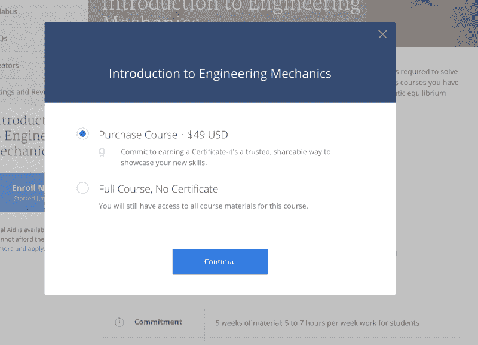
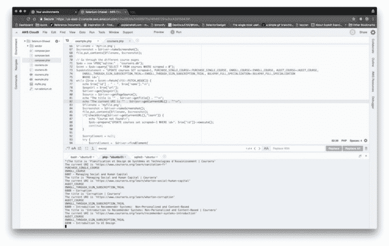

# 我发现了 1600 门仍然完全免费的 Coursera 课程

> 原文：<https://www.freecodecamp.org/news/coursera-free-online-courses-6d84cdb30da/>

Coursera 的课程还是免费的吗？在[中央](https://www.classcentral.com/)班，我经常收到这个问题，所以我写了一个[指南](https://www.classcentral.com/report/coursera-signup-for-free/)来回答这个问题。

一般来说，Coursera 课程是免费审核的，但如果你想获得分级作业或获得课程证书，你需要付费。这个改动最早是 2015 年 10 月[公布](https://blog.coursera.org/an-update-on-assessments-grades-and/)，2016 年 1 月上线。

但我一直知道有几门课仍然是完全免费的。当你注册这些课程时，你会看到一个选项“全部课程，没有证书。”对于新模型中的课程，您需要选择“审计”选项。

很难确定哪些课程有这个选项。这是因为 Coursera 是一个单页面应用程序，只有登录后才能获得信息。

因此，我决定使用 [Selenium](http://www.seleniumhq.org/) 来帮助我解决这个问题，而不是一个一个地浏览每门课程，然后点击注册。[鲍勃](https://www.classcentral.com/@bob)为我设置了一个 AWS 实例和一个 Cloud 9 IDE，我可以在那里实现自动化。下面是设置的截图。(是的，我更喜欢 PHP。)

我期望从 Coursera 的 6000 门课程中找到大约 50 门免费课程。

想象一下，当我发现 1600 多门 Coursera 课程仍然完全免费(包括分级作业，减去证书)时，我有多惊讶。

甚至 Coursera 自己的帮助页面也声称，对于“所有课程”，你只能免费获得未评分的材料和讲座。

(另外，我的研究还发现了几十种完全付费的在线课程)。

A screenshot of Coursera’s explanation of its free courses.

以下列表中的所有课程都是完全免费的。这个列表包含了许多高评分的在线课程，包括一些来自 Class Central 的[有史以来最好的在线课程](https://www.classcentral.com/collection/top-free-online-courses)。

事实上，Coursera 目前最受欢迎的两门课程——芭芭拉·奥克利的*学习如何学习*和 Coursera 联合创始人吴恩达的*机器学习*课程——也在这个列表中。

包括斯坦福大学、佐治亚理工学院、耶鲁大学、杜克大学和密歇根大学在内的 178 所大学的课程都在名单中。大约 37%的课程不是英语授课。

我将课程分为以下几类:

*   计算机科学
*   商业
*   人文学科
*   数据科学
*   人的能力发展
*   艺术与设计
*   编程；编排
*   工程
*   健康和医学
*   数学
*   科学
*   社会科学
*   教育和教学。

以下是我在 Coursera 上找到的 1600 门完全免费的在线课程，以及 Class Central 用户对它们的评级。

### 计算机科学(93)

*   [机器学习](https://www.classcentral.com/course/machine-learning-835)来自*斯坦福大学*★★★★(378)
*   [信息系统审计、控制和保证](https://www.classcentral.com/course/information-systems-audit-17979)来自*香港科技大学*★★★★(270)
*   [算法，第一部分](https://www.classcentral.com/course/algs4partI-339)来自*普林斯顿大学*★★★★(59)
*   [密码学我](https://www.classcentral.com/course/crypto-616)来自*斯坦福大学*★★★★(53)
*   [互联网历史、技术和安全](https://www.classcentral.com/course/insidetheinternet-335)来自*密西根大学*★★★★(41)
*   [比特币和加密货币技术](https://www.classcentral.com/course/bitcointech-3655)来自*普林斯顿大学*★★★☆(27)
*   [算法，第二部分](https://www.classcentral.com/course/algs4partII-340)来自*普林斯顿大学*★★★★(21)
*   [离散优化](https://www.classcentral.com/course/optimization-487)来自*墨尔本大学*★★★☆(12)
*   [图像和视频处理:从火星到好莱坞中途在医院停留](https://www.classcentral.com/course/images-462)来自*杜克大学*★★★☆(7)
*   [计算机架构](https://www.classcentral.com/course/comparch-342)来自*普林斯顿大学*★★★☆(6)
*   [算法分析](https://www.classcentral.com/course/aofa-921)来自*普林斯顿大学*★★★☆(6)
*   [密码学 II](https://www.classcentral.com/course/crypto2-425) 来自*斯坦福大学*★★★☆(4)
*   [物联网:建立您的 DragonBoard 开发平台](https://www.classcentral.com/course/internet-of-things-dragonboard-4260)来自*加州大学圣地亚哥分校* ★★★☆☆(4)
*   [编程语言，B 部分](https://www.classcentral.com/course/programming-languages-part-b-6920)来自华盛顿*大学*★★★☆(4)
*   [巴塞罗那自治大学*的 detec ción de objetos*](https://www.classcentral.com/course/deteccion-objetos-3194)★★★☆(4)
*   [网络:朋友、金钱和字节](https://www.classcentral.com/course/friendsmoneybytes-359)来自*普林斯顿大学*★★★☆(3)
*   [网络画报:没有微积分的原理](https://www.classcentral.com/course/ni-891)来自*普林斯顿大学*★★★☆(3)
*   [定量形式化建模和最坏情况性能分析](https://www.classcentral.com/course/quantitative-formal-modeling-1-4864)来自 *EIT Digital* ★★★☆☆(3)
*   [编程语言，C 部分](https://www.classcentral.com/course/programming-languages-part-c-7187)来自华盛顿*大学*★★★☆(2)
*   [機器學習基石上(机器学习基础)-数学基础](https://www.classcentral.com/course/ntumlone-mathematicalfoundations-1326)来自*台大*★★★★(2)
*   [掌握数字双胞胎](https://www.classcentral.com/course/mastering-digital-twins-13294)来自 *EIT 数字* ★★★☆☆(2)
*   [日常生活中的爱财金融](https://www.classcentral.com/course/finanzen-7794)【来自苏黎世大学】【2】
*   [近似算法第一部分](https://www.classcentral.com/course/approximation-algorithms-part-1-5026)来自*高等师范学校*★★★★(2)
*   [英特尔网络学院-网络转型 101](https://www.classcentral.com/course/network-transformation-101-12216) 来自*英特尔* ★★★☆☆(2)
*   [计算机科学:有目的的编程](https://www.classcentral.com/course/cs-programming-java-13151)来自*普林斯顿大学*★★★★(1)
*   [信息安全:背景与介绍](https://www.classcentral.com/course/information-security-data-8123)来自*伦敦大学国际课程*★★★★(1)
*   [алгоритмизациявычислений(算法计算)](https://www.classcentral.com/course/algoritmizacija-vychislenij-6558)来自*高等经济学院* ★★☆☆☆(1)
*   [機器學習技法(机器学习技术)](https://www.classcentral.com/course/ntumltwo-2847)来自*台大*★★★★(1)
*   [TCP/IP 简介](https://www.classcentral.com/course/tcpip-9143)来自*延世大学*★★★★(1)
*   [物联网软件架构](https://www.classcentral.com/course/iot-software-architecture-6507)来自*EIT Digital*★★★☆(1)
*   [python 计算机科学概论第 1 部分](https://www.classcentral.com/course/ciencia-computacao-python-conceitos-7497)【来自圣保罗大学】【1】
*   [电子在作用:电子和 Arduinos 用于自己的发明](https://www.classcentral.com/course/electrones-en-accion-4726)【来自于智利天主教大学】【1】
*   [数据隐私基础](https://www.classcentral.com/course/northeastern-data-privacy-20025)来自*东北大学*★★★★(1)
*   [物联网顶点:构建移动监控系统](https://www.classcentral.com/course/internet-of-things-capstone-5124)来自*加州大学圣地亚哥分校*
*   [物联网:设备的感应和驱动](https://www.classcentral.com/course/internet-of-things-sensing-actuation-4182)来自*加州大学圣地亚哥分校*
*   [计算机科学:算法、理论和机器](https://www.classcentral.com/course/computerscience2-10671)来自*普林斯顿大学*
*   [离散优化建模基础篇离散优化基础建模](https://www.classcentral.com/course/lisan-youhua-jianmo-jichupian-7772)来自*香港中文大学*
*   [离散优化基础建模](https://www.classcentral.com/course/basic-modeling-7759)来自*墨尔本大学*
*   [离散优化建模高阶篇离散优化高级建模](https://www.classcentral.com/course/lisan-youhua-jianmo-gaojiepian-7775)来自*香港中文大学*
*   [离散优化算法篇离散优化求解算法](https://www.classcentral.com/course/lisan-youhua-suanfapian-11217)来自*香港中文大学*
*   [求解离散优化的算法](https://www.classcentral.com/course/solving-algorithms-discrete-optimization-11219)来自*墨尔本大学*
*   [【新】离散优化的高级建模离散优化建模高阶篇](https://www.classcentral.com/course/advancedmodeling-cn-7758)来自*香港中文大学*
*   [墨尔本*大学*的](https://www.classcentral.com/course/advancedmodeling-7757)离散优化高级建模
*   [【新】离散优化的基础建模离散优化建模基础篇](https://www.classcentral.com/course/basic-modeling-cn-7760)来自*香港中文大学*
*   [操作系统原理(操作系统)](https://www.classcentral.com/course/os-3229)来自*北大*
*   [计算机辅助翻译原理与实践计算机辅助翻译的原理与实践](https://www.classcentral.com/course/catmooc-2354)来自*北京大学*
*   [计算机组成来自*北京大学*的计算机组织](https://www.classcentral.com/course/pkuco-2351)
*   [Operating system and virtualization security](https://www.classcentral.com/course/osvirtsecurity-2348) from *Peking University*
*   [算法设计与分析算法设计与分析](https://www.classcentral.com/course/algorithms-3230)来自*北京大学*
*   [形式概念分析简介](https://www.classcentral.com/course/formal-concept-analysis-7769)来自*高等经济学院*
*   [人工智慧：搜尋方法與邏輯推論(人工智能-搜索&逻辑)](https://www.classcentral.com/course/rengong-zhineng-10375)来自*台大*
*   [人工智慧：機器學習與理論基礎(人工智能-学习&理论)](https://www.classcentral.com/course/ai2-11519)来自*台大*
*   [機器學習基石下(机器学习基础)-算法基础](https://www.classcentral.com/course/ntumlone-algorithmicfoundations-9737)来自*台大*
*   [运筹学(2):优化算法](https://www.classcentral.com/course/operations-research-algorithms-33430)来自*台大*
*   [Arduino 和一些应用](https://www.classcentral.com/course/arduino-aplicaciones-7108)来自*墨西哥国立自治大学*
*   T0T 网络管理:从理论到实践 t1from T2T singhua university T3
*   [人口健康:预测分析](https://www.classcentral.com/course/population-health-predictive-analytics-19151)来自*莱顿大学*
*   [图像分类:识别图像内容？](https://www.classcentral.com/course/clasificacion-imagenes-4609)来自*巴塞罗那自治大学(巴塞罗那自治大学)*
*   [商业深度学习](https://www.classcentral.com/course/deep-learning-business-9431)来自*延世大学*
*   [系统验证(4):建模软件、协议和其他行为](https://www.classcentral.com/course/system-validation-software-protocols-7803)来自 *EIT Digital*
*   [网络安全意识与创新](https://www.classcentral.com/course/cybersecurity-13790)来自 *EIT Digital*
*   [区块链 360:专业人士的艺术状态](https://www.classcentral.com/course/blockchain-professionals-12595)来自 *EIT Digital*
*   [决策者的区块链](https://www.classcentral.com/course/blockchain-decision-maker-13811)来自 *EIT Digital*
*   [智能物联网设备架构简介](https://www.classcentral.com/course/iot-devices-6748)来自 *EIT Digital*
*   [系统验证(2):模型过程行为](https://www.classcentral.com/course/system-validation-behavior-7420)来自 *EIT 数字*
*   [系统验证:来自 *EIT Digital* 的自动机和行为等价物](https://www.classcentral.com/course/automata-system-validation-6825)
*   [I/O 高效算法](https://www.classcentral.com/course/io-efficient-algorithms-16913)来自 *EIT 数字*
*   [系统验证(3):来自 *EIT 数字*的模态公式](https://www.classcentral.com/course/system-validation-modal-formulas-7808)要求
*   [设计智能物联网设备](https://www.classcentral.com/course/iot-architecture-6839)来自 *EIT Digital*
*   T0 人工智能 t1 from T2 froo T3 简介
*   T0 运动程序设计 t1 from T2 终端设备 T3
*   来自托木斯克国立大学的вводная·в·блокчейн
*   t0t 0 采用 OpenMP 和 t1from T2tomsk state university T3 的并行编程介绍
*   [区块链可扩展性及其在分布式系统中的基础](https://www.classcentral.com/course/blockchain-scalability-21843)来自*悉尼大学*
*   [信息物理系统:建模与仿真](https://www.classcentral.com/course/cyber-physical-systems-1-9791)来自*加州大学圣克鲁斯分校*
*   [医疗保健中的网络安全(医院&护理中心)](https://www.classcentral.com/course/cybersecurity-in-healthcare-20908)来自*鹿特丹伊拉斯谟大学*
*   t0±所有人的人工智能±t1±T2±deep learning . ai±T3；
*   [计算机操作系统](https://www.classcentral.com/course/jisuanji-caozuo-xitong-4316)来自*南大*
*   [近似算法第二部分](https://www.classcentral.com/course/approximation-algorithms-part-2-5688)来自*高等师范学校*
*   [介绍 OpenCL on FPGA](https://www.classcentral.com/course/opencl-fpga-introduction-18979)来自*英特尔*
*   [英特尔网络学院-网络转型 102](https://www.classcentral.com/course/network-transformation-102-13264) 来自*英特尔*
*   [敏感复杂性:从*国立钟大学*看电子游戏与艺术的平行](https://www.classcentral.com/course/videogames-5778)
*   国际信息安全:理论与实践(mgimo)
*   [安全意识培训](https://www.classcentral.com/course/security-awareness-training-19052)来自 *(ISC)*
*   [机器翻译](https://www.classcentral.com/course/machinetranslation-21135)来自*卡尔斯鲁厄理工学院*
*   [来自*成均馆大学*的 CNN 和 RNNs](https://www.classcentral.com/course/cnns-and-rnns-32772) 基础知识
*   [物联网板介绍和编程](https://www.classcentral.com/course/introduction-iot-boards-12535)来自*浦项科技大学*
*   [云端物联网平台编程](https://www.classcentral.com/course/cloud-iot-platform-12536)来自*浦项科技大学*
*   [用波浪掌握 web 3](https://www.classcentral.com/course/mastering-web3-waves-20809)来自 *E-Learning 发展基金*
*   [检查点跳转开始:网络安全](https://www.classcentral.com/course/check-point-jump-start-network-security-19646)来自*检查点*
*   [检查点跳转开始:SMB 网络安全](https://www.classcentral.com/course/check-point-jump-start-smb-network-security-21940)来自*检查点*
*   [检查站跳转开始:云安检](https://www.classcentral.com/course/check-point-jump-start-cloud-security-32217)从*检查站*
*   [检查点跳转开始:Maestro 超大规模网络安全](https://www.classcentral.com/course/check-point-jump-start-maestro-19647)来自*检查点*

### 编程(46)

*   [Python 与统计财务分析](https://www.classcentral.com/course/python-statistics-financial-analysis-12648)来自*香港科技大学*★★★☆(314)
*   [学会编程:多伦多*大学的基础*](https://www.classcentral.com/course/programming1-385)★★★★(109)
*   为 Android 手持系统编写移动应用程序:第一部分来自*马里兰大学，学院公园*★★★☆(39)
*   [编程语言，A 部分](https://www.classcentral.com/course/programming-languages-452)来自华盛顿*大学*★★★★(27)
*   为 Android 手持系统编写移动应用程序:第二部分来自*马里兰大学，学院公园*★★★☆(15)
*   [自己编码！爱丁堡*大学*★★★☆(12)编程入门](https://www.classcentral.com/course/codeyourself-2938)
*   [数字媒体创意编程&移动应用](https://www.classcentral.com/course/digitalmedia-529)来自*伦敦大学国际课程*★★★☆(11)
*   [现代控制概论](https://www.classcentral.com/course/controle-moderno-8482)来自*航空技术研究所*【11)
*   [学习编程:来自多伦多*大学的*](https://www.classcentral.com/course/programming2-390)★★★☆(9)
*   [网游:文学、新媒体、叙事](https://www.classcentral.com/course/onlinegames-544)来自*范德比尔特大学*★★★★(7)
*   [Python 编程:简明介绍](https://www.classcentral.com/course/python-programming-introduction-7087)来自*卫斯理大学*★★★☆(6)
*   [交互式计算机图形学](https://www.classcentral.com/course/interactivegraphics-2067)来自*东京大学* ★★★☆☆(6)
*   *洛桑联邦理工学院*【4】面向对象编程简介(c++】
*   [问题解决、Python 编程、视频游戏](https://www.classcentral.com/course/problem-solving-programming-video-games-11500)来自*阿尔伯塔大学*★★★★(4)
*   [编程入门(c++】](https://www.classcentral.com/course/initprogcpp-644)来自*【洛桑联邦理工学院】*【3】
*   [Python I 编程简介:学习 python 编程](https://www.classcentral.com/course/aprendiendo-programar-python-8900)【来自于智利天主教大学】【2】
*   [编程！来自爱丁堡大学*的*](https://www.classcentral.com/course/aprogramar-2939)编程简介⑴
*   [编程入门(Java)](https://www.classcentral.com/course/initprogjava-643) 来自*洛桑联邦理工学院*【1)
*   [面向对象编程简介(Java)](https://www.classcentral.com/course/intropoojava-441) 来自*洛桑联邦理工学院*【1)
*   [构建云原生和多云](https://www.classcentral.com/course/ibm-building-cloud-native-and-multicloud-32718)来自*IBM*★☆☆☆(1)
*   [用计算机编程语言玩转数据数据处理使用 Python](https://www.classcentral.com/course/hipython-4286) 来自*南大*★★★★(1)
*   [实用 SAS 编程及认证回顾](https://www.classcentral.com/course/sas-programming-certification-review-12859)来自 *SAS* ★★★☆☆(1)
*   [C#程序设计](https://www.classcentral.com/course/sheng-c-biancheng-6294)来自*北京大学*
*   [Java 程序设计](https://www.classcentral.com/course/pkujava-3227)来自*北京大学*
*   [软件工程](https://www.classcentral.com/course/se-6082)来自*北京大学*
*   [面向对象技术高级课程(先进的面向对象技术)](https://www.classcentral.com/course/aoo-1737)来自*北京大学*
*   [документыипрезентациив乳胶(乳胶入门)](https://www.classcentral.com/course/latex-1377)来自*高等经济学院*
*   [основыпрограммированиянаpython](https://www.classcentral.com/course/python-osnovy-programmirovaniya-8477)来自*高等经济学院*
*   [用来自*的应用发明者*](https://www.classcentral.com/course/app-inventor-android-8687)开发安卓应用
*   [日内瓦*大学*的程序介绍](https://www.classcentral.com/course/programmation-56642)
*   [编程项目(Java)](https://www.classcentral.com/course/projet-programmation-java-12186) 来自*洛桑联邦理工学院*
*   [1C:*莫斯科物理技术学院*的企业初级开发人员课程](https://www.classcentral.com/course/1c-enterprise-junior-developer-course-32613)
*   [用计算机编程语言做商管程式設計（三)(Python 商业计算编程(3))](https://www.classcentral.com/course/pbc3-11205) 来自*台大*
*   [計算機程式設計](https://www.classcentral.com/course/c-bian-cheng-2337)来自*台大*
*   [用计算机编程语言做商管程式設計（一)(Python 商业计算编程(1))](https://www.classcentral.com/course/pbc1-10425) 来自*台大*
*   [Java 介绍](https://www.classcentral.com/course/introjava-4621)来自*墨西哥国立自治大学*
*   T0 在 t1 from T2 国家研究中心 T3 软件开发中使用操作系统机制
*   [软件测试简介](https://www.classcentral.com/course/intro-teste-de-software-10389)来自*圣保罗大学*
*   [python 计算机科学概论第 2 部分](https://www.classcentral.com/course/ciencia-computacao-python-conceitos-2-8600)【来自圣保罗大学】
*   [准备谷歌云专业云架构师考试 em Português Brasileiro](https://www.classcentral.com/course/preparing-cloud-professional-cloud-architect-exam-17890) 来自*谷歌云*
*   [增强现实和 ARCore 简介](https://www.classcentral.com/course/ar-11596)来自*谷歌 Daydream Impact*
*   [VR 和 360°视频制作](https://www.classcentral.com/course/360-vr-video-production-9814)来自 *Google Daydream Impact*
*   [软件测试(软件测试)](https://www.classcentral.com/course/softwaretesting-3357)来自*南大*
*   【android 应用程序开发简介来自*国立钟大学*
*   [用 Java Spring 框架进行 Web 开发](https://www.classcentral.com/course/web-development-with-java-spring-framework-22866)来自*圣彼得堡国立理工大学*
*   [系统平台与计算环境](https://www.classcentral.com/course/jisuanji-wangluo-4198)来自*西安交通大学*

### 商务(218)

*   [会计、商业和社会:会计的多面角色](https://www.classcentral.com/course/accounting-business-society-12434)来自*香港科技大学*★★★★(75)
*   [金融市场](https://www.classcentral.com/course/financialmarkets-912)来自*耶鲁大学*★★★☆(36)
*   [成为变革者:社会创新入门](https://www.classcentral.com/course/social-innovation-6655)来自*开普顿大学*★★★★(36)
*   [成功的科学:研究者知道什么你应该知道](https://www.classcentral.com/course/success-8087)来自*密西根大学*★★★★(21)
*   [个人品牌介绍](https://www.classcentral.com/course/personal-branding-4865)来自*弗吉尼亚大学*★★★☆(15)
*   [国际领导力与组织行为](https://www.classcentral.com/course/intorb-1371)来自*博科尼大学*★★★☆(13)
*   [全球金融危机](https://www.classcentral.com/course/global-financial-crisis-4893)来自*耶鲁大学*★★★☆(11)
*   [法务会计和欺诈考试](https://www.classcentral.com/course/forensicaccounting-2465)来自*西弗吉尼亚大学*★★★☆(11)
*   [组织分析](https://www.classcentral.com/course/organizational-analysis-459)来自*斯坦福大学*★★★☆(10)
*   [石油&天然气行业运营与市场](https://www.classcentral.com/course/oilandgas-5356)来自*杜克大学*★★★★(8)
*   [内容营销的策略](https://www.classcentral.com/course/content-marketing-7799)来自*加州大学戴维斯分校*★★★☆(8)
*   [供应链管理:一个学习的视角](https://www.classcentral.com/course/supplychain-2065)来自*韩国高等科技学院*★★★☆(7)
*   [美食&饮料管理](https://www.classcentral.com/course/food-beverage-management-3498)来自*博科尼大学*★★★☆(7)
*   [社会影响战略:企业家和创新者的工具](https://www.classcentral.com/course/social-impact-2136)来自*宾夕法尼亚大学*★★★☆(6)
*   [广告与社会](https://www.classcentral.com/course/adsoc-2487)来自*杜克大学*★★★☆(6)
*   [全球能源业务基础](https://www.classcentral.com/course/globalenergybusiness-1307)来自*科罗拉多大学系统*★★★☆(6)
*   利率模型来自*洛桑联邦理工学院*【6】
*   [如何改变世界](https://www.classcentral.com/course/changetheworld-1269)来自*卫斯理大学*★★★☆(6)
*   [创造力、创新和变革](https://www.classcentral.com/course/creativity-innovation-677)来自*宾夕法尼亚州立大学*★★★☆(6)
*   [超越硅谷:转型经济体中不断增长的企业家精神](https://www.classcentral.com/course/entpecon-1603)来自*凯斯西储大学*★★★☆(6)
*   [艺术文化战略](https://www.classcentral.com/course/artsculturestrategy-2678)来自*宾夕法尼亚大学*★★★★(5)
*   [管理未来的公司](https://www.classcentral.com/course/futuremanagement-2920)来自*伦敦大学国际课程*★★★☆(5)
*   [乳品生产与管理](https://www.classcentral.com/course/dairy-4055)来自*宾夕法尼亚州立大学*★★★★(5)
*   [私募股权和风险投资](https://www.classcentral.com/course/private-equity-4408)来自*博科尼大学*★★★☆(5)
*   [弥合战略设计与交付之间的差距](https://www.classcentral.com/course/bridging-strategy-design-delivery-gap-12170)来自*光明计划*★★★★(5)
*   [行为金融学](https://www.classcentral.com/course/duke-behavioral-finance-6635)来自*杜克大学*★★★☆(4)
*   [规模化运营:链接战略与执行](https://www.classcentral.com/course/scalingoperations-2707)来自*西北大学*★★★☆(4)
*   [如何在没有风险投资的情况下为你的初创公司融资并使其成长](https://www.classcentral.com/course/startupfinancewithoutvc-5831)来自*伦敦大学国际课程* ★★★☆☆(3)
*   [基础设施融资与投资](https://www.classcentral.com/course/infrafinance-1380)来自*博科尼大学*★★★☆(3)
*   [众筹](https://www.classcentral.com/course/wharton-crowdfunding-9664)来自*宾夕法尼亚大学* ★★★☆☆(2)
*   [品牌管理:协调业务、品牌和行为](https://www.classcentral.com/course/brand-3929)来自*伦敦大学国际课程*★★★★(2)
*   [新兴市场创新产品的快速开发](https://www.classcentral.com/course/innovacion-734)【来自蒙特雷技术】【2】
*   [初学者创业者指南](https://www.classcentral.com/course/entrepreneur-guide-beginners-19704)来自*巴塞罗纳大学*★★★★(2)
*   [性别和性:工作场所的多样性和包容性](https://www.classcentral.com/course/gender-sexuality-8384)来自*匹兹堡大学*★★★☆(2)
*   [创新管理](https://www.classcentral.com/course/erasmus-innovationmanagement-5943)来自*鹿特丹伊拉斯谟大学*★★★★(2)
*   [企业家的创业精神和能力](https://www.classcentral.com/course/empreendedorismo-2577)来自*国立坎皮纳斯大学*【2)
*   [给 2.0:来自*斯坦福大学的 MOOC*](https://www.classcentral.com/course/giving2-2481)★★☆☆☆(1)
*   [金融市场](https://www.classcentral.com/course/financial-markets-global-pt-32714)来自*耶鲁大学*【1)
*   [客户洞察:量化技术](https://www.classcentral.com/course/quantitative-customer-insights-10428)来自*伊利诺伊大学香槟分校*★★★★(1)
*   t0±未来公司的管理{ > t1 { >来自{ > T2 { >伦敦国际大学方案{ > T3 } } } } } } } } } } } } < } 73 { > 1
*   [финансовыерынкииинституты(金融市场和机构)](https://www.classcentral.com/course/finmarkets-1375)来自*高等经济学院*★★★★(1)
*   [国际组织管理](https://www.classcentral.com/course/international-organizations-management-11072)来自*日内瓦大学*★★★★(1)
*   [如何验证你的创业想法](https://www.classcentral.com/course/startup-idea-6449)来自*新南威尔士大学*★★★★(1)
*   [可持续发展综合协议](https://www.classcentral.com/course/acuerdos-globales-9631)来自*墨西哥国立自治大学*【1)
*   [创业战略管理](https://www.classcentral.com/course/entstrategicmgmt-3596)来自*新墨西哥大学*★★★★(1)
*   [战略和创业管理](https://www.classcentral.com/course/adminestremp-5071)来自新墨西哥大学【1)
*   [新墨西哥*大学国际商务 II*](https://www.classcentral.com/course/globalbusiness2-2699)★★☆☆(1)
*   [企业财务基础](https://www.classcentral.com/course/finanzas-empresariales-4633)来自*安第斯大学*【1)
*   [excel 商业基础](https://www.classcentral.com/course/excel-para-negocios-7081)来自*南部大学*⑴
*   t0±领导能力和情感智慧±t1±t1±T2±印度商学院±T3±73±1)
*   [技术商业化，第一部分:建立你的想法过滤系统](https://www.classcentral.com/course/techcommercialpart1-2567)来自*罗彻斯特大学*★★★★(1)
*   [创业](https://www.classcentral.com/course/emprender-6034)来自*巴塞罗那大学*【1)
*   [商业领袖的新技术](https://www.classcentral.com/course/new-technologies-business-leaders-10365)来自*罗格斯大学* ★★★☆☆(1)
*   [公私伙伴关系(PPP):如何从*网上学习校园-世界银行集团*【1)为公共服务提供更好的基础设施](https://www.classcentral.com/course/pppefficace-6008)
*   [创新金融:黑客金融改变世界](https://www.classcentral.com/course/innovative-finance-9707)来自*开普顿大学*★★★★(1)
*   [餐饮企业管理](https://www.classcentral.com/course/empresas-alimentos-bebidas-4729)来自*博科尼大学*【1)
*   [高级估值和战略——M&A、私募股权和风险投资](https://www.classcentral.com/course/advanced-valuation-and-strategy-12104)来自*鹿特丹伊拉兹马斯大学*★☆☆☆(1)
*   [与高盛 10，000 名女性一起发展你的事业](https://www.classcentral.com/course/gs10kw-11222)来自*高盛*★★★★(1)
*   [与高盛的行政基础 1 万名女性](https://www.classcentral.com/course/10k-women-esp-8-19446)来自*高盛*【1)
*   [预算要点和发展](https://www.classcentral.com/course/budgeting-essentials-development-9350)来自*行政学院基金会*★★★★(1)
*   [成就:人人创业](https://www.classcentral.com/course/effectuation-1331)【来自里昂商学院】【1】
*   [软件如何吃掉金融](https://www.classcentral.com/course/how-software-ate-finance-27230)来自*斯坦福大学*
*   [成为社会企业家:入门](https://www.classcentral.com/course/social-entrepreneurship-getting-started-21747)来自*密西根大学*
*   [领导不同的团队&组织](https://www.classcentral.com/course/leading-diverse-teams-and-organizations-22539)来自*密执安大学*
*   T0“激励和激励个人”Michigan 大学“T3”的“T1”、“t1”和“T2”
*   [通过战略、法律做出成功的决策&伦理模型](https://www.classcentral.com/course/strategy-law-ethics-6195)来自*密执安大学*
*   [Фінанси для нефінансових спеціалістів](https://www.classcentral.com/course/finansy-5689) from *University of California, Irvine*
*   [管理项目](https://www.classcentral.com/course/project-risk-management-fr-33461)的风险和变更*来自加州大学欧文*
*   [项目启动和规划](https://www.classcentral.com/course/project-planning-es-37084)来自*加利福尼亚大学，欧文*
*   [来自*耶鲁大学*的金融家们](https://www.classcentral.com/course/financial-markets-global-fr-32716)
*   [客户洞察:新产品开发导向](https://www.classcentral.com/course/customer-insights-orientation-10374)来自*伊利诺伊大学香槟分校*
*   来自伊利诺伊大学厄巴纳-香槟分校*的*
*   [公司战略](https://www.classcentral.com/course/corporatestrategy-9859)来自*伦敦大学国际课程*
*   [经理的工具包:管理工作人员的实用指南](https://www.classcentral.com/course/people-management-6317)来自*伦敦大学国际课程*
*   [跟上变化:金融专业人士的问题](https://www.classcentral.com/course/change-for-the-finance-professional-5877)来自*伦敦大学国际课程*
*   [通过隐喻和音乐探索管理理念](https://www.classcentral.com/course/explore-management-concepts-through-metaphor-and--45954)来自*伦敦大学国际课程*
*   [设计和实施你的教练策略](https://www.classcentral.com/course/design-coaching-strategy-5583)来自*加州大学戴维斯分校*
*   [高级搜索引擎优化策略](https://www.classcentral.com/course/advanced-seo-strategies-5608)来自*加州大学戴维斯分校*
*   [True-Peking University Online Entrepreneurship Classroom](https://www.classcentral.com/course/zhenge-beida-zaixian-chuangye-5916) From *Peking University*
*   [основыкорпоративныхуинансов(公司财务基础)](https://www.classcentral.com/course/corpfin-1385)来自*高等经济学院*
*   [управлениеличнымиуинансами](https://www.classcentral.com/course/personal-financial-management-5400)来自*高等经济学院*
*   [新兴市场的商业策略](https://www.classcentral.com/course/business-strategies-7771)来自*高等经济学院*
*   [全球统计-国际比较综合指数](https://www.classcentral.com/course/global-statistics-11053)来自*日内瓦大学*
*   [引领艺术和文化创新](https://www.classcentral.com/course/innovationarts-2390)来自*范德比尔特大学*
*   [研究员管理和领导力培训](https://www.classcentral.com/course/researcher-management-leadership-training-19465)来自*科罗拉多大学系统*
*   来自*莫斯科物理技术学院的*
*   [改变世界的伙伴关系:企业与协会之间的创新联盟](https://www.classcentral.com/course/partenariats-qui-changent-le-monde-5227)来自 *ESSEC 商学院*
*   [社会创业:从 *ESSEC 商学院*调幅](https://www.classcentral.com/course/entrepreneuriat-social-changer-d-echelle-22032)
*   [实践中的管理创新](https://www.classcentral.com/course/innovation-manageriale-12095)来自 *ESSEC 商学院*
*   [社会创业:从*埃塞商业学校*发送到](https://www.classcentral.com/course/entrepreneuriatquichangelemonde-6202)项目
*   [使命的存在理由和事业](https://www.classcentral.com/course/raison-etre-et-entreprise-a-mission-19244)来自 *ESSEC 商学院*
*   [来自 *ESSEC 商学院*的 Animer une se ance collaborative](https://www.classcentral.com/course/animer-seance-collaborative-10763)
*   [实践中的卓越运行](https://www.classcentral.com/course/excellence-operationnelle-11459)来自 *ESSEC 商学院*
*   [从 *ESSEC 商学院*成功转型](https://www.classcentral.com/course/reussir-le-changement-5871)
*   [服務模式的體驗、設計與創新：從痛點到賣點(服务模式的体验、设计、创新:从痛点到卖点)](https://www.classcentral.com/course/service-models-11712)来自*台大*
*   [用计算机编程语言做商管程式設計（二)(Python 商业计算编程(2))](https://www.classcentral.com/course/pbc2-10786) 来自*台大*
*   [Game Analysis in Business Management Research (II): Information Economics](https://www.classcentral.com/course/shang-guan-zixun-jingji-xue-12338) from *National Taiwan University*
*   [商管研究中的賽局分析（一):通路選擇、合約制定與共享經濟(商业研究的博弈论分析(1))](https://www.classcentral.com/course/gabr-9300) 来自*台大*
*   [行銷典範轉移：變動中的消費世界](https://www.classcentral.com/course/marketing-stp-crm-7804)来自*台大*
*   [个人理财](https://www.classcentral.com/course/finanzaspersonales-2565)来自*墨西哥国立自治大学*
*   [21 世纪新商业模式](https://www.classcentral.com/course/modelos-negocios-16959)来自*墨西哥国立自治大学*
*   [非会计师核算](https://www.classcentral.com/course/contabilidad-7412)来自*墨西哥国立自治大学*
*   [从*理工学院*创建和发展技术创业](https://www.classcentral.com/course/techstartup-2995)
*   [分析和营销指标](https://www.classcentral.com/course/analticas-y-mtricas-de-marketing-22659)来自*蒙特雷技术*
*   [引进来自*蒙特里技术*的精益六适马](https://www.classcentral.com/course/introduccin-a-lean-six-sigma-22669)
*   [采购和数字市场。法律问题及其他有关事项](https://www.classcentral.com/course/mercado-digital-16881)来自*巴塞罗那自治大学*
*   [【新】体育赞助。让他们扮演来自*巴塞罗那自治大学*的](https://www.classcentral.com/course/sports-sponsorship-6572)
*   [Tu consultorio de Coaching en las ondas](https://www.classcentral.com/course/coaching-en-las-ondas-13257)来自*巴塞罗那自治大学*
*   [基本财务工具包(避免最常见的错误)](https://www.classcentral.com/course/finanzas-basicas-8347)来自*巴塞罗那自治大学*
*   [Patrocinio Deportivo](https://www.classcentral.com/course/patrocinio-deportivo-5814) 来自*巴塞罗那自治大学*
*   体育赞助。让他们扮演来自*巴塞罗那自治大学*的
*   新墨西哥大学*的*
*   新墨西哥*大学*国际商务 I
*   [新墨西哥*大学*的国际商业 II](https://www.classcentral.com/course/negocios-internacionales2-4941)
*   [延世大学*的*](https://www.classcentral.com/course/marketing-internacional-asia-9770)亚洲国际营销
*   [灾害风险管理和韩国政策](https://www.classcentral.com/course/disaster-risk-management-korean-policies-13259)来自*延世大学*
*   [作出增加价值的财务决定？](https://www.classcentral.com/course/tomar-decisiones-financieras-que-agregan-valor-22786)来自*安第斯大学*
*   [营销佛得角](https://www.classcentral.com/course/marketingverde-4651)来自*安第斯大学*
*   [人工智能的商业含义:来自 *EIT Digital* 的纳米课程](https://www.classcentral.com/course/business-implications-ai-nano-course-17046)
*   [可持续数字创新](https://www.classcentral.com/course/sustainable-digital-innovation-32151)来自 *EIT Digital*
*   t 0 企业到其 t1f rom t2f roo t3f roo { 1 }。{ 2 }
*   T0 应用风险管理 t1 from T2 终端设备 T3
*   t 0t 1 商业机构 t 2tomsk state university T3
*   t0t 1 战略管理 t2tomsk state university T3
*   目标资本——非盈利部门的金融稳定区域 t1from T2tomsk state university T3 _ _ _ _ _ _ _ _ _ _ _ _ _ _ _ _ _ _ _ _ _ _ _ _ _ _ _ _)
*   [国际投资组合管理](https://www.classcentral.com/course/international-portfolio-managment-31696)来自*托木斯克国立大学*
*   T0，媒体、商业、招聘和教育中的人类钓鱼者或社交网络 T1，from T2，tomsk state university T3
*   [精益六适马的数据分析](https://www.classcentral.com/course/data-analytics-for-lean-six-sigma-8092)来自*阿姆斯特丹大学*
*   [Excel 应用于商务(高级)](https://www.classcentral.com/course/excel-aplicado-negocios-avanzado-9571)来自*南部大学*
*   [企业财务](https://www.classcentral.com/course/finanzas-corporativas-17318)来自*南方大学*
*   [服务经验设计](https://www.classcentral.com/course/diseno-experiencia-servicios-17383)来自*南方大学*
*   [农业企业期货和期权的风险对冲](https://www.classcentral.com/course/coberturas-de-riesgo-7082)来自*南方大学*
*   [从*南部大学*介绍企业管理费用分析](https://www.classcentral.com/course/analisis-costos-direccion-empresas-17384)
*   T0 领导力和情绪智力 t1 from T2 商务智能
*   [可持续旅游——促进环境公共健康](https://www.classcentral.com/course/sustainable-tourism-10334)来自*哥本哈根大学*
*   [成为变革的企业家](https://www.classcentral.com/course/entrepchangement-2903)来自 *HEC Paris*
*   [合并企业:法律和财务结构](https://www.classcentral.com/course/consolidando-empresas-10710)来源于*圣保罗大学*
*   [创业:如何发展创新业务](https://www.classcentral.com/course/criacao-startups-8546)【来自圣保罗大学】
*   来自 *IESE 商学院*的
*   [在数字时代从事文化产业](https://www.classcentral.com/course/entreprendre-culture-12081)来自*巴黎政治研究所*
*   [在数字时代的文化产业中创业](https://www.classcentral.com/course/entrepreneurial-culture-digital-age-12080)来自*巴黎政治学院*
*   [设计主导战略:商业战略和企业家精神的设计思维](https://www.classcentral.com/course/design-strategy-11229)来自*悉尼大学*
*   [非洲城市基础设施融资](https://www.classcentral.com/course/financing-infrastructure-in-african-citi-10225)来自*非洲城市和地方政府联合会*
*   [21 世纪组织中的领导力](https://www.classcentral.com/course/leadership21st-1411)来自*哥本哈根商学院*
*   [自由竞争的良好做法](https://www.classcentral.com/course/libre-competencia-10216)来自*智利天主教大学*
*   [中小企业的成功经营](https://www.classcentral.com/course/gestionempresarialpyme-4342)来自*智利天主教大学*
*   [教育领导:全球视角与地方实践](https://www.classcentral.com/course/liderazgo-educativo-4349)来自*智利天主教大学*
*   [优秀项目管理之路](https://www.classcentral.com/course/camino-excelencia-gestion-proyectos-7109)来自*智利天主教大学*
*   [社会创业的设计与创建](https://www.classcentral.com/course/emprendimiento-social-negocios-sustentab-11302)来自*智利天主教大学*
*   [中小企业战略规划和管理](https://www.classcentral.com/course/planificacion-gestion-pymes-21108)来自*智利天主教大学*
*   *智利天主教大学*的成功升级与业务创新
*   [技术转让:从研究到市场。](https://www.classcentral.com/course/transferencia-tecnologica-investigacion-9889)来自*智利天主教大学*
*   [有效组织的管理](https://www.classcentral.com/course/gestion-organizaciones-efectivas-4721)来自*智利天主教大学*
*   [博科尼*大学*艺术与遗产管理](https://www.classcentral.com/course/arts-heritage-7466)
*   [国际发展管理:迈向 2030 年议程](https://www.classcentral.com/course/towards-agenda-2030-21937)来自*博科尼大学*
*   [【新】私募股权和投资基金](https://www.classcentral.com/course/private-equity-investment-funds-4390)来自*博科尼大学*
*   [可持续金融原则](https://www.classcentral.com/course/sustainable-finance-19711)来自*鹿特丹伊拉斯谟大学*
*   [研究厨房](https://www.classcentral.com/course/research-kitchen-8055)来自*路德维希-马克西米利安大学*
*   来自*路德维希-马克西米利安大学*
*   来自*路德维希-马克西米利安大学*
*   [来自*智利大学*的营销总监](https://www.classcentral.com/course/marketing-gerencial-7104)
*   业务费用来自*智利大学*
*   [当今音乐产业](https://www.classcentral.com/course/music-industry-6342)来自*西弗吉尼亚大学*
*   [物流与供应链基础知识](https://www.classcentral.com/course/conceitos-basicos-logistica-10702)来源于*国立乡村大学*
*   圣彼得堡国立理工大学
*   [金融投资&风险管理](https://www.classcentral.com/course/financial-investment--risk-management-22705)来自*圣彼得堡国立理工大学*
*   [俄罗斯公司法。公司管理层](https://www.classcentral.com/course/company-management-19666)来自*莫斯科国立国际关系学院*
*   来自莫斯科国立国际关系学院的фондовыйрынокдлячастных
*   来自莫斯科国立国际关系学院的правовыеформыведения
*   [俄罗斯公司法。法律实体的形成。](https://www.classcentral.com/course/formation-of-legal-entities-19664)来自*莫斯科国立国际关系学院*
*   T0 国际金融中的数字技术 t1 from T2 移动存储国际(MGIMO)。
*   现阶段政府对金融市场的监管 t1 from T2 移动终端国际(MGIMO)公司(mgimo)公司(Moscow state of institute of international relations，mgimo)。
*   来自*莫斯科国立国际关系学院*
*   [莫斯科国立国际关系研究所(MGIMO)](https://www.classcentral.com/course/vyhoda-na-fondovyj-rynok-mass-retail-15151)
*   [俄罗斯公司法。资本&法律实体融资](https://www.classcentral.com/course/capital-financing-of-legal-entities-19665)来自*莫斯科国立国际关系学院*
*   [международныефинансы](https://www.classcentral.com/course/mezhdunarodnyye-finansy-14414)来自*莫斯科国立国际关系学院*
*   来自莫斯科国立国际关系学院的экологическаяответственностьбизнеса
*   [谈判的基本原则，与高盛 10，000 名女性](https://www.classcentral.com/course/10k-women-10-19371)来自*高盛*
*   [商业金融基础，高盛万名女性](https://www.classcentral.com/course/10k-women-2-19373)来自*高盛*
*   [领导力基础，高盛万名女性](https://www.classcentral.com/course/10k-women-3-19369)来自*高盛*
*   [运营基础，高盛万名女性](https://www.classcentral.com/course/10k-women-7-19375)来自*高盛*
*   [来自*高盛*的 10，000 名高盛妇女基金会](https://www.classcentral.com/course/10k-women-brpt-7-19429)
*   [与 1 万名高盛女性的财务规划基础](https://www.classcentral.com/course/10k-women-brpt-5-19433)来自*高盛*
*   来自*高盛*的一万名女性
*   [与高盛进行财务规划的基础 10，000 名女性](https://www.classcentral.com/course/10k-women-esp-5-19437)来自*高盛*
*   [来自*高盛*的 10，000 名女性来自高盛](https://www.classcentral.com/course/10k-women-brpt-1-19439)
*   [来自*高盛*的一万名女性](https://www.classcentral.com/course/10k-women-esp-1-19441)
*   [与高盛的业务财务方面的基础 1 万名女性](https://www.classcentral.com/course/10k-women-esp-2-19443)来自*高盛*
*   [来自*高盛*的 10，000 名高盛妇女基金会](https://www.classcentral.com/course/10k-women-brpt-10-19445)
*   [来自*高盛*的高盛 10，000 名妇女商业基金会](https://www.classcentral.com/course/10k-women-esp-10-19447)
*   [高盛运营基金会来自*高盛*的 10，000 名妇女](https://www.classcentral.com/course/10k-women-esp-7-19431)
*   [与 10，000 名高盛女性的客户基础和竞争](https://www.classcentral.com/course/10k-women-brpt-4-19434)来自*高盛*
*   来自*高盛*的
*   [来自*高盛*的 10，000 名女性高盛](https://www.classcentral.com/course/10k-women-brpt-9-19428)
*   [来自*高盛*的万名高盛女性基金会](https://www.classcentral.com/course/10k-women-brpt-8-19430)
*   [高盛金融基金会](https://www.classcentral.com/course/10k-women-esp-9-19444)来自*高盛*
*   [来自*高盛*的 10，000 名女性达高盛](https://www.classcentral.com/course/10k-women-brpt-3-19436)
*   [销售和市场营销基础，高盛 10，000 名女性](https://www.classcentral.com/course/10k-women-6-19367)来自*高盛*
*   [金融规划基础，高盛万名女性](https://www.classcentral.com/course/10k-women-5-19368)来自*高盛*
*   [顾客基础及与高盛的竞争 1 万名女性](https://www.classcentral.com/course/10k-women-esp-4-19440)来自*高盛*
*   [管理基础，高盛万名女性](https://www.classcentral.com/course/10k-women-8-19374)来自*高盛*
*   [资金基础，高盛 10，000 名女性](https://www.classcentral.com/course/10k-women-9-19372)来自*高盛*
*   [来自*高盛*的 10，000 名女性高盛](https://www.classcentral.com/course/10k-women-brpt-6-19432)
*   [公司财务基础与 1 万名高盛女性](https://www.classcentral.com/course/10k-women-brpt-2-19438)来自*高盛*
*   [客户和竞争的基本面，高盛 10，000 名女性](https://www.classcentral.com/course/10k-women-4-19370)来自*高盛*
*   [体育俱乐部和联合会管理的实践](https://www.classcentral.com/course/fia-gestao-clubes-federacoes-esportivas-8146)来自*基金会*
*   [一般管理理论](https://www.classcentral.com/course/tga-executivos-8232)来自*基金会*
*   [领导和破坏](https://www.classcentral.com/course/leadership-and-disruption-40314)来自*行政学院基金会*
*   [财务管理](https://www.classcentral.com/course/administracao-financeira-10713)来自*督察*
*   [分析营销简介](https://www.classcentral.com/course/marketing-analitico-5085)来自*督察*
*   [经营管理](https://www.classcentral.com/course/gestao-de-operacoes-10707)从*视察*
*   [学习管理:战略管理模块](https://www.classcentral.com/course/gap-2575)来自*莱曼基金会*
*   [在欧洲做生意](https://www.classcentral.com/course/doing-business-in-europe-9712)来自 *ESCP 欧洲*
*   [影响创新(i4i)来自*东北大学*的 Carlson-Polizzotto 价值创造方法](https://www.classcentral.com/course/valuecreation-19335)
*   [敏捷与大西洋吉拉](https://www.classcentral.com/course/agile-atlassian-jira-11877)来自*大西洋*
*   [如何管理来自 *GitLab* 的远程团队](https://www.classcentral.com/course/remote-team-management-21633)
*   来自*电子学习发展基金的*
*   [数字化管理基础](https://www.classcentral.com/course/fundamentals-of-digital-management-27962)来自 *E-Learning 发展基金*

### 个人发展(72)

*   [学会如何学习:强大的智力工具帮助你掌握棘手的课题](https://www.classcentral.com/course/learning-how-to-learn-2161)来自*加州大学圣地亚哥分校*★★★★(20240)
*   [思维转变:突破学习障碍，发现自己隐藏的潜力](https://www.classcentral.com/course/mindshift-8289)来自*麦克马斯特大学*★★★★(6741)
*   [学习如何为青年学习](https://www.classcentral.com/course/learning-how-to-learn-youth-12569)来自*亚利桑那州立大学*★★★★(791)
*   [学习怎样学习(ACA):从*麦克马斯特大学*【253】获得有助于你掌握困难科目的强大脑力工具](https://www.classcentral.com/course/apprendre-comment-apprendre-18067)
*   [从*墨西哥国立自治大学*学习](https://www.classcentral.com/course/aprendo-4631)(106)
*   [认识你自己——自我认识的价值和限度:被审视的人生](https://www.classcentral.com/course/know-thyself-the-examined-life-432)来自*爱丁堡大学*★★★★(30)
*   [成功谈判:必备策略和技巧](https://www.classcentral.com/course/successfulnegotiation-2460)来自*密西根大学*★★★★(15)
*   [创造性思维:成功的技巧和工具](https://www.classcentral.com/course/creative-thinking-techniques-and-tools-for-succes-17292)来自*伦敦帝国理工学院*★★★★(14)
*   [谈判入门:成为有原则、有说服力的谈判者的战略手册](https://www.classcentral.com/course/negotiation-4336)来自*耶鲁大学*★★★★(13)
*   [学习:能够掌握困难课题(学习方法)的强大精神工具](https://www.classcentral.com/course/aprendiendo-a-aprender-5700)【来自加利福尼亚大学，圣地亚哥】【8】
*   [如何熟练:个人技能管理入门(以项目为中心的课程)](https://www.classcentral.com/course/skills-management-11218)来自*纽约州立大学*★★★☆(7)
*   来自密西根大学*的*★★★★(6)
*   [学习:强大的精神工具帮助你掌握困难的科目(用葡萄牙语)[学习方法]](https://www.classcentral.com/course/aprender-4227) 来自加利福尼亚大学，圣地亚哥【5)
*   [关系的艺术与科学:理解人类需求](https://www.classcentral.com/course/human-needs-8253)来自*多伦多大学*★★★☆(5)
*   [数字能力。办公工具(微软 Word、Excel、Power Point)](https://www.classcentral.com/course/competencias-digitales-ofimatica-13590) 来自*【巴塞罗那自治大学】*【3】
*   学习如何学习:强有力的智力工具，帮助你掌握困难的课题±t1±T2±mcmasteruniversity±T3±73(2)
*   [Learn how to learn: a powerful intellectual tool to help you master complex subjects](https://www.classcentral.com/course/ruhe-xuexi-5699) from *University of California, San Diego* ★★★★★★ (2)
*   [探索终身学习和成功的新兴技术](https://www.classcentral.com/course/emerging-technologies-lifelong-learning-10396)来自布法罗*大学*★★★☆(2)
*   [数字足迹](https://www.classcentral.com/course/digital-footprint-8277)来自*爱丁堡大学*★★★★(2)
*   [跨媒体讲故事:叙事世界、新兴技术和全球观众](https://www.classcentral.com/course/transmedia-storytelling-7173)来自*新南威尔士大学* ★★★☆☆(2)
*   [在不确定时期管理情绪&压力](https://www.classcentral.com/course/managing-emotions-uncertainty-stress-22856)来自*耶鲁大学*★★★★(1)
*   [课|闲聊&会话词汇](https://www.classcentral.com/course/lesson-small-talk-and-conversational-vocabulary-17922)来自*佐治亚理工学院*★★★★(1)
*   [工作成功:从*州立大学* ★☆☆☆☆(1)分三步](https://www.classcentral.com/course/get-hired-7091)获得聘用或晋升
*   [了解和管理警察工作的压力](https://www.classcentral.com/course/manage-stress-police-21650)来自*多伦多大学* ★★★☆☆(1)
*   [【制造】进步讲座](https://www.classcentral.com/course/makingprogress-13366)来自*埃默里大学*★★★★(1)
*   [工作愉快](https://www.classcentral.com/course/familia-trabajo-sociedad-9572)来自*南方大学*⑴
*   [实践中的翻译](https://www.classcentral.com/course/translation-in-practice-9775)来自*南大* ★★★☆☆(1)
*   [成功谈判:关键策略和技能(用葡萄牙语)](https://www.classcentral.com/course/negociacao-4217)来自*密歇根大学*
*   [谈判成功:基本策略和技能(西班牙文)](https://www.classcentral.com/course/negociacion-4188)来自*密歇根大学*
*   来自密西根大学*的的*
*   [才华横溢、充满激情的你](https://www.classcentral.com/course/brilliant-passionate-you-22019)来自*密西根大学*
*   t0±成功的科学:你需要知道的研究人员是谁±t1±T2±密歇根大学±T3；。
*   [国际旅行准备、安全、&健康](https://www.classcentral.com/course/international-travel-8782)来自*约翰·霍普金斯大学*
*   [Працюйте розумніше, а не більше: управління часом для особистої та професійної продуктивності](https://www.classcentral.com/course/upravlinnya-chasom-5261) from *University of California, Irvine*
*   [学习迁移和终身学习介绍(3L)](https://www.classcentral.com/course/intro-learning-transfer-13683) 来自*加州大学欧文分校*
*   谈判简介:成为有原则和有说服力的谈判者的战略指南{ > t1 { >从{ > T2 { >耶鲁大学{ > T3 }。
*   [学习:一种有效的心智工具，有助于克服困难的课程(学习方法)](https://www.classcentral.com/course/a-tanulas-tanulasa-17984)来自*麦克马斯特大学*
*   [课程|视频会议:面对面但在线](https://www.classcentral.com/course/lesson-video-conferencing-face-to-face-but-online-17924)来自*佐治亚理工学院*
*   [课|电话语言](https://www.classcentral.com/course/lesson-telephone-language-17923)来自*佐治亚理工学院*
*   [课|准备面试](https://www.classcentral.com/course/lesson-get-ready-for-the-interview-17920)来自*佐治亚理工学院*
*   [课程|组织你的推销](https://www.classcentral.com/course/lesson-organize-your-pitch-17919)来自*佐治亚理工学院*
*   [课|表达自己:发音](https://www.classcentral.com/course/lesson-express-yourself-pronunciation-17918)来自*佐治亚理工学院*
*   [课程|在电话中理解与被理解](https://www.classcentral.com/course/lesson-understand-and-be-understood-on-the-phone-17921)来自*佐治亚理工学院*
*   t0±说服性演讲:以令人信服的论据和感人的语言激发公众的兴趣±t1±从±T2 到华盛顿大学±T3；
*   [在后真相世界中赋予自己力量](https://www.classcentral.com/course/empowering-yourself-post-truth-world-15225)来自*纽约州立大学*
*   [来自*西北大学*的 Power Onboarding](https://www.classcentral.com/course/poweronboarding-2256)
*   T0 学会学习。不花时间学习 t1-from T2-higher school of economics T3，在学校怎么做
*   T0 如何找到你的第一份工作？面向大学生的 t1/from T2/higher 经济学院实践课程 T3
*   T0 语音礼仪:t1 from T2 higher school of economics T3 的礼貌和交际策略
*   t0t 1 职业成功心理 t2higher school of economics T3 _ _ _ _ _ _ _ _ _ _ _ _ _ _ _ _ _ _ _ _ _ _ _ _ _ _ _ _ 职业成功心理
*   [设计工作的未来](https://www.classcentral.com/course/futureofwork-12539)来自*新南威尔士大学*
*   [谈判的基本内容](https://www.classcentral.com/course/fondamentaux-negociation-11052)来自 *ESSEC 商学院*
*   [職場素養(专业)](https://www.classcentral.com/course/zhichang-suyang-2369)来自*台大*
*   [伦理冲突的解决](https://www.classcentral.com/course/etica-4639)来自*墨西哥国立自治大学*
*   T0 解决冲突的做法。我是家庭-工作-社会 t1 from T2 清华大学
*   [cómo hablar bien en public co](https://www.classcentral.com/course/hablar-bien-en-publico-10518)来自*巴塞罗那自治大学*
*   数字竞争力。基地:从*巴塞罗那自治大学*进入
*   [数字能力。基本概念和工具](https://www.classcentral.com/course/competencias-digitales-herramientas-basi-13591)来自*巴塞罗那自治大学(巴塞罗那自治大学)*
*   t0￥生活案例检索的基础。第 2 部分。"如何找到自己？"这个问题背后隐藏着什么 t1from T2n 国家研究中心 T3 公司，2006 年，纽约，2007 年，纽约，纽约，2008 年，纽约，纽约，2009 年，纽约，纽约，纽约，2009 年，纽约，纽约，2009 年，纽约
*   t0￥生活案例检索的基础。第 1 部分。如何停止把事情推迟到以后？t1from T2n 国家研究中心 T3 公司，2006 年，纽约，2007 年，纽约，纽约，2008 年，纽约，纽约，2009 年，纽约，纽约，纽约，2009 年，纽约，纽约，2009 年，纽约
*   t0t1from t2tomsk state university T3 的天职心理
*   T0 所有生命场合的礼仪 t1 from T2 tomsk state university T3
*   t 0t 1 钢机组 T3 机组的职业轨迹管理
*   [心理诊断和心理评估](https://www.classcentral.com/course/psychodiagnostics-8619)来自*托木斯克国立大学*
*   [交易 4.0](https://www.classcentral.com/course/negociacion-iae-11560) 来自*南方大学*
*   [就业能力竞赛](https://www.classcentral.com/course/competencias-empleabilidad-linkyou-19404)来自*南方大学*
*   [讲述与影响:沟通说服](https://www.classcentral.com/course/communicate-with-impact-fr-22772)从 *Macquarie 大学*
*   T0 叙事与影响:t1-from T2-Macquarie university T3 的有效传播
*   [我的第一份工作(MPE)](https://www.classcentral.com/course/mi-primer-empleo-9375) 来自*智利大学*
*   [埃基利·科努什马(有效演讲)](https://www.classcentral.com/course/etkilikonusma-3660)来自*科科大学*
*   [变革时代的专业精神](https://www.classcentral.com/course/professionalism-in-an-era-of-change-13563)来自*乌特勒支大学*
*   T0 国际谈判技术(mgimo)t1/from T2/Moscow state institute of international relations(mgimo)

### 健康与医学(185)

*   [了解临床研究:统计数据的背后](https://www.classcentral.com/course/clinical-research-5037)来自*开普敦大学*★★★★(668)
*   [了解医学研究:你的脸书朋友错了](https://www.classcentral.com/course/medical-research-19515)来自*耶鲁大学*★★★★(364)
*   [去神秘化正念](https://www.classcentral.com/course/mindfulness-6951)来自*莱顿大学*★★★★(92)
*   [中医养生理念](https://www.classcentral.com/course/health-concepts-chinese-medicine-9496)来自*香港科技大学*★★★★(65)
*   [生命体征:了解身体在告诉我们什么](https://www.classcentral.com/course/vitalsigns-1887)来自*宾夕法尼亚大学*★★★★(51)
*   [佛教与现代心理学](https://www.classcentral.com/course/science-of-meditation-1355)来自*普林斯顿大学*★★★★(29)
*   [流行病学:公共卫生基础科学](https://www.classcentral.com/course/epidemiology-733)来自*北卡罗来纳大学教堂山分校*★★★☆(28)
*   [积极精神病学和心理健康](https://www.classcentral.com/course/positive-psychiatry-8783)来自*悉尼大学*★★★★(22)
*   [重度至重度智力残疾:护理和教育圈](https://www.classcentral.com/course/severe-to-profound-intellectual-disabili-15206)来自*开普顿大学*★★★★(18)
*   [少坐，多活动](https://www.classcentral.com/course/get-active-5260)来自*爱丁堡大学*★★★☆(16)
*   [器官捐献:从死亡到生命](https://www.classcentral.com/course/organ-donation-8708)来自*开普顿大学*★★★★(13)
*   [全球健康的挑战](https://www.classcentral.com/course/challengesgh-2376)来自*杜克大学*★★★★(11)
*   [流行病-传染病的动态](https://www.classcentral.com/course/epidemics-678)来自*宾夕法尼亚州立大学*★★★☆(11)
*   [新冠肺炎:你需要知道的(CME 合格)](https://www.classcentral.com/course/covid-19-what-you-need-to-know-19270)来自*渗透大学*★★★★(11)
*   [精神控制:在新冠肺炎期间管理你的精神健康](https://www.classcentral.com/course/manage-health-covid-19-19289)来自*多伦多大学*★★★☆(10)
*   [疗养院的感染预防](https://www.classcentral.com/course/infection-prevention-5062)来自*北卡罗来纳大学教堂山分校*★★★☆(10)
*   [匹兹堡大学*的留学生和美国留学生的临床术语*](https://www.classcentral.com/course/clinicalterminology-839)★★★★(10)
*   [口腔医学入门](https://www.classcentral.com/course/dentmedpenn-2902)来自*宾夕法尼亚大学*★★★☆(9)
*   [细菌和慢性感染](https://www.classcentral.com/course/bacteria-3203)来自*哥本哈根大学*★★★★(8)
*   [乳腺癌简介](https://www.classcentral.com/course/breast-cancer-causes-prevention-6044)来自*耶鲁大学*★★★★(7)
*   [糖尿病——全球性的挑战](https://www.classcentral.com/course/diabetes-664)来自*哥本哈根大学*★★★☆(7)
*   [化学品与健康](https://www.classcentral.com/course/chemhealth-2053)来自*约翰·霍普金斯大学*★★★☆(6)
*   [预防慢性疼痛:人体系统方法](https://www.classcentral.com/course/chronicpain-1769)来自*明尼苏达大学*★★★★(6)
*   [科学要紧:我们来说说来自*伦敦帝国理工学院的新冠肺炎*](https://www.classcentral.com/course/covid-19-19029)★★★★(6)
*   [跨性别健康谱](https://www.classcentral.com/course/health-gender-spectrum-8300)来自*斯坦福大学*★★★★(5)
*   [公共卫生中的系统思维](https://www.classcentral.com/course/systems-thinking-5723)来自*约翰·霍普金斯大学*★★★★(5)
*   埃迪维特:你具备成为一名兽医的条件吗？来自*爱丁堡大学*★★★☆(5)
*   [管理你的健康:理疗和锻炼的作用](https://www.classcentral.com/course/physical-therapy-exercise-11686)来自多伦多*大学*★★★☆(5)
*   [临床研究的数据管理](https://www.classcentral.com/course/datamanagement-540)来自*范德比尔特大学*★★★☆(5)
*   [腹部和骨盆的解剖学；从基础到临床的旅程。](https://www.classcentral.com/course/abdomen-anatomy-4420)来自*莱顿大学*★★★★(5)
*   [新北欧饮食——从美食到健康](https://www.classcentral.com/course/newnordicdiet-669)来自*哥本哈根大学*★★★☆(5)
*   [皮肤科:皮肤之旅](https://www.classcentral.com/course/dermatology-13569)来自*新西伯利亚国立大学*★★★☆(5)
*   [教授和评估临床技能](https://www.classcentral.com/course/clinicalskills-2574)来自*密西根大学*★★★★(4)
*   [ADHD:小学生的日常策略](https://www.classcentral.com/course/adhd-everyday-strategies-6041)来自*纽约州立大学*★★★★(4)
*   [心理健康与疾病的社会背景](https://www.classcentral.com/course/mentalhealth-400)来自*多伦多大学*★★★☆(4)
*   [公共卫生中的疾病筛查](https://www.classcentral.com/course/screening-4793)来自*日内瓦大学*★★★☆(4)
*   [埃博拉:医护人员必备知识](https://www.classcentral.com/course/ebolaessentials-3326)来自*阿姆斯特丹大学*★★★★(4)
*   [抗生素耐药性-理论和方法](https://www.classcentral.com/course/antimicrobial-resistance-6448)来自*丹麦科技大学(DTU)*★★★☆(4)
*   [怀孕期间的营养和生活方式](https://www.classcentral.com/course/nutrition-pregnancy-8333)来自*德国慕尼黑大学*★★★☆(4)
*   [急性和慢性鼻窦炎:来自西奈山*伊坎医学院的综合综述*](https://www.classcentral.com/course/icahn-school-of-medicine-at-mount-sinai--5035)★★★★(4)
*   [抗生素管理员](https://www.classcentral.com/course/antibiotic-stewardship-11992)来自*史丹福大学*★★★★(3)
*   [斯坦福母乳喂养短训班](https://www.classcentral.com/course/breastfeeding-10633)来自*斯坦福大学*★★★★(3)
*   [密歇根运动相关脑震荡训练认证](https://www.classcentral.com/course/michigan-sport-related-concussion-traini-15223)来自*密歇根大学*★★★☆(3)
*   [蝙蝠、鸭子和流行病:同一健康政策简介](https://www.classcentral.com/course/onehealth-20756)来自*普林斯顿大学*★★★★(3)
*   [热带寄生虫学:原生动物、蠕虫、病媒和人类疾病](https://www.classcentral.com/course/parasitology-3154)来自*杜克大学*★★★★(3)
*   [纽约州立大学*的*](https://www.classcentral.com/course/hha-3726)协助居家护理基础★★★★(3)
*   [鸡的行为和福利](https://www.classcentral.com/course/chickens-2937)来自*爱丁堡大学* ★★★☆☆(3)
*   [全球健康:跨学科综述](https://www.classcentral.com/course/globalhealthoverview-685)来自*日内瓦大学*★★★☆(3)
*   [伊波拉病毒疾病:一种正在演变的流行病](https://www.classcentral.com/course/ebola-3202)来自*埃默里大学*★★★☆(3)
*   [临床肾脏、胰腺和胰岛移植](https://www.classcentral.com/course/clinical-kidney-transplantation-4422)来自*莱顿大学*★★★☆(3)
*   [哥本哈根*大学*](https://www.classcentral.com/course/global-health-introduction-2076)全球健康概论★★★☆(3)
*   [白内障手术简介](https://www.classcentral.com/course/cataractsurgery-2344)来自*密西根大学*★★★☆(2)
*   [艾滋病:恐惧与希望](https://www.classcentral.com/course/aidsfearandhope-3153)来自*密西根大学*★★★★(2)
*   [全球健康要义](https://www.classcentral.com/course/essentials-global-health-7337)来自*耶鲁大学*★★★☆(2)
*   [胸部、颈部、腹部、骨盆的解剖](https://www.classcentral.com/course/trunk-anatomy-10390)来自*耶鲁大学*★★★★(2)
*   [来自*亚利桑那州立大学的*](https://www.classcentral.com/course/science-healthcare-delivery-8862)医疗保健交付科学★★★★(2)
*   [职业 911:你未来的医药保健工作](https://www.classcentral.com/course/healthcarejobs-3084)来自*西北大学*★★★★(2)
*   [分娩:全球视角](https://www.classcentral.com/course/pregnancychildbirth-1404)来自*埃默里大学*★★★★(2)
*   [精神分裂症](https://www.classcentral.com/course/schizophrenia-9387)来自*卫斯理大学*★★★★(2)
*   [更新对 2 型糖尿病患者的管理](https://www.classcentral.com/course/actualizacion-manejo-diabetes-tipo-2-12593)来自*墨西哥国立自治大学*【2)
*   [杏林探宝——认知中药](https://www.classcentral.com/course/zhong-yao-zhi-shi-4329)来自*上海交通大学*★★★★(2)
*   [日常中医](https://www.classcentral.com/course/everyday-chinese-medicine-9386)来自*香港中文大学*★★★☆(2)
*   [种植牙](https://www.classcentral.com/course/implant-dentistry-7191)来自*港大*★★★★(2)
*   [糖尿病——基本事实](https://www.classcentral.com/course/diabetes-essential-facts-7632)来自哥本哈根*大学*★★★★(2)
*   [减轻肥胖、糖尿病和心血管疾病的负担](https://www.classcentral.com/course/easing-the-burden-of-obesity-diabetes-cv-8663)来自*悉尼大学*★★★★(2)
*   [MRI 基础知识](https://www.classcentral.com/course/mrifundamentals-5043)来自*韩国高等科技学院* ★★★☆☆(2)
*   [听力损失介绍](https://www.classcentral.com/course/hearing-loss-12624)来自*西奈山伊坎医学院*★★★★(2)
*   [医疗 IT:挑战与机遇](https://www.classcentral.com/course/healthcare-it-7664)来自*西奈山伊坎医学院* ★★★☆☆(2)
*   [感染的故事](https://www.classcentral.com/course/stories-of-infection-8444)来自*史丹福大学*★★★★(1)
*   [口腔:健康与疾病的门户](https://www.classcentral.com/course/oralcavity-9263)来自*宾夕法尼亚大学*★★★★(1)
*   [胸科肿瘤学](https://www.classcentral.com/course/thoracic-oncology-6908)来自*密西根大学*★★★☆(1)
*   [人道主义危机中的公共卫生 2](https://www.classcentral.com/course/humanitarian-public-health-2-17156) 来自*约翰·霍普金斯大学*★★★★(1)
*   [全球健康外交](https://www.classcentral.com/course/global-health-diplomacy-6750)来自*纽约州立大学*★★★★(1)
*   [个性化医疗案例研究](https://www.classcentral.com/course/personalizedmed-2573)来自*范德比尔特大学*★★★★(1)
*   [介绍家用水处理和安全储存](https://www.classcentral.com/course/hwts-1721)来自*洛桑联邦理工学院*★★★★(1)
*   [食品安全與毒理(食品安全&毒理学)](https://www.classcentral.com/course/foodsafetytox-2941)来自*台大* ★★☆☆☆(1)
*   [食品安全與風險分析(食品安全与风险分析)](https://www.classcentral.com/course/foodsafety2-8863)来自*台大*★★★★(1)
*   [营养与肥胖:超重控制](https://www.classcentral.com/course/nutricion-obesidad-sobrepeso-12594)来自*墨西哥国立自治大学*【1)
*   [面对慢性疼痛](https://www.classcentral.com/course/actua-dolor-cronico-12048)来自*巴塞罗那自治大学*【1】
*   [新冠肺炎——一项临床更新](https://www.classcentral.com/course/covid19clinicalupdate-19358)来自*弗罗里达大学*★★★★(1)
*   [医疗保健与社会的桥梁](https://www.classcentral.com/course/healthcare-and-society-11947)来自*托木斯克国立大学* ★★★☆☆(1)
*   [日常中药 2](https://www.classcentral.com/course/everyday-chinese-medicine-2-18189) 来自*香港中文大学*★★★★(1)
*   [口腔种植学(种植牙)](https://www.classcentral.com/course/implant-dentistry-chinese-9265)来自*港大*★★★★(1)
*   [为老龄化人口创新解决方案](https://www.classcentral.com/course/health-care-innovation-6017)来自*哥本哈根大学*★★★★(1)
*   *来自巴塞罗那大学*的【食物和饮食环游世界帆船】【1】
*   [急性中风的院前护理和使用来自*巴塞罗纳大学*的 RACE 量表进行血管内治疗的患者选择](https://www.classcentral.com/course/acute-stroke-race-scale-13754)★★★★(1)
*   [电子健康:不仅仅是一份电子记录](https://www.classcentral.com/course/ehealth-6876)来自*悉尼大学*★★★☆(1)
*   [领先的医疗质量和安全](https://www.classcentral.com/course/quality-healthcare-6316)来自*乔治·华盛顿大学*★★★★(1)
*   [新生儿护理的一般护理和程序](https://www.classcentral.com/course/cuidados-del-recien-nacido-10309)来自*智利大学*【1)
*   [粒子加速器的医学应用(NPAP MOOC)](https://www.classcentral.com/course/medical-applications-particle-accelerato-12557) 来自*隆德大学* ★★★☆☆(1)
*   [来自*朝鲜大学* ★★★★★(1)的 infertility 赫姆希里(不孕护理)](https://www.classcentral.com/course/infertilite-4858)
*   [临床流行病学](https://www.classcentral.com/course/clinicalepidemiology-5970)来自*乌特勒支大学*★★★★(1)
*   [防控新冠肺炎系列讲座](https://www.classcentral.com/course/covid-19lectureseries-19497)来自*西安交通大学*★★★★(1)
*   [癌症后的健康:癌症存活率初级保健](https://www.classcentral.com/course/health-after-cancer-cancer-survivorship-for-prima-48384)来自*史丹福大学*
*   [供养世界](https://www.classcentral.com/course/feedingtheworld-3913)来自*宾夕法尼亚大学*
*   [儿童听力损失](https://www.classcentral.com/course/hearing-loss-in-children-19627)来自*密执安大学*
*   [服务转型:美国退伍军人中心护理课程](https://www.classcentral.com/course/va-health-care-6216)来自*密西根大学*
*   [coid-19](https://www.classcentral.com/course/rastreamento-contatos-covid-19-20780)来自*约翰霍普金斯大学*的接触追踪
*   [coid-19](https://www.classcentral.com/course/rastreo-contactos-covid-19-20781)从*约翰霍普金斯大学*追踪联系人
*   [成瘾治疗:医疗服务提供者的临床技能](https://www.classcentral.com/course/addiction-treatment-17925)来自*耶鲁大学*
*   [全球优质孕产妇和新生儿护理](https://www.classcentral.com/course/global-quality-maternal-and-newborn-care-22339)来自*耶鲁大学*
*   [黑客新冠肺炎——课程 1:识别致命病原体](https://www.classcentral.com/course/covid-19-genome-assembly-27206)来自*加州大学圣地亚哥分校*
*   [了解肥胖](https://www.classcentral.com/course/understanding-obesity-7635)来自*爱丁堡大学*
*   [社会调查与研究方法（上)社会研究方法论(上)](https://www.classcentral.com/course/methodologysocial-2387)来自*北京大学*
*   [社会调查与研究方法（下)社会研究方法论(下)](https://www.classcentral.com/course/methodologysocial2-2783)来自*北京大学*
*   [更年期综合管理](https://www.classcentral.com/course/geng-nian-qi-4242)来自*北京大学*
*   [大学生瑜伽](https://www.classcentral.com/course/yoga-8829)来自*北京大学*
*   [流行病学基础（上)](https://www.classcentral.com/course/bjmuepiabc-2355)来自*北大*
*   [社区意识课程:性与残疾](https://www.classcentral.com/course/sexuality-and-disability-25534)来自*明尼苏达大学*
*   埃博拉:Vaincre 合奏！来自*日内瓦大学*
*   [针对医疗保健的暴力](https://www.classcentral.com/course/violence-against-healthcare-8713)来自*日内瓦大学*
*   [踏着寨卡的脚步……走近未知](https://www.classcentral.com/course/zika-6827)来自*日内瓦大学*
*   [日内瓦大学*诊所监督*](https://www.classcentral.com/course/supervision-raisonnement-clinique-13135)
*   [通过《国际卫生条例》实现全球卫生安全、团结和可持续性](https://www.classcentral.com/course/international-health-regulations-13838)来自*日内瓦大学*
*   [新冠肺炎:来自*日内瓦大学*的](https://www.classcentral.com/course/covid-19-recherche-contacts-22528)
*   日内瓦*大学*的诊断
*   [精准医学](https://www.classcentral.com/course/precision-medicine-21640)来自*日内瓦大学*
*   [一起更快，加强临床试验中少数族裔的招募](https://www.classcentral.com/course/recruitment-minorities-clinical-trials-13466)来自*范德比尔特大学*
*   [新冠肺炎时报的健康、社会和健康](https://www.classcentral.com/course/health-society-and-wellness-in-covid-19-times-33579)来自*科罗拉多大学博尔德分校*
*   [全球卫生响应者基金会](https://www.classcentral.com/course/ghresponder-3283)来自*科罗拉多大学系统*
*   [人道主义背景下的公共卫生工程简介](https://www.classcentral.com/course/engineering-humanitarian-9504)来自*洛桑联邦理工学院*
*   [一堂課讓你認識肺癌(肺癌的基本概念:诊断与治疗)](https://www.classcentral.com/course/lung-cancer-9971)来自*台大*
*   [台湾医学先驱和医学突破](https://www.classcentral.com/course/taiwan-medical-33433)来自*台大*
*   [腹膜透析](https://www.classcentral.com/course/dialisis-peritoneal-12587)来自*墨西哥国立自治大学*
*   [现代龋齿管理](https://www.classcentral.com/course/tratamiento-caries-12761)来自*墨西哥国立自治大学*
*   [农粮安全](https://www.classcentral.com/course/seguridad-alimentaria-6917)来自*墨西哥国立自治大学*
*   [常驻医生的教学角色](https://www.classcentral.com/course/residente-22138)来自*墨西哥国立自治大学*
*   [医院范围内的伤口护理](https://www.classcentral.com/course/cuidado-heridas-12592)来自*墨西哥国立自治大学*
*   [前列腺癌](https://www.classcentral.com/course/cancer-prostata-12790)来自*墨西哥国立自治大学*
*   [眼睛药物监测](https://www.classcentral.com/course/farmacovigilancia-ocular-12591)来自*墨西哥国立自治大学*
*   [牙医药理学](https://www.classcentral.com/course/farmaco-odontologos-12588)来自*墨西哥国立自治大学*
*   [临床情景学习评价](https://www.classcentral.com/course/evaluacion-aprendizaje-escenarios-clinicos-18033)来自*蒙特雷技术*
*   [人口健康:治理](https://www.classcentral.com/course/population-health-governance-13330)来自*莱顿大学*
*   [人口健康:替代支付模式](https://www.classcentral.com/course/alternativepaymentmodels-17048)来自*莱顿大学*
*   [人口健康:健康&健康行为](https://www.classcentral.com/course/healthbehaviour-13568)来自*莱顿大学*
*   [人口健康:负责任的数据分析](https://www.classcentral.com/course/responsible-data-analysis-15156)来自*莱顿大学*
*   [人群健康:研究设计](https://www.classcentral.com/course/population-health-study-design-14402)来自*莱顿大学*
*   [人口健康:人口健康管理基础](https://www.classcentral.com/course/fundamentals-population-health-managemen-13057)来自*莱顿大学*
*   [人口健康:小组管理下一级](https://www.classcentral.com/course/panelmanagement-17893)来自*莱顿大学*
*   [来自*巴塞罗那自治大学*的荷尔蒙激素联盟](https://www.classcentral.com/course/anticonconcepcion-hormonal-12362)
*   [急救心理(PAP)。coid-19 特刊](https://www.classcentral.com/course/pap-covid19-19344)来自*巴塞罗那自治大学(巴塞罗那自治大学)*
*   *安第斯大学*初级保健中神经疼痛的诊断与治疗
*   [转型中的卫生和医疗保健:治理的困境](https://www.classcentral.com/course/health-dilemmas-of-governance-11946)来自*托木斯克国立大学*
*   来自托木斯克国立大学的здоровыесосудысердце
*   T0 妇女生殖健康和安全怀孕 T1/from T2/tomsk state university T3
*   t0t 分子营养学:基因、食物与健康 t1from t2tomsk state university T3
*   t0t 家庭健康:t1from T2tomsk state university T3 家族的谜语
*   格拉斯哥大学*的生物医学可视化*
*   [循序渐进练瑜伽](https://www.classcentral.com/course/yoga-sjtu-22273)来自*上海交通大学*
*   [在传统东方运动的基础上提高免疫力](https://www.classcentral.com/course/sjtuyoga-22558)来自*上海交通大学*
*   [【新】中医药与中华传统文化中医和中国文化](https://www.classcentral.com/course/sjtubm901-1410)来自*上海交通大学*
*   [生命安全与救援生命安全与救援](https://www.classcentral.com/course/sheng-ming-an-quan-ji-jiu-4179)来自*上海交通大学*
*   [常见慢性病的健康管理](https://www.classcentral.com/course/chang-jian-man-xing-bing-4271)来自*上海交通大学*
*   [疫情](https://www.classcentral.com/course/epidemics-hkux-hku01x-8745)来自*港大*
*   [老年人护理创新的商业模式](https://www.classcentral.com/course/business-models-innovative-care-9799)来自*哥本哈根大学*
*   [哥本哈根*大学*关于全球健康的介绍](https://www.classcentral.com/course/coursera-an-introduction-to-global-health-660)
*   [人道主义环境中的非传染性疾病](https://www.classcentral.com/course/non-communicable-diseases-in-humanitaria-12223)来自*哥本哈根大学*
*   [非酒精性脂肪性肝病——要点](https://www.classcentral.com/course/non-alcoholic-fatty-liver-disease--the-essentials-22725)来自*哥本哈根大学*
*   [急症慢性病:为什么心理健康很重要](https://www.classcentral.com/course/integrating-mhpss-for-ncds-humanitarian-response-48100)来自*哥本哈根大学*
*   [患者对药物治疗的观点:来自*哥本哈根大学*的定性访谈](https://www.classcentral.com/course/patient-perspectives-on-medications-qualitative-i-36579)
*   [了解患者对药物的看法](https://www.classcentral.com/course/patient-perspectives-on-medications-21555)来自*哥本哈根大学*
*   [Antimicrobials and superbugs-the game between angels and demons](https://www.classcentral.com/course/kangjunyao-chaojixijun-5038) from *Fudan University*
*   [全球卫生导论](https://www.classcentral.com/course/quanqiu-weisheng-7295)来自*复旦大学*
*   [种族比例:从*巴塞罗纳大学*进行涉及大型脑壳闭塞的中风院前检测](https://www.classcentral.com/course/avc-echelle-race-14480)
*   [急性脑卒中的院前护理及患者选择采用种族量表进行血管内治疗](https://www.classcentral.com/course/ictus-agudo-escala-race-13755)【来自巴塞罗那大学】
*   [coid-19](https://www.classcentral.com/course/covid-19-esp-32153)从*巴塞罗那大学*对半临界和危重病人的处理
*   [全球健康和人道主义](https://www.classcentral.com/course/health-1365)来自*曼切斯特大学*
*   [做临床研究:用 Wolfram 语言做生物统计学](https://www.classcentral.com/course/clinical-research-biostatistics-wolfram-13693)来自*开普顿大学*
*   [生命、健康和辐射](https://www.classcentral.com/course/life-health-radiation-13747)来自*悉尼大学*
*   [医疗行业临床模拟的要点](https://www.classcentral.com/course/clinicalsimulations-13804)来自*乔治·华盛顿大学*
*   [慕尼黑工业大学*的创伤外科基础*](https://www.classcentral.com/course/trauma-surgery-basics-17026)
*   [事故手术基础](https://www.classcentral.com/course/unfallchirurgie-12057)来自*慕尼黑技术大学*
*   [想法 2 影响:翻译辅助健康技术和其他产品的介绍](https://www.classcentral.com/course/idea-2-impact-17047)来自*匹兹堡大学*
*   [冥想:实现人生目标的一种方式](https://www.classcentral.com/course/self-reflection-meditation-11054)来自*韩国高等科技学院*
*   [初级保健:非传染性疾病的挑战](https://www.classcentral.com/course/enfermedades-no-transmisibles-10325)来自*智利天主教大学*
*   [管理癫痫危机和促进社会包容](https://www.classcentral.com/course/manejopromocion-21024)来自*智利天主教大学*
*   *智利天主教大学*的彩色外科优化恢复
*   [医疗保健系统中的管制竞争:理论&实践](https://www.classcentral.com/course/regulated-competition-healthcare-systems-16978)来自*伊拉斯谟大学*
*   [营养与健康](https://www.classcentral.com/course/yingyang-jiankang-4344)来自*南大*
*   [生物钟:节律如何构建生命](https://www.classcentral.com/course/circaclock-2664)来自*德国慕尼黑大学*
*   [全球健康政策](https://www.classcentral.com/course/global-health-policy-7652)来自*东京大学*
*   [循证健康](https://www.classcentral.com/course/sbe-10520)来自*国立钟大学*
*   [从*国立钟大学*系统回顾与元分析](https://www.classcentral.com/course/revisao-sistematica-19330)
*   [основывирусологиии](https://www.classcentral.com/course/nsu-virology-4452)来自*新西伯利亚国立大学*
*   活着！来自*电子学习发展基金*的紧急急救

### 科学(220)

*   [山脉 101](https://www.classcentral.com/course/mountains-101-7455) 来自*阿尔伯塔大学*★★★★(579)
*   [Dino 101:来自*阿尔伯塔大学的恐龙古生物学*](https://www.classcentral.com/course/dino101-1057)★★★★(119)
*   [美食学](https://www.classcentral.com/course/scigast-519)来自*香港科技大学*★★★☆(109)
*   [太阳系的科学](https://www.classcentral.com/course/solarsystem-1813)来自*加州理工学院*★★★★(50)
*   [医学神经科学](https://www.classcentral.com/course/medicalneuro-384)来自*杜克大学*★★★★(46)
*   [古生物学:兽脚类恐龙和鸟类的起源](https://www.classcentral.com/course/theropods-birds-5236)来自*阿尔伯塔大学*★★★★(39)
*   [天体生物学和寻找地外生命](https://www.classcentral.com/course/astrobio-415)来自*爱丁堡大学*★★★★(33)
*   [遗传与进化导论](https://www.classcentral.com/course/geneticsevolution-381)来自*杜克大学*★★★☆(32)
*   [人体生理学入门](https://www.classcentral.com/course/humanphysio-380)来自*杜克大学*★★★☆(29)
*   [古生物学:古老的海洋爬行动物](https://www.classcentral.com/course/ancient-marine-reptiles-5235)来自*阿尔伯塔大学*★★★★(28)
*   [了解大脑:日常生活的神经生物学](https://www.classcentral.com/course/neurobio-1606)来自*芝加哥大学*★★★★(28)
*   [发展中国家减缓气候变化](https://www.classcentral.com/course/climate-change-mitigation-5054)来自*开普敦大学*★★★☆(27)
*   [天文学:探索时空](https://www.classcentral.com/course/astro-3007)来自*亚利桑那大学*★★★★(21)
*   [古生物学:早期脊椎动物进化](https://www.classcentral.com/course/early-vertebrate-evolution-5417)来自*阿尔伯塔大学*★★★★(20)
*   [狗的情感与认知](https://www.classcentral.com/course/coursera-dog-emotion-and-cognition-3627)来自*杜克大学*★★★☆(19)
*   [神经经济学导论:大脑如何决策](https://www.classcentral.com/course/neuroec-1387)来自*高等经济学院*★★★☆(19)
*   [了解爱因斯坦:狭义相对论](https://www.classcentral.com/course/einstein-765)来自*斯坦福大学*★★★★(18)
*   [从宇宙大爆炸到暗能量](https://www.classcentral.com/course/bigbang-722)来自*东京大学*★★★☆(17)
*   [法医学入门](https://www.classcentral.com/course/ntufsc-1264)来自*南洋理工大学*★★★☆(17)
*   [动物行为与福利](https://www.classcentral.com/course/animal-1357)来自*爱丁堡大学*★★★☆(13)
*   [防灾准备](https://www.classcentral.com/course/disasterprep-481)来自*匹兹堡大学*★★★☆(13)
*   [曼彻斯特大学*的物理化学入门*](https://www.classcentral.com/course/physicalchemistry-1456)★★★☆(12)
*   [消费者神经科学导论&神经营销](https://www.classcentral.com/course/neuromarketing-1395)来自*哥本哈根商学院* ★★★☆☆(12)
*   [AstroTech:天文发现背后的科学技术](https://www.classcentral.com/course/astrotech-1360)来自*爱丁堡大学*★★★☆(11)
*   [了解植物——第一部分:植物知道什么](https://www.classcentral.com/course/plantknows-975)来自*特拉维夫大学*★★★★(11)
*   [猫狗的真相](https://www.classcentral.com/course/cats-and-dogs-8318)来自*爱丁堡大学*★★★★(10)
*   [肠道检查:探索你的微生物群](https://www.classcentral.com/course/microbiome-2305)来自*科罗拉多大学博尔德分校*★★★☆(10)
*   [骨考古学:我们骨头里的真相](https://www.classcentral.com/course/truthinourbones-osteoarchaeology-archaeo-6894)来自*莱顿大学*★★★★(10)
*   [双语大脑](https://www.classcentral.com/course/bibrain-2667)来自*休斯顿大学系统*★★★☆(10)
*   [突触、神经元和大脑](https://www.classcentral.com/course/bluebrain-504)来自*耶路撒冷希伯来大学*★★★☆(10)
*   [华盛顿大学*的计算神经科学*](https://www.classcentral.com/course/compneuro-449)★★★☆(9)
*   [探索量子物理](https://www.classcentral.com/course/eqp-554)来自*马里兰大学，学院公园*★★★☆(9)
*   [全球变暖 I:气候变化的科学和建模](https://www.classcentral.com/course/global-warming-1151)来自*芝加哥大学*★★★☆(9)
*   [化学入门:反应和配比](https://www.classcentral.com/course/chem991-2375)来自*杜克大学*★★★★(8)
*   [发展中国家的供水和卫生政策第一部分:理解复杂问题](https://www.classcentral.com/course/water-1364)来自*曼彻斯特大学*★★★★(8)
*   [生态学:生态系统动力学与保护](https://www.classcentral.com/course/ecology-conservation-10618)来自*美国自然历史博物馆*★★★★(8)
*   [肯塔基大学*的高等化学*](https://www.classcentral.com/course/advancedchemistry-1468)★★★★(8)
*   [起源——宇宙、太阳系、地球和生命的形成](https://www.classcentral.com/course/origins-668)来自*哥本哈根大学*★★★★(7)
*   [绿化经济:来自斯堪的纳维亚的教训](https://www.classcentral.com/course/greeningtheeconomy-2167)来自*隆德大学*★★★☆(7)
*   [视觉感知与大脑](https://www.classcentral.com/course/visualpercepbrain-2363)来自*杜克大学*★★★☆(6)
*   [考古学](https://www.classcentral.com/course/archaeoastronomy-7789)来自*米兰理工学院*【6)
*   [Astro 101:黑洞](https://www.classcentral.com/course/black-holes-astro-101-11460)来自*阿尔伯塔大学*★★★★(6)
*   [解析宇宙](https://www.classcentral.com/course/analyze-709)来自*罗格斯大学*★★★☆(6)
*   [分子光谱学简介](https://www.classcentral.com/course/spectroscopy-8550)来自*曼彻斯特大学*★★★☆(6)
*   [农业、经济和自然](https://www.classcentral.com/course/agriculture-economics-nature-3067)来自*西澳大学*★★★★(6)
*   [化学](https://www.classcentral.com/course/chemistry1-2944)来自*肯塔基大学*★★★★(6)
*   [热力学介绍:将能量从这里转移到那里](https://www.classcentral.com/course/introthermodynamics-815)来自*密西根大学*★★★☆(5)
*   [睡眠:神经生物学、医学和社会](https://www.classcentral.com/course/sleep-3233)来自*密西根大学*★★★★(5)
*   [材料科学:每个工程师都应该知道的 10 件事](https://www.classcentral.com/course/materials-science-5074)来自*加州大学戴维斯分校*★★★☆(5)
*   [普通化学:概念开发与应用](https://www.classcentral.com/course/coursera-general-chemistry-concept-development-and-application-3885)来自*莱斯大学*★★★☆(5)
*   [我们的地球:它的气候、历史和过程](https://www.classcentral.com/course/ourearth-1378)来自*曼彻斯特大学*★★★★(5)
*   [物理学问题的有限元法](https://www.classcentral.com/course/finiteelementmethods-3537)来自*密西根大学*★★★☆(4)
*   [音乐作为生物:我们喜欢听什么，为什么](https://www.classcentral.com/course/music-as-biology-5439)来自*杜克大学*★★★☆(4)
*   [化学导论:结构与溶液](https://www.classcentral.com/course/chem992-2665)来自*杜克大学*★★★☆(4)
*   [实验物理学概论:力学、热力学](https://www.classcentral.com/course/fisica-sperimentale-meccanica-termodinam-11210)来自*米兰理工学院*【4)
*   [虫子 101:昆虫与人类的互动](https://www.classcentral.com/course/bugs-101-13851)来自*阿尔伯塔大学*★★★★(4)
*   [了解植物——第二部分:植物生物学基础](https://www.classcentral.com/course/plant-biology-6799)来自*特拉维夫大学*★★★☆(4)
*   [想象其他地球](https://www.classcentral.com/course/otherearths-1271)来自*普林斯顿大学*★★★☆(3)
*   [科学思想](https://www.classcentral.com/course/ciencia-673)来自*墨西哥国立自治大学*【3】
*   [马课程:基础护理与管理入门](https://www.classcentral.com/course/thehorsecourse-1809)来自*弗罗里达大学*★★★★(3)
*   [变化中的北极](https://www.classcentral.com/course/the-changing-arctic-4450)来自*托木斯克国立大学* ★★★☆☆(3)
*   [干细胞科学](https://www.classcentral.com/course/stem-cells-10745)来自*美国自然历史博物馆*★★★★(3)
*   [统计力学:算法和计算](https://www.classcentral.com/course/smac-1299)来自*高等师范学院*★★★★(3)
*   [科学和日常生活中出现的现象](https://www.classcentral.com/course/emergent-phenomena-5705)来自*加州大学欧文分校*★★★☆(2)
*   [物质行为](https://www.classcentral.com/course/material-behavior-5944)来自*佐治亚理工学院* ★★★☆☆(2)
*   [通过牲畜健康管理实现可持续食品生产](https://www.classcentral.com/course/sustainablefood-1402)来自伊利诺伊大学厄巴纳-香槟分校*★★★★(2)*
*   *[广义相对论简介](https://www.classcentral.com/course/relativity-theory-6543)来自*高等经济学院* ★★★☆☆(2)*
*   *[日内瓦*大学的化学生物学*](https://www.classcentral.com/course/chemical-biology-21800)★★★★(2)*
*   *[粒子物理:介绍](https://www.classcentral.com/course/particle-physics-8252)来自*日内瓦大学*★★★★(2)*
*   *[日内瓦*大学的水资源管理与政策*](https://www.classcentral.com/course/water-management-5319)★★★☆☆(2)*
*   *[热力学:基础](https://www.classcentral.com/course/thermo-base-5793)来自*洛桑联邦理工学院*【2】*
*   *[空气污染——对我们健康的全球性威胁](https://www.classcentral.com/course/air-pollution-health-threat-9829)来自*哥本哈根大学*★★★★(2)*
*   *[数据驱动天文学](https://www.classcentral.com/course/data-driven-astronomy-8140)来自*悉尼大学*★★★★(2)*
*   *[探索 2050 年可持续农业的最佳实践](https://www.classcentral.com/course/best-practice-farming-sustainable-2050-9575)来自*西澳大利亚大学*★★★☆(2)*
*   *[改良实验](https://www.classcentral.com/course/experiments-2052)来自*麦克马斯特大学*★★★★(2)*
*   *[结构生物化学*南京大学* ★★★☆☆(2)](https://www.classcentral.com/course/shengwu-huaxue-4553)*
*   *[进化:教育工作者的课程](https://www.classcentral.com/course/amnhevolution-862)来自*美国自然历史博物馆*★★★★(2)*
*   *[动态地球:教育工作者的课程](https://www.classcentral.com/course/amnhearth-863)来自*美国自然历史博物馆*★★★☆(2)*
*   *[黑猩猩行为与保护](https://www.classcentral.com/course/chimp-13137)来自*杜克大学*★★★★(1)*
*   *[全球采后损失预防:基础、技术和行动者](https://www.classcentral.com/course/postharvestloss-2990)来自*伊利诺伊大学香槟分校* ★★★★★(1)*
*   *[生殖入门](https://www.classcentral.com/course/reproductive-health-4252)来自*西北大学*★★★★(1)*
*   *[高级神经生物学 I](https://www.classcentral.com/course/advanced-neurobiology1-6029) 来自*北大* ★★★☆☆(1)*
*   *[来自*北大的高级神经生物学 II*](https://www.classcentral.com/course/advancedneurobiologyii-7367)★☆☆☆(1)*
*   *[人类-动物-生态系统界面的全球健康](https://www.classcentral.com/course/global-health-human-animal-ecosystem-8336)来自*日内瓦大学*★★★★(1)*
*   *[火灾对人员、财产和环境的影响](https://www.classcentral.com/course/fire-effect-6640)来自*马里兰大学学院公园*★★★★(1)*
*   *【2017 年 8 月的太阳和日全食来自*科罗拉多大学博尔德* ★★★☆☆(1)*
*   *[力学:运动、力、能量和引力，从粒子到行星](https://www.classcentral.com/course/particles2planets-1382)来自*新南威尔士大学*★★★☆(1)*
*   *[牛顿力学](https://www.classcentral.com/course/mecanique-newton-4428)来自*洛桑联邦理工学院*【1)*
*   *[粪便污泥管理介绍](https://www.classcentral.com/course/faecalsludge-8258)来自*洛桑联邦理工学院* ★★★☆☆(1)*
*   *[物理系](https://www.classcentral.com/course/mecanique-point-materiel-4502)来自*洛桑联邦理工学院*⑴*
*   *[年中的季节和气候](https://www.classcentral.com/course/estaciones-clima-4600)来自*墨西哥国立自治大学*【1)*
*   *[？！在我家？](https://www.classcentral.com/course/quimica-en-mi-casa-4625)来自*墨西哥国立自治大学*⑴*
*   *[今日进化](https://www.classcentral.com/course/evolution-today-6975)来自*莱顿大学*★★★★(1)*
*   *[流固相互作用基础](https://www.classcentral.com/course/fsi-4880)来自*理工学院*★★★★(1)*
*   *[量子力学](https://www.classcentral.com/course/mecanique-quantique-10371)来自*理工学院*【1)*
*   *[实验物理学概论:电磁、光学、现代物理学](https://www.classcentral.com/course/fisica-sperimentale-fisica-moderna-11208)来自*米兰理工学院*【1)*
*   *[北极介绍:气候](https://www.classcentral.com/course/arctic-introduction-climate-5036)来自*阿尔伯塔大学*★★★★(1)*
*   *[科学&宗教 101](https://www.classcentral.com/course/science-and-religion-101-9341) 来自*阿尔伯塔大学*★★★★(1)*
*   *[可持续农业土地管理](https://www.classcentral.com/course/sustainableag-539)来自*弗罗里达大学*★★★★(1)*
*   *[进化中的宇宙](https://www.classcentral.com/course/coursera-the-evolving-universe-3626)来自*加州理工学院*★★★☆(1)*
*   *[全球食物系统的转变](https://www.classcentral.com/course/transformation-global-food-system-19696)来自*哥本哈根大学*★★★★(1)*
*   *[宇宙语境中的生命起源](https://www.classcentral.com/course/origensdavida-2579)【来自圣保罗大学】【1】*
*   *[直面大问题:现代天文学集锦](https://www.classcentral.com/course/astronomy-704)来自*罗彻斯特大学*★★★☆(1)*
*   *[海洋学:更好地了解我们世界的钥匙](https://www.classcentral.com/course/oceanography-8578)来自*巴塞罗纳大学*★☆☆☆(1)*
*   *[取胜策略。环球气象学](https://www.classcentral.com/course/estrategiasparaganar-meteorologia-6762)【来自巴塞罗那大学】【1)*
*   *[工业生物技术](https://www.classcentral.com/course/industrial-biotech-8886)来自*曼彻斯特大学*★★★★(1)*
*   *[从气候科学到行动](https://www.classcentral.com/course/climate-science-1328)来自*在线学习校园-世界银行集团* ★★★☆☆(1)*
*   *[人类航天简史](https://www.classcentral.com/course/human-spaceflight-4535)来自*休斯顿大学系统*★★★☆(1)*
*   *[生物技术专利](https://www.classcentral.com/course/patenting-bio-ipr-8559)来自*丹麦技术大学(DTU)*★★★★(1)*
*   *[全球变暖 II:用 Python 创建你自己的模型](https://www.classcentral.com/course/global-warming-model-5704)来自*芝加哥大学* ★★☆☆☆(1)*
*   *瑞士水来自*苏黎世大学*【1)*
*   *[声学介绍(第二部分)](https://www.classcentral.com/course/acoustics2-2288)来自*韩国高级科学技术学院* ★★☆☆☆(1)*
*   *[天体生物学:探索其他世界](https://www.classcentral.com/course/astrobiology-exploring-other-worlds-13556)来自*亚利桑那大学*★★★★(1)*
*   *[生物圈 2 号科学为了我们星球的未来](https://www.classcentral.com/course/biosphere-science-future-10470)来自*亚利桑那大学*★★★★(1)*
*   *[木材科学:超越建筑](https://www.classcentral.com/course/wood-science-8134)来自*西弗吉尼亚大学*★★★★(1)*
*   *[探索之光:教师动手活动与策略](https://www.classcentral.com/course/explorelight-3589)来自*探索博物馆*★★★☆(1)*
*   *托马斯·贝里的世界观：地球社区的繁荣(托马斯·贝里的世界观:地球社区的繁荣)来自*耶鲁大学**
*   *[宇宙之旅：对话(宇宙之旅:编织知识与行动)](https://www.classcentral.com/course/yuzhou-duihua-9460)来自*耶鲁大学**
*   *[宇宙之旅：展现生命(宇宙之旅:生命的展开)](https://www.classcentral.com/course/yuzhou-zhi-lu-9462)来自*耶鲁大学**
*   *[藻类生物技术](https://www.classcentral.com/course/algae-biotechnology-23182)来自*加州大学圣地亚哥分校**
*   *[来自*加州大学圣地亚哥分校*的海藻介绍](https://www.classcentral.com/course/algae-10442)*
*   *[Introduction to Human Physiology (Chinese version)](https://www.classcentral.com/course/sheng-li-xue-4208) from *Duke University**
*   *[材料数据科学和信息学](https://www.classcentral.com/course/material-informatics-6534)来自*佐治亚理工学院**
*   *[生物学概念与途径](https://www.classcentral.com/course/biologyconcept-9647)来自*北京大学**
*   *[Under electromagnetism-constant magnetic field and time-varying electromagnetic field](https://www.classcentral.com/course/dianci-2-4536) from *Peking University**
*   *[遗传学实验](https://www.classcentral.com/course/genetic-lab-4796)来自*北京大学**
*   *[普通化学大学化学](https://www.classcentral.com/course/chemistry-1210)来自*北京大学**
*   *[电磁学上——恒定电场](https://www.classcentral.com/course/dianci-2356)来自*北京大学**
*   *[生物演化](https://www.classcentral.com/course/biologicalevolution-2357)来自*北京大学**
*   *[大学化学](https://www.classcentral.com/course/da-xue-hua-xue-4514)来自*北京大学**
*   *t0t 1 光纤 t2higher school of economics T3 物理的数学方法简介*
*   *[气候变化和山区水:全球关注的问题](https://www.classcentral.com/course/climate-changes-mountains-water-10522)来自*日内瓦大学**
*   *[日内瓦*大学*发表的分子遗传学经典论文](https://www.classcentral.com/course/papers-molecular-genetics-5872)*
*   *[Physique des particules - une 简介](https://www.classcentral.com/course/physique-particules-5837)来自*日内瓦大学**
*   *[遗传流行病学基础](https://www.classcentral.com/course/genetic-epidemiology-32239)来自*科罗拉多大学系统**
*   *来自*洛桑联邦理工学院**
*   *[全球北极](https://www.classcentral.com/course/global-arctic-11729)来自*洛桑联邦理工学院**
*   *[机械 I](https://www.classcentral.com/course/mecanique-1048) 来自*洛桑联邦理工学院**
*   *[用于材料科学的透射电子显微镜](https://www.classcentral.com/course/m-scopy-1-4752)来自*洛桑联邦理工学院**
*   *[拉格朗日机械](https://www.classcentral.com/course/mecanique-lagrangienne-5084)来自*洛桑联邦理工学院**
*   *[机械:固体](https://www.classcentral.com/course/mecanique-solide-5039)来自*洛桑联邦理工学院**
*   *[热力学:应用](https://www.classcentral.com/course/thermo-apps-6343)来自*洛桑联邦理工学院**
*   *[地理信息系统简介-第 2 部分](https://www.classcentral.com/course/intro-sig-2-7334)来自【洛桑联邦理工学院】*
*   *[卫生系统和技术的规划设计](https://www.classcentral.com/course/sanitation-fr-6886)来自*洛桑联邦理工学院**
*   *[电气工业运营与市场](https://www.classcentral.com/course/electricity-1373)来自*莫斯科物理技术学院**
*   *[普通物理學-電磁學、光學及近代物理(普通物理(1))](https://www.classcentral.com/course/wuli-2714) 来自*台大**
*   *[材料力學一(材料力学(一))](https://www.classcentral.com/course/mechanics-of-materials-1-5053)来自*台大**
*   *[基礎光學一(光学导论(一))](https://www.classcentral.com/course/ji-chu-guang-xue-4214)来自*台大**
*   *[农业技术基础](https://www.classcentral.com/course/fundamentos-agrotecnologia-13292)来自*墨西哥国立自治大学**
*   *[查尔斯·达尔文:现代进化论的起源](https://www.classcentral.com/course/darwin-origen-evolucionismo-moderno-17354)来源于*墨西哥国立自治大学**
*   *[城市和城郊农业](https://www.classcentral.com/course/agricultura-urbana-9724)来自*墨西哥国立自治大学**
*   *[一种近似碳化学](https://www.classcentral.com/course/qimica-carbono-19110)来自*墨西哥国立自治大学**
*   *[共同财产研究简介](https://www.classcentral.com/course/estudio-bienes-comunes-9967)来自*墨西哥国立自治大学**
*   *[水安全](https://www.classcentral.com/course/seguridad-hidrica-19217)来自*墨西哥国立自治大学**
*   *[地热概论](https://www.classcentral.com/course/geotermia-9053)来自*墨西哥国立自治大学**
*   *[农牧系统:一种气候智能的畜牧业替代品](https://www.classcentral.com/course/sistemas-agrosilvopastoriles-12683)来自*墨西哥国立自治大学**
*   *[物理:维度与运动](https://www.classcentral.com/course/fisica-dimension-movimiento-11320)来自*蒙特雷科技**
*   *[物理:矢量、劳动和能量](https://www.classcentral.com/course/fisica-vectores-trabajo-energia-11643)来自*蒙特雷技术**
*   *[大学物理的概念和工具](https://www.classcentral.com/course/cyhfisica-1150)来自*蒙特雷科技**
*   *宇宙之心——基因隐私:我们应该担心吗？来自*莱顿大学**
*   *[成为科学家](https://www.classcentral.com/course/scientist-9969)来自*莱顿大学**
*   *[来自*巴塞罗那自治大学的环境生物学专业的女性*](https://www.classcentral.com/course/women-environmental-biology-17295)*
*   *[从无限到无限──从无限大到无限小的旅行](https://www.classcentral.com/course/physique-2-infinis-liens-12182)从*理工学院**
*   *[密度泛函理论](https://www.classcentral.com/course/density-functional-theory-27988)来自*理工学院**
*   *[走向无限大——从无限大到无限小的旅行](https://www.classcentral.com/course/physique-2-infinis-infiniment-grand-12528)从*理工学院**
*   *[走向无限小──从无限大到无限小的旅行](https://www.classcentral.com/course/physique-infiniment-petit-10177)从*理工学院**
*   *[量子光学 2 -两个光子和更多](https://www.classcentral.com/course/quantum-optics-two-photons-16900)来自*理工学院**
*   *[波和振动的基础](https://www.classcentral.com/course/fundamentals-waves-vibrations-12271)来自*理工学院**
*   *[两个无穷大和我们——从无限大到无限小的旅行](https://www.classcentral.com/course/physique-2-infinis-et-nous-10674)从*理工学院**
*   *T0 物理中的实验。第 3 部分。t1from t2n 国家研究中心 T3 的振荡和分子物理*
*   *国家核研究大学 MEPhI 的*
*   *T0 原子物理和核物理单元 T1，物理单元 T2，国家研究科学研究所，墨西哥，墨西哥，墨西哥，墨西哥，墨西哥，墨西哥，墨西哥，墨西哥，墨西哥，墨西哥，墨西哥，墨西哥，墨西哥，墨西哥，墨西哥，墨西哥，墨西哥，墨西哥，墨西哥，墨西哥，墨西哥，墨西哥，墨西哥和秘鲁*
*   *опытах.Часть 1.来自*国立核研究大学 MEPhI* 的меха*
*   *T0 物理中的实验。第 2 部分。T1 磁区 T2 磁区国家研究中心 T3*
*   *[изобретения，изменившие мир](https://www.classcentral.com/course/izobreteniya-izmenivshiye-mir-11211) 来自*国立研究核大学 MEPhI**
*   *T0 物理中的实验。第 4 部分。美国国家研究中心 T3 的波和光学，图 1，000，000，000，000，000，000，000，000，000，000，000，000，000，000，000，000*
*   *T0 创建科技文本 t1 from T2 国家研究中心 T3*
*   *[来自*延世大学的高级功能陶瓷*](https://www.classcentral.com/course/advanced-functional-ceramics-19337)*
*   *[物理学宝库及其发现者 I](https://www.classcentral.com/course/tesoros-de-la-fisica-4646) 来自*安第斯大学**
*   *[科学素养](https://www.classcentral.com/course/science-literacy-9966)来自*阿尔伯塔大学**
*   *t0t1from t2t 3 研究和上市方法*
*   *[生态学:从细胞到盖亚](https://www.classcentral.com/course/ecology-8638)来自*托木斯克国立大学**
*   *来自托木斯克国立大学的жизнь·в·почве*
*   *[托木斯克国立大学*的зоопсихология*](https://www.classcentral.com/course/zoopsychology-17008)*
*   *[加州理工学院*的 cryo-EM*](https://www.classcentral.com/course/coursera-getting-started-in-cryo-em-3544) 入门*
*   *[生命科学发展史](https://www.classcentral.com/course/shengming-kexue-fazhanshi-5873)来自*上海交通大学**
*   *[环境研究的基本概念](https://www.classcentral.com/course/conceptos-estudio-del-medio-ambiente-11769)来自*南方大学**
*   *[取胜的策略。来自*巴塞罗纳大学*的](https://www.classcentral.com/course/meteorology-8297)*
*   *来自*巴塞罗那大学*的微观表征技术*
*   *[海洋学:从*巴塞罗那大学*更好地了解我们世界的关键](https://www.classcentral.com/course/oceanografia-6755)*
*   *[发展中国家的供水和卫生政策第二部分:制定有效的干预措施](https://www.classcentral.com/course/water-part-2-8292)来自*曼彻斯特大学**
*   *[降低温度:从气候科学到行动](https://www.classcentral.com/course/bajemostemperatura-3432)从*网上学习校园-世界银行集团**
*   *[大型海洋生态系统:评估与管理](https://www.classcentral.com/course/large-marine-ecosystems-10792)来自*开普顿大学**
*   *[非洲的气候适应](https://www.classcentral.com/course/climate-adaptation-11521)来自*开普顿大学**
*   *[宏基因组学应用于监测病原体和抗生素耐药性](https://www.classcentral.com/course/metagenomics-11323)来自*丹麦科技大学(DTU)**
*   *[统计热力学:分子到机器](https://www.classcentral.com/course/stathermo-3440)来自*卡耐基梅隆大学**
*   *[加州生态系统](https://www.classcentral.com/course/california-ecosystems-9578)来自*加州大学圣克鲁兹分校**
*   *[交通需求模型介绍](https://www.classcentral.com/course/demanda-de-transporte-7119)来自*智利天主教大学**
*   *[宇宙之心:进展中的科学](https://www.classcentral.com/course/mind-of-the-universe-science-in-progress-10719)来自*鹿特丹伊拉兹马斯大学**
*   *[非洲城市气候变化规划](https://www.classcentral.com/course/planning-climate-change-african-cities-9146)来自*鹿特丹伊拉斯谟大学**
*   *[走进天文学](https://www.classcentral.com/course/intro-astronomy-nju-11757)来自*南大**
*   *[天文探秘](https://www.classcentral.com/course/tianwenxue-5275)来自*南大**
*   *[我们地球的未来](https://www.classcentral.com/course/amnhclimate-4193)来自*美国自然历史博物馆**
*   *[遗传学与社会:教育工作者的课程](https://www.classcentral.com/course/amnhgenetics-861)来自*美国自然历史博物馆**
*   *[粒子加速器介绍(NPAP MOOC)](https://www.classcentral.com/course/introduction-particle-accelerators-15159) 来自*隆德大学**
*   *[粒子加速器技术基础(NPAP MOOC)](https://www.classcentral.com/course/fundamentals-particle-accelerator-techno-13281) 来自*隆德大学**
*   *[分子生物学方法](https://www.classcentral.com/course/methods-of-molecular-biology-25374)来自*圣彼得堡国立理工大学**
*   *[智能材料:微尺度和宏观尺度方法](https://www.classcentral.com/course/smart-materials-microscale-and-macroscale-approac-22708)来自*圣彼得堡国立理工大学**
*   *[地震层析成像:看地球内部](https://www.classcentral.com/course/seismic-tomography-22830)来自*新西伯利亚国立大学**
*   *[从疾病到基因再回来](https://www.classcentral.com/course/disease-genes-9733)来自*新西伯利亚国立大学**
*   *[физическаяхимия](https://www.classcentral.com/course/fizicheskaya-khimiya-10507)来自*新西伯利亚国立大学**
*   *[органическаяхимия](https://www.classcentral.com/course/organicheskaya-khimiya-10506)来自*新西伯利亚国立大学**
*   *[биосенсоры](https://www.classcentral.com/course/biosensory-7063)来自*新西伯利亚国立大学**
*   *t0g mo:t1from t2n ovosibirsk state university T3 的创建技术和应用*
*   *T0 无机化学 t1 from T2 新材料试验站 T3*
*   *[генетика](https://www.classcentral.com/course/nsu-genetics-4453)来自*新西伯利亚国立大学**
*   *[挑战法医学:科学应该如何与法庭对话](https://www.classcentral.com/course/challenging-forensic-science-12477)来自*洛桑大学**
*   *[法庭取证:可信证人？](https://www.classcentral.com/course/science-forensique-tribunal-13465)来自*洛桑大学**
*   *[有机化学](https://www.classcentral.com/course/organic-chemistry-4267)来自*西安交通大学**
*   *[了解生态，对于创新型经济](https://www.classcentral.com/course/ecologie-4892)来自*欧洲西亚经社会**

### *人文学科(201)*

*   *[快乐充实的生活](https://www.classcentral.com/course/happiness-2860)来自*印度商学院*★★★★(503)*
*   *[现代&当代美国诗歌【ModPo】](https://www.classcentral.com/course/modpo-356)来自*宾夕法尼亚大学*★★★★(190)*
*   *[第一步韩国人](https://www.classcentral.com/course/learn-korean-5730)来自*延世大学*★★★★(124)*
*   *[人类语言的奇迹:语言学导论](https://www.classcentral.com/course/humanlanguage-2940)来自*莱顿大学*★★★★(80)*
*   *[哲学入门](https://www.classcentral.com/course/introphil-418)来自*爱丁堡大学*★★★☆(74)*
*   *[初学汉语](https://www.classcentral.com/course/hy-2353)来自*北大*★★★☆(59)*
*   *[哲学、科学与宗教:宗教与科学](https://www.classcentral.com/course/philosophy-science-religion-3-10623)来自*爱丁堡大学*★★★☆(52)*
*   *[斯坦福食品与健康简介](https://www.classcentral.com/course/food-and-health-5057)来自*斯坦福大学*★★★☆(42)*
*   *[日常生活的道德观](https://www.classcentral.com/course/moralities-911)来自*耶鲁大学*★★★★(42)*
*   *[儿童营养与烹饪](https://www.classcentral.com/course/childnutrition-816)来自*斯坦福大学*★★★☆(31)*
*   *[古希腊人](https://www.classcentral.com/course/ancientgreeks-502)来自*卫斯理大学*★★★★(30)*
*   *[现代世界，第一部分:1760 年至 1910 年的全球历史](https://www.classcentral.com/course/modern-world-430)来自*弗吉尼亚大学*★★★★(25)*
*   *[现代中东的出现——第一部分](https://www.classcentral.com/course/modernmiddleeast1-976)来自*特拉维夫大学*★★★★(25)*
*   *[职业发展英语](https://www.classcentral.com/course/careerdevelopment-6011)来自*宾夕法尼亚大学*★★★☆(24)*
*   *[哲学、科学与宗教:哲学与宗教](https://www.classcentral.com/course/philosophy-science-religion-2-9085)来自*爱丁堡大学*★★★☆(23)*
*   *[希腊罗马神话](https://www.classcentral.com/course/mythology-353)来自*宾夕法尼亚大学*★★★★(21)*
*   *[现代与后现代(上)](https://www.classcentral.com/course/modern-postmodern-1-598)来自*卫斯理大学*★★★★(21)*
*   *[逻辑入门](https://www.classcentral.com/course/intrologic-329)来自*斯坦福大学* ★★★☆☆(20)*
*   *[英语作文 I](https://www.classcentral.com/course/composition-617) 来自*杜克大学* ★★★☆☆(19)*
*   *[敏锐的视觉:来自*加州艺术学院的诗歌工作坊*](https://www.classcentral.com/course/poetry-workshop-4185)★★★☆(19)*
*   *[帕特里克·亨利:被遗忘的创始人](https://www.classcentral.com/course/henry-8669)来自*弗吉尼亚大学*★★★★(16)*
*   *[中世纪的魔法](https://www.classcentral.com/course/magicmiddleages-3477)来自*巴塞罗纳大学*★★★☆(16)*
*   *[宾夕法尼亚大学*的新闻英语*](https://www.classcentral.com/course/journalism-6009)★★★☆(15)*
*   *[大历史:连接知识](https://www.classcentral.com/course/big-history-4485)来自*麦考瑞大学*★★★☆(14)*
*   *[科学写作](https://www.classcentral.com/course/sciwrite-464)来自*斯坦福大学*★★★★(12)*
*   *[古代哲学:柏拉图&他的前辈](https://www.classcentral.com/course/plato-5237)来自*宾夕法尼亚大学*★★★★(12)*
*   *[了解中国，1700-2000:一种数据分析方法，第一部分](https://www.classcentral.com/course/newchinahistory1-520)来自*香港科技大学*★★★★(12)*
*   *[从*延世大学学韩语 1*](https://www.classcentral.com/course/learn-speak-korean1-6645)★★★★(12)*
*   *[索伦·克尔凯郭尔——主体性、反讽与现代性危机](https://www.classcentral.com/course/kierkegaard-667)来自*哥本哈根大学* ★★★★☆(12)*
*   *[为年轻读者写作:打开百宝箱](https://www.classcentral.com/course/coursera-writing-for-young-readers-opening-the-treasure-chest-3884)来自*英联邦教育信托*★★★☆(12)*
*   *[科技、工程、数学英语](https://www.classcentral.com/course/stem-6538)来自*宾夕法尼亚大学*★★★★(11)*
*   *[有效的利他主义](https://www.classcentral.com/course/effectivealtruism-3446)来自*普林斯顿大学*★★★☆(11)*
*   *[肯尼迪半个世纪](https://www.classcentral.com/course/kennedy-1172)来自*弗吉尼亚大学*★★★☆(11)*
*   *[现代中东的出现——第二部分](https://www.classcentral.com/course/modernmiddleeast2-3204)来自*特拉维夫大学*★★★★(11)*
*   *[穆斯林世界的宪法斗争](https://www.classcentral.com/course/muslimworld-663)来自*哥本哈根大学*★★★★(11)*
*   *[古代哲学:亚里斯多德及其后继者](https://www.classcentral.com/course/aristotle-5238)来自*宾夕法尼亚大学*★★★☆(10)*
*   *[知性谦逊:实践](https://www.classcentral.com/course/intellectual-humility-practice-7656)来自*爱丁堡大学*★★★★(10)*
*   *[杰佛逊时代](https://www.classcentral.com/course/jefferson-1343)来自*弗吉尼亚大学*★★★★(10)*
*   *[知识谦逊:科学](https://www.classcentral.com/course/intellectual-humility-science-7657)来自*爱丁堡大学*★★★★(9)*
*   *[哲学与科学:物理学哲学导论](https://www.classcentral.com/course/philosophy-physical-sciences-1356)来自*爱丁堡大学*★★★★(9)*
*   *[耶路撒冷的兴衰](https://www.classcentral.com/course/jerusalem-974)来自*特拉维夫大学*★★★☆(9)*
*   *[灵魂信仰:原因和后果——第一单元:历史基础](https://www.classcentral.com/course/soulbeliefs-703)来自*罗格斯大学* ★★★☆☆(9)*
*   *[体育与社会](https://www.classcentral.com/course/sports-518)来自*杜克大学*★★★★(8)*
*   *[Calvin -改革的历史与接受](https://www.classcentral.com/course/calvin-659)来自*日内瓦大学*★★★★★★★★★★★★★★★★★★★★★★★★★★★★★★★★★★8*
*   *[商务和创业英语](https://www.classcentral.com/course/business-6010)来自*宾夕法尼亚大学*★★★★(7)*
*   *[大屠杀-简介(二):最终解决方案](https://www.classcentral.com/course/holocaust-introduction-2-5368)来自*犹太大屠杀纪念馆-世界大屠杀纪念中心* ★★★★☆(7)*
*   *[大屠杀——简介(一):纳粹德国:意识形态、犹太人和世界](https://www.classcentral.com/course/holocaust-introduction-1-5280)来自*犹太大屠杀纪念馆——世界大屠杀纪念中心*★★★★(7)*
*   *[以色列现代史——第一部分:从观念到国家](https://www.classcentral.com/course/history-israel-4791)来自*特拉维夫大学*★★★☆(7)*
*   *[知识分子的谦逊:理论](https://www.classcentral.com/course/intellectual-humility-theory-7505)来自*爱丁堡大学*★★★★(6)*
*   *[更多适合初学者的中文](https://www.classcentral.com/course/more-chinese-for-beginners-5988)来自*北京大学*★★★★(6)*
*   *[组织中不道德的决策](https://www.classcentral.com/course/unethicaldecision-1389)来自*洛桑大学*★★★☆(6)*
*   *[古埃及及其文明介绍](https://www.classcentral.com/course/introancientegypt-7326)来自*宾夕法尼亚大学*★★★☆(5)*
*   *[初学汉字汉字](https://www.classcentral.com/course/chinesecharacters-4433)来自*北大* ★★★☆☆(5)*
*   *[Gabriel garcía marquez 介于权力、历史和爱情之间](https://www.classcentral.com/course/gabriel-garcia-marquez-poder-historia-am-8426)来自安第斯大学【5】*
*   *[理性与说服:思考来自*新加坡国立大学的柏拉图*](https://www.classcentral.com/course/reasonandpersuasion-980)的三段对话★★★☆(5)*
*   *[古埃及奇观](https://www.classcentral.com/course/wondersancientegypt-9577)来自*宾夕法尼亚大学*★★★★(4)*
*   *[外国人眼中的美国](https://www.classcentral.com/course/foreigneyes-3705)来自*莱斯大学*★★★★(4)*
*   *[史記(石基)](https://www.classcentral.com/course/shiji-1652)出自*台大*★★★★(4)*
*   *[在法国留学:法语中级课程 B1-B2](https://www.classcentral.com/course/etudier-en-france-7629) 来自*理工学院*【4)*
*   *[中国人文经典:导读](https://www.classcentral.com/course/classics-chinese-humanities-653)来自*香港中文大学*★★★☆(4)*
*   *[地中海，一个交流的空间(从文艺复兴到启蒙)](https://www.classcentral.com/course/mediterraneanhistory-5041)来自*巴塞罗纳大学*★☆☆☆(4)*
*   *[西方基督教之旅:从被迫害的信仰到全球宗教(200 - 1650)](https://www.classcentral.com/course/western-christianity-200-1650-8106) 来自*耶鲁大学*★★★☆(3)*
*   *[哲学与科学:认知科学哲学导论](https://www.classcentral.com/course/philosophy-cognitive-sciences-7055)来自*爱丁堡大学*★★★★(3)*
*   *[犹太法典:方法论介绍](https://www.classcentral.com/course/the-talmud-5915)来自*西北大学*★★★☆(3)*
*   *[中國古代歷史與人物：秦始皇](https://www.classcentral.com/course/qin-shi-huang-702)(秦始皇)出自*台大*★★★☆(3)*
*   *[罗马艺术与考古](https://www.classcentral.com/course/roman-art-archaeology-5796)来自*亚利桑那大学*★★★☆(3)*
*   *[巴西葡萄牙语中的复数](https://www.classcentral.com/course/portestrangeiros-3693)【来自】坎皮纳斯州立大学【3】*
*   *[提图斯拱门:罗马和烛台](https://www.classcentral.com/course/archoftitus-5077)来自*神学院*★★★★(3)*
*   *[了解 911:为什么 911 会发生&恐怖主义如何影响我们今天的世界](https://www.classcentral.com/course/911-attack-1011)来自*杜克大学* ★★★☆☆(2)*
*   *[认识你自己——自我认识的价值和限度:无意识](https://www.classcentral.com/course/know-thyself-the-unconscious-12835)来自*爱丁堡大学*★★★★(2)*
*   *[体育营销](https://www.classcentral.com/course/sports-marketing-12178)来自*西北大学*★★★☆(2)*
*   *[汉语为 HSK 5](https://www.classcentral.com/course/chinese-for-hsk5-12224) 来自*北大*★★★★(2)*
*   *[汉语为 HSK 4](https://www.classcentral.com/course/hsk-4-10480) 来自*北大*★★★★(2)*
*   *[了解中国，1700-2000:一种数据分析方法，第二部分](https://www.classcentral.com/course/newchinahistory2-3792)来自*香港科技大学*★★★★(2)*
*   *[现代与后现代(下)](https://www.classcentral.com/course/modern-postmodern-2-4339)来自*卫斯理大学*★★★☆(2)*
*   *[東坡詞(苏东坡词)](https://www.classcentral.com/course/dpc-3318)出自*台大*★★★★(2)*
*   *[El Valle de los Reyes](https://www.classcentral.com/course/valle-de-los-reyes-8793) from *Universitat Autònoma de Barcelona (Autonomous University of Barcelona)* ★★★★★(2)*
*   *[西班牙语的更正、风格及变体](https://www.classcentral.com/course/correccion-estilo-variaciones-5340)来自*巴塞罗那自治大学*【2】*
*   *[当代南韩的性别、家庭和社会变迁](https://www.classcentral.com/course/social-change-korea-8299)来自*延世大学*★★★☆(2)*
*   *[阅读马孔多:加布里埃尔·加西亚·马克斯的作品](https://www.classcentral.com/course/macondo-gabriel-garcia-marquez-4767)【来自安第斯大学】【2】*
*   *[训练年轻运动员的科学](https://www.classcentral.com/course/youth-sports-6208)来自*弗罗里达大学*★★★★(2)*
*   *T0 一起读俄罗斯经典。m。土坯主&锰矿￥t1￥from T2ᥭT3ᥭ2)*
*   *[大历史——从宇宙大爆炸到今天](https://www.classcentral.com/course/bighistory-7638)来自*阿姆斯特丹大学* ★★★☆☆(2)*
*   *[以色列现代史——第二部分:以色列作为主权国家面临的挑战](https://www.classcentral.com/course/history-israel-sovereign-state-6969)来自*特拉维夫大学*★★★★(2)*
*   *灵魂信仰:原因和后果-第三单元:这一切是如何结束的？来自*罗格斯大学*★★★★(2)*
*   *[书写你的世界:在学术空间中寻找自我](https://www.classcentral.com/course/writing-your-world-8794)来自*开普顿大学*★★★★(2)*
*   *[文化能力——悉尼土著](https://www.classcentral.com/course/cultural-competence-aboriginal-sydney-8237)来自*悉尼大学*★★★★(2)*
*   *[莎士比亚的作者简介](https://www.classcentral.com/course/shakespeare-10410)来自*伦敦大学金匠*★★★☆(2)*
*   *[大屠杀:欧洲犹太人的毁灭](https://www.classcentral.com/course/the-holocaust-4222)来自*加州大学圣克鲁斯分校*★★★★(2)*
*   *[俄罗斯历史:从列宁到普京](https://www.classcentral.com/course/russian-history-lenin-putin-9573)来自*加州大学圣克鲁斯分校*★★★★(2)*
*   *[组织一个帝国:亚述人的方式](https://www.classcentral.com/course/organising-empire-assyrian-way-10145)来自*路德维希-马克西米利安-慕尼黑大学*★★★★(2)*
*   *[兴奋剂:体育、组织和科学](https://www.classcentral.com/course/doping-5274)来自*洛桑大学*★★★☆(2)*
*   *[数据科学伦理](https://www.classcentral.com/course/data-science-ethics-9630)来自*密西根大学*★★★☆(1)*
*   *[相对论](https://www.classcentral.com/course/relativism-13660)来自*加州大学欧文分校*★★★☆(1)*
*   *商务英语技巧:如何驾驭来自华盛顿大学*的电子邮件中的语气、正式和直接(1)**
*   *[哲学导论（中文版)](https://www.classcentral.com/course/zhexue-daolun-4345)来自*爱丁堡大学* ★★★☆☆(1)*
*   *[哲学、科学与宗教:科学与哲学](https://www.classcentral.com/course/philosophy-science-religion-1-8024)来自*爱丁堡大学* ★★★☆☆(1)*
*   *[初学汉字(2)汉字(2)](https://www.classcentral.com/course/hanzi-2-10324) 来自*北京大学*★★★★(1)*
*   *[汉语为 HSK 6](https://www.classcentral.com/course/chinese-for-hsk-6-17033) 来自*北大*★★★★(1)*
*   *[философиякультуры(文化哲学)](https://www.classcentral.com/course/philculture-2835)出身*高等经济学院*★★★★(1)*
*   *[暴力与宗教](https://www.classcentral.com/course/violences-religions-12099)来自*日内瓦大学*★☆☆☆(1)*
*   *[善、义、利。哲学伦理概论〔t1〕来自日内瓦大学□□□□□□□□□□□□□□□□□□□□□□□□□□□□□□□□□□□□□□□□□□□□□□□□□□□□](https://www.classcentral.com/course/ethique-3886)*
*   *[莊子─姿勢、意識與感情(庄子─姿态、觉、情)](https://www.classcentral.com/course/zhuangzi-6984)出自*台大*★★★★(1)*
*   *[紅樓夢](https://www.classcentral.com/course/rcd-1419)(红楼梦)出自*台大*★★★★(1)*
*   *[活用希臘哲學(了解希腊哲学)](https://www.classcentral.com/course/ntuugp-1604)来自*台大*★★★☆(1)*
*   *[世界性的中世纪阿拉伯世界](https://www.classcentral.com/course/medieval-arabia-12400)来自*莱顿大学*★★★★(1)*
*   *[劝说？玩弄文字、图片和数字](https://www.classcentral.com/course/como-persuadir-8062)来自*巴塞罗那自治大学*【1】*
*   **来自巴塞罗那自治大学(巴塞罗那自治大学)*的更正、风格和语言变异【1)*
*   *[文献检索](https://www.classcentral.com/course/recherche-documentaire-6506)来自*理工学院*【1)*
*   *[在韩国语境下重新想象上帝](https://www.classcentral.com/course/god-korean-context-9388)来自*延世大学*★★★☆(1)*
*   *关于西伯利亚的沙林毒气。托木斯克市:为外国人开设的俄语课程 t1 from T2 tomsk state university T3(━━━━━━━━━━━━━━)*
*   *[яговорюпо-руски/我会说俄语](https://www.classcentral.com/course/ya-govoryu-po-russki-13253)来自*托木斯克国立大学*★★★★(1)*
*   *[中国早期的思想变化:战国与汉](https://www.classcentral.com/course/intellectual-change-early-china-the-warr-10759)出自*香港中文大学*★★★★(1)*
*   *[英格兰和阿根廷足球规则史](https://www.classcentral.com/course/historia-reglas-futbol-7080)来自*南方大学*【1)*
*   *[影响力研究](https://www.classcentral.com/course/research-for-impact-13093)来自*开普顿大学*★★★★(1)*
*   *[从图像中剥离出来的文字:十九世纪日本的视觉和文学文化](https://www.classcentral.com/course/visual-literary-culture-in-japan-9118)来自*东京大学* ★★★☆☆(1)*
*   *[地中海文明的起源:从黎凡特到西方的城市考古学——公元前 3-1 千年](https://www.classcentral.com/course/archaeology-city-levant-west-8558)来自*罗马萨皮恩扎大学*★★★☆(1)*
*   *[地中海文明的起源:城市考古自公元前-iii—I 千年以来。](https://www.classcentral.com/course/nigro-levante-occidente-8298)来自*罗马知识大学*【1)*
*   *古罗马不断变化的景观。帕拉蒂尼山的考古和历史来自*罗马萨皮恩扎大学*★★★★(1)*
*   *[媒体素养、信息素养和文化间对话——教科文组织和 uniamp](https://www.classcentral.com/course/alfabetizacao-midiatica-20860)【来自国立坎皮纳斯大学】【1)*
*   *[怀疑](https://www.classcentral.com/course/skepticism-13615)来自*加州大学欧文分校**
*   *[课程|商务英语技能:在商务环境中自我介绍](https://www.classcentral.com/course/lesson-business-english-skills-introducing-yourse-17302)来自*华盛顿大学**
*   *商务英语技巧:如何给来自华盛顿大学*的电子邮件写有效的开头和结尾**
*   *[应用公共历史:地点、人物、故事](https://www.classcentral.com/course/uol-public-history-22023)来自*伦敦大学国际课程**
*   *大宪章及其遗产:自由和抗议来自*伦敦大学国际课程**
*   *[写你的第一部小说](https://www.classcentral.com/course/write-your-first-novel-18955)来自*密西根州立大学**
*   *[路德和西方](https://www.classcentral.com/course/luther-and-the-west-7071)来自*西北大学**
*   *阿拉伯文媒体专业人员的语言选择±t1±T2；±西北大学；±T3；**
*   *[在医疗环境中成功沟通的西班牙语](https://www.classcentral.com/course/spanish-in-healthcare-settings-11166)来自*莱斯大学**
*   *[中日文化交流史](https://www.classcentral.com/course/zhongri-jiaoliushi-8563)来自*北京大学**
*   *[论文写作初阶(学术写作和研究)](https://www.classcentral.com/course/lunwen-xiezuo-chujie-5949)来自*北京大学**
*   *[Intermediate Business Chinese-Business Activities](https://www.classcentral.com/course/intermediatechinesebusiness-7422) from *Peking University**
*   *英语演讲和简报的要点英语演讲与演示来自*北京大学**
*   *[现代汉语核心语法](https://www.classcentral.com/course/hanyu-yufa-8551)来自*北京大学**
*   *[悖论：思维的魔方](https://www.classcentral.com/course/paradox-4430)来自*北京大学**
*   *[Intermediate Business Chinese (Entry and Marketing)](https://www.classcentral.com/course/business-chinese-6177) From *Peking University**
*   *[философиясознания](https://www.classcentral.com/course/philosophy-of-mind-33400)来自*高等经济学院**
*   *欧洲与世界，加州。1500 年至 1914 年从*高等经济学院**
*   *[中国的宗教与社会](https://www.classcentral.com/course/religions-society-china-7780)来自*高等经济学院**
*   *[通过词汇语义学走向语言共性:词汇和语义类型学导论](https://www.classcentral.com/course/lexical-semantic-typology-7779)来自*高等经济学院**
*   *[история·итеория·медиа(媒体历史与理论)](https://www.classcentral.com/course/teoriya-smi-6619)来自*高等经济学院**
*   *T0 哲学的基础:今天，哲学家们对 T1，T2，higher school of economics T3 有什么争论*
*   *[至基督教的出现:来自*日内瓦大学*的末世派考古学家](https://www.classcentral.com/course/archeology-22247)*
*   *日内瓦大学*的**
*   *[冲突转化](https://www.classcentral.com/course/conflict-transformation-8457)来自*埃默里大学**
*   *[通过高水平运动的卓越领导](https://www.classcentral.com/course/leadership-excellence-sport-15236)来自 *ESSEC 商学院**
*   *[東亞儒學：孟子一(东亚儒家:孟子(1))](https://www.classcentral.com/course/mencius1-4104) 出自*台大**
*   *[唐詩新思路](https://www.classcentral.com/course/tang-poems-6850)(唐诗)来自*台大**
*   *[是誰在說話-可愛的臺灣来自*台大*的【中级汉语】](https://www.classcentral.com/course/learn-intermediate-chinese-mandarin-12501)*
*   *[東亞儒家：人文精神二(东亚儒学:人文主义(2))](https://www.classcentral.com/course/east-asian-confucianisms-humanism2-9629) 来自*台大**
*   *[東亞儒家：人文精神一(东亚儒学:人文主义(1))](https://www.classcentral.com/course/east-asian-confucianisms-humanism1-8250) 来自*台大**
*   *学习中文:从零开始(零到一學中文)来自*台大**
*   *[紅樓夢-母神崇拜(《红楼梦》卷二)](https://www.classcentral.com/course/rcd2-2359)来自*台大**
*   *[東亞儒學：孟子二(东亚儒家:孟子(二))](https://www.classcentral.com/course/mencius2-6296)出自*台大**
*   *[莊子─人情](https://www.classcentral.com/course/zhuangzi-renqing-12169)(庄子─人与人之间)*台大**
*   *[發展心理學：哲學觀與方法論(发展心理学:哲学基础与方法论)](https://www.classcentral.com/course/developmental-psychology-8391)来自*台大**
*   *[深扣孔孟*国立台湾大学*的](https://www.classcentral.com/course/inquiry-into-confucius-and-mencius-33432)*
*   *[Introduction to Modern Literature: Poetry, Prose and Fiction](https://www.classcentral.com/course/poetry-prose-novel-12657) from *National Taiwan University**
*   *[化学、战争与伦理](https://www.classcentral.com/course/quimica-etica-13219)来自*墨西哥国立自治大学**
*   *[数字新闻与打击虚假新闻](https://www.classcentral.com/course/periodismo-digital-17315)来自*墨西哥国立自治大学**
*   *[学术写作基础](https://www.classcentral.com/course/escritura-academica-esp-13497)来自*蒙特雷科技**
*   *[写作基础](https://www.classcentral.com/course/escritura-esp-13496)来自*蒙特雷科技**
*   *[知识交流:与来自*莱顿大学*的第三方一起使用、保护和货币化创意](https://www.classcentral.com/course/knowledge-exchange-society-research-9528)*
*   *[音乐在我们社会中的重要性和力量](https://www.classcentral.com/course/importance-power-music-our-society-10447)来自*莱顿大学**
*   *[罗斯福世纪](https://www.classcentral.com/course/roosevelt-4424)来自*莱顿大学**
*   *[欧洲联盟:历史、机构和政策](https://www.classcentral.com/course/ue-historia-instituciones-politicas-22662)来自*巴塞罗那自治大学**
*   *[来自*巴塞罗那自治大学*的数字人类](https://www.classcentral.com/course/humanidades-digitales-12353)*
*   *[Oralpha:新公民扫盲，培训者课程](https://www.classcentral.com/course/oralpha-literacy-for-new-citizens-for-trainers-33504)来自*巴塞罗那自治大学**
*   *《发明与发现的故事》——第二部人类故事 t1from t2n national research nuclear university mephi*
*   *[【新】读马孔多:加布里埃尔·加西亚·马克斯的作品](https://www.classcentral.com/course/leeramacondo-laobradegabrielgarciamarque-4662)【来自安第斯大学】*
*   *[мойдруг-робот:ввеениевсоциальнуюробототеххниуу/我的朋友是机器人:社会机器人学入门](https://www.classcentral.com/course/moy-drug-robot-7650)来自*托木斯克国立大学【T3**
*   *语言和文化的相互作用:保持和扩大身份(以鞑靼语作为母语和外语为例)t1/from T2/tomsk state university*
*   *现代俄语中的活动流程 t1 from T2 tomsk state university T3*
*   *T0 俄语，作为 t1 from t2tomsk state university T3 成功沟通的工具*
*   *试试 RRI 吧！负责任的研究和创新指南来自*阿姆斯特丹大学**
*   *[媒体伦理&治理](https://www.classcentral.com/course/media-ethics-governance-9312)来自*阿姆斯特丹大学**
*   *[中医药与中华传统文化](https://www.classcentral.com/course/zhong-yi-yao-wen-hua-4244)来自*上海交通大学**
*   *[中国早期的宗教转型:分裂时期](https://www.classcentral.com/course/religious-transformation-early-china-the-11711)从*到【香港中文大学】再到**
*   *[建构现代中国的价值观](https://www.classcentral.com/course/structuring-values-modern-china-12712)来自*香港中文大学**
*   *[中國人文經典導讀](https://www.classcentral.com/course/zhongguorenwenjingdiandaodu-7060)来自*香港中文大学**
*   *[近代中国的宗教与思想:*的宋、金、元*](https://www.classcentral.com/course/religion-thought-modern-china-12713)*
*   *[Introduction to Protestant Ethics and the Spirit of Capitalism](https://www.classcentral.com/course/max-weber-4317) from *Fudan University**
*   *[美国聋人文化](https://www.classcentral.com/course/deaf-culture-8555)来自*休斯顿大学系统**
*   *[摩西的脸:犹太文学中的摩西形象](https://www.classcentral.com/course/moses-6020)来自*耶路撒冷希伯来大学**
*   *[Modern Hebrew Poetry שירה עברית מודרנית](https://www.classcentral.com/course/hebrewpoetry1-3235) from *Hebrew University of Jerusalem**
*   *[亚洲环境人文:转变中的景观](https://www.classcentral.com/course/asian-environmental-humanities-11209)来自*苏黎士大学**
*   *[怀疑论的政治](https://www.classcentral.com/course/erasmus-philosophy-skepticism-8622)来自*鹿特丹伊拉斯谟大学**
*   *[理解马克思](https://www.classcentral.com/course/ma-ke-si-4241)来自*南大**
*   *[法老前后。国家诞生以来(公元前 3000 年)。)早期基督教社区(公元四世纪)](https://www.classcentral.com/course/egitto-13405)来自*罗马智慧大学**
*   *[古罗马的风景。帕拉丁考古和历史。](https://www.classcentral.com/course/paesaggi-roma-antica-9311)来自*罗马智慧大学**
*   *[在大学用英语写作](https://www.classcentral.com/course/writing-english-university-7189)来自*隆德大学**
*   *[学术写作](https://www.classcentral.com/course/akademiskt-skrivande-7192)来源于*隆德大学**
*   *[埃基利·科努什·马达(有效演讲中的修辞)](https://www.classcentral.com/course/retorik-13696)来自*科大**
*   *[解开未来食物问题的解决方案](https://www.classcentral.com/course/solutions-future-food-problem-8775)来自*乌特勒支大学**
*   *[改善您的统计问题](https://www.classcentral.com/course/improving-statistical-questions-17049)来自*埃因霍温理工大学**
*   *[品读道家的智慧](https://www.classcentral.com/course/daojiao-6220)来自*西安交通大学**
*   *[中国哲学经典著作导读](https://www.classcentral.com/course/chinese-philosophy-4322)来自*西安交通大学**
*   *[《论语》的智慧](https://www.classcentral.com/course/kongzi-6209)来自*西安交通大学**
*   *[Dopage:体育、组织和科学](https://www.classcentral.com/course/dopage-1400)来自*洛桑大学**
*   *[新罗文化遗产中的科技](https://www.classcentral.com/course/silla-science-technology-11046)来自*浦项科技大学**
*   *[大屠杀历史精选](https://www.classcentral.com/course/chosenissues-20790)来自*犹太大屠杀纪念馆-世界大屠杀纪念中心**

# *数学(57)*

*   *[工程师矩阵代数](https://www.classcentral.com/course/matrix-algebra-engineers-11986)来自*香港科技大学*★★★★(493)*
*   *[工程师微分方程](https://www.classcentral.com/course/differential-equations-engineers-13258)来自*香港科技大学*★★★★(253)*
*   *[斐波那契数列和黄金分割比](https://www.classcentral.com/course/fibonacci-6684)来自*香港科技大学*★★★★(207)*
*   *[数学思维入门](https://www.classcentral.com/course/maththink-370)来自*斯坦福大学*★★★☆(52)*
*   *[微积分:单变量第一部分——函数](https://www.classcentral.com/course/single-variable-calculus-5066)来自*宾夕法尼亚大学*★★★★(8)*
*   *[【新】一种复杂的分析](https://www.classcentral.com/course/complexanalysis-978)来自*卫斯理大学*★★★★(7)*
*   *[微积分:单变量第二部分——微分](https://www.classcentral.com/course/differentiation-calculus-5068)来自*宾夕法尼亚大学*★★★★(5)*
*   *[微积分:单变量第三部分——积分](https://www.classcentral.com/course/integration-calculus-5069)来自*宾夕法尼亚大学*★★★☆(4)*
*   *[微积分入门](https://www.classcentral.com/course/introduction-to-calculus-12547)来自*悉尼大学*★★★★(4)*
*   *[微积分:单变量第四部分——申请](https://www.classcentral.com/course/applications-calculus-5070)来自*宾夕法尼亚大学*★★★★(3)*
*   *[解析组合学](https://www.classcentral.com/course/ac-922)来自*普林斯顿大学*★★★☆(3)*
*   *[概率与统计:要 p 还是不要 p？](https://www.classcentral.com/course/probability-statistics-11755)来自*伦敦大学国际课程*★★★★(3)*
*   *[复分析简介](https://www.classcentral.com/course/complex-analysis-6418)来自*卫斯理大学*★★★★(3)*
*   *[苏黎士*大学概率的直观介绍*](https://www.classcentral.com/course/introductiontoprobability-7792)★★★☆(3)*
*   *[列举组合学导论](https://www.classcentral.com/course/enumerative-combinatorics-7774)来自*高等经济学院*★★★★(2)*
*   *[应用于商业的统计](https://www.classcentral.com/course/estadistica-aplicada-negocios-7079)来自*南部大学*【2】*
*   *[常微分方程简介](https://www.classcentral.com/course/ordinary-differential-equations-9736)来自*韩国高等科技学院*★★★★(2)*
*   *[矩阵方法](https://www.classcentral.com/course/matrix-methods-13644)来自*明尼苏达大学* ★★★☆☆(1)*
*   *[预科微积分](https://www.classcentral.com/course/introduccion-al-calculo-4225)来自*巴塞罗那自治大学*★★★☆(1)*
*   *[多水平和纵向研究设计的功效和样本量](https://www.classcentral.com/course/power-sample-size-14413)来自*弗罗里达大学* ★★★☆☆(1)*
*   *[多变量函数 I:概念/多变量计算 I:概念](https://www.classcentral.com/course/hesap-calculus-dersi-1412)自*教练大学*∝★(1)*
*   *[提高你的统计推断](https://www.classcentral.com/course/statistical-inferences-7353)来自*埃因霍温工业大学*★★★★(1)*
*   *[统计学简介](https://www.classcentral.com/course/stanford-statistics-33479)来自*斯坦福大学**
*   *[宾夕法尼亚大学*的单变量微积分*](https://www.classcentral.com/course/discrete-calculus-5067)*
*   *[因果推断](https://www.classcentral.com/course/causal-inference-12136)来自*哥大**
*   *[因果推断 2](https://www.classcentral.com/course/causal-inference-2-13095) 来自*哥大**
*   *[离散数学概论离散数学概论](https://www.classcentral.com/course/dmathgen-4431)来自*北大**
*   *[伽罗瓦理论简介](https://www.classcentral.com/course/galois-5382)来自*高等经济学院**
*   *[Jacobi 模块形式:30 ans après](https://www.classcentral.com/course/modular-forms-jacobi-6626) 来自*高等经济学院**
*   *[линейнаяалгебра(线性代数)](https://www.classcentral.com/course/linalg-2859)来自*高等经济学院**
*   *[頑想學概率：機率一(概率(1))](https://www.classcentral.com/course/prob1-7800) 来自*台大**
*   *[頑想學概率：機率二(概率(2))](https://www.classcentral.com/course/prob2-8307) 来自*台大**
*   *[统计与概率](https://www.classcentral.com/course/estadistica-probabilidad-13773)来自*墨西哥国立自治大学**
*   *[基础代数](https://www.classcentral.com/course/algebra-basica-4653)来自*墨西哥国立自治大学**
*   *[代数及超越函数](https://www.classcentral.com/course/funciones-algebraicas-19727)来自*墨西哥国立自治大学**
*   **3 .–从蒙特雷技术*计算出三次模型*
*   *[1.-线性模型计算](https://www.classcentral.com/course/calculo-1-4231)来自*蒙特雷技术**
*   *[5。-来自*蒙特里技术*的卡尔库洛基础理论的卡尔库洛微分与积分联盟](https://www.classcentral.com/course/calculodiferencial-4760)*
*   *[4.-计算-其他型号](https://www.classcentral.com/course/calculo-4-4167)来自*蒙特雷技术**
*   *[2 .–从*蒙特雷技术*计算出的](https://www.classcentral.com/course/calculo-2-4226)二次模型*
*   *[来自*蒙特里技术学院*的卡尔库洛基础理论微分与积分统一](https://www.classcentral.com/course/calculo-diferencial-4884)*
*   *[随机:概率论-第 2 部分](https://www.classcentral.com/course/probas2-5716)来自*理工学院**
*   *T0 导数和积分在 t1 from T2 国家研究中心 T3 普通物理课程中的应用*
*   *T0 概率理论——t1 from t2tomsk state university T3 的随机性科学*
*   *T0 统计方法在 t1 from t2tomsk state university T3 人文研究中的*
*   *T0 数学在 T1 离散系统测试中的*
*   *[离散数学](https://www.classcentral.com/course/discrete-mathematics-8133)来自*上海交通大学**
*   *[离散数学](https://www.classcentral.com/course/discrete-mathematics-ch-8275)来自*上海交通大学**
*   *[结构方程模型及其应用|结构方程模型及其应用（普通话)](https://www.classcentral.com/course/jiegou-fangcheng-moxing-696)来自*香港中文大学**
*   *[结构方程模型及其应用|结构方程模型及其应用（粤语)](https://www.classcentral.com/course/structural-equation-model-cantonese-5947)来自*香港中文大学**
*   *[הזמנהלמתמטיקה数学邀请](https://www.classcentral.com/course/introduction-to-math-1938)来自*耶路撒冷希伯来大学**
*   *[伽罗瓦理论概论](https://www.classcentral.com/course/introgalois-1298)来自*高等师范学校**
*   *[在多变量函数中派生和集成 II:高级主题和应用/多变量计算 II:应用和高级主题](https://www.classcentral.com/course/multivarii-1958)自*教练大学**
*   *[多鲁萨尔·塞比尔 I:乌扎拉·韦·i̇şlemciler/线性代数 I:空间和算子](https://www.classcentral.com/course/linearalgebra1-5045)来自*科大**
*   *[dorusal Cebir II:Kare matris ler，hesapala yntemleri ve uygulamarar/线性代数 II:方阵、计算方法和应用](https://www.classcentral.com/course/linearalgebra2-5046)来自*KOC 大学**
*   *[多变量函数二:应用/多变量计算二:应用](https://www.classcentral.com/course/calculus-diferansiyel-hesap-4165)从*教练大学**
*   *T0 线性代数与解析几何 t1 from T2 . Petersburg state polytechnic university T3*

### *工程(91)*

*   *[工程师用向量微积分](https://www.classcentral.com/course/vector-calculus-engineers-17387)来自*香港科技大学*★★★★(206)*
*   *[工程力学入门](https://www.classcentral.com/course/statics1-564)来自*佐治亚理工学院*★★★★(168)*
*   *[材料力学 I:应力基础&应变和轴向载荷](https://www.classcentral.com/course/mechanics-1-5031)来自*佐治亚理工学院*★★★★(110)*
*   *[室内空气质量介绍](https://www.classcentral.com/course/intro-indoor-air-quality-9706)来自*香港科技大学*★★★★(74)*
*   *[工程力学应用](https://www.classcentral.com/course/statics2-1148)来自*佐治亚理工学院*★★★★(63)*
*   *[运动中的工程系统:2D 运动中的粒子和物体动力学](https://www.classcentral.com/course/dynamics-7788)来自*佐治亚理工学院*★★★★(34)*
*   *[运动中的高级工程系统:三维(3D)运动动力学](https://www.classcentral.com/course/3dmotion-2064)来自*佐治亚理工学院*★★★★(32)*
*   *[材料力学 II:薄壁压力容器和扭转](https://www.classcentral.com/course/mechanics2-5385)来自*佐治亚理工学院*★★★★(27)*
*   *[精通静力学](https://www.classcentral.com/course/mastering-statics-13737)来自*香港科技大学*★★★★(24)*
*   *[材料力学 IV:挠度、屈曲、复合载荷&失效理论](https://www.classcentral.com/course/materials-structures-6188)来自*佐治亚理工学院*★★★★(21)*
*   *[材料力学三:梁弯曲](https://www.classcentral.com/course/beam-bending-6184)来自*佐治亚理工学院*★★★★(20)*
*   *[地图和地理空间革命](https://www.classcentral.com/course/maps-676)来自*宾夕法尼亚州立大学*★★★★(11)*
*   *[发展中国家的城市固体废物管理](https://www.classcentral.com/course/mswm-4080)来自*洛桑联邦理工学院*★★★★(9)*
*   *[来自*丹麦科技大学(DTU)的太阳能电池介绍*](https://www.classcentral.com/course/solar-cells-9050)★★★★(8)*
*   *[机械设计第一部分](https://www.classcentral.com/course/machine-design1-7404)来自*佐治亚理工学院*★★★★(6)*
*   *[新南威尔士大学*的系统工程介绍*](https://www.classcentral.com/course/introse-1381)★★★★(5)*
*   *[规划&环卫系统和技术设计](https://www.classcentral.com/course/sanitation-2230)来自*洛桑联邦理工学院*★★★★(4)*
*   *[有机太阳能电池-理论与实践](https://www.classcentral.com/course/opv-1822)来自*丹麦科技大学(DTU)*★★★★(4)*
*   *[风能](https://www.classcentral.com/course/wind-energy-5552)来自*丹麦科技大学(DTU)*★★★☆(4)*
*   **来自洛桑联邦理工学院*【3】的工程人员数值分析*
*   *[工程师 BIM 基础](https://www.classcentral.com/course/bim-fundamentals-12179)来自*台大*★★★☆(3)*
*   *[明尼苏达大学*的流体动力基础*](https://www.classcentral.com/course/fluidpower-1770)★★★☆(2)*
*   *[机器人](https://www.classcentral.com/course/robotica-inicial-4659)来自*墨西哥国立自治大学*【2】*
*   *非线性光学来自*理工学院*【2)*
*   *[Geodesign:改变你的世界](https://www.classcentral.com/course/geodesign-2016)来自*宾夕法尼亚州立大学*★★★☆(2)*
*   *[交通系统分析](https://www.classcentral.com/course/analisis-sistemas-de-transporte-4728)来自*智利天主教大学*【2】*
*   *[MOS 晶体管](https://www.classcentral.com/course/mosfet-547)来自*哥大*★★★★(1)*
*   *[纳米技术:创客课程](https://www.classcentral.com/course/nanotechnology-9262)来自*杜克大学* ★★☆☆☆(1)*
*   *[自然过程的模拟与建模](https://www.classcentral.com/course/modeling-simulation-natural-processes-8554)来自*日内瓦大学*★☆☆☆(1)*
*   *[地理信息系统简介-第 1 部分](https://www.classcentral.com/course/intro-sig-1-6205)来自【洛桑联邦理工学院】【1)*
*   *[几何元素](https://www.classcentral.com/course/geomatique-1605)来自*洛桑联邦理工学院*⑴*
*   *[地理信息系统-第 1 部分](https://www.classcentral.com/course/gis-1-13293)来自*洛桑联邦理工学院*★★★☆(1)*
*   *[从洛桑联邦理工学院了解单片机](https://www.classcentral.com/course/microcontroleurs-1238)【1】*
*   *[结构艺术 1:电缆和弓](https://www.classcentral.com/course/structures-1187)来自*洛桑联邦理工学院*【1)*
*   *[工程师 BIM 申请](https://www.classcentral.com/course/bim-application-12117)来自*台大*★★★★(1)*
*   *[数字系统:从逻辑门到处理器](https://www.classcentral.com/course/sistemas-digitales-1457)从*巴塞罗那自治大学*【1)*
*   *[数字系统:从逻辑门到处理器](https://www.classcentral.com/course/digital-systems-7359)来自*巴塞罗那自治大学*★☆☆☆(1)*
*   *[纳米技术和纳米传感器，第一部分](https://www.classcentral.com/course/nanosensors1-5200)来自*以色列技术学院*★☆☆☆(1)*
*   *t0±纳米技术和传感器-第一部分±t1±T2±技术研究所-以色列技术研究所±T3±73±1*
*   *[交通工程](https://www.classcentral.com/course/ingenieria-trafico-11950)来自*智利天主教大学*【1)*
*   *[体育与建筑空气动力学](https://www.classcentral.com/course/spobuildaerodynamics-1392)来自*埃因霍温工业大学* ★★★☆☆(1)*
*   *[材料加工](https://www.classcentral.com/course/material-science-engineering-6210)来自*佐治亚理工学院**
*   *[高通量材料开发介绍](https://www.classcentral.com/course/high-throughput-6537)来自*佐治亚理工学院**
*   *[线性电路 2:交流分析](https://www.classcentral.com/course/linear-circuits-ac-analysis-9474)来自*佐治亚理工学院**
*   *[城市和你:找到你最好的地方](https://www.classcentral.com/course/city-and-you-find-best-place-8668)来自*多伦多大学**
*   *[水管理和政策](https://www.classcentral.com/course/gestion-eau-4753)来自*日内瓦大学**
*   *[来自*洛桑联邦理工学院*的](https://www.classcentral.com/course/enseignes-et-afficheurs-led-9206)led 教具和显示器*
*   *[结构艺术 2:桁架、梁、板和框架](https://www.classcentral.com/course/structures2-3009)来自*洛桑联邦理工学院**
*   *来自*洛桑联邦理工学院**
*   *[地理信息系统-第 1 部分](https://www.classcentral.com/course/sig-1-8801)来自【洛桑联邦理工学院】*
*   *[地理信息系统-第 2 部分](https://www.classcentral.com/course/sig-2-8802)来自【洛桑联邦理工学院】*
*   *[非洲城市:环境与可持续发展挑战](https://www.classcentral.com/course/env-urbain-afrique-4515)来自*洛桑联邦理工学院**
*   *[非洲城市:城市流动性和交通](https://www.classcentral.com/course/mobilite-afrique-4589)来自*洛桑联邦理工学院**
*   *[非洲城市:贫民窟改造](https://www.classcentral.com/course/bidonvilles-4516)来自*洛桑联邦理工学院**
*   *[来自*台大的 3D CAD 应用*](https://www.classcentral.com/course/3d-cad-application-10672)*
*   *[3D CAD 基础](https://www.classcentral.com/course/3d-cad-fundamental-9997)来自*台大**
*   *[機器人學一(机器人学(1))](https://www.classcentral.com/course/robotics1-8553) 来自*台大**
*   *[自动控制:隐形技术](https://www.classcentral.com/course/control-automatico-9258)来自*墨西哥国立自治大学**
*   *[如何自建住房。第二阶段](https://www.classcentral.com/course/como-autoconstruir-tu-vivienda-segunda-e-12387)来自*墨西哥国立自治大学**
*   *[如何自建住宅](https://www.classcentral.com/course/como-autoconstruir-tu-vivienda-4642)来自*墨西哥国立自治大学**
*   *[系统思想](https://www.classcentral.com/course/pensamiento-sistemico-4332)来自*墨西哥国立自治大学**
*   *[硅薄膜太阳能电池](https://www.classcentral.com/course/silicon-thin-film-solar-cells-13469)来自*理工学院**
*   *[来自*理工学院*的塑料电子](https://www.classcentral.com/course/plastic-electronics-10161)*
*   *[введениевлазерныетехнологии](https://www.classcentral.com/course/vveedenie-v-lasernie-tehnologii-8486)来自*国立核研究大学 MEPhI**
*   *[现代俄罗斯设计的 VVER-1200 核电站基础](https://www.classcentral.com/course/fundamentals-of-modern-russian-designed-npps-with-21820)来自*国立研究核大学 MEPhI**
*   *[自由电子技术的最新进展](https://www.classcentral.com/course/freeform-electronics-17374)来自*延世大学**
*   *[人人无线通信](https://www.classcentral.com/course/wireless-communications-7503)来自*延世大学**
*   *[定量模型检查](https://www.classcentral.com/course/quantitative-model-checking-7502)来自 *EIT 数字**
*   *[航空航天材料](https://www.classcentral.com/course/aerospace-materials-22797)来自*托木斯克国立大学**
*   *t0t 产业创新:机电一体化和机器人技术 t1from t2tomsk state university T3*
*   *[信息论](https://www.classcentral.com/course/informationtheory-316)来自*香港中文大学**
*   *[保护世界:从*曼彻斯特大学*引进腐蚀科学与工程](https://www.classcentral.com/course/corrosion-15237)*
*   *[环境管理&伦理学](https://www.classcentral.com/course/environmental-management-ethics-8803)来自*丹麦科技大学(DTU)**
*   *t0±纳米技术和传感器-第二部分±t1±T2±技术研究所–以色列技术研究所±T3±23；*
*   *[纳米技术和纳米传感器，第 2 部分](https://www.classcentral.com/course/nanosensors2-5199)来自*以色列技术学院**
*   *[基本振动介绍](https://www.classcentral.com/course/introduction-basic-vibrations-13421)来自*韩国高等科学技术学院**
*   *[高级振动介绍](https://www.classcentral.com/course/introduction-advanced-vibrations-13685)来自*韩国高级科学技术学院**
*   *[平衡，什么东西落下？](https://www.classcentral.com/course/equilibrio-7113)来自*智利天主教大学**
*   *计算机、波、模拟:使用 Python 的数值方法实用介绍来自*德国慕尼黑大学**
*   *[数字信号处理——采样](https://www.classcentral.com/course/pds-2576)来自*国立钟大学**
*   *T0 加性技术(3D 打印)。t1from t2st . Petersburg state polytechnic university T3 入门课程*
*   *t0t 宝石:t1from t2n ovosibirsk state university T3 的诊断和鉴定*
*   *[系统控制简介](https://www.classcentral.com/course/controle-5870)来自*航空技术研究所**
*   *[来自*航空技术研究所*的无计划系统控制](https://www.classcentral.com/course/controle-s-6242)*
*   *[利用频率响应进行控制](https://www.classcentral.com/course/resposta-frequencia-6179)来自*航空技术研究所**
*   *[离散时间控制](https://www.classcentral.com/course/controle-tempo-discreto-17007)来自*航空技术研究所**
*   *[微波工程和天线](https://www.classcentral.com/course/microwave-antenna-22094)来自*埃因霍温理工大学**
*   *[射频和毫米波电路设计](https://www.classcentral.com/course/rf-mmwave-circuit-design-32152)来自*埃因霍温理工大学**
*   *[来自*浦项科技大学的黑色金属技术 II*](https://www.classcentral.com/course/ferrous-technology-2-10363)*
*   *[来自*浦项科技大学的黑色金属技术一*](https://www.classcentral.com/course/ferrous-technology-1-10362)*
*   *[不同工程领域的疲劳失效](https://www.classcentral.com/course/fatigue-failure-in-different-fields-of-engineerin-22542)来自*电子学习发展基金**

### *社会科学(261)*

*   *[社会心理学](https://www.classcentral.com/course/socialpsychology-555)来自*卫斯理大学*★★★★(83)*
*   *[模型思维](https://www.classcentral.com/course/modelthinking-317)来自*密西根大学*★★★★(66)*
*   *[绿化经济:可持续发展的城市](https://www.classcentral.com/course/gte-sustainable-cities-4851)来自*隆德大学*★★★★(53)*
*   *欧盟政策与实施:让欧洲运转起来！来自*莱顿大学*★★★★(51)*
*   *[博弈论](https://www.classcentral.com/course/game-theory-1-308)来自*斯坦福大学*★★★☆(34)*
*   *[中国政治第一部分——中国与政治学](https://www.classcentral.com/course/chinesepolitics1-3790)来自*香港科技大学*★★★★(27)*
*   *[反思国际税法](https://www.classcentral.com/course/international-taxation-3286)来自*莱顿大学*★★★★(27)*
*   *[幸福的科学](https://www.classcentral.com/course/the-science-of-well-being-10346)来自*耶鲁大学*★★★★(26)*
*   *[心理学入门](https://www.classcentral.com/course/introduction-psych-647)来自*多伦多大学*★★★★(26)*
*   *[恐怖主义与反恐:理论与实践的比较](https://www.classcentral.com/course/terrorism-701)来自*莱顿大学*★★★★(25)*
*   *[亚太地区的货币政策](https://www.classcentral.com/course/monetary-policy-asia-pacific-11646)来自*香港科技大学*★★★★(20)*
*   *[宾夕法尼亚大学*的美国法律简介*](https://www.classcentral.com/course/americanlaw-2872)★★★★(19)*
*   *[中国的经济转型第一部分:中国的经济改革与增长](https://www.classcentral.com/course/econtransform1-8348)来自*香港科技大学*★★★★(16)*
*   *[政治的道德基础](https://www.classcentral.com/course/moral-politics-2986)来自*耶鲁大学*★★★☆(15)*
*   *[了解研究方法](https://www.classcentral.com/course/researchmethods-1767)来自*伦敦大学国际课程*★★★☆(15)*
*   *[欢迎来到博弈论](https://www.classcentral.com/course/welcomegametheory-2883)来自*东京大学*★★★☆(15)*
*   *[心理学入门](https://www.classcentral.com/course/introduction-psychology-12509)来自*耶鲁大学*★★★★(14)*
*   *[可持续发展的时代](https://www.classcentral.com/course/susdev-1533)来自*哥大*★★★★(13)*
*   *[安全&全球化世界的安全挑战](https://www.classcentral.com/course/security-safety-globalized-world-7770)来自*莱顿大学*★★★★(13)*
*   *[行动中的国际法:国际争端的仲裁](https://www.classcentral.com/course/arbitration-10152)来自*莱顿大学*★★★★(13)*
*   *[古典社会学理论](https://www.classcentral.com/course/classical-sociological-theory-4298)来自*阿姆斯特丹大学*★★★★(13)*
*   *[战争的悖论](https://www.classcentral.com/course/warparadoxes-1361)来自*普林斯顿大学*★★★☆(12)*
*   *[中国政治第二部分——中国与世界](https://www.classcentral.com/course/chinesepolitics2-3791)来自*香港科技大学*★★★★(12)*
*   *[社会和经济网络:模型和分析](https://www.classcentral.com/course/networksonline-744)来自*史丹福大学*★★★★(11)*
*   *[环境法和政策介绍](https://www.classcentral.com/course/environlaw-725)来自*北卡罗来纳大学教堂山分校*★★★★(11)*
*   *[国际刑法概论](https://www.classcentral.com/course/intlcriminallaw-712)出自*案西储大学*★★★★(11)*
*   *[博弈论 II:高级应用](https://www.classcentral.com/course/gametheory2-1469)来自*斯坦福大学*★★★☆(10)*
*   *[美国成文宪法](https://www.classcentral.com/course/awc-2677)来自*耶鲁大学*★★★☆(10)*
*   *[人类行为遗传学导论](https://www.classcentral.com/course/behavioralgenetics-1765)来自*明尼苏达大学*★★★★(10)*
*   *[变化中的全球秩序](https://www.classcentral.com/course/globalorder-1723)来自*莱顿大学*★★★☆(10)*
*   *[国际法在行动:海牙国际法院和法庭指南](https://www.classcentral.com/course/international-law-in-action-4423)来自*莱顿大学*★★★★(10)*
*   *[理解记忆:通过电影解释记忆的心理学](https://www.classcentral.com/course/memory-and-movies-5254)来自*卫斯理大学*★★★☆(9)*
*   *[加拿大土著](https://www.classcentral.com/course/indigenous-canada-8102)来自*阿尔伯塔大学*★★★☆(9)*
*   *[现代社会中的风险](https://www.classcentral.com/course/risk-in-modern-society-10210)来自*莱顿大学*★★★★(8)*
*   *[我们的能源未来](https://www.classcentral.com/course/ourenergyfuture-2055)来自*加州大学圣地亚哥分校*★★★★(7)*
*   *[教育工作者的版权&图书馆员](https://www.classcentral.com/course/cfel-2137)来自*杜克大学*★★★★(7)*
*   *[全球外交——现代世界的外交](https://www.classcentral.com/course/global-diplomacy-5920)来自*伦敦大学国际课程*★★★☆(7)*
*   *[传播科学导论](https://www.classcentral.com/course/commscience-1198)来自*阿姆斯特丹大学*★★★☆(7)*
*   *[计量经济学:方法与应用](https://www.classcentral.com/course/erasmus-econometrics-4723)来自*伊拉斯谟大学*★★★☆(7)*
*   *[关键宪法概念和最高法院案例介绍](https://www.classcentral.com/course/constitution-2082)来自*宾夕法尼亚大学*★★★★(6)*
*   *[微观经济学:市场的力量](https://www.classcentral.com/course/microeconomics-part1-624)来自*宾夕法尼亚大学*★★★☆(6)*
*   *[保障数字民主](https://www.classcentral.com/course/digitaldemocracy-337)来自*密西根大学*★★★★(6)*
*   *[公民教员](https://www.classcentral.com/course/formadores-ciudadania-8046)来自*安第斯大学*【6)*
*   *[灵魂信仰:原因和后果——第二单元:信仰系统](https://www.classcentral.com/course/soulbeliefs2-3935)来自*罗格斯大学*★★★☆(6)*
*   *[金属循环经济:迈向可持续的社会新陈代谢](https://www.classcentral.com/course/circular-economy-metals-9659)来自*莱顿大学*★★★★(5)*
*   *[遗产受到威胁](https://www.classcentral.com/course/heritage-protection-6505)来自*莱顿大学*★★★★(5)*
*   *[配置世界，第一部分:比较政治经济学](https://www.classcentral.com/course/comparative-political-economy-1676)来自*莱顿大学*★★★☆(5)*
*   *[革命思想:功利、正义、平等、自由](https://www.classcentral.com/course/political-philosophy-4234)来自*宾夕法尼亚大学*★★★☆(4)*
*   *[美国不成文的宪法](https://www.classcentral.com/course/auc-3008)来自*耶鲁大学*★★★★(4)*
*   *[法学院学生的工具包](https://www.classcentral.com/course/law-student-4897)来自*耶鲁大学*★★★☆(4)*
*   *[теорияигр(博弈论)](https://www.classcentral.com/course/gt-2856)来自*高等经济学院*★★★★(4)*
*   *[联邦制&分权:评估非洲的历史记录](https://www.classcentral.com/course/federal-3454)来自*莱顿大学*★★★☆(4)*
*   *[egiptologia(埃及学)](https://www.classcentral.com/course/egypt-738)来自*Universitat autònoma de Barcelona(巴塞罗那自治大学)* ★★★☆☆(4)*
*   *[全球环境管理](https://www.classcentral.com/course/globalenvmanangement-4087)来自*丹麦科技大学(DTU)*★★★★(4)*
*   *[没有机会的游戏:组合博弈论](https://www.classcentral.com/course/cgt-636)来自*佐治亚理工学院* ★★★☆☆(3)*
*   *[支持读写有困难的孩子](https://www.classcentral.com/course/dyslexiaintro-2081)来自*伦敦大学国际课程*★★★★(3)*
*   *[情感:来自*巴塞罗那自治大学的哲学介绍*](https://www.classcentral.com/course/emotions-3159)★★★☆(3)*
*   *[测量社会科学中的因果效应](https://www.classcentral.com/course/causaleffects-666)来自*哥本哈根大学* ★★★☆☆(3)*
*   *[阿拉伯之春之后——民主诉求与国家失败](https://www.classcentral.com/course/after-the-arab-spring-8807)来自*哥本哈根大学*★★★☆(3)*
*   *[国际能源政治与经济](https://www.classcentral.com/course/global-energy-6189)来自*巴黎政治学院*★★★☆(3)*
*   *[互联网巨头:媒体平台的法律与经济学](https://www.classcentral.com/course/internetgiants-3586)来自*芝加哥大学*★★★★(3)*
*   *[国际安全管理](https://www.classcentral.com/course/international-security-management-17930)来自*鹿特丹伊拉兹马斯大学* ★★★☆☆(3)*
*   *[国际妇女健康与人权](https://www.classcentral.com/course/womens-health-human-rights-8615)来自*史丹福大学*★★★★(2)*
*   *[古埃及](https://www.classcentral.com/course/ancientegypt-3597)来自*宾夕法尼亚大学*★★★★(2)*
*   *[社会规范，社会变革 I](https://www.classcentral.com/course/norms-5910) 来自*宾夕法尼亚大学*★★★★(2)*
*   *[日常育儿:育儿基础知识](https://www.classcentral.com/course/everyday-parenting-8875)来自*耶鲁大学*★★★★(2)*
*   *[美国合同法 I](https://www.classcentral.com/course/contracts-1-12714) 来自*耶鲁大学*★★★★(2)*
*   *[超能力:在一个互联的世界中赋予自己力量](https://www.classcentral.com/course/metaliteracy-3016)来自*纽约州立大学*★★★☆(2)*
*   *[国际网络冲突](https://www.classcentral.com/course/cyber-conflicts-5668)来自*纽约州立大学*★★★☆(2)*
*   *[转型与新兴市场经济学](https://www.classcentral.com/course/etem-2840)来自*高等经济学院*★★★☆(2)*
*   *[斯大林与俄罗斯历史上的斯大林主义](https://www.classcentral.com/course/stalinism-8804)来自*高等经济学院*★★★★(2)*
*   *[遭受创伤、灾难和战争的儿童的复原力:全球视角](https://www.classcentral.com/course/resilienceinchildren-1768)来自*明尼苏达大学*★★★★(2)*
*   *[日内瓦*大学人权简介*](https://www.classcentral.com/course/droitshomme-1596)★★★☆(2)*
*   *[国际水法](https://www.classcentral.com/course/international-water-law-10234)来自*日内瓦大学*★★★★(2)*
*   *[城市基础设施管理——第 1 部分](https://www.classcentral.com/course/m-infra-1-4576)来自*洛桑联邦理工学院*【2)*
*   *[智慧城市——智慧城市基础设施管理](https://www.classcentral.com/course/smart-cities-6479)来自*洛桑联邦理工学院*★★★☆(2)*
*   *[韩国经济发展](https://www.classcentral.com/course/korean-economy-6207)来自*延世大学*★★★★(2)*
*   *[福利、公平和人权](https://www.classcentral.com/course/bienestar-equidad-derechos-humanos-8487)来自*安第斯大学*【2】*
*   *[经济学家的逻辑](https://www.classcentral.com/course/logic-for-economists-11772)来自*阿姆斯特丹大学* ★★★☆☆(2)*
*   *[经济增长与分配正义第一部分——国家的角色](https://www.classcentral.com/course/economic-growth-part-1-5733)来自*特拉维夫大学*★★★☆(2)*
*   *[可持续发展目标——未来的全球跨学科愿景](https://www.classcentral.com/course/global-sustainable-development-10311)来自哥本哈根*大学*★★★★(2)*
*   *[欧洲地缘政治](https://www.classcentral.com/course/geopolitics-europe-7225)来自*巴黎政治研究所*★★★☆(2)*
*   *[【世界空间】](https://www.classcentral.com/course/espace-mondial-ar-5848)来自*巴黎政治研究所*【2】*
*   *[城市重回城市:全球化城市世界的城市社会学](https://www.classcentral.com/course/cities-2993)来自*巴黎政治研究所*★★★★(2)*
*   *[城市教育的关键问题](https://www.classcentral.com/course/urban-education-5675)来自*芝加哥大学*★★★☆(2)*
*   *[女权主义和社会正义](https://www.classcentral.com/course/feminism-social-justice-13290)来自*加州大学圣克鲁斯分校*★★★★(2)*
*   *[推动企业实现可持续发展目标](https://www.classcentral.com/course/sdgbusiness-13760)来自*鹿特丹伊拉斯谟大学*★★★★(2)*
*   *[找回人类的过去，拯救世界遗产](https://www.classcentral.com/course/recoveringthepast-700)来自*罗马萨皮恩扎大学* ★★★☆☆(2)*
*   *[全球能源和气候政策](https://www.classcentral.com/course/globalenergyandclimatepolicy-8604)来自*伦敦 SOAS 大学*★★★★(2)*
*   *[geoítica y gobernanza global:riesgos y oportunidades](https://www.classcentral.com/course/geopoliticaygobernanzaglobal-4630)来自 *ESADE 商业与法学院*★★★★(2)*
*   *[爱是社会正义的力量](https://www.classcentral.com/course/love-social-justice-8844)来自*史丹福大学*★★★★(1)*
*   *[媒介素养英语](https://www.classcentral.com/course/media-2839)来自*宾夕法尼亚大学*★★★★(1)*
*   *[革命思想:边界、选举、宪法、监狱](https://www.classcentral.com/course/political-philosophy-2-4171)来自*宾夕法尼亚大学*★★★★(1)*
*   *[社会行为的网络动力学](https://www.classcentral.com/course/networkdynamics-9306)来自*宾夕法尼亚大学*★★★☆(1)*
*   *[微观经济学:当市场失灵](https://www.classcentral.com/course/microeconomics-part2-5295)来自*宾夕法尼亚大学*★★★★(1)*
*   *[社会规范，社会变革 II](https://www.classcentral.com/course/change-7429) 来自*宾夕法尼亚大学* ★★☆☆☆(1)*
*   *[多媒体版权](https://www.classcentral.com/course/copyright-for-multimedia-5369)来自*埃默里大学*★★★☆(1)*
*   *[英国普通法介绍](https://www.classcentral.com/course/intro-common-law-12100)来自*伦敦大学国际课程*★★★★(1)*
*   *[全球外交:世界上的联合国](https://www.classcentral.com/course/global-diplomacy-un-8620)来自*伦敦大学国际课程*★★★★(1)*
*   *[историяэкономическоймысли(经济思想史)](https://www.classcentral.com/course/historyofec-1408)出自*高等经济学院* ★★★☆☆(1)*
*   *[основымикроэкономики(微观经济学原理)](https://www.classcentral.com/course/microeconomic-1384)出自*高等经济学院*★★★★(1)*
*   *[当代地缘政治概论](https://www.classcentral.com/course/contemprorary-geopolitics-19251)来自*高等经济学院*★★★☆(1)*
*   *[теорияотраслевыхрынков(产业组织)](https://www.classcentral.com/course/industorg-1399)来自*高等经济学院*★★★☆(1)*
*   *[了解俄罗斯人:跨文化交际的语境](https://www.classcentral.com/course/russians-1379)来自*高等经济学院*★★★★(1)*
*   *[эконометрика](https://www.classcentral.com/course/econometrics-2857)(计量经济学)*高等经济学院*★★★★(1)*
*   *[生态系统服务:可持续发展的方法](https://www.classcentral.com/course/ecosystem-services-8088)来自*日内瓦大学*★★★★(1)*
*   *[类型:什么问题？暴力、全球化、生物医学、性。](https://www.classcentral.com/course/genre-9351)来自日内瓦大学【1)*
*   *[合同起草](https://www.classcentral.com/course/contrats-3158)来自*日内瓦大学*【1)*
*   *[儿童心理发育](https://www.classcentral.com/course/enfant-developpement-16876)来自*日内瓦大学*【1)*
*   *[破译秘密:中世纪欧洲的照明手稿](https://www.classcentral.com/course/medieval-europe-7661)来自*科罗拉多大学系统*★★★★(1)*
*   *[从自由之旅到佛格森:美国非裔美国人民权运动的非暴力叙事](https://www.classcentral.com/course/nonviolence-4872)来自*埃默里大学*★★★★(1)*
*   *[财产与责任:法律经济学导论](https://www.classcentral.com/course/lawandecon-524)来自*卫斯理大学*★☆☆☆(1)*
*   *[少年福利與權利(青年的福利与权利)](https://www.classcentral.com/course/shaonian-fuli-4838)来自*台大*★★★★(1)*
*   *[理论与实践中的国际人道主义法](https://www.classcentral.com/course/international-humanitarian-law-12277)来自*莱顿大学*★★★★(1)*
*   **来自巴塞罗那自治大学(巴塞罗那自治大学)的性的文化表现形式*【1)*
*   *[民主和公共决策。公共政策分析导言□□□□□□□□□□□□□□□□□□□□□□□□□□□□□□□□□□□□□□□□□□□□□□□□□□□□□□□□□□□□□□](https://www.classcentral.com/course/democracia-2083)*
*   *[心理急救(PAP)](https://www.classcentral.com/course/pap-3224) 来自*巴塞罗那自治大学(巴塞罗那自治大学)*【1)*
*   *[公司治理。Mitos y realidades](https://www.classcentral.com/course/corporate-governance-mitos-realidades-10750) 来自*巴塞罗那自治大学* ★★☆☆☆(1)*
*   *[社会生态系统的可持续性:水、能源和食物之间的关系](https://www.classcentral.com/course/sustainability-social-ecological-systems-8795)来自*巴塞罗那自治大学*★★★★(1)*
*   *[性-我...。远多于性](https://www.classcentral.com/course/sexualidad-4637)【来自安第斯大学】【1】*
*   *[市场的力量 I:供求和消费者行为的基础](https://www.classcentral.com/course/market-power-4898)来自*罗彻斯特大学*★★★★(1)*
*   *[非洲与全球化，交叉观察](https://www.classcentral.com/course/afrique-mondialisation-9757)来自*巴黎政治研究所*⑴*
*   *[愉快的计量经济学](https://www.classcentral.com/course/enjoyable-econometrics-16977)来自*鹿特丹伊拉斯谟大学*★★★☆(1)*
*   *[信誉危机？脸书遇上剑桥分析](https://www.classcentral.com/course/reputationcrisisfacebookmeetscambridgeanalytica-22704)来自*鹿特丹伊拉斯谟大学*★★★★(1)*
*   *[地方经济发展](https://www.classcentral.com/course/local-economic-development-10376)来自*鹿特丹伊拉兹马斯大学*★☆☆☆(1)*
*   *[当灾难遇到冲突](https://www.classcentral.com/course/whendisastermeetsconflict-17360)来自*鹿特丹伊拉斯谟大学*★★★☆(1)*
*   *[拉丁美洲在国际变化中:威胁和机遇。](https://www.classcentral.com/course/america-latina-5909)来自*智利大学*【1)*
*   *[科技如何塑造民主和 2020 年大选](https://www.classcentral.com/course/technology-shaping-democracy-2020-election-22196)来自*史丹福大学**
*   *[探索可再生能源方案](https://www.classcentral.com/course/exploring-renewable-energy-17025)来自*宾夕法尼亚大学**
*   *[气候行动:个人、社区和政治行动的步骤](https://www.classcentral.com/course/act-on-climate-8737)来自*密执安大学**
*   *[社区意识:美国的警察暴行](https://www.classcentral.com/course/police-brutality-in-the-united-states-22211)来自*密执安大学**
*   *[ERPO:来自*约翰·霍普金斯大学*的关于枪支暴力预防的民间方法讲座](https://www.classcentral.com/course/erpo-22041)*
*   *[黑人的命也是命](https://www.classcentral.com/course/black-lives-matter-40644)来自*约翰·霍普金斯大学**
*   *[枪支购买者许可证发放:背景调查政策没有足够的人在谈论](https://www.classcentral.com/course/firearm-licensing-17978)来自*约翰·霍普金斯大学**
*   *[美国合同法 II](https://www.classcentral.com/course/contracts-2-12715) 来自*耶鲁大学**
*   *[可再生能源和绿色建筑创业](https://www.classcentral.com/course/renewable-energy-entrepreneurship-8744)来自*杜克大学**
*   *[美国生活和历史中的种族和文化多样性](https://www.classcentral.com/course/race-cultural-diversity-american-life-9082)来自*伊利诺伊大学厄巴纳-香槟分校**
*   *[伦敦大学国际课程*的*](https://www.classcentral.com/course/citizenship-rule-of-law-18188)公民权和法治*
*   *[21 世纪的难民](https://www.classcentral.com/course/refugees-21st-century-18077)来自*伦敦大学国际课程**
*   *[足球的可持续性:行动中的系统思考](https://www.classcentral.com/course/sustainability-through-soccer-8302)来自*弗吉尼亚大学**
*   *[工作中多样性和包容性的基础](https://www.classcentral.com/course/foundations-of-diversity-and-inclusion-at-work-te-21397)来自*弗吉尼亚大学**
*   *[新冠肺炎时代的法律:来自*西北大学*的一位西北教师](https://www.classcentral.com/course/law-in-the-time-of-covid-19-19524)*
*   *[家庭社会学导论](https://www.classcentral.com/course/pkufamilysociology-4432)来自*北京大学**
*   *[【新】人群与网络人物&网络](https://www.classcentral.com/course/peopleandnetworks-1266)来自*北大**
*   *[刑法学总论刑法](https://www.classcentral.com/course/criminallaw-1736)来自*北大**
*   *t0t1from t2higher school of economics T3 的群体间关系心理*
*   *[институциональнаяэкономика(制度经济学)](https://www.classcentral.com/course/instec-2292)来自*高等经济学院**
*   *t0t 非正规经济:t1from T2higher school of economics T3 的社会分析*
*   *[макроэкономика(宏观经济学)](https://www.classcentral.com/course/macroec-1388)来自*高等经济学院**
*   *[экономическаясоциология](https://www.classcentral.com/course/econom-sociology-5040)来自*高等经济学院**
*   *[了解俄罗斯经济。从*高等经济学院*过渡](https://www.classcentral.com/course/economy-russia-transition-5948)的问题*
*   *T0 证券:T1 证券 T2 证券管理条例*
*   *[экономикадлянеэкономистов(非经济学家经济学)](https://www.classcentral.com/course/ecnonec-2838)来自*高等经济学院**
*   *[сравнительнаяполитиа(比较政治学)](https://www.classcentral.com/course/compol-2836)来自*高等经济学院**
*   *[公共经济学](https://www.classcentral.com/course/publiceconom-1383)来自*高等经济学院**
*   *T0 对外贸易和贸易政策理论 t1 from T2 经济产业集群 T3 _ _ _ _ _ _ _ _ _ _ _ _ _ _ _ _ _ _ _ _ _ _ _ _ _ _ _ _ _ _ _ _)*
*   *被认定为变性者或性别不合群者(TGNC)意味着什么？来自*明尼苏达大学**
*   *[中国社会研究的社会科学方法第一部分](https://www.classcentral.com/course/soscapproachchina1-8342)来自*香港科技大学**
*   *[中国社会研究的社会科学方法第二部分](https://www.classcentral.com/course/social-science-research-chinese-society-8628)来自*香港科技大学**
*   *[药物、药物使用、药物政策和健康](https://www.classcentral.com/course/drugs-11600)来自*日内瓦大学**
*   *T0 政策和水资源管理 t1 from T2 环境署 T3 _ _ _ _ _ _ _ _ _ _ _ _ _ _ _ _ _ _ _ _ _ _ _ _ _ _ _ _ _ _ _)*
*   *[儿童人权-跨学科介绍](https://www.classcentral.com/course/childrens-rights-7767)来自*日内瓦大学**
*   *[国际口译组织](https://www.classcentral.com/course/international-organizations-56553)来自*日内瓦大学**
*   *日内瓦大学*的国际水法**
*   *[循环经济-可持续材料管理](https://www.classcentral.com/course/circular-economy-11971)来自*根特大学**
*   *T0“了解经济决策”T1“从‘T2’到‘ie business school’T3”*
*   *[大型城市系统的创新治理](https://www.classcentral.com/course/iglus-19062)来自*洛桑联邦理工学院**
*   *[非洲城市 I:城市规划概论](https://www.classcentral.com/course/villes-africaines-1-1282)来自*洛桑联邦理工学院**
*   *[非洲城市:城市规划简介](https://www.classcentral.com/course/african-cities1-12187)来自*洛桑联邦理工学院**
*   *流动规划来自*洛桑联邦理工学院**
*   *[土地和房地产经济 I](https://www.classcentral.com/course/ecosol1-4410) 来自*洛桑联邦理工学院**
*   **洛桑联邦理工学院*的土壤和房地产经济*
*   *[互助的原创性和现代性](https://www.classcentral.com/course/originalite-et-modernite-du-mutualisme-11543)来自 *ESSEC 商学院**
*   *[改变领土的联盟:公共行为者、私人行为者和公益机构之间的伙伴关系](https://www.classcentral.com/course/les-alliances-qui-changent-les-territoir-7049)来自 *ESSEC 商学院**
*   *[賽局與產業競爭策略](https://www.classcentral.com/course/game-theory-and-business-strategy-10743)(博弈论与商业策略)来自*台大**
*   *[實驗經濟學(实验经济学:行为博弈论)](https://www.classcentral.com/course/shiyan-jingji-xue-2370)来自*台大**
*   *[經濟學概論：誘因與市場(经济学导论:激励与市场)](https://www.classcentral.com/course/economics-8796)来自*台大**
*   *[绿色及其真理](https://www.classcentral.com/course/verde-verdades-15226)来自*墨西哥国立自治大学**
*   *[农粮创新](https://www.classcentral.com/course/innovacion-agro-7011)来自*墨西哥国立自治大学**
*   *[反腐败:概念介绍和实践展望](https://www.classcentral.com/course/anticorrupcion-introduccion-14490)来自*墨西哥国立自治大学**
*   *[自然现象危害和风险评估](https://www.classcentral.com/course/riesgos-fenomenos-naturales-9520)来自*墨西哥国立自治大学**
*   *[作为国际角色的地方政府](https://www.classcentral.com/course/gobiernos-locales-8236)来自*墨西哥国立自治大学**
*   *[灾害风险综合管理](https://www.classcentral.com/course/gestion-riesgo-16921)来自*墨西哥国立自治大学**
*   *[我们到这儿了吗？墨西哥权力史](https://www.classcentral.com/course/historia-de-mexico-10521)来源于*墨西哥国立自治大学**
*   *[国际法在行动:调查和起诉国际犯罪](https://www.classcentral.com/course/international-law-in-action-2-5973)来自*莱顿大学**
*   *[制度与发展的政治经济学](https://www.classcentral.com/course/political-economy-8960)来自*莱顿大学**
*   *[从*巴塞罗那自治大学*参观风景艺术](https://www.classcentral.com/course/accessibility-scenic-arts-11497)*
*   *[危机中的城市与新的城市政策](https://www.classcentral.com/course/ciudades-politicas-urbanas-10444)来自*巴塞罗那自治大学(巴塞罗那自治大学)**
*   *[埃及象形文字入门](https://www.classcentral.com/course/iniciacion-jeroglificos-egipcios-12580)来自*巴塞罗那自治大学(巴塞罗那自治大学)**
*   *[了解日常生活中的跨文化维度](https://www.classcentral.com/course/interculturalidad-17291)【来自安第斯大学】*
*   *[北极经济](https://www.classcentral.com/course/arctic-economy-23272)来自*阿尔伯塔大学**
*   *[介绍轨道透视](https://www.classcentral.com/course/orbitalperspective-8291)来自*亚利桑那大学**
*   *T0 谎言理论。from，from，from*
*   *T0 劳动心理学、工程心理学和人体工程学 t1 from T2￥T3￥试验站￥T3ᥭ试验站ᥭ试验站ᥭ试验站ᥭ试验站ᥭ试验站ᥭ试验站ᥭ试验站ᥭ试验站ᥭ试验站ᥭ试验站*
*   *t0t1from t2tomsk state university T3 的承认和自营心理*
*   *[天才。天赋。来自*托木斯克国立大学*的金色平庸](https://www.classcentral.com/course/genius-9199)*
*   *[另类移动叙事](https://www.classcentral.com/course/alternative-mobility-narratives-24344)来自*阿姆斯特丹大学**
*   *[当代应用心理学](https://www.classcentral.com/course/dangdai-yingyong-xinli-xue-4554)来自*上海交通大学**
*   *[经济增长与分配正义第二部分——社会福利最大化](https://www.classcentral.com/course/economic-growth-part-2-5732)来自*特拉维夫大学**
*   *[未来的律师:法律与法律的数字化转型](https://www.classcentral.com/course/legaltech-19503)来自*南方大学**
*   *[欧洲公民权——发展、范围和挑战](https://www.classcentral.com/course/european-citizenship-47283)来自*哥本哈根大学**
*   *[宏观经济分析概论](https://www.classcentral.com/course/introducao-analise-macroeconomica-10706)来自*圣保罗大学**
*   *[应用基础计量经济学](https://www.classcentral.com/course/econometria-basica-aplicada-10703)来自*圣保罗大学**
*   *[市场的力量 II:市场结构和企业行为](https://www.classcentral.com/course/market-structure-4900)来自*罗彻斯特大学**
*   *[市场的力量 III:投入市场和促进效率](https://www.classcentral.com/course/market-efficiency-4899)来自*罗彻斯特大学**
*   *[可再生能源:基础知识和工作机会](https://www.classcentral.com/course/renewable-energy-fundamentals-32691)来自布法罗*大学**
*   *[负责任的管理:实践可持续发展、责任和道德](https://www.classcentral.com/course/responsiblemgmnt-3745)来自*曼彻斯特大学**
*   *[寻找大巴黎](https://www.classcentral.com/course/grand-paris-metropole-11071)来自*巴黎政治研究所**
*   *[从*巴黎政治学院*寻找大巴黎](https://www.classcentral.com/course/grand-paris-metropolis-11069)*
*   *[城市回城:全球化世界的城市社会学](https://www.classcentral.com/course/developpement-urbain-6617)来自*巴黎政治研究所**
*   *来自*巴黎政治研究所的**
*   *[欧洲地缘政治](https://www.classcentral.com/course/geopolitique-6953)来自*巴黎政治研究所**
*   *[以色列国家与社会](https://www.classcentral.com/course/israel-7329)来自*耶路撒冷希伯来大学**
*   *[了解澳大利亚经济:宏观经济和金融政策介绍](https://www.classcentral.com/course/australian-economy-17313)来自*悉尼大学**
*   *[农产品价值链经济学](https://www.classcentral.com/course/valuechains-8966)来自*慕尼黑工业大学**
*   *[我们在城市中旅行吗？运输网络的分配和平衡。](https://www.classcentral.com/course/equilibrio-redes-transporte-19268)来自*智利天主教大学**
*   *[企业可持续发展。了解并抓住来自*博科尼大学*的战略机遇](https://www.classcentral.com/course/corp-sustainability-10667)*
*   *[可持续景观修复的商业模式创新](https://www.classcentral.com/course/enable20-12589)来自*鹿特丹伊拉斯谟大学**
*   *[【新】民间社会有效参与发展](https://www.classcentral.com/course/effective-engagement-of-csos-in-development-32155)来自*鹿特丹伊拉斯谟大学**
*   *[地球经济学](https://www.classcentral.com/course/earth-economics-19587)来自*鹿特丹伊拉兹马斯大学**
*   *[欧盟法律背景下的跨境公路运输](https://www.classcentral.com/course/transport-eu-law-12380)来自*鹿特丹伊拉兹马斯大学**
*   *[研究城市:城市研究的社会科学方法](https://www.classcentral.com/course/studying-cities-social-science-methods-f-13837)来自*鹿特丹伊拉兹马斯大学**
*   *[民间社会有效参与发展](https://www.classcentral.com/course/effective-engagement-of-civil-society-in-developm-32194)来自*鹿特丹伊拉斯谟大学**
*   *[可持续景观恢复的商业方法](https://www.classcentral.com/course/landscape-restoration-sustainable-develo-8547)来自*鹿特丹伊拉斯谟大学**
*   *[心理学与生活](https://www.classcentral.com/course/xin-li-xue-sheng-huo-4180)来自*南大**
*   *[工作能力:简介、评价和培训。](https://www.classcentral.com/course/competencias-lab-8290)来自*智利大学**
*   *[可持续性和社会经济](https://www.classcentral.com/course/sustentabilidad-economias-sociales-8315)来自*智利大学**
*   *[城市自然:连接城市、自然和创新](https://www.classcentral.com/course/urban-nature-17386)来自*隆德大学**
*   *[共享城市:治理和城市可持续性](https://www.classcentral.com/course/sharing-cities-18986)来自*隆德大学**
*   *[专题制图](https://www.classcentral.com/course/cartographie-7226)来自*高等师范学校**
*   *[劳动经济学概论:理论与政策](https://www.classcentral.com/course/economia-do-trabalho-9995)来自*国立钟大学**
*   *[开放社会的人权](https://www.classcentral.com/course/humanrights-7413)来自*乌特勒支大学**
*   *[了解儿童发展:从突触到社会](https://www.classcentral.com/course/child-development-9059)来自*乌特勒支大学**
*   *[不平等与民主](https://www.classcentral.com/course/inequalityanddemocracy-17141)来自*乌特勒支大学**
*   *学习理解孩子:T1 成人指南 T2 新伙伴关系*
*   *[政治生态学:民主的可持续性挑战](https://www.classcentral.com/course/ecologie-politique-8124)来自*洛桑大学**
*   *[историяэкономикииэкономическихучений](https://www.classcentral.com/course/ieeu-32177)来自*莫斯科国立国际关系学院**
*   *来自莫斯科国立国际关系学院的диаспоры·в·глобальной*
*   *俄罗斯基础设施发展中的公私伙伴关系 t1from t2moscow state institute of international relations(mgg)*
*   *[микроэкономика](https://www.classcentral.com/course/mikroekonomika-vvodnyy-kurs-12163)来自*莫斯科国立国际关系学院**
*   *[макроэкономика](https://www.classcentral.com/course/makroekonomika-12404)来自*莫斯科国立国际关系学院**
*   *《奥地利的历史》和《俄罗斯-奥地利关系草案》*
*   *[义务法的基础(俄罗斯联邦)第 2 部分](https://www.classcentral.com/course/russian-law-of-obligations-2-18940)来自*莫斯科国立国际关系学院**
*   *当代国际关系中的数字方面 t1 from T2 移动统计(MGIMO)*
*   *[кпзсчасть3](https://www.classcentral.com/course/kpzs3-22399)来自*莫斯科国际关系学院**
*   *[кпзсчасть2](https://www.classcentral.com/course/kpzs2-22397)来自*莫斯科国立国际关系学院**
*   *[破产法](https://www.classcentral.com/course/bankruptcy-law-22396)来自*莫斯科国立国际关系学院**
*   *[就业法](https://www.classcentral.com/course/employment--22394)来自*莫斯科国立国际关系学院**
*   *[политическаягеография](https://www.classcentral.com/course/politicheskaya-geografiya-13661)来自*莫斯科国立国际关系学院**
*   *税收和税收:国际货币基金组织(货币基金组织)的特别税收制度*
*   *[义务法的基础(俄罗斯联邦)第 1 部分](https://www.classcentral.com/course/russian-law-of-obligations-18109)来自*莫斯科国立国际关系学院**
*   *来自莫斯科国立国际关系学院的часть1 号*
*   *[商业管理宏观经济学](https://www.classcentral.com/course/macroeconomics-for-business-management-43769)来自*行政学院基金会**
*   *[电动汽车和机动性](https://www.classcentral.com/course/mobilites-vehicules-electriques-9673)来自*巴黎理工学院**
*   *[电动汽车和机动性](https://www.classcentral.com/course/electric-vehicles-mobility-9909)来自*巴黎理工学院**
*   *来自*的灵感**
*   *[反犹太主义:从它的起源到现在](https://www.classcentral.com/course/antisemitisme-19023)来自*YAD vashem—世界大屠杀纪念中心**
*   *反犹太主义:从起源到现在来自*犹太大屠杀纪念馆-世界大屠杀纪念中心**
*   *[反犹太主义:从起源至今](https://www.classcentral.com/course/antisemitismo-22212)从 *Yad Vashem -世界大屠杀纪念中心**
*   *[Vozes da Mudan a Social](https://www.classcentral.com/course/vozes-da-mudanca-social-19012)来自*桂冠国际大学**
*   *[来自*桂冠国际大学*的社会呼声](https://www.classcentral.com/course/vocesdecambiosocial-19011)*

### *艺术与设计(75)*

*   *[古典音乐入门](https://www.classcentral.com/course/introclassicalmusic-2987)来自*耶鲁大学*★★★★(26)*
*   *[音乐理论基础](https://www.classcentral.com/course/musictheory-1358)来自*爱丁堡大学*★★★☆(23)*
*   *[Rock 的历史，第一部分](https://www.classcentral.com/course/historyofrock1-690)来自*罗彻斯特大学*★★★★(18)*
*   *[甲壳虫乐队的音乐](https://www.classcentral.com/course/beatles-1135)来自*罗彻斯特大学*★★★★(18)*
*   *[探索贝多芬的钢琴奏鸣曲](https://www.classcentral.com/course/beethovensonatas-730)来自*柯蒂斯音乐学院*★★★☆(15)*
*   *[罗马建筑](https://www.classcentral.com/course/romanarchitecture-910)来自*耶鲁大学*★★★☆(13)*
*   *[电影、影像&20 世纪的历史解读:镜头从不说谎](https://www.classcentral.com/course/film-images-542)来自*伦敦大学国际课程* ★★★☆☆(12)*
*   *[斯堪的纳维亚影视](https://www.classcentral.com/course/scanfilmtv-665)来自*哥本哈根大学*★★★☆(7)*
*   *[摇滚的历史，第二部](https://www.classcentral.com/course/historyofrock2-692)来自*罗彻斯特大学*★★★★(7)*
*   *[点燃你的日常创意](https://www.classcentral.com/course/creative-3139)来自*纽约州立大学*★★★☆(6)*
*   *[音乐的大爆炸:摇滚的起源](https://www.classcentral.com/course/musicsbigbang-538)来自*弗罗里达大学*★★★★(6)*
*   *[数字图像与视频处理基础](https://www.classcentral.com/course/digital-724)来自*西北大学*★★★★(5)*
*   *[音频与音乐工程基础:第一部分音乐声&电子学](https://www.classcentral.com/course/audiomusicengpart1-686)来自*罗彻斯特大学*★★★☆(5)*
*   *[像莫札特一样写作:古典音乐作曲入门](https://www.classcentral.com/course/classicalcomp-735)来自*新加坡国立大学*★★★★(4)*
*   *[艺术&活动:参与艺术的互动策略](https://www.classcentral.com/course/coursera-art-activity-interactive-strategies-for-engaging-with-art-1796)来自*现代艺术博物馆*★★★☆(4)*
*   *[用户体验设计介绍](https://www.classcentral.com/course/user-experience-design-6535)来自*佐治亚理工学院* ★★★☆☆(3)*
*   *[剧本写作:为电视或网络连续剧写一集试播集(以项目为中心的课程)](https://www.classcentral.com/course/script-writing-5718)来自*密西根州立大学* ★★☆☆☆(3)*
*   *[滚石乐队的音乐，1962-1974](https://www.classcentral.com/course/rollingstones-2352) 来自*罗彻斯特大学*★★★★(3)*
*   *[时尚和奢侈品公司的管理](https://www.classcentral.com/course/mafash-1374)来自*博科尼大学*★★★★(3)*
*   *[严肃游戏](https://www.classcentral.com/course/serious-gaming-6185)来自*鹿特丹伊拉斯谟大学*★★★★(3)*
*   *[设计的语言:形式与意义](https://www.classcentral.com/course/design-language-16927)来自*加州艺术学院*★★★★(2)*
*   *[崑曲之美](https://www.classcentral.com/course/kunqu-652)来自*香港中文大学*★★★★(2)*
*   *[昆曲之美](https://www.classcentral.com/course/kunqu-opera-5918)来自*香港中文大学*★★★★(2)*
*   *[布鲁斯:理解和表演一种美国艺术形式](https://www.classcentral.com/course/the-blues-6026)来自*罗彻斯特大学*★★★★(2)*
*   *[工作室:战后抽象画](https://www.classcentral.com/course/painting-8349)来自*现代艺术博物馆*★★★★(2)*
*   *[основыуотограуии](https://www.classcentral.com/course/photo-12090)来自*新西伯利亚国立大学*★★★★(2)*
*   *[音乐应用的音频信号处理](https://www.classcentral.com/course/audio-2488)来自*史丹福大学*★★★★(1)*
*   *[大教堂的年代](https://www.classcentral.com/course/age-of-cathedrals-9671)来自*耶鲁大学*★★★☆(1)*
*   *[音乐与社会行动](https://www.classcentral.com/course/music-and-social-action-5842)来自*耶鲁大学*★★★☆(1)*
*   *[音乐如何改变你的生活](https://www.classcentral.com/course/music-life-6634)来自*墨尔本大学*★★★★(1)*
*   *[20 世纪西方音乐 20 世纪西方音乐](https://www.classcentral.com/course/20cnwm-2358)来自*北京大学*★★★★(1)*
*   *[声乐制作艺术](https://www.classcentral.com/course/vocal-production-7797)来自*伯克利音乐学院*★★★★(1)*
*   *你认为你懂探戈吗？来自*埃默里大学*★★★★(1)*
*   *[音像制作简介](https://www.classcentral.com/course/intro-produccion-audiovisual-9357)来自*墨西哥国立自治大学*【1)*
*   *[音乐&学会](https://www.classcentral.com/course/music-society-7344)来自*莱顿大学*★★★★(1)*
*   *[奥运会与媒体](https://www.classcentral.com/course/olympicgames-1772)来自*巴塞罗那自治大学* ★★☆☆☆(1)*
*   *[排练音乐合奏的基础](https://www.classcentral.com/course/music-ensembles-731)来自*北卡罗来纳大学教堂山分校* ★★★☆☆(1)*
*   *[通过设计创新:思考、制造、打破、重复](https://www.classcentral.com/course/innovation-through-design-11588)来自*悉尼大学*★★★★(1)*
*   *[探索贝多芬的钢琴奏鸣曲第二部](https://www.classcentral.com/course/exploring-beethoven-piano-sonatas-2-7773)来自*柯蒂斯音乐学院*★★★★(1)*
*   *来自*杜克大学*的*
*   *来自*杜克大学的**
*   *来自*杜克大学*的*
*   *来自*杜克大学*的*
*   *来自*杜克大学*的*
*   *[为电影或电视写一部长篇电影剧本](https://www.classcentral.com/course/write-a-feature-length-screenplay-for-film-or-tel-17968)来自*密西根州立大学**
*   *[教授小提琴和中提琴:创造健康的基础](https://www.classcentral.com/course/teachingstrings-2303)来自*西北大学**
*   *加州艺术学院*的 Grundlagen des Grafikdesigns**
*   *[走近音乐理论:旋律形式与简单和声](https://www.classcentral.com/course/melodic-forms-simple-harmony-13653)来自*加州艺术学院**
*   *[创意的亲密:走进作曲家的脑海](https://www.classcentral.com/course/intimacy-creativity-entering-minds-composers-20982)来自*香港科技大学**
*   *[周期:管理成功的艺术和文化组织](https://www.classcentral.com/course/the-cycle-7748)来自*马里兰大学，学院公园**
*   *来自*伯克利音乐学院的即兴爵士乐**
*   *来自*伯克利音乐学院的*特奥里亚音乐剧*
*   *从*伯克利音乐学院*引进吉他*
*   *来自*伯克利音乐学院的**
*   *[吉他简介](https://www.classcentral.com/course/intro-guitarra-9415)来自*伯克利音乐学院**
*   *[音乐制作及其对构成的影响](https://www.classcentral.com/course/produccionycomposicion-4718)来自*伯克利音乐学院**
*   *来自*伯克利音乐学院的**
*   *来自*莫斯科物理技术学院的**
*   *[电影教学用途:分析介绍](https://www.classcentral.com/course/usos-didacticos-del-cine-9996)来自*墨西哥国立自治大学**
*   *[当代建筑史概论](https://www.classcentral.com/course/architettura-contemporanea-11230)来自*米兰理工学院**
*   *T0 出口:t1from T2tomsk state university T3 设计者和博物馆学家对话中的博物馆展览设计*
*   *[Self-cultivation of lithography people](https://www.classcentral.com/course/microfilmer-2706) from *Fudan University**
*   *[从*巴塞罗纳大学*引进 al Arte Sonoro](https://www.classcentral.com/course/introduccion-arte-sonoro-14495)*
*   *[艺术&活动:参与艺术的互动策略](https://www.classcentral.com/course/artactivity-1414)来自*现代艺术博物馆**
*   *[透过摄影看世界](https://www.classcentral.com/course/photography-1-6985)来自*现代艺术博物馆**
*   *[艺术&创意:主题教学](https://www.classcentral.com/course/ideas-6996)来自*现代艺术博物馆**
*   *[Richard Schechner 的绩效研究简介](https://www.classcentral.com/course/richard-schechners-introduction-to-performance-st-21161)来自*纽约大学(NYU)**
*   *[创新管理的科学方法](https://www.classcentral.com/course/scientific-approach-innovation-managemen-13223)来自*博科尼大学**
*   *[戏剧与全球化](https://www.classcentral.com/course/globaltheatre-2918)来自*德国慕尼黑大学**
*   *[(nos)是否改变了技术？](https://www.classcentral.com/course/comonoscambialatecnologia-7110)来自*智利大学**
*   *[小提琴和弓提琴技术的一般原则](https://www.classcentral.com/course/tecnica-violino-viola-19126)来自*国立钟大学**
*   *[探索贝多芬的钢琴奏鸣曲第五部](https://www.classcentral.com/course/exploring-beethoven-piano-sonatas-5-16976)来自*柯蒂斯音乐学院**
*   *[探索贝多芬的钢琴奏鸣曲第三部](https://www.classcentral.com/course/exploring-beethoven-piano-sonatas-3-10141)来自*柯蒂斯音乐学院**
*   *[探索贝多芬的钢琴奏鸣曲第六部](https://www.classcentral.com/course/exploring-beethoven-piano-sonatas-6-17980)来自*柯蒂斯音乐学院**
*   *[探索贝多芬的钢琴奏鸣曲第四部](https://www.classcentral.com/course/exploring-beethoven-piano-sonatas-4-12766)来自*柯蒂斯音乐学院**

### *数据科学(24)*

*   *[Hadoop 平台和应用框架](https://www.classcentral.com/course/hadoop-4269)来自*加州大学圣地亚哥分校*★★☆☆(25)*
*   *[细菌基因组的全基因组测序-工具和应用](https://www.classcentral.com/course/wgs-bacteria-8907)来自*丹麦技术大学(DTU)*★★★★(22)*
*   *[流程挖掘:数据科学在行动](https://www.classcentral.com/course/procmin-2445)来自*埃因霍温工业大学*★★★☆(17)*
*   *[数据科学数学技能](https://www.classcentral.com/course/datasciencemathskills-7745)来自*杜克大学*★★★☆(10)*
*   *[贝叶斯统计:从概念到数据分析](https://www.classcentral.com/course/bayesian-statistics-6633)来自*加州大学圣克鲁兹分校*★★★☆(10)*
*   *[生物学遇上编程:初学者的生物信息学](https://www.classcentral.com/course/bioinformatics-745)来自*加州大学圣地亚哥分校* ★★★☆☆(9)*
*   *[数据处理使用 Python](https://www.classcentral.com/course/python-data-processing-7751) 来自*南京大学* ★★☆☆☆(3)*
*   *[实用时间序列分析](https://www.classcentral.com/course/practical-time-series-analysis-10151)来自*纽约州立大学*★★★★(2)*
*   *[研究数据管理和共享](https://www.classcentral.com/course/research-data-management-and-sharing-5758)来自*北卡罗来纳大学教堂山分校*★★★☆(2)*
*   *[数据科学概论:统计程序设计，由*墨西哥国立自治大学*【2】](https://www.classcentral.com/course/programacion-estadistica-r-4657)*
*   *[设计计算:用 Python/Rhinoscript 在 rhino 中进行 3D 建模](https://www.classcentral.com/course/3d-modeling-rhinoscript-20997)来自*密西根大学**
*   *试验数据分析“T1”、“T2”、“约翰·霍普金斯大学”和“T3”*
*   *关于海量数据的介绍“T1”、“T2”、“加利福尼亚大学圣地亚哥分校”、“T3”*
*   *[分层医疗保健和精准医疗中的数据科学](https://www.classcentral.com/course/datascimed-10645)来自*爱丁堡大学**
*   *[数据科学基础:Python 中的 K-Means 聚类](https://www.classcentral.com/course/data-science-k-means-clustering-python-13623)来自*伦敦大学国际课程**
*   *[细菌生物信息学](https://www.classcentral.com/course/informatics-21603)来自*弗吉尼亚大学**
*   *[人群与网络](https://www.classcentral.com/course/renqun-wangluo-4189)来自*北京大学**
*   *生物信息学:介绍和方法生物信息学：导论与方法来自*北京大学**
*   *[Medical Statistics and SPSS Software (Basic)](https://www.classcentral.com/course/spss-ruanjian-3226) From *Peking University**
*   *[Bioinformatics: Introduction and Methods](https://www.classcentral.com/course/sheng-wu-xin-xi-xue-4361) From *Peking University**
*   *[大數據分析：商業應用與策略管理(大数据分析:商业应用和战略决策)](https://www.classcentral.com/course/bigdataanalysis-10676)来自*台大**
*   *[来自*延世大学*的动手文本挖掘和分析](https://www.classcentral.com/course/text-mining-analytics-7338)*
*   *[大数据的安全和隐私-第二部分](https://www.classcentral.com/course/security-privacy-big-data-protection-13291)来自 *EIT Digital**
*   *[数据挖掘概论](https://www.classcentral.com/course/mineria-de-datos-introduccion-11949)来自*智利天主教大学**

### *教育与教学(85)*

*   *[教学品格与创造积极课堂](https://www.classcentral.com/course/teaching-character-866)来自*接力教育研究生院*★★★★(22)*
*   *[申请美国大学](https://www.classcentral.com/course/usuniversities-1620)来自*宾夕法尼亚大学*★★★☆(10)*
*   *[美国教育改革:历史、政策、实践](https://www.classcentral.com/course/edref-2793)来自*宾夕法尼亚大学*★★★★(9)*
*   *[从*新南威尔士大学学习在线教学*](https://www.classcentral.com/course/ltto-1393)★★★☆(8)*
*   *[学术信息寻求](https://www.classcentral.com/course/academicinfoseek-5153)来自*丹麦技术大学(DTU)*★★★★(8)*
*   *[残疾融入教育:建立支持系统](https://www.classcentral.com/course/disability-inclusion-education-12590)来自*开普顿大学*★★★★(7)*
*   *[组织起来:如何成为一名团结的老师](https://www.classcentral.com/course/togetherteacher-2113)来自*接力教育研究生院*★★★☆(6)*
*   *教育的未来是什么？来自*伦敦大学国际课程*★★★★(5)*
*   *[为学习而教的基础:学习者和学习](https://www.classcentral.com/course/teaching-learning-876)来自*英联邦教育信托*★★★☆(5)*
*   *[初级教育中的信息和通信技术:通过课程转变儿童的学习](https://www.classcentral.com/course/ictinprimary-1763)来自*伦敦大学国际课程*★★★★(4)*
*   *[混合学习:对学生进行个性化教育](https://www.classcentral.com/course/blendedlearning-1199)来自*新教师中心*★★★☆(4)*
*   *[多伦多大学*的原住民世界观和教育*](https://www.classcentral.com/course/aboriginaled-394)★★★★(3)*
*   *[教授 EFL/ESL 阅读:基于任务的方法](https://www.classcentral.com/course/teaching-efl-esl-reading-5968)来自*伦敦大学国际课程*★★★☆(3)*
*   *[为学习而教的基础:学生评估简介](https://www.classcentral.com/course/learning-assessment-883)来自*英联邦教育信托*★★★☆(3)*
*   *来自密西根大学*的*★★★★(2)*
*   *[初等数学的内容](https://www.classcentral.com/course/contenido-matematica-escolar-11756)来自*安第斯大学*【2】*
*   *[教视障儿童:创建赋能教室](https://www.classcentral.com/course/teach-children-with-visual-impairment-17012)来自*开普顿大学*★★★★(2)*
*   *[艺术&探究:博物馆课堂教学策略](https://www.classcentral.com/course/artinquiry-865)来自*现代艺术博物馆* ★★★☆☆(2)*
*   *[为学习而教的基础:成为专业人士](https://www.classcentral.com/course/professional-teacher-884)来自*英联邦教育信托*★★★☆(2)*
*   *[为学习而教的基础:教与学的规划](https://www.classcentral.com/course/teaching-plan-882)来自*英联邦教育信托* ★★★☆☆(2)*
*   *[策划整个课堂讨论](https://www.classcentral.com/course/classdiscussion-7421)来自*宾夕法尼亚大学*★★★☆(1)*
*   *[准备美国读研:密歇根大学*的留学生课程*](https://www.classcentral.com/course/graduate-study-usa-8621)★★★★(1)*
*   *[U101:了解学院和大学生活](https://www.classcentral.com/course/college-life-4910)来自*华府大学*★★★★(1)*
*   *[掌握美国后 COVID 时代的远程工作和在线学习](https://www.classcentral.com/course/e-learning-5921)来自*纽约州立大学*★★★★(1)*
*   *[如何从*墨西哥国立自治大学*制作论文](https://www.classcentral.com/course/como-hacer-una-tesis-9595)(1)*
*   *[教学用英语](https://www.classcentral.com/course/english-2582)来自*巴塞罗那自治大学*★★★★(1)*
*   *[残疾意识和支持](https://www.classcentral.com/course/disabilityaware-3829)来自*匹兹堡大学*★★★★(1)*
*   *[在大学教科学](https://www.classcentral.com/course/teachingscience-7791)来自*苏黎士大学*★★★★(1)*
*   *[高等教育评估:教师专业发展](https://www.classcentral.com/course/assessment-higher-education-10184)来自*鹿特丹伊拉兹马斯大学*★★★☆(1)*
*   *[为学习而教的基础:简介](https://www.classcentral.com/course/teaching-874)来自*英联邦教育信托* ★★☆☆☆(1)*
*   *[高等教育创新的挑战](https://www.classcentral.com/course/educacion-superior-5911)来自*智利大学*【1)*
*   *[修补基础:运动和机构](https://www.classcentral.com/course/tinkering-motion-8852)来自*探索博物馆*★★★★(1)*
*   *[引领高等教育的公平、多样性和包容性](https://www.classcentral.com/course/leading-for-equity-diversity-inclusion-8736)来自*密执安大学**
*   *[包容性在线教学授课](https://www.classcentral.com/course/inclusive-online-teaching-21160)来自*约翰·霍普金斯大学**
*   *[学习评估](https://www.classcentral.com/course/assessmentforlearning-12014)来自*伊利诺伊大学香槟分校**
*   *[伊利诺伊大学厄巴纳-香槟分校*的*](https://www.classcentral.com/course/ubiquitouslearning-11068)泛在学习和教学技术*
*   *[多模态文学:数字媒体时代的交流与学习](https://www.classcentral.com/course/multimodal-literacies-7057)来自*伊利诺伊大学香槟分校**
*   *[学习、知识和人类发展](https://www.classcentral.com/course/learning-knowledge-human-development-12183)来自*伊利诺伊大学厄巴纳-香槟分校**
*   *[协商学习者差异:学习中的生产多样性](https://www.classcentral.com/course/learnerdifferences-11070)来自*伊利诺伊大学厄巴纳-香槟分校**
*   *[识字教学:目标、方法和教学法](https://www.classcentral.com/course/literacy-teaching-learning-6760)来自*伊利诺伊大学厄巴纳-香槟分校**
*   *[互动:技术实践教学](https://www.classcentral.com/course/getinmooc-8415)来自*伦敦大学国际课程**
*   *[英语和学术准备-预科](https://www.classcentral.com/course/glasscock-22026)来自*莱斯大学**
*   *[我最喜欢的讲座@ HKUST](https://www.classcentral.com/course/my-favorite-lectures-hkust-13861) 来自*香港科技大学**
*   *теорияипрактикасозданияонлакн-курсов来自*莫斯科物理技术学院**
*   *[大學之理念(大学的理念)](https://www.classcentral.com/course/idea-of-a-university-19255)来自*台大**
*   *[网上课程:武装模式](https://www.classcentral.com/course/enlinea-21330)来自*墨西哥国立自治大学**
*   *[敢于用设计思想创新教学](https://www.classcentral.com/course/innovacioneducativa-19041)来自*墨西哥国立自治大学**
*   *[全欧洲社会教育学](https://www.classcentral.com/course/social-pedagogy-europe-13225)来自*巴塞罗那自治大学**
*   *[小学数学学习](https://www.classcentral.com/course/aprendizaje-matematicas-primaria-13414)来自*安第斯大学**
*   *[小学数学教学](https://www.classcentral.com/course/ensenanza-matematicas-primaria-17290)来自*安第斯大学**
*   *[平面:选择适合你的最佳职业和大学](https://www.classcentral.com/course/escoger-carrera-y-universidad-12013)来自*安第斯大学**
*   *开放教育资源:t1from t2tomsk state university T3 教学桌*
*   *[在大学科学实验室教学(开发最佳实践)](https://www.classcentral.com/course/developing-university-lab-education-13714)来自*阿姆斯特丹大学**
*   *[大学授课](https://www.classcentral.com/course/university-teaching-8293)来自*港大**
*   *[从事 STEM](https://www.classcentral.com/course/emprendiendo-en-stem-15150) 来自*南部大学**
*   *[在异质课堂上玩和学习数学](https://www.classcentral.com/course/matematica-aulas-heterogeneas-16990)来自*南方大学**
*   *[小学自然科学教学](https://www.classcentral.com/course/ensenar-ciencias-naturales-18163)来自*南部大学**
*   *[农村地区早期识字](https://www.classcentral.com/course/alfabetizacion-temprana-contextos-rurales-18057)来自*南部大学**
*   *[农村背景学校的项目工作](https://www.classcentral.com/course/trabajo-proyectos-escuelas-rurales-18099)来自*南部大学**
*   *[教师的人工智能(AI)教育](https://www.classcentral.com/course/artificial-intelligence-education-for-teachers-21570)来自*麦考瑞大学**
*   *[大学教学创新的关键](https://www.classcentral.com/course/innovacion-docencia-universitaria-13643)来自*巴塞罗那大学**
*   *[K-12 掺合&在线学习](https://www.classcentral.com/course/k-12-online-education-1531)从*佐治亚大学系统**
*   *[教育失聪儿童:成为一名授权教师](https://www.classcentral.com/course/educating-deaf-children-13761)来自*开普顿大学**
*   *[艺术&活动:参与艺术的互动策略](https://www.classcentral.com/course/art-activity-10383)来自*现代艺术博物馆**
*   *[音乐在 21 世纪教育中的地位](https://www.classcentral.com/course/music-education-5950)来自*悉尼大学**
*   *[孩子天生识字](https://www.classcentral.com/course/childliteracy-672)来自*加州大学圣克鲁兹分校**
*   *[走向课堂建设实践](https://www.classcentral.com/course/aulaconstructivista-4303)来自*智利天主教大学**
*   *[培养 21 世纪技能的实践型教师培训](https://www.classcentral.com/course/formacion-docente-habilidades-siglo-veintiuno-20576)来自*智利天主教大学**
*   *[大学学习简介](https://www.classcentral.com/course/aprendizaje-universitario-introduccion-10749)来自*智利天主教大学**
*   *[为学习而教的基础:发展关系](https://www.classcentral.com/course/teacher-relationships-885)来自*英联邦教育信托**
*   *[为学习而教的基础:来自*英联邦教育信托*的课程](https://www.classcentral.com/course/teacher-curriculum-877)*
*   *[为学习而教的基础:成为一名教师](https://www.classcentral.com/course/being-a-teacher-875)来自*英联邦教育信托**
*   *[Online course and learning evaluation](https://www.classcentral.com/course/wangluo-kecheng-xuexi-pingjia-5919) from *Nanjing University**
*   *[就读日本大学](https://www.classcentral.com/course/study-in-japan-7172)来自*东京大学**
*   *[加强我大学一年级的学习](https://www.classcentral.com/course/potenciando-aprendizaje-8368)来自*智利大学**
*   *[职业培训和终身学习的教学。](https://www.classcentral.com/course/docencia-capacitacion-laboral-9632)来自*智利大学**
*   *MOOC:如何制作 MOOC？来自*新西伯利亚国立大学**
*   *[修补基础:STEM 学习的建构主义方法](https://www.classcentral.com/course/tinkering-867)来自*探索博物馆**
*   *[修补基础:电路](https://www.classcentral.com/course/tinkering-circuits-8961)来自*探索博物馆**
*   *[Учительський коучинг: сприяння розвитку сталих змін](https://www.classcentral.com/course/uchytelskyy-kouchynh-13554) from *Match Teacher Residency**
*   *[混合教学:教育中的个性化与技术](https://www.classcentral.com/course/ensino-hibrido-4435)来自*莱曼基金会**
*   *[从*莱曼基金会*探寻汗学院](https://www.classcentral.com/course/khanacademy-4479)的教育资源*
*   *[谷歌教学基础](https://www.classcentral.com/course/fundamentosgoogle-4476)来自*莱曼基金会**
*   *[学会用程序教学编程！](https://www.classcentral.com/course/programae-4470)来自*莱曼基金会**
*   *[准备并通过来自 *ROI 培训*的技术认证](https://www.classcentral.com/course/preparing-for-and-passing-technical-certification-22485)*