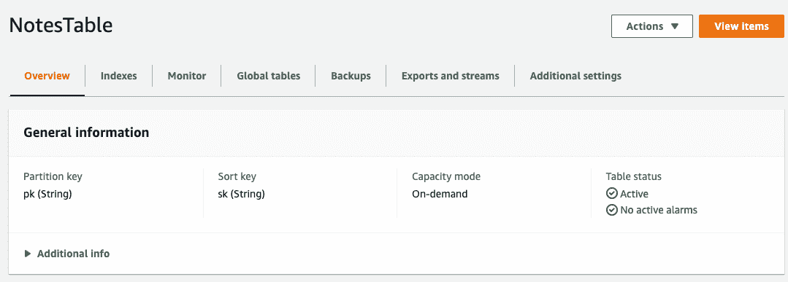
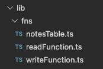
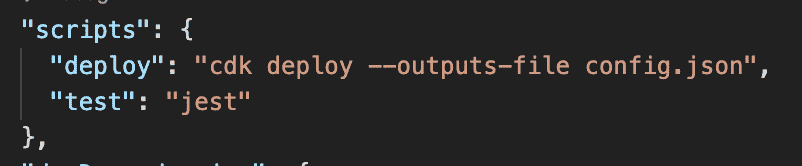
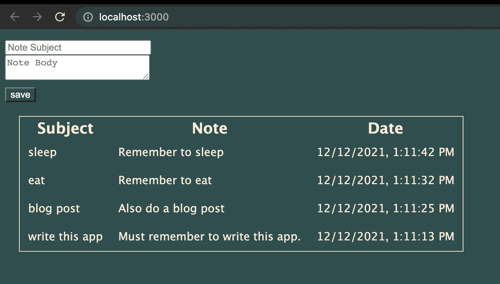
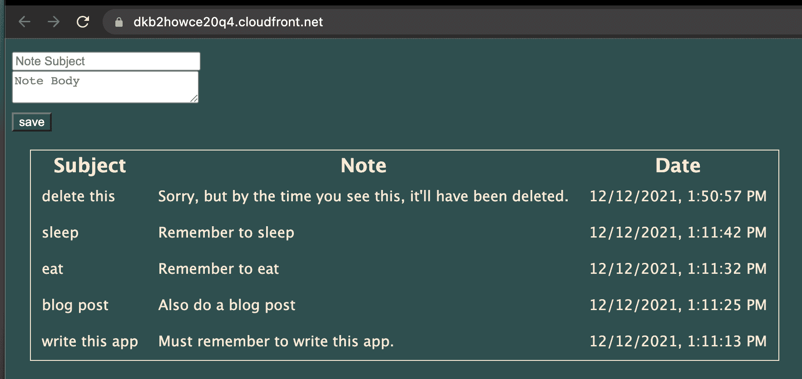

# AWS CDK v2 教程——如何创建三层无服务器应用程序

> 原文：<https://www.freecodecamp.org/news/aws-cdk-v2-three-tier-serverless-application/>

三层 web 应用程序有表示层、应用层和数据库层。

这种熟悉的模式是学习 AWS 云开发工具包(CDK)等新技术的沃土。

在本教程中，我们将使用 DynamoDB 表、HTTP API 端点、Lambda 处理程序和带有 CloudFront 内容交付网络(CDN)的前端 React 应用程序来创建一个简单的笔记应用程序。

所有这些都可以使用一个命令部署到 AWS 帐户。所有这些都要用打字稿来写。

本教程的源代码可以在 [GitHub](https://github.com/elthrasher/cdk-three-tier-serverless) 上获得。

### 如何获取 AWS 帐户凭据

首先，我们需要一个 AWS 帐户和命令行中可用的凭证。本教程中部署的所有资源都应该保留在免费使用层，但是仍然需要信用卡来注册 AWS 帐户。

如果您还没有 AWS 帐户，这里的[是一个很好的资源，可以让您安全地使用 AWS 帐户，并牢记最佳实践。](https://acloudguru.com/videos/acg-fundamentals/how-to-create-an-aws-account)

AWS 新手也不妨去看看 [CDK 研讨会](https://cdkworkshop.com/)，特别是关于创建 [AWS 账号和用户](https://cdkworkshop.com/15-prerequisites/200-account.html)的部分。

### 其他先决条件

使用 AWS 时，安装 [AWS CLI](https://docs.aws.amazon.com/cli/latest/userguide/getting-started-install.html) 是个好主意。你还需要安装最新版本的 [Node.js](https://nodejs.org/en/) 。

## 如何初始化应用程序

首先，我们可以使用 cdk 命令行实用程序来搭建应用程序。

1.  `mkdir cdk-three-tier-serverless && cd cdk-three-tier-serverless`
2.  `npx cdk init app --language=typescript`

这将创建一些文件让我们开始并下载必要的依赖项。

### CDK v1 和 v2 有什么区别？

AWS CDK v2 于 2021 年 12 月正式上市[。AWS 宣布 v1 将](https://aws.amazon.com/about-aws/whats-new/2021/12/aws-cloud-development-kit-cdk-generally-available/)[进入维护阶段，并最终在 2023 年 6 月结束对 v1](https://docs.aws.amazon.com/cdk/v1/guide/home.html) 的支持。v1 和 v2 的主要区别在于 v2 在管理依赖关系方面做得更好。为 v1 构建的已发布的构造需要更新，然后才能在 v2 应用程序中工作。

### 什么是 Projen？(可选)

[Projen](https://github.com/projen/projen) 作为`cdk init`的替代品在 CDK 社区很受欢迎。为了避免引入太多概念，本教程没有使用 projen，但是您可以从`npx projen new awscdk-app-ts`开始创建一个非常相似的应用程序。

## 如何引导您的 AWS 帐户

为了通过 AWS CDK 使用我们的 AWS 帐户，我们必须首先通过部署一个简单的堆栈来引导帐户，以管理帐户中的资产。

你可以通过在命令行输入`npx cdk bootstrap`来实现。最好在初始化一个项目之后再做这个*，否则引导程序会要求额外的信息。如果引导成功，我们准备继续构建我们的应用程序，否则，我们应该参考[官方文档](https://docs.aws.amazon.com/cdk/v2/guide/bootstrapping.html)以获得故障排除建议。*

### 如何引导 AWS 角色(可选)

bootstrap 将创建几个角色，用于部署、管理资产和查找资源 Amazon Resource Names (ARNs)。虽然您可以与拥有 AdministratorAccess 策略的用户一起完成本教程，但这不是最佳做法。

如果我们查找由 bootstrap 创建的角色的 ARNs，我们可以构建一个细粒度的策略，并将其应用于新用户。

我们创建的策略可能如下所示。参见关于创建 IAM 用户的[正式文档](https://docs.aws.amazon.com/IAM/latest/UserGuide/id_users_create.html)。

```
{
    "Version": "2012-10-17",
    "Statement": [
        {
            "Sid": "assumecdkroles",
            "Effect": "Allow",
            "Action": [
                "sts:AssumeRole",
                "iam:PassRole"
            ],
            "Resource": [
                "arn:aws:iam::1234567890:role/cdk-abc123-deploy-role-1234567890-us-east-1",
                "arn:aws:iam::1234567890:role/cdk-abc123-file-publishing-role-1234567890-us-east-1",
                "arn:aws:iam::1234567890:role/cdk-abc123-image-publishing-role-1234567890-us-east-1",
                "arn:aws:iam::1234567890:role/cdk-abc123-lookup-role-1234567890-us-east-1"
            ]
        }
    ]
} 
```

在锁定了 MFA 和 root 访问权限的帐户中，这样的策略应该为学习者提供合理程度的安全性。企业用户将会考虑建立 [AWS SSO](https://aws.amazon.com/single-sign-on/) 和 [AWS 组织](https://github.com/aws-samples/aws-bootstrap-kit-examples/blob/main/source/1-SDLC-organization/README.md)。

## 如何构建数据层

我们将从构建数据层开始。我们将能够部署我们的应用程序的每一步，并在 AWS 控制台中检查我们的进度。

### 如何创建 DynamoDB 表

init 操作将创建一个名为 CDK-three-tier-server less-stack . ts 的文件。我们可以从那里开始构建我们的应用程序。首先让我们删除注释代码并添加一个表声明。注意，与 CDK v1 应用程序不同，开始使用 DynamoDB 不需要安装额外的包。

```
import { RemovalPolicy, Stack, StackProps } from 'aws-cdk-lib';
import { AttributeType, BillingMode, Table } from 'aws-cdk-lib/aws-dynamodb';
import { Construct } from 'constructs';

export class CdkThreeTierServerlessStack extends Stack {
  constructor(scope: Construct, id: string, props?: StackProps) {
    super(scope, id, props);

    const table = new Table(this, 'NotesTable', {
      billingMode: BillingMode.PAY_PER_REQUEST,
      partitionKey: { name: 'pk', type: AttributeType.STRING },
      removalPolicy: RemovalPolicy.DESTROY,
      sortKey: { name: 'sk', type: AttributeType.STRING },
      tableName: 'NotesTable',
    });
  }
} 
```

我们可以使用`npx cdk deploy`立即部署这个表，然后在控制台中检查它。



### 如何使用 AWS DynamoDB OneTable 对数据建模

[OneTable](https://github.com/sensedeep/dynamodb-onetable) 是一个管理 DynamoDB 查询的工具。其背后的概念是，几个不同的实体可以在同一个 DynamoDB 表中建模，这种做法得到了该领域许多专家的认可。

在我们的简单应用程序中，我们只有单个实体注释，但我们还是会使用 OneTable，因为它有助于管理我们的模式。因为 DynamoDB 是一个 NoSQL 数据库，所以模式不是在创建表时定义的，相反，我们将在应用程序代码中定义它。

首先，我们需要安装依赖项。

```
npm i @aws-sdk/client-dynamodb dynamodb-onetable 
```

我们马上要创建两个 Lambda 函数，我们希望在它们之间共享一个模型。我们可以按照自己喜欢的方式组织代码。让我们在 lib 下创建一个“fns”文件夹，并创建名为 notesTable.ts、readFunction.ts 和 writeFunction.ts 的文件。



我们可以在 notesTable.ts 中定义一个模式。

```
import { DynamoDBClient } from '@aws-sdk/client-dynamodb';
import { Entity, Table } from 'dynamodb-onetable';
import Dynamo from 'dynamodb-onetable/Dynamo';

const client = new Dynamo({ client: new DynamoDBClient({}) });

const schema = {
  indexes: {
    primary: {
      hash: 'pk',
      sort: 'sk',
    },
  },
  models: {
    note: {
      type: {
        required: true,
        type: 'string',
        value: 'note',
      },
      pk: {
        type: 'string',
        value: 'note',
      },
      sk: {
        type: 'string',
        value: '${date}',
      },
      note: {
        required: true,
        type: 'string',
      },
      date: {
        required: true,
        type: 'string',
      },
      subject: {
        required: true,
        type: 'string',
      },
    },
  },
  version: '0.1.0',
  params: {
    typeField: 'type',
  },
  format: 'onetable:1.0.0',
} as const;

export type NoteType = Entity<typeof schema.models.note>;

const table = new Table({
  client,
  name: 'NotesTable',
  schema,
  timestamps: true,
});

export const Notes = table.getModel<NoteType>('note'); 
```

我们正在为模型定义“类型”、“主题”、“注释”和“日期”的属性。所有这些都是字符串类型。我们还将指明分区键将始终设置为“note”。这对于一个小的示例应用程序来说很好，但是对于更大的应用程序来说，根据应用程序需要的查询类型或访问模式来使用像用户 id 或帐户 id 这样的值是有意义的。

排序关键字和日期字段将包含完全相同的数据。这种数据复制是一种最佳实践，因为它允许我们在表中拥有不同种类的实体，其中一些实体可能不会按日期排序。

## 应用层

我们的应用层将由一些 Lambda 函数和一个将它们连接到互联网的 API 网关组成。

### Lambda 处理器

我们现在将填充我们的 Lambda 处理程序。我们可以添加额外的打字来使在打字环境中工作更容易。

```
npm i -D @types/aws-lambda 
```

由于 OneTable 去掉了处理 DynamoDB 的大量复杂性，我们的 Lambda 处理程序非常简单。我们的 read 函数执行一个 find 操作并返回结果。

```
import type { APIGatewayProxyResultV2 } from 'aws-lambda';

import { Notes } from './notesTable';

export const handler = async (): Promise<APIGatewayProxyResultV2> => {
  const notes = await Notes.find({ pk: 'note' }, { limit: 10, reverse: true });
  return { body: JSON.stringify(notes), statusCode: 200 };
}; 
```

添加 limit 和 reverse 参数意味着查询将返回最近的 10 条注释，并按排序键自动排序。

我们的 write 函数同样非常简单。

```
import type {
  APIGatewayProxyEventV2,
  APIGatewayProxyResultV2,
} from 'aws-lambda';

import { Notes } from './notesTable';

export const handler = async (
  event: APIGatewayProxyEventV2
): Promise<APIGatewayProxyResultV2> => {
  const body = event.body;
  if (body) {
    const notes = await Notes.create(JSON.parse(body));
    return { body: JSON.stringify(notes), statusCode: 200 };
  }
  return { body: 'Error, invalid input!', statusCode: 400 };
}; 
```

### NodejsFunction 构造

回到堆栈，我们现在需要创建函数构造。我们的 Lambda 函数将用 TypeScript 编写，因此在它们可以在 Lambda 运行时中运行之前，需要一个翻译步骤。

幸运的是，CDK 提供了一个 NodejsFunction 构造来为我们解决这个问题。NodejsFunction 使用了 [esbuild](https://esbuild.github.io/) ，一个非常快的 transpiler。esbuild 不是 CDK 的直接依赖项，所以我们需要安装它以避免较慢的回退，这在 Docker 中构建。

npm i -D esbuild

现在我们可以将构造添加到堆栈中。

```
import { RemovalPolicy, Stack, StackProps } from 'aws-cdk-lib';
import { AttributeType, BillingMode, Table } from 'aws-cdk-lib/aws-dynamodb';
import { Architecture } from 'aws-cdk-lib/aws-lambda';
import { NodejsFunction } from 'aws-cdk-lib/aws-lambda-nodejs';
import { RetentionDays } from 'aws-cdk-lib/aws-logs';
import { Construct } from 'constructs';

export class CdkThreeTierServerlessStack extends Stack {
  constructor(scope: Construct, id: string, props?: StackProps) {
    super(scope, id, props);

    const table = new Table(this, 'NotesTable', {
      billingMode: BillingMode.PAY_PER_REQUEST,
      partitionKey: { name: 'pk', type: AttributeType.STRING },
      removalPolicy: RemovalPolicy.DESTROY,
      sortKey: { name: 'sk', type: AttributeType.STRING },
      tableName: 'NotesTable',
    });

    const readFunction = new NodejsFunction(this, 'ReadNotesFn', {
      architecture: Architecture.ARM_64,
      entry: `${__dirname}/fns/readFunction.ts`,
      logRetention: RetentionDays.ONE_WEEK,
    });

    const writeFunction = new NodejsFunction(this, 'WriteNoteFn', {
      architecture: Architecture.ARM_64,
      entry: `${__dirname}/fns/writeFunction.ts`,
      logRetention: RetentionDays.ONE_WEEK,
    });
  }
} 
```

我们的导入列表还在增加，但是它们都是和 aws-cdk-lib 一起安装的，所以不用担心版本问题。我们还需要给我们的函数授予访问表的权限。

```
 table.grantReadData(readFunction);

    table.grantWriteData(writeFunction); 
```

所有这些都可以在这个阶段部署。虽然我们的功能不能通过互联网访问，但可以从 AWS 控制台执行。

Lambda 函数应该进行单元测试！编写测试超出了本教程的范围，但是您可以在[源报告](https://github.com/elthrasher/cdk-three-tier-serverless/tree/main/lib/fns)中看到一些测试。

### HTTP API

我们将使用 AWS API 网关 HTTP API 构建面向用户的 API。HTTP API 是 REST API 的低成本替代方案。HTTP API 的 CDK 构造仍然是实验性的，所以我们需要安装额外的模块来使用它。

```
npm i @aws-cdk/aws-apigatewayv2-alpha @aws-cdk/aws-apigatewayv2-integrations-alpha 
```

然后，我们可以将必要的类导入到堆栈中。

```
import {
  CorsHttpMethod,
  HttpApi,
  HttpMethod,
} from '@aws-cdk/aws-apigatewayv2-alpha';
import { HttpLambdaIntegration } from '@aws-cdk/aws-apigatewayv2-integrations-alpha'; 
```

为了创建 HTTP API，我们将需要具有 CORS 配置的基本构造，因为我们的视图将从 CloudFront 域提供服务。然后我们创建集成构造，最后添加路由。

```
 const api = new HttpApi(this, 'NotesApi', {
      corsPreflight: {
        allowHeaders: ['Content-Type'],
        allowMethods: [CorsHttpMethod.GET, CorsHttpMethod.POST],
        allowOrigins: ['*'],
      },
    });

    const readIntegration = new HttpLambdaIntegration(
      'ReadIntegration',
      readFunction
    );

    const writeIntegration = new HttpLambdaIntegration(
      'WriteIntegration',
      writeFunction
    );

    api.addRoutes({
      integration: readIntegration,
      methods: [HttpMethod.GET],
      path: '/notes',
    });

    api.addRoutes({
      integration: writeIntegration,
      methods: [HttpMethod.POST],
      path: '/notes',
    }); 
```

API Gateway 将自动为我们的端点生成一个 URL。我们可以应用一个自定义域，但这需要一些成本，所以我们现在将使用生成的 URL。最好从堆栈中输出它，这样我们就不需要在控制台上查找了。我们可以将 CfnOutput 添加到 aws-cdk-lib 导入中，并在堆栈中再添加一行。

```
new CfnOutput(this, 'HttpApiUrl', { value: api.apiEndpoint }); 
```

现在我们用`npx cdk deploy`再部署一次。我们将得到类似这样的输出。

产出:

CdkThreeTierServerlessStack。https://g50qzchav1.execute-api.us-east-1.amazonaws.com

我们可以立即在网页浏览器中打开[https://g 50 qzchav 1 . execute-api . us-east-1 . Amazon AWS . com/notes](https://g50qzchav1.execute-api.us-east-1.amazonaws.com/notes)并看到工作的 API。因为数据库中还没有任何东西，所以我们将得到一个空数组。我们可以使用 REST 客户端并开始发布数据，但是相反，让我们构建我们的用户界面。

### 捕获 API URL

为了获得更好的开发体验，我们可以将该 url 存储在本地配置文件中，以便在我们的项目中使用。这可以通过向我们的 deploy 命令添加–outputs-file 参数来实现。我们可以将它添加到 npm 脚本中，输出一个 config.json。



将 config.json 文件添加到我们的. gitignore 中可能是个好主意。我们在源代码控制中不需要它，我们将以另一种方式管理我们部署的 web 应用程序。

## 表示层

最后，让我们构建表示层。我们将在本教程中使用 React。表示层将通过 CloudFront 发行版提供服务，但它可以作为我们的 CDK 应用程序的一部分来构建和部署。

### React 应用

关于全栈 TypeScript 应用程序的一个很酷的事情是，我们可以在一个地方管理我们所有的依赖关系。我们将使用 TypeScript 构建一个 React 应用程序。我们将它与 esbuild 捆绑在一起，并使用 [vitejs](https://vitejs.dev/) ，这是一个很好的工具，它为 esbuild 添加了实时重载和一些其他生活质量功能。让我们添加我们的依赖项和 devDependencies。请注意，这里的区别更多的是约定，这个应用程序可能会一样工作，无论它们是在依赖关系中还是在开发依赖关系中。

```
npm i react react-dom
npm i -D @types/react @types/react-dom @vitejs/plugin-react-refresh vite 
```

按照惯例，vitejs 希望在项目的根中有一个 index.html，所以让我们添加它。

```
<!DOCTYPE html>
<html lang="en">
  <head>
    <meta charset="UTF-8" />
    <meta
      name="description"
      content="Sample Three-tier Serverless Web Application"
    />
    <meta
      http-equiv="Cache-Control"
      content="no-cache, no-store, must-revalidate"
    />
    <meta http-equiv="Pragma" content="no-cache" />
    <meta http-equiv="Expires" content="0" />
    <meta name="viewport" content="width=device-width, initial-scale=1.0" />
    <title>Three-tier Serverless Web App</title>
  </head>
  <body>
    <div id="root"></div>
    <script type="module" src="/lib/web/main.tsx"></script>
  </body>
</html> 
```

index.css 直接指向一个 main.tsx，我们在 lib 下新建一个名为 web 的目录，在那个子目录下添加 App.tsx、index.css、main.tsx、utils.ts。

因为我们要向项目添加 React，所以我们需要修改我们的 tsconfig.json，添加以下键和值:

```
 "jsx": "react",
    "esModuleInterop": true,
    "allowSyntheticDefaultImports": true 
```

我们还需要向 tsconfig.json 中的“lib”键添加另一个值。

```
 "lib": ["DOM", "es2018"], 
```

现在让我们编写 main.tsx。这是 React 应用程序的入口点，只需要调用另一个组件。

```
import './index.css';

import React from 'react';
import ReactDOM from 'react-dom';

import App from './App';

ReactDOM.render(
  <React.StrictMode>
    <App />
  </React.StrictMode>,
  document.getElementById('root')
); 
```

我们可以在 index.css 中放一点 css 来启动这个应用程序。

```
body {
  background-color: darkslategray;
  color: antiquewhite;
  font-family: 'Lucida Sans', 'Lucida Sans Regular', 'Lucida Grande',
    'Lucida Sans Unicode', Geneva, Verdana, sans-serif;
  font-size: 16pt;
}

button {
  background-color: forestgreen;
  color: white;
}

input,
textarea {
  width: 200px;
}

table {
  border: 1px solid;
  margin: 20px;
}

td {
  font-size: 12pt;
  padding: 10px;
  overflow: hidden;
  white-space: nowrap;
  text-overflow: ellipsis;
} 
```

App.tsx 开始变得有点长，分成单独的组件可能更好，但是 React 状态管理远远超出了本教程的范围，所以让我们保持简单。

```
import React, { useEffect, useState } from 'react';

import { NoteType } from '../fns/notesTable';
import { getNotes, saveNote } from './utils';

const App = () => {
  const [body, setBody] = useState('');
  const [notes, setNotes] = useState([]);
  const [subject, setSubject] = useState('');
  useEffect(() => {
    getNotes().then((n) => setNotes(n));
  }, []);
  const clickHandler = async () => {
    if (body && subject) {
      setBody('');
      setSubject('');
      await saveNote({
        date: new Date().toISOString(),
        note: body,
        subject,
        type: 'note',
      });
      const n = await getNotes();
      setNotes(n);
    }
  };
  return (
    <div>
      <div>
        <div>
          <input
            onChange={(e) => setSubject(e.target.value)}
            placeholder="Note Subject"
            type="text"
            value={subject}
          />
        </div>
        <div>
          <textarea
            onChange={(e) => setBody(e.target.value)}
            placeholder="Note Body"
            value={body}
          ></textarea>
        </div>
        <div>
          <button onClick={clickHandler}>save</button>
        </div>
      </div>
      <div>
        <table>
          <thead>
            <tr>
              <th>Subject</th>
              <th>Note</th>
              <th>Date</th>
            </tr>
          </thead>
          <tbody>
            {notes.map((note: NoteType) => (
              <tr key={note.date}>
                <td>{note.subject}</td>
                <td>{note.note}</td>
                <td>{new Date(note.date).toLocaleString()}</td>
              </tr>
            ))}
          </tbody>
        </table>
      </div>
    </div>
  );
};

export default App; 
```

我们需要在 utils.ts 中构建我们的 http 客户端。这里我们有一个额外的步骤，我们将从前面创建的 config.json 文件中获取 HTTP API url。这样我们就可以拥有一个本地开发环境，而不需要复制粘贴 URL。

```
import { NoteType } from '../fns/notesTable';

let url = '';

const getUrl = async () => {
  if (url) {
    return url;
  }
  const response = await fetch('./config.json');
  url = `${(await response.json()).CdkThreeTierServerlessStack.HttpApiUrl}/notes`;
  return url;
};

export const getNotes = async () => {
  const result = await fetch(await getUrl());

  return await result.json();
};

export const saveNote = async (note: NoteType) => {
  await fetch(await getUrl(), {
    body: JSON.stringify(note),
    headers: { 'Content-Type': 'application/json' },
    method: 'POST',
    mode: 'cors',
  });
}; 
```

要启用 react-refresh 插件，我们可以使用以下代码在项目的根目录中添加一个 vite.config.ts 文件。

```
import { defineConfig } from 'vite';
import reactRefresh from '@vitejs/plugin-react-refresh';

// https://vitejs.dev/config/
export default defineConfig({
  plugins: [reactRefresh()],
}); 
```

所有这些完成后，我们可以使用`npx vite`启动我们的开发服务器，然后在 [http://localhost:3000](http://localhost:3000) 上查看 web 应用程序。如果我们做了更改，服务器会检测到更改并重新加载。我们可以试着保存一些笔记，看看效果如何。



也许可以使用一些造型帮助，但除此之外，这是工作得很好。

### 云锋分布

在这一节中，我们将向 CDK-three-tier-server less-stack . ts 添加几个构造。我们的堆栈在这一点上开始变得有点大，但是为了本教程的缘故，我们将把它全部放在一个模块中。在这一点上，开始考虑如何分解大型模块或堆栈通常是一个好的做法，但是这个深刻的主题最好在另一个教程或博客中讨论。

我们的 web 应用程序将包含一个用于存储的 S3 存储桶、一个用于 React 应用程序的 CloudFront 分发和构建步骤，以及一个将为 web 应用程序提供 API url 的自定义资源。

在 CDK 创建一个 S3 桶很容易。请注意，虽然 S3 网站是可能的，但这将**而不是**是一个 S3 网站，因为我们希望使用 CloudFront 进行全球 CDN 和 https。如果我们有一个定制的域，我们也想把它附加到我们的 CloudFront 发行版中。

```
import { BlockPublicAccess, Bucket } from 'aws-cdk-lib/aws-s3';

    const websiteBucket = new Bucket(this, 'WebsiteBucket', {
      autoDeleteObjects: true,
      blockPublicAccess: BlockPublicAccess.BLOCK_ALL,
      removalPolicy: RemovalPolicy.DESTROY,
    }); 
```

我们在这里使用`autoDeleteObjects`和`RemovalPolicy.DESTROY`只是因为这是一个教程。如果您正在构建一个生产应用程序，您可能想要更好地保护您的资产。

这个 S3 桶没有公共通道。相反，我们将通过 CloudFront 发行版提供访问权限。为此，我们需要使用 OriginAccessIdentity 构造来授予 CloudFront 所需的读取权限。

```
import {
  Distribution,
  OriginAccessIdentity,
  ViewerProtocolPolicy,
} from 'aws-cdk-lib/aws-cloudfront';

    const originAccessIdentity = new OriginAccessIdentity(
      this,
      'OriginAccessIdentity'
    );
    websiteBucket.grantRead(originAccessIdentity); 
```

然后我们创建实际的发行版。

```
import {
  Distribution,
  OriginAccessIdentity,
  ViewerProtocolPolicy,
} from 'aws-cdk-lib/aws-cloudfront';
import { S3Origin } from 'aws-cdk-lib/aws-cloudfront-origins';

    const distribution = new Distribution(this, 'Distribution', {
      defaultBehavior: {
        origin: new S3Origin(websiteBucket, { originAccessIdentity }),
        viewerProtocolPolicy: ViewerProtocolPolicy.REDIRECT_TO_HTTPS,
      },
      defaultRootObject: 'index.html',
      errorResponses: [
        {
          httpStatus: 404,
          responseHttpStatus: 200,
          responsePagePath: '/index.html',
        },
      ],
    }); 
```

这个发行版是为像 React 这样的单页应用程序设计的，它将把所有流量升级到 https。

在下一部分中，我们将添加一个新的助手库 fs-extra。这将使得在应用程序中复制我们的构建文件更加容易。

```
npm i -D @types/fs-extra fs-extra 
```

作为堆栈合成流程的一部分，我们将使用 CDK 的资产绑定功能，通过 vitejs 和 esbuild 构建 React 应用程序。默认情况下，CDK 资产捆绑希望使用 Docker。由于我们已经在 NodeJS 运行时，我们更喜欢绕过较慢的 Docker 构建，而使用本地绑定。

```
import {
  CfnOutput,
  DockerImage,
  RemovalPolicy,
  Stack,
  StackProps,
} from 'aws-cdk-lib';
import { execSync, ExecSyncOptions } from 'child_process';
import { join } from 'path';
import { copySync } from 'fs-extra';

    const execOptions: ExecSyncOptions = {
      stdio: ['ignore', process.stderr, 'inherit'],
    };

    const bundle = Source.asset(join(__dirname, 'web'), {
      bundling: {
        command: [
          'sh',
          '-c',
          'echo "Docker build not supported. Please install esbuild."',
        ],
        image: DockerImage.fromRegistry('alpine'),
        local: {
          tryBundle(outputDir: string) {
            try {
              execSync('esbuild --version', execOptions);
            } catch {
              return false;
            }
            execSync('npx vite build', execOptions);
            copySync(join(__dirname, '../dist'), outputDir, {
              ...execOptions,
              recursive: true,
            });
            return true;
          },
        },
      },
    }); 
```

bundler 将运行 vite build，它将我们的 transpiled web 应用程序放在`/dist`下，然后它将这些文件复制到 CDK 暂存目录(通常是 cdk.out)。

我们将用一个 BucketDeployment 来完成这一切，它实际处理将我们的更改发送到目标 S3 Bucket。

```
import { BucketDeployment, Source } from 'aws-cdk-lib/aws-s3-deployment';

    new BucketDeployment(this, 'DeployWebsite', {
      destinationBucket: websiteBucket,
      distribution,
      logRetention: RetentionDays.ONE_DAY,
      prune: false,
      sources: [bundle],
    }); 
```

### AwsCustomResource

所有这些都很好，但是我们仍然缺少一个 config.json 文件，它将帮助 React 应用程序知道我们的 HTTP API URL。我们可以部署一次堆栈，生成文件，然后将它打包并运输，但这意味着我们必须部署两次才能支持我们的应用程序。最好在我们第一次部署时动态生成这个文件。我们可以通过 AwsCustomResource 做到这一点。自定义资源将隐式创建一个 Lambda 函数，该函数可以接收生成的 URL，然后调用 AWS SDK 将其存储在我们的 Web 应用程序可以找到的 S3 中。所有这些只需要几行代码就可以完成！

```
import { AwsCustomResource, AwsCustomResourcePolicy, PhysicalResourceId } from 'aws-cdk-lib/custom-resources';
import { PolicyStatement } from 'aws-cdk-lib/aws-iam';

    new AwsCustomResource(this, 'ApiUrlResource', {
      logRetention: RetentionDays.ONE_DAY,
      onUpdate: {
        action: 'putObject',
        parameters: {
          Body: Stack.of(this).toJsonString({
            [this.stackName]: { HttpApiUrl: api.apiEndpoint },
          }),
          Bucket: websiteBucket.bucketName,
          CacheControl: 'max-age=0, no-cache, no-store, must-revalidate',
          ContentType: 'application/json',
          Key: 'config.json',
        },
        physicalResourceId: PhysicalResourceId.of('config'),
        service: 'S3',
      },
      policy: AwsCustomResourcePolicy.fromStatements([
        new PolicyStatement({
          actions: ['s3:PutObject'],
          resources: [websiteBucket.arnForObjects('config.json')],
        }),
      ]),
    }); 
```

在我们再次部署之前还有一件事。现在我们有了一个 CloudFront 发行版来托管 React 应用程序，让我们添加另一个 CfnOutput，这样我们就可以轻松地获得该发行版的 URL。

```
 new CfnOutput(this, 'DistributionDomain', {
      value: distribution.distributionDomainName,
    }); 
```

现在我们可以访问发行版的 URL 并查看我们的工作应用程序了！我们将看到现有的笔记，还可以添加新的笔记！



## 结论和下一步措施

如果您已经走了这么远，并且让您的应用程序正常工作，那么恭喜您！您可能希望添加额外的功能，比如分页、授权，或者允许用户更新或删除注释。当你完成实验时，采纳上面给出的建议并执行`npx cdk delete`来移除堆栈和资源以避免招致账单是个好主意。

我们已经介绍了使用 AWS CDK 创建三层 web 应用程序所需的所有步骤。想了解更多关于 CDK 的信息吗？加入 https://cdk.dev/的社区和 slack 频道，看看由 CDK 社区成员撰写的 https://thecdkbook.com/的 T2。

喜欢全栈式打字稿但又想磨砺自己的技能？然后看看我的书[打字工作室](https://www.amazon.com/gp/product/B093Y29GW3)。关于本教程、CDK 或 TypeScript 的问题或评论？在推特【https://twitter.com/NullishCoalesce 或[上找到我。](https://mattmorgan.cloud)