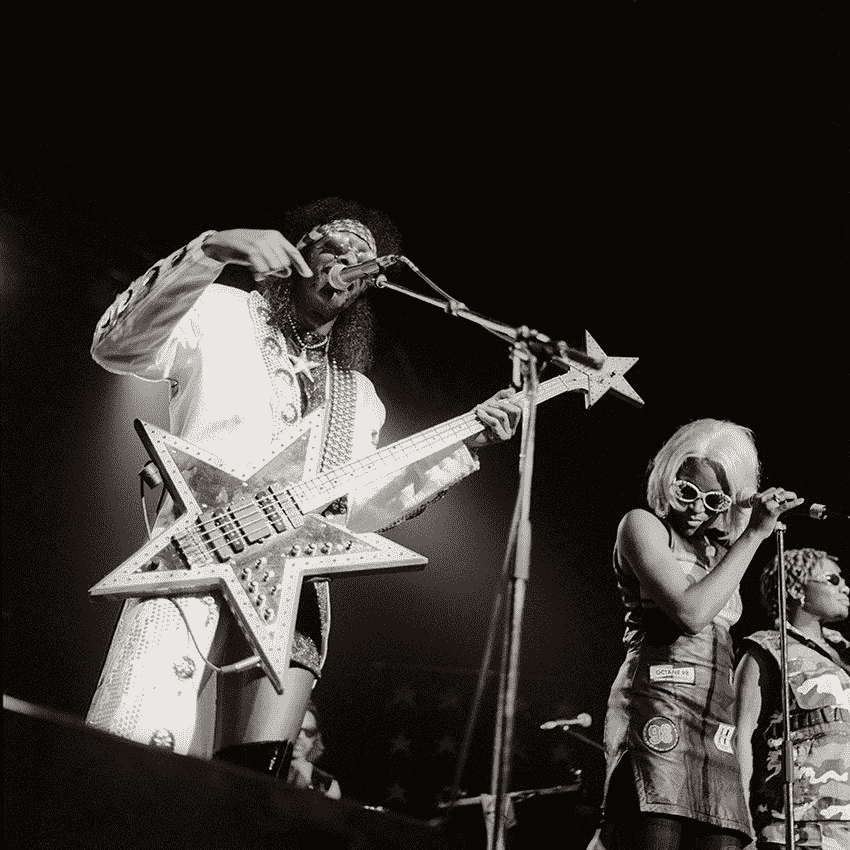
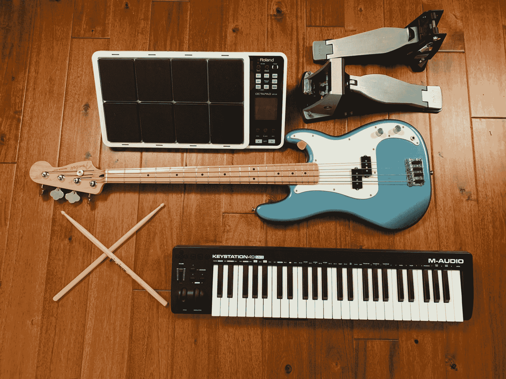

# 学习编码 RPG 完整的音乐+我是如何制作的

> 原文：<https://www.freecodecamp.org/news/learn-to-code-rpg-soundtrack/>

第一:你来这里的目的。下面是学习 RPG 编码的完整配乐。36 分钟的爵士乐。

[https://www.youtube.com/embed/8TDsGUFFXSY?feature=oembed](https://www.youtube.com/embed/8TDsGUFFXSY?feature=oembed)

如果你喜欢，请订阅我的新音乐频道，并留下反馈意见或你最喜欢的歌曲。

我目前正在把这个上传到 Spotify。

## 我是如何制作《学习编码 RPG》配乐的

70 年代的恐惧。80 年代的爵士乐。
90 年代的嘻哈。

我是音乐爱好者。但我从未真正学会如何演奏。

三个月之后变成了疫情。我买了一把电贝司。我在洛克史密斯花了几百个小时练习史密斯乐队的内森·伊斯特、布茨·科林斯和安迪·洛克的低音线。

Bootsy Collins, the legendary bassist for both Parliament and James Brown 

为了理论，我大量使用了音乐人 YouTube，包括里克·比托、T2、亚当·尼利和最重要的 T4，保罗·德尔·贝洛和 T5。

我还从 freeCodeCamp 社区的两位音乐家那里得到了指导:劳伦斯·杨(又名[特雷布尔斯和布鲁斯](https://open.spotify.com/artist/5K2ELFl9mZj4wSulXtgUcV))和德文·莱恩(又名[温柔回归](https://open.spotify.com/artist/7dFoXdChS3pVrba3MyuuTu))。听听他们的曲子。

不久，我开始意识到，几乎任何一首音乐只要有鼓、贝斯和钢琴，都可能听起来很好。但我不想找鼓手或钢琴家，所以我开始自己学习如何演奏这些乐器。

My gear – a Fender Precision bass, Roland Octopad, and M-Audio midi controller

我开始学习读谱，做听觉训练，记忆五度音阶——所有我认为你在音乐学校学到的东西。但是我很快就放弃了，转而喜欢坐下来写歌。

我买了一个 100 美元的 midi 控制器和一个 200 美元的 Logic Pro，然后开始学习如何创作和弦和旋律，并对着节拍器演奏。

这花了大约 6 个月的时间，但我录制了几十首器乐曲目，其中 10 首进入了《学习编码 RPG》的第一版。我正在为游戏未来的资料片创作几首节奏和乐器相似的歌曲。

## 你如何让你的键盘发出声音？

我使用 Logic 内置的 Alchemy additive synth 及其模拟 synth 构建我的 synth 补丁。我也用一些 Logic 的库存钢琴、电钢琴、风琴和它的钢片琴。

## 你用什么做鼓？

我在 Roland Octopad 上演奏了一套经过大量修改的逻辑制作鼓。我用很重的静音和很少的插件。我想要一种干爽清脆的 70 年代的声音。

你可能会注意到，我只使用踢，圈套，骑，和踩镲。这就是像克莱德·斯塔布菲尔德和格雷戈里·科尔曼这样的 70 年代的大师们所需要的。所以我把这种约束强加给自己。(我发现合理的约束可以加速创作过程。)

我没有演奏经典的 70 年代的霹雳舞，而是尝试围绕这首歌的低音线编织自己的霹雳舞。

## 踢鼓声是什么？

一个蓬勃发展的家庭音乐踢分层顶部点击死亡金属踢。

## 那个低音是什么？

你在《学习编码 RPG》原声音乐中听到的低音是一种加粗的模拟合成器声音，有一些延迟和失真。对于录音室级别的录音来说，我不能很好地演奏低音，所以我没有在演奏中劈砍它，而是在键盘上演奏。我将低音均衡为 40 赫兹，为这种踢音留出空间，因此它在手机扬声器上听起来仍然不错。

## 我可以在我的视频/直播中使用你的音乐吗？

在推特上给我发消息，我们可以讨论一下。

## 可以玩我的科技大会/轮滑场/艺术开场吗？

听起来像是爆炸。在推特上给我发 DM。

感谢你阅读我的音乐。我从未想过我会在 40 岁时发现一种新的强烈的激情。但这是一次爆炸。我才刚刚开始。如果幸运的话，我还有 40 年的时间来学习音乐和创作我引以为豪的作品。