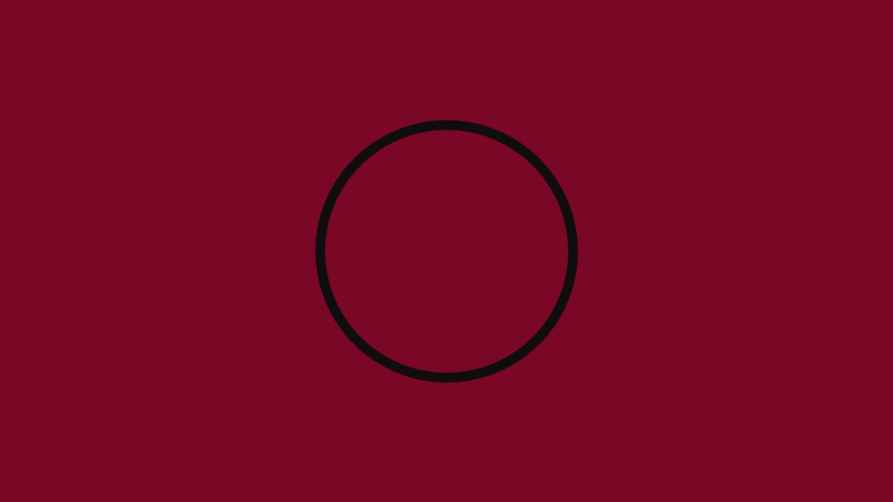
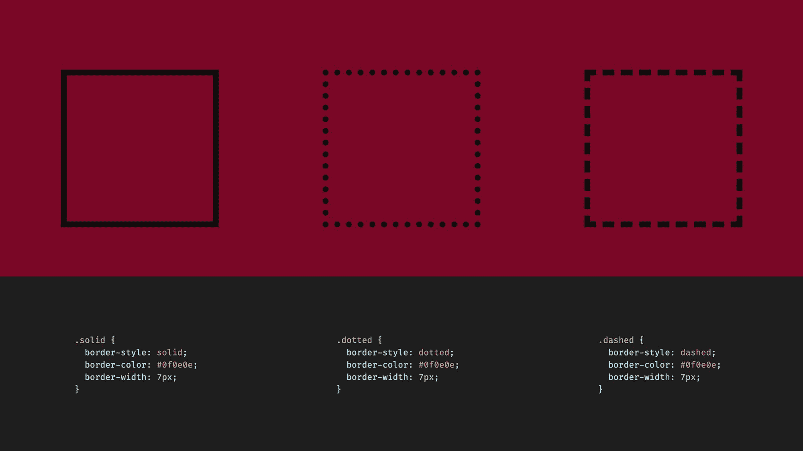
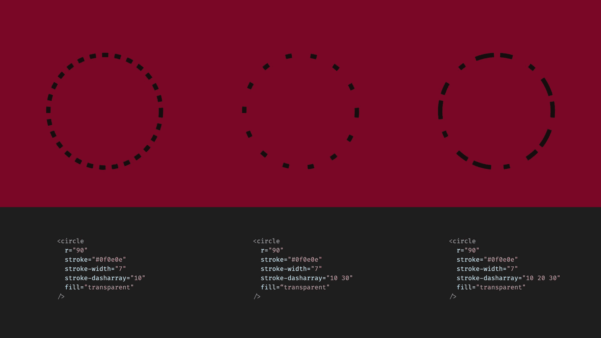
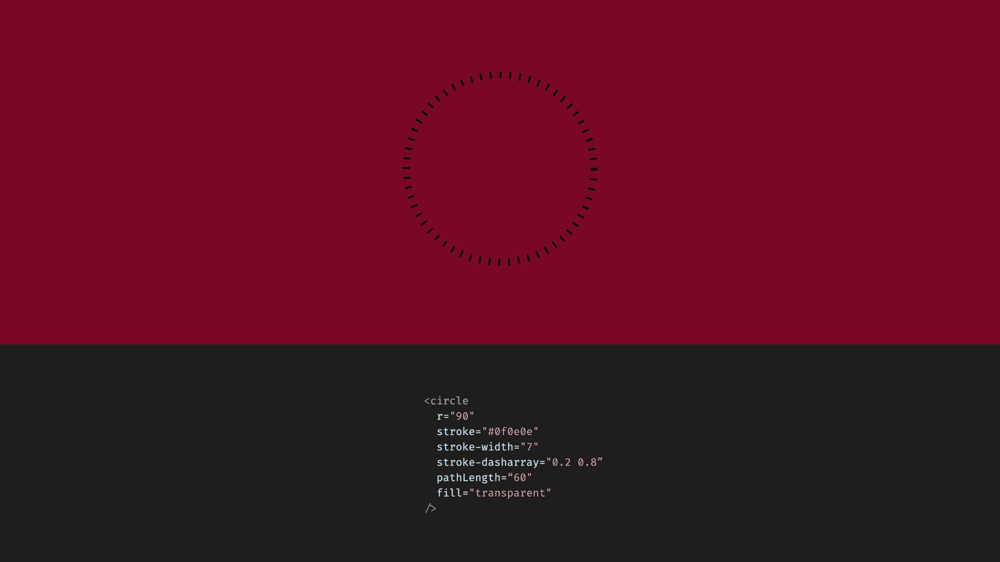
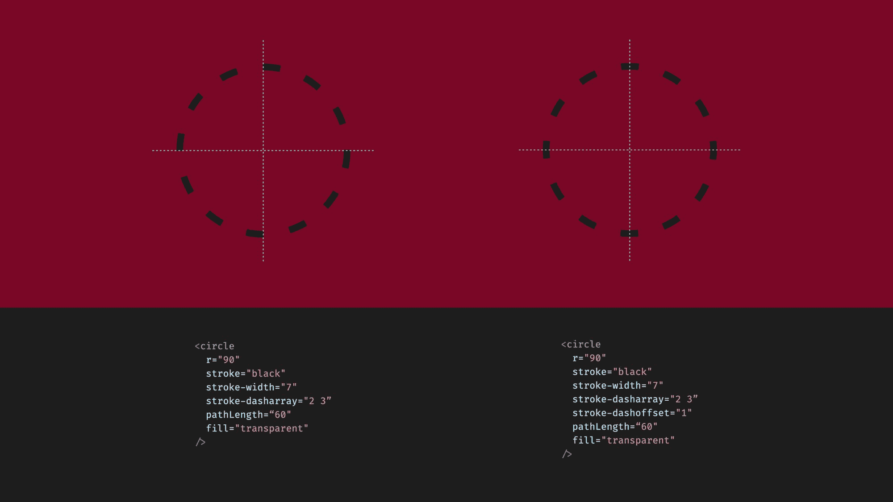
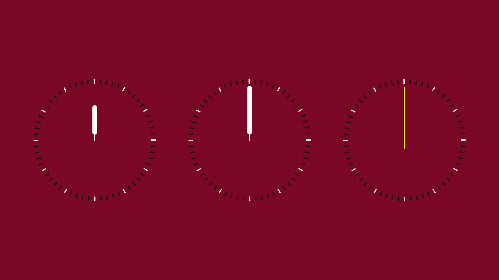

# SVG + JavaScript 教程——如何编写动画手表

> 原文：<https://www.freecodecamp.org/news/svg-javascript-tutorial/>

因为 SVG 图像可以内嵌在 HTML 中，所以我们可以用 JavaScript 操作它们。这意味着我们可以从代码中激活图像的一部分，使其具有交互性，或者从数据中改变事物并生成图形。

在本例中，我们将创建一个手表。我们将使用 SVG 来绘制手表，并使用 JavaScript 来制作指针动画。

本教程稍微高级一点，深入探讨一些不太明显的 SVG 属性，重点关注 JavaScript 动画。如果您想对 SVG 有一个更全面的了解，那么请查看我的[早期文章](https://www.freecodecamp.org/news/svg-tutorial-learn-to-code-images/)，在这篇文章中，我们浏览了 7 个简单 SVG 图像的代码。

您也可以[通过视频](https://www.youtube.com/watch?v=ULomsOSk4JA)观看这篇文章，其中包含更多内容。在视频中，我们还介绍了互动。

## **SVG 中的 HTML** 。

在上一篇文章中，我们了解到 SVG 图像可以内联到 HTML 文档中。我们讨论了 SVG 标签本身，它定义了图像的大小和图像元素的位置。

图像元素按其位置放置在图像中。`viewBox`定义了应该如何解释这些位置。

属性的前两个数字设置左上角的位置。与最后两个数字定义的大小一起，它们形成了一个坐标系。



```
<html>
  <head>
    <title>Watch</title>
    <link rel="stylesheet" href="./index.css" />
  </head>

  <body>
    <svg width="200" height="200" viewBox="-100 -100 200 200">
      <circle
        cx="0"
        cy="0"
        r="90"
        fill="transparent"
        stroke="#f0f0c9"
        stroke-width="7"
      />
    </svg>

    <script src="./index.js"></script>
  </body>
</html>
```

Our starting point

在本例中，我们将坐标系居中。`0,0`坐标在图像的中间。我们用`viewBox`设置左上角应该是`-100,-100`坐标，宽度和高度都应该是 200 个单位。

在这个例子中，由`width`和`height`定义的尺寸和由`viewBox`定义的尺寸是相同的。这意味着图像中的一个单元在浏览器中将是一个像素。这并不总是正确的。如果两者不匹配，则图像放大或缩小。

## **如何制作手表的分针和时针**

现在我们已经建立了我们的基础，让我们开始编码手表本身。我们从分针和时针开始。

有很多方法可以画出这些小线条。我们可以一条一条地画出每条线，但是最有效的方法可能是画一个带有特殊破折号属性的圆。

在我们最初的例子中,`circle`标签有一个中心位置、大小半径、填充和边框颜色以及边框宽度。

SVG 元素通常具有与 CSS 的 HTML 元素相似的样式选项。但是这些选项有不同的属性名称。你可以把`fill`属性想象成 CSS 中的`background-color`。并且`stroke`和`stroke-width`属性也与`border-color`和`border-width`属性类似。请记住，它们并不完全相同。

我们还将使用`fill`属性来设置文本颜色，并使用`stroke`属性来设置线条的颜色。

现在我们如何把一个连续的圆圈变成分钟标记？您可能熟悉 CSS 中的`border-style`属性。通常你会使用实线边框，但是你也可以使用虚线边框。这些边框样式不是很常见，因为在 CSS 中没有太多的选项来微调它们。



The `border-style` property in CSS for HTML elements

在 SVG 中，我们有类似的可能性，有更多的定制选项。我们可以使用`stroke-dasharray`、`stroke-dashoffset`和`pathLength`属性。

我们来举几个例子。在第一个例子中，我们将一个数字设置为`stroke-dasharray`。这将导致虚线边界，其中线段和间隙具有相同的长度。



The `stroke-dasharray` property for SVG

不过这个属性是一个数组。如果我们设置两个数字，那么第一个将是线段的长度，第二个将是间隙的长度。你甚至可以设置两个以上的数字，然后线的长度和间隙总是取下一个数字。直到用完数组，然后从头开始。

我们将设置两个数字。一个用于分钟标记的长度，一个用于它们之间的间隙。这两者之和应该正好是圆上一分钟的长度。我们知道一小时是 60 分钟。所以我们可以计算圆的周长，然后除以 60，得到一分钟的长度。

但是有更好的方法。我们可以反过来，不计算圆的周长。我们可以设置`pathLength`属性。

这个属性有点棘手。它不会调整圆的大小，但会影响如何解释 dasharray 属性。虚线将被绘制成好像圆有一个由`pathLength`定义的圆周。

所以我们把`pathLength`设为`60`，代表 60 分钟。现在，线段和间隙线段的总和必须为 1。在这个例子中，我将它设置为`0.2`和`0.8`。



Using the `pathLength` property. Note that the sum of the two numbers at the `stroke-dasharray` property is one, matching the length of one minute.

现在我们差不多完成了，但是还有一小块没完成。冲刺从错误的位置开始。要修复它，我们必须使用`stroke-dashoffset`属性将它移动线段长度的一半。

破折号偏移属性可能有点违反直觉，因为这里的正值会向后移动破折号。您也可以将其设置为正数，以将其向前移动。



Example with and without `stroke-dashoffset`

同样，我们可以设置一个小时标记。我们添加了一个新的具有几乎相同属性的 circle 标签。唯一不同的是颜色，我们在 dash 数组中有更长的间隔。

```
. . .

    <svg width="200" height="200" viewBox="-100 -100 200 200">
      <circle
        cx="0"
        cy="0"
        r="90"
        fill="transparent"
        stroke="#0f0e0e"
        stroke-width="7"
        stroke-dasharray="0.2 0.8"
        stroke-dashoffset="0.1"
        pathLength="60"
      />

      <circle
        cx="0"
        cy="0"
        r="90"
        fill="transparent"
        stroke="#f0f0c9"
        stroke-width="7"
        stroke-dasharray="0.2 4.8"
        stroke-dashoffset="0.1"
        pathLength="60"
      />
    </svg>

. . .
```

这里需要注意的是，SVG 中的分层很重要。稍后在文档中添加的标签将位于之前的标签之上。如果我们以相反的顺序添加这两个圆圈，那么分钟将完全覆盖小时标记。

由于 SVG 现在存在于 HTML 中，我们可以从 CSS 中移走一些属性。但是我们不能移动所有的属性。定义样式的属性和定义元素形状的属性是有区别的。

例如，半径定义了圆的形状，因此它必须与 SVG 代码保持一致。另一方面，我们可以移动填充和描边属性。

```
. . .

    <svg width="200" height="200" viewBox="-100 -100 200 200">
      <circle class="minute_marker" r="90" pathLength="60" />
      <circle class="hour_marker" r="90" pathLength="60" />
    </svg>

. . .
```

```
.hour_marker {
  fill: transparent;
  stroke: #f0f0c9;
  stroke-width: 7;
  stroke-dasharray: 0.2, 4.8;
  stroke-dashoffset: 0.1;
}

.minute_marker {
  fill: transparent;
  stroke: #0f0e0e;
  stroke-width: 7;
  stroke-dasharray: 0.2, 0.8;
  stroke-dashoffset: 0.1;
}
```

## **如何绘制表针**

让我们加上显示时间的指针。最初，我们把它们画得向上，然后用 JavaScript 把它们转换位置。



我们使用`line`元素来绘制手。为了定义一个线元素，我们必须设置开始和结束坐标，以及一个`stroke`颜色和`stroke-width`属性。

为了让事情变得更好，我们还可以添加`stroke-linecap`属性来拥有圆形的线帽。我们用 CSS 添加的这些样式属性。

```
. . . 

    <svg width="200" height="200" viewBox="-100 -100 200 200">
      <circle class="minute_marker" r="90" pathLength="60" />
      <circle class="hour_marker" r="90" pathLength="60" />

      <line class="hand" x1="0" y1="0" x2="0" y2="-50" />
      <line class="hand hand--thick" x1="0" y1="-12" x2="0" y2="-50" />

      <line class="hand" x1="0" y1="0" x2="0" y2="-80" />
      <line class="hand hand--thick" x1="0" y1="-12" x2="0" y2="-80" />

      <line class="hand hand--second" x1="0" y1="12" x2="0" y2="-80" />
    </svg>

. . . 
```

```
. . .

.hand {
  stroke: #ffffff;
  stroke-width: 2;
  stroke-linecap: round;
}

.hand--thick {
  stroke-width: 7;
}

.hand--second {
  stroke: yellow;
}
```

## 如何将表针指向正确的方向

现在我们如何把这些线变成位置？如果我们给一个元素分配一个 ID，我们就可以从 JavaScript 中访问和操作它。

但是，我们应该为哪个元素分配 ID 呢？一只手有两个元素。为了解决这个问题，我们可以将这两个线元素组合在一个组标签中。你可以把一个组标签想象成 HTML 中的`div`元素。

我们可以给这个组分配一个 ID，然后我们可以通过 JavaScript 将整个组旋转到位。

```
. . .

    <svg width="800" height="800" viewBox="-100 -100 200 200">
      <circle class="minute_marker" r="90" pathLength="60" />
      <circle class="hour_marker" r="90" pathLength="60" />

      <g id="hour_hand">
        <line class="hand" x1="0" y1="0" x2="0" y2="-50" />
        <line class="hand hand--thick" x1="0" y1="-12" x2="0" y2="-50" />
      </g>

      <g id="minute_hand">
        <line class="hand" x1="0" y1="0" x2="0" y2="-80" />
        <line class="hand hand--thick" x1="0" y1="-12" x2="0" y2="-80" />
      </g>

      <g id="second_hand">
        <line class="hand hand--second" x1="0" y1="12" x2="0" y2="-80" />
      </g>
    </svg>

. . .
```

在 JavaScript 文件中，首先，我们通过 ID 获取手元素。然后，我们创建一个日期对象，并获取当前的小时、分钟和秒。最后，我们根据这些值设置元素的属性。

```
const hoursElement = document.getElementById("hour_hand");
const minutesElement = document.getElementById("minute_hand");
const secondsElement = document.getElementById("second_hand");

const date = new Date();

const hour = date.getHours();
const minute = date.getMinutes();
const second = date.getSeconds();

hoursElement.setAttribute("transform", `rotate(${(360 / 12) * hour})`);
minutesElement.setAttribute("transform", `rotate(${(360 / 60) * minute})`);
secondsElement.setAttribute("transform", `rotate(${(360 / 60) * second})`);
```

变换属性可以包括多种变换，如缩放、平移或倾斜。

我们正在设置`rotate`转换，它需要一个数字。这个数字是 0 到 360 度之间的旋转。对于时针，我们将 360 除以 12，得到我们每小时需要旋转多少次，然后乘以当前小时。这将使时针指向当前小时。

对于分针和秒针，我们做同样的事情，只是我们将 360 除以 60，因为一个小时由 60 分钟组成，1 分钟是 60 秒。

幸运的是，变换中心默认是原点，即`0,0`坐标。如果不是这样，我们可以设置另一个变换原点，但是由于我们的`viewBox`设置，我们不需要这样做。

## **如何制作动画**手表 H **和******

**现在，这应该已经显示了当前时间，但我们的图像是静态的。为了跟上时间，我们可以使用`requestAnimationFrame`功能来移动指针。**

```
`const hoursElement = document.getElementById("hour_hand");
const minutesElement = document.getElementById("minute_hand");
const secondsElement = document.getElementById("second_hand");

function animate() {
  const date = new Date();

  const hour = date.getHours() % 12;
  const minute = date.getMinutes();
  const second = date.getSeconds();

  hoursElement.setAttribute("transform", `rotate(${(360 / 12) * hour})`);
  minutesElement.setAttribute("transform", `rotate(${(360 / 60) * minute})`);
  secondsElement.setAttribute("transform", `rotate(${(360 / 60) * second})`);

  requestAnimationFrame(animate);
}

requestAnimationFrame(animate);`
```

**我们将旋转逻辑移动到动画函数中，并使用 requestAnimationFrame 函数。**

**首先，我们通过调用 animate 函数外部的 requestAnimationFrame 来触发它。然后，为了继续播放动画，我们还会在每个动画周期结束时请求另一帧。**

**如果你想有一个更流畅的动画，那么你可以细化定位。我们可以将指针定义为指向分秒、分钟和小时，而不是离散的位置。**

```
`const hoursElement = document.getElementById("hour_hand");
const minutesElement = document.getElementById("minute_hand");
const secondsElement = document.getElementById("second_hand");

function animate() {
  const date = new Date();

  const hour = date.getHours() + date.getMinutes() / 60;
  const minute = date.getMinutes() + date.getSeconds() / 60;
  const second = date.getSeconds() + date.getMilliseconds() / 1000;

  hoursElement.setAttribute("transform", `rotate(${(360 / 12) * hour})`);
  minutesElement.setAttribute("transform", `rotate(${(360 / 60) * minute})`);
  secondsElement.setAttribute("transform", `rotate(${(360 / 60) * second})`);

  requestAnimationFrame(animate);
}

requestAnimationFrame(animate);`
```

**时针不会只根据小时来定位，但也会根据当前的分钟来轻微转动。**

**分针将考虑当前秒的旋转。而秒针也会考虑毫秒。这样我们的手会有一个连续的运动。它们不会从一秒跳到另一秒，但会产生动画效果。**

## ****下一步——如何让腕表变得互动起来****

**现在，如果我们检查结果，我们应该有一个流畅的动画手表。**

**为了更进一步，您还可以使用`text`元素添加一个显示当前日期的日历窗口。为了更进一步，您甚至可以为该元素添加一个事件处理程序，在当前日期和 AM/PM 指示器之间切换其内容。**

**如果你卡住了，看看下面的视频，我们也涵盖了这一部分。**

**将 SVG 和 JavaScript 混合使用带来了很多很酷的选择。您可以制作动画、添加交互和生成图形。迫不及待地想看看你能想出什么。**

 **[https://www.youtube.com/embed/ULomsOSk4JA?feature=oembed](https://www.youtube.com/embed/ULomsOSk4JA?feature=oembed)** 

## ****订阅更多 Web 开发教程:****

**[Hunor Márton BorbélyGame development with JavaScript, creative coding tutorials, HTML canvas, SVG, Three.js, and some React and Vue https://twitter.com/HunorBorbelyhttps://codepen.io/HunorMarton…YouTube](https://www.youtube.com/channel/UCxhgW0Q5XLvIoXHAfQXg9oQ)**