# 如何在 Windows 上双启动任何 Linux 发行版——并在需要时删除它

> 原文：<https://www.freecodecamp.org/news/how-to-dual-boot-any-linux-distribution-with-windows/>

Linux 和 Windows 像两股对立力量的日子已经一去不复返了。近年来，微软非常热情地拥抱开源社区，因此我们已经将类似于 Linux 的 Windows 子系统(T1)融入到我们的 Windows 安装中。

这并不意味着我们不再需要完整的 Linux 安装。事实上，同时运行 Windows 和 Linux 的机器非常普遍。

但是你知道什么比运行两种操作系统的机器更常见吗？尝试双启动机器的机器所有者最终会在此过程中丢失大量数据。

因此，如果你是受害者之一，或者是那些试图在即将到来的双启动冒险中避免可能的灾难的人之一，这篇文章就是为你准备的。在这里，您将了解到:

*   如何在安装 Windows 的同时安装 Linux 发行版
*   如何在必要时摆脱 Linux 而不搞乱 Windows
*   常见问题、误解及其解决方案，以及
*   一些通常令人讨厌的东西来打动你的同龄人

事不宜迟，让我们拿起一杯咖啡或茶，或者至少是水，直接投入到这个过程中吧。

## 我做的一些假设

在我进入教程的核心之前，我想澄清一些事情。为了使整篇文章易于理解，我对您的系统做了以下假设:

*   您的计算机使用的是 UEFI，而不是 BIOS
*   您的计算机上已经安装了 Windows
*   您有一个足够大(4GB)的 USB 驱动器来启动 Linux
*   您有足够的空间(25GB)在硬盘或固态硬盘上安装 Linux

差不多就是这样。如果你已经做好了以上所有的准备，你就可以开始了。

## 如何创建可引导的 Linux USB 驱动器

有多种工具可以帮助您创建可引导的 Linux USB 驱动器。在所有这些工具中，我最喜欢的是:

*   [巴伦纳蚀刻机](https://www.balena.io/etcher/)
*   [Fedora Media Writer](https://getfedora.org/en/workstation/download/)

这两个工具都是开源的，可以免费使用，并且几乎可以在所有主流平台上使用。对于本文，我将选择 Fedora Media Writer，因为没有太多教程讨论它，而且我个人也在使用它。

顾名思义，Fedora Media Writer 是由 Red Hat 创建的用于制作可引导 Linux USBs 的工具。一旦你下载了程序，就把它安装到你的系统上并启动它。

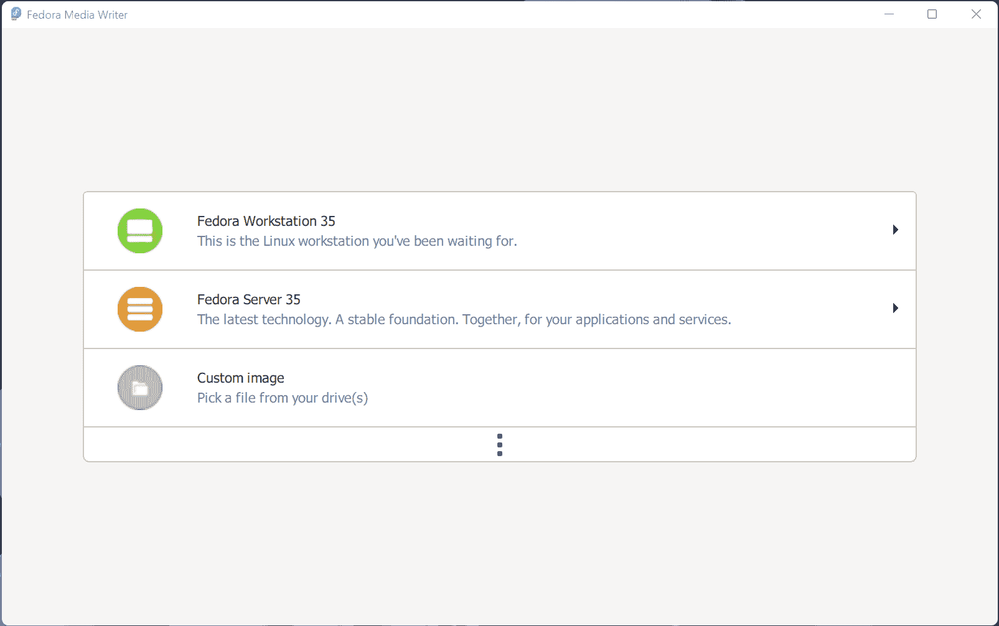

这是它看起来的样子。如你所见，你可以选择下载最新的 Fedora ISOs，也可以选择从你的硬盘中选择一个定制的图像文件。

除非你打算装 Fedora(剧透！这是我最喜欢的)在你的机器上，你必须继续下去，下载你想要的 ISO 文件。

在本文中，我将使用 Ubuntu ,因为它在新手中更受欢迎。但是您将在这里学到的东西可以应用于任何其他的 Linux 发行版。

继续从他们的[下载](https://ubuntu.com/download/desktop)页面下载 Ubuntu 的 ISO。Ubuntu 20.04 LTS(撰写本文时的最新长期版本)的大小约为 2.67GB。一旦你下载完文件，回到 Fedora Media Writer，点击“自定义图像”，选择你刚刚下载的 ISO 文件。

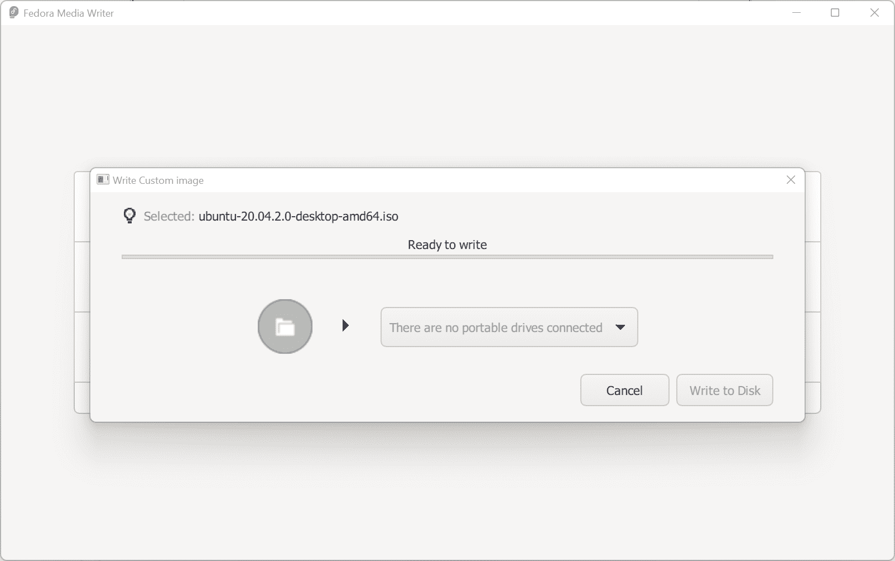

“写入磁盘”按钮是灰色的，因为没有 USB 驱动器连接到计算机。连接您的 USB 驱动器，按钮应该变成鲜红色。

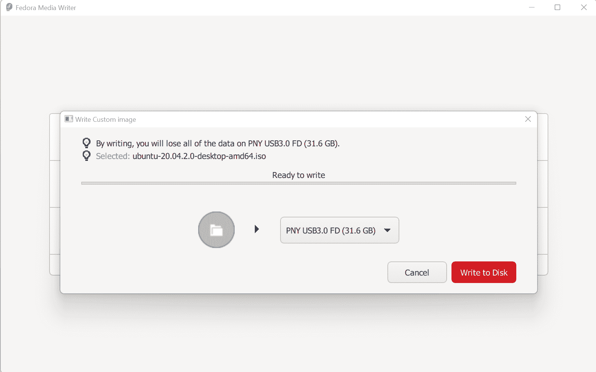

再次检查是否在下拉列表中选择了正确的 USB 驱动器，并点击“写入磁盘”按钮。根据您机器的传输速率，此过程可能需要几分钟。完成后，断开 USB 驱动器并将其放在一边。你很快就会需要它。

## 如何准备您的计算机安装 Linux

同样，发现无法从 Linux USB 驱动器启动的人并不少见。如果您没有正确配置电脑，就会发生这种情况。

为此，请转到您的控制面板。不是新的设置应用程序，而是 OG 控制面板。

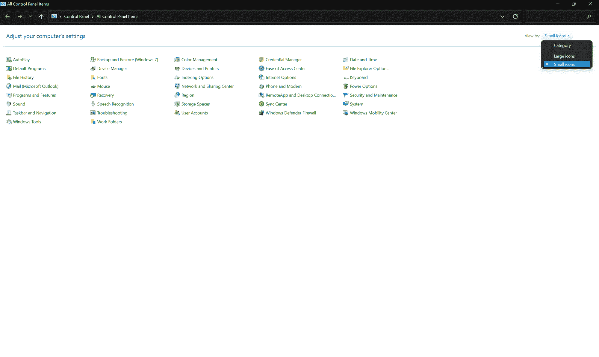

确保控制面板处于“小图标”或“大图标”模式，而不是“类别模式”。现在转到“电源选项”，从左侧栏，点击“选择电源按钮做什么”。

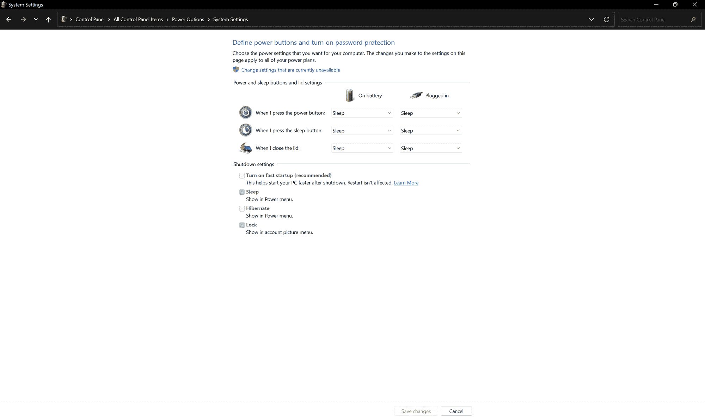

单击“更改当前不可用的设置”链接，取消选中“打开快速启动(推荐)”选项，然后点击“保存更改”。

根据沃尔特·格伦的[篇](https://www.howtogeek.com/243901/the-pros-and-cons-of-windows-10s-fast-startup-mode/)，

> 快速启动结合了冷关断和休眠特性。当您在启用快速启动的情况下关闭计算机时，Windows 会关闭所有应用程序并注销所有用户，就像正常的冷关机一样。
> 
> 此时，Windows 处于与刚启动时非常相似的状态:没有用户登录并启动程序，但 Windows 内核已加载，系统会话正在运行。
> 
> 然后，Windows 会提醒支持它的设备驱动程序准备休眠，将当前系统状态保存到休眠文件中，并关闭计算机。
> 
> 当你再次启动电脑时，Windows 不需要单独重新加载内核、驱动程序和系统状态。相反，它只是用休眠文件中加载的映像刷新您的 RAM，然后将您带到登录屏幕。这项技术可以为你的创业节省大量时间。

我知道这听起来是一个很好的特性，但问题是，如果你在双引导系统中保持快速启动，Linux 将无法使用两个操作系统之间共享的任何驱动器，因为它们处于休眠状态，由 Windows 控制。

接下来，引导进入主板的 UEFI 配置屏幕。根据您的主板或笔记本电脑品牌，该键可以更改，但在大多数情况下，按“Del”键应该可以进入。

一旦你到了那里，你必须改变一个特别的设置:

*   **关闭安全引导**–这是 UEFI 的功能之一，有助于在引导期间防止攻击和恶意软件。禁用它并不是绝对必要的，但是根据您选择的发行版，您可能会在安装过程中遇到问题，也可能不会。为了安全起见，禁用它。

保存更新的设置并引导回 Windows。现在是时候为 Linux 准备一些磁盘空间了。

## 如何为安装 Linux 创建额外的分区

现在是时候为新操作系统腾出空间了。基于你的硬盘或固态硬盘的状态，它可以非常简单，也可以非常棘手。

让我解释一下我们要做什么。Windows 内置了一个名为“磁盘管理”的实用工具，当你想修改分区时，这个工具很有用。

您可以使用它从现有分区中挤出一些空间。为此，请在“开始”菜单中搜索“磁盘管理”来打开它。

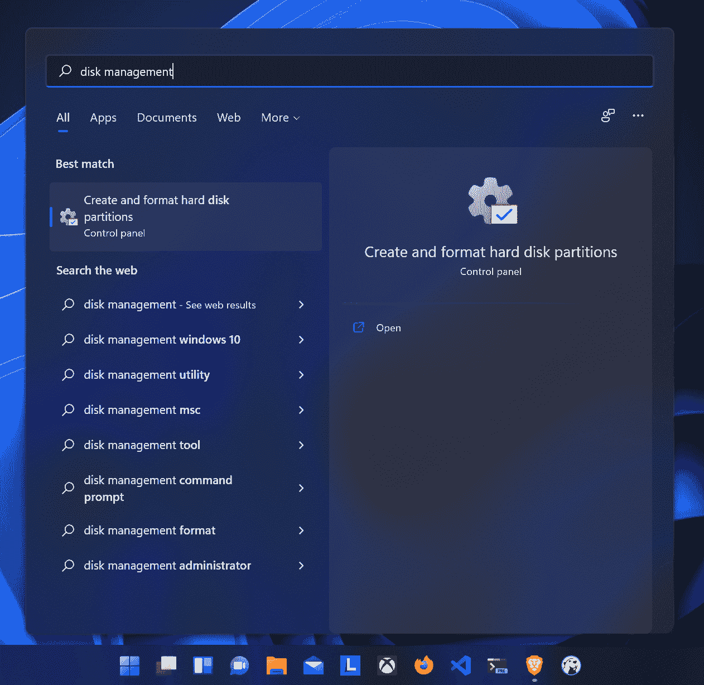

请记住，它可能会弹出“创建和格式化硬盘分区”，而不是磁盘管理。启动它，好好看看它的用户界面:

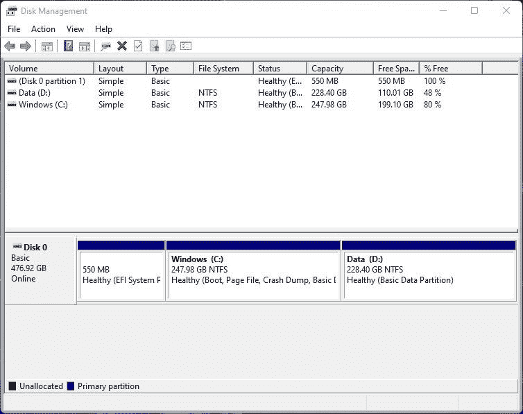

这张截图来自我的一台没有安装 Linux 的机器。在这篇文章中，我将使用这个设备作为试验品。它有一个 512GB 的 NVME 固态硬盘和 8GB 的内存。

用户界面分为两部分。顶部是所有分区的列表，底部是垂直列出的所有连接到计算机的物理磁盘。

下面的截图来自我的桌面工作站，它有一个 250GB 的 NVME 固态硬盘和一个 1TB 的硬盘。我在第二张磁盘上安装了 Windows 和 Linux。因此，如果您的机器上也有多个磁盘，我建议您将操作系统安装在包含 EFI 分区的磁盘上。

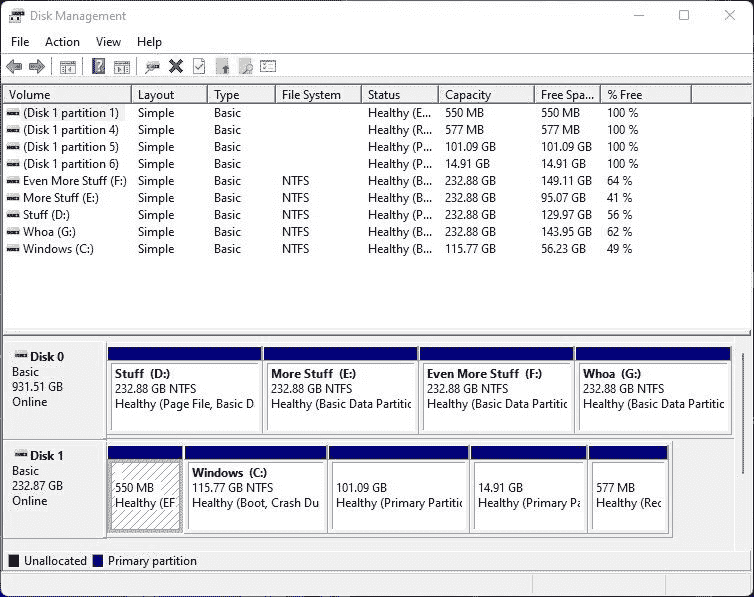

如果您查看磁盘 1 的开头，那个 550MB 的 FAT32 分区就是 EFI。在您的机器上，它可能要小得多。

让我们回到我们的豚鼠装置。从截图可以看出，Windows (C:)分区差不多有 250GB。我从这个分区切掉 108GB。

*   100GB 用于根
*   8GB 用于交换

在 Linux 中，根目录包含系统上的所有其他目录和文件。当您的 RAM 变满时，Linux 将非活动页面从内存移到交换空间。拥有一个交换空间并不是强制性的，但拥有它是件好事。

没有确定交换空间的硬性规则。对于 4GB-8GB 的内存，建议的交换空间大小是该大小的 2 倍，对于 8GB-16GB 的内存，建议的交换空间大小是该大小的 1.5 倍。考虑到我没有在这台笔记本电脑上执行任何内存密集型任务，我将在这里打破规则。

要从你想要的分区中切掉一些空间，从底部右键点击它，然后点击“收缩”。完成后，磁盘管理将开始计算可缩减的空间。

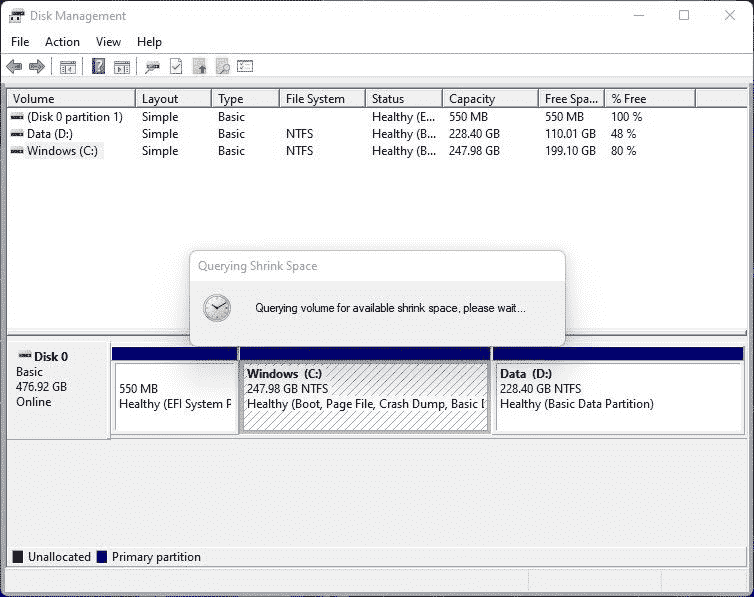

你可能认为一个分区的整个自由空间应该是可收缩的，但那不是真的。有时会有不可移动的文件分散在您的分区中，这可能会阻止您使用全部可用空间。在这些情况下，使用类似于 [Defraggler](https://www.ccleaner.com/defraggler) 的工具来优化您的驱动器。

磁盘管理完成分区查询后，您将看到以下窗口:

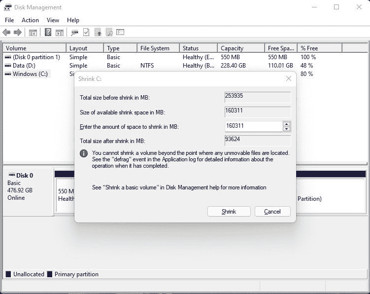

如你所见，我有 160311MB 的空间可以压缩。将该值除以 1024 将得到以千兆字节为单位的大小，在我的例子中大约是 156GB。

但是我想把我的分区缩小 108GB。将该值乘以 1024 得出 110592MB 的兆字节值。

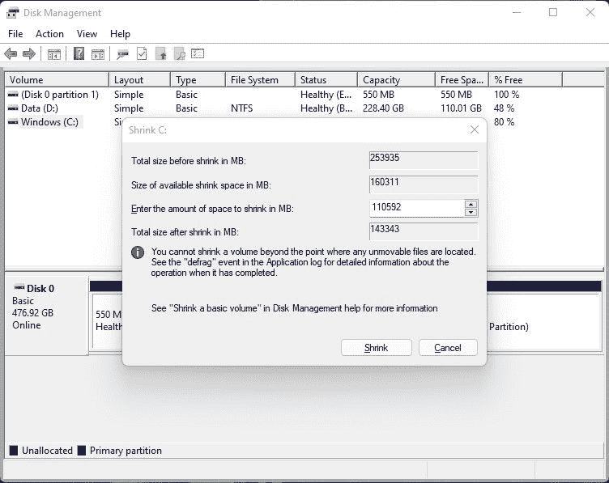

一旦你计算出你想要的尺寸，点击“缩小”按钮。收缩过程不需要那么长时间。一旦这个过程完成，用户界面的底部将会更新。

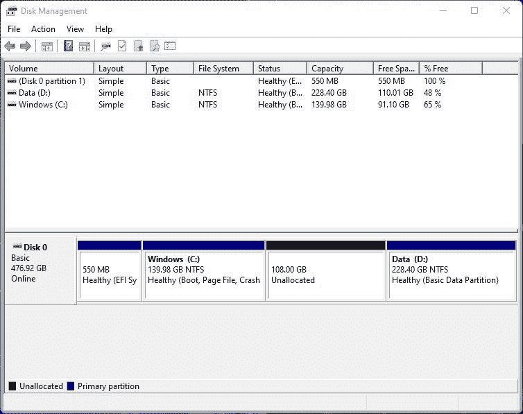

如您所见，我现在有 108GB 的未分配空间。说实话，这已经足够进行下一步了。但是为了让您的生活更轻松，我建议您在继续之前创建两个原始分区。

为此，右键单击未分配的空间，然后单击“新建简单卷”选项。一个新的向导窗口将会出现。按“Next”按钮，在下一步，向导将询问新分区的大小:

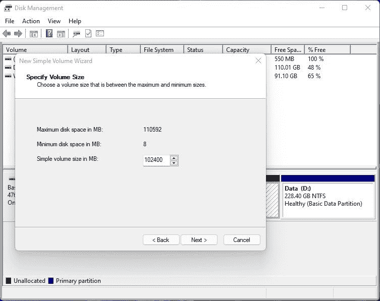

我想创建 100GB 的根分区。将该值乘以 1024 得出以兆字节为单位的值，即 102400MB。计算完尺寸后，点击“下一步”。

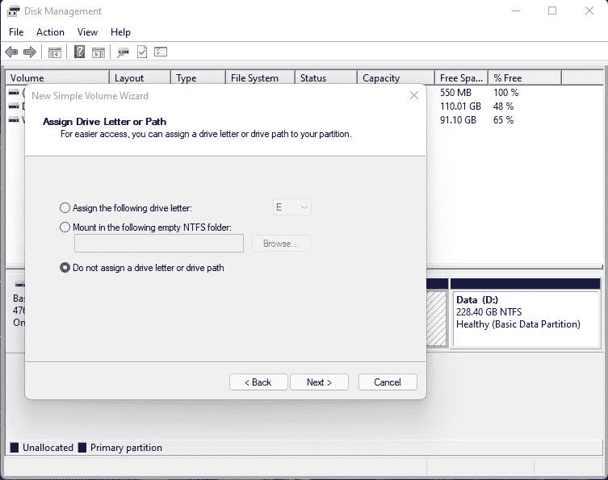

在下一步中，向导将询问您驱动器号。选择“不要分配驱动器号或驱动器路径”，然后点击“下一步”。

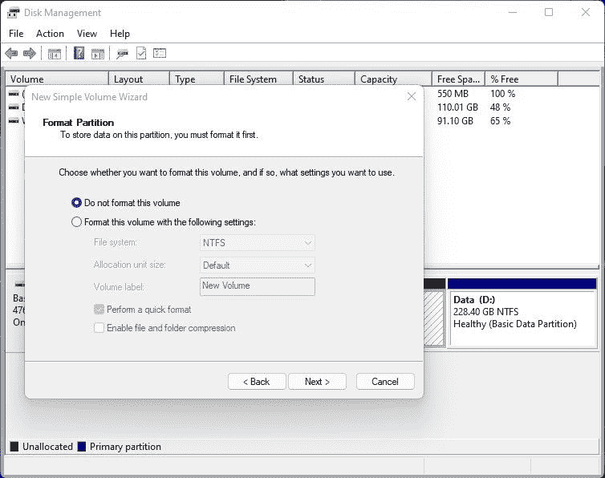

在此步骤中，选择“不格式化该卷”选项，然后单击“下一步”。最后在最后一步点击 finish。按照相同的过程创建您的交换分区。

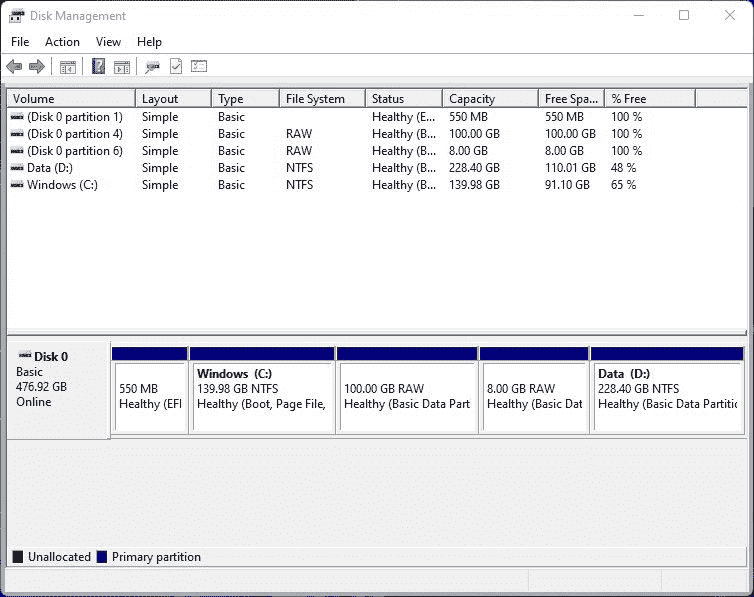

我现在有一个 100GB 的原始分区用于 Linux 根，一个 8GB 的原始分区用于交换。关闭磁盘管理工具，再拿一杯咖啡或茶，或者至少是水，因为我们要深入兔子洞了。

## 如何在安装 Windows 的同时安装 Linux

好了，各位，现在是真的了。我们要去做了。但是首先，你必须弄清楚用哪个键进入你的启动菜单。

在我使用的设备上，按 F2 键会将我带到 UEFI 配置屏幕。从那里，按下 F8 带我到启动菜单。所以确保你已经为你的设备做了调查。

一些教程可能会指导你从你的 UEFI 配置屏幕改变启动顺序，但是我不建议你这么做。包含引导程序的 SSD 或 HDD 应该总是在顶部。

现在连接您在第一部分中放在一边的可引导 USB 设备，并重新启动计算机进入引导菜单。从引导菜单中，选择可引导的 USB 驱动器，然后按回车键。

GNU GRUB 菜单将会出现。选第一个写着“Ubuntu”的。等到文件完整性检查完成，或者你可以点击键盘上的“Ctrl + C”跳过它。

你将会听到一声美妙的铃声，随之，宏伟的 Ubuntu 安装程序将会出现:

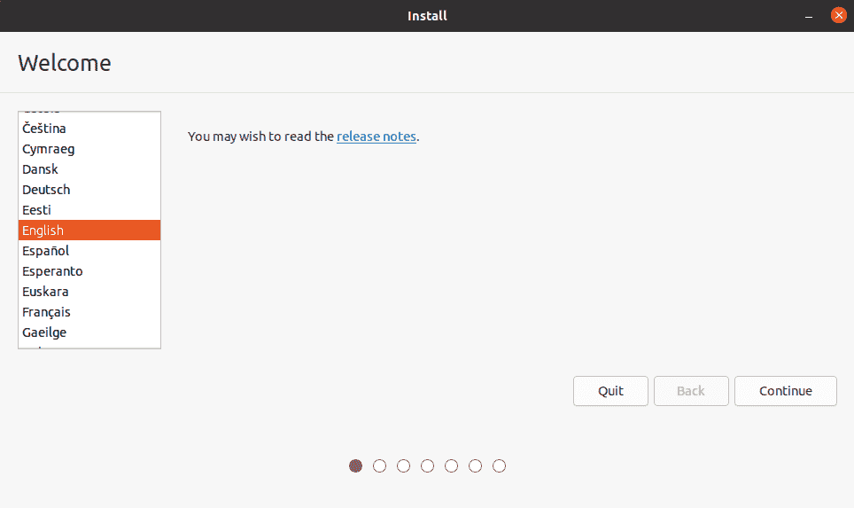

在你点击“继续”按钮之前，我建议你连接到互联网。如果您使用的是以太网电缆，那么您应该已经连接好了。但是，如果您使用的是无线网络，请查看屏幕右上角的 Wifi 图标:

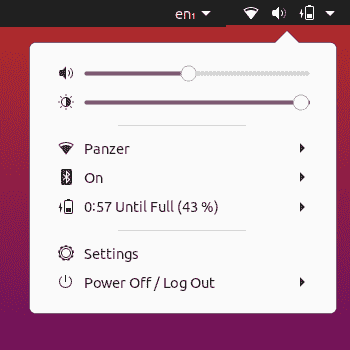

连接后，点击安装程序上的“继续”按钮:

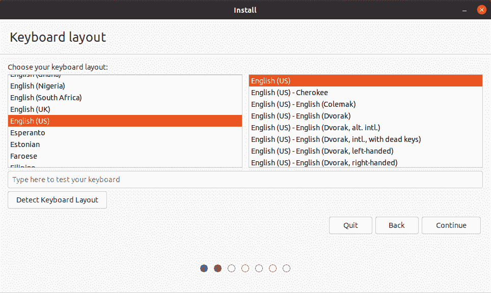

为自己选择正确的键盘布局，然后点击“继续”。

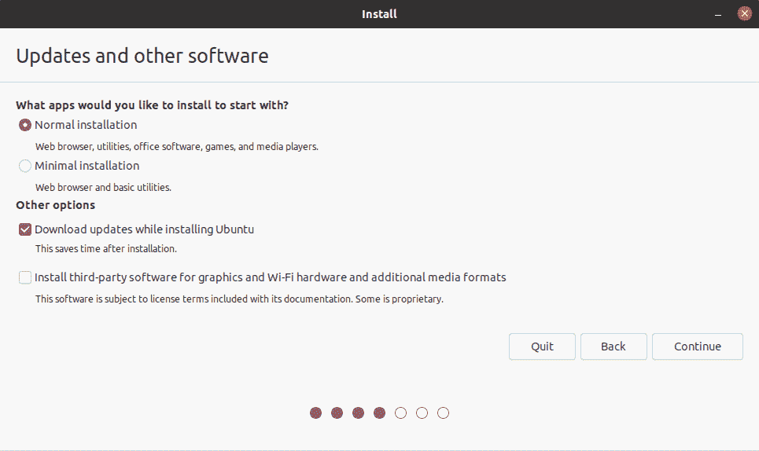

“普通安装”会从一开始就给你一堆有用的软件和游戏，而“最小安装”只会给你基本的东西。

保持选中“安装 Ubuntu 时下载更新”选项。这将在安装过程中从互联网下载更新的软件包文件。

第三种选择需要一些解释。假设你用的是 NVIDIA GPU。当 Ubuntu 检测到该 GPU 时，Ubuntu 将加载被称为“nouveau”的 NVIDIA GPUs 的开源驱动程序。

如果您选中“为图形和 Wi-Fi 硬件以及其他媒体格式安装第三方软件”选项，NVIDIA 将尝试安装 NVIDIA 自己提供的专有驱动程序。它还将为 MPEG 等专有媒体格式安装编解码器。

我正在使用的这个设备有一个 amdgpu，并使用开源的“AMD GPU”驱动程序。考虑到我可以自己安装必要的编码解码器，我将让它保持未选中状态。做你喜欢做的，点击“继续”按钮。

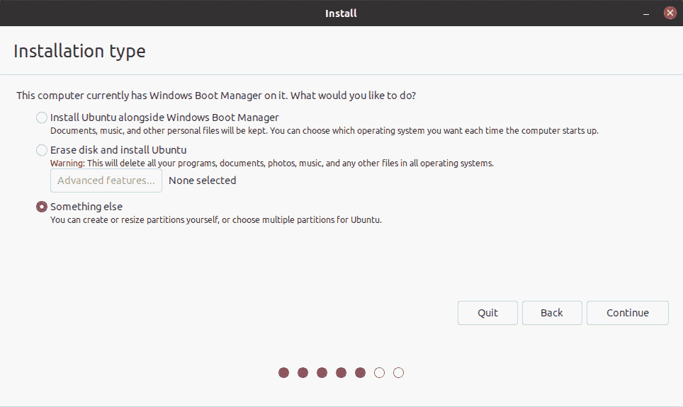

好的，这一步需要注意。Ubuntu 安装程序足够智能，可以检测你的机器上是否安装了其他操作系统。如果是，安装程序会让你选择和他们一起安装 Ubuntu。不要选择那个选项。我重复一遍，**不要选择那个选项**。

选择“其他”并点击“继续”按钮。

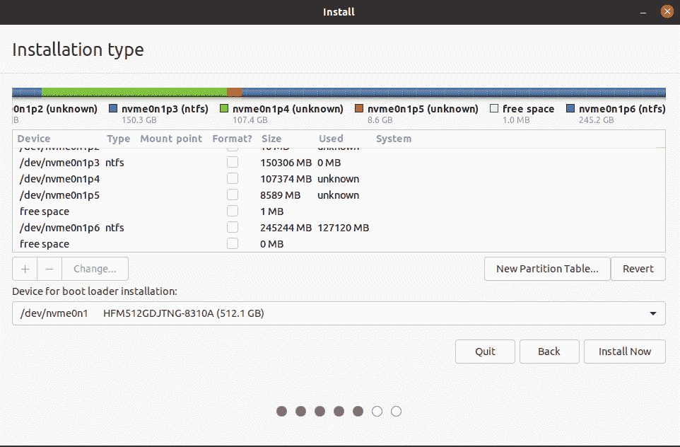

这部分可能有点棘手。这就是为什么我指示您从 Windows 创建分区，而不是保留未分配的空间。如果您让它未被分配，那么确定您应该使用磁盘的哪一部分将会变得更加困难。

在顶部，您可以看到一条多种颜色的线，以及代表哪个分区的图例。找出您从 Windows 创建的两个分区。

在我的机器里，就是“nvme0n1p4”和“nvme0n1p5”。现在从列表中，找到您为根创建的文件(在我的例子中是 nvme0n1p4 ),并双击它:

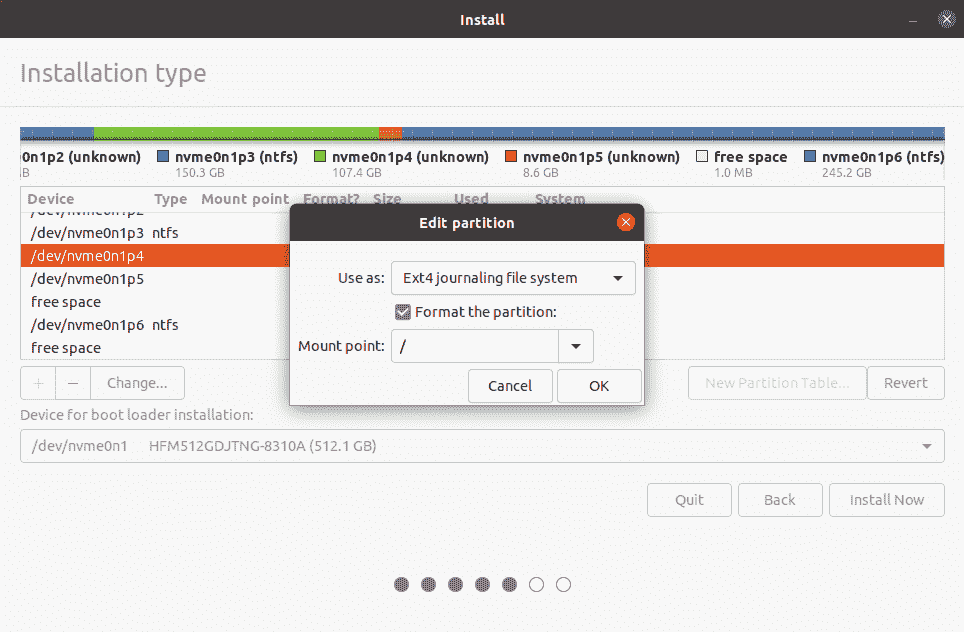

从“用作”下拉列表中选择“Ext4 日志文件系统”,并从“挂载点”下拉列表中选择“/”。根据[Linux 信息项目](http://www.linfo.org/mount_point.html):

> 挂载点是当前可访问的[文件系统](http://www.linfo.org/filesystem.html)中的一个目录(通常为空),在该目录上挂载了一个额外的文件系统(即，逻辑附加)。

点击“确定”按钮。接下来双击您为交换空间创建的分区:

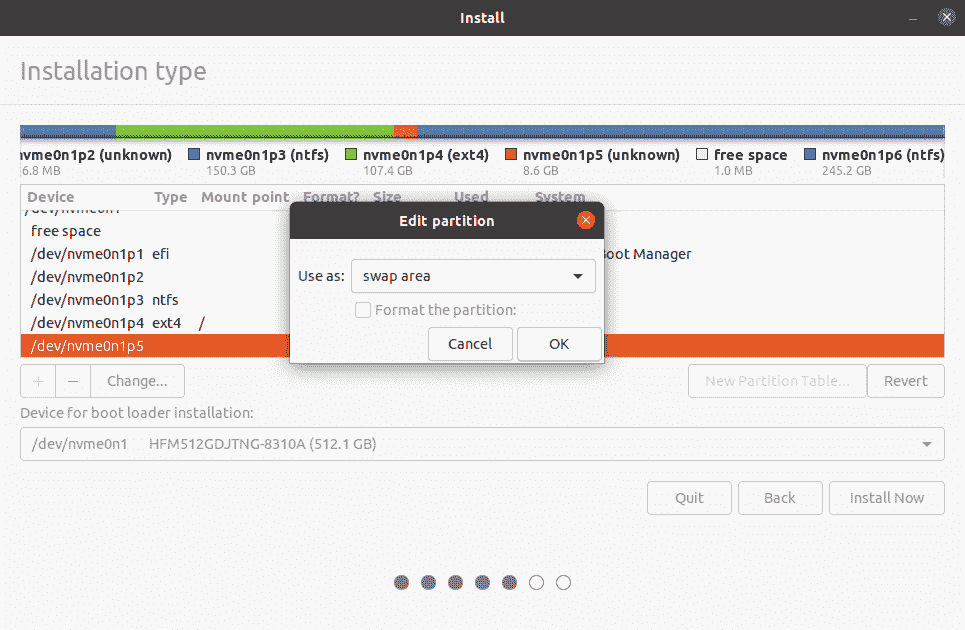

从“用作”下拉菜单中选择“交换区域”,然后点击“确定”按钮。还有一个分区需要配置。那是 EFI 分区。滚动列表，找到 FAT32 分区。

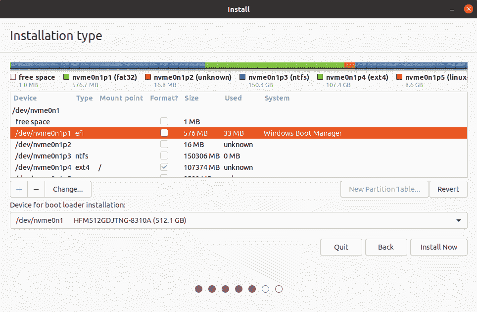

在我的机器上，“nvme0n1p1”是 EFI 分区。双击它:

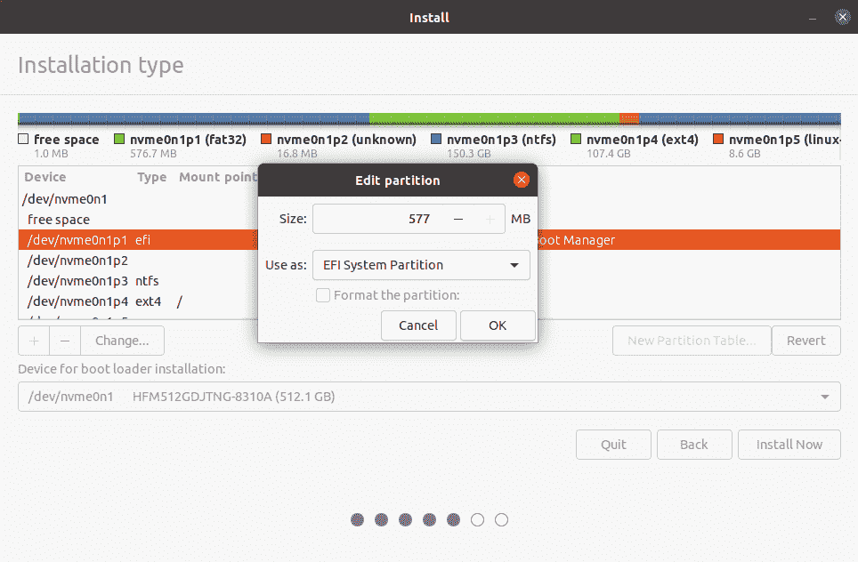

确保从“用作”下拉菜单中选择“EFI 系统分区”。这是包含你的引导程序的分区。请确保您没有格式化该分区。点击“确定”按钮。

此外，EFI 分区的默认挂载点是“/boot/efi”。像 Fedora 这样的发行版会要求您手动编写这个挂载点。因此，请确保您放置了正确的挂载点。

再次检查分区配置，如果一切正常，点击“立即安装”按钮。

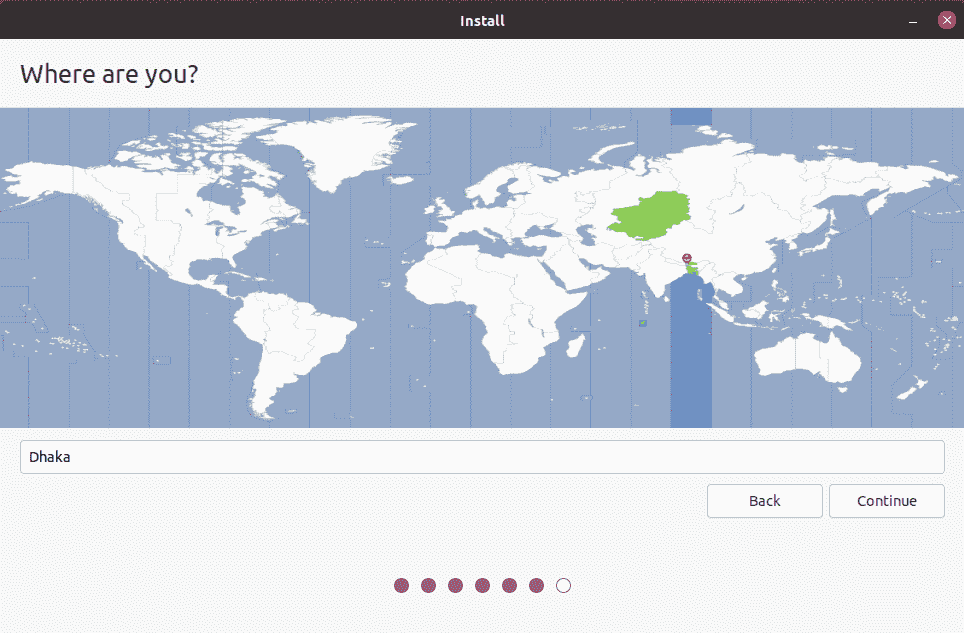

安装程序会询问您的时区。我住在孟加拉国的达卡，所以这是我的选择。点击“继续”按钮。

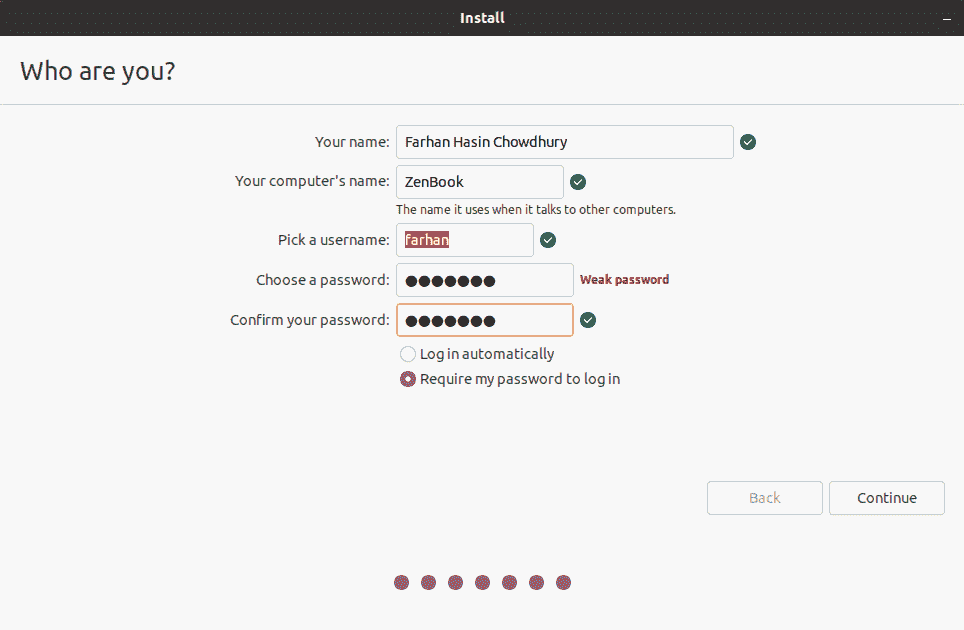

填写您认为合适的所有信息，然后点击“继续”按钮。

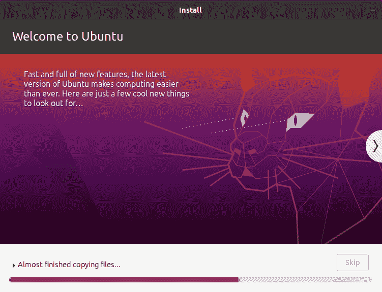

安装过程应该不会花很长时间。当我还是个孩子的时候，我喜欢看这个幻灯片。

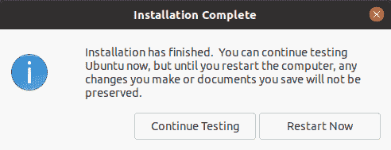

安装完成后，您可以继续测试或重启。如果你选择重启，Ubuntu 会指示你断开 u 盘，然后回车。

机器将重新启动，GRUB 菜单将再次出现。看看这个列表，你会在菜单上看到 Ubuntu 和 Windows Boot Manager。启动 Ubuntu，因为你还有最后一件事要做。

## 如何在 Windows 和 Linux 之间同步时间

这是双引导系统用户面临的常见问题之一。当你启动进入 Windows，然后启动进入 Linux，你会发现 Linux 的时钟全乱了。如果你先引导到 Linux，然后再引导到 Windows，也会发生同样的事情。

我来解释一下为什么会这样。你的电脑(或者说世界上的每一台电脑)都有两个时钟。一个是位于操作系统中的系统时钟，另一个是位于主板中的硬件时钟，即使在计算机不运行时也能跟踪时间。

问题是，Windows 假设您的硬件时钟以您的本地时间运行，而 Linux 假设您的硬件时钟以 UTC 时间运行，并根据您的位置应用一个偏移量。

解决这个问题最简单的方法是让您的 Linux 发行版像 Windows 一样使用本地时间。为此，在 Linux 终端中执行以下命令:

```
timedatectl set-local-rtc 1 --adjust-system-clock
```

现在重启你的电脑进入 Windows，同步系统时钟，回到 Linux。现在时间不应该乱。

## 如何从双引导系统中删除 Linux

比方说，由于某种原因，你不喜欢你在 Linux 上的时光，想摆脱它。这很可悲，但生活很艰难，不是吗？

从双引导系统中删除 Linux 需要两个步骤:

1.  摆脱 GRUB 引导程序
2.  摆脱 Linux 分区

要摆脱 GRUB 引导装载程序，您必须从 EFI 分区中删除相应的文件。问题是默认情况下分区是隐藏的。

要使其可访问，您必须使用`diskpart`程序。它是一个类似磁盘管理工具的磁盘管理工具，但它是一个命令行界面。

引导进入 Windows。从“开始”菜单，以管理员身份打开命令提示符。为此，只需在开始菜单中搜索“cmd ”,当命令提示符出现时，按下“Ctrl + Shift + Enter”组合键。

现在在命令提示窗口中写下`diskpart`并按回车键启动程序。

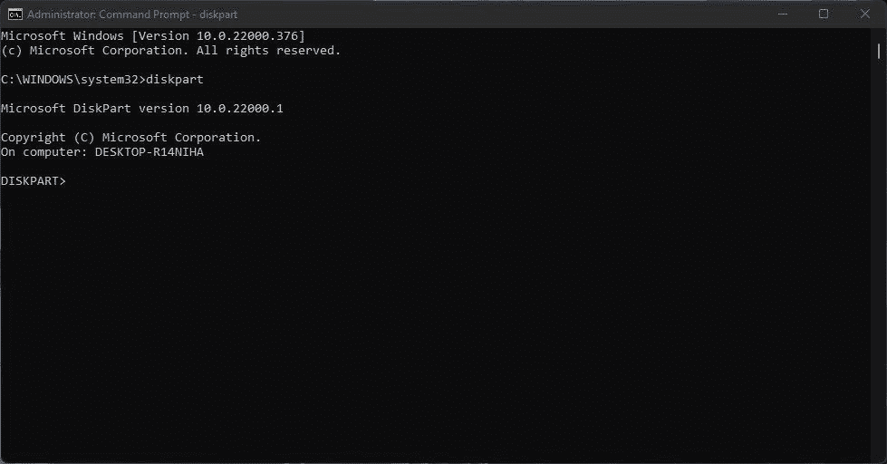

接下来，编写`list disk`并按 enter 键以获得所有已连接磁盘的列表:

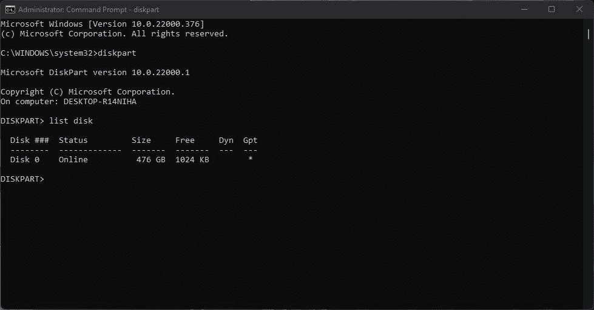

该设备只有一个物理磁盘，但您可能有多个。写入`sel disk <disk number>`选择所需的磁盘。

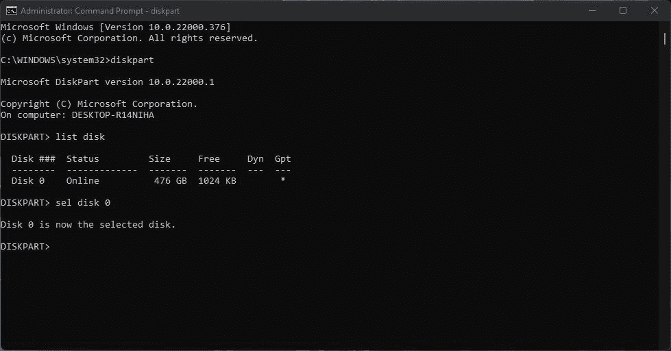

然后写`list vol`按回车键列出这个磁盘的所有分区。

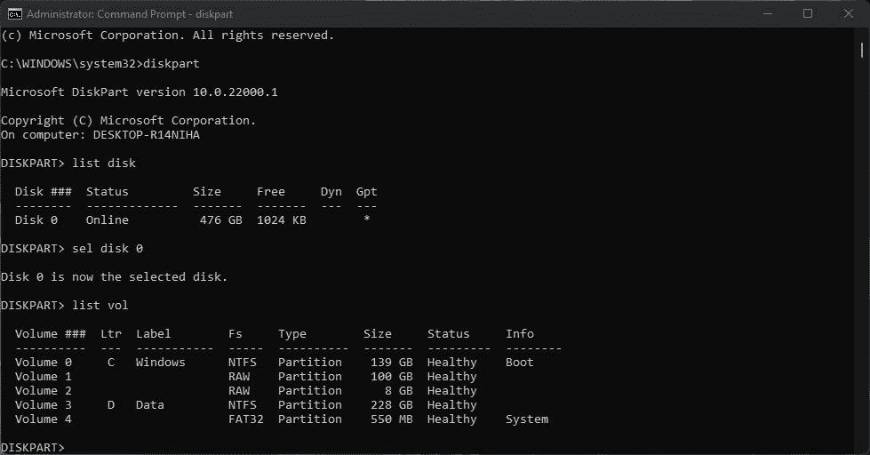

从大小和格式来看，我可以说第 4 卷是 EFI 分区。请记住，这个分区在您的系统上可以小得多，但它始终是一个 FAT32 分区。书写`sel vol <volume number>`选择所需的音量。

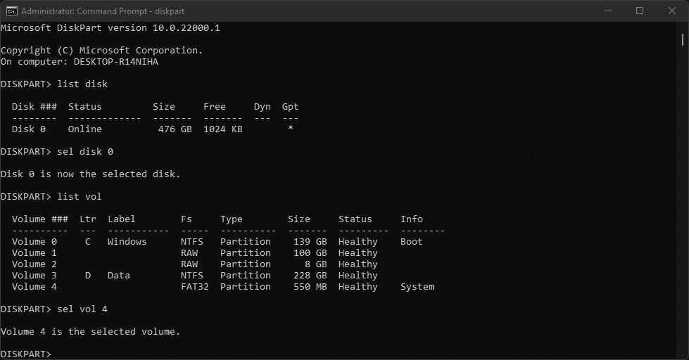

最后写下`assign letter x`并按回车键将字母`x`分配给这个分区。

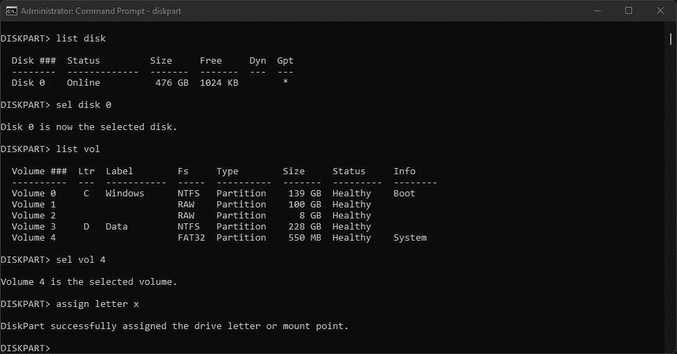

通过书写`exit`并点击回车退出`diskpart`:

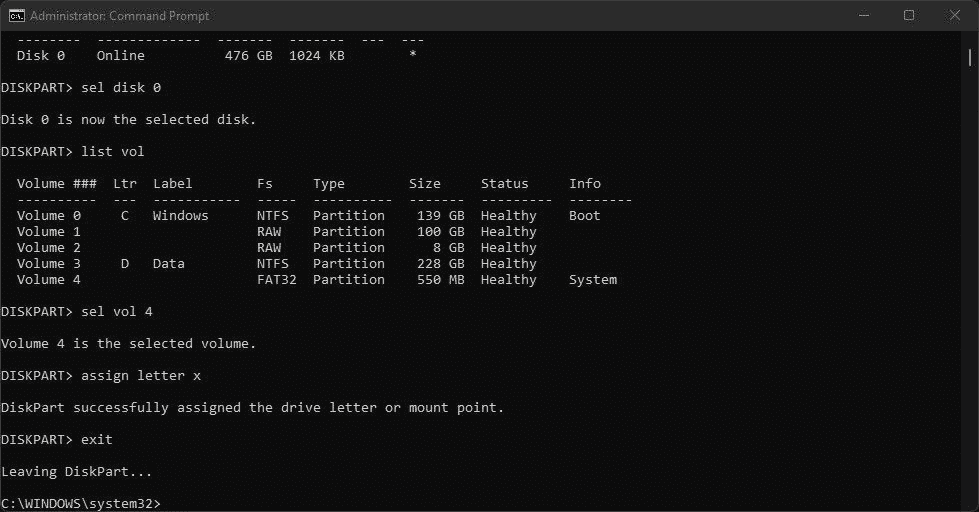

现在分区已经可以访问了。在同一个命令提示符窗口中，通过编写`x:`并按 enter 键进入 EFI 分区。

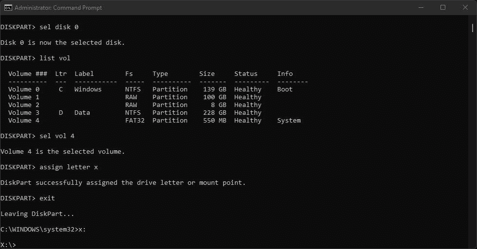

要获得那里所有文件夹的列表，写下`dir`并按回车键。

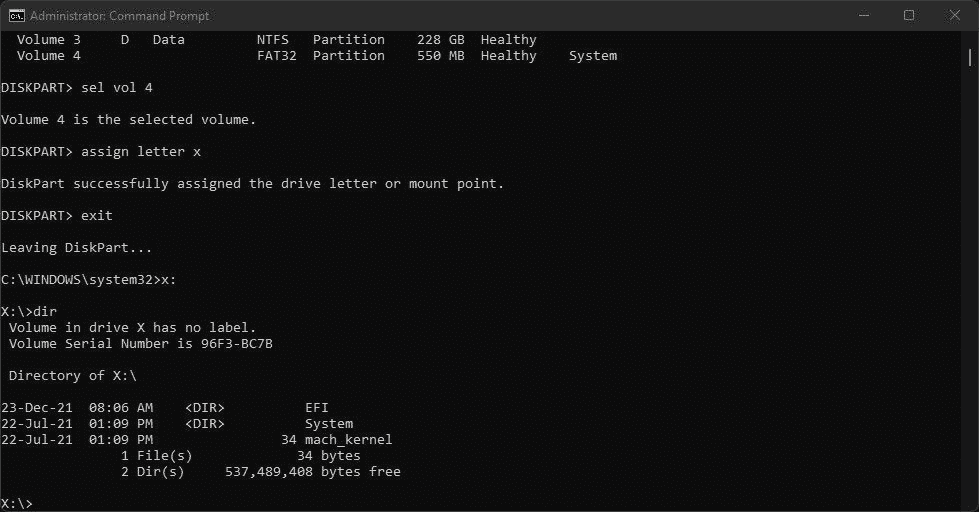

现在编写`cd EFI`进入 EFI 文件夹，再次编写`dir`列出内容。

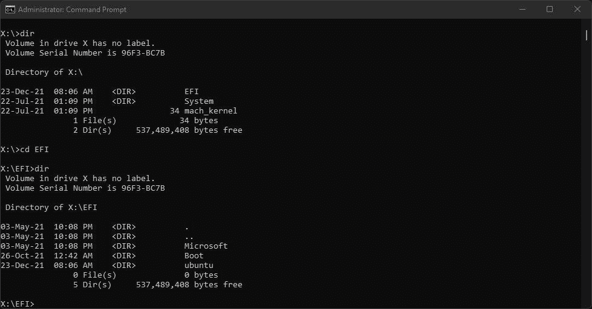

你必须扔掉那个文件夹。为此，编写`rmdir /s ubuntu`并按回车键。命令提示符将询问您是否确定。写下`Y`并点击回车确认。然后最后一次用`dir`确定没了。

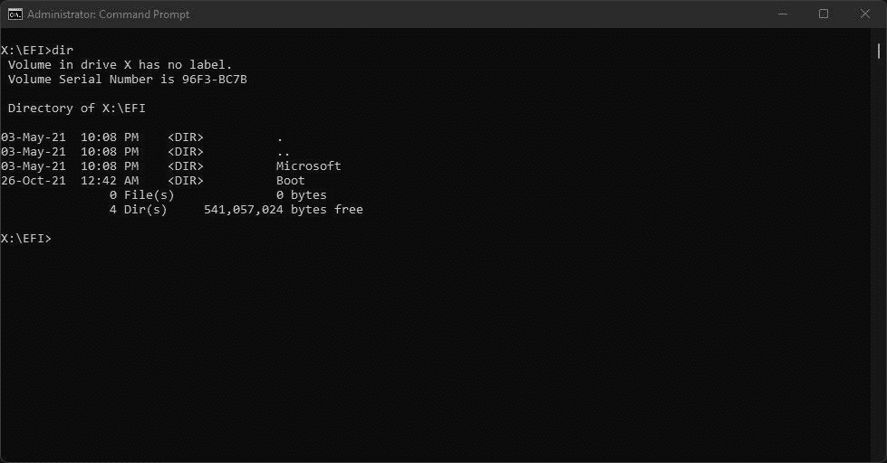

就是这样。接下来，像之前一样再次打开磁盘管理，从底部右键单击面向 Linux 的分区，并从列表中选择“删除卷”。

删除分区后，您可以使用未分配的空间创建一个新的分区，或者扩展其左侧的分区以溶解未分配的空间。

最后重启你的电脑，检查 Ubuntu 是否已经离开你的电脑。

## 其他 Linux 发行版呢？

本文中学习的技术适用于任何 Linux 发行版。

因此，无论何时双引导系统，都要确保

*   安全启动被禁用
*   快速启动被禁用

并且在安装期间

*   不要选择任何引导/自动安装类型
*   确保不要格式化 EFI/ESP 分区
*   确保正确安装分区

只要你坚持这几条规则，你就应该没问题。

请记住，在极少数情况下，发行版可能不使用 GRUB 作为引导加载程序。

就拿很流行的“ [Pop！_OS](https://pop.system76.com/) 为例。它使用“systemd-boot”作为默认的引导加载程序。因此，你必须在启动时一直按空格键(或者键盘上的任何按钮)，否则启动菜单不会显示，你会启动到 Pop！_OS 直接。

我看到的另一件事是:一些主板，如我的 MSI B450 Tomahawk Max，默认选择 Windows 启动管理器，即使我安装了 Linux。如果你看到这样的东西，进入你的 UEFI 配置界面，寻找相关的选项。

## 结论

我衷心感谢您花时间阅读这篇文章。

我也有一个个人博客，在那里我写一些随机的技术东西，所以如果你对类似的东西感兴趣，请查看 https://farhan.dev 。如果你有任何问题或对任何事情感到困惑——或者只是想联系——我可以在 [Twitter](https://twitter.com/frhnhsin) 和 [LinkedIn](https://www.linkedin.com/in/farhanhasin/) 上找到我。