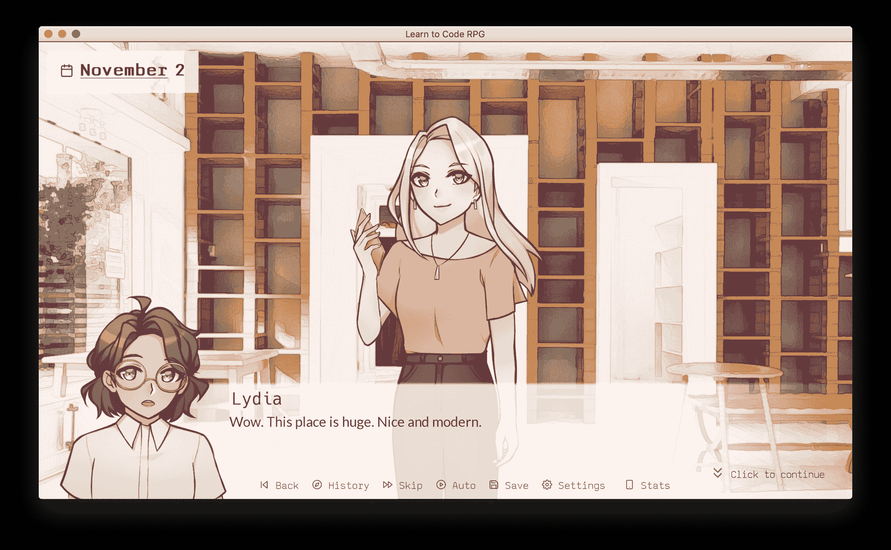
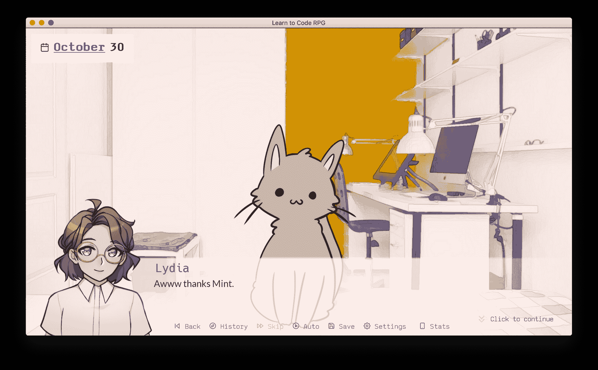
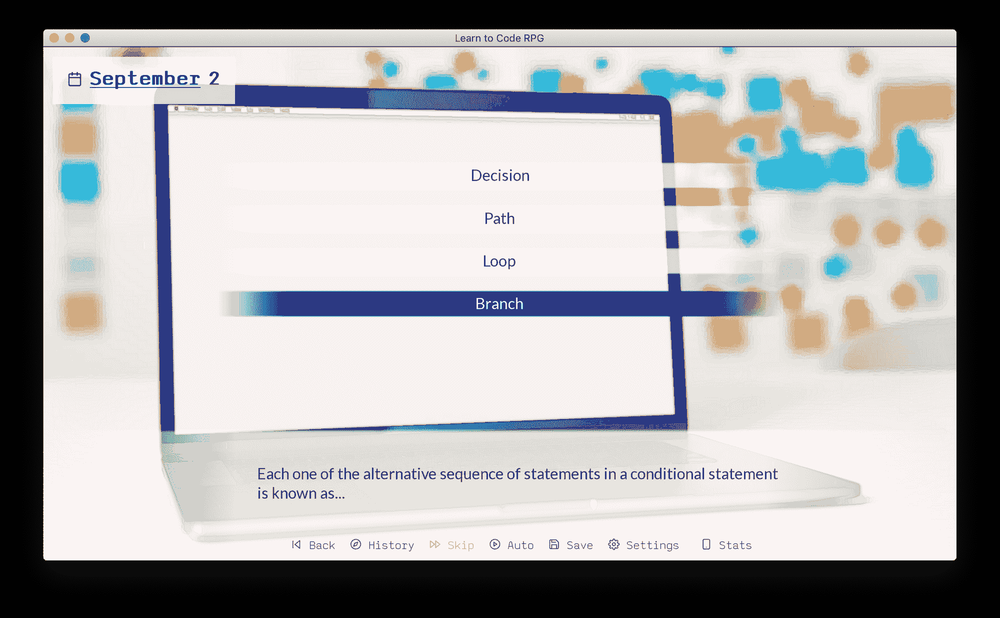
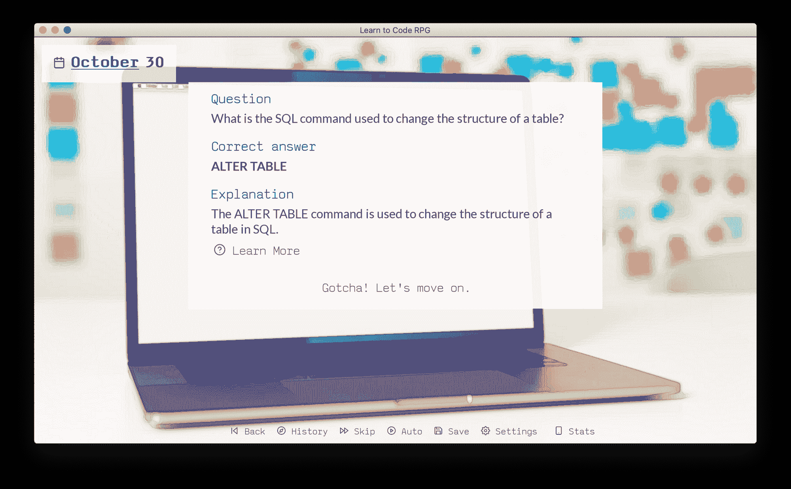
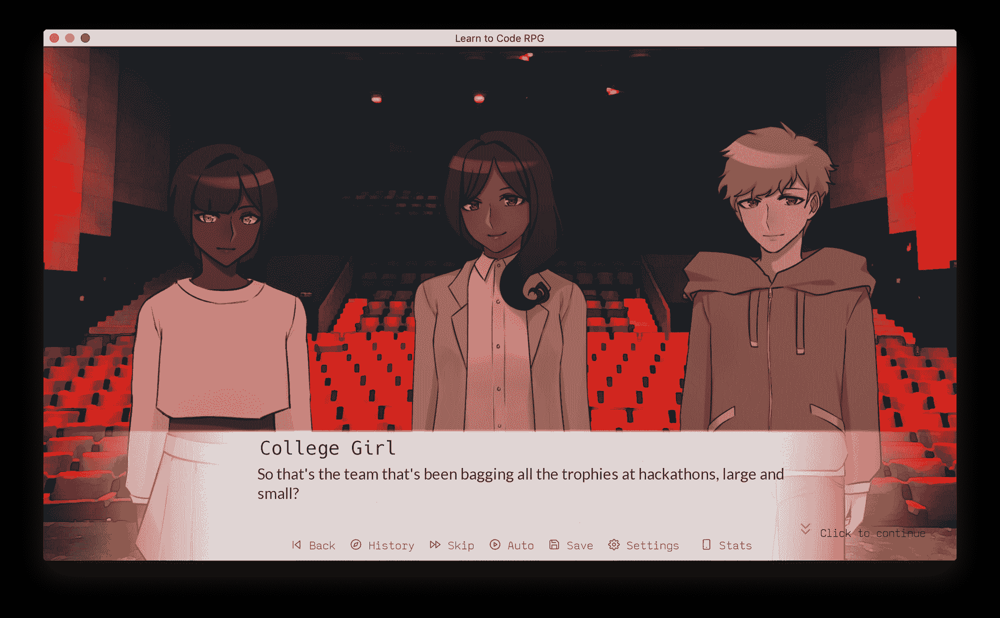
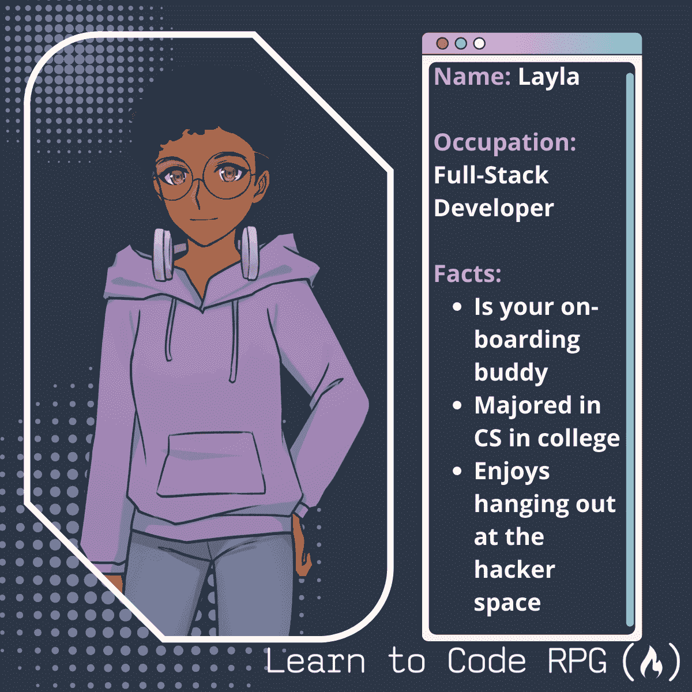
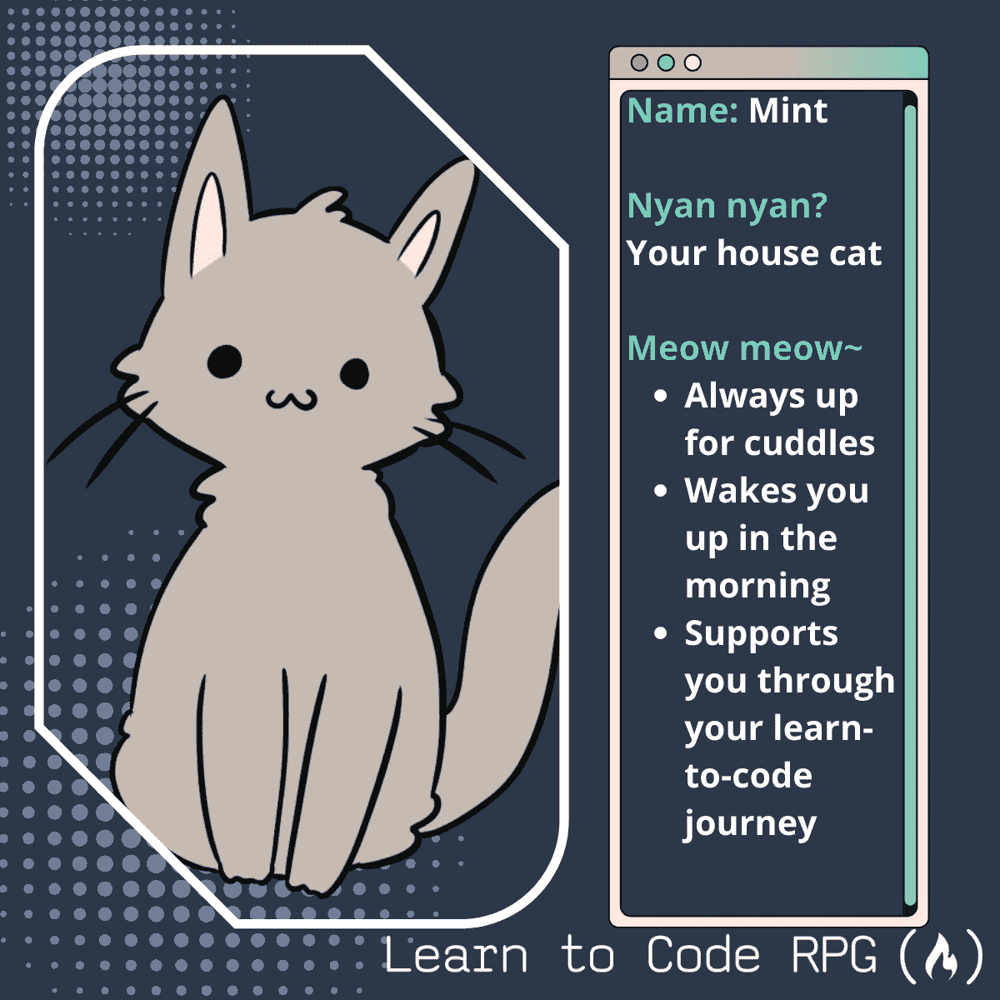

# 学习 RPG 编码–新闻包

> 原文：<https://www.freecodecamp.org/news/learn-to-code-rpg-press-kit/>

这是游戏**学习编码 RPG** 的新闻包。

## 情况说明书

### 开发者

freeCodeCamp.org，一个 501(c)(3)非盈利组织

### 平台

Windows/Mac/Linux

### 仅在...有效

[itch.io](https://freecodecamp.itch.io/learn-to-code-rpg)

### 价格

自由的

### 源代码

[GitHub]( https://github.com/freeCodeCamp/LearnToCodeRPG)

### 出厂日期

2021 年 12 月 22

### 开发商联系人

昆西·拉森，[quincy@freecodecamp.org](mailto:quincy@freecodecamp.org)

琳恩一怔，[的](mailto:lynn@freecodecamp.org)

## 描述

**学习编码 RPG** 是一个互动的视觉小说游戏，在这里你将自学编码，结交科技行业的朋友，并追求你成为开发人员的梦想。🎯

在这个游戏中，你的选择塑造并推动故事向前发展:你每天会做什么？学编码？做咖啡师？访问黑客空间？或者放松，在公园里放松，或者抱着小猫玩游戏？

你会坚持你的梦想——在科技行业找一份工作——更重要的是，保住这份工作吗？选择权在你手中。

## 特征

*   超过 2 小时的游戏时间🎮
*   原创艺术和音乐🎨
*   600 多个 CS 测验问题📚
*   你可以在推特上谈论 50 多个复活节彩蛋🚀
*   6 种不同的结局👀
*   友好的角色和可爱的猫🐱
*   迷你游戏！👾

## 开发日志文章

[https://www.freecodecamp.org/news/learn-to-code-rpg/](https://www.freecodecamp.org/news/learn-to-code-rpg/)

## 截屏

Learn to Code RPG Splash art

Learn to Code RPG Game Menu

Hanging out at the Hacker Space with your best friend Annika

Chill at home with your cat Mint

Take CS quizzes

Quiz question explanation screen

NPCs

Rhythm Minigame

## 录像

### 拖车

[https://www.youtube.com/embed/vLK4fOeiIEk?feature=oembed](https://www.youtube.com/embed/vLK4fOeiIEk?feature=oembed)

### 让我们来玩吧！

[https://www.youtube.com/embed/b_IDdQzPRR4?feature=oembed](https://www.youtube.com/embed/b_IDdQzPRR4?feature=oembed)

## 标志；徽标

## 字符卡

