# 13 个自由开发者作品集来启发你

> 原文：<https://www.freecodecamp.org/news/13-awesome-freelance-developer-portfolios/>

所以，你正在考虑作为一名自由网络开发者建立你的投资组合网站。

或者，你可能希望创造一个在线空间，让潜在的雇主可以感受到你是谁以及你过去做过什么。

无论哪种方式，你的作品集网站都是展示你过去作品的绝佳场所，也为潜在客户或雇主提供了联系你的便捷方式。即使你没有过去的工作，一个好的投资组合也能帮你获得第一个客户。

我们将看看你的作品集网站应该包含哪些标准功能，以传达清晰的信息。在我们了解了基础知识之后，我们将会深入了解一些鼓舞人心的，美丽的，以及一些令人惊叹的自由职业者的作品集。

## 在你的作品集网站上包含一个“关于我”的页面

一个投资组合网站，以及一般意义上的商业网站登录页面，是现代的名片。带来能让潜在客户和雇主留下来进一步了解你的信息，并希望与你合作，这一点至关重要。

也就是说，在你的网站上包含一个“关于”部分被认为是一个好的做法。在这一部分，给出一个关于你自己、你的经历、也许还有你的方法的最重要(相关)信息的修订版。

当然，可以有变异，但最重要的是，尽量找出你独特的卖点和验证者(过去的工作和/或技能)，并尽可能清晰地指出来。我们将在下面的一些励志作品集中看到，你可以在保持主要信息清晰的同时发挥创意。

## 展示你的投资组合过去的工作证明

你的作品集网站服务于一个主要目的:展示可信度，并在访问者心中建立信任。有一种确定的方法可以做到这一点，那就是清晰地展示以前的项目或工作。如果你的理想访客不精通技术，只是想看看以前工作的证明和质量，这就变得更加相关和重要。这是一个展示一系列工作的好地方，展示你的能力以及你能够适应不同项目范围的需要。

请记住，清晰在这里很重要。展示一个样本项目的截图是不够的，尤其是如果你没有大量的经验。你可以做的是描述每个项目的过程:用这个空间来交流你的想法，解释你做出的某些设计或技术选择。如果做得好，一个潜在的客户或雇主可以理解你是如何以及为什么做这些事情，这将会给他们一个关于你和你工作方式的更好的印象。

## 将评价添加到您的投资组合网站

如果你有的话，添加证明可能是为你的工作提供社会证明的最好方式。这些可以是从过去的客户和同事那里引用的。如果你和品牌打过交道，包括他们的名字和标志。展示过去的客户和雇主对你的体验的感受可以安抚焦虑的访问者的神经，并巩固你试图在你的投资组合网站上留下的值得信赖的印象。

## 包括您的联系信息

这似乎是显而易见的，但是许多作品集网站让找到最重要的联系信息变得更加困难。在网站上一个容易找到的地方留下你的电子邮件地址、社交媒体链接或联系方式。

你需要让访问者与你的网站互动的整个体验尽可能的简单，包括当他们决定要联系你时要遵循的流程。

## 激励你的 10 个了不起的自由职业组合

### 斯特夫·伊万诺夫

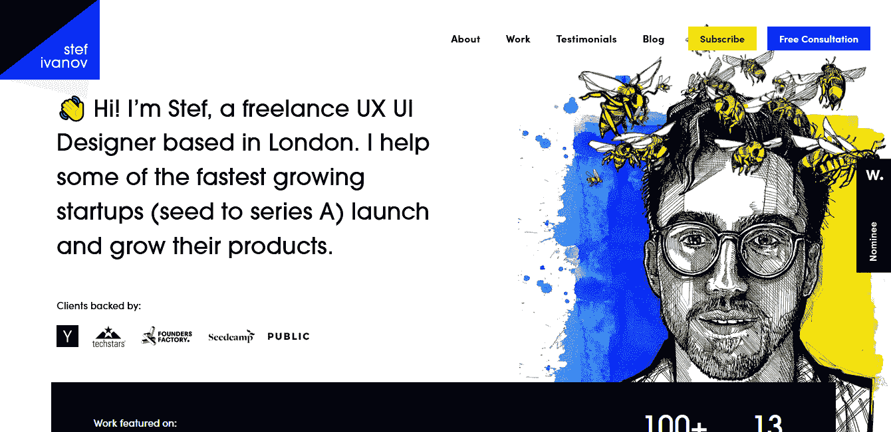

自由职业者 UX 和用户界面设计师 Stef Ivanov 在 13 年的职业生涯中为 100 多家公司工作过，在他的作品集里有很多他的作品。

然而，这并不是我把他列入这个名单的原因。这里只包括最有经验的自由职业者是没有意义的。这其中的灵感在哪里？相反，他被列入了引人注目的登陆页面。

它有一个简单的介绍性文本块，这对于一般的网站来说是相当标准的。Stef 的登陆页面是一幅漂亮的交叉阴影钢笔画肖像，上面有蜜蜂在他头上嗡嗡作响的动画光环。他不仅抓住了我们上面提到的基本要素，还增加了一点额外的接触，展示了他的创造性个性，激起了游客的兴趣。

### 艾丽卡·森福特·米勒

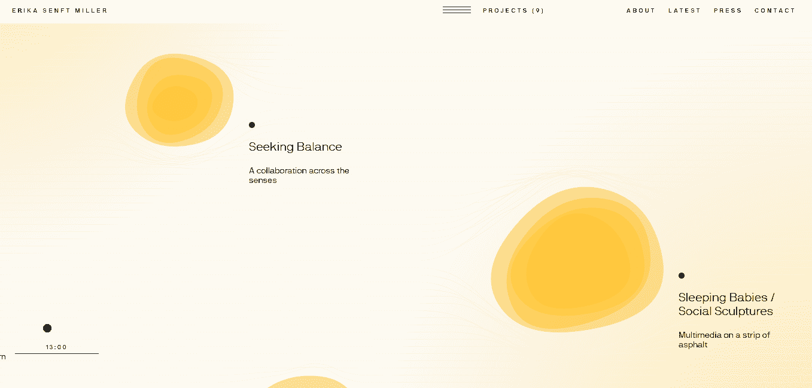

当你访问 [Erika 的网站](https://www.erikasenftmiller.com/)时，你会看到一个非常简约的加载屏幕。

当页面满载时，最不寻常的事情发生了。你必须访问 Erika 的网站来获得真正的感觉，但让我们给一个冗长的描述去，好吗？她的网站呈现为一个有线条的页面，你可以用鼠标拖动来移动。当您移动屏幕上的指针时，您会注意到组成页面的线条会围绕指针移动和弯曲。当你看到一个投资组合项目时——表现为一个缓慢变形的多层 2D 球体，当你将鼠标放在它上面时，它本身就会膨胀——项目周围的线条也会弯曲。一旦你点击其中一个变形、移动的球体，项目信息就会向外展开。有趣的概念还在继续。你不是向下或横向滚动，而是沿着一条你认为合适的曲折路径前进。这种展示方式极具创意，但它的亮点在于能够以独特的互动方式吸引游客。Erika 展示了一种探索其作品的迷人方式。

### 杰西卡·海恩斯

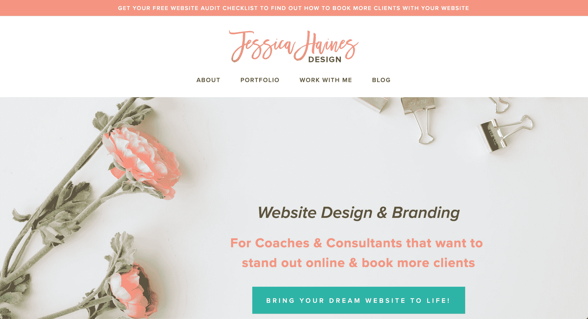

杰西卡有一个很棒的[投资组合网站](https://jessicahainesdesign.com/)！

它的设计考虑到了转换，它是经过深思熟虑的，颜色很棒，它是利基下来-它只是一流的。

她的网站最吸引我的一点是，她清楚地展示了她的专业知识。

为你的作品集网站做笔记。我和自由职业学生聊天的时候总是用她的例子。

### 瑞文戴尔山

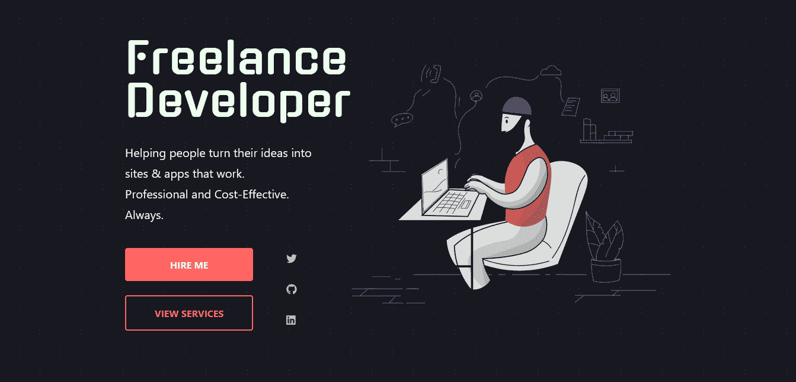

清晰是雷伊投资组合的关键。

雷伊似乎选择了一种不太有创意的方法，更喜欢真正抓住高质量投资组合网站的基础。

在登录页面上，您会看到一些介绍文本和一个开发人员坐在笔记本电脑前的插图。这个登录页面做得很好的一点是提供了一个清晰的描述，准确地描述了他做了什么，并提供了我们之前谈到的关键信息。如果你想通过表格或社交媒体联系他，你不需要再滚动了，他会把访问者引导到一个部分，在那里他们可以看到关于他提供的服务的详细说明。雷伊显然设计了他的网站文案，以一种更加个性化的方式与网站访问者建立信任。几乎没有吸引不太懂技术的访问者的技术术语，但他仍然为潜在雇主提供他的技术技能。雷伊更进了一步，他用“承诺”、“你会受益的方式”和“常见问题”来吸引潜在客户和雇主。

### 亚当·布鲁克斯

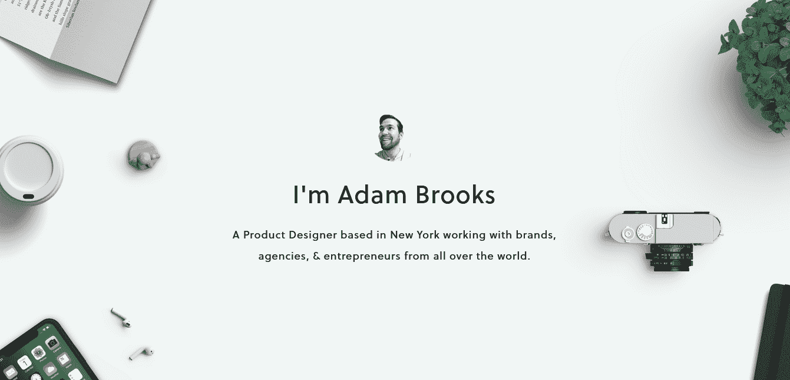

简洁的设计和大量的空白给亚当的网站带来了现代感，这将吸引大多数人。

登陆页面包括一张亚当的笑脸，这立刻给网站增添了一些个性。他对自己所做的事情很清楚，并声明自己曾与世界各地的品牌合作过，这立刻增加了他的可信度。

在温和地介绍了他的工作后，向下滚动页面会显示一个两句话的服务介绍和联系链接。这可能是所有的一些游客正在寻找，特别是如果他们已经从其他地方介绍了亚当的服务。他做得很好，在自己的网站上加入了一种可以尽早联系到他的方式。对于那些不太理解这两句话的人来说，他进一步解释了他的服务——对更多的外行人来说尤其有用。

在这一部分之后，我们会看到一些样品作品，比如设备模型，由于大量的空白，它们以一种易于呼吸的方式呈现，并且最小化，给人一种专业的感觉。这个网站给人的印象是可信的、专业的，并且，由于网站底部的署名，是平易近人的。

### 杰夫大厦

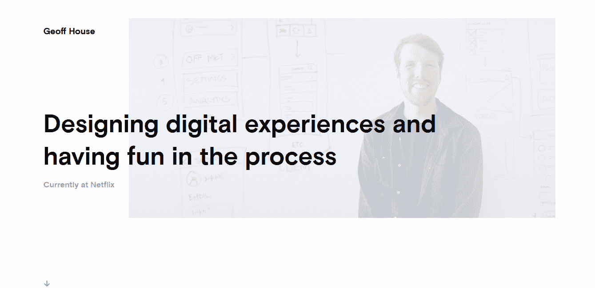

Geoff 绝对不会浪费时间向潜在客户和雇主保证他能完成工作——他几乎立刻就展示了过去的工作！

你会见到一个关于他做什么和他目前在哪里工作的清晰的俏皮话。

向下滚动显示杰夫过去参与的几个项目。点击这些项目中的一个就是这个投资组合网站擅长的地方。您将找到一个项目案例研究，其中他提供了对项目的简要描述，并详述了他在项目中的角色和团队。这种展示过去作品的方式在参观者的心目中创造了奇迹。
它提供了关于项目基本原理的信息，对项目目的的深入探究，以及对他的沟通风格有所了解的机会。

### 珍妮·莱克南

我喜欢珍妮的网站，因为它简单而有效。

她有一个很棒的标题、很棒的图片、推荐、清晰的行动号召，而且她[定位](https://studywebdevelopment.com/niche.html)。

太多的自由职业者过分热衷于动画和绒毛——Jennie 的作品集是一个很好的例子，它保持简单，并且不忽视核心焦点:获得更多的客户。

### 浸信会教徒

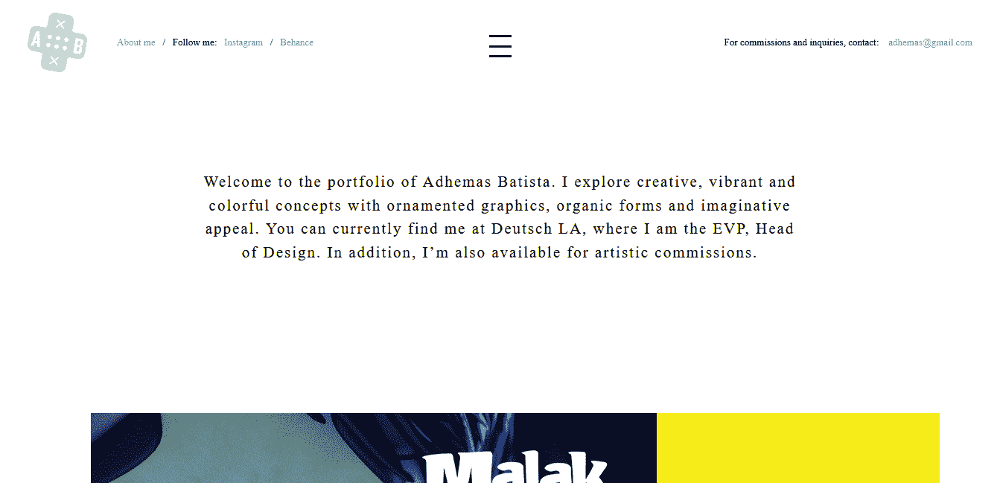

Adhemas 参与了大量印象深刻的项目，但这并不是我最喜欢他的投资组合网站的地方。

他成功地将一个伟大投资组合的所有基本面都包含在一个视图中，并留有大量空白。

他的设计极简却非常巧妙。在顶部，您可以找到社交媒体联系信息和电子邮件地址。在顶部中间，你可以读到阿德马斯做什么，他目前的工作和位置，以及他的可用性。在登陆页面下方一点的地方，他之前作品的展示从具有动画悬停效果的大型多色图像开始。点击其中一个过去的项目，你会进入一个长长的案例研究页面，这个页面充满了大量的空白。他详细介绍了这些项目“案例研究”,让你对项目及其目的有一个真实的感受。Adhemas 的 portfolio 站点是一个极好的例子，它展示了如何在一个视图中使用大量的空白，同时仍然包含大量有用的信息。

### flaffy

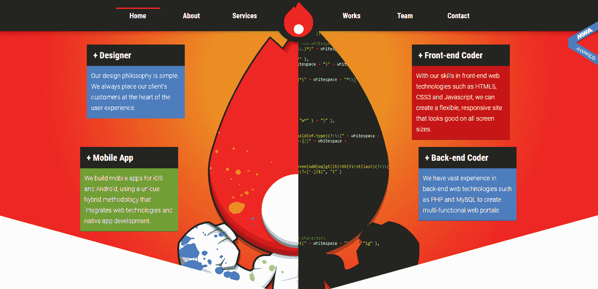

全屏加载闪屏让位于 [Flamy 的](http://fla.my/)非传统但引人注目的组合设计。

干净的极简主义不是游戏的名字，强烈的卡通主题是首选。Flamy 的网站向人们展示了，在不放弃专业魅力的情况下，你也可以变得古怪有趣。

当你到达登陆页面时，你会看到只能被描述为一个头上长着火焰的男人和描述 Flamy 提供的服务的卡片。网站的其余部分看到巧妙的视差效果被用来给网站添加互动元素。这个网站无疑是有趣的，尽管并不适合所有人。话虽如此，他们确实把握住了基本原则，所有的古怪之处都是以不牺牲 UX 或产品清晰度的方式实现的。如果没有别的，这个网站会在访问者的脑海中留下持久的印象，有时这就是让访问者回到你的网站并联系你所需要做的一切。

### 艾沃·米滕

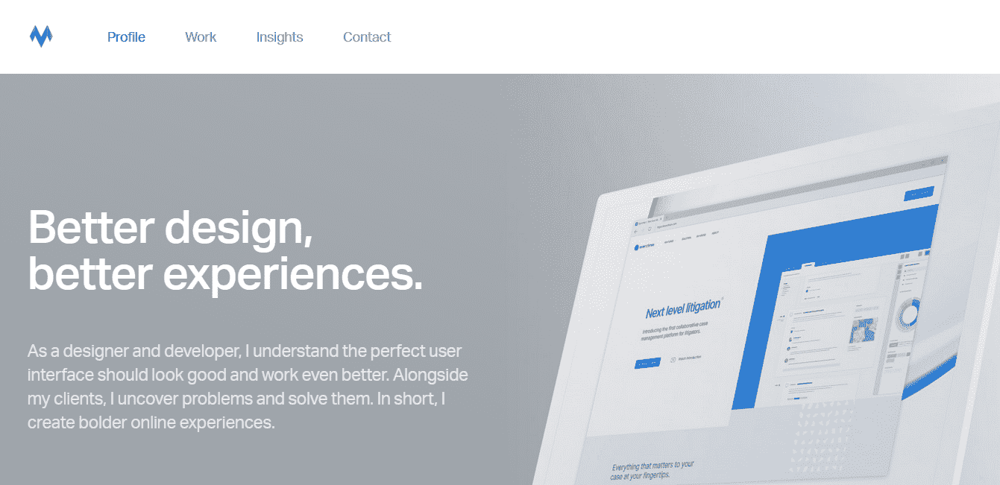

Ivo 的网站是一个近乎斯堪的纳维亚风格的极简主义网站。

它很干净，使用了大量的空白和大而清晰的标题，并获得了所有其他设计的基本权利，如漂亮的视觉层次和匹配良好的文本不透明度。

他的登陆页面包括一个清晰的路径来查看过去的项目，其中包括冗长的项目描述，以及一个直观的联系按钮。平滑的页面过渡完善了一个完美的作品集网站。Ivo 已经考虑到了潜在客户和雇主可能有兴趣看到或发现的一切。

如果你想看看一个完美的作品集网站是什么样子，没有不必要的花里胡哨，这就是了。

### 莎拉米夏琐

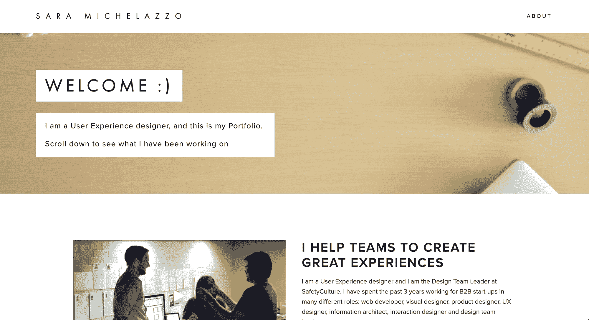

如果你喜欢极简主义网站，Sara 的作品集是一个很好的例子。

她回答了她是做什么的，她是谁，只要浏览一下她的网站就知道了。

我唯一的批评是没有联系形式，但除此之外，这是一个干净的极简主义的例子。

### 乔丹·弗莱格

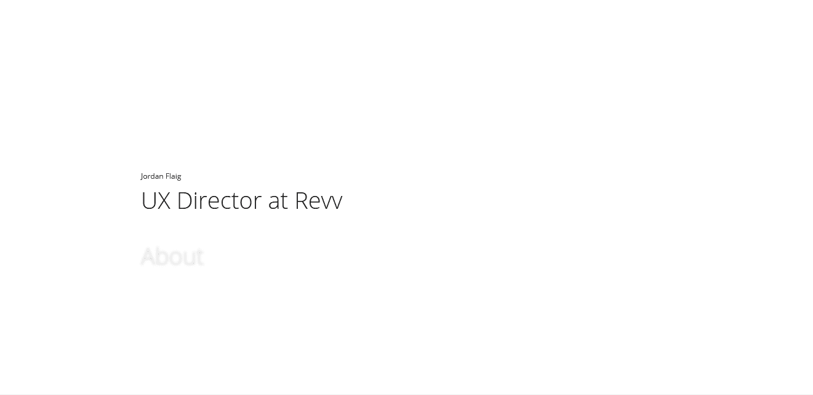

这是你将会看到的[最小网站](https://www.jordanflaig.com/)的一个最小描述。

它回答了所有重要的网站访问者的问题，除了一个缺失的关键问题——“我如何联系你，乔丹？”

在你独特的网站上添加一个联系人部分，你将拥有一张完美的极简现代名片。

### 鲁宾·凯普斯

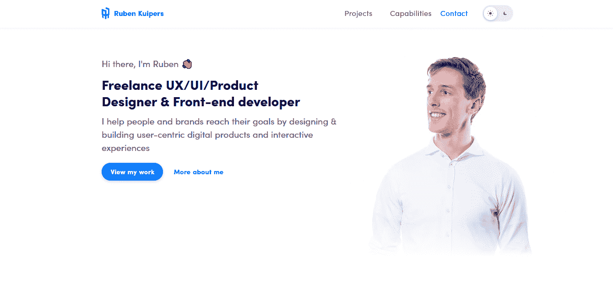

鲁本的作品集网站的风格可能是许多开发者都熟悉的。它甚至以“你好，我是鲁本”开始！

作为一名开发者，你将能够欣赏那些让我们快乐的小附加物，比如黑暗模式(和相应的黑暗模式轮廓图像)的拨动开关，微妙的动画，以及“技能&工具”的一个部分。你可能没有注意到这些额外的东西是如何补充一个已经辉煌的网站的。
当你登陆鲁本的页面时，你立刻知道他长什么样(这增加了熟悉度)，知道他做什么，知道他是可信的(过去客户的名单)，并且有联系他的方法。他巧妙地将推荐信和项目卡交织在一起，让“让我们雇用这个家伙吧”成为一个令人信服的理由最终，这个网站是一个很好的单页面的例子，它减轻了访问者的所有顾虑，而不会让页面感觉太长或臃肿。他设法在一个无缝的包装中展示他的可信度、技术专长和证明。这是一个顶级投资组合，可以作为你下一个投资组合构建的一些真正的灵感。

## 摘要

我们已经看了 10 个非常棒的自由职业组合网站，它们被设计成多种风格和个性。

如果要从这篇文章中拿走一样东西，应该是这个:

钉钉所有投资组合网站都应该具备的那些基本面。一旦你想好了如何向你网站的访问者展示最重要的信息，你就可以开始变得花哨了。不要反其道而行之，否则你会有失去潜在客户或工作的风险。希望你已经找到了一些灵感来改进或建立你的自由职业组合网站！

我给你们留下最后一个投资组合网站，作者是[罗比·莱昂纳迪](http://www.rleonardi.com/)。

就是这样！

希望这篇文章对你有所帮助。

推特上见

狭海峡