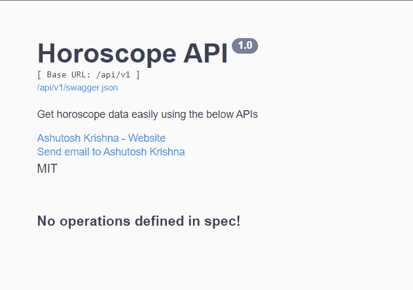
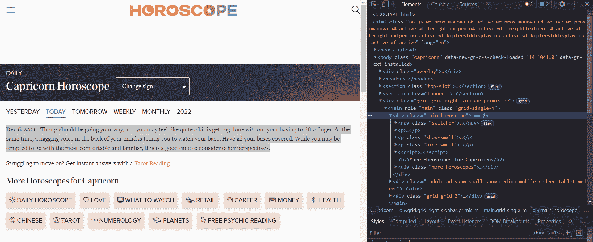

# Python 项目——如何用漂亮的汤和烧瓶创建星座 API

> 原文：<https://www.freecodecamp.org/news/python-project-build-an-api-with-beautiful-soup-and-flask/>

你曾经在报纸上或电视上看过你的星座吗？嗯，我不确定其他国家，但是在我的国家印度，人们仍然阅读他们的星座。

这也是我获得本教程灵感的地方。这听起来可能有点过时，但这里的主要焦点不是星座本身——它只是我们学习的载体。

在本文中，我们将使用 Beautiful Soup 创建一个名为[Horoscope.com](https://www.horoscope.com/us/index.aspx)的网站，然后使用 Flask 创建我们自己的 API。如果部署在公共服务器上，这个 API 可以被其他希望创建网站来显示他们的星座或应用程序的开发者使用。

## 如何设置项目

首先，我们将创建一个虚拟环境，在其中安装所有必需的依赖项。

Python 现在附带了预安装的`venv`库。因此，要创建虚拟环境，您可以使用下面的命令:

```
$ python -m venv env
```

要激活名为`env`的虚拟环境，使用命令:

*   在 Windows 上:

```
env\Scripts\activate.bat
```

*   在 Linux 和 MacOS 上:

```
source env/bin/activate
```

要停用环境(此阶段不需要):

```
deactivate
```

现在我们准备好安装依赖项了。我们将在这个项目中使用的模块和库是:

*   请求:[请求](https://docs.python-requests.org/en/latest/)允许您极其轻松地发送 HTTP/1.1 请求。Python 没有预装这个模块，所以我们需要使用命令:

    ```
    $ pip install requests
    ```

    来安装它
*   bs4: [Beautiful Soup](http://www.crummy.com/software/BeautifulSoup/) (bs4)是一个 Python 库，用于从 HTML 和 XML 文件中提取数据。Python 没有预装这个模块，所以我们需要使用命令:

    ```
    $ pip install bs4
    ```

    来安装它
*   Flask: [Flask](https://flask.palletsprojects.com/) 是一个简单易用的 Python 微框架，可以帮助构建可伸缩且安全的 web 应用程序。Python 没有预装这个模块，所以我们需要使用命令:

    ```
    $ pip install flask
    ```

    来安装它
*   Flask-RESTX: [Flask-RESTX](https://flask-restx.readthedocs.io/en/latest/quickstart.html) 让你用 Swagger 文档创建 API。Python 没有预装这个模块，所以我们需要使用命令:

    ```
    $ pip install flask-restx
    ```

    来安装它

我们还将在这个项目中使用环境变量。因此，我们将安装另一个名为 **python-decouple** 的模块来处理这个问题:

```
pip install python-decouple
```

要了解 Python 中环境变量的更多信息，您可以查看本文。

## 项目工作流程

该项目的基本工作流程如下:

1.  占星数据将从[Horoscope.com](https://www.horoscope.com/us/index.aspx)刮来。
2.  我们的 Flask 服务器将使用这些数据向用户发送 JSON 响应。

## 如何设置 Flask 项目

我们要做的第一件事是创建一个 Flask 项目。如果你查一下 Flask 的官方文档，你会在那里找到一个[的最小应用](https://flask.palletsprojects.com/en/2.0.x/quickstart/#a-minimal-application)。

但是，我们不打算这样做。我们将编写一个可扩展性更强、基础结构更好的应用程序。如果你愿意，你可以按照[这个指南](https://iread.ga/posts/54/getting-started-with-flask)开始使用 Flask。

我们的应用程序将存在于一个名为**核心**的包中。要将一个普通的目录转换成 Python 包，我们只需要包含一个`__init__.py`文件。所以，让我们首先创建我们的核心包。

```
$ mkdir core
```

之后，让我们在核心目录中创建`__init__.py`文件:

```
$ cd core
$ touch __init__.py
$ cd ..
```

在项目的根目录下，创建一个名为`config.py`的文件。我们将把项目的配置存储在这个文件中。在文件中，添加以下内容:

```
from decouple import config

class Config(object):
    SECRET_KEY = config('SECRET_KEY', default='guess-me')
    DEBUG = False
    TESTING = False
    CSRF_ENABLED = True

class ProductionConfig(Config):
    DEBUG = False
    MAIL_DEBUG = False

class StagingConfig(Config):
    DEVELOPMENT = True
    DEBUG = True

class DevelopmentConfig(Config):
    DEVELOPMENT = True
    DEBUG = True

class TestingConfig(Config):
    TESTING = True 
```

在上面的脚本中，我们创建了一个 *Config* 类，并在其中定义了各种属性。此外，我们已经创建了继承*配置*类的不同子类(按照不同的开发阶段)。

注意，我们将 SECRET_KEY 设置为一个名为 **SECRET_KEY** 的环境变量。在根目录下创建一个名为`.env`的文件，并在其中添加以下内容:

```
APP_SETTINGS=config.DevelopmentConfig
SECRET_KEY=gufldksfjsdf
```

除了 **SECRET_KEY** ，之外，我们还有 **APP_SETTINGS** ，它引用了我们在`config.py`文件中创建的一个类。我们将其设置为项目的当前阶段。

现在，我们可以在`__init__.py`文件中添加以下内容:

```
from flask import Flask
from decouple import config
from flask_restx import Api

app = Flask(__name__)
app.config.from_object(config("APP_SETTINGS"))
api = Api(
    app,
    version='1.0',
    title='Horoscope API',
    description='Get horoscope data easily using the below APIs',
    license='MIT',
    contact='Ashutosh Krishna',
    contact_url='https://ashutoshkrris.tk',
    contact_email='contact@ashutoshkrris.tk',
    doc='/',
    prefix='/api/v1'
) 
```

在上面的 Python 脚本中，我们首先从已经安装的 Flask 模块中导入 Flask 类。接下来，我们创建一个 Flask 类的对象`app`。我们使用`__name__`参数来指示应用程序的模块或包，以便 Flask 知道在哪里可以找到其他文件，比如模板。

接下来，我们根据`.env`文件中的变量将应用程序配置设置为**应用程序设置**。

除此之外，我们还创建了一个 *Api* 类的对象。我们需要向它传递各种参数。我们可以在`/`路线上找到 Swagger 文档。在每个 API 路径上，`/api/v1`将作为前缀。

现在，让我们在`core`包中创建一个`routes.py`文件，并添加以下名称空间:

```
from core import api
from flask import jsonify

ns = api.namespace('/', description='Horoscope APIs')
```

我们需要在`__init__.py`文件中导入路线:

```
from flask import Flask
from decouple import config
from flask_restx import Api

app = Flask(__name__)
app.config.from_object(config("APP_SETTINGS"))
api = Api(
    app,
    version='1.0',
    title='Horoscope API',
    description='Get horoscope data easily using the below APIs',
    license='MIT',
    contact='Ashutosh Krishna',
    contact_url='https://ashutoshkrris.tk',
    contact_email='contact@ashutoshkrris.tk',
    doc='/',
    prefix='/api/v1'
)

from core import routes			# Add this line
```

我们现在只剩下一个文件，它将帮助我们运行 Flask 服务器:

```
from core import app

if __name__ == '__main__':
    app.run() 
```

一旦使用`python main.py`命令运行该文件，您将看到类似的输出:



现在，我们准备从占星网站上抓取数据。

## 如何从 Horoscope.com 收集数据

如果你打开[Horoscope.com](https://www.horoscope.com/us/horoscopes/general/horoscope-general-daily-today.aspx)并选择你的星座，你今天的星座运势数据就会显示出来。


Source: Horoscope.com

在上面的图像中，你可以看到你可以查看昨天，明天，每周，每月，甚至是一个自定义日期的星座。我们将使用所有这些。

但首先如果你看到当前页面的网址，是这样的:[https://www . ostograph . com/us/ostoglass/general/ostograph-general-daily-today . aspx？sign=10](https://www.horoscope.com/us/horoscopes/general/horoscope-general-daily-today.aspx?sign=10) 。

URL 有两个变量，看清楚的话，**签**和**今天**。变量**符号**的值将根据黄道十二宫指定。变量**今天**可以换成**昨天**和**明天**。

下面的字典可以帮助我们了解黄道十二宫:

```
ZODIAC_SIGNS = {
    "Aries": 1,
    "Taurus": 2,
    "Gemini": 3,
    "Cancer": 4,
    "Leo": 5,
    "Virgo": 6,
    "Libra": 7,
    "Scorpio": 8,
    "Sagittarius": 9,
    "Capricorn": 10,
    "Aquarius": 11,
    "Pisces": 12
}
```

这意味着如果你的生肖是**摩羯座**，那么 URL 中**星座**的值将是 **10** 。

接下来，如果我们希望获得一个自定义日期的星座数据，URL[https://www . Osborne . com/us/Osborne s/general/Osborne-archive . aspx？sign=10 & laDate=20211213](https://www.horoscope.com/us/horoscopes/general/horoscope-archive.aspx?sign=10&laDate=20211213) 会帮助我们的。

它有相同的**符号**变量，但是它有另一个变量 **laDate** ，该变量采用 **YYYYMMDD** 格式的日期。

现在，我们准备创建不同的函数来获取星座数据。创建一个`utils.py`文件，然后跟着做。

### 如何得到当天的星座运势

```
import requests
from bs4 import BeautifulSoup

def get_horoscope_by_day(zodiac_sign: int, day: str):
    if not "-" in day:
        res = requests.get(f"https://www.horoscope.com/us/horoscopes/general/horoscope-general-daily-{day}.aspx?sign={zodiac_sign}")
    else:
        day = day.replace("-", "")
        res = requests.get(f"https://www.horoscope.com/us/horoscopes/general/horoscope-archive.aspx?sign={zodiac_sign}&laDate={day}")
    soup = BeautifulSoup(res.content, 'html.parser')
    data = soup.find('div', attrs={'class': 'main-horoscope'})
    return data.p.text
```

我们已经创建了第一个函数，它接受两个参数——一个整数**和一个字符串**日**。日期可以是今天、明天、昨天或今天之前的任何自定义日期，格式为 YYYY-MM-DD。**

如果该日不是自定义日期，则其中不会有连字符(-)。所以，我们为它设定了一个条件。

如果没有连字符符号，我们在`https://www.horoscope.com/us/horoscopes/general/horoscope-general-daily-{*day*}.aspx?sign={*zodiac_sign*}`上发出 GET 请求。否则首先，我们将日期从 YYYY-MM-DD 更改为 YYYYMMDD 格式。

然后我们在`https://www.horoscope.com/us/horoscopes/general/horoscope-archive.aspx?sign={*zodiac_sign*}&laDate={*day*}`上发出一个 GET 请求。

之后，我们使用 BeautifulSoup 从页面的响应内容中提取 HTML 数据。现在我们需要从这个 HTML 代码中获取星座文本。如果你检查任何网页的代码，你会发现:



星座文本包含在一个 **div** 和类**主星座**中。因此我们使用`soup.find()`函数提取段落文本串，并返回它。

### 如何获得本周的星座运势

```
def get_horoscope_by_week(zodiac_sign: int):
    res = requests.get(f"https://www.horoscope.com/us/horoscopes/general/horoscope-general-weekly.aspx?sign={zodiac_sign}")
    soup = BeautifulSoup(res.content, 'html.parser')
    data = soup.find('div', attrs={'class': 'main-horoscope'})
    return data.p.text
```

上面的函数和前面的很像。我们刚刚把网址改成了`https://www.horoscope.com/us/horoscopes/general/horoscope-general-weekly.aspx?sign={*zodiac_sign*}`。

### 如何获得当月的星座运势

```
def get_horoscope_by_month(zodiac_sign: int):
    res = requests.get(f"https://www.horoscope.com/us/horoscopes/general/horoscope-general-monthly.aspx?sign={zodiac_sign}")
    soup = BeautifulSoup(res.content, 'html.parser')
    data = soup.find('div', attrs={'class': 'main-horoscope'})
    return data.p.text 
```

这个函数也类似于其他两个函数，除了 URL 现在已经更改为`https://www.horoscope.com/us/horoscopes/general/horoscope-general-monthly.aspx?sign={*zodiac_sign*}`。

## 如何创建 API 路由

我们将使用 Flask-RESTX 来创建我们的 API 路由。API 路由将如下所示:

*   对于每日或自定义日期:`/api/v1/get-horoscope/daily?day=today&sign=capricorn`或`api/v1/get-horoscope/daily?day=2022-12-14&sign=capricorn`
*   对于每周:`api/v1/get-horoscope/weekly?sign=capricorn`
*   每月:`api/v1/get-horoscope/monthly?sign=capricorn`

我们在 URL 中有两个查询参数:**日**和**签**。**日**参数可以取像今天、昨天这样的值，或者像 2022-12-14 这样的自定义日期。**符号**参数将采用十二星座名称，可以是大写或小写，这无关紧要。

为了解析来自 URL 的查询参数，Flask-RESTX 内置了对请求数据验证的支持，使用了一个类似于 [**argparse**](https://docs.python.org/3/library/argparse.html#module-argparse) 称为 **reqparse** 的库。为了在 URL 中添加参数，我们将使用 *RequestParser* 类的 **add_argument** 方法。

```
parser = reqparse.RequestParser()
parser.add_argument('sign', type=str, required=True) 
```

`type`参数将采用参数的类型。`required=True`强制传递查询参数。

现在，我们需要另一个查询参数 day。但是这个参数只会在每日星座 URL 中使用。

我们可以编写一个包含所有共享参数的父解析器，然后用 [`copy()`](https://flask-restplus.readthedocs.io/en/stable/api.html#flask_restplus.reqparse.RequestParser.copy) 扩展解析器，而不是重写参数。

```
parser_copy = parser.copy()
parser_copy.add_argument('day', type=str, required=True)
```

`parser_copy`不仅包含**日**，还包含**日**。这就是我们每日星座运势的要求。

Flask-RESTX 提供的主要构件是资源。资源构建在 [Flask pluggable views](https://flask.palletsprojects.com/en/2.0.x/views/) 之上，只需在资源上定义方法，就可以轻松访问多个 HTTP 方法。

让我们创建从`flask_restx`继承*资源*类的 *DailyHoroscopeAPI* 类。

```
@ns.route('/get-horoscope/daily')
class DailyHoroscopeAPI(Resource):
    '''Shows daily horoscope of zodiac signs'''
    @ns.doc(parser=parser_copy)
    def get(self):
        args = parser_copy.parse_args()
        day = args.get('day')
        zodiac_sign = args.get('sign')
        try:
            zodiac_num = ZODIAC_SIGNS[zodiac_sign.capitalize()]
            if "-" in day:
                datetime.strptime(day, '%Y-%m-%d')
            horoscope_data = get_horoscope_by_day(zodiac_num, day)
            return jsonify(success=True, data=horoscope_data, status=200)
        except KeyError:
            raise NotFound('No such zodiac sign exists')
        except AttributeError:
            raise BadRequest(
                'Something went wrong, please check the URL and the arguments.')
        except ValueError:
            raise BadRequest('Please enter day in correct format: YYYY-MM-DD')
```

`@ns.route()`装饰器设置 API 路径。在 *DailyHoroscopeAPI* 类中，我们有 **get** 方法来处理 get 请求。`@ns.doc()`装饰器将帮助我们在 URL 上添加查询参数。

为了获得查询参数的值，我们将使用 **parse_args()** 方法，该方法将返回一个字典，如下所示:

```
{'sign': 'capricorn', 'day': '2022-12-14'}
```

然后，我们可以使用关键字 **day** 和 **sign** 来获取值。

正如在开始时所定义的，我们将有一个黄道十二宫字典。我们使用一个 **try-except** 块来处理请求。如果十二生肖不在字典中，就会引发一个 *KeyError* 异常。在这种情况下，我们用一个*未找到*错误(错误 404)来响应。

另外，如果 **day** 参数中有一个连字符，我们尝试将日期格式与 YYYY-MM-DD 匹配。如果不是这种格式，我们就抛出一个 *BadRequest* 错误(错误 400)。如果**日**不包含连字符，我们直接调用带有**符号**和**日**参数的`get_horoscope_by_day()`方法。

如果一些乱码作为参数值被传递，就会引发一个 *AttributeError* 。在这种情况下，我们抛出一个 *BadRequest* 错误。

另外两条路线也和上面那条挺像的。不同的是，我们在这里不需要一个日期参数。所以，这里我们不用`parser_copy`，而是用`parser`。

```
@ns.route('/get-horoscope/weekly')
class WeeklyHoroscopeAPI(Resource):
    '''Shows weekly horoscope of zodiac signs'''
    @ns.doc(parser=parser)
    def get(self):
        args = parser.parse_args()
        zodiac_sign = args.get('sign')
        try:
            zodiac_num = ZODIAC_SIGNS[zodiac_sign.capitalize()]
            horoscope_data = get_horoscope_by_week(zodiac_num)
            return jsonify(success=True, data=horoscope_data, status=200)
        except KeyError:
            raise NotFound('No such zodiac sign exists')
        except AttributeError:
            raise BadRequest('Something went wrong, please check the URL and the arguments.')

@ns.route('/get-horoscope/monthly')
class MonthlyHoroscopeAPI(Resource):
    '''Shows monthly horoscope of zodiac signs'''
    @ns.doc(parser=parser)
    def get(self):
        args = parser.parse_args()
        zodiac_sign = args.get('sign')
        try:
            zodiac_num = ZODIAC_SIGNS[zodiac_sign.capitalize()]
            horoscope_data = get_horoscope_by_month(zodiac_num)
            return jsonify(success=True, data=horoscope_data, status=200)
        except KeyError:
            raise NotFound('No such zodiac sign exists')
        except AttributeError:
            raise BadRequest('Something went wrong, please check the URL and the arguments.') 
```

现在我们的路线完成了。为了测试 API，您可以使用在`/`路线上可用的 Swagger 文档，或者您可以使用 [Postman](https://www.postman.com/) 。让我们运行服务器并测试它。

[https://www.youtube.com/embed/yggJPOqr6jc?feature=oembed](https://www.youtube.com/embed/yggJPOqr6jc?feature=oembed)

您还可以将项目部署在公共服务器上，以便其他开发人员也可以访问和使用该 API。

## 包扎

在本教程中，我们学习了如何使用请求和漂亮的汤从网站中抓取数据。然后我们使用 Flask 和 Flask-RESTX 创建了一个 API。

如果你想学习如何使用 Python 与 API 交互，请查看本指南。

我希望你喜欢它——感谢你的阅读！

教程代码:[https://github.com/ashutoshkrris/Horoscope-API](https://github.com/ashutoshkrris/Horoscope-API)