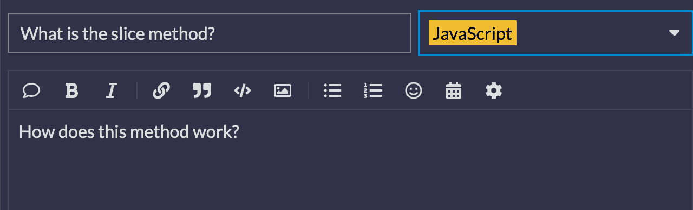
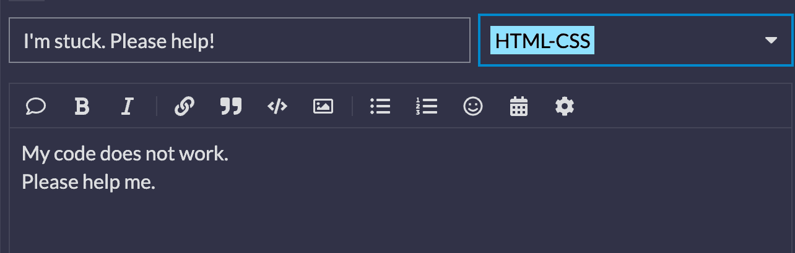
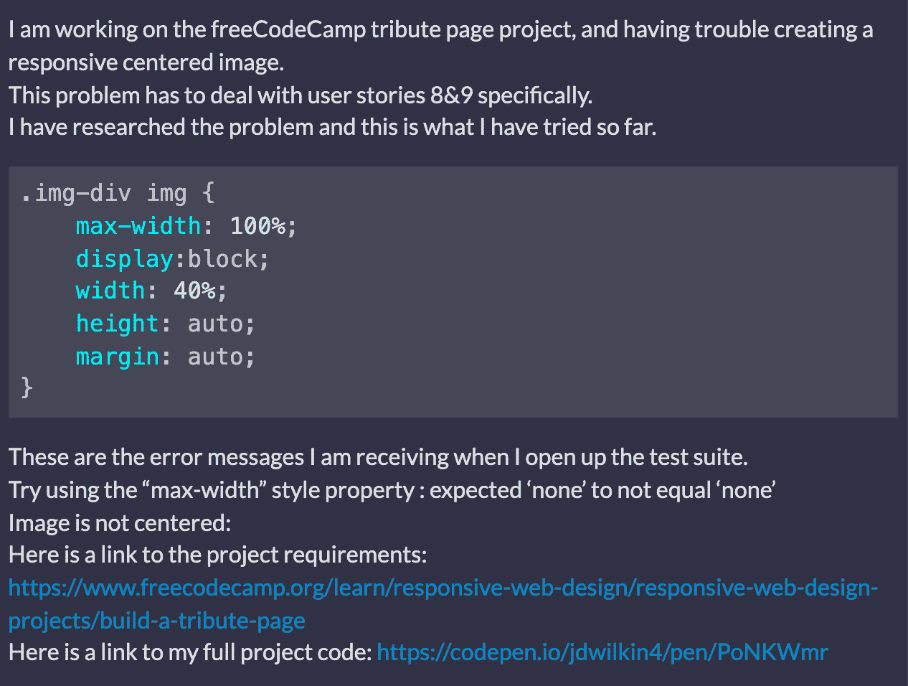

# 如何在论坛上提问

> 原文：<https://www.freecodecamp.org/news/how-to-ask-a-question-on-a-forum/>

作为一名开发人员，在论坛上寻求帮助是学习和成长的好方法。但重要的是，你知道如何提出好的问题，这样人们才能有效地帮助你。

在这篇文章中，我将带你了解如何在论坛上提出好的问题，这样你就能得到有用的答案。

## 确保首先研究这个问题

freeCodeCamp 提出了[阅读-搜索-提问方法](https://forum.freecodecamp.org/t/how-to-get-help-when-you-are-stuck-coding/19514)。在论坛上发帖之前，请确保通读您收到的错误消息。

然后你可以搜索文档或谷歌，看看是否有可以帮助你的解决方案。如果您对特定的方法或属性有疑问，请务必先查看文档。

请避免发布这样的帖子:

这个问题比较模糊，在谷歌上很容易搜索到。

如果你对一个方法如何工作有具体的问题，那么你需要确保在你的帖子中详细说明。

## 询问具体问题，并提供问题的细节

当你需要帮助解决问题时，请提供尽可能多的细节，以便人们知道如何帮助你。

你应该避免发布这样的帖子:

这篇文章没有提供任何关于用户正在努力解决什么问题的解释，这使得人们很难提供帮助。

如果你正在努力解决一个问题，确保包括以下内容:

*   与您面临的问题相关的描述性标题
*   对您所面临的问题的简要描述
*   您看到的错误消息列表
*   您正在处理的挑战或项目的链接
*   到目前为止你所尝试的代码

### 特定论坛问题示例

现在我们来看一个如何提出更具体问题的例子。下面这篇文章的标题是“为致敬页项目创建一个响应图像有困难”。

那个描述性的标题让人知道我在纠结什么。在我的文章中，我将描述这个问题并提供所有必要的信息。

在这篇文章中，我包含了完整的项目代码、问题描述、我尝试的代码片段以及我收到的错误消息。

我也让人们知道我首先尝试研究这个问题。

有了这种类型的信息，有人可以进入我的项目代码，并意识到我错误地写了`.img-div`而不是`#img-div`。

## 记得格式化你的代码

当你在帖子中提供代码片段时，请记住格式化你的代码，以便人们可以阅读。

请通读[这篇关于如何在论坛中格式化你的代码的文章](https://forum.freecodecamp.org/t/forum-code-formatting/25574)。

如果你需要帮助格式化你的代码，那么请联系那个论坛的版主，他们会帮助你。

## 结论

记住人们想要帮助你是很重要的。但是，如果你没有提供足够的信息，那么它很难协助你。

我希望这篇文章对你有所帮助，祝你编码愉快。