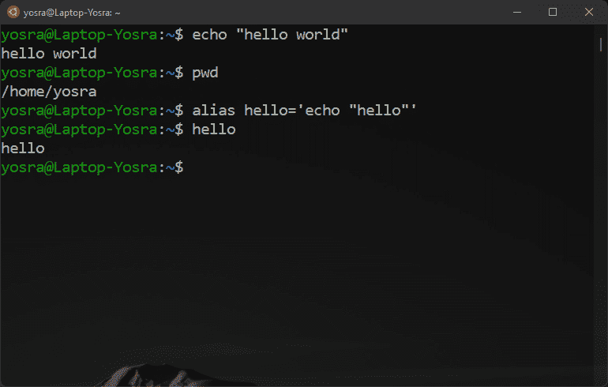
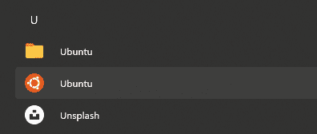
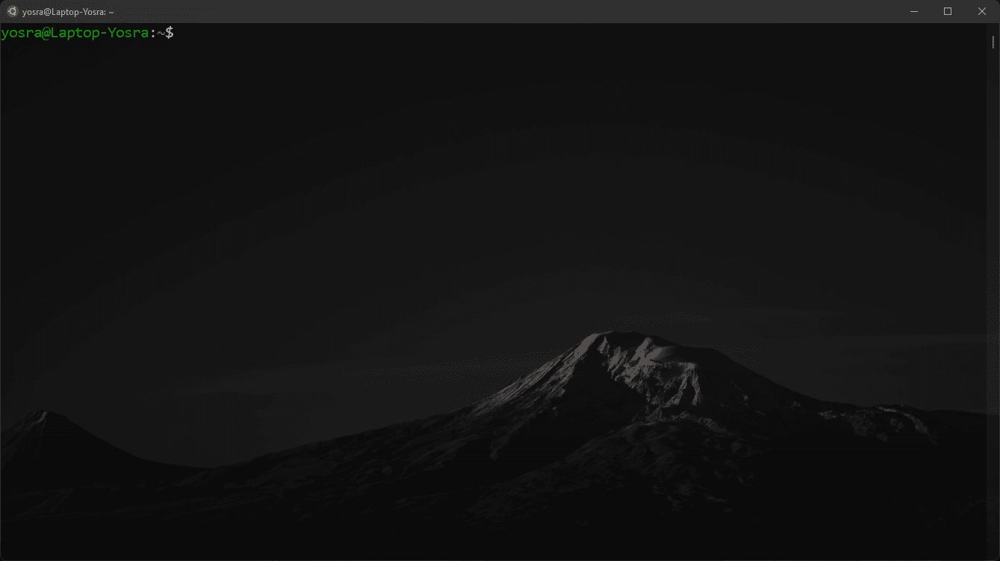
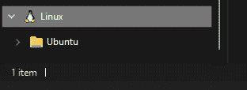
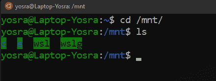
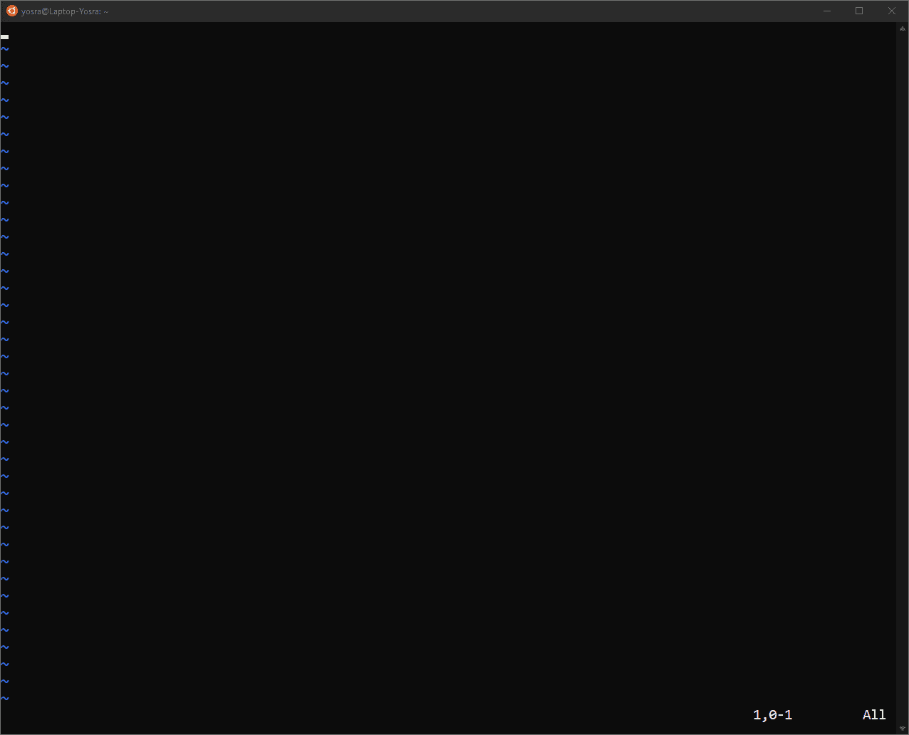
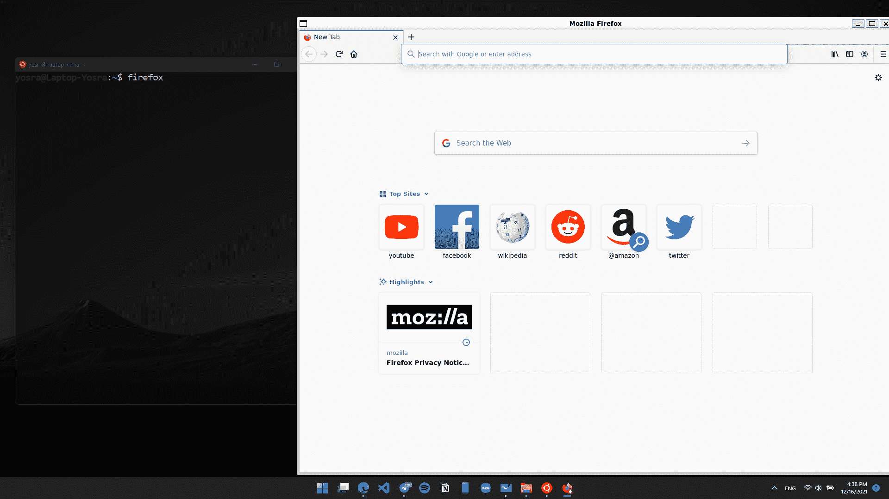
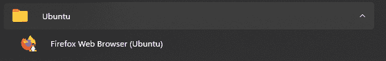

# 如何使用 WSL 在 Windows 10 和 11 上运行 Linux 应用

> 原文：<https://www.freecodecamp.org/news/how-to-run-linux-apps-on-windows-10-11-using-wsl/>

我在我的 OS 类中使用 Windows Subsystem for Linux (WSL)已经有一段时间了。我喜欢在 Windows 中直接使用 Linux 命令，而不用增加安装虚拟机或双引导的复杂性。

到本文结束时，您应该能够直接从 Windows 运行 Linux 命令，如下所示:



example of linux commands on windows

# 先决条件

要让 WSL 有效运行，建议你升级到 Windows 11。WSL 在 Windows 10 上也可用，但根据我的经验，它在 Windows 11 上效率更高。

对于 Windows 10，您需要安装版本 21364 或更高版本。

这篇文章将介绍你可以在 Windows 10 和 11 上做什么

# 如何安装 WSL

运行 WSL 的命令很简单:

```
wsl --install 
```

这将下载 Linux 内核，将 WSL 2 设置为默认，并将 Ubuntu 安装为默认发行版。

不想要 ubuntu？这是给你的命令:

```
wsl --install -d <distro name> 
```

以下是目前可用的发行版:

*   人的本质
*   OpenSUSE Leap 42
*   SUSE Linux 企业服务器 12 (SLES)
*   Kali Linux
*   Debian GNU/Linux

在这之后，你会在你的开始菜单中找到一个名为 Ubuntu(或任何其他发行版)的应用程序:



# 打开 Linux 终端

打开刚刚安装的 Ubuntu app，迎接你的是一个 Linux 终端！尝试运行一些命令:



# 如果我想访问我的 Windows 文件怎么办？

如果你打开你的文件浏览器(winkey+E ),你会在左边找到一个新的 Linux 选项，那里有你所有的 Linux 文件。这是您在终端中创建的任何文件的位置:



但是如果你想访问你的常规文件呢？

幸运的是，你可以很容易做到这一点。只需在您的 Linux 终端中运行以下命令:

```
cd /mnt/ 
```

如果你在这里运行`ls`，你会找到你的电脑驱动器。这样你就能以自己的方式进入你的文件。



# 如何在 WSL2 中创建别名

你是否曾经有一个很长的命令需要输入，并且希望有一个快捷方式？那么，别名就是你的朋友。

创建别名有两种方式:

*   每次会话
*   永久地

## 如何在 WSL2 中创建每会话别名

要在您当前的 Linux 会话中创建一个别名(一旦您关闭终端，别名就会被忘记)，那么您应该运行以下命令:

```
alias <alias name>='<command>' 
```

例如:

```
alias runc='gcc main.c -o main' 
```

## 如何在 WSL2 中创建永久别名

我们将编辑一个名为`.bash_aliases`的文件来保存我们的别名。

运行以下命令:

```
cd ~
ls -a 
```

浏览打印出来的文件列表，寻找`.bash_aliases`。

如果找不到，请运行以下命令:

```
touch .bash_aliases 
```

现在，为了编辑该文件，运行以下命令:

```
vi .bash_aliases 
```

你会看到这样一个屏幕:



*   按“I”开始键入，并根据需要添加任意多个别名。

例如:

```
alias runc='gcc main.c -o main'
alias hello='echo hello' 
```

*   要退出打字模式，请按“ctrl + c”。
*   要退出 Vim 并保存文件，请键入“:wq！”(我感到自豪的是，我不用去谷歌。)

现在你准备好了！重启 Ubuntu，开始输入上面的任何一个别名，它应该可以很好地工作了:


# 如何运行 GUI 应用程序

好吧，酷，现在我们知道如何从 WSL2 运行命令行应用程序。但是如果我们想运行 Linux GUI 应用程序呢？答案很简单——你只需要在运行之前安装 GUI 应用程序。我将以 Firefox 为例。

要安装 Firefox:

```
sudo apt install firefox 
```

要运行 Firefox:

```
firefox 
```



如果你的 Windows 电脑上已经安装了 Firefox，你会发现它没有打开。这是因为你现在运行的是火狐 Linux 版，而不是 Windows 版。

如果你使用的是 Windows 11，你甚至可以直接从开始菜单运行 Firefox for Linux。你可以在发行版的文件夹下找到它。



# 结论

本文介绍了如何有效地运行 WSL 2。如果您有任何问题，请随时通过我的[社交媒体平台](https://yosracodes.bio.link/)联系我