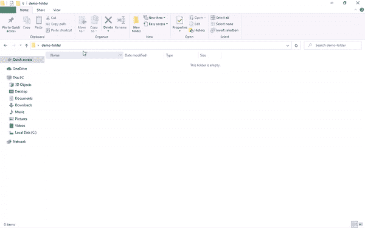
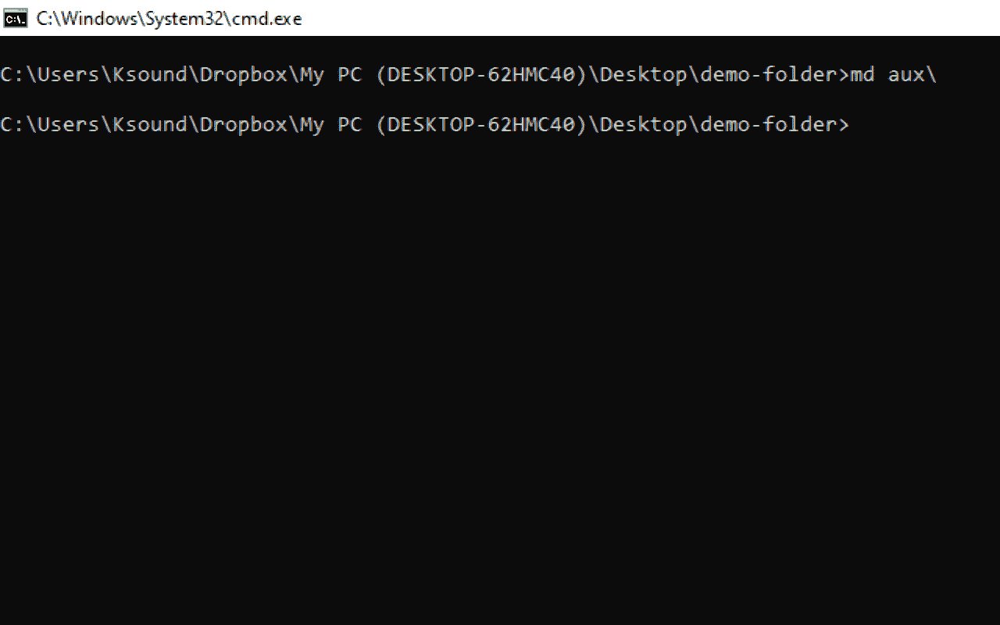
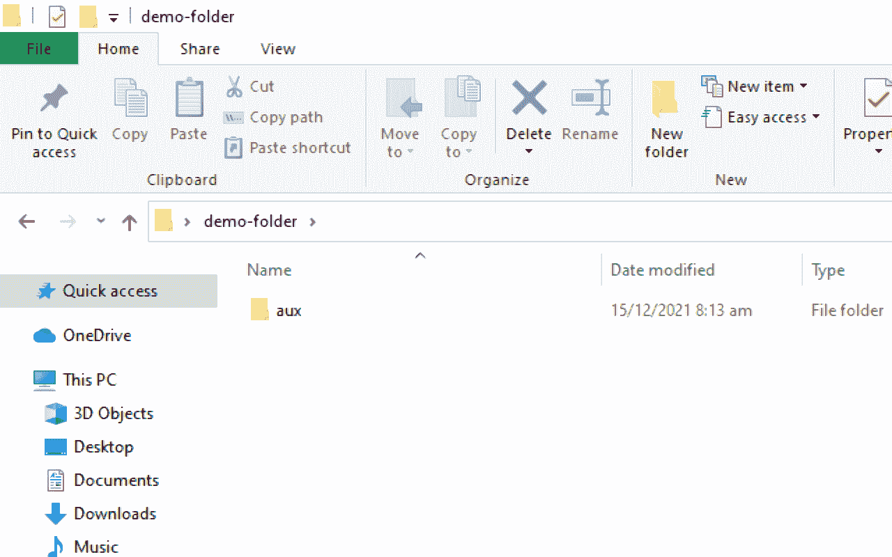
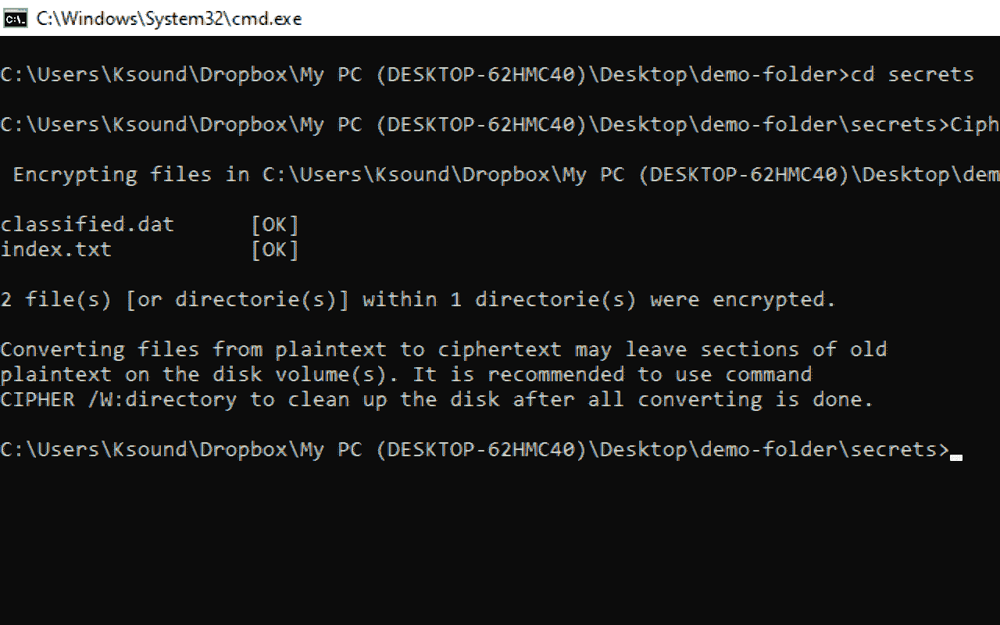
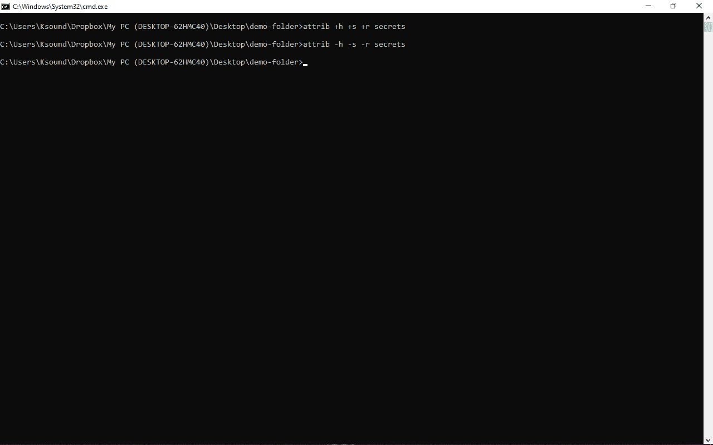
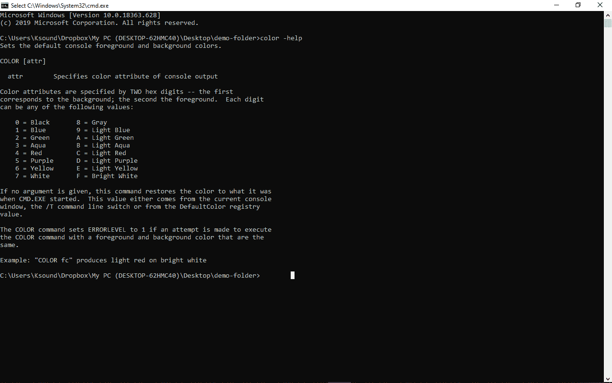
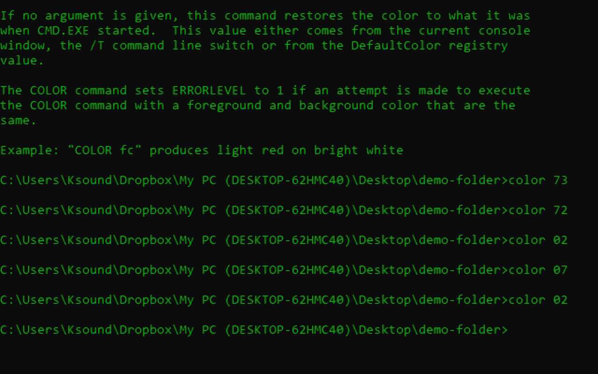
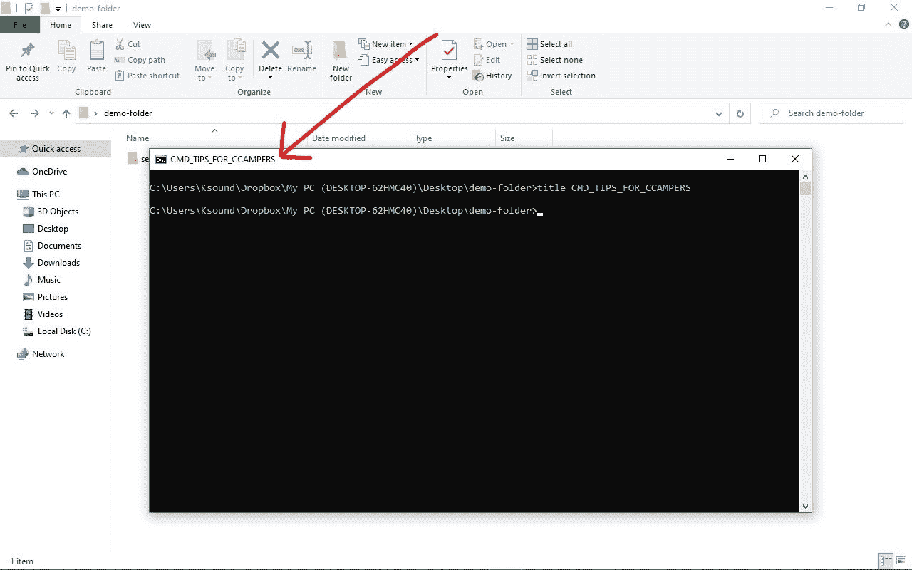
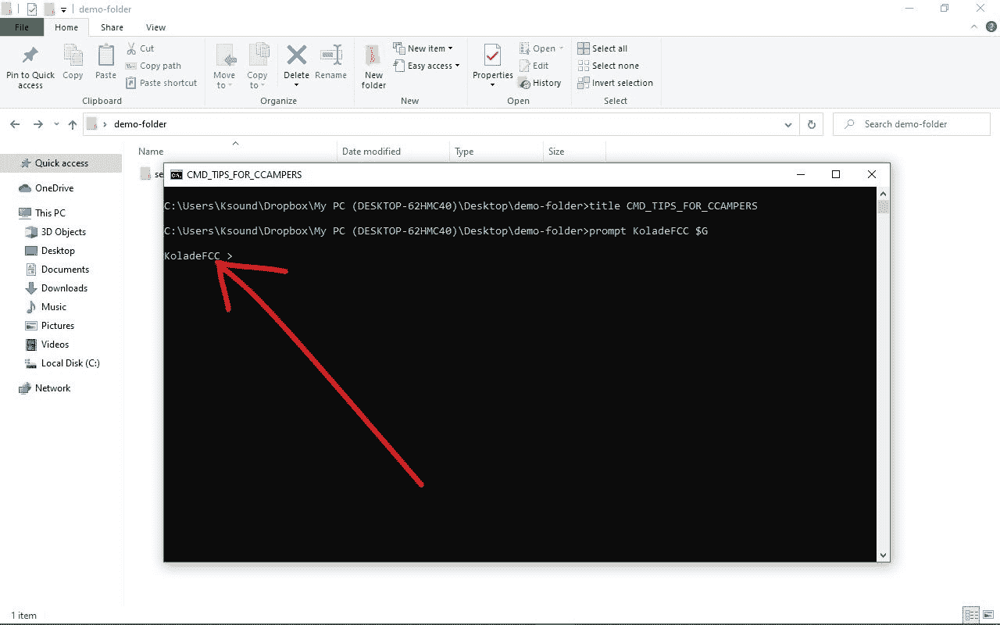
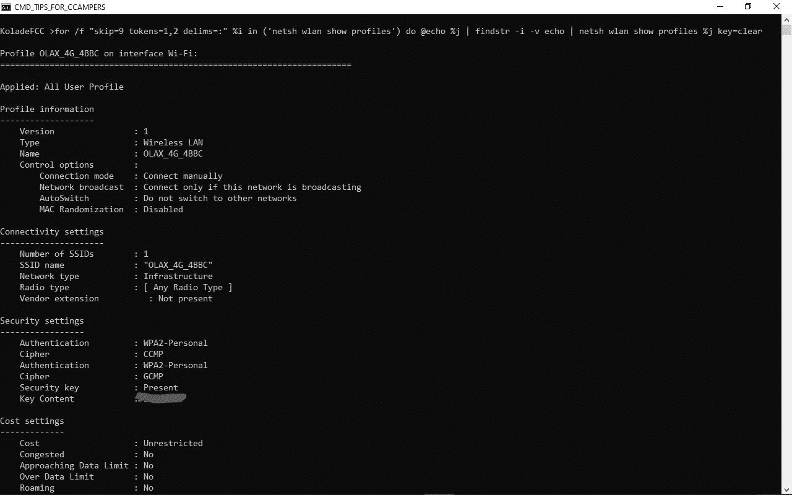

# 14 个 Windows 10 命令行技巧，让您更好地控制您的电脑

> 原文：<https://www.freecodecamp.org/news/windows-10-command-line-tricks/>

Windows 10 拥有令人难以置信的图形用户界面(GUI ),通常足以让您完成工作。

但是如果你的内心想要更多，那么你应该开始学习命令行。

通过命令提示符，您可以访问 GUI 中不可用的功能，并直接与 Windows 10 操作系统进行交互。

在这篇文章中，我将向你展示 14 个命令行提示和技巧，它们会让你在使用电脑时感觉像个超级英雄，而且肯定会给你的朋友留下深刻印象。

请注意，在命令提示符下执行命令时应该非常小心，因为您执行的任何命令都可能对您的计算机产生持久的影响。

请务必阅读到最后，因为我将向您展示如何查看曾经连接到您电脑的每个 Wi-Fi 的密码。

## 目录

*   [如何在任意文件夹中打开命令提示符](#1howtoopenthecommandpromptinanyfolder)
*   [如何使用命令提示符](#2howtocreateasecurefolderwiththecommandprompt)创建安全文件夹
*   [如何以管理员身份运行命令提示符](#3howtorunthecommandpromptasanadministrator)
*   [如何用命令提示符加密文件](#4howtoencryptfileswiththecommandprompt)
*   [如何用命令提示符隐藏文件夹](#5howtohideafolderwiththecommandprompt)
*   [如何改变命令提示符的背景色和字体颜色](#6howtochangethebackgroundcolorandfontcolorofthecommandprompt)
*   [如何改变命令提示窗口的标题](#7howtochangethetitleofthecommandpromptwindow)
*   [如何更改命令提示符的提示文本](#8howtochangetheprompttextofthecommandprompt)
*   [如何改变命令提示文本的字体大小](#9howtochangethefontsizeofthecommandprompttexts)
*   [如何通过命令提示符](#10howtogeneratebatteryhealthreportwiththecommandprompt)生成电池健康报告
*   [如何从命令提示符登录网站](#11howtologontoawebsitefromthecommandprompt)
*   [如何用命令提示符检查网站的 IP 地址](#12howtoseetheipaddressofawebsitewiththecommandprompt)
*   [如何在命令提示符下显示所有 Wi-Fi 密码](#13howtoshowallwifipasswordswiththecommandprompt)
*   [如何用命令提示符关闭电脑](#14howtoshutdownyourcomputerwiththecommandprompt)

## 1.如何在任何文件夹中打开命令提示符

不是每个人都想要在命令行中导航文件夹的麻烦。

如果你和我一样是这样的人，你可以在命令提示符下直接打开文件夹，在文件夹地址栏中输入“cmd ”,然后点击`ENTER`

这就对了。

## 2.如何使用命令提示符创建安全文件夹

出于隐私原因，您可能希望创建一个文件夹，任何访问您电脑的人都不能编辑、移动、复制或删除该文件夹。

为此，导航到要创建该文件夹的目录，或者使用本文中的第一个提示直接在其中打开命令提示符。然后执行命令-`md aux\`。

这将创建一个名为“aux”的文件夹。它不能被删除、编辑、移动或复制。

如果检查后找不到该文件夹，请刷新创建该文件夹的目录。

那么，如果你想删除这个文件夹呢？你不能用 GUI 来做，所以你需要在命令行中做。执行命令-`rd aux\`–删除文件夹。确保文件夹中的文件已备份。

## 3.如何以管理员身份运行命令提示符

有时，当您无权访问 GUI 时，您可能需要管理权限。

要得到这些，输入`powershell "start cmd -v runAs`并点击`ENTER`。在下一个提示中选择 Yes，它将打开一个具有管理权限的命令提示符的新窗口。

## 4.如何使用命令提示符加密文件

如果你不是唯一一个使用 Windows 10 电脑的人，并且你希望其他用户无法访问你的文件，你可以通过导航到文件所在的文件夹并键入`Cipher /E`来加密文件。

除您之外的任何其他用户都无法打开这些文件。

## 5.如何在命令提示符下隐藏文件夹

那么，如果你想隐藏一个文件夹呢？你可以通过输入`attrib +h +s +r folder_name`然后点击`ENTER`来完成。

要再次显示文件夹，请执行命令-`attrib -h -s -r folder_name`。

## 6.如何更改命令提示符的背景颜色和字体颜色

如果命令行的老派黑白颜色让您觉得乏味，您可以将它们更改为您想要的配色方案。

为此，启动命令提示符并运行`color -help`。这将显示由数字和字母代表的可用颜色。您可以将背景和字体颜色更改为。

要正确改变颜色，运行`color background_color_number font_color_number`。例如，`color 02`将背景颜色保留为黑色，并将字体颜色更改为绿色。

## 7.如何更改命令提示符窗口的标题

一个打开的命令提示符窗口的标题不需要保持默认——你可以改变它。

为此，键入`title window_title_name`。

## 8.如何更改命令提示符的提示文本

在您键入命令之前出现的文本可能对您不够有吸引力。对我来说，不是，所以我改了。

要更改提示文本，输入`prompt prompt_name $G`并点击`ENTER`。
在指定的提示名称前的“$G”将为您添加大于号(>)，这样您就可以知道您的命令从哪里开始——一个更好的 UX，由您创建！

## 9.如何更改命令提示符文本的字体大小

如果命令提示符的默认字体对您的眼睛来说太小，您可以更改它。您甚至不需要为此运行命令。

**第一步**:在命令提示符窗口点击右键，选择“属性”。

**第二步**:切换到字体选项卡，选择您想要的字体大小，然后点击“确定”。

## 10.如何使用命令提示符生成电池健康报告

有了这个，你就可以知道你的笔记本电池的状态，以及如何改善它。事实上，这是命令提示符让我做的我最喜欢的事情。

要生成电池健康报告，请确保您以管理员身份运行命令提示符。然后输入命令`powercfg/energy`并点击`ENTER`。

60 秒后将为您生成一个可以用浏览器打开的 HTML 文件。
你可以在`C:\Windows\system32\energy-report.html`中找到 HTML 文件。

## 11.如何从命令提示符登录网站

你可以在命令提示符下输入`start www.website_name.com`然后点击`ENTER`来打开一个网站。然后，网站将在您的默认浏览器中打开。

注意，必须在域名前追加“www”，否则不起作用。

## 12.如何使用命令提示符查看网站的 IP 地址

你可以通过输入`ping www.website_name.com`然后点击`ENTER`来检查任何网站的 IP 地址。

注意，必须在域名前追加“www”，否则不起作用。

## 13.如何在命令提示符下显示所有 Wi-Fi 密码

您可以使用 GUI 检查当前 WiFi 连接的密码。但是命令提示符也显示了曾经连接过你电脑的每一个 WiFi 的密码。

要检查密码，运行命令-`for /f "skip=9 tokens=1,2 delims=:" %i in ('netsh wlan show profiles') do @echo %j | findstr -i -v echo | netsh wlan show profiles %j key=clear`并点击`ENTER`。

你可以在“关键内容”的正前方找到关键。

当我的一些邻居阅读我的 freeCodeCamp 文章时，我模糊了密钥。:)

## 14.如何使用命令提示符关闭计算机

现在你已经学会了 11 个有用的命令，它们会让你感觉自己像个老板，这里还有一个:用命令提示符关闭或重启你的电脑。

要使用命令提示符关闭计算机，请运行命令`shutdown -s`。
要重启电脑，输入`shutdown -r`并点击`ENTER`。

要设置电脑关机的倒计时，输入`shutdown /s /t time_in_seconds`并点击`ENTER`。

要设置倒计时和电脑关机时的提醒信息，请输入`shutdown /s /t time_in_seconds /c “alert_message”` 并点击`ENTER`。

感谢您阅读这篇文章。如果你觉得有帮助，请分享给你的朋友和家人。