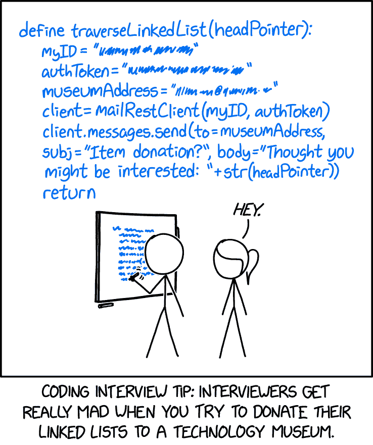

# 技术面试中的链表

> 原文：<https://www.freecodecamp.org/news/linked-lists-in-technical-interviews/>

链表是软件开发中常用的数据结构。也是技术编码面试中经常出现的话题。

我们刚刚在 freeCodeCamp.org YouTube 频道上发布了一门课程，它将教你所有关于链表的知识，并让你准备好在编码采访和编程项目中使用它们。

Structy 的 Alvin Zablan 开发了这个课程。他创建了许多技术课程，包括互联网上最受欢迎的动态编程课程之一。

在本课程中，你将首先学习算法背后的理论，然后学习如何用代码实现它们。这些算法将通过图像和可视化来帮助你真正理解它们是如何工作的。

只要记住不要试图捐赠任何链表😀(见下面漫画)。

Linked List Interview Problem Comic (source: [xkcd](https://xkcd.com/2483/))

在本课程中，您将了解以下主题:

*   什么是链表？
*   链表遍历
*   链接列表值
*   总和列表
*   链表查找
*   获取节点值
*   反向列表
*   拉链清单

观看 freeCodeCamp.org YouTube 频道的全部课程(1.5 小时观看)。

[https://www.youtube.com/embed/Hj_rA0dhr2I?feature=oembed](https://www.youtube.com/embed/Hj_rA0dhr2I?feature=oembed)