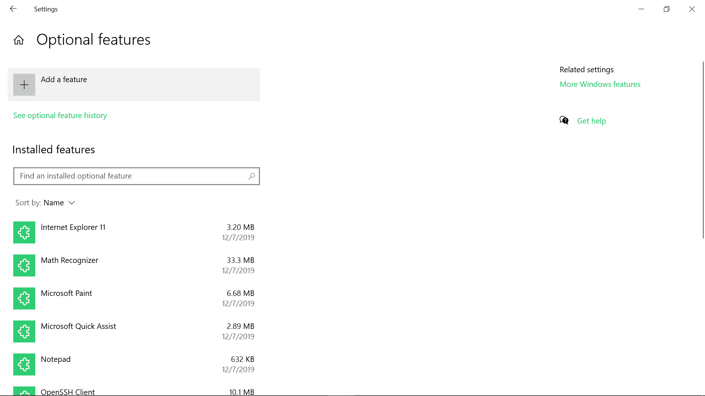
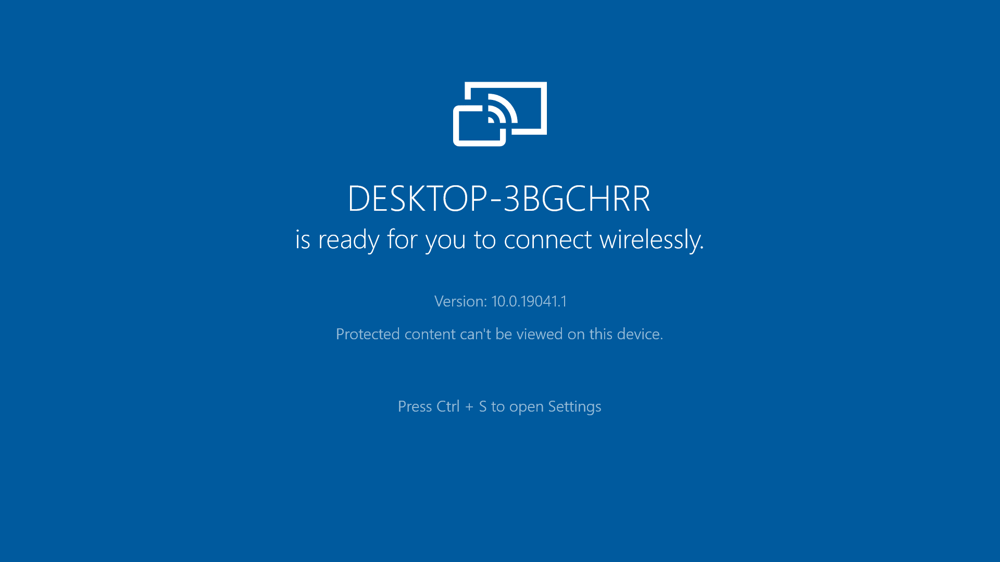
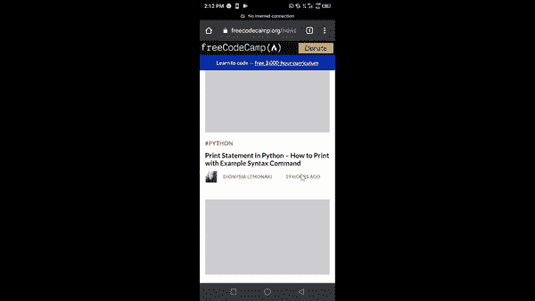

# 在 Android 上共享屏幕——如何在 Windows 10 PC 上投射我的屏幕

> 原文：<https://www.freecodecamp.org/news/share-screen-on-android-how-to-cast-my-screen-with-a-windows-10-pc/>

截屏是一个很酷的功能，在 2019 年的 Windows 10 周年更新中内置了这个功能。

也叫无线显示。它可以让你将手机显示投影到 Windows 10 电脑上——这可以在很多方面帮助你，特别是如果你是一个 YouTuber 用户。

绕过配置和必要的设置来与 Windows 10 上的 Android 手机建立无线连接可能会很棘手。我花了好几天才弄明白。

因此，在这篇文章中，我将向你展示如何做到这一点。

## 如何将你的安卓屏幕投射到 Windows 10 电脑上？

要将 Android 屏幕投射到 Windows 10 笔记本电脑上，您需要通过在计算机上安装 Connect 应用程序来启用无线显示。它不再是预装的应用程序，所以你需要下载它。

### 如何在 Windows 10 电脑上设置

以下步骤向您展示了如何在 Windows 10 上设置 Connect 应用程序:

**第一步**:按键盘上的`WIN` (Windows logo 键)+ I 进入设置。

**第二步**:从菜单平铺中选择系统。

**步骤 3** :切换到“投影到这台电脑”选项卡，点击可选功能链接。

请记住，无线显示器不是预装的，因此您需要通过单击“可选功能”链接来添加它。单击该链接后，您将看到几个可以添加到计算机中的附加功能。

**步骤 4** :从列表中找到无线显示器并选中，然后点击安装。

请注意，如果您当前的 internet 连接是按流量计费的，则不会安装此功能。因此，请确保您不在计量网络中。

安装无线显示器后，在**步骤 3** 中不可用的几个投影选项现在应该可用了。最重要的是，您现在可以访问 Windows 10 Connect 应用程序。

**步骤 6** :将第一个选项改为随处可用，这样 Android 设备的显示器(屏幕)就可以无线连接到你的电脑。

**第 7 步**:点击“启动 Connect app 以投影到这台电脑”的链接。

当您启动 Connect 应用程序时，您应该会看到如下所示的屏幕:

剩下的设置应该已经在你的 Android 手机上完成了。

### 如何在 Android 手机上设置它

每个安卓厂商都有他们所谓的选角功能。在 Tecno 和 Infinix 手机上称为“Cast”，在 HTC 上称为“HTC Connect”。在其他手机上，它可以作为智能共享、智能镜像等功能使用。

在本指南中，我将使用 Infinix Smart 10i 手机。

要设置该功能并请求连接到您的 Windows 10 电脑，请按照以下步骤操作:

**第一步**:启动设置，搜索“cast”，点击搜索结果。

**第二步**:轻敲石膏。

**第三步**:点击右上角的 3 个点，勾选“启用无线显示”。

**第四步**:你的 Windows 10 设备名称现在应该出现了。轻点它。

**第五步**:你的 Android 显示屏现在会投射到你的 Windows 10 PC 上。

无论你在手机上做什么，现在都会显示在你的 Windows 10 PC 上。多酷啊。

感谢您阅读这篇文章。如果觉得有用，请分享给家人朋友。我真的很感激。