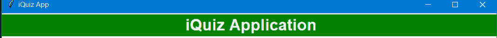
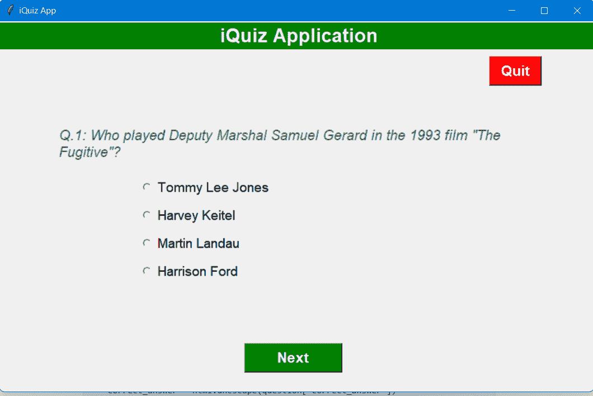
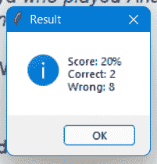

# 如何使用 Tkinter 和 Open Trivia DB 构建 GUI 问答 App

> 原文：<https://www.freecodecamp.org/news/how-to-create-a-gui-quiz-application-using-tkinter-and-open-trivia-db/>

在本文中，我们将学习使用 [Tkinter](https://docs.python.org/3/library/tkinter.html) Python 内置模块构建一个[图形用户界面](https://en.wikipedia.org/wiki/Graphical_user_interface) (GUI) **测验应用程序**。

任务是提出选择题，收集用户答案，最后显示结果。

在编写 GUI 之前，我们将首先看看如何从 [Open Trivia DB API](https://opentdb.com/) 中获取多项选择题、它们的正确答案以及选项。

**开放琐事数据库**提供了一个完全免费的 JSON API，你可以在你的编程项目中使用它。使用这个 API **不需要**一个 API 密钥。为了使任务更有趣，我们还将随机选择顺序。

观看此视频，了解我们在构建什么:

[https://www.youtube.com/embed/2hYci86bmjs?feature=oembed](https://www.youtube.com/embed/2hYci86bmjs?feature=oembed)

我们将在本项目中使用以下模块和概念:

*   tkinter 是 Python 的一个标准 GUI 库，使用它我们可以构建桌面应用。这是我们项目的基础，我们将使用它来创建应用程序的用户界面。
*   [随机模块](https://docs.python.org/3/library/random.html)实现各种分布的伪随机数发生器。本模块将帮助我们调整问题的选项。
*   [请求库](https://pypi.org/project/requests/)允许我们极其容易地发送 HTTP/1.1 请求。我们需要图书馆从开放的琐事数据库获取问题。
*   Python 类是创建对象的蓝图。对象是真实世界的实体。在整个项目开发过程中，我们将把不同的功能分成不同的类和方法。

## 项目的工作流程

应用程序的基本工作流程如下:

1.  我们将从开放的琐事数据库 API 中获取问题。
2.  对于每个提取的问题，我们将使用一个*问题*类创建一个不同的对象。所有这些*问题*对象将被追加到一个`question_bank`列表中。
3.  这个`question_bank`将被传递给应用程序的大脑， *QuizBrain* 和一个`quiz`对象将被创建*。这个类将负责检查是否有更多的问题，获取下一个问题，计算分数，等等。*
4.  最后，这个`quiz`对象将被传递给 *QuizInterface* 类，用户将能够与它进行交互。

好吧，让我们开始吧！

## 如何从 Open Trivia DB API 获取问题

正如我们上面讨论的，我们将使用 Open Trivia DB API 来获取问题。前往他们的 API ，选择你想要的问题数量，以及类别和难度。

题型应为*多选*，编码应为*默认编码*。点击 Generate API URL，您将得到一个 API URL。

下面是一个示例 API URL: `https://opentdb.com/api.php?amount=10&type=multiple`

为了提取问题，我们将使用`requests`模块。您可以这样安装它:

```
$ pip install requests
```

让我们创建一个 Python 文件`quiz_data.py`来使用上面生成的 API URL 获取测验问题和答案。

```
import requests

parameters = {
    "amount": 10,
    "type": "multiple"
}

response = requests.get(url="https://opentdb.com/api.php", params=parameters)
question_data = response.json()["results"]
```

在上面的脚本中，我们没有在 URL 中直接添加`amount`和`type`参数，而是创建了一个`parameters`字典并添加了各自的值。

之后，我们使用 Open Trivia DB API URL 上的*请求*库发出 **GET** 请求。一个示例 JSON 响应如下所示:

```
{
  "response_code": 0,
  "results": [
    {
      "category": "Entertainment: Video Games",
      "type": "multiple",
      "difficulty": "hard",
      "question": "What was the name of the hero in the 80s animated video game &#039;Dragon&#039;s Lair&#039;?",
      "correct_answer": "Dirk the Daring",
      "incorrect_answers": ["Arthur", "Sir Toby Belch", "Guy of Gisbourne"]
    },
    {
      "category": "Entertainment: Video Games",
      "type": "multiple",
      "difficulty": "medium",
      "question": "Which of these game franchises were made by Namco?",
      "correct_answer": "Tekken",
      "incorrect_answers": ["Street Fighter", "Mortal Kombat", "Dragon Quest"]
    }
  ]
}
```

JSON 数据包含一个带有两个键的字典:`response_code`和`results`。`response_code`告诉开发者 API 在做什么。`results`是我们感兴趣的列表。因此，我们将结果的值存储在一个名为`question_data`的变量中。

## 如何创建问题模型

问题模型不过是一个 Python 类，有三个属性——`question_text`、`correct_answer`和`choices`。

*question_text* 是问题， *correct_answer* 是该问题的正确答案， *choices* 是该问题的选项列表。

让我们创建一个`question_model.py`文件，并在其中创建类:

```
class Question:
    def __init__(self, question: str, correct_answer: str, choices: list):
        self.question_text = question
        self.correct_answer = correct_answer
        self.choices = choices
```

## 如何创造智力竞赛大脑

顾名思义， *QuizBrain* 是应用程序的大脑。让我们创建一个`quiz_brain.py`文件，并在其中添加以下代码:

```
class QuizBrain:

    def __init__(self, questions):
        self.question_no = 0
        self.score = 0
        self.questions = questions
        self.current_question = None

    def has_more_questions(self):
        """To check if the quiz has more questions"""

        return self.question_no < len(self.questions)

    def next_question(self):
        """Get the next question by incrementing the question number"""

        self.current_question = self.questions[self.question_no]
        self.question_no += 1
        q_text = self.current_question.question_text
        return f"Q.{self.question_no}: {q_text}"

    def check_answer(self, user_answer):
        """Check the user's answer against the correct answer and maintain the score"""

        correct_answer = self.current_question.correct_answer
        if user_answer.lower() == correct_answer.lower():
            self.score += 1
            return True
        else:
            return False

    def get_score(self):
        """Get the number of correct answers, wrong answers, and score percentage."""

        wrong = self.question_no - self.score
        score_percent = int(self.score / self.question_no * 100)
        return (self.score, wrong, score_percent)
```

`QuizBrain`类接受一个问题列表`questions`。另外，`question_no`和`score`属性用`0`初始化，并且`current_question`最初被设置为`None`。

第一种方法`has_more_questions()`检查测验是否有更多问题。

下一个方法`next_question()`从索引`question_no`处的`questions`列表中获取问题，然后递增`question_no`属性并返回格式化的问题。

`check_answer()`方法以`user_answer`为自变量，检查用户的答案是否正确。它还维护*分数*并返回布尔值。

最后一个方法`get_score()`返回*正确答案*、*错误答案、*、*分数百分比*的数量。

## 如何构建测验用户界面

让我们继续下一部分，我们将创建应用程序的用户界面。为这个部分创建一个`quiz_ui.py`文件，并添加以下代码。

```
class QuizInterface:

    def __init__(self, quiz_brain: QuizBrain) -> None:
        self.quiz = quiz_brain
        self.window = Tk()
        self.window.title("iQuiz App")
        self.window.geometry("850x530")

        # Display Title
        self.display_title()

        # Creating a canvas for question text, and dsiplay question
        self.canvas = Canvas(width=800, height=250)
        self.question_text = self.canvas.create_text(400, 125,
                                                     text="Question here",
                                                     width=680,
                                                     fill=THEME_COLOR,
                                                     font=(
                                                         'Ariel', 15, 'italic')
                                                     )
        self.canvas.grid(row=2, column=0, columnspan=2, pady=50)
        self.display_question()

        # Declare a StringVar to store user's answer
        self.user_answer = StringVar()

        # Display four options(radio buttons)
        self.opts = self.radio_buttons()
        self.display_options()

        # To show whether the answer is correct or wrong
        self.feedback = Label(self.window, pady=10, font=("ariel", 15, "bold"))
        self.feedback.place(x=300, y=380)

        # Next and Quit Button
        self.buttons()

        # Mainloop
        self.window.mainloop()
```

在上面的代码中，我们用构造函数创建了一个 *QuizInterface* 类。在 Python 中，`__init__()`方法被称为构造函数，每当创建该类的对象时都会被自动调用。

正如工作流中所讨论的， *QuizInterface* 类接受类型为 *QuizBrain* 的参数。因此，在构造函数中，我们将它作为`quiz_brain`传递。

我们在 Tkinter 中做的第一件事是使用 *Tk* 类创建一个窗口。您可以分别使用`title()`和`geometry()`方法设置标题和几何图形。

接下来，我们调用了几个方法，这是我们接下来要创建的。除此之外，我们使用 *Canvas* 类创建了一个画布，我们的问题将放在那里。画布是一个矩形区域，我们可以在其中放置文本、图形、小部件等等。

在画布内部，我们现在使用`create_text()`方法添加了一个示例文本。然后，我们声明了一个名为`user_answer`的 StringVar 变量，以字符串类型存储用户的答案。

接下来，我们使用*标签*小部件创建了一个`feedback`标签来显示答案是对还是错。这个小部件实现了一个显示框，我们可以在其中放置文本或图像。您可以随时更新此小部件显示的文本。

在最后，我们进入主事件循环，对用户使用`mainloop()`方法触发的每个事件采取行动。现在，让我们创建将在这个构造函数中使用的其他方法。

### 要显示标题

```
def display_title(self):
    """To display title"""

    title = Label(self.window, text="iQuiz Application",
                      width=50, bg="green", fg="white", font=("ariel", 20, "bold"))
    title.place(x=0, y=2)
```

为了显示标题，我们在主窗口上创建了一个*标签*小部件。我们设置它的`width`、`bg`、`fg`和`font`属性，它看起来像这样:



### 要显示问题

正如我们所知，我们已经为问题文本创建了一个画布。由于`question_no`在 *QuizBrain* 类中被初始化为 0，我们可以使用`next_question()`方法得到问题:

```
def display_question(self):
    """To display the question"""

    q_text = self.quiz.next_question()
    self.canvas.itemconfig(self.question_text, text=q_text)
```

使用*画布*类中的`itemconfig()`方法，我们可以动态添加问题文本。

### 要创建单选按钮

由于选项将是四个单选按钮，我们将使用 Tkinter 模块中的 *RadioButton* 类。

```
def radio_buttons(self):
        """To create four options (radio buttons)"""
	# initialize the list with an empty list of options
    choice_list = []

    # position of the first option
    y_pos = 220

    # adding the options to the list
    while len(choice_list) < 4:

        # setting the radio button properties
        radio_btn = Radiobutton(self.window, text="", variable=self.user_answer, value='', font=("ariel", 14))

        # adding the button to the list
        choice_list.append(radio_btn)

        # placing the button
        radio_btn.place(x=200, y=y_pos)

        # incrementing the y-axis position by 40
        y_pos += 40

    # return the radio buttons
    return choice_list
```

首先，我们创建了一个`choice_list`列表。我们将第一个选择的 y 位置设置为 220。使用 while 循环，我们在主窗口上创建了 RadioButton 类的四个实例。注意我们之前创建的设置为`user_answer`的变量属性。

我们将把这些单选按钮附加到`choice_list`中，并将它们放置在 y 轴上 40 个单位的距离处。然后我们返回`choice_list`。

### 要显示选项

我们将使用这个方法来设置每个单选按钮的`text`和`value`属性。

```
def display_options(self):
    """To display four options"""

    val = 0

    # deselecting the options
    self.user_answer.set(None)

    # looping over the options to be displayed for the
    # text of the radio buttons.
    for option in self.quiz.current_question.choices:
        self.opts[val]['text'] = option
        self.opts[val]['value'] = option
        val += 1
```

我们首先将`user_answer`设置为 None。然后我们迭代`current_question`的`choices`，并为每个选项一个接一个地设置两个属性。

### 要显示按钮

如您所见，我们有两个按钮——下一步和退出。



我们将使用“下一步”按钮进入下一个问题(如果有)。我们将使用“退出”按钮退出测验，并立即销毁窗口。

我们使用 Tkinter 模块中的*按钮*类来创建它们。这些按钮的功能添加在`command`属性中。

对于下一个按钮，我们将在本节之后创建一个单独的方法。对于退出按钮，我们只是破坏主窗口。

### 下一步按钮功能

```
def next_btn(self):
    """To show feedback for each answer and keep checking for more questions"""

    # Check if the answer is correct
    if self.quiz.check_answer(self.user_answer.get()):
        self.feedback["fg"] = "green"
        self.feedback["text"] = 'Correct answer! \U0001F44D'
    else:
        self.feedback['fg'] = 'red'
        self.feedback['text'] = ('\u274E Oops! \n'
                                     f'The right answer is: {self.quiz.current_question.correct_answer}')

    if self.quiz.has_more_questions():
        # Moves to next to display next question and its options
        self.display_question()
        self.display_options()
    else:
        # if no more questions, then it displays the score
        self.display_result()

        # destroys the self.window
        self.window.destroy()
```

下一个按钮要做很多事情。

首先，它使用`check_answer`方法检查用户选择的答案是否正确。它会相应地显示反馈。

接下来，它检查测验是否有更多的问题。如果还有问题，它会再次调用`display_question`和`display_options`方法。如果没有问题了，它调用`display_result`方法来显示结果，然后破坏主窗口。

### 为了显示结果

在测验结束时，我们需要像这样向用户显示结果:



在这里，正如你所看到的，我们显示了正确答案和错误答案的分数百分比。

```
def display_result(self):
    """To display the result using messagebox"""
    correct, wrong, score_percent = self.quiz.get_score()

    correct = f"Correct: {correct}"
    wrong = f"Wrong: {wrong}"

    # calculates the percentage of correct answers
    result = f"Score: {score_percent}%"

    # Shows a message box to display the result
    messagebox.showinfo("Result", f"{result}\n{correct}\n{wrong}")
```

我们使用`get_score`方法得到计算结果，然后我们使用来自`messagebox`类的`showinfo`方法显示这样一个弹出消息。

### `quiz_ui.py`的完整代码

```
from tkinter import Tk, Canvas, StringVar, Label, Radiobutton, Button, messagebox
from quiz_brain import QuizBrain

THEME_COLOR = "#375362"

class QuizInterface:

    def __init__(self, quiz_brain: QuizBrain) -> None:
        self.quiz = quiz_brain
        self.window = Tk()
        self.window.title("iQuiz App")
        self.window.geometry("850x530")

        # Display Title
        self.display_title()

        # Create a canvas for question text, and dsiplay question
        self.canvas = Canvas(width=800, height=250)
        self.question_text = self.canvas.create_text(400, 125,
                                                     text="Question here",
                                                     width=680,
                                                     fill=THEME_COLOR,
                                                     font=(
                                                         'Ariel', 15, 'italic')
                                                     )
        self.canvas.grid(row=2, column=0, columnspan=2, pady=50)
        self.display_question()

        # Declare a StringVar to store user's answer
        self.user_answer = StringVar()

        # Display four options (radio buttons)
        self.opts = self.radio_buttons()
        self.display_options()

        # To show whether the answer is right or wrong
        self.feedback = Label(self.window, pady=10, font=("ariel", 15, "bold"))
        self.feedback.place(x=300, y=380)

        # Next and Quit Button
        self.buttons()

        # Mainloop
        self.window.mainloop()

    def display_title(self):
        """To display title"""

        # Title
        title = Label(self.window, text="iQuiz Application",
                      width=50, bg="green", fg="white", font=("ariel", 20, "bold"))

        # place of the title
        title.place(x=0, y=2)

    def display_question(self):
        """To display the question"""

        q_text = self.quiz.next_question()
        self.canvas.itemconfig(self.question_text, text=q_text)

    def radio_buttons(self):
        """To create four options (radio buttons)"""

        # initialize the list with an empty list of options
        choice_list = []

        # position of the first option
        y_pos = 220

        # adding the options to the list
        while len(choice_list) < 4:

            # setting the radio button properties
            radio_btn = Radiobutton(self.window, text="", variable=self.user_answer,
                                    value='', font=("ariel", 14))

            # adding the button to the list
            choice_list.append(radio_btn)

            # placing the button
            radio_btn.place(x=200, y=y_pos)

            # incrementing the y-axis position by 40
            y_pos += 40

        # return the radio buttons
        return choice_list

    def display_options(self):
        """To display four options"""

        val = 0

        # deselecting the options
        self.user_answer.set(None)

        # looping over the options to be displayed for the
        # text of the radio buttons.
        for option in self.quiz.current_question.choices:
            self.opts[val]['text'] = option
            self.opts[val]['value'] = option
            val += 1

    def next_btn(self):
        """To show feedback for each answer and keep checking for more questions"""

        # Check if the answer is correct
        if self.quiz.check_answer(self.user_answer.get()):
            self.feedback["fg"] = "green"
            self.feedback["text"] = 'Correct answer! \U0001F44D'
        else:
            self.feedback['fg'] = 'red'
            self.feedback['text'] = ('\u274E Oops! \n'
                                     f'The right answer is: {self.quiz.current_question.correct_answer}')

        if self.quiz.has_more_questions():
            # Moves to next to display next question and its options
            self.display_question()
            self.display_options()
        else:
            # if no more questions, then it displays the score
            self.display_result()

            # destroys the self.window
            self.window.destroy()

    def buttons(self):
        """To show next button and quit button"""

        # The first button is the Next button to move to the
        # next Question
        next_button = Button(self.window, text="Next", command=self.next_btn,
                             width=10, bg="green", fg="white", font=("ariel", 16, "bold"))

        # palcing the button on the screen
        next_button.place(x=350, y=460)

        # This is the second button which is used to Quit the self.window
        quit_button = Button(self.window, text="Quit", command=self.window.destroy,
                             width=5, bg="red", fg="white", font=("ariel", 16, " bold"))

        # placing the Quit button on the screen
        quit_button.place(x=700, y=50)

    def display_result(self):
        """To display the result using messagebox"""
        correct, wrong, score_percent = self.quiz.get_score()

        correct = f"Correct: {correct}"
        wrong = f"Wrong: {wrong}"

        # calculates the percentage of correct answers
        result = f"Score: {score_percent}%"

        # Shows a message box to display the result
        messagebox.showinfo("Result", f"{result}\n{correct}\n{wrong}")
```

## 如何将所有东西放在一起

由于所有组件都已准备好集成在一起，让我们创建一个`main.py`文件，并在其中添加以下内容:

```
from question_model import Question
from quiz_data import question_data
from quiz_brain import QuizBrain
from quiz_ui import QuizInterface
from random import shuffle
import html

question_bank = []
for question in question_data:
    choices = []
    question_text = html.unescape(question["question"])
    correct_answer = html.unescape(question["correct_answer"])
    incorrect_answers = question["incorrect_answers"]
    for ans in incorrect_answers:
        choices.append(html.unescape(ans))
    choices.append(correct_answer)
    shuffle(choices)
    new_question = Question(question_text, correct_answer, choices)
    question_bank.append(new_question)

quiz = QuizBrain(question_bank)

quiz_ui = QuizInterface(quiz)

print("You've completed the quiz")
print(f"Your final score was: {quiz.score}/{quiz.question_no}")
```

我们首先从上面创建的不同文件中导入所有的类。除此之外，我们还需要来自`random`模块和`html`模块的`shuffle`方法。

我们有一个名为`question_bank`的列表。我们正在迭代从`quiz_data.py`文件接收的`question_data`。如果您看到示例响应，您会发现一些文本，如`&#039;Dragon&#039`。这些需要使用`html.unescape`方法来避免。

我们有一个包含正确答案和错误答案的`choices`列表。该列表将使用来自`random`模块的`shuffle`方法进行洗牌。

洗牌之后，我们使用来自`quiz_model.py`文件的`Question`模型创建一个问题，并将其附加到`question_bank`列表中。

接下来，我们创建一个名为 *QuizBrain* 类的对象`quiz`，它需要一个问题列表。所以，我们把`question_bank`传递给它。

之后，我们创建了一个 *QuizInterface* 类的对象`quiz_ui`，它需要一个 QuizBrain 类的对象，所以我们将新创建的`quiz`对象传递给它。

现在一切都准备好了，我们准备运行应用程序。

```
$ python main.py
```

## 结论

恭喜你坚持到最后！这是一个关于如何使用 Tkinter 构建 GUI 测试应用程序的基础教程。如果你想的话，你可以添加更多的特性，让用户界面更有吸引力。

这里是代码库:[https://github.com/ashutoshkrris/GUI-Quiz-Tkinter](https://github.com/ashutoshkrris/GUI-Quiz-Tkinter)

对于 Windows，您可以从[这里](https://github.com/ashutoshkrris/GUI-Quiz-Tkinter/raw/master/quiz.exe)下载可执行的应用程序。