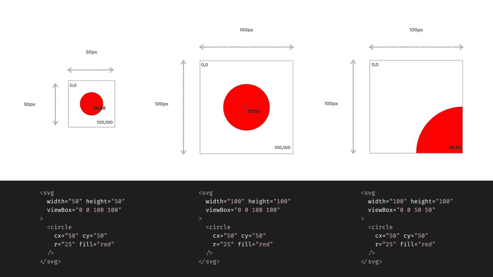
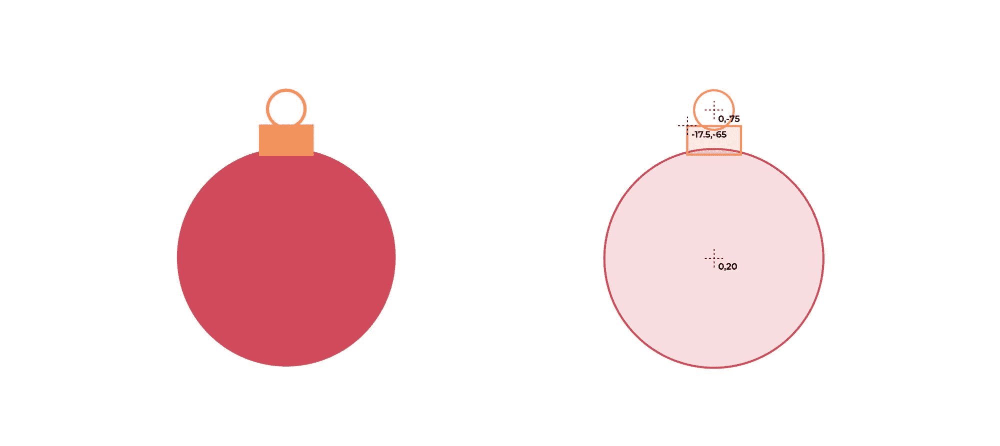
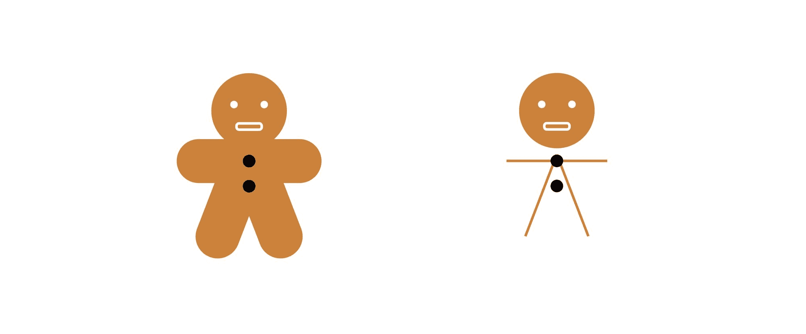
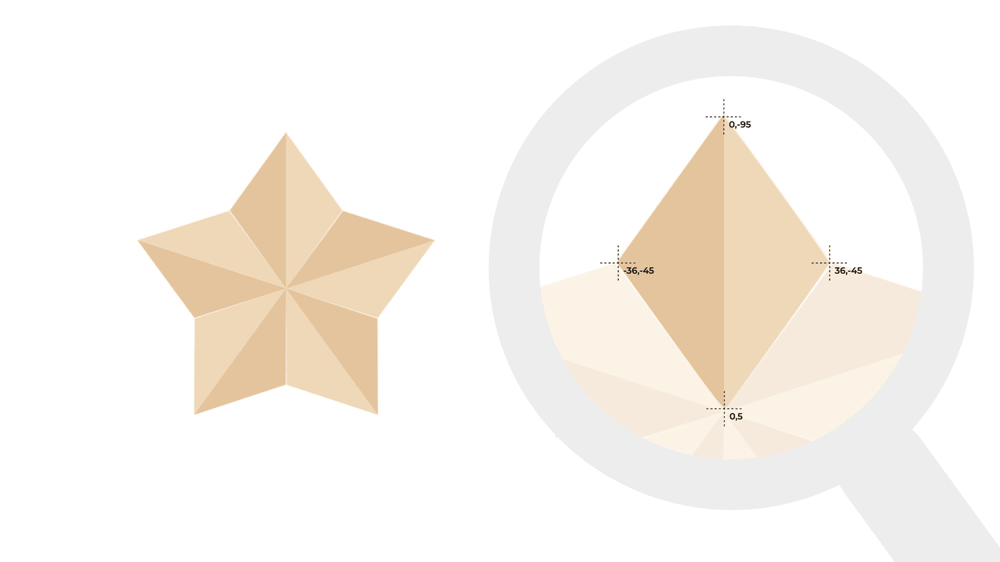
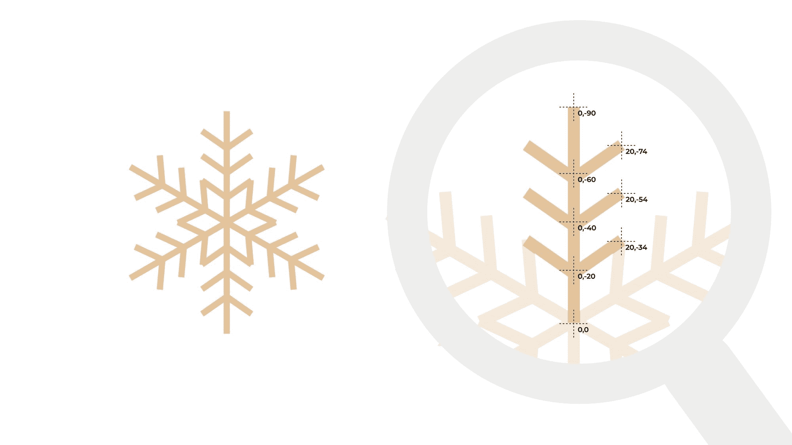
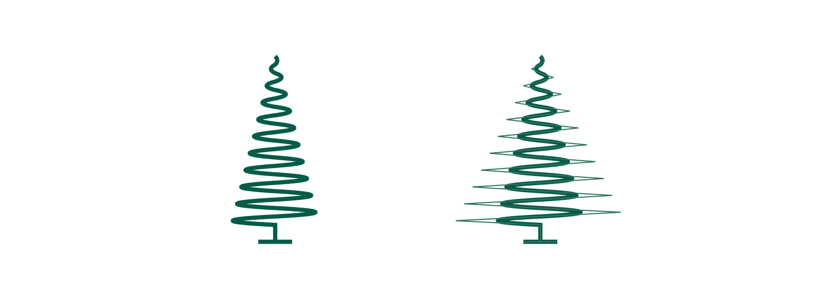
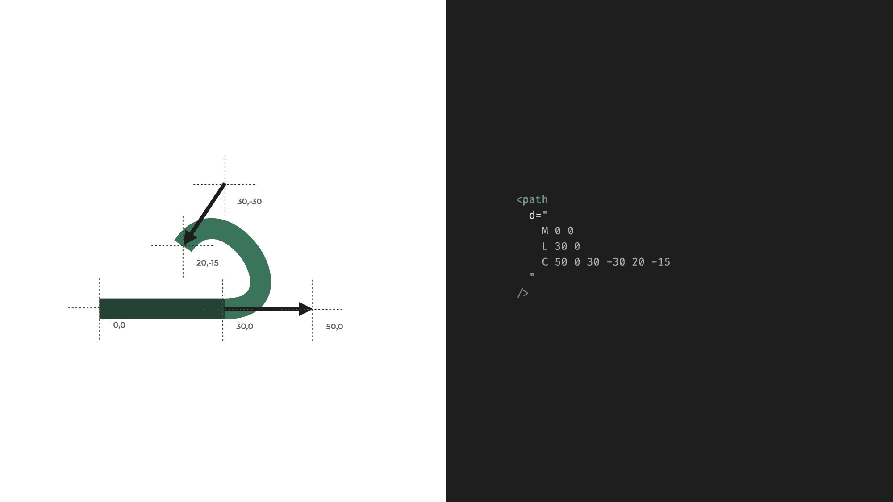
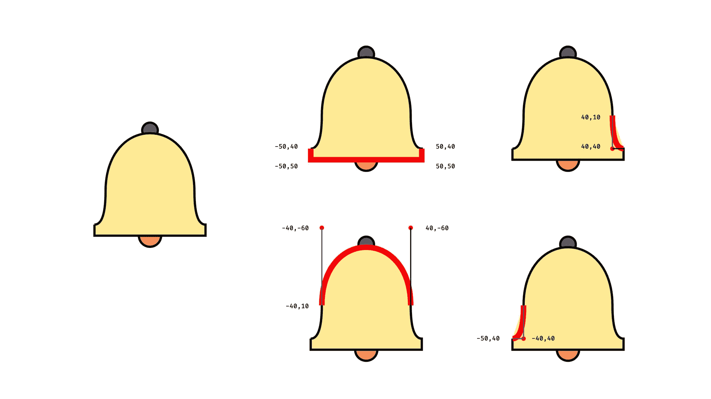

# SVG 教程——如何用 7 个例子编码图像

> 原文：<https://www.freecodecamp.org/news/svg-tutorial-learn-to-code-images/>

你的网站需要一个图标，但是你找不到合适的吗？或者，也许你想有一个简单的图，但不想为此学习一个全新的库？

好消息是——你不用离开你最喜欢的代码编辑器或使用任何第三方工具或库，就可以完成所有这些甚至更多。

从 HTML5 开始，我们可以在 HTML 文档中包含 SVG 图像的代码。我们甚至不需要使用引用单独文件的图像标签。我们可以将图像的代码嵌入到 HTML 中。我们可以这样做，因为 SVG 的语法与 HTML 非常相似。

这提供了很多很酷的选择。突然间，我们可以从 JavaScript 访问图像的一部分，或者从 CSS 设置样式。我们可以用 JavaScript 将图像的一部分制作成动画，或者使其具有交互性。或者我们可以反过来从代码中生成图形。

对于更复杂的图像，您仍将使用设计工具。但是下次你需要一个简单的图标、图表或动画时，也许你可以自己编码。

那么 SVG 在表面之下是什么样子的呢？在本教程中，我们将浏览几个 SVG 的源代码，以了解基础知识。

([将本文作为视频观看](https://youtu.be/kBT90nwUb_o)，其中有更多有趣的例子。)

## SVG 标签

首先，我们得谈谈`svg`标签本身。这个标签包含了图像元素并定义了图像的框架。它设置图像的内部尺寸和外部尺寸。

`width`和`height`属性定义了图像在浏览器中占据的空间。通常还有一处`viewBox`房产。这为图像内部的元素定义了一个坐标系。这两个可能会混淆，因为它们都定义了一个大小。

您可以将 SVG 的`width`和`height`视为外部尺寸，将`viewBox`视为内部尺寸。

由`width`和`height`定义的大小是 HTML 的其余部分如何看待图像以及它在浏览器中显示的大小。由`viewBox`定义的尺寸是当图像元素在图像中定位时，它们对图像的看法。

在下一个例子中，我们有三个内容完全相同的 SVG。具有相同中心坐标和相同半径的`circle`元素。不过，它们看起来很不一样。



在中间的例子中，由`width`和`height`定义的尺寸与由`viewbox`定义的尺寸相匹配。在第一个例子中，我们看到如果`width`和`height`变小会发生什么。图像只是缩小，因为图像中定义的所有坐标和大小仍然与`viewbox`对齐。

在最后一个例子中，我们看到如果`viewbox`只聚焦在图像的一部分上会发生什么。在这种情况下，东西看起来更大，但是图像的实际大小仍然由`width`和`height`属性定义。

`viewBox`还定义了图像项目放置的坐标系中心。

前两个数字定义哪个坐标应该在图像的左上角。坐标向右下方增长。在本文中，我们将中心坐标系。0，0 坐标将始终位于图像的中间。

开始前有一点要注意。虽然我们可以在 HTML 文件中内联 SVG 图像，但这并不意味着我们可以自由地将任何 SVG 标记与任何 HTML 标记组合在一起。

SVG 标签表示图像的框架，每个 SVG 元素都必须包含在一个 SVG 标签中。反方向也是如此。HTML 标签不能在 SVG 标签中，所以我们不能在 SVG 中有 div 或 header 标签。不过不用担心，也有类似的标签可用。

## 如何用 SVG 制作圣诞装饰品

让我们从一个简单的圣诞树装饰品开始。这里我们只使用简单的形状。一个长方形和两个圆形。

我们将用属性来定位和样式化这些元素。对于圆形，我们定义中心位置，对于矩形，我们定义左上角。这些位置总是与视图框定义的坐标系相关。



```
<html>
  <svg width="200" height="200" viewBox="-100 -100 200 200”>
    <circle cx="0" cy="20" r="70" fill="#D1495B" />

    <circle
      cx="0"
      cy="-75"
      r="12"
      fill="none"
      stroke="#F79257"
      stroke-width="2"
    />

    <rect x="-17.5" y="-65" width="35" height="20" fill="#F79257" />
  </svg>
</html>
```

请记住，我们将坐标系的中心移动到图像的中间，X 轴向右增长，Y 轴向底部增长。

我们也有描述我们形状的属性。与 HTML 不同，我们不使用`background-color`来设置形状的颜色，而是使用`fill`属性。

为了设置形状的边界，我们使用了`stroke`和`stroke-width`。请注意我们如何使用 circle 元素来绘制具有不同属性的环和球。

## 如何用 SVG 构建圣诞树

让我们继续看圣诞树。我们不能总是用基本的形状来组合我们的形象。多边形是绘制自由形状的最简单方法。这里我们设置了一个用直线连接的点的列表。


```
<html>
  <svg width="200" height="200" viewBox="-100 -100 200 200">
    <polygon points="0,0 80,120 -80,120" fill="#234236" />
    <polygon points="0,-40 60,60 -60,60" fill="#0C5C4C" />
    <polygon points="0,-80 40,0 -40,0" fill="#38755B" />
    <rect x="-20" y="120" width="40" height="30" fill="brown" />
  </svg>
</html>
```

你可能想知道在开始编码之前我们如何知道我们的坐标应该在哪里。

说实话，这需要一点想象力。你可以从纸笔开始，先画个草稿，得到一个估价。或者你可以只是猜测，然后调整你的价值观，直到它看起来不错。

## 如何用 SVG 制作姜饼图形

让我们继续看姜饼图。因为我们的 SVG 现在存在于 HTML 文件中，所以我们可以为每个标签分配 CSS 类，并将一些属性转移到 CSS 中。

但是，我们只能移动表示属性。位置属性和定义形状的属性仍然必须留在 HTML 中。但是我们可以将颜色、笔画和字体属性移到 CSS 中。



```
<svg class="gingerbread" width="200" height="200" viewBox="-100 -100 200 200">
  <circle class="body" cx="0" cy="-50" r="30" />

  <circle class="eye" cx="-12" cy="-55" r="3" />
  <circle class="eye" cx="12" cy="-55" r="3" />
  <rect class="mouth" x="-10" y="-40" width="20" height="5" rx="2" />

  <line class="limb" x1="-40" y1="-10" x2="40" y2="-10" />
  <line class="limb" x1="-25" y1="50" x2="0" y2="-15" />
  <line class="limb" x1="25" y1="50" x2="0" y2="-15" />

  <circle class="button" cx="0" cy="-10" r="5" />
  <circle class="button" cx="0" cy="10" r="5" />
</svg>
```

```
.gingerbread .body {
  fill: #cd803d;
}

.gingerbread .eye {
  fill: white;
}

.gingerbread .mouth {
  fill: none;
  stroke: white;
  stroke-width: 2px;
}

.gingerbread .limb {
  stroke: #cd803d;
  stroke-width: 35px;
  stroke-linecap: round;
}
```

我们已经看到了填充和一些笔画属性，但是这里还有一个——`stroke-linecap`。这可以使我们的线帽圆。

请注意，腿和手臂在这里是简单的线条。如果我们去掉线帽，设置一个更小的`stroke-width`，那么我们可以看到这些都是简单的线。但是通过设置一个粗的线条宽度和一个圆形线帽，我们可以为我们的身材塑造腿部和手臂。

还要注意定义嘴的矩形处的`rx`属性。这将使边缘变圆。你愿意的话可以把它想成`border-radius`。

## 如何用 SVG 造星

让我们继续看一颗星星。星星是一个简单的形状，所以我们可以将其定义为一堆多边形，并单独设置每个点。但是我们需要知道每个坐标。

相反，我们可以将一个翅膀定义为一组，然后旋转五次，得到星星的形状。我们使用`transform`属性来设置旋转。



```
<svg width="200" height="200" viewBox="-100 -100 200 200">      
  <g transform="translate(0 5)">
    <g>
      <polygon points="0,0 36,-50 0,-100" fill="#EDD8B7" />
      <polygon points="0,0 -36,-50 0,-100" fill="#E5C39C" />
    </g>
    <g transform="rotate(72)">
      <polygon points="0,0 36,-50 0,-100" fill="#EDD8B7" />
      <polygon points="0,0 -36,-50 0,-100" fill="#E5C39C" />
    </g>
    <g transform="rotate(-72)">
      <polygon points="0,0 36,-50 0,-100" fill="#EDD8B7" />
      <polygon points="0,0 -36,-50 0,-100" fill="#E5C39C" />
    </g>
    <g transform="rotate(144)">
      <polygon points="0,0 36,-50 0,-100" fill="#EDD8B7" />
      <polygon points="0,0 -36,-50 0,-100" fill="#E5C39C" />
    </g>
    <g transform="rotate(-144)">
      <polygon points="0,0 36,-50 0,-100" fill="#EDD8B7" />
      <polygon points="0,0 -36,-50 0,-100" fill="#E5C39C" />
    </g>
  </g>
</svg>
```

在本例中，每个机翼由两个多边形组成。它们需要以同样的方式旋转，所以我们可以用一个`g`标签将它们分组，然后用`rotate`将它们放在一起。

你可以把`g`标签想象成 HTML 中的`div`标签。就其本身而言，它不代表任何东西。但是它可以包含在组标签上定义的应用于其子元素的其他元素和属性。

可以嵌入组。与外围组一起，我们将整个恒星向下移动了 5 个单位。

## 如何用 SVG 制作雪花

对元素进行分组是一个很好的技巧，但是我们必须对每个翅膀重复相同的代码五次。

除了一遍又一遍地重复相同的代码，我们还可以为一个形状创建一个定义，并通过`id`重用它。这里我们定义一个雪花的分支，然后用不同的旋转使用它六次。



```
<svg width="200" height="200" viewBox="-100 -100 200 200">
  <defs>
    <path
      id="branch"
      d="
        M 0 0 L 0 -90
        M 0 -20 L 20 -34
        M 0 -20 L -20 -34
        M 0 -40 L 20 -54
        M 0 -40 L -20 -54
        M 0 -60 L 20 -74
        M 0 -60 L -20 -74"
      stroke="#E5C39C"
      stroke-width="5"
    />
  </defs>

  <use href="#branch" />
  <use href="#branch" transform="rotate(60)" />
  <use href="#branch" transform="rotate(120)" />
  <use href="#branch" transform="rotate(180)" />
  <use href="#branch" transform="rotate(240)" />
  <use href="#branch" transform="rotate(300)" />
</svg>
```

分支被定义为`path`。`path`是最强大的 SVG 标签。我们可以用路径定义几乎任何东西，如果你打开任何 SVG 文件，你会看到大部分路径。

路径的形状由`d`属性定义。这里我们定义了几个绘图命令。命令总是以定义命令类型的字母开头，以坐标结尾。

这里我们只有两个最简单的命令，move to ( `M`)和 line to ( `L`)。“移动到”命令将光标移动到一个点，而不绘制直线,“直线到”命令从上一个点绘制一条直线。

一个命令总是延续前一个命令，所以当我们画线时，我们只定义端点。起点将是前一个命令的终点。

这个路径有点不寻常，因为其中有几个 move to 命令，用相同的路径绘制主分支和每个分支。

## 如何用 SVG 制作曲线树

当我们开始使用曲线时，路径元素变得非常强大。其中之一是二次贝塞尔曲线，它不仅定义了线段的端点，还具有控制点。控制点是一个看不见的坐标，线向它弯曲，但不接触它。



```
<svg width="200" height="400" viewBox="-100 -200 200 400">
  <path
    d="
      M 0 -80
      Q 5 -75 0 -70
      Q -10 -65 0 -60
      Q 15 -55 0 -50
      Q -20 -45 0 -40
      Q 25 -35 0 -30
      Q -30 -25 0 -20
      Q 35 -15 0 -10
      Q -40 -5 0 0
      Q 45 5 0 10
      Q -50 15 0 20
      Q 55 25 0 30
      Q -60 35 0 40
      Q 65 45 0 50
      Q -70 55 0 60
      Q 75 65 0 70
      Q -80 75 0 80
      Q 85 85 0 90
      Q -90 95 0 100
      Q 95 105 0 110
      Q -100 115 0 120
      L 0 140
      L 20 140
      L -20 140"
    fill="none"
    stroke="#0C5C4C"
    stroke-width="5"
  />
</svg>
```

这里我们有一系列二次 Béziers 曲线(`Q`)，随着路径的下降，控制点离树的中心越来越远。

## 如何用 SVG 制作铃铛

虽然当我们想要弯曲一条线时，二次贝塞尔曲线(`Q`)很棒，但它通常不够灵活。

使用三次贝塞尔曲线(`C`)，我们不仅有一个控制点，还有两个。第一个控制点设置曲线的初始方向，第二个控制点定义曲线到达终点的方向。

如果这些方向与曲线前的线和曲线后的线的方向匹配，那么我们在路径段之间有一个平滑的过渡。



下一个例子使用二次和三次贝塞尔曲线构成一个钟形。这里这个钟的底部用直线来定义。然后一个二次 Béziers 启动了钟形斗篷。接下来，三次贝塞尔曲线平滑地延续二次贝塞尔曲线，形成钟形的顶部。然后我们用另一个二次贝塞尔曲线到达底部。



```
<svg width="200" height="200" viewBox="-100 -100 200 200">
  <g stroke="black" stroke-width="2">
    <circle cx="0" cy="-45" r="7" fill="#4F6D7A" />
    <circle cx="0" cy="50" r="10" fill="#F79257" />
    <path
      d="
        M -50 40
        L -50 50
        L 50 50
        L 50 40
        Q 40 40 40 10
        C 40 -60 -40 -60 -40 10   
        Q -40 40 -50 40"
      fill="#FDEA96"
    />
 </g>
</svg>
```

## 下一步——让 SVG 与 JavaScript 交互

在幕后，SVG 一开始可能会很混乱。很多坐标，字母和奇怪的参数。一旦你理解了它们的基础，你就可以利用它们，并开始编码图像。

我们才刚刚开始。将 JavaScript 加入其中将会引入一个全新的层次。

在下一篇文章中，我们将介绍如何让 SVG 与 JavaScript 交互。但是如果你等不及了，你可以看看我的 YouTube 教程中的一些更高级的例子，其中有 17 个关于如何在你的下一个项目中使用 SVGs 的例子！

[https://www.youtube.com/embed/kBT90nwUb_o?feature=oembed](https://www.youtube.com/embed/kBT90nwUb_o?feature=oembed)

### ******订阅更多 Web 开发教程:******

[Hunor Márton BorbélyGame development with JavaScript, creative coding tutorials, HTML canvas, SVG, Three.js, and some React and Vue https://twitter.com/HunorBorbelyhttps://codepen.io/HunorMarton…YouTube](https://www.youtube.com/channel/UCxhgW0Q5XLvIoXHAfQXg9oQ)