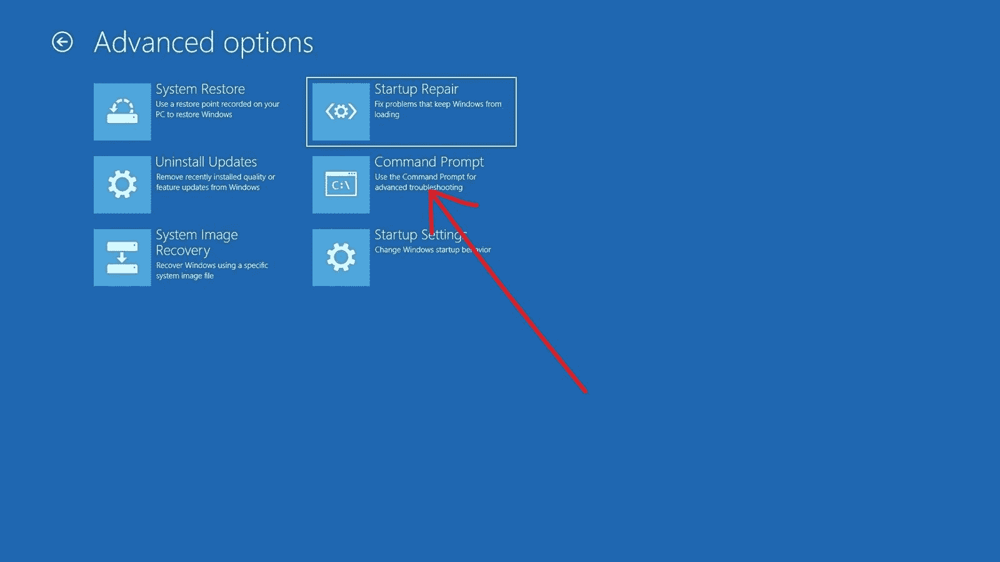
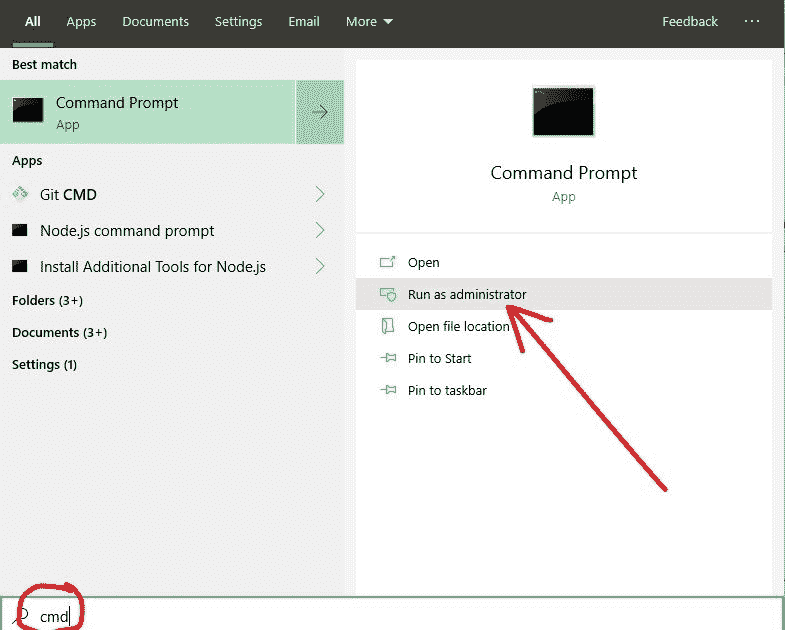
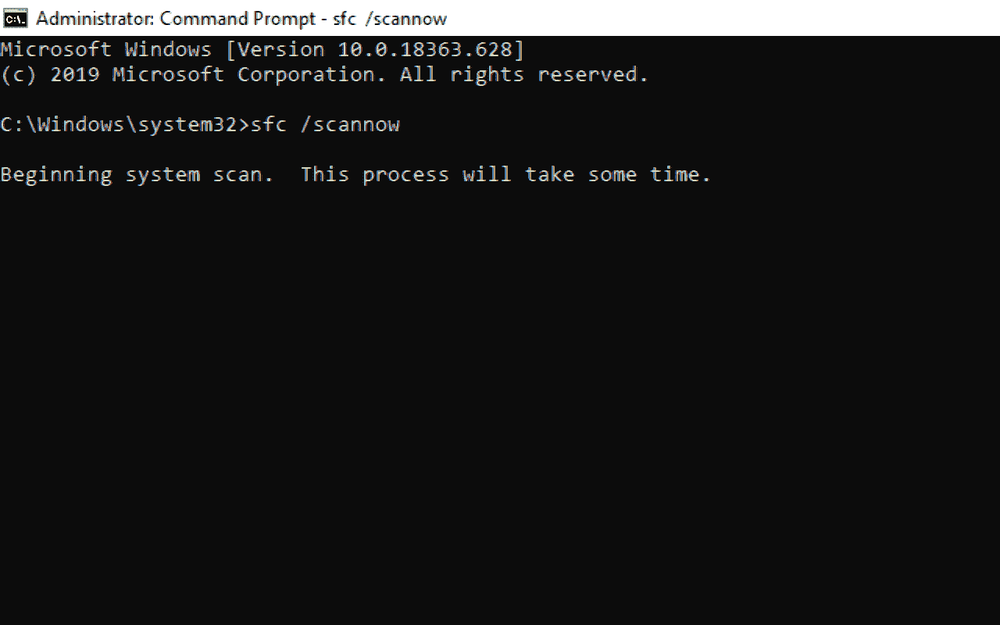
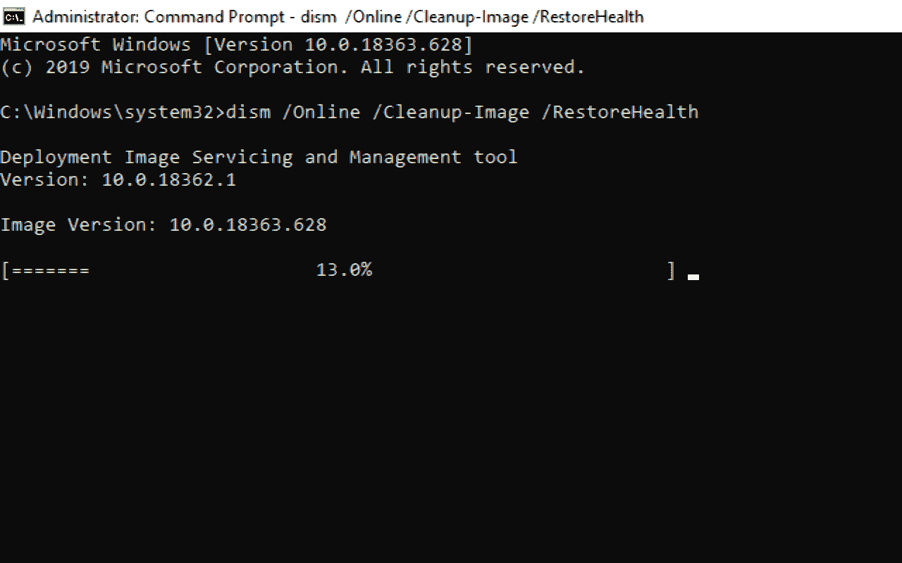

# 重置你的电脑时出现问题[在 Windows 10 上重置已修复的电脑]

> 原文：<https://www.freecodecamp.org/news/there-was-a-problem-with-resetting-your-pc-reset-pc-fixed-on-windows-10/>

您可能希望重置电脑的原因有很多。从恶意软件攻击到糟糕的电脑健康状况，或者你只是想重新开始——不胜枚举。

当您重置电脑时，可能会出现错误“重置电脑时出现问题”。此错误可能采取另一种形式，如“刷新您的电脑时出现问题”等。

如果您在尝试重置 Windows 10 电脑后遇到此问题，那么您来对地方了。因为，在这份详细的指南中，我将向你展示 4 种方法，你可以解决这个问题，并着手彻底重置你的电脑。

我将向您展示的三个解决方案需要管理员权限，并且将在命令行中完成，即使您的计算机陷入重置循环，您也可以随时访问命令行。

要访问陷入重置循环的 Windows 10 PC 上的命令行，请尝试执行启动修复(如果系统提示您这么做)，然后选择命令提示符

但是，如果您的计算机陷入了重置循环，您就不能以管理员的身份使用 GUI(图形用户界面)来打开命令提示符，那么您如何以管理员的身份使用命令行呢？执行命令`powershell "start cmd -v runAs"`。

## 如何修复错误“重置您的电脑时出现问题”

### 执行 SFC 扫描

系统文件检查器(SFC)扫描允许您执行基于命令行的扫描，查找并修复可能阻止计算机成功重置的损坏文件。

要执行 SFC 扫描，您需要遵循以下步骤:

**第一步**:点击键盘上的 `WIN`键，搜索“cmd”。然后选择右边的“以管理员身份运行”,以管理员身份使用命令提示符。确保在下一个提示中单击“是”。

**第二步**:在命令行中，键入`sfc /scannow`，点击`ENTER`。扫描可能需要 15 分钟以上，所以请耐心等待。

**步骤 3** :重启电脑，再次尝试复位。

如果这不能解决问题，请进行下一步修复——DISM 扫描。

### 进行 DISM 扫描

Microsoft 正式建议执行 DISM 扫描来解决此问题。

DISM 代表部署映像服务和管理工具。它是一个命令行可执行文件，可用于修复 Windows 映像和修改 Windows 安装介质。

以下步骤解释了如何运行 DISM 扫描:

**第一步**:点击键盘上的 `WIN`键，搜索“cmd”。然后选择右边的“以管理员身份运行”,以管理员身份使用命令提示符。确保在下一个提示中单击“是”。

**第二步:**粘贴`dism /Online /Cleanup-Image /RestoreHealth`并点击`ENTER`。这甚至比 SFC 扫描需要更多的时间，所以请耐心等待。

**步骤 3** :扫描完成后，重启电脑，再次尝试复位。

### 禁用并重新启用 ReAgentC.exe

REAgentC 是一个 Windows 恢复工具，当您的计算机无法启动时，它会尝试修复启动错误。

因为这是 REAgent.exe 做的，如果你的电脑无法重置，可能会有错误。因此，禁用并重新启用它可以解决您的问题。

您可以通过下面突出显示的步骤禁用和重新启用 REAgent.exe:

**第一步**:点击键盘上的 `WIN`键，搜索“cmd”。然后在右边选择以管理员身份运行。

第二步:输入`reagentc /disable`，点击`ENTER`，禁用 REAgent.exe

**第三步**:输入`reagentc /enable`，点击`ENTER`重新启用 REAgent.exe

**步骤 4** :重启电脑，再次尝试复位。

### 从 Windows 安全性刷新 Windows

在进行此修复之前，请确保您的文件已备份。

Windows Security(以前的 Windows Defender)是众所周知的针对 Windows 10 电脑的强大防病毒程序，但它还有更多功能。

借助 Windows Security，您可以让您的 Windows 10 电脑有一个全新的开始。以下步骤向您展示了如何做到这一点。

**第一步**:在键盘上按`WIN` (Windows logo 键)+ I 启动设置。

**步骤 2** :从菜单块中选择更新和安全。

**第三步**:切换到左侧的 Windows 安全选项卡，选择“设备性能&健康”。

**第 5 步**:点击“重新开始”下的“附加信息”链接。

**第六步:**点击“开始”按钮。

**第 7 步**:按照提示的其余部分使用 Windows 安全更新您的电脑。

## 最后的话

本指南向您介绍了在电脑无法正常复位时修复电脑的几种方法。现在，希望你可以重新设置你的电脑，并开始再次使用它成功。

作为最后一招，如果在尝试了本文中建议的修复后仍然出现错误，您可以从可启动的 USB 驱动器或 DVD 安装全新的 Windows 10 操作系统。事实上，有些错误不会消失，除非你这样做。

请注意，您也可能在 Windows 8 和 8.1 上遇到此问题，因此您可以应用本文中建议的相同修复方法。