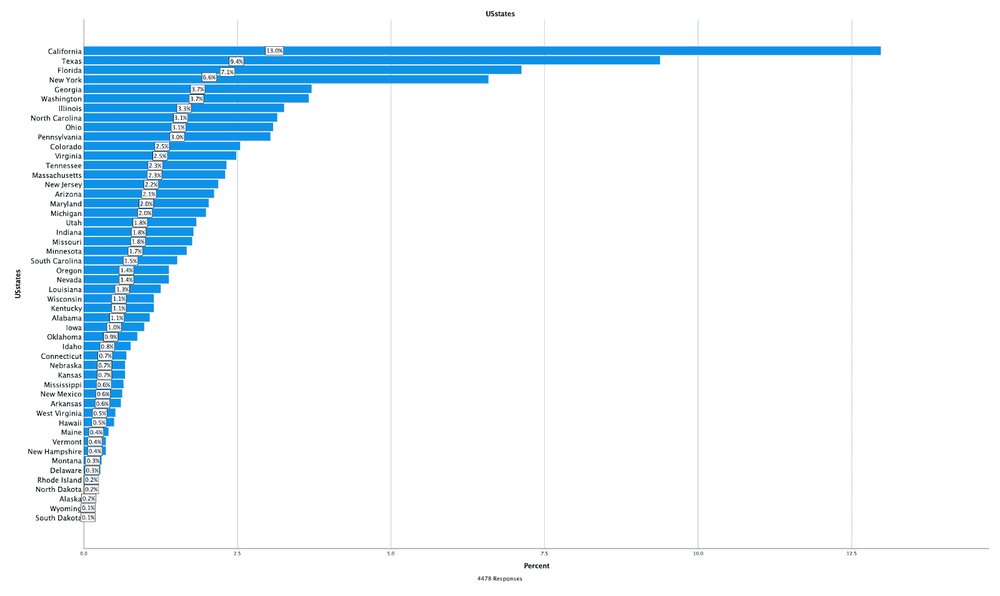
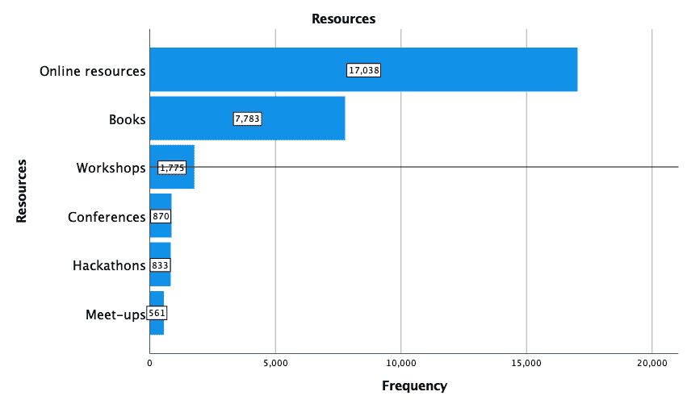
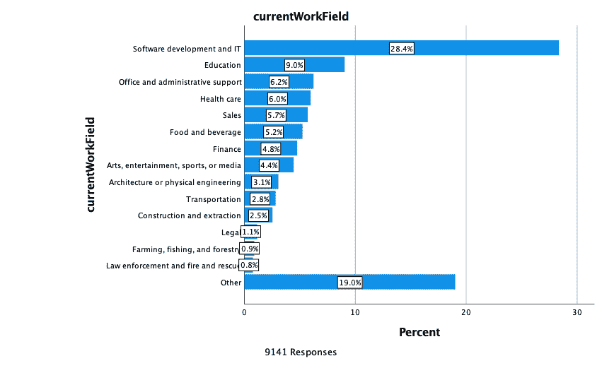
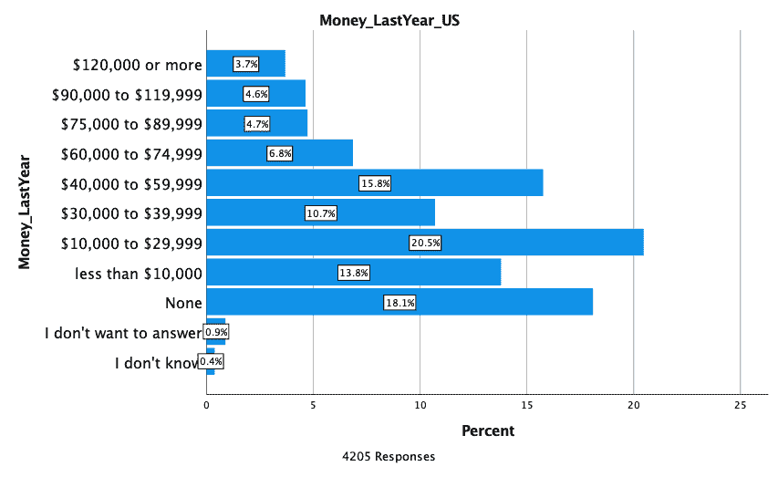
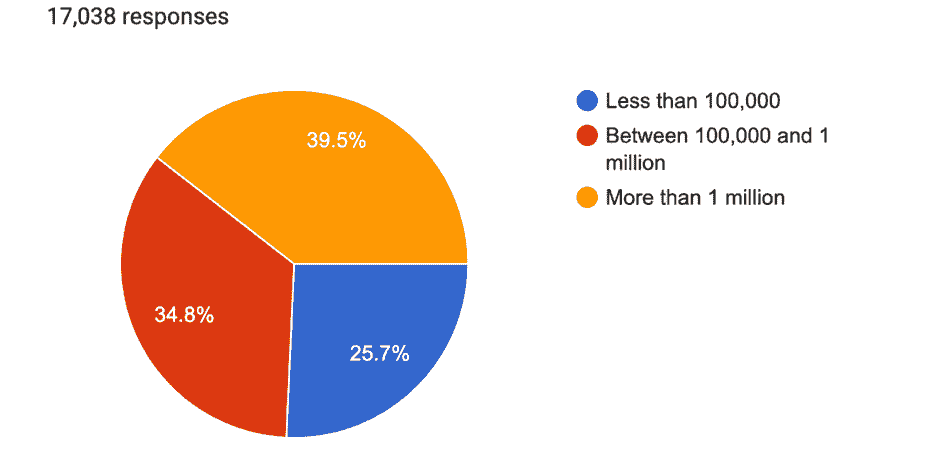

# 2021 年新程序员调查——超过 18，000 人分享了他们学习编码的方式和原因

> 原文：<https://www.freecodecamp.org/news/2021-new-coder-survey-18000-people-share-how-theyre-learning-to-code/>

超过 18，000 人参与了 2021 年 freeCodeCamp New Coder 调查。这让我们对世界各地成千上万的人如何学习编码，以及他们为什么选择这样做有了深入的了解。

我们已经在 [GitHub](https://github.com/freeCodeCamp/2021-new-coder-survey) 和 [Kaggle](https://www.kaggle.com/fccuser/2021-new-coder-survey) 上发布了参与者对我们提出的 49 个问题的回答的完整数据集。

在接下来的几个月里，数十名数据科学家、数据爱好者和研究人员(包括我自己)将对数据进行大量分析，并发现关于学习编码的人的各种见解。

现在，我会给你一个新的编码员当前状态的大图。我将重点介绍他们是谁，他们是如何学习的，他们的职业目标是什么。

另外，在本文的后半部分，我将分享我正在进行的定性研究的见解，并告诉你一些新程序员正在采用的学习策略。

## 谁是新的编码员？

新编码员生活在世界各地。

生活在美国的新程序员不一定来自技术中心地区:

他们的平均年龄是 25 岁。大约 28%的新编码员认为自己是女性、非双性恋、跨性别者或性别流动者。70%的人认为自己是男人，剩下的 2%不愿意说。

以下是全球新程序员自我报告的种族和民族构成:

这是美国新程序员的种族和民族构成:

开始编码不到 5 年的新编码员平均编码时间为 9.5 个月。他们编码的平均月数是 3 个月。

他们每周花在学习上的时间中位数是 8 小时。

只有 10%的受访者已经在从事开发工作。

大约 90%尚未成为开发人员的人对开发人员的工作感兴趣。

对开发人员工作感兴趣的人中，约 33%已经申请或计划在未来 6 个月内申请开发人员工作，而 31%尚未决定。

他们中的大多数都愿意搬迁，或者会考虑搬迁。

至少 45%的新程序员目前在从事某种工作。

43%的新程序员至少拥有学士学位。

只有 20.5%的新程序员学习了计算机科学、计算机工程或软件工程。

## 新程序员如何学习编码

新程序员在学习编码时最常使用在线资源。以下是他们使用的一些资源:

他们认为最有用的在线资源是:

新编码员最喜欢的编码相关 YouTube 频道有:

1，831 名新编码员告诉了我们他们最喜欢的编码相关播客。以下是前五名:

*   代码新手播客
*   跟我学代码
*   Syntax.fm
*   黑暗网络日记
*   跟我说说 Python

## 为什么人们在学习编码

超过 2/3 的新程序员学习编码是为了建立一个新的职业，开始一项业务或他们的第一个职业，或自由职业者。

### 新的程序员职业期望

我们要求新程序员选择最多 3 个他们对软件开发职业感兴趣的原因。以下是他们最常提到的原因:

约 55%的人希望为跨国、中型或初创公司工作。28.5%的人更愿意从事自由职业或自己创业。

在对软件开发职业感兴趣的人中，超过 1/3 的人对全栈 Web 开发感兴趣。

超过 93%的人希望每周至少有一天在家工作。

在他们的第一份开发工作中，全球新的程序员希望:

但是由于不同国家的工资和生活成本差异很大，关注一个国家会更有帮助。

在美国，39.5%的新程序员希望在他们的第一份开发工作中挣 5 万到 7.5 万美元。

## 新程序员的当前职业

目前从事不同领域工作的新程序员。

至少 51%的人没有足够的存款在没有收入的情况下生存 3 个月。

这是他们去年的收入:

这是去年美国新程序员的收入。大多数人年收入不到 4 万美元。

## 更多新编码器人口统计数据

对于大约 60%的新程序员来说，英语是他们的第二语言。

*   22%是他们国家的少数民族。
*   大约 75%的人生活在大城市。

*   大约 72%的人是单身，从未结过婚。
*   82%没有孩子
*   17.5%的人家里没有高速互联网。
*   5.6%的人曾在本国军队服役。
*   2.5%的人领取残疾津贴。

## 定性研究的启示

你们有些人可能已经知道，我是波士顿大学的社会学博士候选人。作为我博士论文研究的一部分，许多新的编码员欣然同意与我分享他们的编码之旅。

因此，在过去的五个月里，我有机会与美国各地那些没有计算机科学学位却在学习编程的了不起的人见面并聊天。

作为一名混合方法研究者，我重视将调查揭示的更大模式与定性访谈提供的深入见解结合起来的社会科学。

不过，有一点需要注意。定性数据需要太多时间来收集和分析——尤其是如果你像我一样喜欢观察时间的变化。然而，当我写这篇文章来描述对新程序员当前状态的高级分析时，我忍不住加入了一些关于他们学习策略的定性见解。

### 新程序员怎么找时间学习？

许多程序员有全职工作和/或照顾他们的孩子和其他家属的责任。那么，他们如何腾出时间来学习编码呢？

学习编码确实需要韧性、努力和牺牲。事实证明，在新程序员中，凌晨 4 点起床，赶在一天的高峰到来之前练习编码并不少见。他们还倾向于将任何可能的停机时间都用于编码:

> “…如果我在工作中有休息时间，我也会乘地铁去上班，所以当我在火车上的时候。。。只需要上小班课，做些小测验。”

> “我醒得很早。我通常早上 4 点左右醒来。。。有时在午餐时，你知道，我通常有 30 分钟到一个小时的午餐时间，我会吃得很快，我可以使用我的手机或笔记本电脑，我可以练习编码，有时甚至一次 10 或 15 分钟。有时候也就 5 分钟。”

有些人采用更有创造性的方法来腾出时间学习。Barb 是一位年轻的母亲，有两个蹒跚学步的孩子和一个 5 岁的孩子，她最近也从 Covid 中恢复过来，她将自己的学习、儿童护理和恢复融入到一项活动中:

> “每当我读书的时候，我都会大声朗读。此外，对于肺部，我必须做肺部康复。所以，这实际上很棒，你知道，有点一石三鸟的感觉。因为这有助于我学会更自然地说话，调整自己的节奏。而且，这也有助于培养孩子们的早期读写能力。
> 
> *读书的孩子到上幼儿园时能多获得 140 万个单词，比不读书的孩子要多。这有助于我真正坐下来学习，因为我不仅仅是为自己读书，我也在为他们读书。我们开始讨论一些有趣的话题，我想说，它们吸收的东西比我想象的要多。”*

### 新程序员从事什么样的项目？

新程序员的第一个项目是他们新获得的技术技能和他们长期的兴趣和专业知识相结合的产物。

他们从事的项目从为他们的副业创建互动网站到构建音乐、精神健康或自然探险目的地应用程序。

亨利将自己对 Python 和骰子游戏的兴趣与和 7 岁女儿共度美好时光的快乐结合在一起。由于疫情事件，父亲和女儿休假几周后，开始创造一个简单的骰子游戏，并在几周内不断修改和开发:

> “我的意思是这是你一生中见过的最基本的东西。我们回去后，我们改变了一些编码，使之更具互动性。你知道，我们加入了一些声音和音频，然后试图整合一些视频。只是，很有趣。。。。我真的很想尽可能多地学习一切。”

如果你曾经听过或读到过一个软件开发人员谈论他们的工作，你一定很熟悉这句话“我喜欢解决问题！”

我交谈过的新程序员也喜欢解决问题，但他们也做其他事情:凭借他们不同的背景、兴趣和专业知识，他们认识到了以前没有认识到的现实生活中的问题。

拥有语言学和哲学背景的凯文对语言学习应用有了新的看法。他的应用语言学知识使他能够以不同的方式处理单词匹配算法，以改善第二/第三语言学习体验。

Barb 的激情项目是她为儿子编写的一款游戏，目的是帮助他更好地学习，因为她发现阅读书籍可能不是他学习的最佳方式。而且成功了！这也适用于许多其他孩子。

我很高兴能继续关注这些新的开发人员，看到他们的观点有助于、重塑和改进我们使用的技术和产品。

## 更多即将推出

此处的调查结果仅代表一些描述性分析。我们希望尽快与您分享调查结果，但是还有更多信息要告诉您！

我将继续调查，做更多的统计分析，并与大家分享这些见解。然而，如果你是一个数据爱好者，不要等我，继续，运行你自己的分析，并与我们分享！同样，你可以在 [GitHub](https://github.com/freeCodeCamp/2021-new-coder-survey) 或 [Kaggle](https://www.kaggle.com/fccuser/2021-new-coder-survey) 上访问数据集。

如果你对我的研究和描述性快照之外的定性结果感兴趣，请继续关注——告诉过你，这需要时间！

感谢所有这些善良的人们，他们如此慷慨地继续与我分享他们的经历。我正在接近回答一个很多人都想知道的问题:*成为一名自学成才的开发人员需要什么？*