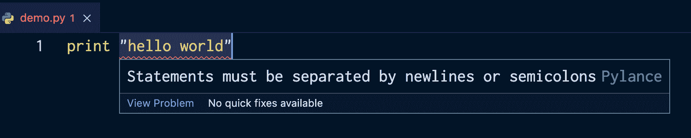

# Python 打印变量——如何打印字符串和变量

> 原文：<https://www.freecodecamp.org/news/python-print-variable-how-to-print-a-string-and-variable/>

Python 是一种通用而灵活的语言——通常有不止一种方法来实现某个目标。

在本教程中，你将看到一些你可以一起打印一个字符串和一个变量的方法。

我们开始吧！

## 如何使用 Python 中的`print()`函数

要在 Python 中打印任何内容，可以使用`print()`函数——即`print`关键字后跟一组左括号和右括号`()`。

```
#how to print a string
print("Hello world")

#how to print an integer
print(7)

#how to print a variable 
#to just print the variable on its own include only the name of it

fave_language = "Python"
print(fave_language)

#output

#Hello world
#7
#Python 
```

如果省略括号，将会得到一个错误:

```
print "hello world"

#output after running the code:
#File "/Users/dionysialemonaki/python_articles/demo.py", line 1
#    print "hello world"
#    ^^^^^^^^^^^^^^^^^^^
#SyntaxError: Missing parentheses in call to 'print'. Did you mean print(...)? 
```

如果你用 Visual Studio 代码编写你的 Python 代码，用 [Python 扩展](https://marketplace.visualstudio.com/items?itemName=ms-python.python)，你也会得到一个下划线和一个提示，它们都表明有些事情不太对劲:



如上所述，print 语句用于输出各种信息。这包括文本和数字数据、变量和其他数据类型。

您还可以在一条语句中打印与变量组合的文本(或字符串)。

在接下来的章节中，您将看到一些不同的方法。

## 如何在 Python 中使用串联打印变量和字符串

根据字典，concatenate 的意思是将(事物)连成一串。

您可以通过使用 Python 加法运算符`+`将各种东西(在本例中是编程——您添加数据)加在一起来实现这一点。

请记住，串联仅用于字符串，因此如果您想要与其余字符串串联的变量是整数数据类型，您必须使用`str()`函数将其转换为字符串。

在下面的例子中，我想打印一个变量的值和一些其他的文本。

我将双引号中的字符串和变量名称加在一起，并使用加法运算符将它们连接在一起:

```
fave_language = "Python"

print("I like coding in " + fave_language + " the most")

#output
#I like coding in Python the most 
```

对于字符串连接，您必须自己添加空格，因此，如果在前面的示例中，我没有在引号中包含任何空格，输出将如下所示:

```
fave_language = "Python"

print("I like coding in" + fave_language + "the most")

#output
#I like coding inPythonthe most 
```

您甚至可以单独添加空格:

```
fave_language = "Python"

print("I like coding in" + " " + fave_language + " "  + "the most")

#output
#I like coding in Python the most 
```

这不是打印字符串和变量的最佳方式，因为它容易出错，而且很耗时。

## 如何在 Python 中通过用逗号分隔变量和字符串来打印它们

您可以在一个 print 语句中打印变量旁边的文本，用逗号分隔。

```
first_name = "John"

print("Hello",first_name)

#output
#Hello John 
```

在上面的例子中，我首先在双引号中包含了一些我想打印的文本——在这个例子中，文本是字符串`Hello`。

在右引号之后，我添加了一个逗号，将这段文本与变量名(在本例中为`first_name`)中的值分开，然后我将变量名包含在变量名中。

我可以在变量后面添加更多的文本，如下所示:

```
first_name = "John"

print("Hello",first_name,"good to see you")

#output
#Hello John good to see you 
```

此方法也适用于多个变量:

```
first_name = "John"
last_name = "Doe"

print("Hello",first_name,last_name,"good to see you")

#output
Hello John Doe good to see you 
```

确保用逗号分隔所有内容。

所以，你用逗号把文本和变量分开，也把变量和其他变量分开，就像上面显示的那样。

如果没有在`first_name`和`last_name`之间添加逗号，代码就会抛出一个错误:

```
first_name = "John"
last_name = "Doe"

print("Hello",first_name last_name,"good to see you")

#output
#File "/Users/dionysialemonaki/python_articles/demo.py", line 4
#    print("Hello",first_name last_name,"good to see you")
#                 ^^^^^^^^^^^^^^^^^^^^
#SyntaxError: invalid syntax. Perhaps you forgot a comma? 
```

如您所见，Python 错误消息非常有用，并使调试过程变得更加容易:)

## 如何使用字符串格式在 Python 中打印变量和字符串

您可以通过在想要添加变量值的位置包含一组左花括号和右花括号`{}`来使用字符串格式。

```
first_name = "John"

print("Hello {}, hope you're well!") 
```

在这个例子中有一个变量`first_name`。

在 print 语句中，需要打印的文本有一组左右双引号。

在里面，我在想要添加变量`first_name`的地方添加了一组花括号。

如果我尝试运行这段代码，它会有以下输出:

```
#output
#Hello {}, hope you're well! 
```

它实际上并不打印`first_name`的值！

要打印它，我需要在字符串的末尾添加`.format()`字符串方法——就在右引号之后:

```
first_name = "John"

print("Hello {}, hope you're well!".format(first_name))

#output
#Hello John, hope you're well! 
```

当有多个变量时，可以使用与要打印的变量数量一样多的花括号:

```
first_name = "John"
last_name = "Doe"

print("Hello {} {}, hope you're well!") 
```

在这个例子中，我创建了两个变量，我想一个接一个地打印它们，所以我在需要替换变量的地方添加了两组花括号。

现在，当谈到`.format()`方法时，变量名在里面的放置顺序很重要。

因此，方法中首先添加的变量名的值将位于第一个花括号的位置，其次添加的变量名的值将位于第二个花括号的位置，依此类推。

确保在方法中用逗号分隔变量名:

```
first_name = "John"
last_name = "Doe"

print("Hello {} {}, hope you're well!".format(first_name,last_name))

#output
#Hello John Doe, hope you're well! 
```

如果我颠倒了方法中名称的顺序，输出会有所不同:

```
first_name = "John"
last_name = "Doe"

print("Hello {} {}, hope you're well!".format(last_name,first_name))

#output
#Hello Doe John, hope you're well! 
```

## 如何使用`f-strings`在 Python 中打印变量和字符串

与我们在上一节中看到的方法相比,`f-strings`是一种更好、更易读、更简洁的实现字符串格式化的方法。

语法更简单，需要更少的手工操作。

创建`f-string`的一般语法如下:

```
print(f"I want this text printed to the console!")

#output
#I want this text printed to the console! 
```

首先在`print()`函数中，在左引号和右引号前包含字符`f`。

要在一行中打印一个包含字符串的变量，您需要在相同的位置再次包含字符`f`——就在引号之前。

然后，在引号内添加所需的文本，并在要添加变量值的地方添加一组大括号，其中包含变量名:

```
first_name = "John"

print(f"Hello, {first_name}!")

#output
#Hello, John! 
```

要打印不止一个变量，您添加另一组花括号，第二个变量名为:

```
first_name = "John"
last_name = "Doe"

print(f"Hello, {first_name} {last_name}!")

#output
#Hello, John Doe! 
```

放置变量名的顺序很重要，所以要确保根据您想要的输出添加它们。

如果我颠倒了名称的顺序，我会得到以下输出:

```
first_name = "John"
last_name = "Doe"

print(f"Hello, {last_name} {first_name}!")

#output
#Hello, Doe John! 
```

## 结论

感谢阅读并坚持到最后！现在，您已经知道了在 Python 中将字符串和变量打印在一行中的几种不同方式。

如果你想了解更多关于 Python 的知识，可以查看 freeCodeCamp 的 [Python 认证](https://www.freecodecamp.org/learn/scientific-computing-with-python/)。

它适合初学者，因为它从基础开始，逐步建立更高级的概念。你还将建立五个项目，并把你学到的所有新知识付诸实践。

编码快乐！